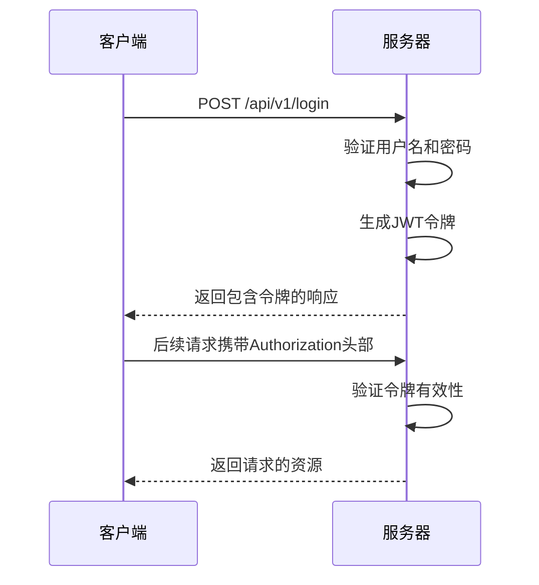
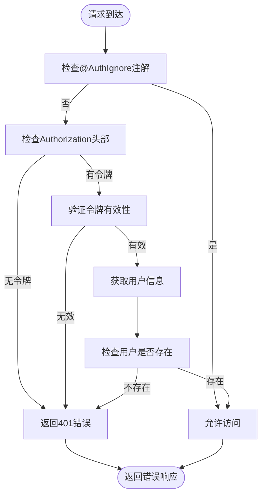
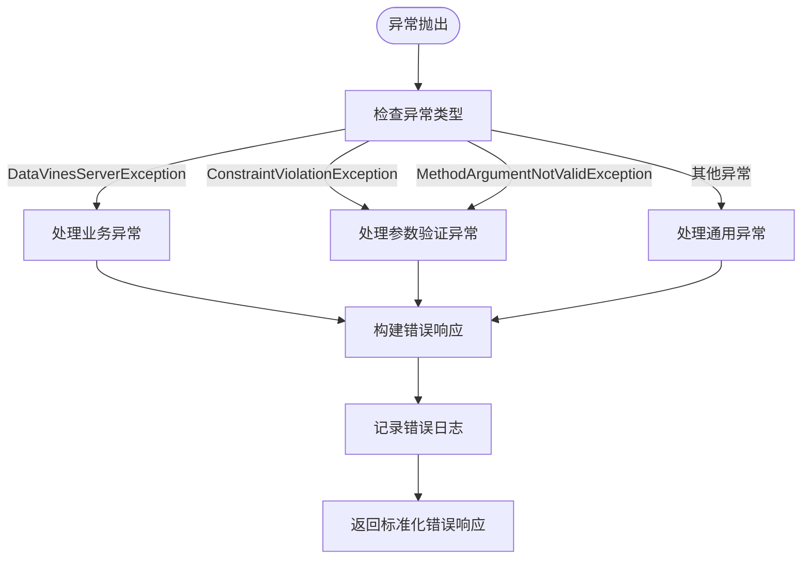

# API参考

<cite>
**本文档中引用的文件**  
- [LoginController.java](file://datavines-server/src/main/java/io/datavines/server/api/controller/LoginController.java)
- [UserController.java](file://datavines-server/src/main/java/io/datavines/server/api/controller/UserController.java)
- [WorkSpaceController.java](file://datavines-server/src/main/java/io/datavines/server/api/controller/WorkSpaceController.java)
- [DataSourceController.java](file://datavines-server/src/main/java/io/datavines/server/api/controller/DataSourceController.java)
- [JobController.java](file://datavines-server/src/main/java/io/datavines/server/api/controller/JobController.java)
- [JobExecutionController.java](file://datavines-server/src/main/java/io/datavines/server/api/controller/JobExecutionController.java)
- [OpenApiController.java](file://datavines-server/src/main/java/io/datavines/server/api/controller/OpenApiController.java)
- [AuthenticationInterceptor.java](file://datavines-server/src/main/java/io/datavines/server/api/inteceptor/AuthenticationInterceptor.java)
- [DataVinesExceptionHandler.java](file://datavines-server/src/main/java/io/datavines/server/api/inteceptor/DataVinesExceptionHandler.java)
- [ResultMap.java](file://datavines-core/src/main/java/io/datavines/core/entity/ResultMap.java)
- [DataVinesConstants.java](file://datavines-core/src/main/java/io/datavines/core/constant/DataVinesConstants.java)
- [Status.java](file://datavines-core/src/main/java/io/datavines/core/enums/Status.java)
- [DataVinesSwaggerConfig.java](file://datavines-server/src/main/java/io/datavines/server/api/config/DataVinesSwaggerConfig.java)
- [UserLogin.java](file://datavines-server/src/main/java/io/datavines/server/api/dto/bo/user/UserLogin.java)
- [WorkSpaceCreate.java](file://datavines-server/src/main/java/io/datavines/server/api/dto/bo/workspace/WorkSpaceCreate.java)
- [DataSourceCreate.java](file://datavines-server/src/main/java/io/datavines/server/api/dto/bo/datasource/DataSourceCreate.java)
- [JobCreate.java](file://datavines-server/src/main/java/io/datavines/server/api/dto/bo/job/JobCreate.java)
- [SubmitJob.java](file://datavines-common/src/main/java/io/datavines/common/entity/job/SubmitJob.java)
</cite>

## 目录
1. [简介](#简介)
2. [API基础信息](#api基础信息)
3. [认证与授权](#认证与授权)
4. [API版本策略](#api版本策略)
5. [错误处理](#错误处理)
6. [核心API端点](#核心api端点)
7. [API使用示例](#api使用示例)
8. [客户端开发指导](#客户端开发指导)

## 简介
DataVines提供了一套完整的RESTful API接口，用于管理和操作数据质量检查系统。本API参考文档全面记录了所有可用的API端点，包括用户管理、工作空间管理、数据源管理、作业管理、执行控制等功能。API设计遵循REST原则，使用JSON格式进行数据交换，并通过标准HTTP状态码和自定义错误码提供清晰的响应信息。

**API特点：**
- 基于Spring Boot和Swagger构建
- 使用JWT进行身份验证
- 支持OpenAPI 2.0规范
- 提供详细的错误信息和状态码
- 支持外部系统集成

## API基础信息

### 基础URL
所有API端点的基础URL为：
```
http://<server>:<port>/api/v1
```

其中`<server>`是DataVines服务器地址，`<port>`是服务端口（默认为56001）。

### HTTP方法
API使用标准的HTTP方法：
- `GET`：获取资源
- `POST`：创建资源或执行操作
- `PUT`：更新资源
- `DELETE`：删除资源

### 内容类型
所有请求和响应的内容类型均为`application/json`。

### 请求头
| 头部名称 | 描述 | 是否必需 |
|---------|------|---------|
| Authorization | Bearer令牌，用于身份验证 | 是（除登录等公开接口外） |
| Content-Type | 请求内容类型，应设置为application/json | 是 |

### 响应结构
所有API响应都遵循统一的响应格式，由`ResultMap`类定义：

```json
{
  "code": 200,
  "msg": "Success",
  "data": {},
  "token": "optional_token"
}
```

**字段说明：**
- `code`：状态码，200表示成功，其他值表示错误
- `msg`：消息描述，成功时为"Success"，错误时为具体的错误信息
- `data`：实际返回的数据，如果无数据则为"{}"
- `token`：可选的JWT令牌，仅在登录等需要认证的接口返回

**Section sources**
- [ResultMap.java](file://datavines-core/src/main/java/io/datavines/core/entity/ResultMap.java)
- [DataVinesConstants.java](file://datavines-core/src/main/java/io/datavines/core/constant/DataVinesConstants.java)

## 认证与授权

### 认证机制
DataVines使用基于JWT（JSON Web Token）的认证机制。用户通过登录接口获取令牌，后续请求需要在`Authorization`头部中携带该令牌。

#### 登录流程
1. 用户通过`/api/v1/login`端点提交用户名和密码
2. 服务器验证凭据，生成JWT令牌
3. 令牌通过响应返回给客户端
4. 客户端在后续请求的`Authorization`头部中携带`Bearer <token>`



**Diagram sources**
- [LoginController.java](file://datavines-server/src/main/java/io/datavines/server/api/controller/LoginController.java)
- [AuthenticationInterceptor.java](file://datavines-server/src/main/java/io/datavines/server/api/inteceptor/AuthenticationInterceptor.java)

### 权限控制
系统通过拦截器实现权限控制，主要机制包括：

1. **公开接口**：使用`@AuthIgnore`注解标记，无需认证即可访问
2. **认证接口**：需要有效的JWT令牌
3. **令牌验证**：拦截器验证令牌的有效性和用户状态



**Diagram sources**
- [AuthenticationInterceptor.java](file://datavines-server/src/main/java/io/datavines/server/api/inteceptor/AuthenticationInterceptor.java)

### 令牌管理
- **令牌格式**：`Bearer <token>`，符合RFC 6750标准
- **令牌有效期**：系统自动管理令牌的刷新和过期
- **令牌刷新**：通过`@RefreshToken`注解实现自动刷新机制

**Section sources**
- [AuthenticationInterceptor.java](file://datavines-server/src/main/java/io/datavines/server/api/inteceptor/AuthenticationInterceptor.java)
- [DataVinesConstants.java](file://datavines-core/src/main/java/io/datavines/core/constant/DataVinesConstants.java)

## API版本策略

### 版本控制
API采用URL路径进行版本控制，当前版本为v1：

```
/api/v1/<resource>
```

### 向后兼容性
DataVines承诺保持向后兼容性，具体策略如下：

1. **功能添加**：新增功能不会影响现有API
2. **字段添加**：响应中可能添加新字段，但不会删除或修改现有字段
3. **弃用通知**：计划弃用的API会提前通知，并保持一段时间的兼容性
4. **版本升级**：重大变更将通过版本号升级（如v2）来标识

### 版本迁移
当需要升级到新版本时：
1. 检查API文档中的变更日志
2. 测试新版本的兼容性
3. 逐步迁移客户端代码
4. 监控迁移过程中的错误

**Section sources**
- [DataVinesConstants.java](file://datavines-core/src/main/java/io/datavines/core/constant/DataVinesConstants.java)

## 错误处理

### 错误响应格式
当请求失败时，API返回标准化的错误响应：

```json
{
  "code": 400,
  "msg": "Bad Request",
  "data": "{}"
}
```

### 常见错误码
| 状态码 | 错误码 | 描述 | 解决方案 |
|-------|-------|------|---------|
| 200 | 200 | 成功 | 无需处理 |
| 400 | 10010001 | 请求错误 | 检查请求参数和格式 |
| 401 | 10010002 | 无效的令牌 | 重新登录获取新令牌 |
| 401 | 10010003 | 令牌为空 | 在请求头中添加Authorization |
| 401 | 10010004 | 请登录 | 执行登录操作 |
| 400 | 10020001 | 用户名已被注册 | 使用其他用户名 |
| 400 | 11010001 | 工作空间已存在 | 使用其他名称 |
| 400 | 12010001 | 数据源已存在 | 使用其他名称 |
| 400 | 14010003 | 作业不存在 | 检查作业ID |

### 错误处理机制
系统通过全局异常处理器`DataVinesExceptionHandler`统一处理各种异常：



**Diagram sources**
- [DataVinesExceptionHandler.java](file://datavines-server/src/main/java/io/datavines/server/api/inteceptor/DataVinesExceptionHandler.java)
- [Status.java](file://datavines-core/src/main/java/io/datavines/core/enums/Status.java)

### 参数验证
API使用JSR-303 Bean Validation进行参数验证，常见验证注解包括：
- `@NotBlank`：字符串不能为空
- `@NotNull`：对象不能为空
- `@Pattern`：字符串需匹配正则表达式
- `@Valid`：验证嵌套对象

**Section sources**
- [DataVinesExceptionHandler.java](file://datavines-server/src/main/java/io/datavines/server/api/inteceptor/DataVinesExceptionHandler.java)
- [Status.java](file://datavines-core/src/main/java/io/datavines/core/enums/Status.java)

## 核心API端点

### 用户管理API
管理用户账户和认证。

#### 登录
- **HTTP方法**: POST
- **URL**: `/api/v1/login`
- **描述**: 用户登录系统
- **请求体**:
```json
{
  "username": "string",
  "password": "string"
}
```
- **响应**:
```json
{
  "code": 200,
  "msg": "Success",
  "data": {},
  "token": "jwt_token"
}
```

#### 注册
- **HTTP方法**: POST
- **URL**: `/api/v1/register`
- **描述**: 新用户注册
- **请求体**:
```json
{
  "username": "string",
  "password": "string",
  "email": "string",
  "verificationCode": "string",
  "verificationCodeJwt": "string"
}
```

#### 重置密码
- **HTTP方法**: POST
- **URL**: `/api/v1/user/resetPassword`
- **描述**: 重置用户密码
- **请求体**:
```json
{
  "username": "string",
  "oldPassword": "string",
  "newPassword": "string",
  "confirmPassword": "string"
}
```

**Section sources**
- [LoginController.java](file://datavines-server/src/main/java/io/datavines/server/api/controller/LoginController.java)
- [UserController.java](file://datavines-server/src/main/java/io/datavines/server/api/controller/UserController.java)
- [UserLogin.java](file://datavines-server/src/main/java/io/datavines/server/api/dto/bo/user/UserLogin.java)

### 工作空间管理API
管理用户的工作空间。

#### 创建工作空间
- **HTTP方法**: POST
- **URL**: `/api/v1/workspace`
- **描述**: 创建新的工作空间
- **请求体**:
```json
{
  "name": "string",
  "description": "string"
}
```
- **响应**: 工作空间ID

#### 获取工作空间列表
- **HTTP方法**: GET
- **URL**: `/api/v1/workspace/list`
- **描述**: 获取当前用户的所有工作空间
- **响应**: 工作空间对象数组

#### 邀请用户
- **HTTP方法**: POST
- **URL**: `/api/v1/workspace/inviteUser`
- **描述**: 邀请用户加入工作空间
- **请求体**:
```json
{
  "workspaceId": 0,
  "username": "string"
}
```

**Section sources**
- [WorkSpaceController.java](file://datavines-server/src/main/java/io/datavines/server/api/controller/WorkSpaceController.java)

### 数据源管理API
管理数据源连接和元数据。

#### 测试数据源连接
- **HTTP方法**: POST
- **URL**: `/api/v1/datasource/test`
- **描述**: 测试数据源连接是否有效
- **请求体**:
```json
{
  "type": "string",
  "parameters": {}
}
```

#### 创建数据源
- **HTTP方法**: POST
- **URL**: `/api/v1/datasource`
- **描述**: 创建新的数据源连接
- **请求体**:
```json
{
  "name": "string",
  "type": "string",
  "workSpaceId": 0,
  "parameters": {}
}
```

#### 获取数据库列表
- **HTTP方法**: GET
- **URL**: `/api/v1/datasource/{id}/databases`
- **描述**: 获取指定数据源的数据库列表
- **路径参数**: `id` - 数据源ID

#### 执行SQL脚本
- **HTTP方法**: POST
- **URL**: `/api/v1/datasource/execute`
- **描述**: 在指定数据源上执行SQL脚本
- **请求体**:
```json
{
  "dataSourceId": 0,
  "database": "string",
  "script": "string"
}
```

**Section sources**
- [DataSourceController.java](file://datavines-server/src/main/java/io/datavines/server/api/controller/DataSourceController.java)

### 作业管理API
管理数据质量检查作业。

#### 创建作业
- **HTTP方法**: POST
- **URL**: `/api/v1/job`
- **描述**: 创建新的数据质量检查作业
- **请求体**:
```json
{
  "name": "string",
  "type": 0,
  "dataSourceId": 0,
  "metricParameters": []
}
```

#### 获取作业列表
- **HTTP方法**: GET
- **URL**: `/api/v1/job/page`
- **描述**: 分页获取作业列表
- **查询参数**:
  - `searchVal`: 搜索关键字
  - `datasourceId`: 数据源ID
  - `pageNumber`: 页码
  - `pageSize`: 每页数量

#### 执行作业
- **HTTP方法**: POST
- **URL**: `/api/v1/job/execute/{id}`
- **描述**: 执行指定ID的作业
- **路径参数**: `id` - 作业ID

**Section sources**
- [JobController.java](file://datavines-server/src/main/java/io/datavines/server/api/controller/JobController.java)

### 作业执行API
管理作业的执行和监控。

#### 提交数据质量作业
- **HTTP方法**: POST
- **URL**: `/api/v1/job/execution/submit/data-quality`
- **描述**: 提交外部数据质量检查作业
- **请求体**: `SubmitJob`对象

#### 获取执行状态
- **HTTP方法**: GET
- **URL**: `/api/v1/job/execution/status/{executionId}`
- **描述**: 获取指定执行实例的状态
- **路径参数**: `executionId` - 执行ID

#### 终止执行
- **HTTP方法**: DELETE
- **URL**: `/api/v1/job/execution/kill/{executionId}`
- **描述**: 终止正在运行的作业执行
- **路径参数**: `executionId` - 执行ID

#### 获取执行结果
- **HTTP方法**: GET
- **URL**: `/api/v1/job/execution/list/result/{executionId}`
- **描述**: 获取作业执行的详细结果
- **路径参数**: `executionId` - 执行ID

**Section sources**
- [JobExecutionController.java](file://datavines-server/src/main/java/io/datavines/server/api/controller/JobExecutionController.java)

### OpenAPI端点
为外部系统集成提供的简化API。

#### 执行作业（OpenAPI）
- **HTTP方法**: POST
- **URL**: `/api/v1/openapi/job/execute/{id}`
- **描述**: 通过OpenAPI执行作业，需要`CheckTokenExist`验证
- **路径参数**: `id` - 作业ID

#### 终止执行（OpenAPI）
- **HTTP方法**: POST
- **URL**: `/api/v1/openapi/job/execution/kill/{executionId}`
- **描述**: 通过OpenAPI终止执行
- **路径参数**: `executionId` - 执行ID

**Section sources**
- [OpenApiController.java](file://datavines-server/src/main/java/io/datavines/server/api/controller/OpenApiController.java)

## API使用示例

### Python客户端示例
```python
import requests
import json

class DataVinesClient:
    def __init__(self, base_url, username, password):
        self.base_url = base_url
        self.username = username
        self.password = password
        self.token = None
        self.session = requests.Session()
        
    def login(self):
        """登录并获取令牌"""
        url = f"{self.base_url}/api/v1/login"
        payload = {
            "username": self.username,
            "password": self.password
        }
        
        response = self.session.post(url, json=payload)
        data = response.json()
        
        if data["code"] == 200:
            self.token = data["token"]
            # 设置默认头部
            self.session.headers.update({
                "Authorization": f"Bearer {self.token}",
                "Content-Type": "application/json"
            })
            return True
        else:
            raise Exception(f"登录失败: {data['msg']}")
    
    def create_workspace(self, name, description=""):
        """创建工作空间"""
        url = f"{self.base_url}/api/v1/workspace"
        payload = {
            "name": name,
            "description": description
        }
        
        response = self.session.post(url, json=payload)
        return response.json()
    
    def test_datasource_connection(self, datasource_params):
        """测试数据源连接"""
        url = f"{self.base_url}/api/v1/datasource/test"
        response = self.session.post(url, json=datasource_params)
        return response.json()

# 使用示例
client = DataVinesClient("http://localhost:56001", "admin", "admin")
client.login()

# 创建工作空间
workspace = client.create_workspace("测试工作空间", "用于API测试")
print(workspace)

# 测试MySQL连接
mysql_test = client.test_datasource_connection({
    "type": "mysql",
    "parameters": {
        "host": "localhost",
        "port": 3306,
        "username": "test",
        "password": "test"
    }
})
print(mysql_test)
```

### cURL示例
```bash
# 1. 登录获取令牌
TOKEN=$(curl -X POST "http://localhost:56001/api/v1/login" \
  -H "Content-Type: application/json" \
  -d '{"username":"admin","password":"admin"}' \
  | grep -o '"token":"[^"]*"' | cut -d'"' -f4)

echo "Token: $TOKEN"

# 2. 使用令牌创建工作空间
curl -X POST "http://localhost:56001/api/v1/workspace" \
  -H "Authorization: Bearer $TOKEN" \
  -H "Content-Type: application/json" \
  -d '{
    "name": "API测试空间",
    "description": "通过API创建的工作空间"
  }'

# 3. 获取工作空间列表
curl -X GET "http://localhost:56001/api/v1/workspace/list" \
  -H "Authorization: Bearer $TOKEN"
```

### Java客户端示例
```java
import org.springframework.web.client.RestTemplate;
import org.springframework.http.HttpEntity;
import org.springframework.http.HttpHeaders;
import org.springframework.http.MediaType;

public class DataVinesApiClient {
    private final String baseUrl;
    private final RestTemplate restTemplate;
    private String token;
    
    public DataVinesApiClient(String baseUrl) {
        this.baseUrl = baseUrl;
        this.restTemplate = new RestTemplate();
    }
    
    public boolean login(String username, String password) {
        String url = baseUrl + "/api/v1/login";
        LoginRequest request = new LoginRequest(username, password);
        
        try {
            ResultMap response = restTemplate.postForObject(url, request, ResultMap.class);
            if (response != null && response.getCode() == 200) {
                this.token = (String) response.get("token");
                return true;
            }
        } catch (Exception e) {
            System.err.println("登录失败: " + e.getMessage());
        }
        return false;
    }
    
    public ResultMap createWorkspace(String name, String description) {
        String url = baseUrl + "/api/v1/workspace";
        WorkSpaceCreate request = new WorkSpaceCreate();
        request.setName(name);
        request.setDescription(description);
        
        HttpHeaders headers = new HttpHeaders();
        headers.setContentType(MediaType.APPLICATION_JSON);
        headers.set("Authorization", "Bearer " + token);
        
        HttpEntity<WorkSpaceCreate> entity = new HttpEntity<>(request, headers);
        return restTemplate.postForObject(url, entity, ResultMap.class);
    }
}
```

**Section sources**
- [LoginController.java](file://datavines-server/src/main/java/io/datavines/server/api/controller/LoginController.java)
- [WorkSpaceController.java](file://datavines-server/src/main/java/io/datavines/server/api/controller/WorkSpaceController.java)

## 客户端开发指导

### 最佳实践
1. **错误处理**：始终检查响应的`code`字段，不要假设请求总是成功
2. **令牌管理**：妥善存储和管理JWT令牌，避免泄露
3. **重试机制**：对于临时性错误（如网络问题），实现指数退避重试
4. **连接池**：使用HTTP连接池提高性能
5. **超时设置**：设置合理的请求超时时间

### 性能优化
- **批量操作**：尽量使用批量API减少请求次数
- **缓存**：对不经常变化的数据进行本地缓存
- **并发请求**：对于独立的操作，使用并发请求提高效率
- **压缩**：启用GZIP压缩减少网络传输

### 安全建议
1. **HTTPS**：生产环境必须使用HTTPS加密通信
2. **令牌存储**：在安全的存储中保存令牌，避免明文存储
3. **最小权限**：使用具有最小必要权限的账户
4. **审计日志**：记录重要的API调用以供审计

### 调试技巧
1. **启用详细日志**：在开发环境中启用详细的HTTP日志
2. **使用Swagger UI**：通过Swagger UI直接测试API
3. **监控响应时间**：跟踪API调用的响应时间
4. **验证请求体**：确保请求体格式正确，特别是JSON结构

**Section sources**
- [DataVinesSwaggerConfig.java](file://datavines-server/src/main/java/io/datavines/server/api/config/DataVinesSwaggerConfig.java)