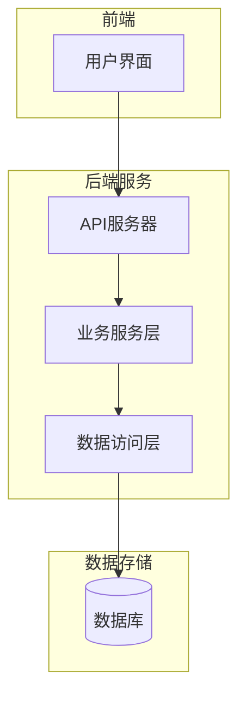
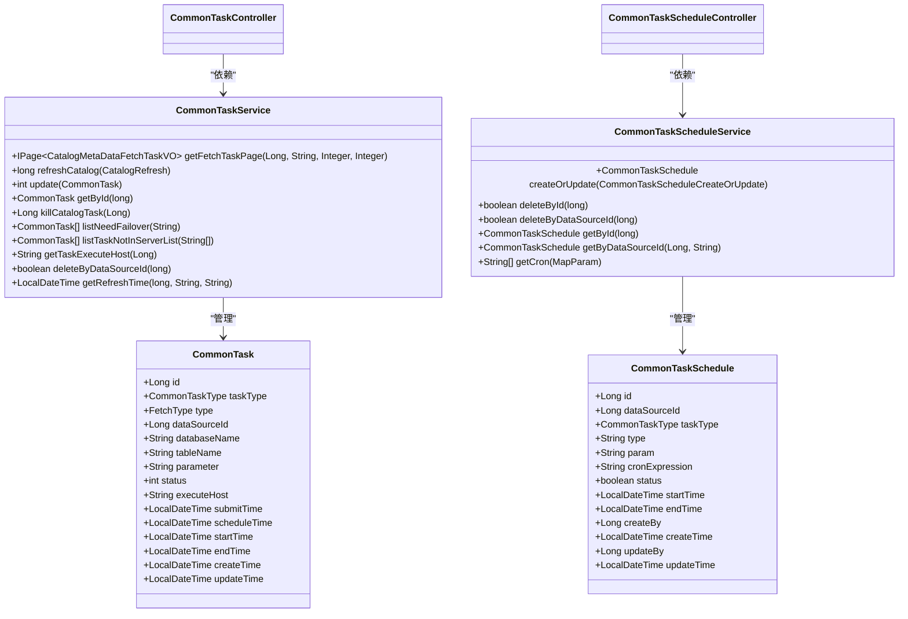
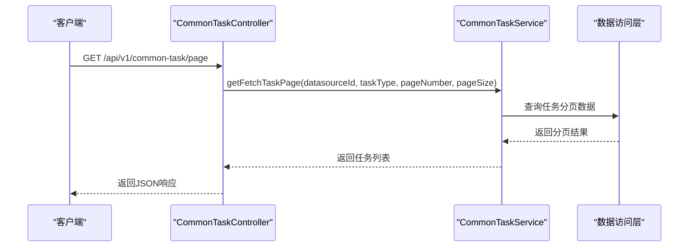
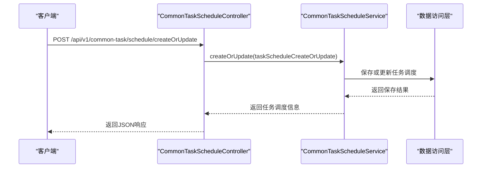
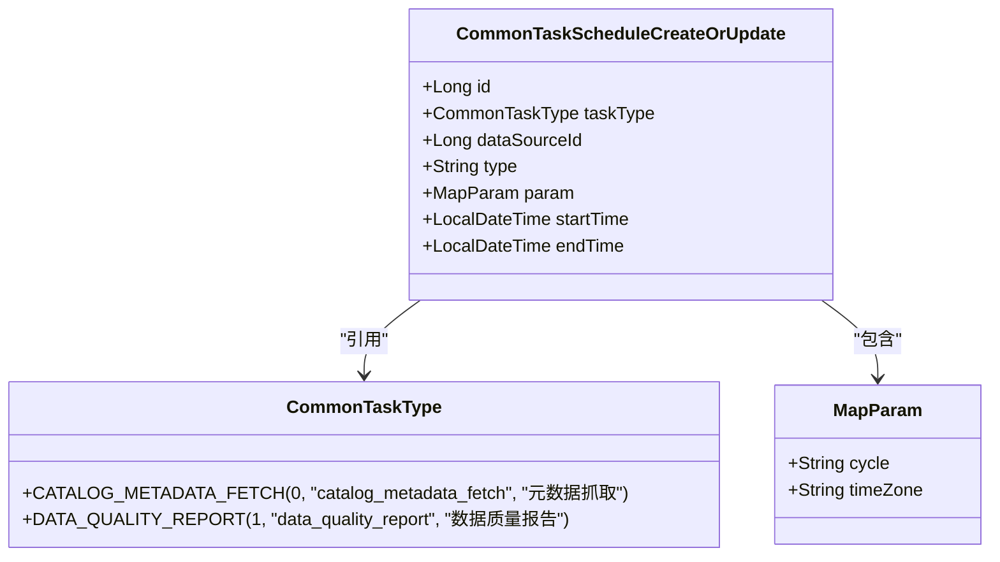
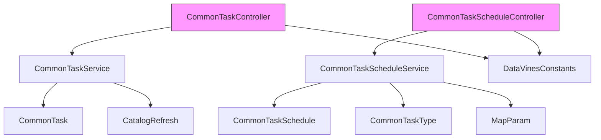

# 任务API

<cite>
**本文档中引用的文件**  
- [CommonTaskController.java](file://datavines-server/src/main/java/io/datavines/server/api/controller/CommonTaskController.java)
- [CommonTaskScheduleController.java](file://datavines-server/src/main/java/io/datavines/server/api/controller/CommonTaskScheduleController.java)
- [CommonTaskService.java](file://datavines-server/src/main/java/io/datavines/server/repository/service/CommonTaskService.java)
- [CommonTaskScheduleService.java](file://datavines-server/src/main/java/io/datavines/server/repository/service/CommonTaskScheduleService.java)
- [CommonTaskScheduleCreateOrUpdate.java](file://datavines-server/src/main/java/io/datavines/server/api/dto/bo/task/CommonTaskScheduleCreateOrUpdate.java)
- [CommonTask.java](file://datavines-server/src/main/java/io/datavines/server/repository/entity/CommonTask.java)
- [CommonTaskSchedule.java](file://datavines-server/src/main/java/io/datavines/server/repository/entity/CommonTaskSchedule.java)
- [CommonTaskType.java](file://datavines-server/src/main/java/io/datavines/server/enums/CommonTaskType.java)
</cite>

## 目录
1. [简介](#简介)
2. [项目结构](#项目结构)
3. [核心组件](#核心组件)
4. [架构概述](#架构概述)
5. [详细组件分析](#详细组件分析)
6. [依赖分析](#依赖分析)
7. [性能考虑](#性能考虑)
8. [故障排除指南](#故障排除指南)
9. [结论](#结论)

## 简介
本文档全面记录了与质量检查任务管理相关的所有RESTful接口。详细描述了创建、更新、删除、启动和查询质量检查任务的API端点，包括HTTP方法、URL路径、请求参数和请求体结构。文档化了任务配置的完整JSON结构，包括数据源选择、检查规则配置、预期值设置、通知策略等。提供了不同类型任务（单表检查、跨表检查等）的配置示例。解释了任务克隆、批量操作等高级功能的API使用方法。包含了任务状态转换的详细说明和相应的API调用方式。

## 项目结构
本项目采用模块化设计，主要分为以下几个核心模块：
- **datavines-common**: 提供通用配置、数据源连接、异常处理等基础功能
- **datavines-server**: 核心服务模块，包含API控制器、业务逻辑和服务层
- **datavines-metric**: 质量检查指标管理模块
- **datavines-notification**: 通知系统模块
- **datavines-connector**: 数据源连接器模块
- **datavines-engine**: 执行引擎模块

任务管理相关的API主要位于`datavines-server`模块中，通过Spring Boot框架提供RESTful服务。

**图表来源**  
- [CommonTaskController.java](file://datavines-server/src/main/java/io/datavines/server/api/controller/CommonTaskController.java#L29-L31)
- [CommonTaskScheduleController.java](file://datavines-server/src/main/java/io/datavines/server/api/controller/CommonTaskScheduleController.java#L34-L36)

**章节来源**  
- [CommonTaskController.java](file://datavines-server/src/main/java/io/datavines/server/api/controller/CommonTaskController.java#L1-L47)
- [CommonTaskScheduleController.java](file://datavines-server/src/main/java/io/datavines/server/api/controller/CommonTaskScheduleController.java#L1-L61)

## 核心组件
质量检查任务管理的核心组件包括任务控制器（CommonTaskController）、任务调度控制器（CommonTaskScheduleController）、任务服务（CommonTaskService）和任务调度服务（CommonTaskScheduleService）。这些组件共同实现了任务的创建、更新、删除、查询和调度功能。

任务管理采用分层架构设计，控制器层负责接收HTTP请求，服务层处理业务逻辑，数据访问层负责与数据库交互。任务状态管理通过数据库中的状态字段实现，支持任务的生命周期管理。

**章节来源**  
- [CommonTaskService.java](file://datavines-server/src/main/java/io/datavines/server/repository/service/CommonTaskService.java#L28-L49)
- [CommonTaskScheduleService.java](file://datavines-server/src/main/java/io/datavines/server/repository/service/CommonTaskScheduleService.java#L28-L42)

## 架构概述
质量检查任务管理系统的架构采用典型的三层设计模式：表现层、业务逻辑层和数据访问层。表现层由Spring MVC控制器组成，负责处理RESTful API请求；业务逻辑层包含服务类，实现核心业务规则；数据访问层使用MyBatis Plus框架，提供对数据库的CRUD操作。

系统通过CommonTask和CommonTaskSchedule两个主要实体类来管理任务及其调度配置。任务与数据源关联，支持多种任务类型，包括元数据抓取和数据质量报告。

**图表来源**  
- [CommonTask.java](file://datavines-server/src/main/java/io/datavines/server/repository/entity/CommonTask.java#L31-L88)
- [CommonTaskSchedule.java](file://datavines-server/src/main/java/io/datavines/server/repository/entity/CommonTaskSchedule.java#L30-L79)

## 详细组件分析
### 任务控制器分析
任务控制器（CommonTaskController）负责处理与任务相关的HTTP请求，提供分页查询任务列表的功能。该控制器通过RESTful API暴露服务，使用Spring MVC注解定义路由和请求处理方法。

**图表来源**  
- [CommonTaskController.java](file://datavines-server/src/main/java/io/datavines/server/api/controller/CommonTaskController.java#L39-L46)
- [CommonTaskService.java](file://datavines-server/src/main/java/io/datavines/server/repository/service/CommonTaskService.java#L48-L49)

### 任务调度控制器分析
任务调度控制器（CommonTaskScheduleController）负责处理任务调度相关的创建、更新、查询操作。该控制器提供了创建或更新任务调度、根据数据源ID获取任务调度、获取cron表达式等核心功能。

**图表来源**  
- [CommonTaskScheduleController.java](file://datavines-server/src/main/java/io/datavines/server/api/controller/CommonTaskScheduleController.java#L44-L48)
- [CommonTaskScheduleService.java](file://datavines-server/src/main/java/io/datavines/server/repository/service/CommonTaskScheduleService.java#L30-L31)

### 任务调度配置分析
任务调度配置（CommonTaskScheduleCreateOrUpdate）是创建和更新任务调度的核心数据传输对象。该类定义了任务调度所需的所有必要字段，包括任务ID、任务类型、数据源ID、调度类型、参数、开始时间和结束时间。

**图表来源**  
- [CommonTaskScheduleCreateOrUpdate.java](file://datavines-server/src/main/java/io/datavines/server/api/dto/bo/task/CommonTaskScheduleCreateOrUpdate.java#L28-L51)
- [CommonTaskType.java](file://datavines-server/src/main/java/io/datavines/server/enums/CommonTaskType.java#L24-L74)

**章节来源**  
- [CommonTaskScheduleCreateOrUpdate.java](file://datavines-server/src/main/java/io/datavines/server/api/dto/bo/task/CommonTaskScheduleCreateOrUpdate.java#L1-L51)
- [CommonTaskType.java](file://datavines-server/src/main/java/io/datavines/server/enums/CommonTaskType.java#L1-L74)

## 依赖分析
质量检查任务管理系统依赖于多个核心模块和外部库。系统内部依赖关系清晰，各模块职责分明。主要依赖包括：

**图表来源**  
- [CommonTaskController.java](file://datavines-server/src/main/java/io/datavines/server/api/controller/CommonTaskController.java#L36-L37)
- [CommonTaskScheduleController.java](file://datavines-server/src/main/java/io/datavines/server/api/controller/CommonTaskScheduleController.java#L41-L42)

**章节来源**  
- [CommonTaskService.java](file://datavines-server/src/main/java/io/datavines/server/repository/service/CommonTaskService.java#L19-L27)
- [CommonTaskScheduleService.java](file://datavines-server/src/main/java/io/datavines/server/repository/service/CommonTaskScheduleService.java#L21-L27)

## 性能考虑
在设计和实现质量检查任务管理系统时，考虑了以下性能优化策略：
- 使用MyBatis Plus框架提高数据库操作效率
- 通过分页查询避免一次性加载大量数据
- 合理设计数据库索引，特别是在常用查询字段上
- 使用缓存机制减少重复计算
- 异步处理耗时操作，提高系统响应速度

对于大规模任务管理，建议定期清理已完成的任务记录，保持数据库性能。同时，合理配置任务调度频率，避免系统资源过度消耗。

## 故障排除指南
当遇到任务管理相关问题时，可以按照以下步骤进行排查：
1. 检查API请求参数是否正确，特别是数据源ID和任务类型
2. 验证数据库连接是否正常
3. 查看服务日志，定位具体错误信息
4. 检查任务调度配置是否符合规范
5. 确认用户权限是否足够执行相关操作

常见问题包括：
- 任务创建失败：检查数据源配置和权限
- 任务调度不执行：验证cron表达式和时间设置
- 查询结果为空：确认数据源ID和任务类型是否匹配
- 性能问题：检查数据库索引和系统资源使用情况

**章节来源**  
- [CommonTaskController.java](file://datavines-server/src/main/java/io/datavines/server/api/controller/CommonTaskController.java#L39-L46)
- [CommonTaskScheduleController.java](file://datavines-server/src/main/java/io/datavines/server/api/controller/CommonTaskScheduleController.java#L50-L54)

## 结论
本文档详细介绍了质量检查任务管理系统的API设计和实现。系统提供了完整的任务生命周期管理功能，包括创建、更新、删除、查询和调度。通过清晰的分层架构和模块化设计，系统具有良好的可维护性和扩展性。API设计遵循RESTful规范，便于集成和使用。未来可以进一步优化性能，增加更多任务类型和检查规则，提升系统的实用性和灵活性。