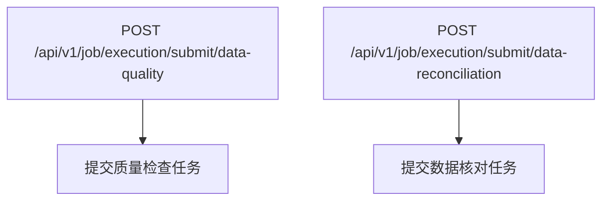
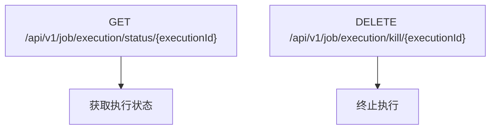
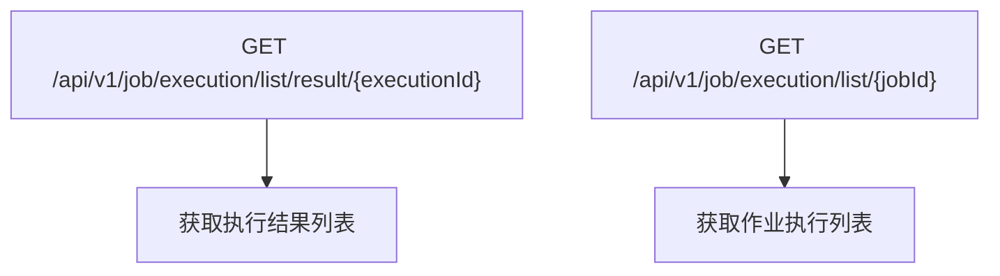
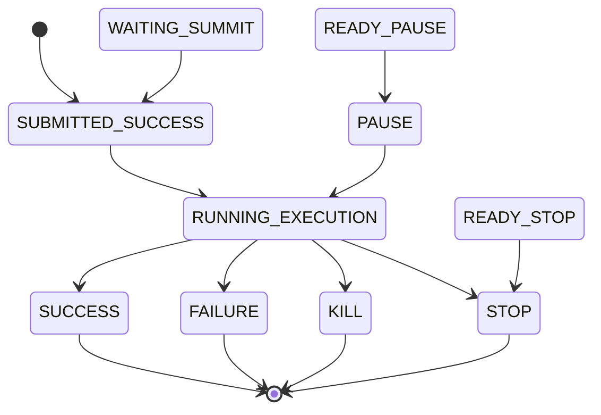
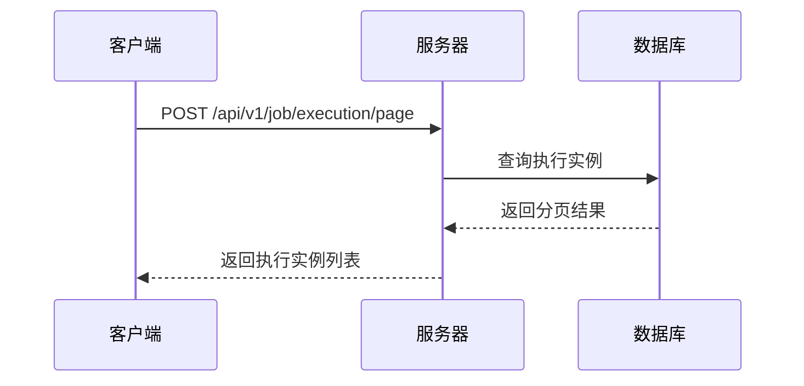
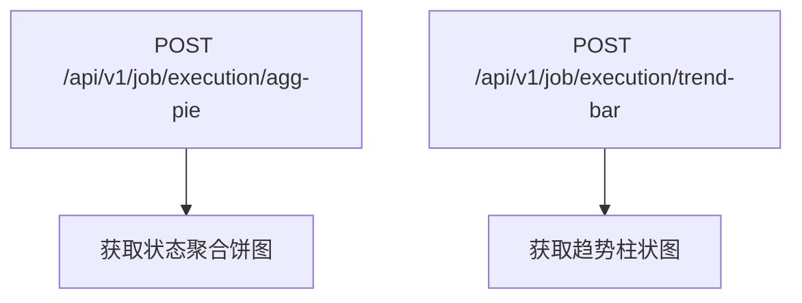
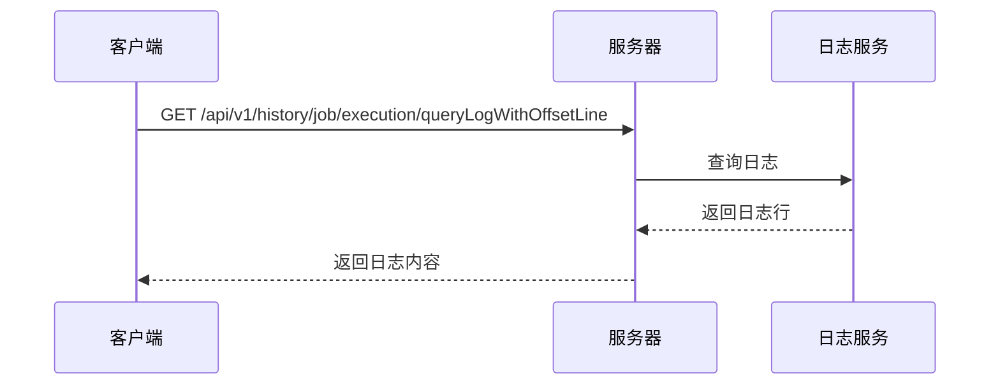
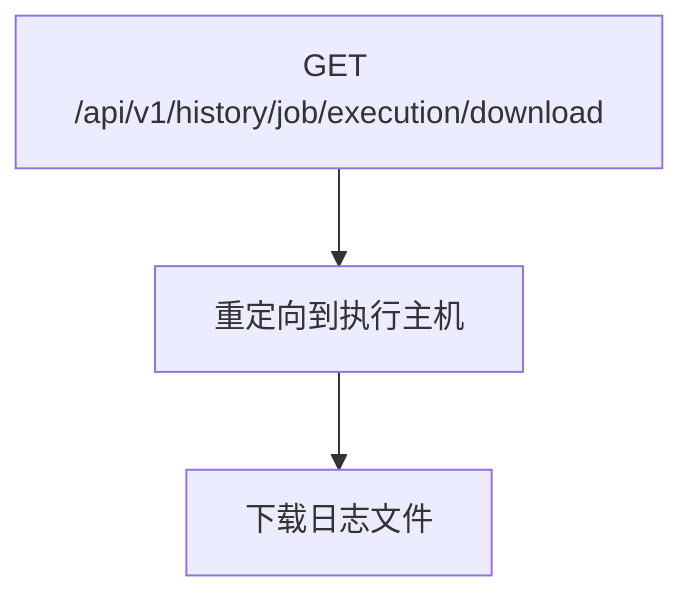

# 任务执行API

<cite>
**本文档中引用的文件**  
- [JobExecutionController.java](file://datavines-server/src/main/java/io/datavines/server/api/controller/JobExecutionController.java)
- [JobHistoryExecutionController.java](file://datavines-server/src/main/java/io/datavines/server/api/controller/JobHistoryExecutionController.java)
- [JobExecutionInfo.java](file://datavines-common/src/main/java/io/datavines/common/entity/JobExecutionInfo.java)
- [JobExecutionParameter.java](file://datavines-common/src/main/java/io/datavines/common/entity/JobExecutionParameter.java)
- [JobExecutionRequest.java](file://datavines-common/src/main/java/io/datavines/common/entity/JobExecutionRequest.java)
- [ExecutionStatus.java](file://datavines-common/src/main/java/io/datavines/common/enums/ExecutionStatus.java)
- [JobExecutionResultVO.java](file://datavines-server/src/main/java/io/datavines/server/api/dto/vo/JobExecutionResultVO.java)
- [JobExecutionVO.java](file://datavines-server/src/main/java/io/datavines/server/api/dto/vo/JobExecutionVO.java)
- [JobExecutionPageParam.java](file://datavines-server/src/main/java/io/datavines/server/api/dto/bo/job/JobExecutionPageParam.java)
- [JobExecutionDashboardParam.java](file://datavines-server/src/main/java/io/datavines/server/api/dto/bo/job/JobExecutionDashboardParam.java)
- [LogService.java](file://datavines-server/dqc/coordinator/log/LogService.java)
- [JobExecutionLogDiscriminator.java](file://datavines-common/src/main/java/io/datavines/common/log/JobExecutionLogDiscriminator.java)
- [JobExecutionLogFilter.java](file://datavines-common/src/main/java/io/datavines/common/log/JobExecutionLogFilter.java)
</cite>

## 目录
1. [简介](#简介)
2. [API端点概览](#api端点概览)
3. [任务执行状态机](#任务执行状态机)
4. [执行结果结构](#执行结果结构)
5. [高级查询功能](#高级查询功能)
6. [执行日志流式获取](#执行日志流式获取)
7. [性能优化建议](#性能优化建议)
8. [常见错误码与解决方案](#常见错误码与解决方案)

## 简介
任务执行API是DataVines平台的核心组件，用于监控和管理质量检查任务的执行过程。该API提供了完整的生命周期管理功能，包括任务提交、状态查询、执行日志获取、结果分析和历史记录查询。API设计遵循RESTful原则，通过清晰的端点划分和标准化的响应格式，为用户提供可靠的任务执行监控能力。

**本节来源**  
- [JobExecutionController.java](file://datavines-server/src/main/java/io/datavines/server/api/controller/JobExecutionController.java)
- [JobHistoryExecutionController.java](file://datavines-server/src/main/java/io/datavines/server/api/controller/JobHistoryExecutionController.java)

## API端点概览
任务执行API提供了一系列RESTful端点，用于管理质量检查任务的执行过程。主要功能包括任务提交、状态查询、结果获取和日志访问。

### 任务提交
用于提交新的质量检查或数据核对任务。



**端点详情：**
- **提交质量检查任务**
  - HTTP方法: POST
  - URL路径: `/api/v1/job/execution/submit/data-quality`
  - 请求体: `SubmitJob` 对象
  - 响应: 执行实例ID

- **提交数据核对任务**
  - HTTP方法: POST
  - URL路径: `/api/v1/job/execution/submit/data-reconciliation`
  - 请求体: `SubmitJob` 对象
  - 响应: 执行实例ID

### 状态管理
提供任务状态查询和终止功能。



**端点详情：**
- **获取执行状态**
  - HTTP方法: GET
  - URL路径: `/api/v1/job/execution/status/{executionId}`
  - 路径参数: `executionId` (执行实例ID)
  - 响应: 状态描述字符串

- **终止执行**
  - HTTP方法: DELETE
  - URL路径: `/api/v1/job/execution/kill/{executionId}`
  - 路径参数: `executionId` (执行实例ID)
  - 响应: 操作结果

### 结果查询
提供执行结果的详细信息查询功能。



**端点详情：**
- **获取执行结果列表**
  - HTTP方法: GET
  - URL路径: `/api/v1/job/execution/list/result/{executionId}`
  - 路径参数: `executionId` (执行实例ID)
  - 响应: `JobExecutionResultVO` 列表

- **获取作业执行列表**
  - HTTP方法: GET
  - URL路径: `/api/v1/job/execution/list/{jobId}`
  - 路径参数: `jobId` (作业ID)
  - 响应: `JobExecution` 对象列表

**本节来源**  
- [JobExecutionController.java](file://datavines-server/src/main/java/io/datavines/server/api/controller/JobExecutionController.java)
- [JobExecutionResultVO.java](file://datavines-server/src/main/java/io/datavines/server/api/dto/vo/JobExecutionResultVO.java)

## 任务执行状态机
任务执行状态机定义了执行实例的完整生命周期，从提交到完成的各个状态转换。



### 状态定义
执行状态由 `ExecutionStatus` 枚举类定义，包含以下核心状态：

| 状态代码 | 状态名称 | 描述 |
|---------|---------|------|
| 0 | SUBMITTED_SUCCESS | 已提交 |
| 1 | RUNNING_EXECUTION | 执行中 |
| 6 | FAILURE | 失败 |
| 7 | SUCCESS | 成功 |
| 9 | KILL | 强制终止 |
| 5 | STOP | 停止 |

### 状态转换规则
- **可终止状态**: `SUBMITTED_SUCCESS`, `READY_PAUSE`, `RUNNING_EXECUTION`
- **完成状态**: `SUCCESS`, `FAILURE`, `KILL`, `STOP`
- **运行状态**: `RUNNING_EXECUTION`
- **暂停状态**: `PAUSE`

**本节来源**  
- [ExecutionStatus.java](file://datavines-common/src/main/java/io/datavines/common/enums/ExecutionStatus.java)
- [JobExecutionVO.java](file://datavines-server/src/main/java/io/datavines/server/api/dto/vo/JobExecutionVO.java)

## 执行结果结构
执行结果通过标准化的JSON结构返回，包含检查结果、指标信息和执行元数据。

### 核心字段
```json
{
  "checkSubject": "检查主题",
  "metricName": "指标名称",
  "metricParameter": {
    "key": "value"
  },
  "checkResult": "检查结果",
  "expectedType": "预期类型",
  "resultFormulaFormat": "结果公式格式",
  "score": 95.5,
  "executionTime": "2023-01-01T12:00:00"
}
```

### 字段说明
| 字段名 | 类型 | 描述 |
|-------|------|------|
| checkSubject | string | 检查的主题，如表、列等 |
| metricName | string | 指标名称，如"行数检查"、"空值检查"等 |
| metricParameter | object | 指标参数，包含具体的检查配置 |
| checkResult | string | 检查结果，如"PASS"、"FAIL"等 |
| expectedType | string | 预期值类型 |
| resultFormulaFormat | string | 结果计算公式格式 |
| score | number | 质量评分，0-100 |
| executionTime | datetime | 执行时间 |

**本节来源**  
- [JobExecutionResultVO.java](file://datavines-server/src/main/java/io/datavines/server/api/dto/vo/JobExecutionResultVO.java)
- [JobExecutionInfo.java](file://datavines-common/src/main/java/io/datavines/common/entity/JobExecutionInfo.java)

## 高级查询功能
提供分页查询、状态过滤和时间范围查询等高级功能，支持大规模执行实例的高效管理。

### 分页查询


**请求参数 (JobExecutionPageParam):**
- `pageNumber`: 页码 (从1开始)
- `pageSize`: 每页大小
- `jobId`: 作业ID (可选)
- `status`: 执行状态 (可选)
- `startTime`: 开始时间 (可选)
- `endTime`: 结束时间 (可选)
- `searchVal`: 搜索关键词 (可选)

### 聚合查询
提供执行状态的聚合统计和趋势分析。



**聚合参数 (JobExecutionDashboardParam):**
- `workspaceId`: 工作空间ID
- `startTime`: 开始时间
- `endTime`: 结束时间
- `jobType`: 作业类型 (可选)

**本节来源**  
- [JobExecutionPageParam.java](file://datavines-server/src/main/java/io/datavines/server/api/dto/bo/job/JobExecutionPageParam.java)
- [JobExecutionDashboardParam.java](file://datavines-server/src/main/java/io/datavines/server/api/dto/bo/job/JobExecutionDashboardParam.java)
- [JobExecutionController.java](file://datavines-server/src/main/java/io/datavines/server/api/controller/JobExecutionController.java)

## 执行日志流式获取
提供执行日志的流式获取功能，支持实时日志查看和文件下载。

### 实时日志查询


**端点详情：**
- HTTP方法: GET
- URL路径: `/api/v1/history/job/execution/queryLogWithOffsetLine`
- 请求参数:
  - `taskId`: 任务ID
  - `offsetLine`: 偏移行数
- 响应: 日志内容数组

### 日志文件下载


**端点详情：**
- HTTP方法: GET
- URL路径: `/api/v1/history/job/execution/download`
- 请求参数: `taskId` (任务ID)
- 响应: 日志文件流

**本节来源**  
- [JobHistoryExecutionController.java](file://datavines-server/src/main/java/io/datavines/server/api/controller/JobHistoryExecutionController.java)
- [LogService.java](file://datavines-server/dqc/coordinator/log/LogService.java)
- [JobExecutionLogDiscriminator.java](file://datavines-common/src/main/java/io/datavines/common/log/JobExecutionLogDiscriminator.java)

## 性能优化建议
为确保API在大规模场景下的性能表现，提供以下优化建议。

### 大结果集处理
- **分页查询**: 使用分页参数避免一次性获取过多数据
- **字段过滤**: 只请求必要的字段，减少网络传输
- **缓存策略**: 对频繁查询的结果进行客户端缓存

### 批量操作
- **批量查询**: 使用聚合查询接口获取多个执行实例的统计信息
- **异步处理**: 对于耗时操作，考虑使用异步API模式

### 连接管理
- **连接复用**: 使用HTTP连接池复用连接
- **超时设置**: 合理设置连接和读取超时
- **重试机制**: 实现指数退避重试策略

**本节来源**  
- [JobExecutionController.java](file://datavines-server/src/main/java/io/datavines/server/api/controller/JobExecutionController.java)
- [JobExecutionLogFilter.java](file://datavines-common/src/main/java/io/datavines/common/log/JobExecutionLogFilter.java)

## 常见错误码与解决方案
列出常见的API错误码及其解决方案。

| 错误码 | 错误信息 | 原因 | 解决方案 |
|-------|--------|------|---------|
| 30404 | 任务不存在 | 提供的执行ID无效 | 检查执行ID是否正确 |
| 50001 | 任务执行主机不存在 | 无法确定任务执行主机 | 检查任务状态和配置 |
| 50002 | 任务日志路径不存在 | 日志文件未生成或路径错误 | 检查日志配置和文件系统 |
| 40001 | 请求参数无效 | 提交的参数不符合验证规则 | 检查请求体格式和必填字段 |
| 50003 | 任务已终止 | 尝试操作已终止的任务 | 检查任务当前状态 |

**本节来源**  
- [JobHistoryExecutionController.java](file://datavines-server/src/main/java/io/datavines/server/api/controller/JobHistoryExecutionController.java)
- [JobExecutionController.java](file://datavines-server/src/main/java/io/datavines/server/api/controller/JobExecutionController.java)
- [DataVinesServerException.java](file://datavines-core/src/main/java/io/datavines/core/exception/DataVinesServerException.java)