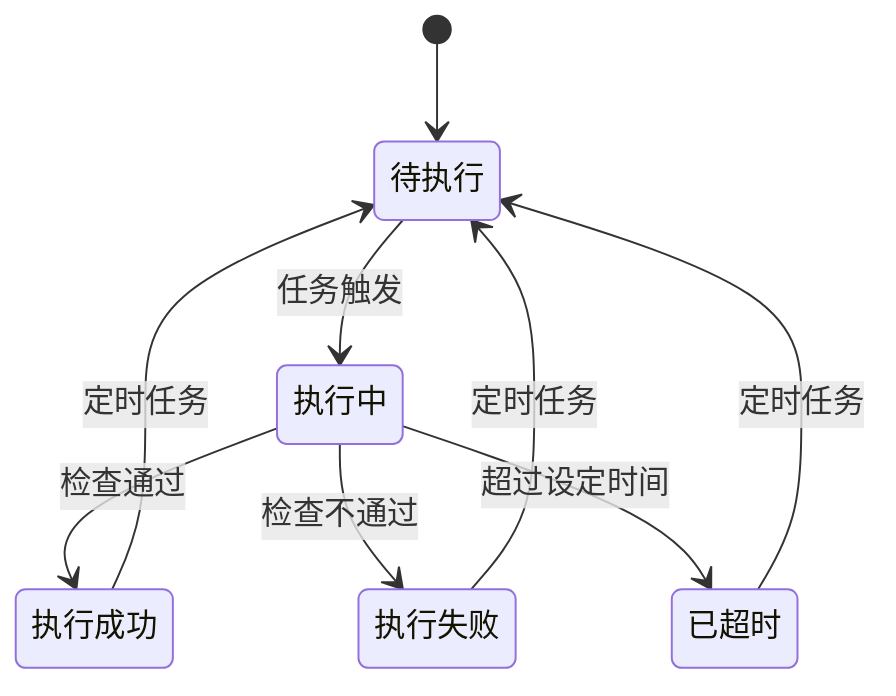

# 任务管理API

<cite>
**本文档引用的文件**  
- [CommonTaskController.java](file://datavines-server/src/main/java/io/datavines/server/api/controller/CommonTaskController.java)
- [CommonTaskScheduleController.java](file://datavines-server/src/main/java/io/datavines/server/api/controller/CommonTaskScheduleController.java)
- [JobController.java](file://datavines-server/src/main/java/io/datavines/server/api/controller/JobController.java)
- [JobExecutionController.java](file://datavines-server/src/main/java/io/datavines/server/api/controller/JobExecutionController.java)
- [JobCreate.java](file://datavines-server/src/main/java/io/datavines/server/api/dto/bo/job/JobCreate.java)
- [JobUpdate.java](file://datavines-server/src/main/java/io/datavines/server/api/dto/bo/job/JobUpdate.java)
- [CommonTaskScheduleCreateOrUpdate.java](file://datavines-server/src/main/java/io/datavines/server/api/dto/bo/task/CommonTaskScheduleCreateOrUpdate.java)
- [JobVO.java](file://datavines-server/src/main/java/io/datavines/server/api/dto/vo/JobVO.java)
</cite>

## 目录
1. [简介](#简介)
2. [任务生命周期管理API](#任务生命周期管理api)
3. [任务配置结构](#任务配置结构)
4. [不同类型任务的配置示例](#不同类型任务的配置示例)
5. [高级功能API](#高级功能api)
6. [任务状态转换](#任务状态转换)
7. [常见错误码与解决方案](#常见错误码与解决方案)

## 简介
本API文档详细描述了质量检查任务的全生命周期管理功能，涵盖任务的创建、更新、删除、查询和克隆等核心操作。系统支持多种类型的数据质量检查任务，包括单表检查、跨表检查和数据画像等场景。通过RESTful接口提供完整的任务管理能力，支持灵活的检查规则配置、预期值设置和通知策略定义。API设计遵循标准HTTP协议规范，使用JSON格式进行数据交换，确保接口的易用性和可集成性。

## 任务生命周期管理API

### 创建质量检查任务
通过POST请求创建新的质量检查任务，需要提供完整的任务配置信息。

**HTTP方法**: POST  
**URL路径**: `/api/v1/job`  
**请求体结构**: 包含任务类型、数据源ID、执行平台参数、引擎类型、超时设置等配置项

```json
{
  "type": "single_table",
  "dataSourceId": 123,
  "engineType": "local",
  "parameter": "{\"metricType\":\"row_count\",\"expectedValue\":1000}",
  "jobName": "订单表行数检查"
}
```

**Section sources**
- [JobController.java](file://datavines-server/src/main/java/io/datavines/server/api/controller/JobController.java#L45-L49)
- [JobCreate.java](file://datavines-server/src/main/java/io/datavines/server/api/dto/bo/job/JobCreate.java#L27-L78)

### 更新质量检查任务
通过PUT请求更新现有质量检查任务的配置。

**HTTP方法**: PUT  
**URL路径**: `/api/v1/job`  
**请求体结构**: 包含任务ID和其他需要更新的字段

```json
{
  "id": 456,
  "type": "single_table",
  "dataSourceId": 123,
  "parameter": "{\"metricType\":\"row_count\",\"expectedValue\":2000}",
  "jobName": "更新后的订单表行数检查"
}
```

**Section sources**
- [JobController.java](file://datavines-server/src/main/java/io/datavines/server/api/controller/JobController.java#L57-L60)
- [JobUpdate.java](file://datavines-server/src/main/java/io/datavines/server/api/dto/bo/job/JobUpdate.java#L27-L31)

### 删除质量检查任务
通过DELETE请求删除指定ID的质量检查任务。

**HTTP方法**: DELETE  
**URL路径**: `/api/v1/job/{id}`  
**路径参数**: `id` - 任务唯一标识符

**Section sources**
- [JobController.java](file://datavines-server/src/main/java/io/datavines/server/api/controller/JobController.java#L51-L55)

### 查询质量检查任务
通过GET请求查询单个或多个质量检查任务的详细信息。

**HTTP方法**: GET  
**URL路径**: 
- `/api/v1/job/{id}` - 查询单个任务
- `/api/v1/job/page` - 分页查询任务列表

**查询参数**: 支持按数据源ID、任务名称、时间范围等条件进行筛选

**Section sources**
- [JobController.java](file://datavines-server/src/main/java/io/datavines/server/api/controller/JobController.java#L63-L91)
- [JobVO.java](file://datavines-server/src/main/java/io/datavines/server/api/dto/vo/JobVO.java#L28-L84)

## 任务配置结构

### 核心配置字段
质量检查任务的配置采用JSON结构，包含以下核心字段：

| 字段名称 | 类型 | 必填 | 描述 |
|---------|------|------|------|
| type | string | 是 | 任务类型，如single_table、cross_table等 |
| dataSourceId | long | 是 | 数据源ID |
| engineType | string | 否 | 执行引擎类型，如local、spark等 |
| parameter | string | 是 | 任务参数JSON字符串 |
| timeout | int | 否 | 超时时间（毫秒） |
| jobName | string | 否 | 任务名称 |

### 数据源选择配置
通过`dataSourceId`和`dataSourceId2`字段指定数据源，支持单数据源和双数据源场景。

### 检查规则配置
在`parameter`字段中定义具体的检查规则，包含指标类型、阈值、比较方式等。

### 预期值设置
支持多种预期值策略，包括固定值、历史平均值、动态计算值等。

### 通知策略
可配置任务执行结果的通知方式和接收人。

**Section sources**
- [JobCreate.java](file://datavines-server/src/main/java/io/datavines/server/api/dto/bo/job/JobCreate.java#L27-L78)

## 不同类型任务的配置示例

### 单表检查任务
用于检查单个数据表的质量指标。

```json
{
  "type": "single_table",
  "dataSourceId": 123,
  "parameter": {
    "metricType": "row_count",
    "expectedValue": 1000,
    "tolerance": 0.1
  },
  "jobName": "用户表行数检查"
}
```

### 跨表检查任务
用于比较两个数据表之间的数据一致性。

```json
{
  "type": "cross_table",
  "dataSourceId": 123,
  "dataSourceId2": 456,
  "parameter": {
    "metricType": "data_accuracy",
    "comparisonField": "user_id",
    "tolerance": 0.05
  },
  "jobName": "用户数据一致性检查"
}
```

### 数据画像任务
用于生成数据表的统计特征和质量报告。

```json
{
  "type": "data_profile",
  "dataSourceId": 123,
  "parameter": {
    "profileFields": ["name", "email", "phone"],
    "statistics": ["count", "null_rate", "distinct_count"]
  },
  "jobName": "用户表数据画像"
}
```

**Section sources**
- [JobCreate.java](file://datavines-server/src/main/java/io/datavines/server/api/dto/bo/job/JobCreate.java#L27-L78)

## 高级功能API

### 任务克隆
通过复制现有任务的配置创建新任务，支持快速批量创建相似任务。

**HTTP方法**: POST  
**URL路径**: `/api/v1/job/clone`  
**请求体**: 包含源任务ID和新任务的基本信息

### 批量操作
支持批量创建、更新和删除质量检查任务。

**HTTP方法**: POST  
**URL路径**: `/api/v1/job/batch`  
**请求体**: 包含多个任务配置的数组

### 任务调度配置
管理任务的定时执行计划。

**HTTP方法**: POST  
**URL路径**: `/api/v1/common-task/schedule/createOrUpdate`  
**请求体结构**: 
```json
{
  "taskType": "SINGLE_TABLE",
  "dataSourceId": 123,
  "type": "CRON",
  "param": {
    "cycle": "DAILY",
    "time": "02:00"
  }
}
```

**Section sources**
- [CommonTaskScheduleController.java](file://datavines-server/src/main/java/io/datavines/server/api/controller/CommonTaskScheduleController.java#L44-L47)
- [CommonTaskScheduleCreateOrUpdate.java](file://datavines-server/src/main/java/io/datavines/server/api/dto/bo/task/CommonTaskScheduleCreateOrUpdate.java#L30-L50)

## 任务状态转换

### 状态转换流程


**Diagram sources**
- [JobExecutionController.java](file://datavines-server/src/main/java/io/datavines/server/api/controller/JobExecutionController.java#L73-L77)

### 状态查询API
获取任务执行状态。

**HTTP方法**: GET  
**URL路径**: `/api/v1/job/execution/status/{executionId}`  
**响应**: 返回任务的当前状态描述

**Section sources**
- [JobExecutionController.java](file://datavines-server/src/main/java/io/datavines/server/api/controller/JobExecutionController.java#L73-L77)

## 常见错误码与解决方案

| 错误码 | 描述 | 解决方案 |
|-------|------|---------|
| 400 | 请求参数无效 | 检查请求体中的必填字段是否完整，参数格式是否正确 |
| 404 | 任务不存在 | 确认任务ID是否正确，任务是否已被删除 |
| 422 | 任务配置冲突 | 检查数据源连接状态，确认配置参数的合理性 |
| 500 | 服务器内部错误 | 联系系统管理员，检查服务运行状态 |

**Section sources**
- [JobController.java](file://datavines-server/src/main/java/io/datavines/server/api/controller/JobController.java)
- [JobExecutionController.java](file://datavines-server/src/main/java/io/datavines/server/api/controller/JobExecutionController.java)