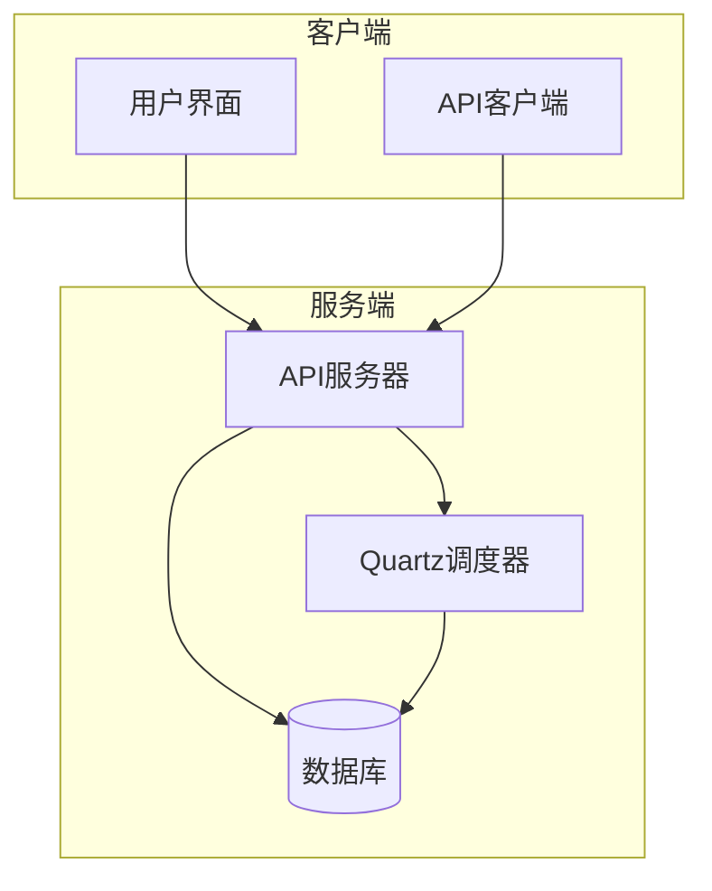
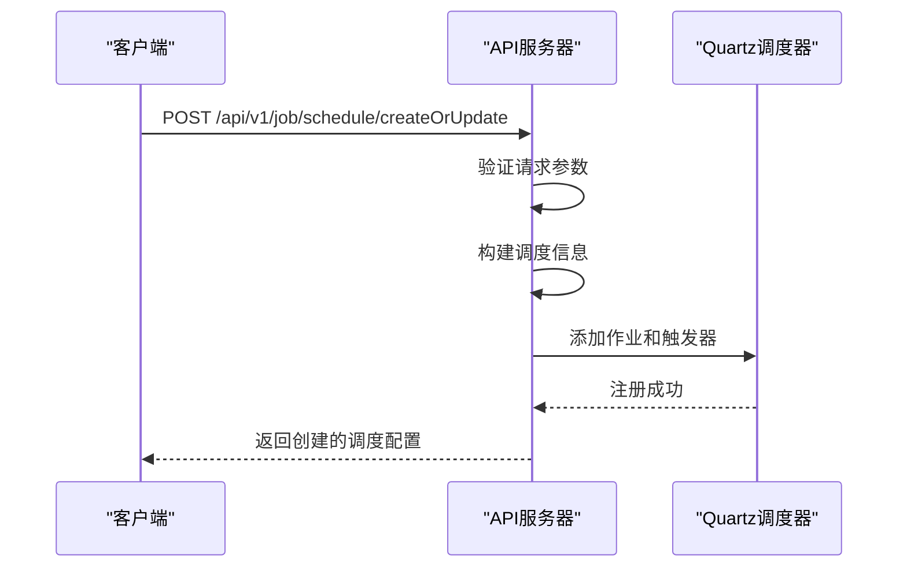
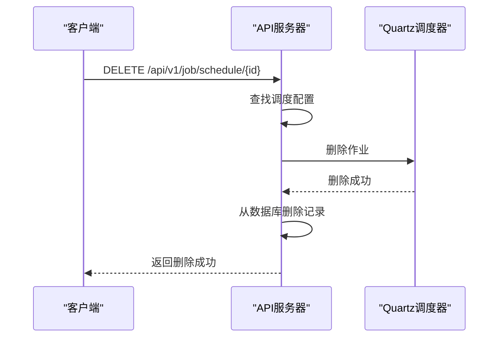

# 任务调度API

<cite>
**本文档中引用的文件**  
- [JobScheduleController.java](file://datavines-server/src/main/java/io/datavines/server/api/controller/JobScheduleController.java)
- [CommonTaskScheduleController.java](file://datavines-server/src/main/java/io/datavines/server/api/controller/CommonTaskScheduleController.java)
- [JobScheduleCreateOrUpdate.java](file://datavines-server/src/main/java/io/datavines/server/api/dto/bo/job/schedule/JobScheduleCreateOrUpdate.java)
- [CommonTaskScheduleCreateOrUpdate.java](file://datavines-server/src/main/java/io/datavines/server/api/dto/bo/task/CommonTaskScheduleCreateOrUpdate.java)
- [JobScheduleService.java](file://datavines-server/src/main/java/io/datavines/server/repository/service/JobScheduleService.java)
- [CommonTaskScheduleService.java](file://datavines-server/src/main/java/io/datavines/server/repository/service/CommonTaskScheduleService.java)
- [QuartzExecutors.java](file://datavines-server/src/main/java/io/datavines/server/dqc/coordinator/quartz/QuartzExecutors.java)
- [MapParam.java](file://datavines-server/src/main/java/io/datavines/server/api/dto/bo/job/schedule/MapParam.java)
- [CommonTaskType.java](file://datavines-server/src/main/java/io/datavines/server/enums/CommonTaskType.java)
</cite>

## 目录
1. [简介](#简介)
2. [任务调度API概览](#任务调度api概览)
3. [核心调度配置结构](#核心调度配置结构)
4. [任务调度API端点](#任务调度api端点)
5. [通用任务调度API端点](#通用任务调度api端点)
6. [Cron表达式配置与验证](#cron表达式配置与验证)
7. [调度状态转换逻辑](#调度状态转换逻辑)
8. [高级特性](#高级特性)
9. [常见错误码与解决方案](#常见错误码与解决方案)

## 简介
本技术文档全面记录了DataVines平台中与质量检查任务调度配置相关的RESTful接口。文档详细描述了创建、更新、启用、禁用和查询任务调度计划的API端点，包括HTTP方法、URL路径、请求参数和请求体结构。文档化了调度配置的完整JSON结构，涵盖cron表达式、调度类型、启动时间、结束时间等核心字段。提供了基于Quartz的cron表达式配置示例和最佳实践。解释了调度状态的转换逻辑和相应的API调用方式，包括调度暂停、恢复和立即触发执行的功能。包含了调度冲突检测、重叠处理等高级特性的说明，以及常见错误码和解决方案。

## 任务调度API概览
DataVines平台提供了两套独立但结构相似的任务调度API，分别用于管理质量检查作业调度和通用任务调度。质量检查作业调度API主要管理数据质量检查任务的执行计划，而通用任务调度API则用于管理元数据抓取、数据质量报告生成等系统级任务。两套API均基于Quartz调度框架实现，支持灵活的cron表达式配置，允许用户定义复杂的调度周期。

**调度系统架构**


**图源**  
- [JobScheduleController.java](file://datavines-server/src/main/java/io/datavines/server/api/controller/JobScheduleController.java)
- [QuartzExecutors.java](file://datavines-server/src/main/java/io/datavines/server/dqc/coordinator/quartz/QuartzExecutors.java)

## 核心调度配置结构
调度配置的核心结构包含多个关键字段，这些字段共同定义了任务的执行行为和周期。所有调度配置均通过JSON格式的请求体进行传输，支持灵活的参数化配置。

### 质量检查任务调度配置
质量检查任务调度配置主要用于定义数据质量检查作业的执行计划。配置结构继承自`JobScheduleCreate`类，并包含一个可选的ID字段用于更新操作。

```json
{
  "id": 123,
  "jobId": 456,
  "type": "CRON",
  "param": {
    "cycle": "custom",
    "parameter": {
      "crontab": "0 0 2 * * ?"
    }
  },
  "startTime": "2023-01-01 00:00:00",
  "endTime": "2024-01-01 00:00:00"
}
```

**字段说明**
- `id`: 调度配置的唯一标识符，创建新调度时可为空
- `jobId`: 关联的质量检查作业ID，必填字段
- `type`: 调度类型，目前支持"CRON"类型
- `param`: 调度参数，包含调度周期和具体参数
- `startTime`: 调度开始时间，ISO 8601格式
- `endTime`: 调度结束时间，可为空表示无限期执行

**节源**  
- [JobScheduleCreateOrUpdate.java](file://datavines-server/src/main/java/io/datavines/server/api/dto/bo/job/schedule/JobScheduleCreateOrUpdate.java)
- [JobScheduleCreate.java](file://datavines-server/src/main/java/io/datavines/server/api/dto/bo/job/schedule/JobScheduleCreate.java)

### 通用任务调度配置
通用任务调度配置用于管理平台级任务的执行计划，如元数据抓取和数据质量报告生成。与质量检查任务调度相比，通用任务调度配置包含任务类型字段，用于区分不同类型的系统任务。

```json
{
  "id": 789,
  "taskType": "CATALOG_METADATA_FETCH",
  "dataSourceId": 101,
  "type": "CRON",
  "param": {
    "cycle": "daily",
    "parameter": {
      "hour": "2",
      "minute": "0"
    }
  },
  "startTime": "2023-01-01 00:00:00",
  "endTime": "2024-01-01 00:00:00"
}
```

**字段说明**
- `taskType`: 任务类型，枚举值包括"CATALOG_METADATA_FETCH"和"DATA_QUALITY_REPORT"
- `dataSourceId`: 关联的数据源ID，必填字段
- 其他字段与质量检查任务调度配置相同

**节源**  
- [CommonTaskScheduleCreateOrUpdate.java](file://datavines-server/src/main/java/io/datavines/server/api/dto/bo/task/CommonTaskScheduleCreateOrUpdate.java)
- [CommonTaskType.java](file://datavines-server/src/main/java/io/datavines/server/enums/CommonTaskType.java)

## 任务调度API端点
任务调度API提供了一组RESTful端点，用于管理质量检查作业的调度配置。所有端点均位于`/api/v1/job/schedule`基础路径下，需要有效的身份验证令牌。

### 创建或更新调度配置
该端点用于创建新的质量检查作业调度配置或更新现有配置。如果请求中包含ID且该ID对应的调度配置已存在，则执行更新操作；否则创建新的调度配置。

**API详情**
- **HTTP方法**: POST
- **URL路径**: `/api/v1/job/schedule/createOrUpdate`
- **请求内容类型**: `application/json`
- **响应内容类型**: `application/json`

**请求体结构**
```json
{
  "jobId": 456,
  "type": "CRON",
  "param": {
    "cycle": "custom",
    "parameter": {
      "crontab": "0 0 2 * * ?"
    }
  },
  "startTime": "2023-01-01 00:00:00",
  "endTime": "2024-01-01 00:00:00"
}
```

**成功响应**
```json
{
  "success": true,
  "msg": "操作成功",
  "data": {
    "id": 123,
    "jobId": 456,
    "type": "CRON",
    "param": {
      "cycle": "custom",
      "parameter": {
        "crontab": "0 0 2 * * ?"
      }
    },
    "startTime": "2023-01-01 00:00:00",
    "endTime": "2024-01-01 00:00:00",
    "createTime": "2023-01-01 10:00:00",
    "updateTime": "2023-01-01 10:00:00"
  }
}
```

**节源**  
- [JobScheduleController.java](file://datavines-server/src/main/java/io/datavines/server/api/controller/JobScheduleController.java#L46-L50)
- [JobScheduleService.java](file://datavines-server/src/main/java/io/datavines/server/repository/service/JobScheduleService.java#L30)

### 查询作业调度配置
该端点用于根据作业ID查询对应的质量检查作业调度配置。如果指定作业没有配置调度计划，则返回空结果。

**API详情**
- **HTTP方法**: GET
- **URL路径**: `/api/v1/job/schedule/{jobId}`
- **响应内容类型**: `application/json`

**路径参数**
- `jobId`: 质量检查作业的唯一标识符

**成功响应**
```json
{
  "success": true,
  "msg": "操作成功",
  "data": {
    "id": 123,
    "jobId": 456,
    "type": "CRON",
    "param": {
      "cycle": "custom",
      "parameter": {
        "crontab": "0 0 2 * * ?"
      }
    },
    "startTime": "2023-01-01 00:00:00",
    "endTime": "2024-01-01 00:00:00",
    "createTime": "2023-01-01 10:00:00",
    "updateTime": "2023-01-01 10:00:00"
  }
}
```

**节源**  
- [JobScheduleController.java](file://datavines-server/src/main/java/io/datavines/server/api/controller/JobScheduleController.java#L52-L56)
- [JobScheduleService.java](file://datavines-server/src/main/java/io/datavines/server/repository/service/JobScheduleService.java#L38)

## 通用任务调度API端点
通用任务调度API提供了一组RESTful端点，用于管理平台级任务的调度配置。所有端点均位于`/api/v1/common-task/schedule`基础路径下，需要有效的身份验证令牌。

### 创建或更新通用任务调度
该端点用于创建新的通用任务调度配置或更新现有配置。与质量检查任务调度类似，如果请求中包含ID且该ID对应的调度配置已存在，则执行更新操作；否则创建新的调度配置。

**API详情**
- **HTTP方法**: POST
- **URL路径**: `/api/v1/common-task/schedule/createOrUpdate`
- **请求内容类型**: `application/json`
- **响应内容类型**: `application/json`

**请求体结构**
```json
{
  "taskType": "CATALOG_METADATA_FETCH",
  "dataSourceId": 101,
  "type": "CRON",
  "param": {
    "cycle": "daily",
    "parameter": {
      "hour": "2",
      "minute": "0"
    }
  },
  "startTime": "2023-01-01 00:00:00",
  "endTime": "2024-01-01 00:00:00"
}
```

**成功响应**
```json
{
  "success": true,
  "msg": "操作成功",
  "data": {
    "id": 789,
    "taskType": "CATALOG_METADATA_FETCH",
    "dataSourceId": 101,
    "type": "CRON",
    "param": {
      "cycle": "daily",
      "parameter": {
        "hour": "2",
        "minute": "0"
      }
    },
    "startTime": "2023-01-01 00:00:00",
    "endTime": "2024-01-01 00:00:00",
    "createTime": "2023-01-01 10:00:00",
    "updateTime": "2023-01-01 10:00:00"
  }
}
```

**节源**  
- [CommonTaskScheduleController.java](file://datavines-server/src/main/java/io/datavines/server/api/controller/CommonTaskScheduleController.java#L44-L48)
- [CommonTaskScheduleService.java](file://datavines-server/src/main/java/io/datavines/server/repository/service/CommonTaskScheduleService.java#L30)

### 根据数据源ID查询通用任务调度
该端点用于根据数据源ID和任务类型查询对应的通用任务调度配置。此查询方式特别适用于需要获取特定数据源上某种类型任务调度配置的场景。

**API详情**
- **HTTP方法**: GET
- **URL路径**: `/api/v1/common-task/schedule/{dataSourceId}/{taskType}`
- **响应内容类型**: `application/json`

**路径参数**
- `dataSourceId`: 数据源的唯一标识符
- `taskType`: 任务类型，可选值为"CATALOG_METADATA_FETCH"或"DATA_QUALITY_REPORT"

**成功响应**
```json
{
  "success": true,
  "msg": "操作成功",
  "data": {
    "id": 789,
    "taskType": "CATALOG_METADATA_FETCH",
    "dataSourceId": 101,
    "type": "CRON",
    "param": {
      "cycle": "daily",
      "parameter": {
        "hour": "2",
        "minute": "0"
      }
    },
    "startTime": "2023-01-01 00:00:00",
    "endTime": "2024-01-01 00:00:00",
    "createTime": "2023-01-01 10:00:00",
    "updateTime": "2023-01-01 10:00:00"
  }
}
```

**节源**  
- [CommonTaskScheduleController.java](file://datavines-server/src/main/java/io/datavines/server/api/controller/CommonTaskScheduleController.java#L50-L54)
- [CommonTaskScheduleService.java](file://datavines-server/src/main/java/io/datavines/server/repository/service/CommonTaskScheduleService.java#L38)

## Cron表达式配置与验证
Cron表达式是任务调度系统的核心组成部分，用于定义任务执行的复杂时间周期。DataVines平台基于Quartz调度框架，支持完整的cron表达式语法。

### Cron表达式生成
系统提供了辅助API端点，用于根据简单的周期参数生成对应的cron表达式。这简化了用户配置复杂调度周期的过程。

**API详情**
- **HTTP方法**: POST
- **URL路径**: `/api/v1/job/schedule/cron` 和 `/api/v1/common-task/schedule/cron`
- **请求内容类型**: `application/json`
- **响应内容类型**: `application/json`

**请求体结构**
```json
{
  "cycle": "weekly",
  "parameter": {
    "dayOfWeek": "1",
    "hour": "2",
    "minute": "30"
  }
}
```

**成功响应**
```json
{
  "success": true,
  "msg": "操作成功",
  "data": ["0 30 2 ? * 1"]
}
```

**节源**  
- [JobScheduleController.java](file://datavines-server/src/main/java/io/datavines/server/api/controller/JobScheduleController.java#L58-L62)
- [CommonTaskScheduleController.java](file://datavines-server/src/main/java/io/datavines/server/api/controller/CommonTaskScheduleController.java#L56-L60)
- [MapParam.java](file://datavines-server/src/main/java/io/datavines/server/api/dto/bo/job/schedule/MapParam.java)

### Cron表达式验证
在创建或更新调度配置时，系统会自动验证cron表达式的有效性。用户也可以通过专门的API端点来验证cron表达式。

**API详情**
- **HTTP方法**: POST
- **URL路径**: `/api/v1/job/schedule/cron/future/list`
- **请求内容类型**: `application/json`
- **响应内容类型**: `application/json`

**请求体结构**
```json
{
  "crontab": "0 0 2 * * ?"
}
```

**成功响应**
```json
{
  "success": true,
  "msg": "操作成功",
  "data": [
    "2023-01-02 02:00:00",
    "2023-01-03 02:00:00",
    "2023-01-04 02:00:00",
    "2023-01-05 02:00:00",
    "2023-01-06 02:00:00"
  ]
}
```

**节源**  
- [JobScheduleController.java](file://datavines-server/src/main/java/io/datavines/server/api/controller/JobScheduleController.java#L65-L69)
- [QuartzExecutors.java](file://datavines-server/src/main/java/io/datavines/server/dqc/coordinator/quartz/QuartzExecutors.java#L239-L263)

## 调度状态转换逻辑
调度系统的状态转换主要通过创建、更新和删除操作来实现。系统本身不提供显式的启用/禁用端点，而是通过调度配置的生命周期管理来控制任务的执行状态。

### 调度创建与启用
当创建新的调度配置时，系统会自动将其注册到Quartz调度器中，从而使任务进入可执行状态。调度配置中的`startTime`字段定义了任务首次执行的时间。



**图源**  
- [JobScheduleController.java](file://datavines-server/src/main/java/io/datavines/server/api/controller/JobScheduleController.java#L46-L50)
- [QuartzExecutors.java](file://datavines-server/src/main/java/io/datavines/server/dqc/coordinator/quartz/QuartzExecutors.java#L74-L149)

### 调度更新与修改
更新现有调度配置时，系统会检查cron表达式是否发生变化。如果发生变化，系统会重新安排触发器，从而修改任务的执行周期。`startTime`和`endTime`字段的修改也会相应调整任务的执行时间窗口。

### 调度删除与禁用
删除调度配置是禁用任务执行的主要方式。当删除调度配置时，系统会从Quartz调度器中移除对应的作业和触发器，从而停止任务的后续执行。



**节源**  
- [JobScheduleService.java](file://datavines-server/src/main/java/io/datavines/server/repository/service/JobScheduleService.java#L32)
- [QuartzExecutors.java](file://datavines-server/src/main/java/io/datavines/server/dqc/coordinator/quartz/QuartzExecutors.java#L157-L174)

## 高级特性
任务调度系统提供了一些高级特性，以满足复杂的调度需求和提高系统的可靠性。

### 调度冲突检测
系统在创建或更新调度配置时会自动检测潜在的调度冲突。虽然当前实现中没有显式的冲突检测逻辑，但通过唯一的工作名称和组名称组合（基于任务类型、ID和数据源ID生成），确保了每个调度配置的唯一性。

```java
private static String buildJobName(ScheduleJobInfo schedule) {
    return schedule.getType().getDescription() + "_job" + DataVinesConstants.UNDERLINE + schedule.getId();
}

private static String buildJobGroupName(ScheduleJobInfo schedule) {
    return schedule.getType().getDescription() + "_job_group" + DataVinesConstants.UNDERLINE + schedule.getDatasourceId();
}
```

**节源**  
- [QuartzExecutors.java](file://datavines-server/src/main/java/io/datavines/server/dqc/coordinator/quartz/QuartzExecutors.java#L204-L215)

### 时区处理
系统在处理调度时间时会进行时区转换，确保调度时间在不同服务器时区环境下的一致性。当将调度信息添加到Quartz调度器时，系统会将本地时间转换为服务器默认时区的时间。

```java
private static Date buildDate(LocalDateTime localDateTime){
    ZoneId zoneId = ZoneId.systemDefault();
    ZonedDateTime zonedDateTime = localDateTime.atZone(zoneId);
    Instant instant = zonedDateTime.toInstant();
    return Date.from(instant);
}
```

**节源**  
- [QuartzExecutors.java](file://datavines-server/src/main/java/io/datavines/server/dqc/coordinator/quartz/QuartzExecutors.java#L232-L237)

## 常见错误码与解决方案
以下是任务调度API中常见的错误码及其解决方案。

### SCHEDULE_CRON_IS_INVALID_ERROR
**错误描述**: 提供的cron表达式无效
**错误码**: 4001
**解决方案**: 
1. 检查cron表达式的格式是否符合Quartz cron表达式规范
2. 使用`/cron/future/list`端点验证cron表达式
3. 参考标准cron表达式语法：`秒 分 时 日 月 周 年(可选)`

### JOB_ID_CANNOT_BE_EMPTY
**错误描述**: 作业ID不能为空
**错误码**: 4002
**解决方案**: 
1. 确保在创建调度配置时提供了有效的作业ID
2. 通过作业管理API获取有效的作业ID列表

### DATASOURCE_ID_CANNOT_BE_EMPTY
**错误描述**: 数据源ID不能为空
**错误码**: 4003
**解决方案**: 
1. 确保在创建通用任务调度时提供了有效的数据源ID
2. 通过数据源管理API获取有效的数据源ID列表

### TASK_TYPE_CANNOT_BE_EMPTY
**错误描述**: 任务类型不能为空
**错误码**: 4004
**解决方案**: 
1. 确保在创建通用任务调度时提供了有效的任务类型
2. 使用支持的任务类型：`CATALOG_METADATA_FETCH`或`DATA_QUALITY_REPORT`

**节源**  
- [JobScheduleCreate.java](file://datavines-server/src/main/java/io/datavines/server/api/dto/bo/job/schedule/JobScheduleCreate.java#L30-L31)
- [CommonTaskScheduleCreateOrUpdate.java](file://datavines-server/src/main/java/io/datavines/server/api/dto/bo/task/CommonTaskScheduleCreateOrUpdate.java#L34-L38)
- [QuartzExecutors.java](file://datavines-server/src/main/java/io/datavines/server/dqc/coordinator/quartz/QuartzExecutors.java#L253-L258)