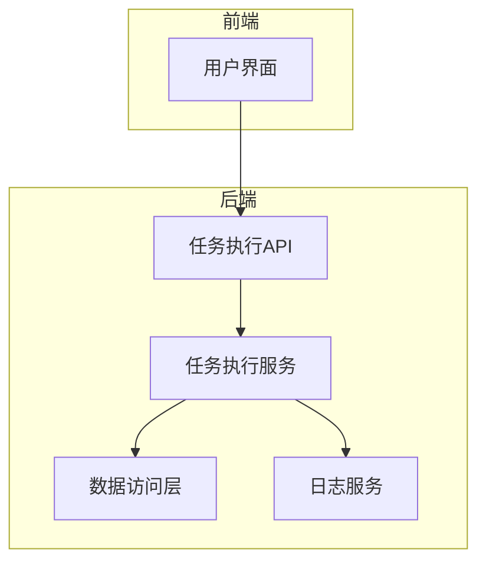
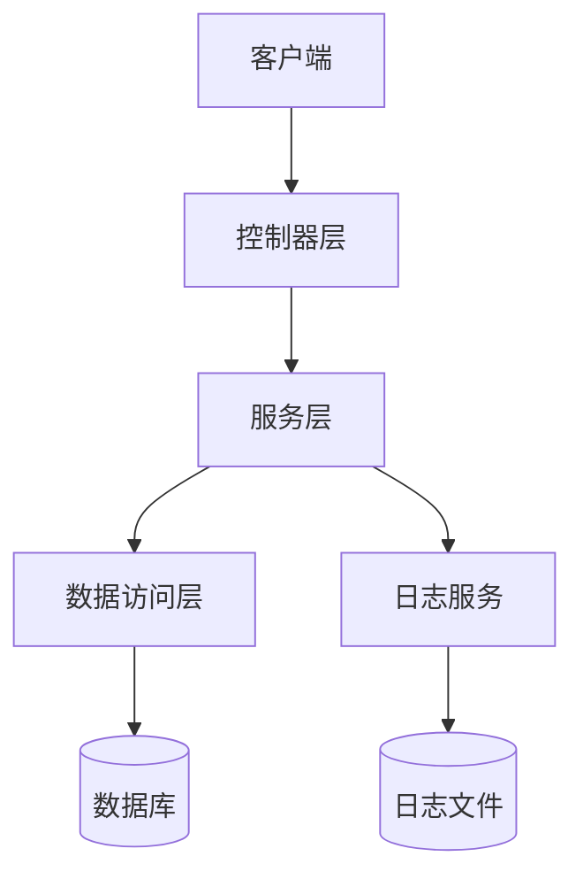
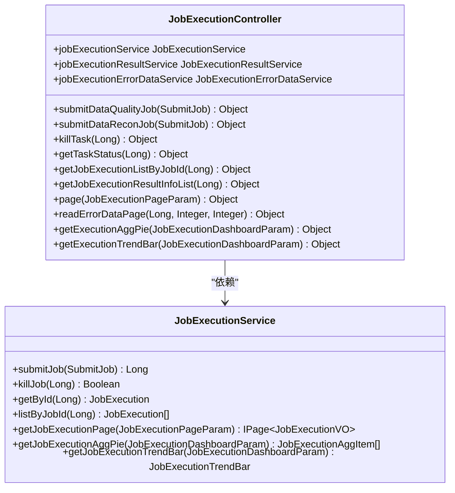
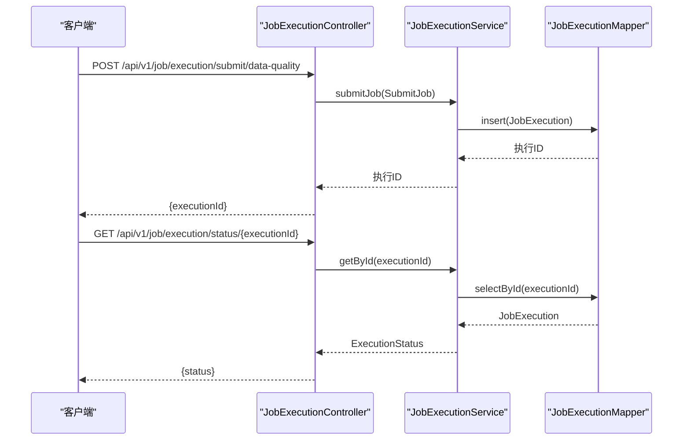
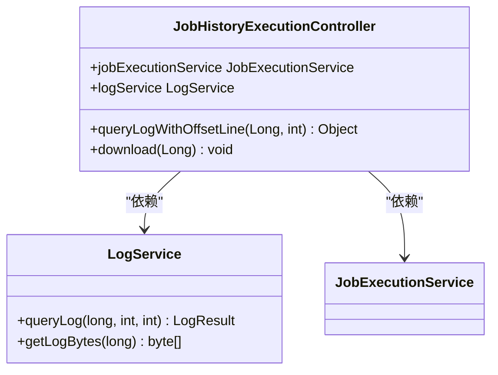
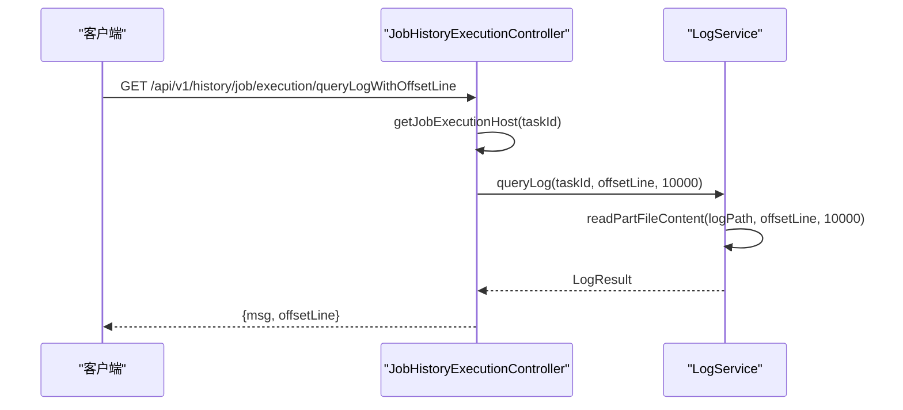
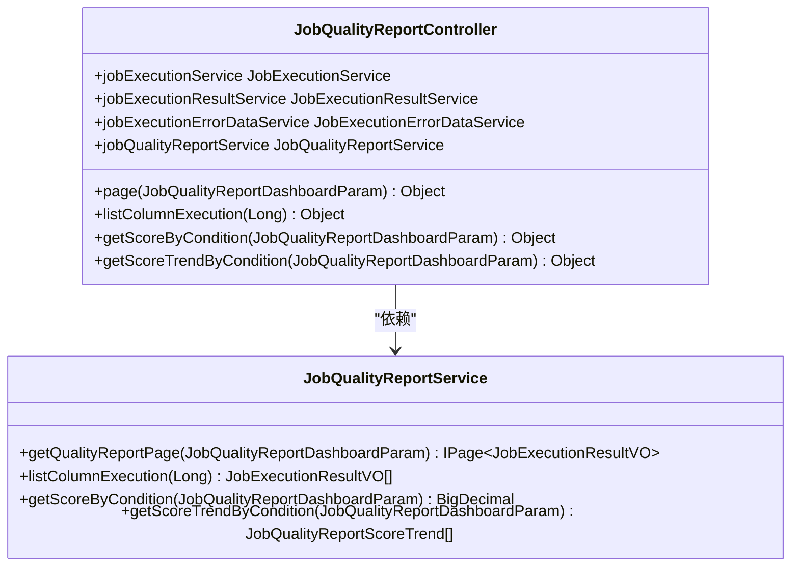
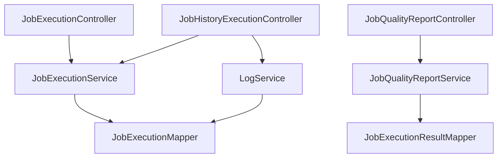

# 任务执行API

<cite>
**本文档中引用的文件**   
- [JobExecutionController.java](file://datavines-server/src/main/java/io/datavines/server/api/controller/JobExecutionController.java)
- [JobHistoryExecutionController.java](file://datavines-server/src/main/java/io/datavines/server/api/controller/JobHistoryExecutionController.java)
- [JobQualityReportController.java](file://datavines-server/src/main/java/io/datavines/server/api/controller/JobQualityReportController.java)
- [JobExecutionResultVO.java](file://datavines-server/src/main/java/io/datavines/server/api/dto/vo/JobExecutionResultVO.java)
- [JobExecutionPageParam.java](file://datavines-server/src/main/java/io/datavines/server/api/dto/bo/job/JobExecutionPageParam.java)
- [JobExecutionInfo.java](file://datavines-common/src/main/java/io/datavines/common/entity/JobExecutionInfo.java)
- [ExecutionStatus.java](file://datavines-common/src/main/java/io/datavines/common/enums/ExecutionStatus.java)
- [LogService.java](file://datavines-server/src/main/java/io/datavines/server/dqc/coordinator/log/LogService.java)
- [LogResult.java](file://datavines-common/src/main/java/io/datavines/common/entity/LogResult.java)
</cite>

## 目录
1. [简介](#简介)
2. [项目结构](#项目结构)
3. [核心组件](#核心组件)
4. [架构概述](#架构概述)
5. [详细组件分析](#详细组件分析)
6. [依赖分析](#依赖分析)
7. [性能考虑](#性能考虑)
8. [故障排除指南](#故障排除指南)
9. [结论](#结论)
10. [附录](#附录)（如有必要）

## 简介
本文档全面记录了与任务执行实例相关的所有RESTful接口，重点描述了查询任务执行历史、获取执行日志、查看执行结果和检查详细报告的API端点。文档详细说明了执行结果的JSON结构，包括总体执行状态、各检查项结果、错误数据详情等。同时提供了分页查询、条件过滤等高级查询功能的使用方法，解释了执行结果中各项指标的含义和计算方式，并包含执行日志流式获取的API使用示例，为监控系统集成提供指导。

## 项目结构
DataVines项目是一个大数据质量监控系统，其任务执行API主要集中在`datavines-server`模块中。该模块提供了RESTful接口来管理任务的执行、查询执行历史、获取执行日志和查看执行结果。`datavines-common`模块包含了任务执行相关的公共实体和枚举，而`datavines-metric`模块则定义了质量检查的度量标准和结果计算。



**图表来源**
- [JobExecutionController.java](file://datavines-server/src/main/java/io/datavines/server/api/controller/JobExecutionController.java)
- [JobExecutionService.java](file://datavines-server/src/main/java/io/datavines/server/repository/service/JobExecutionService.java)

**章节来源**
- [JobExecutionController.java](file://datavines-server/src/main/java/io/datavines/server/api/controller/JobExecutionController.java)
- [JobHistoryExecutionController.java](file://datavines-server/src/main/java/io/datavines/server/api/controller/JobHistoryExecutionController.java)

## 核心组件
任务执行API的核心组件包括`JobExecutionController`、`JobHistoryExecutionController`和`JobQualityReportController`。这些控制器提供了对任务执行生命周期的全面管理，从提交任务到查询执行结果和日志。`JobExecutionController`负责任务的提交、状态查询和执行列表获取；`JobHistoryExecutionController`提供了对执行日志的流式查询和下载功能；`JobQualityReportController`则专注于质量报告的生成和查询。

**章节来源**
- [JobExecutionController.java](file://datavines-server/src/main/java/io/datavines/server/api/controller/JobExecutionController.java)
- [JobHistoryExecutionController.java](file://datavines-server/src/main/java/io/datavines/server/api/controller/JobHistoryExecutionController.java)
- [JobQualityReportController.java](file://datavines-server/src/main/java/io/datavines/server/api/controller/JobQualityReportController.java)

## 架构概述
任务执行API采用典型的分层架构，包括控制器层、服务层和数据访问层。控制器层暴露RESTful接口，服务层处理业务逻辑，数据访问层与数据库交互。日志服务独立于主流程，通过异步方式收集和查询任务执行日志。这种架构确保了系统的可扩展性和可维护性。



**图表来源**
- [JobExecutionController.java](file://datavines-server/src/main/java/io/datavines/server/api/controller/JobExecutionController.java)
- [JobExecutionService.java](file://datavines-server/src/main/java/io/datavines/server/repository/service/JobExecutionService.java)
- [LogService.java](file://datavines-server/src/main/java/io/datavines/server/dqc/coordinator/log/LogService.java)

## 详细组件分析

### 任务执行控制器分析
`JobExecutionController`是任务执行API的主要入口，提供了任务提交、状态查询和执行列表获取等功能。该控制器通过`JobExecutionService`处理业务逻辑，并返回相应的执行结果。

#### 类图


**图表来源**
- [JobExecutionController.java](file://datavines-server/src/main/java/io/datavines/server/api/controller/JobExecutionController.java)
- [JobExecutionService.java](file://datavines-server/src/main/java/io/datavines/server/repository/service/JobExecutionService.java)

#### 序列图


**图表来源**
- [JobExecutionController.java](file://datavines-server/src/main/java/io/datavines/server/api/controller/JobExecutionController.java)
- [JobExecutionService.java](file://datavines-server/src/main/java/io/datavines/server/repository/service/JobExecutionService.java)
- [JobExecutionMapper.java](file://datavines-server/src/main/java/io/datavines/server/repository/mapper/JobExecutionMapper.java)

**章节来源**
- [JobExecutionController.java](file://datavines-server/src/main/java/io/datavines/server/api/controller/JobExecutionController.java)
- [JobExecutionService.java](file://datavines-server/src/main/java/io/datavines/server/repository/service/JobExecutionService.java)

### 任务历史执行控制器分析
`JobHistoryExecutionController`提供了对任务执行日志的查询和下载功能。该控制器通过`LogService`查询日志内容，并支持按偏移行数流式获取日志。

#### 类图


**图表来源**
- [JobHistoryExecutionController.java](file://datavines-server/src/main/java/io/datavines/server/api/controller/JobHistoryExecutionController.java)
- [LogService.java](file://datavines-server/src/main/java/io/datavines/server/dqc/coordinator/log/LogService.java)

#### 序列图


**图表来源**
- [JobHistoryExecutionController.java](file://datavines-server/src/main/java/io/datavines/server/api/controller/JobHistoryExecutionController.java)
- [LogService.java](file://datavines-server/src/main/java/io/datavines/server/dqc/coordinator/log/LogService.java)

**章节来源**
- [JobHistoryExecutionController.java](file://datavines-server/src/main/java/io/datavines/server/api/controller/JobHistoryExecutionController.java)
- [LogService.java](file://datavines-server/src/main/java/io/datavines/server/dqc/coordinator/log/LogService.java)

### 任务质量报告控制器分析
`JobQualityReportController`提供了对任务质量报告的查询功能，包括分页查询、分数查询和趋势查询。

#### 类图


**图表来源**
- [JobQualityReportController.java](file://datavines-server/src/main/java/io/datavines/server/api/controller/JobQualityReportController.java)
- [JobQualityReportService.java](file://datavines-server/src/main/java/io/datavines/server/repository/service/JobQualityReportService.java)

**章节来源**
- [JobQualityReportController.java](file://datavines-server/src/main/java/io/datavines/server/api/controller/JobQualityReportController.java)
- [JobQualityReportService.java](file://datavines-server/src/main/java/io/datavines/server/repository/service/JobQualityReportService.java)

## 依赖分析
任务执行API的依赖关系清晰，控制器层依赖于服务层，服务层依赖于数据访问层和日志服务。这种分层依赖确保了各组件的职责分离和可测试性。



**图表来源**
- [JobExecutionController.java](file://datavines-server/src/main/java/io/datavines/server/api/controller/JobExecutionController.java)
- [JobHistoryExecutionController.java](file://datavines-server/src/main/java/io/datavines/server/api/controller/JobHistoryExecutionController.java)
- [JobQualityReportController.java](file://datavines-server/src/main/java/io/datavines/server/api/controller/JobQualityReportController.java)
- [JobExecutionService.java](file://datavines-server/src/main/java/io/datavines/server/repository/service/JobExecutionService.java)
- [JobQualityReportService.java](file://datavines-server/src/main/java/io/datavines/server/repository/service/JobQualityReportService.java)
- [LogService.java](file://datavines-server/src/main/java/io/datavines/server/dqc/coordinator/log/LogService.java)

**章节来源**
- [JobExecutionController.java](file://datavines-server/src/main/java/io/datavines/server/api/controller/JobExecutionController.java)
- [JobHistoryExecutionController.java](file://datavines-server/src/main/java/io/datavines/server/api/controller/JobHistoryExecutionController.java)
- [JobQualityReportController.java](file://datavines-server/src/main/java/io/datavines/server/api/controller/JobQualityReportController.java)

## 性能考虑
任务执行API在设计时考虑了性能因素。日志查询采用流式读取，避免了大文件加载到内存中。分页查询和条件过滤功能减少了不必要的数据传输。对于高频查询的执行状态，可以考虑引入缓存机制以进一步提升性能。

## 故障排除指南
当任务执行API出现问题时，可以按照以下步骤进行排查：
1. 检查任务执行状态是否为"失败"或"强制终止"。
2. 查询执行日志以获取详细的错误信息。
3. 检查数据库连接和任务配置是否正确。
4. 验证执行主机是否可达。

**章节来源**
- [JobExecutionController.java](file://datavines-server/src/main/java/io/datavines/server/api/controller/JobExecutionController.java)
- [JobHistoryExecutionController.java](file://datavines-server/src/main/java/io/datavines/server/api/controller/JobHistoryExecutionController.java)
- [LogService.java](file://datavines-server/src/main/java/io/datavines/server/dqc/coordinator/log/LogService.java)

## 结论
任务执行API为DataVines系统提供了全面的任务管理功能，包括任务提交、状态查询、日志获取和质量报告生成。通过RESTful接口，外部系统可以方便地集成和监控数据质量检查任务。API设计合理，性能良好，为大数据质量监控提供了可靠的基础。

## 附录

### 执行状态枚举
任务执行状态枚举定义了任务的生命周期状态：

| 状态码 | 英文描述 | 中文描述 |
|--------|----------|----------|
| 0 | submitted | 已提交 |
| 1 | running | 执行中 |
| 6 | failure | 失败 |
| 7 | success | 成功 |
| 9 | kill | 强制终止 |

**章节来源**
- [ExecutionStatus.java](file://datavines-common/src/main/java/io/datavines/common/enums/ExecutionStatus.java)

### 执行结果VO
任务执行结果的JSON结构如下：

```json
{
  "checkSubject": "检查主题",
  "metricName": "度量名称",
  "metricParameter": {
    "key": "value"
  },
  "checkResult": "检查结果",
  "expectedType": "期望类型",
  "resultFormulaFormat": "结果公式格式",
  "score": 95.5,
  "executionTime": "2023-01-01T12:00:00"
}
```

**章节来源**
- [JobExecutionResultVO.java](file://datavines-server/src/main/java/io/datavines/server/api/dto/vo/JobExecutionResultVO.java)