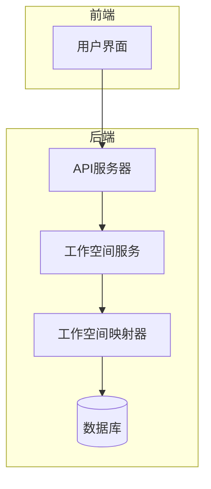
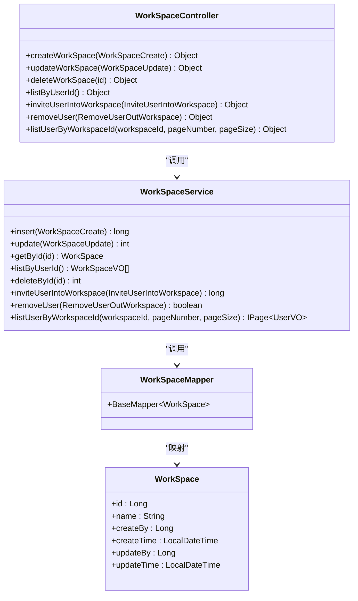
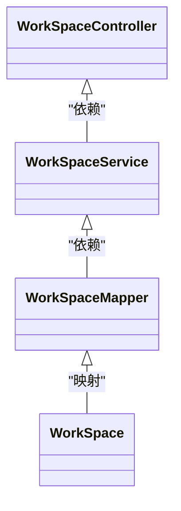
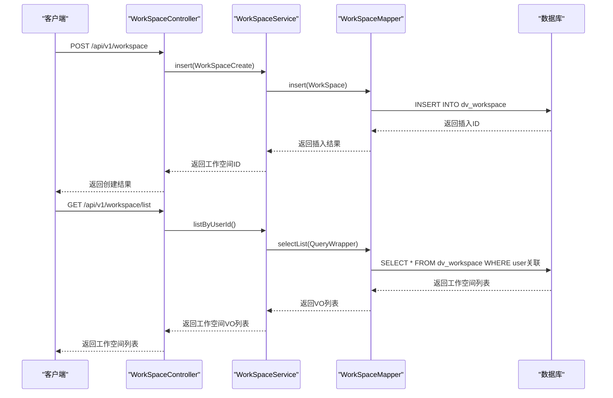
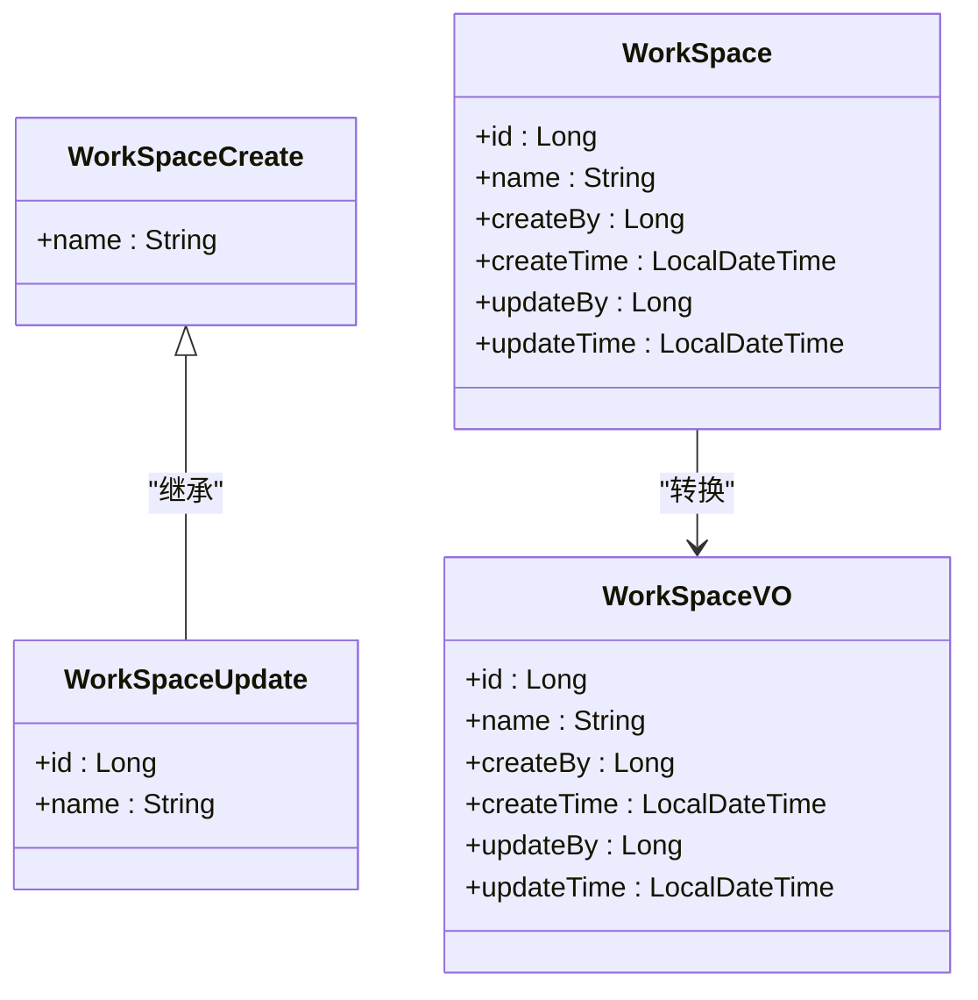
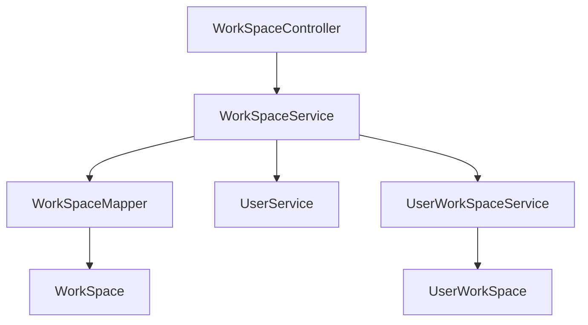

# 工作空间API

<cite>
**本文档中引用的文件**  
- [WorkSpaceController.java](file://datavines-server/src/main/java/io/datavines/server/api/controller/WorkSpaceController.java)
- [WorkSpaceCreate.java](file://datavines-server/src/main/java/io/datavines/server/api/dto/bo/workspace/WorkSpaceCreate.java)
- [WorkSpaceUpdate.java](file://datavines-server/src/main/java/io/datavines/server/api/dto/bo/workspace/WorkSpaceUpdate.java)
- [InviteUserIntoWorkspace.java](file://datavines-server/src/main/java/io/datavines/server/api/dto/bo/workspace/InviteUserIntoWorkspace.java)
- [RemoveUserOutWorkspace.java](file://datavines-server/src/main/java/io/datavines/server/api/dto/bo/workspace/RemoveUserOutWorkspace.java)
- [WorkSpaceVO.java](file://datavines-server/src/main/java/io/datavines/server/api/dto/vo/WorkSpaceVO.java)
- [WorkSpaceService.java](file://datavines-server/src/main/java/io/datavines/server/repository/service/WorkSpaceService.java)
- [WorkSpaceServiceImpl.java](file://datavines-server/src/main/java/io/datavines/server/repository/service/impl/WorkSpaceServiceImpl.java)
- [WorkSpaceMapper.java](file://datavines-server/src/main/java/io/datavines/server/repository/mapper/WorkSpaceMapper.java)
- [WorkSpace.java](file://datavines-server/src/main/java/io/datavines/server/repository/entity/WorkSpace.java)
- [datavines-mysql.sql](file://scripts/sql/datavines-mysql.sql)
- [UserWorkSpaceService.java](file://datavines-server/src/main/java/io/datavines/server/repository/service/UserWorkSpaceService.java)
- [UserWorkSpaceServiceImpl.java](file://datavines-server/src/main/java/io/datavines/server/repository/service/impl/UserWorkSpaceServiceImpl.java)
</cite>

## 目录
1. [简介](#简介)
2. [项目结构](#项目结构)
3. [核心组件](#核心组件)
4. [架构概述](#架构概述)
5. [详细组件分析](#详细组件分析)
6. [依赖分析](#依赖分析)
7. [性能考虑](#性能考虑)
8. [故障排除指南](#故障排除指南)
9. [结论](#结论)

## 简介
本文档全面记录了DataVines平台中与工作空间管理相关的所有RESTful接口。文档详细描述了创建、更新、删除工作空间以及管理用户与工作空间关系的API端点。同时，文档化了工作空间配置的JSON结构，包括名称、描述、成员管理等，并解释了工作空间隔离机制和资源分配策略。此外，还提供了批量用户管理、权限分配等高级功能的API使用方法，以及工作空间配额管理和审计日志相关的API说明，为多租户场景下的API使用提供指导。

## 项目结构
DataVines是一个数据质量平台，其工作空间管理功能主要集中在`datavines-server`模块中。该模块提供了RESTful API接口，用于管理用户的工作空间。工作空间是用户组织和管理数据质量任务的逻辑容器，支持多用户协作和权限控制。

**图表来源**
- [WorkSpaceController.java](file://datavines-server/src/main/java/io/datavines/server/api/controller/WorkSpaceController.java#L37)
- [WorkSpaceService.java](file://datavines-server/src/main/java/io/datavines/server/repository/service/WorkSpaceService.java#L32)
- [WorkSpaceMapper.java](file://datavines-server/src/main/java/io/datavines/server/repository/mapper/WorkSpaceMapper.java#L24)
- [datavines-mysql.sql](file://scripts/sql/datavines-mysql.sql#L166-L177)

**章节来源**
- [WorkSpaceController.java](file://datavines-server/src/main/java/io/datavines/server/api/controller/WorkSpaceController.java#L1-L89)
- [datavines-mysql.sql](file://scripts/sql/datavines-mysql.sql#L1-L200)

## 核心组件
工作空间管理的核心组件包括控制器（Controller）、服务（Service）、数据访问对象（Mapper）和实体（Entity）。这些组件共同实现了工作空间的创建、更新、删除、查询以及用户管理功能。

**章节来源**
- [WorkSpaceController.java](file://datavines-server/src/main/java/io/datavines/server/api/controller/WorkSpaceController.java#L1-L89)
- [WorkSpaceService.java](file://datavines-server/src/main/java/io/datavines/server/repository/service/WorkSpaceService.java#L1-L49)
- [WorkSpaceMapper.java](file://datavines-server/src/main/java/io/datavines/server/repository/mapper/WorkSpaceMapper.java#L1-L25)

## 架构概述
工作空间管理的架构遵循典型的分层设计模式，包括表现层（Controller）、业务逻辑层（Service）和数据访问层（Mapper）。这种分层架构有助于实现关注点分离，提高代码的可维护性和可测试性。

**图表来源**
- [WorkSpaceController.java](file://datavines-server/src/main/java/io/datavines/server/api/controller/WorkSpaceController.java#L39-L88)
- [WorkSpaceService.java](file://datavines-server/src/main/java/io/datavines/server/repository/service/WorkSpaceService.java#L32-L49)
- [WorkSpaceMapper.java](file://datavines-server/src/main/java/io/datavines/server/repository/mapper/WorkSpaceMapper.java#L24)
- [WorkSpace.java](file://datavines-server/src/main/java/io/datavines/server/repository/entity/WorkSpace.java)

## 详细组件分析
### 工作空间控制器分析
工作空间控制器（WorkSpaceController）是RESTful API的入口点，负责处理来自前端的HTTP请求。它使用Spring MVC框架的注解来定义API端点，并通过调用工作空间服务（WorkSpaceService）来执行具体的业务逻辑。

#### 对象关系图

**图表来源**
- [WorkSpaceController.java](file://datavines-server/src/main/java/io/datavines/server/api/controller/WorkSpaceController.java#L42)
- [WorkSpaceService.java](file://datavines-server/src/main/java/io/datavines/server/repository/service/WorkSpaceService.java#L41)
- [WorkSpaceMapper.java](file://datavines-server/src/main/java/io/datavines/server/repository/mapper/WorkSpaceMapper.java#L24)

#### API调用流程

**图表来源**
- [WorkSpaceController.java](file://datavines-server/src/main/java/io/datavines/server/api/controller/WorkSpaceController.java#L45-L66)
- [WorkSpaceService.java](file://datavines-server/src/main/java/io/datavines/server/repository/service/WorkSpaceService.java#L40)
- [WorkSpaceMapper.java](file://datavines-server/src/main/java/io/datavines/server/repository/mapper/WorkSpaceMapper.java#L24)

**章节来源**
- [WorkSpaceController.java](file://datavines-server/src/main/java/io/datavines/server/api/controller/WorkSpaceController.java#L1-L89)
- [WorkSpaceService.java](file://datavines-server/src/main/java/io/datavines/server/repository/service/WorkSpaceService.java#L1-L49)

### 工作空间数据结构分析
工作空间的数据结构包括输入DTO（Data Transfer Object）、输出VO（Value Object）和数据库实体。这些数据结构定义了工作空间的属性和行为。

#### 数据结构定义

**图表来源**
- [WorkSpaceCreate.java](file://datavines-server/src/main/java/io/datavines/server/api/dto/bo/workspace/WorkSpaceCreate.java#L27-L30)
- [WorkSpaceUpdate.java](file://datavines-server/src/main/java/io/datavines/server/api/dto/bo/workspace/WorkSpaceUpdate.java#L27-L31)
- [WorkSpaceVO.java](file://datavines-server/src/main/java/io/datavines/server/api/dto/vo/WorkSpaceVO.java#L30-L44)
- [WorkSpace.java](file://datavines-server/src/main/java/io/datavines/server/repository/entity/WorkSpace.java)

**章节来源**
- [WorkSpaceCreate.java](file://datavines-server/src/main/java/io/datavines/server/api/dto/bo/workspace/WorkSpaceCreate.java#L1-L31)
- [WorkSpaceUpdate.java](file://datavines-server/src/main/java/io/datavines/server/api/dto/bo/workspace/WorkSpaceUpdate.java#L1-L32)
- [WorkSpaceVO.java](file://datavines-server/src/main/java/io/datavines/server/api/dto/vo/WorkSpaceVO.java#L1-L45)

## 依赖分析
工作空间管理功能依赖于多个组件和服务，包括用户服务（UserService）、用户工作空间服务（UserWorkSpaceService）和数据库访问层。这些依赖关系通过Spring的依赖注入机制进行管理。

**图表来源**
- [WorkSpaceServiceImpl.java](file://datavines-server/src/main/java/io/datavines/server/repository/service/impl/WorkSpaceServiceImpl.java#L53-L55)
- [UserWorkSpaceService.java](file://datavines-server/src/main/java/io/datavines/server/repository/service/UserWorkSpaceService.java#L28)
- [UserWorkSpaceServiceImpl.java](file://datavines-server/src/main/java/io/datavines/server/repository/service/impl/UserWorkSpaceServiceImpl.java#L27)

**章节来源**
- [WorkSpaceServiceImpl.java](file://datavines-server/src/main/java/io/datavines/server/repository/service/impl/WorkSpaceServiceImpl.java#L1-L55)
- [UserWorkSpaceService.java](file://datavines-server/src/main/java/io/datavines/server/repository/service/UserWorkSpaceService.java#L1-L33)

## 性能考虑
工作空间管理功能在设计时考虑了性能因素，包括使用MyBatis-Plus的分页查询、数据库索引优化和缓存机制。这些优化措施有助于提高API的响应速度和系统的整体性能。

## 故障排除指南
在使用工作空间API时，可能会遇到一些常见问题，如权限不足、参数验证失败等。建议检查请求参数是否符合要求，确保用户具有相应的权限，并查看服务器日志以获取更多错误信息。

**章节来源**
- [WorkSpaceController.java](file://datavines-server/src/main/java/io/datavines/server/api/controller/WorkSpaceController.java#L46-L77)
- [WorkSpaceCreate.java](file://datavines-server/src/main/java/io/datavines/server/api/dto/bo/workspace/WorkSpaceCreate.java#L28-L30)

## 结论
本文档详细介绍了DataVines平台中工作空间管理的RESTful API，包括其架构、组件、数据结构和使用方法。通过遵循本文档的指导，开发者可以有效地集成和使用工作空间管理功能，为用户提供高效的数据质量管理体验。