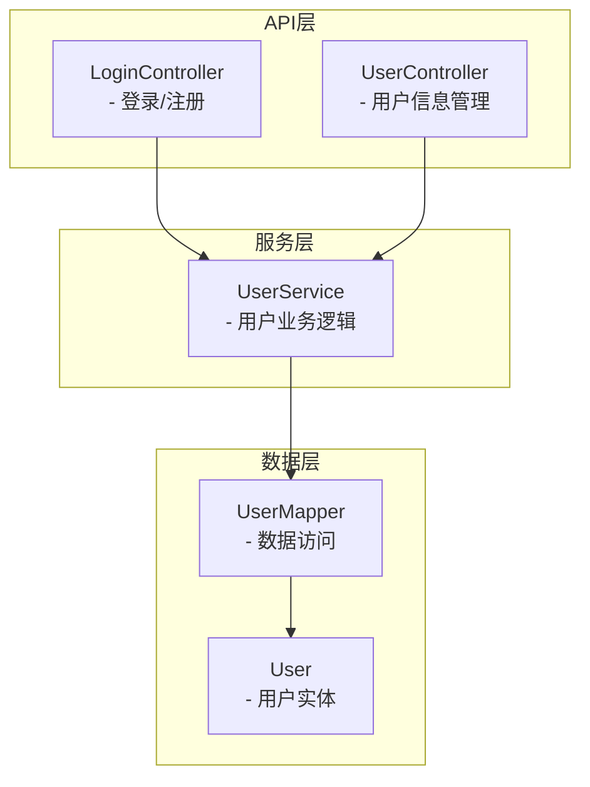
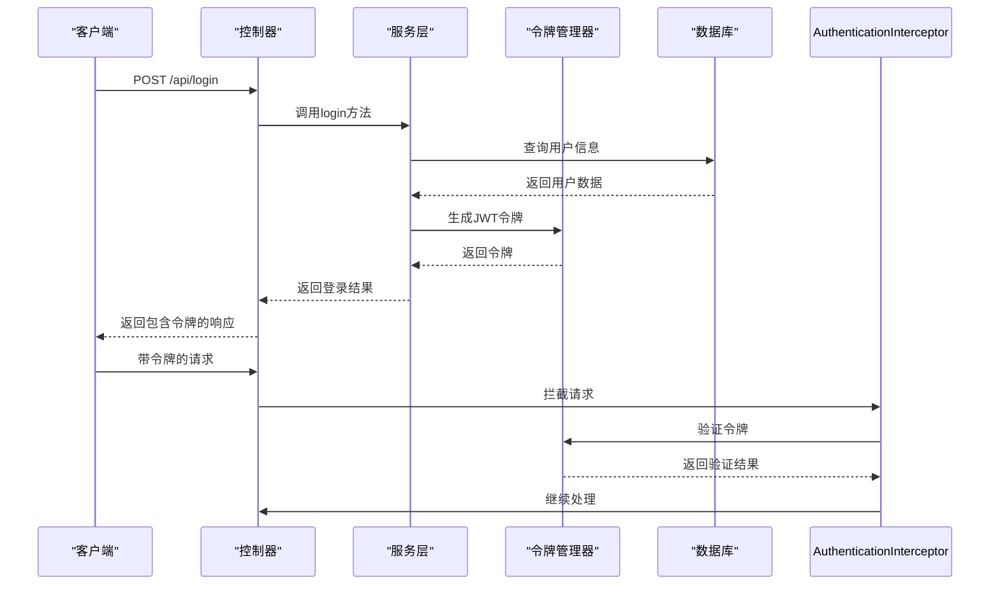
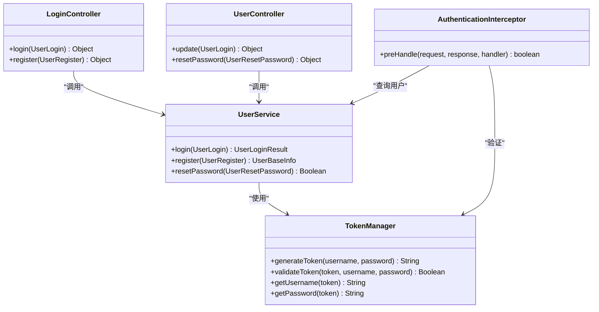
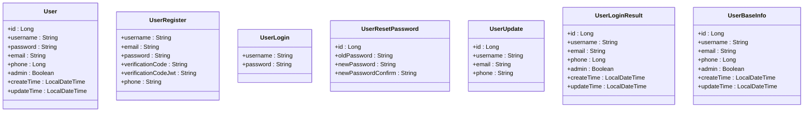
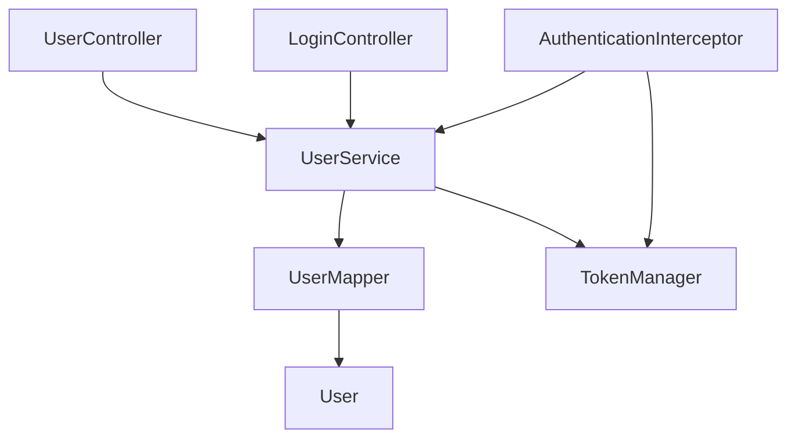

# 用户API

<cite>
**本文档引用的文件**   
- [LoginController.java](file://datavines-server\src\main\java\io\datavines\server\api\controller\LoginController.java)
- [UserController.java](file://datavines-server\src\main\java\io\datavines\server\api\controller\UserController.java)
- [UserService.java](file://datavines-server\src\main\java\io\datavines\server\repository\service\UserService.java)
- [UserServiceImpl.java](file://datavines-server\src\main\java\io\datavines\server\repository\service\impl\UserServiceImpl.java)
- [User.java](file://datavines-server\src\main\java\io\datavines\server\repository\entity\User.java)
- [UserLogin.java](file://datavines-server\src\main\java\io\datavines\server\api\dto\bo\user\UserLogin.java)
- [UserRegister.java](file://datavines-server\src\main\java\io\datavines\server\api\dto\bo\user\UserRegister.java)
- [UserResetPassword.java](file://datavines-server\src\main\java\io\datavines\server\api\dto\bo\user\UserResetPassword.java)
- [UserUpdate.java](file://datavines-server\src\main\java\io\datavines\server\api\dto\bo\user\UserUpdate.java)
- [TokenManager.java](file://datavines-core\src\main\java\io\datavines\core\utils\TokenManager.java)
- [AuthenticationInterceptor.java](file://datavines-server\src\main\java\io\datavines\server\api\inteceptor\AuthenticationInterceptor.java)
- [AuthIgnore.java](file://datavines-server\src\main\java\io\datavines\server\api\annotation\AuthIgnore.java)
- [CheckTokenExist.java](file://datavines-server\src\main\java\io\datavines\server\api\annotation\CheckTokenExist.java)
- [LoginUser.java](file://datavines-server\src\main\java\io\datavines\server\api\annotation\LoginUser.java)
</cite>

## 目录
1. [简介](#简介)
2. [项目结构](#项目结构)
3. [核心组件](#核心组件)
4. [架构概述](#架构概述)
5. [详细组件分析](#详细组件分析)
6. [依赖分析](#依赖分析)
7. [性能考虑](#性能考虑)
8. [故障排除指南](#故障排除指南)
9. [结论](#结论)

## 简介
本文档全面记录了DataVines平台中与用户账户管理相关的所有RESTful接口。文档详细描述了用户注册、登录、登出、密码重置、个人信息更新等API端点，涵盖了认证机制、权限控制模型、安全最佳实践以及用户状态管理等方面的内容。

## 项目结构
DataVines平台的用户管理功能主要集中在`datavines-server`模块中，相关代码位于`src/main/java/io/datavines/server/api`包下。用户相关的控制器、服务、实体和数据传输对象被组织在清晰的目录结构中，便于维护和扩展。

**图表来源**
- [LoginController.java](file://datavines-server\src\main\java\io\datavines\server\api\controller\LoginController.java#L1-L77)
- [UserController.java](file://datavines-server\src\main\java\io\datavines\server\api\controller\UserController.java#L1-L56)
- [UserService.java](file://datavines-server\src\main\java\io\datavines\server\repository\service\UserService.java#L1-L38)
- [User.java](file://datavines-server\src\main\java\io\datavines\server\repository\entity\User.java#L1-L62)

**章节来源**
- [LoginController.java](file://datavines-server\src\main\java\io\datavines\server\api\controller\LoginController.java#L1-L77)
- [UserController.java](file://datavines-server\src\main\java\io\datavines\server\api\controller\UserController.java#L1-L56)

## 核心组件
用户管理功能的核心组件包括用户控制器、用户服务、用户实体和认证拦截器。这些组件协同工作，实现了完整的用户生命周期管理功能。

**章节来源**
- [UserService.java](file://datavines-server\src\main\java\io\datavines\server\repository\service\UserService.java#L1-L38)
- [UserServiceImpl.java](file://datavines-server\src\main\java\io\datavines\server\repository\service\impl\UserServiceImpl.java#L1-L161)

## 架构概述
用户API采用典型的分层架构，包括表现层、业务逻辑层和数据访问层。认证机制基于JWT（JSON Web Token），通过拦截器实现统一的权限验证。

**图表来源**
- [LoginController.java](file://datavines-server\src\main\java\io\datavines\server\api\controller\LoginController.java#L51-L58)
- [TokenManager.java](file://datavines-core\src\main\java\io\datavines\core\utils\TokenManager.java#L51-L57)
- [AuthenticationInterceptor.java](file://datavines-server\src\main\java\io\datavines\server\api\inteceptor\AuthenticationInterceptor.java#L54-L104)

## 详细组件分析

### 用户认证分析
用户认证组件负责处理用户的登录、注册和令牌管理。通过JWT实现无状态的认证机制，确保系统的可扩展性。

#### 认证类图

**图表来源**
- [LoginController.java](file://datavines-server\src\main\java\io\datavines\server\api\controller\LoginController.java#L1-L77)
- [UserController.java](file://datavines-server\src\main\java\io\datavines\server\api\controller\UserController.java#L1-L56)
- [UserService.java](file://datavines-server\src\main\java\io\datavines\server\repository\service\UserService.java#L1-L38)
- [TokenManager.java](file://datavines-core\src\main\java\io\datavines\core\utils\TokenManager.java#L1-L197)
- [AuthenticationInterceptor.java](file://datavines-server\src\main\java\io\datavines\server\api\inteceptor\AuthenticationInterceptor.java#L1-L116)

**章节来源**
- [LoginController.java](file://datavines-server\src\main\java\io\datavines\server\api\controller\LoginController.java#L1-L77)
- [UserController.java](file://datavines-server\src\main\java\io\datavines\server\api\controller\UserController.java#L1-L56)
- [UserService.java](file://datavines-server\src\main\java\io\datavines\server\repository\service\UserService.java#L1-L38)

### 用户实体分析
用户实体定义了系统中用户的基本属性和数据结构，是用户管理功能的基础。

#### 用户实体类图

**图表来源**
- [User.java](file://datavines-server\src\main\java\io\datavines\server\repository\entity\User.java#L1-L62)
- [UserRegister.java](file://datavines-server\src\main\java\io\datavines\server\api\dto\bo\user\UserRegister.java#L1-L57)
- [UserLogin.java](file://datavines-server\src\main\java\io\datavines\server\api\dto\bo\user\UserLogin.java#L1-L37)
- [UserResetPassword.java](file://datavines-server\src\main\java\io\datavines\server\api\dto\bo\user\UserResetPassword.java#L1-L37)
- [UserUpdate.java](file://datavines-server\src\main\java\io\datavines\server\api\dto\bo\user\UserUpdate.java#L1-L37)
- [UserLoginResult.java](file://datavines-server\src\main\java\io\datavines\server\api\dto\vo\UserLoginResult.java#L1-L37)
- [UserBaseInfo.java](file://datavines-server\src\main\java\io\datavines\server\api\dto\vo\UserBaseInfo.java#L1-L37)

**章节来源**
- [User.java](file://datavines-server\src\main\java\io\datavines\server\repository\entity\User.java#L1-L62)
- [UserRegister.java](file://datavines-server\src\main\java\io\datavines\server\api\dto\bo\user\UserRegister.java#L1-L57)
- [UserLogin.java](file://datavines-server\src\main\java\io\datavines\server\api\dto\bo\user\UserLogin.java#L1-L37)

## 依赖分析
用户管理模块依赖于多个核心组件，包括JWT令牌管理、数据库访问和全局异常处理。这些依赖关系确保了功能的完整性和系统的稳定性。

**图表来源**
- [UserController.java](file://datavines-server\src\main\java\io\datavines\server\api\controller\UserController.java#L1-L56)
- [LoginController.java](file://datavines-server\src\main\java\io\datavines\server\api\controller\LoginController.java#L1-L77)
- [UserService.java](file://datavines-server\src\main\java\io\datavines\server\repository\service\UserService.java#L1-L38)
- [TokenManager.java](file://datavines-core\src\main\java\io\datavines\core\utils\TokenManager.java#L1-L197)
- [AuthenticationInterceptor.java](file://datavines-server\src\main\java\io\datavines\server\api\inteceptor\AuthenticationInterceptor.java#L1-L116)

**章节来源**
- [UserService.java](file://datavines-server\src\main\java\io\datavines\server\repository\service\UserService.java#L1-L38)
- [TokenManager.java](file://datavines-core\src\main\java\io\datavines\core\utils\TokenManager.java#L1-L197)
- [AuthenticationInterceptor.java](file://datavines-server\src\main\java\io\datavines\server\api\inteceptor\AuthenticationInterceptor.java#L1-L116)

## 性能考虑
用户认证系统采用了JWT无状态认证机制，避免了服务器端会话存储，提高了系统的可扩展性。密码使用BCrypt算法进行哈希存储，确保了安全性的同时也考虑了计算性能。

## 故障排除指南
当用户遇到登录问题时，应首先检查用户名和密码是否正确。如果忘记密码，可以使用密码重置功能。系统会验证旧密码的正确性，然后允许设置新密码。

**章节来源**
- [UserServiceImpl.java](file://datavines-server\src\main\java\io\datavines\server\repository\service\impl\UserServiceImpl.java#L133-L153)
- [TokenManager.java](file://datavines-core\src\main\java\io\datavines\core\utils\TokenManager.java#L163-L167)

## 结论
DataVines平台的用户API提供了完整的用户账户管理功能，包括注册、登录、密码重置等核心操作。通过JWT认证机制和分层架构设计，系统既保证了安全性又具备良好的可扩展性。建议在使用时遵循安全最佳实践，定期更新密码并妥善保管认证令牌。