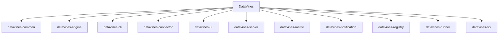

# 开发者指南

<cite>
**本文档中引用的文件**   
- [pom.xml](file://pom.xml)
- [README.md](file://README.md)
- [mvnw](file://mvnw)
- [application.yaml](file://datavines-server/src/main/resources/application.yaml)
- [package.json](file://datavines-ui/package.json)
- [checkStyle.xml](file://tools/checkstyle/checkStyle.xml)
- [datavines-daemon.sh](file://bin/datavines-daemon.sh)
- [datavines-submit.sh](file://bin/datavines-submit.sh)
- [.eslintrc.js](file://datavines-ui/.eslintrc.js)
- [DataVinesArchitecture](docs/img/architecture.jpg)
</cite>

## 目录
1. [简介](#简介)
2. [项目结构](#项目结构)
3. [开发环境搭建](#开发环境搭建)
4. [构建系统与依赖管理](#构建系统与依赖管理)
5. [代码风格与规范](#代码风格与规范)
6. [单元测试与集成测试](#单元测试与集成测试)
7. [代码提交流程](#代码提交流程)
8. [代码审查标准](#代码审查标准)
9. [调试技巧与性能分析](#调试技巧与性能分析)
10. [分支策略与发布流程](#分支策略与发布流程)
11. [新贡献者入门指导](#新贡献者入门指导)

## 简介
DataVines 是一个易于使用的数据质量服务平台，支持多种指标。该项目采用插件化设计，具有良好的扩展性，支持多种数据源、检查规则、作业执行引擎、告警通道、错误数据存储和注册中心。平台提供网页配置检查作业、运行作业、查看作业执行日志、查看错误数据和检查结果的功能，同时也支持在线生成作业运行脚本，通过 `datavines-submit.sh` 提交作业，可与调度系统结合使用。

**Section sources**
- [README.md](file://README.md#L19-L136)

## 项目结构
DataVines 项目采用 Maven 多模块结构，主要模块包括：
- `datavines-common`: 公共模块，包含配置、数据源、实体、枚举、异常、日志、参数、工具类等
- `datavines-engine`: 引擎模块，包含引擎API、公共工具、配置、核心、执行器和插件
- `datavines-cli`: 命令行接口模块
- `datavines-connector`: 连接器模块，包含API和各种数据源插件
- `datavines-ui`: 用户界面模块，基于 React 和 Ant Design 构建
- `datavines-server`: 服务器模块，基于 Spring Boot 构建
- `datavines-metric`: 指标模块，包含API、期望值插件、指标插件和结果公式插件
- `datavines-notification`: 通知模块，包含API、核心和各种通知插件
- `datavines-registry`: 注册中心模块，包含API和各种注册中心插件
- `datavines-runner`: 作业执行模块
- `datavines-spi`: SPI 模块，包含插件加载、优先级和SPI注解



**Diagram sources **
- [pom.xml](file://pom.xml#L30-L45)

**Section sources**
- [pom.xml](file://pom.xml#L21-L907)

## 开发环境搭建
### 前置条件
- JDK 8
- Maven 3.6.1 或更高版本
- Node.js (用于前端开发)
- 数据库 (MySQL 或 PostgreSQL)

### 环境配置
1. 克隆项目仓库
2. 配置数据库连接信息
3. 安装前端依赖

```bash
# 安装前端依赖
cd datavines-ui
npm install
```

**Section sources**
- [README.md](file://README.md#L95-L97)
- [application.yaml](file://datavines-server/src/main/resources/application.yaml#L17-L96)
- [package.json](file://datavines-ui/package.json#L1-L100)

## 构建系统与依赖管理
### Maven 构建
DataVines 使用 Maven 作为构建工具。项目根目录下的 `pom.xml` 文件定义了所有模块的依赖关系和构建配置。

```bash
# 构建项目
mvn clean package -Prelease -DskipTests
```

### 依赖管理
项目使用 Maven 的 `dependencyManagement` 来统一管理依赖版本，确保所有模块使用一致的依赖版本。

```xml
<dependencyManagement>
    <dependencies>
        <dependency>
            <groupId>org.springframework.boot</groupId>
            <artifactId>spring-boot-starter-parent</artifactId>
            <version>${spring.boot.version}</version>
            <type>pom</type>
            <scope>import</scope>
        </dependency>
        <!-- 其他依赖 -->
    </dependencies>
</dependencyManagement>
```

**Section sources**
- [pom.xml](file://pom.xml#L129-L701)
- [README.md](file://README.md#L31-L34)

## 代码风格与规范
### Java 代码规范
项目使用 Checkstyle 进行代码风格检查，配置文件位于 `tools/checkstyle/checkStyle.xml`。主要规范包括：
- 使用 UTF-8 编码
- 禁止使用 `System.out.println`
- 禁止使用 `@author` 注解
- 禁止使用中文字符
- 禁止 TODO 注释中包含用户名
- 禁止行尾空格
- 禁止使用 `Throwables.propagate`
- 文件长度不超过 3000 行
- 行长度不超过 500 字符
- 包名必须以 `io.datavines` 开头
- 类名、方法名、变量名遵循驼峰命名法

### JavaScript/TypeScript 代码规范
前端代码使用 ESLint 进行代码风格检查，配置文件位于 `datavines-ui/.eslintrc.js`。主要规范包括：
- 使用 4 空格缩进
- 使用单引号
- 行长度不超过 200 字符
- 禁用 `no-console` 规则
- 禁用 `no-use-before-define` 规则

**Section sources**
- [checkStyle.xml](file://tools/checkstyle/checkStyle.xml#L1-L522)
- [.eslintrc.js](file://datavines-ui/.eslintrc.js#L1-L62)

## 单元测试与集成测试
### 单元测试
项目使用 JUnit 进行单元测试，测试代码位于各模块的 `src/test` 目录下。

```java
@Test
public void testDataVinesClient() {
    // 测试代码
}
```

### 集成测试
项目使用 Spring Test 进行集成测试，测试代码位于 `datavines-server` 模块的 `src/test` 目录下。

```java
@SpringBootTest
class DataVinesServerApplicationTests {
    @Test
    void contextLoads() {
    }
}
```

**Section sources**
- [pom.xml](file://pom.xml#L295-L300)
- [spring.version](file://pom.xml#L105)
- [DataVinesClientTest.java](file://datavines-client/datavines-http-client/datavines-http-client-core/src/test/java/io/datavines/http/clinet/DataVinesClientTest.java)
- [ZooKeeperRegistryTest.java](file://datavines-registry/datavines-registry-plugins/datavines-registry-zookeeper/src/test/java/io/datavines/registry/plugin/ZooKeeperRegistryTest.java)

## 代码提交流程
1. 创建新的功能分支
2. 在分支上进行开发
3. 提交代码到远程仓库
4. 创建 Pull Request
5. 等待代码审查
6. 根据审查意见修改代码
7. 合并到主分支

```bash
# 创建功能分支
git checkout -b feature/new-feature

# 提交代码
git add .
git commit -m "Add new feature"
git push origin feature/new-feature
```

**Section sources**
- [README.md](file://README.md#L107-L115)

## 代码审查标准
### 代码质量
- 代码必须通过 Checkstyle 和 ESLint 检查
- 代码必须有适当的单元测试和集成测试
- 代码必须有适当的注释和文档
- 代码必须遵循项目的设计模式和架构

### 代码风格
- 代码必须遵循项目的代码风格规范
- 代码必须有适当的命名
- 代码必须有适当的缩进和格式化

### 功能实现
- 功能必须完整实现
- 功能必须经过充分测试
- 功能必须有适当的错误处理

**Section sources**
- [checkStyle.xml](file://tools/checkstyle/checkStyle.xml#L1-L522)
- [.eslintrc.js](file://datavines-ui/.eslintrc.js#L1-L62)

## 调试技巧与性能分析
### 调试技巧
- 使用 IDE 的调试功能
- 使用日志输出调试信息
- 使用 JMX 进行远程监控和调试

### 性能分析
- 使用 JProfiler 或 VisualVM 进行性能分析
- 使用 JMX Exporter 导出性能指标
- 使用 Prometheus 和 Grafana 进行监控

**Section sources**
- [application.yaml](file://datavines-server/src/main/resources/application.yaml#L72-L80)
- [jmx_exporter_config.yaml](file://datavines-server/src/main/resources/jmx/jmx_exporter_config.yaml)

## 分支策略与发布流程
### 分支策略
- `main` 分支：主分支，用于发布稳定版本
- `develop` 分支：开发分支，用于集成开发中的功能
- `feature/*` 分支：功能分支，用于开发新功能
- `hotfix/*` 分支：热修复分支，用于修复紧急问题

### 发布流程
1. 从 `develop` 分支创建发布分支 `release/*`
2. 在发布分支上进行最后的测试和修复
3. 合并发布分支到 `main` 分支
4. 在 `main` 分支上打标签
5. 合并发布分支到 `develop` 分支
6. 删除发布分支

**Section sources**
- [README.md](file://README.md#L107-L115)

## 新贡献者入门指导
### 入门步骤
1. 阅读项目 README 文件
2. 搭建开发环境
3. 运行项目
4. 阅读代码
5. 选择一个简单的任务开始贡献

### 贡献方式
- 提交 Bug 报告
- 提交功能建议
- 提交代码补丁
- 改进文档

### 资源链接
- [项目文档](https://datavane.github.io/datavines-website/docs/user-guide/quick-start)
- [开发环境准备](https://datavane.github.io/datavines-website/docs/development/environment-preparation)
- [贡献指南](https://github.com/datavane/datavines/blob/main/CONTRIBUTING.md)

**Section sources**
- [README.md](file://README.md#L101-L115)