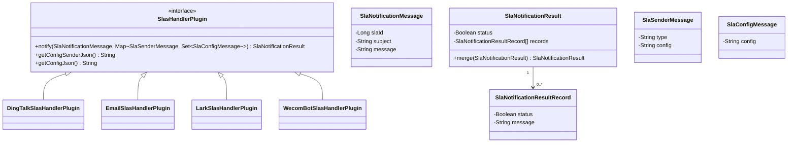
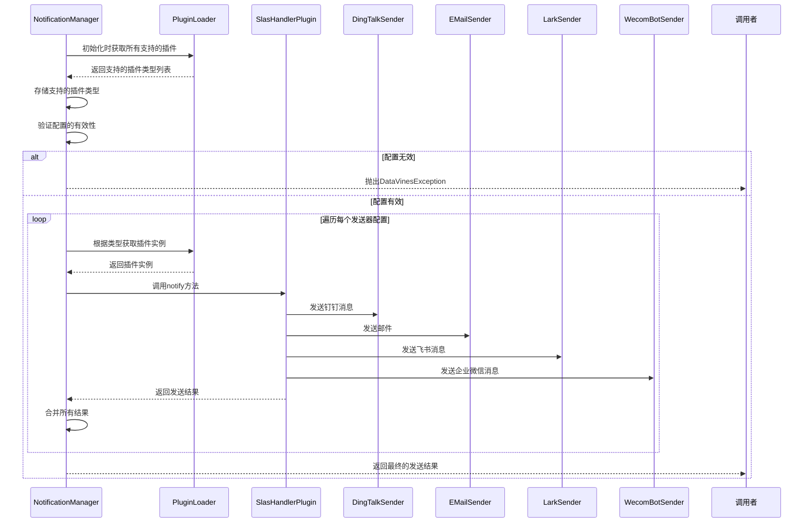
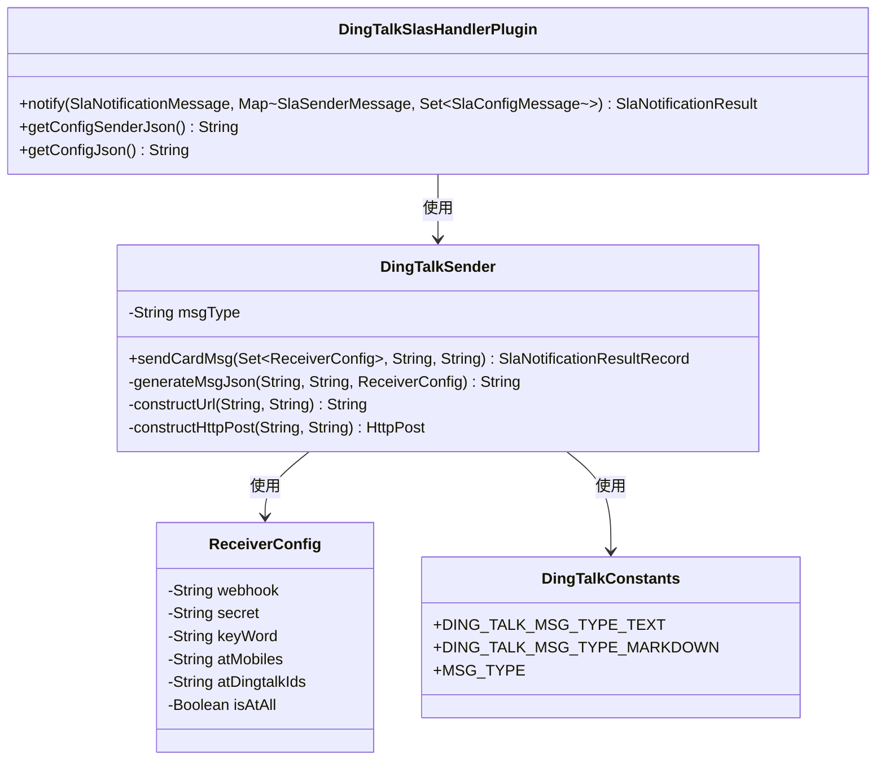
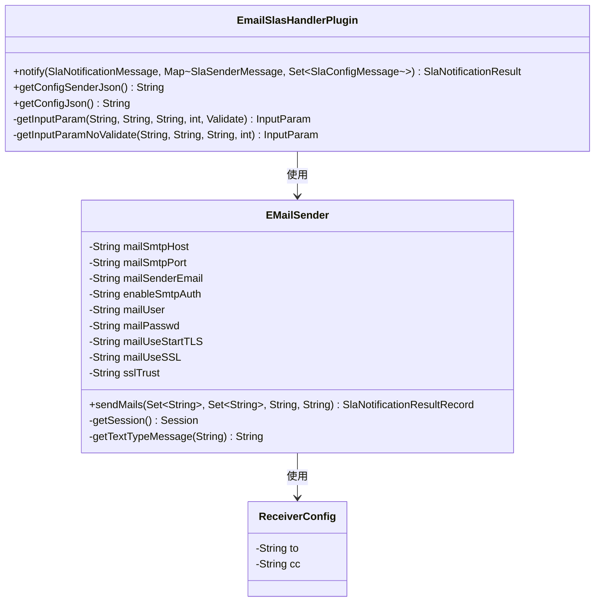
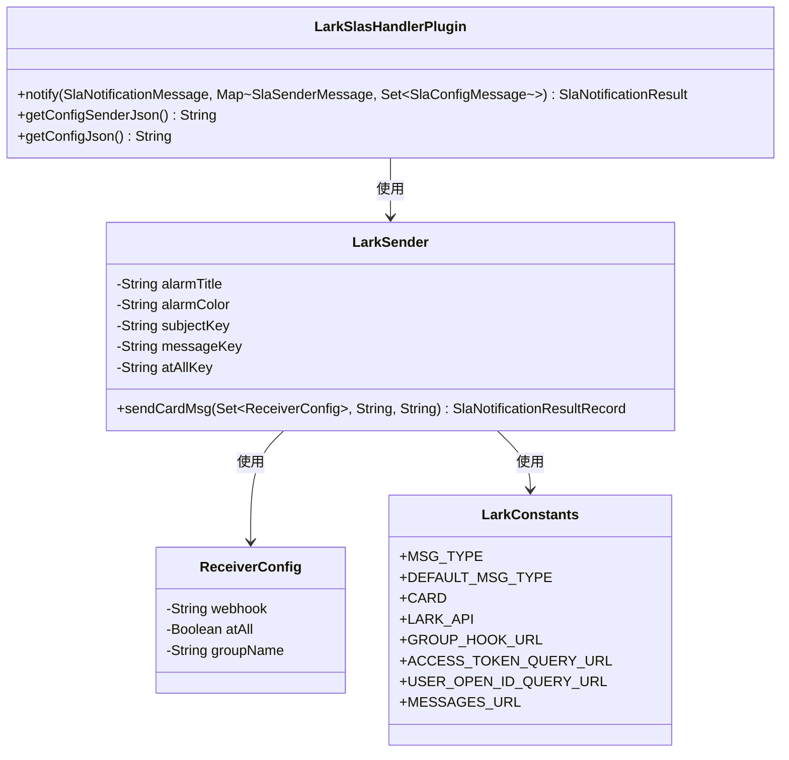
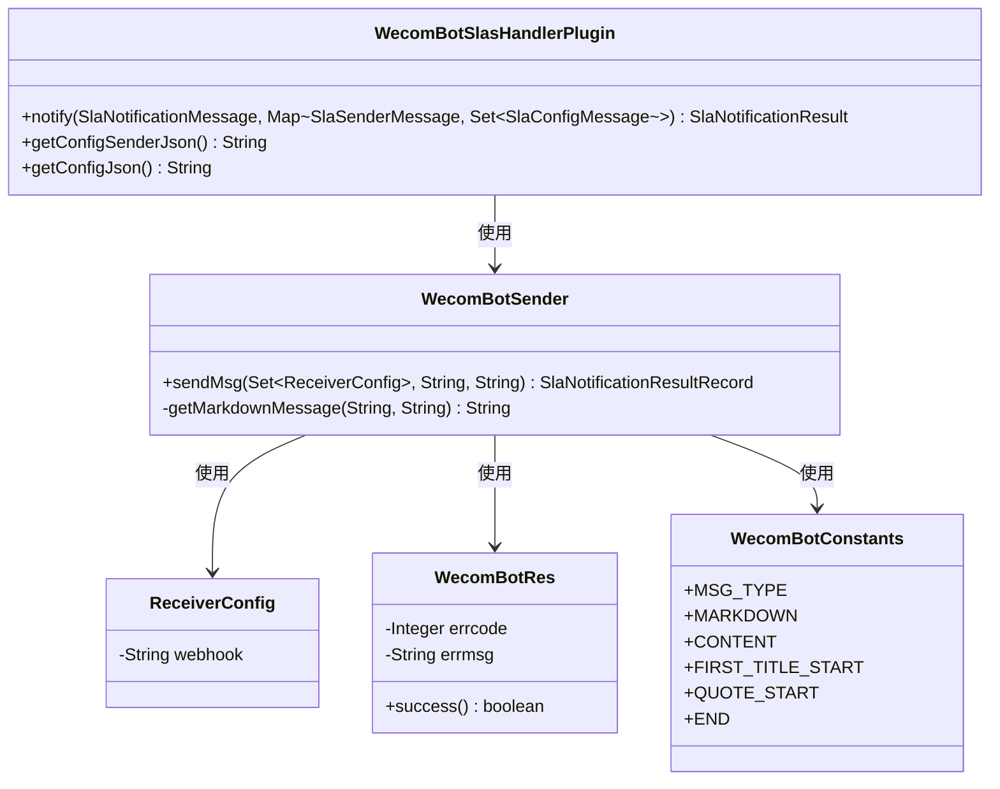
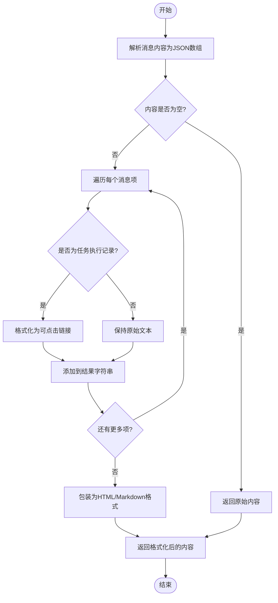
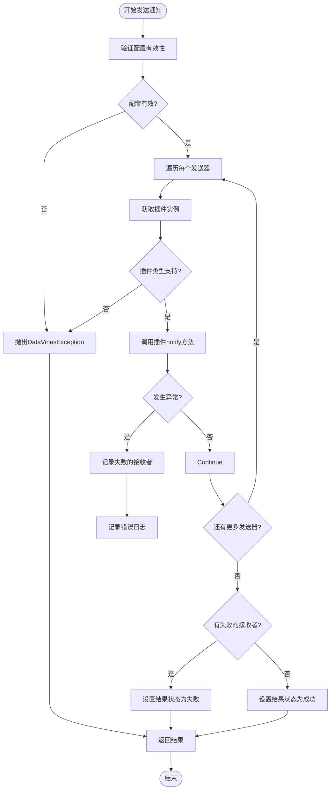
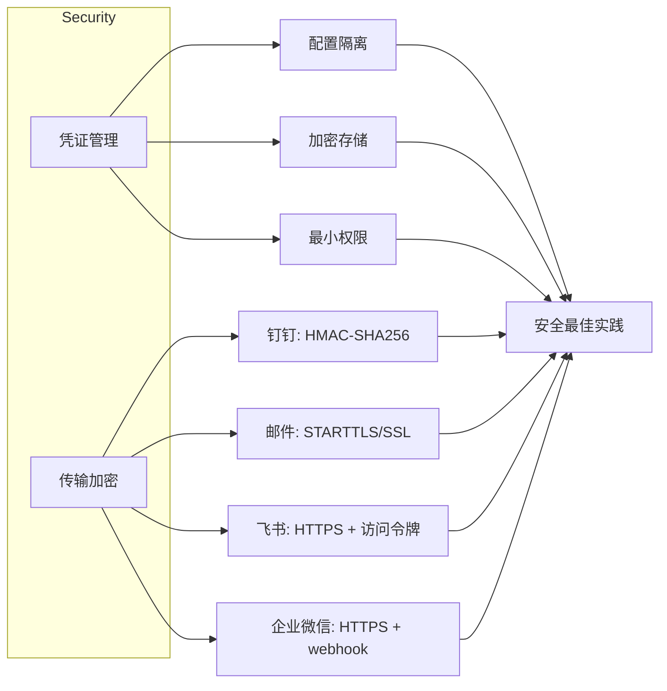

# 告警通道插件开发

<cite>
**本文档中引用的文件**   
- [SlasHandlerPlugin.java](file://datavines-notification\datavines-notification-api\src\main\java\io\datavines\notification\api\spi\SlasHandlerPlugin.java)
- [NotificationManager.java](file://datavines-notification\datavines-notification-core\src\main\java\io\datavines\notification\core\NotificationManager.java)
- [DingTalkSlasHandlerPlugin.java](file://datavines-notification\datavines-notification-plugins\datavines-notification-plugin-dingtalk\src\main\java\io\datavines\notification\plugin\dingtalk\DingTalkSlasHandlerPlugin.java)
- [EmailSlasHandlerPlugin.java](file://datavines-notification\datavines-notification-plugins\datavines-notification-plugin-email\src\main\java\io\datavines\notification\plugin\email\EmailSlasHandlerPlugin.java)
- [LarkSlasHandlerPlugin.java](file://datavines-notification\datavines-notification-plugins\datavines-notification-plugin-lark\src\main\java\io\datavines\notification\plugin\lark\LarkSlasHandlerPlugin.java)
- [WecomBotSlasHandlerPlugin.java](file://datavines-notification\datavines-notification-plugins\datavines-notification-plugin-wecombot\src\main\java\io\datavines\notification\plugin\wecombot\WecomBotSlasHandlerPlugin.java)
- [DingTalkSender.java](file://datavines-notification\datavines-notification-plugins\datavines-notification-plugin-dingtalk\src\main\java\io\datavines\notification\plugin\dingtalk\DingTalkSender.java)
- [EMailSender.java](file://datavines-notification\datavines-notification-plugins\datavines-notification-plugin-email\src\main\java\io\datavines\notification\plugin\email\EMailSender.java)
- [LarkSender.java](file://datavines-notification\datavines-notification-plugins\datavines-notification-plugin-lark\src\main\java\io\datavines\notification\plugin\lark\LarkSender.java)
- [WecomBotSender.java](file://datavines-notification\datavines-notification-plugins\datavines-notification-plugin-wecombot\src\main\java\io\datavines\notification\plugin\wecombot\WecomBotSender.java)
- [SlaNotificationMessage.java](file://datavines-notification\datavines-notification-api\src\main\java\io\datavines\notification\api\entity\SlaNotificationMessage.java)
- [SlaNotificationResult.java](file://datavines-notification\datavines-notification-api\src\main\java\io\datavines\notification\api\entity\SlaNotificationResult.java)
- [NotificationConstants.java](file://datavines-notification\datavines-notification-api\src\main\java\io\datavines\notification\api\constants\NotificationConstants.java)
- [DingTalkConstants.java](file://datavines-notification\datavines-notification-plugins\datavines-notification-plugin-dingtalk\src\main\java\io\datavines\notification\plugin\dingtalk\DingTalkConstants.java)
- [LarkConstants.java](file://datavines-notification\datavines-notification-plugins\datavines-notification-plugin-lark\src\main\java\io\datavines\notification\plugin\lark\LarkConstants.java)
- [WecomBotConstants.java](file://datavines-notification\datavines-notification-plugins\datavines-notification-plugin-wecombot\src\main\java\io\datavines\notification\plugin\wecombot\WecomBotConstants.java)
</cite>

## 目录
1. [引言](#引言)
2. [核心接口设计](#核心接口设计)
3. [通知管理器架构](#通知管理器架构)
4. [插件实现示例](#插件实现示例)
5. [通知模板与动态内容](#通知模板与动态内容)
6. [错误处理与重试机制](#错误处理与重试机制)
7. [安全性考虑](#安全性考虑)
8. [开发指南](#开发指南)

## 引言
本文档详细介绍了如何为DataVines开发新的告警通知插件。通过分析现有的钉钉、邮件、飞书和企业微信插件实现，我们将深入探讨SlasHandlerPlugin接口的设计原理和实现方法。文档涵盖了从消息构建、认证处理到请求发送的完整流程，以及通知模板配置、动态内容填充、发送失败重试机制和错误日志记录等关键功能。同时，我们也会讨论凭证管理和传输加密等安全性考虑，为开发者提供全面的指导。

## 核心接口设计

告警通道插件的核心是`SlasHandlerPlugin`接口，它定义了所有通知插件必须实现的基本功能。该接口通过SPI（Service Provider Interface）机制进行扩展，允许系统动态加载和管理不同的通知通道。

**图示来源**
- [SlasHandlerPlugin.java](file://datavines-notification\datavines-notification-api\src\main\java\io\datavines\notification\api\spi\SlasHandlerPlugin.java#L28-L42)
- [SlaNotificationMessage.java](file://datavines-notification\datavines-notification-api\src\main\java\io\datavines\notification\api\entity\SlaNotificationMessage.java#L28-L35)
- [SlaNotificationResult.java](file://datavines-notification\datavines-notification-api\src\main\java\io\datavines\notification\api\entity\SlaNotificationResult.java#L30-L52)

`SlasHandlerPlugin`接口包含三个核心方法：
- `notify`：执行实际的通知发送操作，接收通知消息和配置信息，返回发送结果
- `getConfigSenderJson`：获取发送器级别的配置信息，通常包含通道的全局配置
- `getConfigJson`：获取具体通知配置信息，定义了用户在创建告警时需要填写的参数

**本节来源**
- [SlasHandlerPlugin.java](file://datavines-notification\datavines-notification-api\src\main\java\io\datavines\notification\api\spi\SlasHandlerPlugin.java#L28-L42)

## 通知管理器架构

`NotificationManager`是告警通知系统的核心管理组件，负责协调各个通知插件的调用。它使用插件加载器动态发现和实例化所有支持的告警通道插件，并根据配置信息路由通知请求。

**图示来源**
- [NotificationManager.java](file://datavines-notification\datavines-notification-core\src\main\java\io\datavines\notification\core\NotificationManager.java#L35-L69)

`NotificationManager`的实现要点包括：
1. 在构造函数中通过`PluginLoader`获取所有支持的插件类型，存储在`supportedPlugins`集合中
2. `notify`方法首先验证配置的有效性，确保至少有一个发送器配置
3. 遍历配置中的每个发送器，检查其类型是否被支持
4. 通过`PluginLoader`获取对应类型的插件实例
5. 调用插件的`notify`方法执行实际的通知发送
6. 将各个插件的发送结果合并，返回统一的结果

**本节来源**
- [NotificationManager.java](file://datavines-notification\datavines-notification-core\src\main\java\io\datavines\notification\core\NotificationManager.java#L35-L69)

## 插件实现示例

### 钉钉插件实现

钉钉告警插件`DingTalkSlasHandlerPlugin`实现了`SlasHandlerPlugin`接口，提供了完整的钉钉机器人消息发送功能。

**图示来源**
- [DingTalkSlasHandlerPlugin.java](file://datavines-notification\datavines-notification-plugins\datavines-notification-plugin-dingtalk\src\main\java\io\datavines\notification\plugin\dingtalk\DingTalkSlasHandlerPlugin.java#L39-L133)
- [DingTalkSender.java](file://datavines-notification\datavines-notification-plugins\datavines-notification-plugin-dingtalk\src\main\java\io\datavines\notification\plugin\dingtalk\DingTalkSender.java#L51-L192)
- [DingTalkConstants.java](file://datavines-notification\datavines-notification-plugins\datavines-notification-plugin-dingtalk\src\main\java\io\datavines\notification\plugin\dingtalk\DingTalkConstants.java#L19-L30)

钉钉插件的关键实现细节：
- `notify`方法过滤出类型为"dingtalk"的发送器配置，为每个配置创建`DingTalkSender`实例
- `getConfigJson`方法定义了钉钉通知的配置参数，包括webhook、secret、关键词、@手机号等
- `DingTalkSender`负责构建符合钉钉API要求的JSON消息体，支持文本和Markdown格式
- 实现了钉钉机器人安全验证机制，通过HMAC-SHA256签名确保请求的安全性

**本节来源**
- [DingTalkSlasHandlerPlugin.java](file://datavines-notification\datavines-notification-plugins\datavines-notification-plugin-dingtalk\src\main\java\io\datavines\notification\plugin\dingtalk\DingTalkSlasHandlerPlugin.java#L39-L133)
- [DingTalkSender.java](file://datavines-notification\datavines-notification-plugins\datavines-notification-plugin-dingtalk\src\main\java\io\datavines\notification\plugin\dingtalk\DingTalkSender.java#L51-L192)

### 邮件插件实现

邮件告警插件`EmailSlasHandlerPlugin`提供了完整的邮件发送功能，支持SMTP认证和SSL/TLS加密。

**图示来源**
- [EmailSlasHandlerPlugin.java](file://datavines-notification\datavines-notification-plugins\datavines-notification-plugin-email\src\main\java\io\datavines\notification\plugin\email\EmailSlasHandlerPlugin.java#L43-L224)
- [EMailSender.java](file://datavines-notification\datavines-notification-plugins\datavines-notification-plugin-email\src\main\java\io\datavines\notification\plugin\email\EMailSender.java#L44-L197)

邮件插件的关键实现细节：
- `notify`方法解析收件人和抄送人列表，支持逗号或分号分隔的多个邮箱地址
- `getConfigSenderJson`方法定义了邮件服务器的全局配置，包括SMTP主机、端口、认证信息等
- `getConfigJson`方法定义了具体的收件人配置
- `EMailSender`使用Apache Commons Mail库发送邮件，支持HTML格式和附件
- 实现了完整的SMTP会话配置，包括STARTTLS、SSL和证书信任设置

**本节来源**
- [EmailSlasHandlerPlugin.java](file://datavines-notification\datavines-notification-plugins\datavines-notification-plugin-email\src\main\java\io\datavines\notification\plugin\email\EmailSlasHandlerPlugin.java#L43-L224)
- [EMailSender.java](file://datavines-notification\datavines-notification-plugins\datavines-notification-plugin-email\src\main\java\io\datavines\notification\plugin\email\EMailSender.java#L44-L197)

### 飞书插件实现

飞书告警插件`LarkSlasHandlerPlugin`实现了飞书机器人的消息发送功能。

**图示来源**
- [LarkSlasHandlerPlugin.java](file://datavines-notification\datavines-notification-plugins\datavines-notification-plugin-lark\src\main\java\io\datavines\notification\plugin\lark\LarkSlasHandlerPlugin.java#L39-L132)
- [LarkSender.java](file://datavines-notification\datavines-notification-plugins\datavines-notification-plugin-lark\src\main\java\io\datavines\notification\plugin\lark\LarkSender.java#L38-L84)
- [LarkConstants.java](file://datavines-notification\datavines-notification-plugins\datavines-notification-plugin-lark\src\main\java\io\datavines\notification\plugin\lark\LarkConstants.java#L20-L35)

飞书插件的关键实现细节：
- 使用飞书的交互式卡片消息格式，提供更好的视觉效果
- 支持@所有人功能，通过`atAll`配置项控制
- `LarkSender`直接使用HTTP工具类发送POST请求到飞书API
- 消息内容采用结构化JSON格式，包含标题、颜色和消息列表

**本节来源**
- [LarkSlasHandlerPlugin.java](file://datavines-notification\datavines-notification-plugins\datavines-notification-plugin-lark\src\main\java\io\datavines\notification\plugin\lark\LarkSlasHandlerPlugin.java#L39-L132)
- [LarkSender.java](file://datavines-notification\datavines-notification-plugins\datavines-notification-plugin-lark\src\main\java\io\datavines\notification\plugin\lark\LarkSender.java#L38-L84)

### 企业微信插件实现

企业微信告警插件`WecomBotSlasHandlerPlugin`实现了企业微信机器人的消息发送功能。

**图示来源**
- [WecomBotSlasHandlerPlugin.java](file://datavines-notification\datavines-notification-plugins\datavines-notification-plugin-wecombot\src\main\java\io\datavines\notification\plugin\wecombot\WecomBotSlasHandlerPlugin.java#L33-L97)
- [WecomBotSender.java](file://datavines-notification\datavines-notification-plugins\datavines-notification-plugin-wecombot\src\main\java\io\datavines\notification\plugin\wecombot\WecomBotSender.java#L38-L95)
- [WecomBotConstants.java](file://datavines-notification\datavines-notification-plugins\datavines-notification-plugin-wecombot\src\main\java\io\datavines\notification\plugin\wecombot\WecomBotConstants.java)

企业微信插件的关键实现细节：
- 使用Markdown消息格式，支持丰富的文本样式
- `WecomBotSender`发送消息后会解析响应结果，通过`WecomBotRes`类判断发送是否成功
- 实现了消息内容的格式化处理，将JSON数组转换为Markdown列表
- 支持链接格式化，将任务执行记录转换为可点击的链接

**本节来源**
- [WecomBotSlasHandlerPlugin.java](file://datavines-notification\datavines-notification-plugins\datavines-notification-plugin-wecombot\src\main\java\io\datavines\notification\plugin\wecombot\WecomBotSlasHandlerPlugin.java#L33-L97)
- [WecomBotSender.java](file://datavines-notification\datavines-notification-plugins\datavines-notification-plugin-wecombot\src\main\java\io\datavines\notification\plugin\wecombot\WecomBotSender.java#L38-L95)

## 通知模板与动态内容

DataVines的告警通知系统支持灵活的消息模板和动态内容填充。通知消息由主题（subject）和内容（message）两部分组成，其中内容可以是包含多个消息项的JSON数组。

**图示来源**
- [EMailSender.java](file://datavines-notification\datavines-notification-plugins\datavines-notification-plugin-email\src\main\java\io\datavines\notification\plugin\email\EMailSender.java#L178-L193)
- [WecomBotSender.java](file://datavines-notification\datavines-notification-plugins\datavines-notification-plugin-wecombot\src\main\java\io\datavines\notification\plugin\wecombot\WecomBotSender.java#L76-L93)

不同通知通道对消息内容的处理方式：
- **邮件**：将JSON数组转换为HTML表格，任务执行记录转换为超链接
- **企业微信**：将JSON数组转换为Markdown列表，任务执行记录转换为可点击链接
- **钉钉**：支持文本和Markdown格式，可包含@功能
- **飞书**：使用交互式卡片格式，提供结构化的消息展示

**本节来源**
- [EMailSender.java](file://datavines-notification\datavines-notification-plugins\datavines-notification-plugin-email\src\main\java\io\datavines\notification\plugin\email\EMailSender.java#L178-L193)
- [WecomBotSender.java](file://datavines-notification\datavines-notification-plugins\datavines-notification-plugin-wecombot\src\main\java\io\datavines\notification\plugin\wecombot\WecomBotSender.java#L76-L93)
- [DingTalkSender.java](file://datavines-notification\datavines-notification-plugins\datavines-notification-plugin-dingtalk\src\main\java\io\datavines\notification\plugin\dingtalk\DingTalkSender.java#L111-L177)
- [LarkSender.java](file://datavines-notification\datavines-notification-plugins\datavines-notification-plugin-lark\src\main\java\io\datavines\notification\plugin\lark\LarkSender.java#L61-L66)

## 错误处理与重试机制

告警通知系统实现了完善的错误处理和重试机制，确保通知的可靠送达。

**图示来源**
- [NotificationManager.java](file://datavines-notification\datavines-notification-core\src\main\java\io\datavines\notification\core\NotificationManager.java#L45-L68)
- [DingTalkSender.java](file://datavines-notification\datavines-notification-plugins\datavines-notification-plugin-dingtalk\src\main\java\io\datavines\notification\plugin\dingtalk\DingTalkSender.java#L55-L89)
- [EMailSender.java](file://datavines-notification\datavines-notification-plugins\datavines-notification-plugin-email\src\main\java\io\datavines\notification\plugin\email\EMailSender.java#L137-L140)

错误处理的关键特点：
1. **分层错误处理**：在`NotificationManager`层面验证配置有效性，在插件层面处理具体的发送错误
2. **细粒度失败记录**：每个插件记录具体的失败接收者，提供详细的错误信息
3. **异常捕获**：所有发送操作都包含在try-catch块中，防止单个发送失败影响整体流程
4. **日志记录**：详细的错误日志帮助诊断问题，包括异常堆栈信息
5. **结果合并**：将所有插件的发送结果合并，提供统一的成功/失败状态

**本节来源**
- [NotificationManager.java](file://datavines-notification\datavines-notification-core\src\main\java\io\datavines\notification\core\NotificationManager.java#L45-L68)
- [DingTalkSender.java](file://datavines-notification\datavines-notification-plugins\datavines-notification-plugin-dingtalk\src\main\java\io\datavines\notification\plugin\dingtalk\DingTalkSender.java#L55-L89)
- [EMailSender.java](file://datavines-notification\datavines-notification-plugins\datavines-notification-plugin-email\src\main\java\io\datavines\notification\plugin\email\EMailSender.java#L137-L140)

## 安全性考虑

告警通知系统在设计时充分考虑了安全性，特别是在凭证管理和传输加密方面。

### 凭证管理

系统通过以下方式确保凭证的安全：
- **配置隔离**：发送器级别的配置（如SMTP服务器、用户名、密码）与具体的接收者配置分离
- **加密存储**：敏感信息如密码在存储时应进行加密处理
- **最小权限原则**：每个通知通道使用专用的凭证，避免权限过度分配

### 传输加密

不同通知通道的传输加密机制：
- **钉钉**：支持通过secret进行HMAC-SHA256签名，确保请求的完整性和真实性
- **邮件**：支持STARTTLS和SSL/TLS加密，保护邮件内容在传输过程中的安全
- **飞书**：通过HTTPS协议传输，使用访问令牌进行身份验证
- **企业微信**：通过HTTPS协议传输，使用webhook URL进行身份验证

**图示来源**
- [DingTalkSender.java](file://datavines-notification\datavines-notification-plugins\datavines-notification-plugin-dingtalk\src\main\java\io\datavines\notification\plugin\dingtalk\DingTalkSender.java#L96-L109)
- [EMailSender.java](file://datavines-notification\datavines-notification-plugins\datavines-notification-plugin-email\src\main\java\io\datavines\notification\plugin\email\EMailSender.java#L154-L163)
- [LarkSender.java](file://datavines-notification\datavines-notification-plugins\datavines-notification-plugin-lark\src\main\java\io\datavines\notification\plugin\lark\LarkSender.java#L67)
- [WecomBotSender.java](file://datavines-notification\datavines-notification-plugins\datavines-notification-plugin-wecombot\src\main\java\io\datavines\notification\plugin\wecombot\WecomBotSender.java#L54)

**本节来源**
- [DingTalkSender.java](file://datavines-notification\datavines-notification-plugins\datavines-notification-plugin-dingtalk\src\main\java\io\datavines\notification\plugin\dingtalk\DingTalkSender.java#L96-L109)
- [EMailSender.java](file://datavines-notification\datavines-notification-plugins\datavines-notification-plugin-email\src\main\java\io\datavines\notification\plugin\email\EMailSender.java#L154-L163)
- [LarkSender.java](file://datavines-notification\datavines-notification-plugins\datavines-notification-plugin-lark\src\main\java\io\datavines\notification\plugin\lark\LarkSender.java#L67)
- [WecomBotSender.java](file://datavines-notification\datavines-notification-plugins\datavines-notification-plugin-wecombot\src\main\java\io\datavines\notification\plugin\wecombot\WecomBotSender.java#L54)

## 开发指南

### 创建新的告警通道插件

要创建一个新的告警通道插件，需要遵循以下步骤：

1. **创建Maven模块**：在`datavines-notification-plugins`目录下创建新的模块
2. **实现SlasHandlerPlugin接口**：创建主类实现`SlasHandlerPlugin`接口
3. **定义配置实体**：创建接收者配置类，通常包含通道特定的配置参数
4. **实现发送器**：创建发送器类，负责构建消息和发送HTTP请求
5. **注册SPI**：在`resources/META-INF/plugins/`目录下创建SPI配置文件

### 配置参数定义

使用`PluginParams`体系定义配置参数，支持多种输入类型：
- `InputParam`：文本输入框
- `RadioParam`：单选按钮
- `SelectParam`：下拉选择框
- `CheckboxParam`：复选框

配置参数应包含验证规则，如必填项、格式验证等。

### 消息构建最佳实践

- **保持消息简洁**：告警消息应突出关键信息，避免冗长
- **使用结构化格式**：对于复杂消息，使用JSON数组组织内容
- **支持动态链接**：将相关记录转换为可点击的链接，方便快速定位问题
- **考虑多语言**：消息内容应支持国际化，适应不同语言环境

### 测试与调试

- **单元测试**：为插件和发送器编写单元测试，验证核心功能
- **集成测试**：在真实环境中测试通知发送，验证配置的正确性
- **日志监控**：通过日志监控发送状态，及时发现和解决问题
- **错误模拟**：测试各种错误场景，确保错误处理机制的可靠性

**本节来源**
- [SlasHandlerPlugin.java](file://datavines-notification\datavines-notification-api\src\main\java\io\datavines\notification\api\spi\SlasHandlerPlugin.java#L28-L42)
- [DingTalkSlasHandlerPlugin.java](file://datavines-notification\datavines-notification-plugins\datavines-notification-plugin-dingtalk\src\main\java\io\datavines\notification\plugin\dingtalk\DingTalkSlasHandlerPlugin.java#L39-L133)
- [EmailSlasHandlerPlugin.java](file://datavines-notification\datavines-notification-plugins\datavines-notification-plugin-email\src\main\java\io\datavines\notification\plugin\email\EmailSlasHandlerPlugin.java#L43-L224)