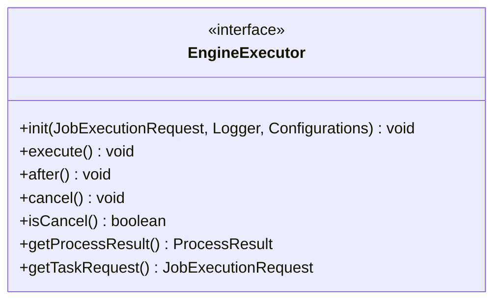
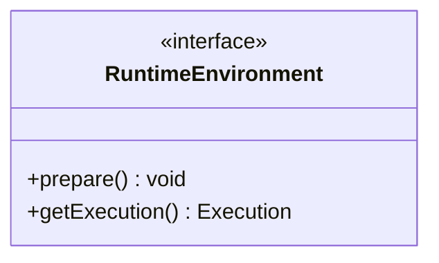
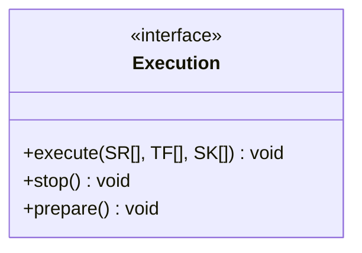
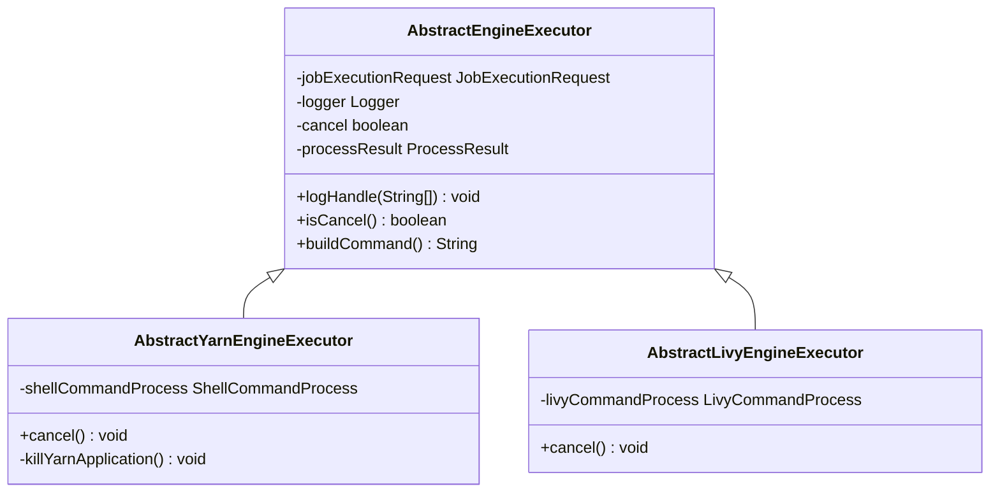
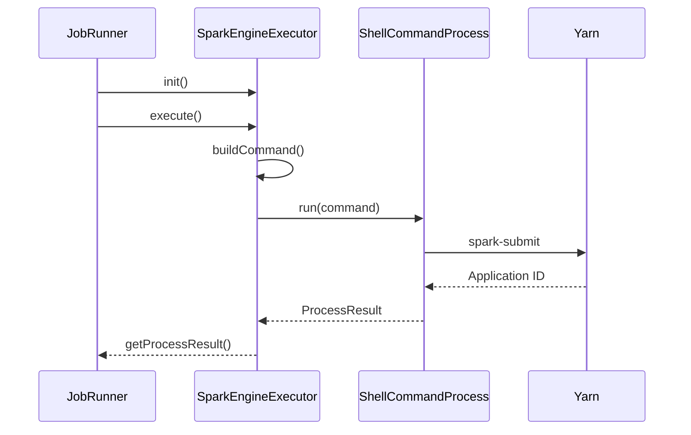
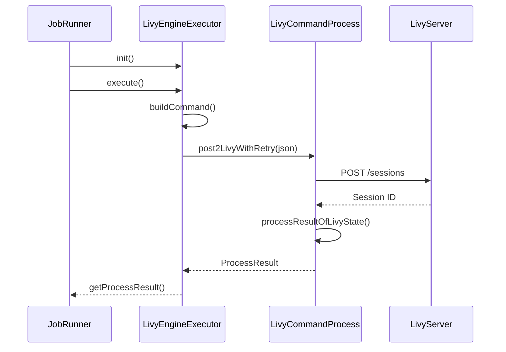

# 执行引擎插件开发

<cite>
**本文档引用的文件**  
- [EngineExecutor.java](file://datavines-engine/datavines-engine-api/src/main/java/io/datavines/engine/api/engine/EngineExecutor.java)
- [RuntimeEnvironment.java](file://datavines-engine/datavines-engine-api/src/main/java/io/datavines/engine/api/env/RuntimeEnvironment.java)
- [AbstractEngineExecutor.java](file://datavines-engine/datavines-engine-executor/src/main/java/io/datavines/engine/executor/core/base/AbstractEngineExecutor.java)
- [AbstractYarnEngineExecutor.java](file://datavines-engine/datavines-engine-executor/src/main/java/io/datavines/engine/executor/core/base/AbstractYarnEngineExecutor.java)
- [AbstractLivyEngineExecutor.java](file://datavines-engine/datavines-engine-executor/src/main/java/io/datavines/engine/executor/core/base/AbstractLivyEngineExecutor.java)
- [SparkEngineExecutor.java](file://datavines-engine/datavines-engine-plugins/datavines-engine-spark/datavines-engine-spark-executor/src/main/java/io/datavines/engine/spark/executor/SparkEngineExecutor.java)
- [FlinkEngineExecutor.java](file://datavines-engine/datavines-engine-plugins/datavines-engine-flink/datavines-engine-flink-executor/src/main/java/io/datavines/engine/flink/executor/FlinkEngineExecutor.java)
- [LocalEngineExecutor.java](file://datavines-engine/datavines-engine-plugins/datavines-engine-local/datavines-engine-local-executor/src/main/java/io/datavines/engine/local/executor/LocalEngineExecutor.java)
- [LivyEngineExecutor.java](file://datavines-engine/datavines-engine-plugins/datavines-engine-livy/datavines-engine-livy-executor/src/main/java/io/datavines/engine/livy/executor/LivyEngineExecutor.java)
- [Execution.java](file://datavines-engine/datavines-engine-api/src/main/java/io/datavines/engine/api/env/Execution.java)
</cite>

## 目录
1. [引言](#引言)
2. [核心接口与抽象基类](#核心接口与抽象基类)
3. [执行引擎实现示例](#执行引擎实现示例)
4. [执行参数解析与命令行构造](#执行参数解析与命令行构造)
5. [不同执行平台的适配方法](#不同执行平台的适配方法)
6. [日志收集、错误处理与资源清理](#日志收集错误处理与资源清理)
7. [总结](#总结)

## 引言
DataVines 是一个数据质量检测框架，支持通过插件化方式扩展不同的执行引擎。本指南旨在为开发者提供详细的执行引擎插件开发说明，涵盖 `EngineExecutor` 接口的核心方法、`RuntimeEnvironment` 的配置方式，并通过 Spark、Flink 和本地执行引擎的实现示例，展示任务提交、状态监控和结果获取的具体流程。同时，本文还将介绍如何适配 Yarn、Livy 和本地等不同执行平台，以及执行参数解析、命令行构造的最佳实践。

## 核心接口与抽象基类

### EngineExecutor 接口
`EngineExecutor` 是所有执行引擎的核心接口，定义了执行器的生命周期方法。开发者需实现该接口以支持新的执行引擎。

**接口说明：**
- `init`: 初始化执行器，接收任务请求、日志记录器和配置信息。
- `execute`: 执行任务的核心方法。
- `after`: 执行完成后执行的清理或后续操作。
- `cancel`: 取消正在运行的任务。
- `isCancel`: 判断任务是否已被取消。
- `getProcessResult`: 获取任务执行结果。
- `getTaskRequest`: 获取任务请求对象。

**代码来源**
- [EngineExecutor.java](file://datavines-engine/datavines-engine-api/src/main/java/io/datavines/engine/api/engine/EngineExecutor.java#L27-L42)

### RuntimeEnvironment 接口
`RuntimeEnvironment` 定义了运行时环境的准备和执行上下文获取方法，是执行环境的基础接口。

**接口说明：**
- `prepare`: 准备运行时环境，如初始化资源、加载配置等。
- `getExecution`: 获取具体的执行实例，用于执行数据处理流程。

**代码来源**
- [RuntimeEnvironment.java](file://datavines-engine/datavines-engine-api/src/main/java/io/datavines/engine/api/env/RuntimeEnvironment.java#L23-L28)

### Execution 接口
`Execution` 接口定义了数据处理流程的执行方法，支持源（Source）、转换（Transform）和汇（Sink）组件的执行。

**代码来源**
- [Execution.java](file://datavines-engine/datavines-engine-api/src/main/java/io/datavines/engine/api/env/Execution.java#L23-L30)

### 抽象基类体系
DataVines 提供了多个抽象基类来简化执行器的开发：
- `AbstractEngineExecutor`: 所有执行器的基类，提供通用字段和日志处理方法。
- `AbstractYarnEngineExecutor`: 针对 Yarn 平台的执行器基类，封装了 Yarn 应用程序的取消和杀死逻辑。
- `AbstractLivyEngineExecutor`: 针对 Livy 服务的执行器基类，封装了与 Livy REST API 的交互逻辑。

**代码来源**
- [AbstractEngineExecutor.java](file://datavines-engine/datavines-engine-executor/src/main/java/io/datavines/engine/executor/core/base/AbstractEngineExecutor.java#L27-L56)
- [AbstractYarnEngineExecutor.java](file://datavines-engine/datavines-engine-executor/src/main/java/io/datavines/engine/executor/core/base/AbstractYarnEngineExecutor.java#L25-L59)
- [AbstractLivyEngineExecutor.java](file://datavines-engine/datavines-engine-executor/src/main/java/io/datavines/engine/executor/core/base/AbstractLivyEngineExecutor.java#L23-L36)

## 执行引擎实现示例

### Spark 执行引擎
`SparkEngineExecutor` 继承自 `AbstractYarnEngineExecutor`，通过 `spark-submit` 命令提交任务到 Yarn 集群。

**核心流程：**
1. 解析 `engineParameter` 获取 Spark 参数。
2. 构建 `spark-submit` 命令行。
3. 使用 `ShellCommandProcess` 执行命令并监控结果。

**代码来源**
- [SparkEngineExecutor.java](file://datavines-engine/datavines-engine-plugins/datavines-engine-spark/datavines-engine-spark-executor/src/main/java/io/datavines/engine/spark/executor/SparkEngineExecutor.java#L41-L152)

### Flink 执行引擎
`FlinkEngineExecutor` 同样继承自 `AbstractYarnEngineExecutor`，通过 `flink` 命令提交任务。

**特点：**
- 使用 `FlinkArgsUtils` 工具类构建 Flink 命令行参数。
- 支持通过 `--conf spark.yarn.tags` 标记任务。

**代码来源**
- [FlinkEngineExecutor.java](file://datavines-engine/datavines-engine-plugins/datavines-engine-flink/datavines-engine-flink-executor/src/main/java/io/datavines/engine/flink/executor/FlinkEngineExecutor.java#L38-L182)

### 本地执行引擎
`LocalEngineExecutor` 直接在当前 JVM 中执行任务，适用于调试和轻量级场景。

**特点：**
- 不需要构建命令行，直接调用 `LocalDataVinesBootstrap` 执行。
- `buildCommand()` 方法返回 `null`。

**代码来源**
- [LocalEngineExecutor.java](file://datavines-engine/datavines-engine-plugins/datavines-engine-local/datavines-engine-local-executor/src/main/java/io/datavines/engine/local/executor/LocalEngineExecutor.java#L27-L77)

### Livy 执行引擎
`LivyEngineExecutor` 继承自 `AbstractLivyEngineExecutor`，通过 Livy REST API 提交 Spark 任务。

**核心流程：**
1. 构建 JSON 格式的 Livy 请求体。
2. 调用 `post2LivyWithRetry` 发送请求。
3. 监控任务状态并获取结果。

**代码来源**
- [LivyEngineExecutor.java](file://datavines-engine/datavines-engine-plugins/datavines-engine-livy/datavines-engine-livy-executor/src/main/java/io/datavines/engine/livy/executor/LivyEngineExecutor.java#L42-L236)

## 执行参数解析与命令行构造

### 参数解析
执行参数通过 `JSONUtils.parseObject()` 从 `JobExecutionRequest` 中解析：
- `engineParameter`: 引擎特定参数（如 Spark/Flink 配置）。
- `applicationParameter`: 应用级参数（如数据质量规则配置）。

### 命令行构造
各执行器通过 `buildCommand()` 方法构造命令行：
- **Spark/Flink**: 拼接 `spark-submit` 或 `flink` 命令及参数。
- **Livy**: 构造 JSON 请求体，包含 `file`, `jars`, `args`, `conf` 等字段。

**最佳实践：**
- 使用 `Base64` 编码应用参数，避免命令行长度限制。
- 动态获取 `SPARK_HOME` 或 `FLINK_HOME` 路径。
- 支持插件目录的自动发现和 JAR 包加载。

## 不同执行平台的适配方法

| 平台 | 适配方式 | 关键类 |
|------|---------|--------|
| Yarn | 通过 `spark-submit` 或 `flink` 命令提交 | `AbstractYarnEngineExecutor`, `ShellCommandProcess` |
| Livy | 通过 REST API 提交 Spark 任务 | `AbstractLivyEngineExecutor`, `LivyCommandProcess` |
| 本地 | 直接在 JVM 内执行 | `LocalEngineExecutor`, `LocalDataVinesBootstrap` |

**适配要点：**
- **Yarn**: 需处理 `sudo -u` 权限和 `yarn application -kill` 命令。
- **Livy**: 需处理会话生命周期和状态轮询。
- **本地**: 需确保类路径正确，避免资源冲突。

## 日志收集、错误处理与资源清理

### 日志收集
通过 `logHandle(List<String> logs)` 方法统一处理日志输出：
- 将日志信息格式化后输出到 `logger.info()`。
- 支持多行日志的拼接和展示。

**代码来源**
- [AbstractEngineExecutor.java](file://datavines-engine/datavines-engine-executor/src/main/java/io/datavines/engine/executor/core/base/AbstractEngineExecutor.java#L45-L48)

### 错误处理
- 在 `execute()` 方法中捕获异常并重新抛出。
- 记录详细的错误日志，便于问题排查。

### 资源清理
- `after()` 方法用于执行清理操作。
- `cancel()` 方法确保任务被正确终止，释放资源。

## 总结
本文详细介绍了 DataVines 执行引擎插件的开发方法，涵盖了核心接口、抽象基类、具体实现示例以及平台适配策略。开发者可以基于 `EngineExecutor` 接口和提供的抽象基类，快速实现新的执行引擎插件，满足不同场景下的数据质量检测需求。