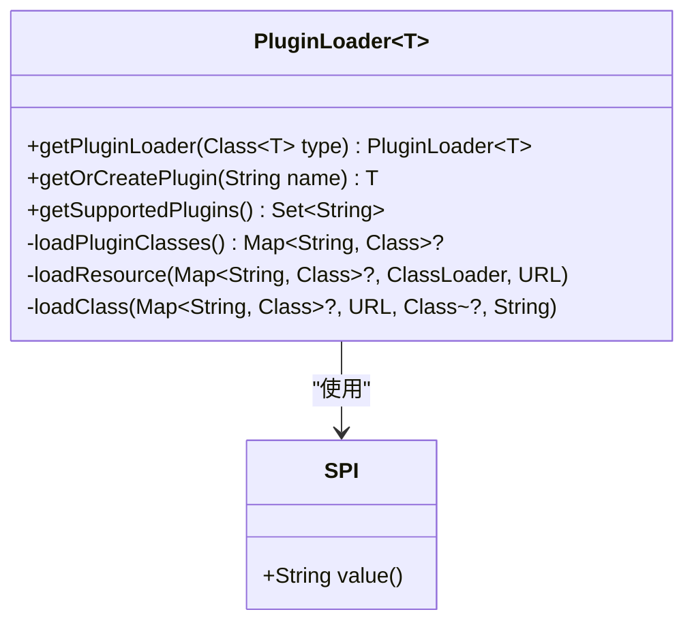
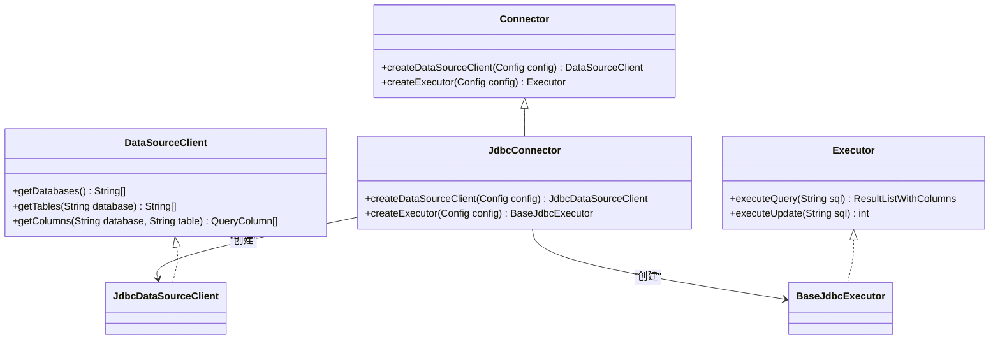
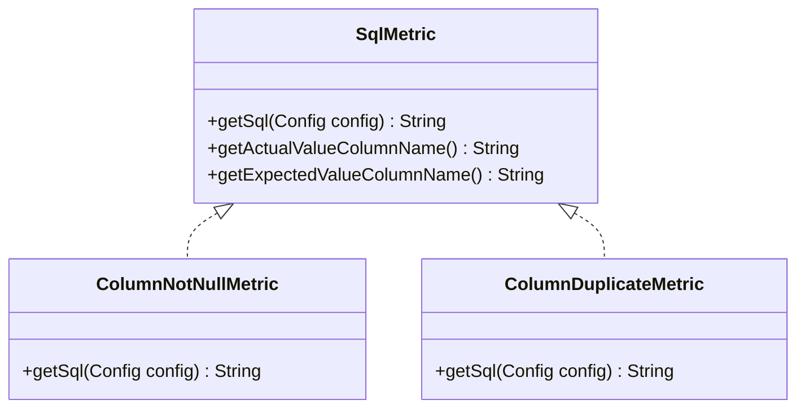
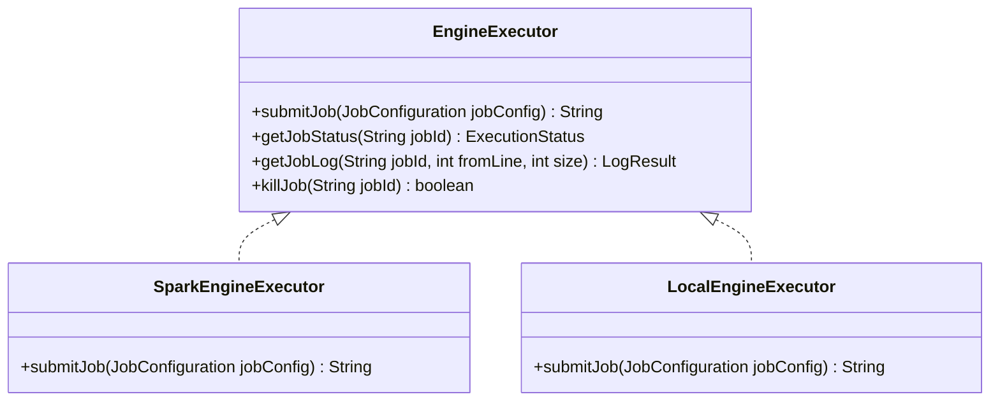
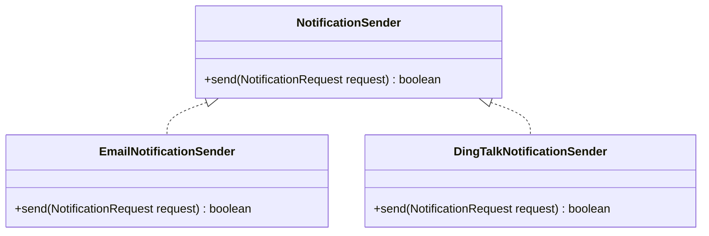
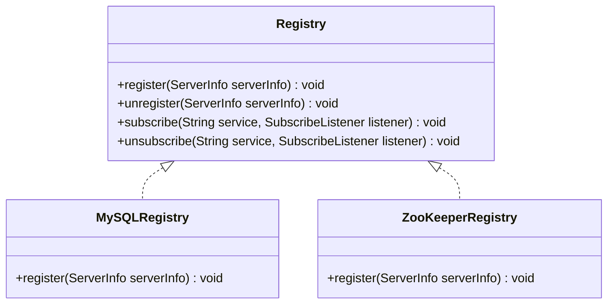

# 插件开发

<cite>
**本文档中引用的文件**  
- [PluginLoader.java](file://datavines-spi/src/main/java/io/datavines/spi/PluginLoader.java)
- [SPI.java](file://datavines-spi/src/main/java/io/datavines/spi/SPI.java)
- [Connector.java](file://datavines-connector/datavines-connector-api/src/main/java/io/datavines/connector/api/Connector.java)
- [SqlMetric.java](file://datavines-metric/datavines-metric-api/src/main/java/io/datavines/metric/api/SqlMetric.java)
- [NotificationSender.java](file://datavines-notification/datavines-notification-api/src/main/java/io/datavines/notification/api/spi/NotificationSender.java)
- [Registry.java](file://datavines-registry/datavines-registry-api/src/main/java/io/datavines/registry/api/Registry.java)
- [EngineExecutor.java](file://datavines-engine/datavines-engine-api/src/main/java/io/datavines/engine/api/engine/EngineExecutor.java)
</cite>

## 目录
1. [简介](#简介)
2. [SPI机制原理](#spi机制原理)
3. [数据源插件开发](#数据源插件开发)
4. [检查规则插件开发](#检查规则插件开发)
5. [执行引擎插件开发](#执行引擎插件开发)
6. [告警通道插件开发](#告警通道插件开发)
7. [注册中心插件开发](#注册中心插件开发)
8. [插件配置与服务发现](#插件配置与服务发现)
9. [插件打包与部署](#插件打包与部署)
10. [插件调试与测试](#插件调试与测试)
11. [版本管理与兼容性](#版本管理与兼容性)
12. [最佳实践](#最佳实践)

## 简介
DataVines 是一个基于插件架构设计的数据质量服务平台，支持多种类型的插件扩展，包括数据源、检查规则、执行引擎、告警通道和注册中心。本指南详细介绍了如何为 DataVines 开发各类插件，涵盖 SPI 机制的工作原理、接口实现、配置管理、打包部署、调试测试以及版本兼容性等完整开发生命周期。

## SPI机制原理
DataVines 使用自定义的 SPI（Service Provider Interface）机制来实现插件的动态加载和管理。核心类 `PluginLoader` 负责加载标注了 `@SPI` 注解的接口实现类。

`PluginLoader` 通过读取 `META-INF/plugins/` 目录下的配置文件，根据接口全限定名查找对应的实现类。每个插件配置文件以接口名命名，内容为 `插件名称=实现类全限定名` 的键值对格式。`PluginLoader` 支持单例模式获取插件实例（`getOrCreatePlugin`），确保同一名称的插件在 JVM 中只有一个实例。

`@SPI` 注解用于标记可扩展的接口，其 `value` 属性可指定默认插件名称。`PluginLoader` 在加载时会验证实现类是否为接口的子类型，并通过 `findAnnotationName` 方法自动推断未在配置文件中显式命名的插件名称（通常为类名去掉接口后缀并转为小写）。

**图示来源**  
- [PluginLoader.java](file://datavines-spi/src/main/java/io/datavines/spi/PluginLoader.java#L51-L487)
- [SPI.java](file://datavines-spi/src/main/java/io/datavines/spi/SPI.java#L1-L32)

## 数据源插件开发
数据源插件用于连接和操作不同的数据库系统。开发者需要实现 `Connector` 接口，并提供相应的 `DataSourceClient` 和 `Executor` 实现。

`Connector` 接口定义了创建数据源客户端和执行器的方法。`DataSourceClient` 负责获取数据库的元数据信息（如数据库、表、列等），而 `Executor` 则负责执行 SQL 查询和脚本。开发者通常需要继承 `JdbcConnector` 或 `JdbcDataSourceClient` 等基类来简化 JDBC 类型数据源的开发。

插件实现类需在 `META-INF/plugins/` 目录下创建以 `io.datavines.connector.api.Connector` 命名的配置文件，并添加 `插件名称=实现类全限定名` 的条目。例如，MySQL 插件的配置为 `mysql=io.datavines.connector.plugin.mysql.MySQLConnector`。

**图示来源**  
- [Connector.java](file://datavines-connector/datavines-connector-api/src/main/java/io/datavines/connector/api/Connector.java#L1-L15)

**本节来源**  
- [Connector.java](file://datavines-connector/datavines-connector-api/src/main/java/io/datavines/connector/api/Connector.java#L1-L15)

## 检查规则插件开发
检查规则插件用于定义数据质量的校验逻辑。核心接口是 `SqlMetric`，它定义了生成用于数据质量检查的 SQL 语句的方法。

`SqlMetric` 接口的实现需要根据配置的参数（如表名、列名、阈值等）生成相应的 SQL 查询。查询结果将用于判断数据质量是否达标。例如，`column_not_null` 规则会生成 `SELECT COUNT(*) FROM table WHERE column IS NULL` 这样的 SQL 来统计空值数量。

开发者需要实现 `SqlMetric` 接口，并在 `META-INF/plugins/` 目录下创建 `io.datavines.metric.api.SqlMetric` 配置文件。插件名称通常与规则类型一致，如 `column_not_null`。

**图示来源**  
- [SqlMetric.java](file://datavines-metric/datavines-metric-api/src/main/java/io/datavines/metric/api/SqlMetric.java#L1-L15)

**本节来源**  
- [SqlMetric.java](file://datavines-metric/datavines-metric-api/src/main/java/io/datavines/metric/api/SqlMetric.java#L1-L15)

## 执行引擎插件开发
执行引擎插件负责提交和管理数据质量检查任务的执行。核心接口是 `EngineExecutor`，它定义了任务提交、状态查询和日志获取等方法。

`EngineExecutor` 的实现需要能够与底层计算框架（如 Spark、Flink）进行交互。例如，`SparkEngineExecutor` 会通过 `spark-submit` 命令或 Livy 服务提交任务。开发者需要实现 `submitJob`、`getJobStatus`、`getJobLog` 等关键方法。

插件需在 `META-INF/plugins/` 目录下创建 `io.datavines.engine.api.engine.EngineExecutor` 配置文件。DataVines 内置了 `local` 和 `spark` 两种执行引擎。

**图示来源**  
- [EngineExecutor.java](file://datavines-engine/datavines-engine-api/src/main/java/io/datavines/engine/api/engine/EngineExecutor.java#L1-L15)

**本节来源**  
- [EngineExecutor.java](file://datavines-engine/datavines-engine-api/src/main/java/io/datavines/engine/api/engine/EngineExecutor.java#L1-L15)

## 告警通道插件开发
告警通道插件用于在数据质量检查失败时发送通知。核心接口是 `NotificationSender`，它定义了发送通知消息的方法。

`NotificationSender` 的实现需要能够调用具体的告警服务 API，如邮件服务器、钉钉机器人、企业微信等。`send` 方法接收一个包含告警内容的 `NotificationRequest` 对象，并返回发送结果。

开发者需实现 `NotificationSender` 接口，并在 `META-INF/plugins/` 目录下创建 `io.datavines.notification.api.spi.NotificationSender` 配置文件。DataVines 已支持邮件、钉钉、飞书和企业微信机器人等告警通道。

**图示来源**  
- [NotificationSender.java](file://datavines-notification/datavines-notification-api/src/main/java/io/datavines/notification/api/spi/NotificationSender.java#L1-L15)

**本节来源**  
- [NotificationSender.java](file://datavines-notification/datavines-notification-api/src/main/java/io/datavines/notification/api/spi/NotificationSender.java#L1-L15)

## 注册中心插件开发
注册中心插件用于实现服务发现和分布式协调。核心接口是 `Registry`，它定义了服务注册、发现和监听的方法。

`Registry` 的实现需要能够与注册中心服务（如 ZooKeeper、MySQL）进行交互。`register` 方法用于注册服务实例，`subscribe` 方法用于监听服务列表的变化。

开发者需实现 `Registry` 接口，并在 `META-INF/plugins/` 目录下创建 `io.datavines.registry.api.Registry` 配置文件。DataVines 支持 MySQL、PostgreSQL 和 ZooKeeper 作为注册中心。

**图示来源**  
- [Registry.java](file://datavines-registry/datavines-registry-api/src/main/java/io/datavines/registry/api/Registry.java#L1-L15)

**本节来源**  
- [Registry.java](file://datavines-registry/datavines-registry-api/src/main/java/io/datavines/registry/api/Registry.java#L1-L15)

## 插件配置与服务发现
插件的配置主要通过 `Config` 对象传递。`Config` 是一个键值对集合，包含了插件运行所需的所有参数。例如，数据源插件需要 `host`、`port`、`username`、`password` 等配置项。

服务发现依赖于注册中心插件。当多个 `datavines-server` 实例启动时，它们会通过 `Registry` 接口向注册中心注册自己的信息（如 IP、端口）。其他组件（如 `datavines-runner`）可以通过订阅服务列表来发现可用的服务器，并实现负载均衡。

## 插件打包与部署
插件开发完成后，需要将其打包成 JAR 文件。JAR 包中必须包含 `META-INF/plugins/` 目录及其下的配置文件。对于数据源插件，还需要将数据库的 JDBC 驱动 JAR 包一并放入 `datavines-connector-plugins` 模块的 `lib` 目录中。

部署时，将插件 JAR 包和依赖的驱动 JAR 包复制到 `datavines/lib/plugins/` 目录下。重启 DataVines 服务后，`PluginLoader` 会自动扫描并加载新插件。

## 插件调试与测试
建议使用单元测试来验证插件的核心逻辑。对于数据源插件，可以编写测试用例来验证 `getDatabases`、`getTables` 等方法是否能正确返回元数据。对于检查规则插件，应测试 `getSql` 方法生成的 SQL 语句是否正确。

集成测试可以通过启动一个本地的 DataVines 环境，配置使用待测试的插件，并执行一个数据质量检查任务来完成。观察任务执行日志和结果，可以验证插件是否按预期工作。

## 版本管理与兼容性
插件的版本管理应遵循语义化版本规范（SemVer）。主版本号的变更通常意味着不兼容的 API 修改。为保证兼容性，建议：

1.  避免修改已发布的 `SPI` 接口。
2.  通过添加新方法或新配置项来扩展功能，而不是修改现有行为。
3.  在 `PluginLoader` 中，优先加载显式配置的插件，以避免因自动推断名称导致的冲突。
4.  在插件 JAR 包的 `MANIFEST.MF` 文件中声明兼容的 DataVines 核心版本。

## 最佳实践
1.  **遵循命名规范**：插件名称应简洁、明确，使用小写字母和下划线。
2.  **提供默认实现**：在 `@SPI` 注解中指定一个可靠的默认插件。
3.  **处理异常**：在插件代码中妥善处理可能的异常，并提供清晰的错误信息。
4.  **资源管理**：对于需要管理连接、会话等资源的插件，确保在适当时机进行资源释放。
5.  **日志记录**：使用 SLF4J 记录关键操作和错误，便于问题排查。
6.  **配置校验**：在插件初始化时，对传入的 `Config` 对象进行必要的校验。