# 数据源插件开发

<cite>
**本文档中引用的文件**  
- [Connector.java](file://datavines-connector/datavines-connector-api/src/main/java/io/datavines/connector/api/Connector.java)
- [DataSourceClient.java](file://datavines-connector/datavines-connector-api/src/main/java/io/datavines/connector/api/DataSourceClient.java)
- [Dialect.java](file://datavines-connector/datavines-connector-api/src/main/java/io/datavines/connector/api/Dialect.java)
- [ConnectorFactory.java](file://datavines-connector/datavines-connector-api/src/main/java/io/datavines/connector/api/ConnectorFactory.java)
- [Executor.java](file://datavines-connector/datavines-connector-api/src/main/java/io/datavines/connector/api/Executor.java)
- [JdbcConnector.java](file://datavines-connector/datavines-connector-plugins/datavines-connector-jdbc/src/main/java/io/datavines/connector/plugin/JdbcConnector.java)
- [JdbcDataSourceClient.java](file://datavines-connector/datavines-connector-plugins/datavines-connector-jdbc/src/main/java/io/datavines/connector/plugin/JdbcDataSourceClient.java)
- [JdbcDialect.java](file://datavines-connector/datavines-connector-plugins/datavines-connector-jdbc/src/main/java/io/datavines/connector/plugin/JdbcDialect.java)
- [AbstractJdbcConnectorFactory.java](file://datavines-connector/datavines-connector-plugins/datavines-connector-jdbc/src/main/java/io/datavines/connector/plugin/AbstractJdbcConnectorFactory.java)
- [BaseJdbcExecutor.java](file://datavines-connector/datavines-connector-plugins/datavines-connector-jdbc/src/main/java/io/datavines/connector/plugin/BaseJdbcExecutor.java)
- [MysqlConnector.java](file://datavines-connector/datavines-connector-plugins/datavines-connector-mysql/src/main/java/io/datavines/connector/plugin/MysqlConnector.java)
- [MysqlDialect.java](file://datavines-connector/datavines-connector-plugins/datavines-connector-mysql/src/main/java/io/datavines/connector/plugin/MysqlDialect.java)
- [MysqlConnectorFactory.java](file://datavines-connector/datavines-connector-plugins/datavines-connector-mysql/src/main/java/io/datavines/connector/plugin/MysqlConnectorFactory.java)
- [PostgreSqlConnector.java](file://datavines-connector/datavines-connector-plugins/datavines-connector-postgresql/src/main/java/io/datavines/connector/plugin/PostgreSqlConnector.java)
- [PostgreSqlDialect.java](file://datavines-connector/datavines-connector-plugins/datavines-connector-postgresql/src/main/java/io/datavines/connector/plugin/PostgreSqlDialect.java)
</cite>

## 目录
1. [引言](#引言)
2. [核心接口详解](#核心接口详解)
3. [JDBC基础实现](#jdbc基础实现)
4. [MySQL插件实现示例](#mysql插件实现示例)
5. [PostgreSQL插件实现示例](#postgresql插件实现示例)
6. [连接池与事务管理](#连接池与事务管理)
7. [错误恢复机制](#错误恢复机制)
8. [插件测试指南](#插件测试指南)
9. [插件打包与部署](#插件打包与部署)
10. [SPI机制注册](#spi机制注册)

## 引言
DataVines是一个数据质量监控平台，支持通过插件机制扩展数据源。本文档详细介绍如何为DataVines开发新的数据源插件，涵盖Connector、DataSourceClient和Dialect接口的作用和实现方法。通过MySQL和PostgreSQL插件的实现示例，展示如何处理连接配置、SQL方言差异和元数据获取。同时涵盖连接池管理、事务处理和错误恢复机制，指导开发者如何测试插件的兼容性和性能，并提供插件打包和部署的详细步骤。

## 核心接口详解

### Connector接口
Connector接口是数据源插件的核心接口，定义了与数据源交互的基本操作。它提供了获取数据库、表、列等元数据的方法，以及测试连接的功能。

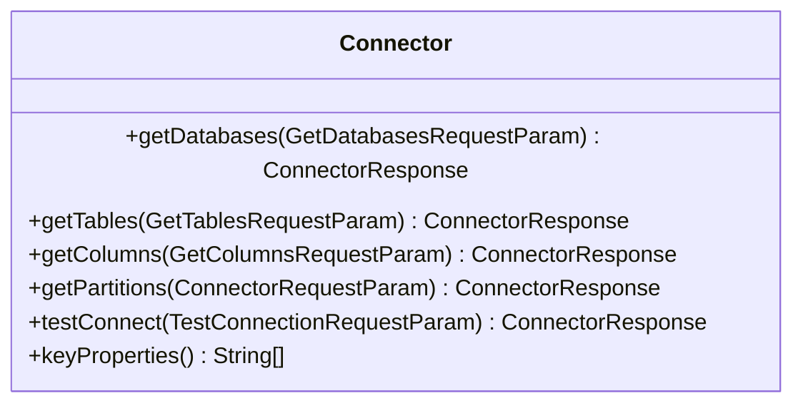

**接口来源**  
- [Connector.java](file://datavines-connector/datavines-connector-api/src/main/java/io/datavines/connector/api/Connector.java)

### DataSourceClient接口
DataSourceClient接口负责管理数据源连接，提供获取DataSource、Connection和JdbcTemplate的方法。它抽象了底层连接管理的复杂性，使上层代码可以专注于业务逻辑。

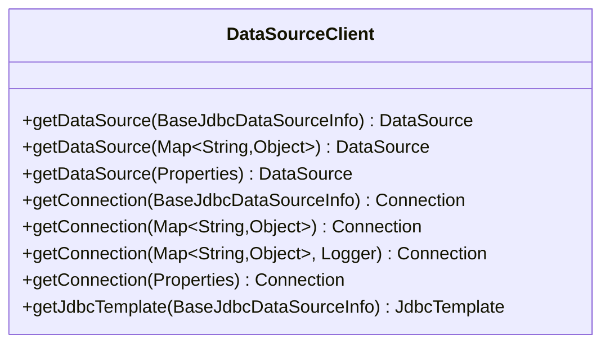

**接口来源**  
- [DataSourceClient.java](file://datavines-connector/datavines-connector-api/src/main/java/io/datavines/connector/api/DataSourceClient.java)

### Dialect接口
Dialect接口处理SQL方言的差异，提供数据库特定的SQL生成和处理功能。它定义了驱动类名、标识符引号、排除的数据库列表等属性，以及各种SQL查询的生成方法。

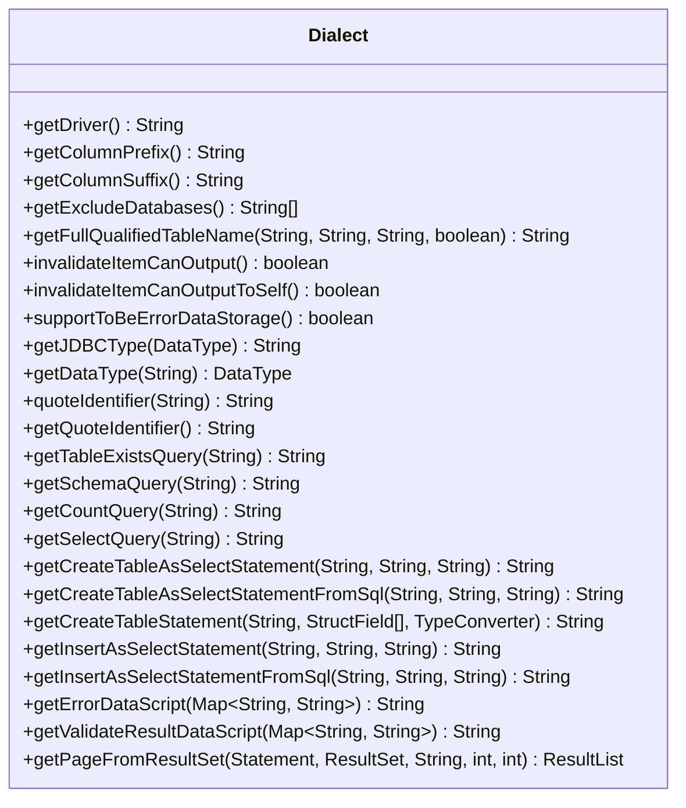

**接口来源**  
- [Dialect.java](file://datavines-connector/datavines-connector-api/src/main/java/io/datavines/connector/api/Dialect.java)

### ConnectorFactory接口
ConnectorFactory接口是插件工厂，负责创建和配置插件所需的各个组件。通过SPI机制注册，DataVines在运行时动态加载相应的插件工厂。

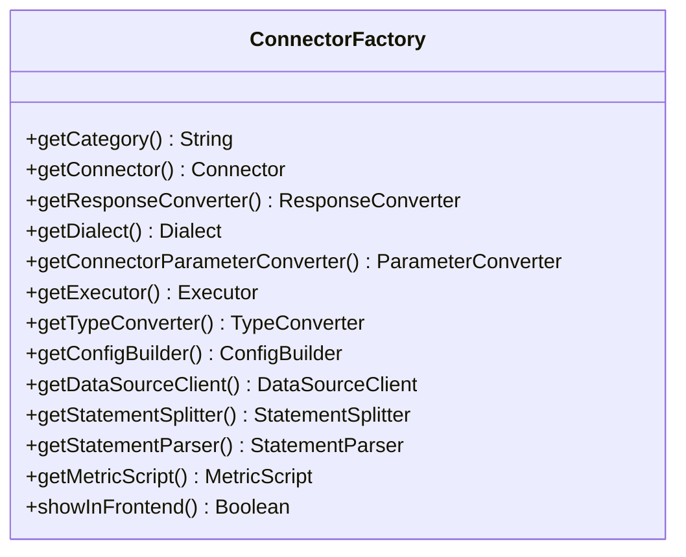

**接口来源**  
- [ConnectorFactory.java](file://datavines-connector/datavines-connector-api/src/main/java/io/datavines/connector/api/ConnectorFactory.java)

### Executor接口
Executor接口负责执行SQL脚本和查询，提供分页查询、列表查询和单条记录查询等功能。它是数据操作的执行层，封装了具体的执行逻辑。

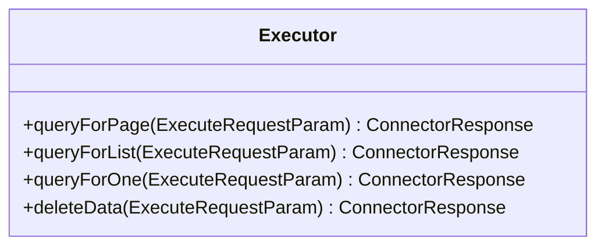

**接口来源**  
- [Executor.java](file://datavines-connector/datavines-connector-api/src/main/java/io/datavines/connector/api/Executor.java)

## JDBC基础实现

### JdbcConnector抽象类
JdbcConnector是所有JDBC数据源插件的基础实现，提供了获取数据库、表、列等元数据的通用方法。它继承了Connector接口，并实现了大部分通用功能。

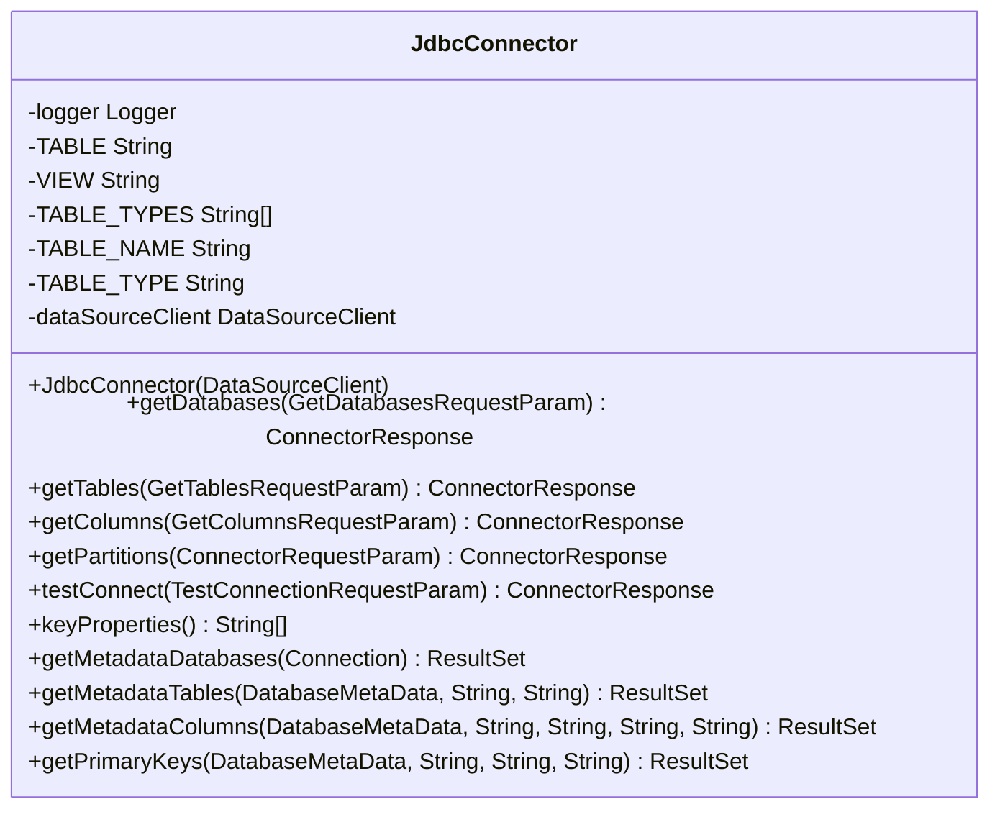

**实现来源**  
- [JdbcConnector.java](file://datavines-connector/datavines-connector-plugins/datavines-connector-jdbc/src/main/java/io/datavines/connector/plugin/JdbcConnector.java)

### JdbcDataSourceClient实现
JdbcDataSourceClient实现了DataSourceClient接口，利用JdbcDataSourceManager管理连接池，提供DataSource、Connection和JdbcTemplate的获取功能。

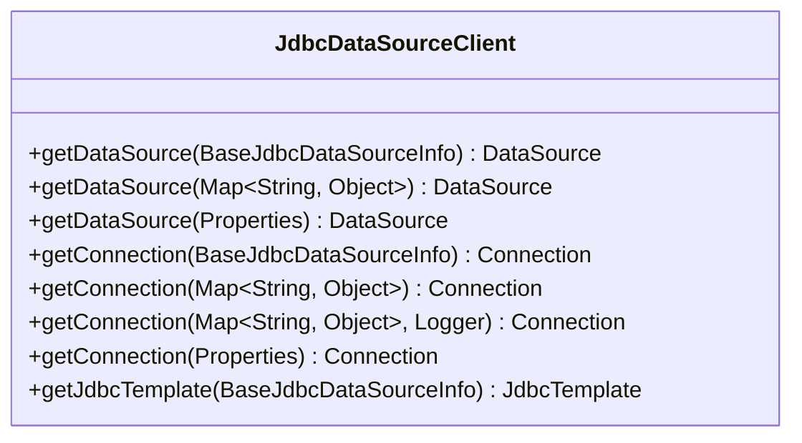

**实现来源**  
- [JdbcDataSourceClient.java](file://datavines-connector/datavines-connector-plugins/datavines-connector-jdbc/src/main/java/io/datavines/connector/plugin/JdbcDataSourceClient.java)

### JdbcDialect抽象类
JdbcDialect是所有JDBC方言的基础实现，提供了默认的SQL生成逻辑和标识符引号处理。具体数据库的方言类可以继承它并重写特定方法。

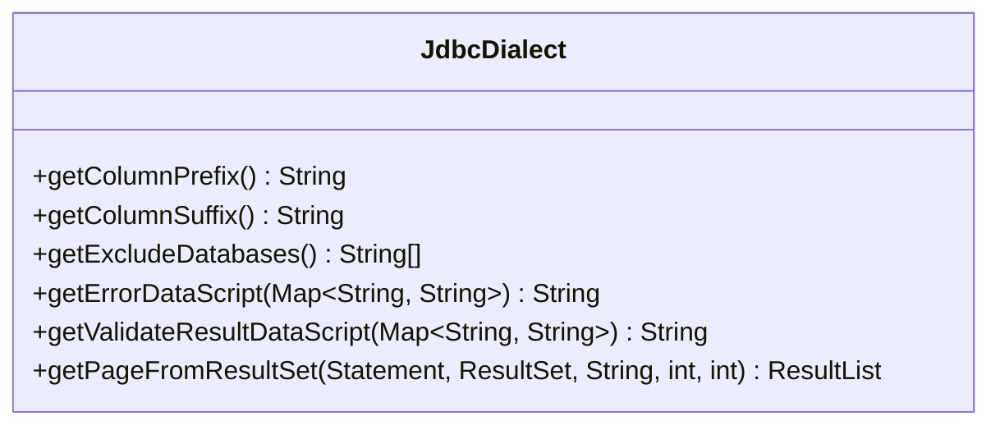

**实现来源**  
- [JdbcDialect.java](file://datavines-connector/datavines-connector-plugins/datavines-connector-jdbc/src/main/java/io/datavines/connector/plugin/JdbcDialect.java)

### AbstractJdbcConnectorFactory抽象类
AbstractJdbcConnectorFactory是所有JDBC插件工厂的基础实现，提供了通用的组件创建逻辑，如ResponseConverter、TypeConverter、ConfigBuilder等。

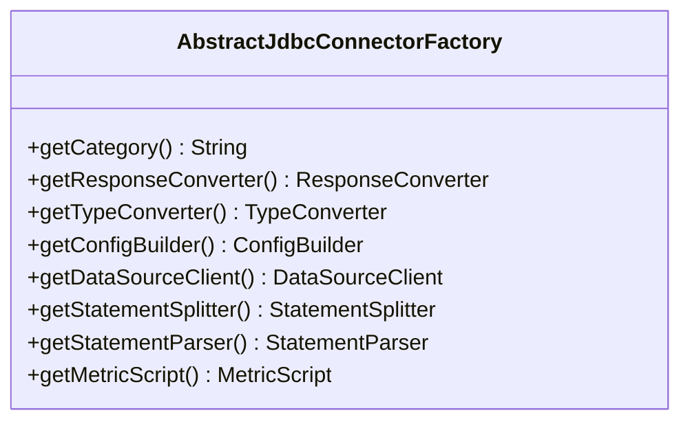

**实现来源**  
- [AbstractJdbcConnectorFactory.java](file://datavines-connector/datavines-connector-plugins/datavines-connector-jdbc/src/main/java/io/datavines/connector/plugin/AbstractJdbcConnectorFactory.java)

### BaseJdbcExecutor抽象类
BaseJdbcExecutor是所有JDBC执行器的基础实现，提供了基于JdbcTemplate的查询功能，包括分页查询、列表查询和单条记录查询。

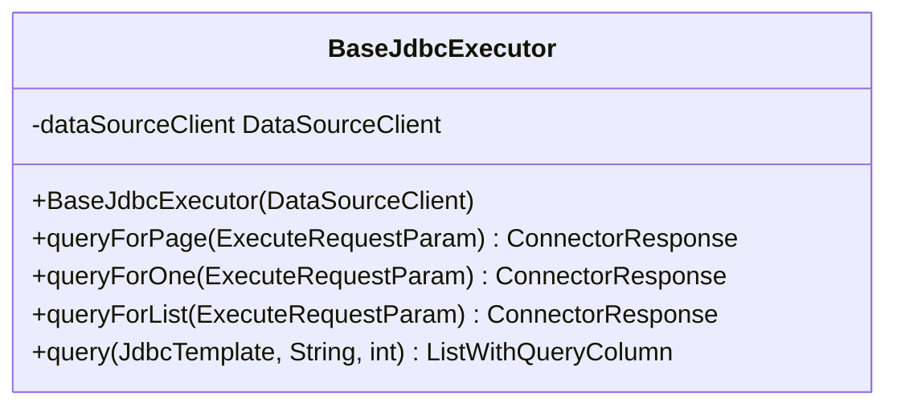

**实现来源**  
- [BaseJdbcExecutor.java](file://datavines-connector/datavines-connector-plugins/datavines-connector-jdbc/src/main/java/io/datavines/connector/plugin/BaseJdbcExecutor.java)

## MySQL插件实现示例

### MysqlConnector实现
MysqlConnector继承了JdbcConnector，实现了MySQL特定的元数据获取逻辑，特别是通过getMetadataDatabases方法使用DatabaseMetaData.getCatalogs()获取数据库列表。

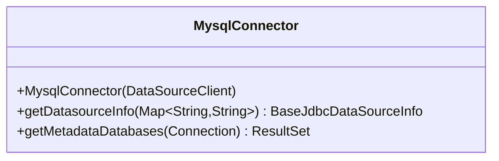

**实现来源**  
- [MysqlConnector.java](file://datavines-connector/datavines-connector-plugins/datavines-connector-mysql/src/main/java/io/datavines/connector/plugin/MysqlConnector.java)

### MysqlDialect实现
MysqlDialect继承了JdbcDialect，定义了MySQL特定的驱动类名、标识符引号和错误数据存储支持。它重写了getDriver方法返回"com.mysql.cj.jdbc.Driver"。

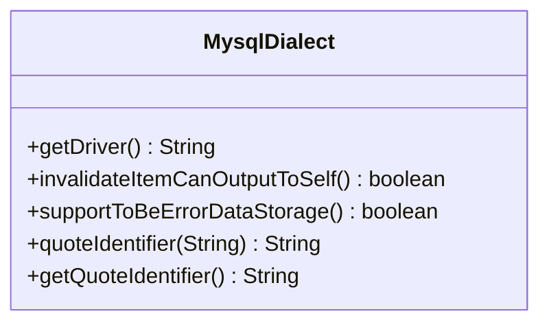

**实现来源**  
- [MysqlDialect.java](file://datavines-connector/datavines-connector-plugins/datavines-connector-mysql/src/main/java/io/datavines/connector/plugin/MysqlDialect.java)

### MysqlConnectorFactory实现
MysqlConnectorFactory继承了AbstractJdbcConnectorFactory，实现了MySQL特定的组件创建逻辑，包括MysqlParameterConverter、MysqlDialect、MysqlExecutor等。

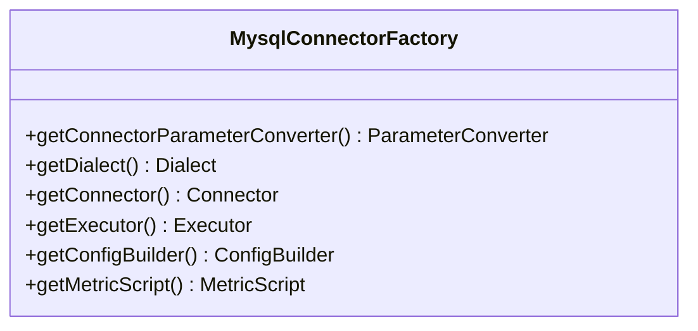

**实现来源**  
- [MysqlConnectorFactory.java](file://datavines-connector/datavines-connector-plugins/datavines-connector-mysql/src/main/java/io/datavines/connector/plugin/MysqlConnectorFactory.java)

## PostgreSQL插件实现示例

### PostgreSqlConnector实现
PostgreSqlConnector继承了JdbcConnector，实现了PostgreSQL特定的元数据获取逻辑，包括支持"FOREIGN TABLE"类型和使用getMetadataDatabases方法获取数据库列表。

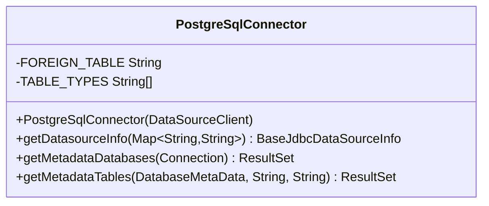

**实现来源**  
- [PostgreSqlConnector.java](file://datavines-connector/datavines-connector-plugins/datavines-connector-postgresql/src/main/java/io/datavines/connector/plugin/PostgreSqlConnector.java)

### PostgreSqlDialect实现
PostgreSqlDialect继承了JdbcDialect，定义了PostgreSQL特定的驱动类名"org.postgresql.Driver"。

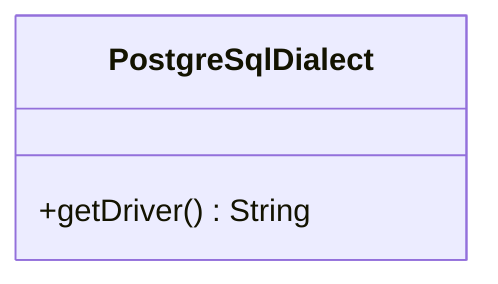

**实现来源**  
- [PostgreSqlDialect.java](file://datavines-connector/datavines-connector-plugins/datavines-connector-postgresql/src/main/java/io/datavines/connector/plugin/PostgreSqlDialect.java)

## 连接池与事务管理

### 连接池管理
DataVines使用JdbcDataSourceManager管理连接池，通过DataSourceClient接口提供连接获取功能。连接池的配置和管理由JdbcDataSourceManager负责，确保连接的高效复用和资源管理。

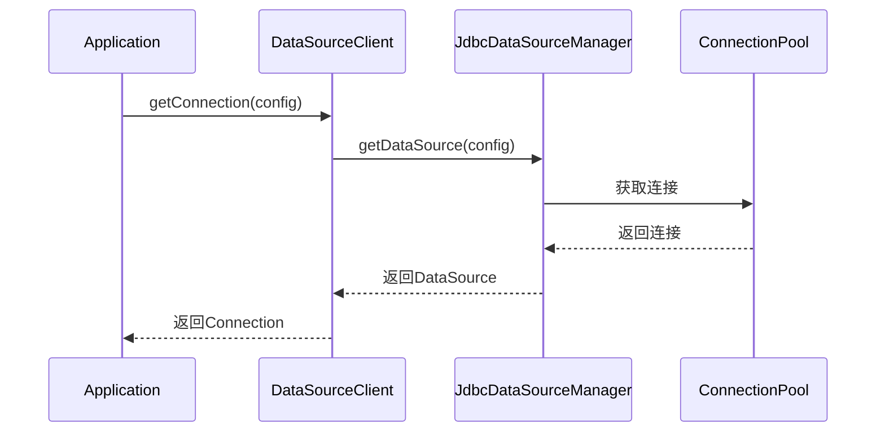

**实现来源**  
- [JdbcDataSourceClient.java](file://datavines-connector/datavines-connector-plugins/datavines-connector-jdbc/src/main/java/io/datavines/connector/plugin/JdbcDataSourceClient.java)
- [JdbcDataSourceManager.java](file://datavines-common/src/main/java/io/datavines/common/datasource/jdbc/JdbcDataSourceManager.java)

### 事务管理
DataVines通过JdbcTemplate管理事务，利用Spring的事务管理机制确保数据操作的原子性和一致性。Executor实现类使用JdbcTemplate执行SQL，自动参与当前事务。

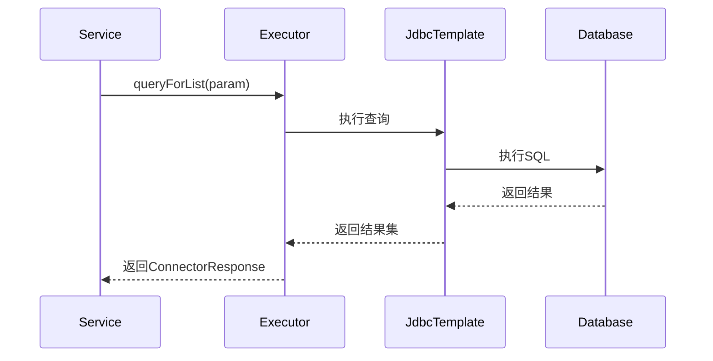

**实现来源**  
- [BaseJdbcExecutor.java](file://datavines-connector/datavines-connector-plugins/datavines-connector-jdbc/src/main/java/io/datavines/connector/plugin/BaseJdbcExecutor.java)

## 错误恢复机制

### 连接错误处理
DataVines在连接失败时提供详细的错误日志和恢复机制。通过DataSourceClient的getConnection方法，捕获SQLException并记录错误信息，同时提供重试机制。

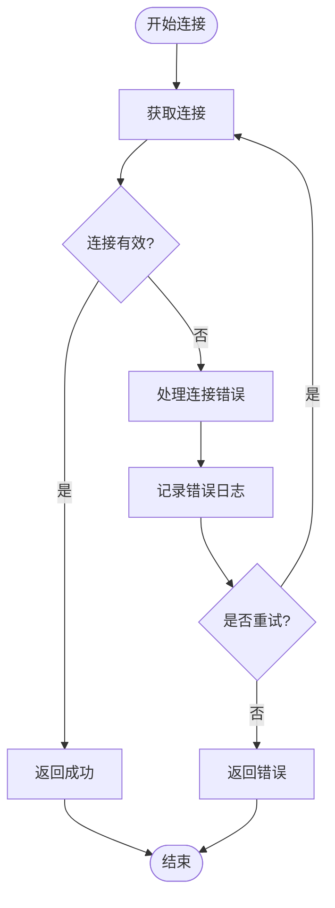

**实现来源**  
- [JdbcDataSourceClient.java](file://datavines-connector/datavines-connector-plugins/datavines-connector-jdbc/src/main/java/io/datavines/connector/plugin/JdbcDataSourceClient.java)

### 查询错误处理
在执行查询时，DataVines捕获SQLException并返回适当的错误响应。通过ConnectorResponse的status和errorMsg字段，向调用方传递错误信息。

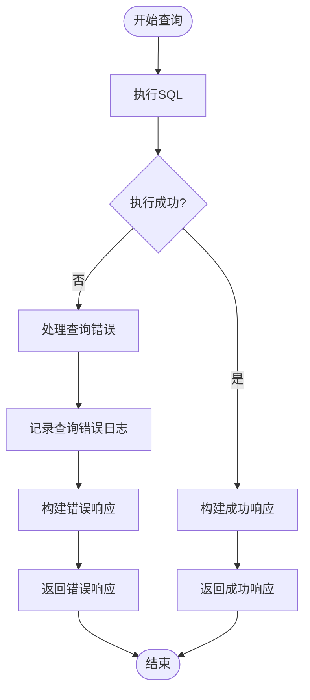

**实现来源**  
- [BaseJdbcExecutor.java](file://datavines-connector/datavines-connector-plugins/datavines-connector-jdbc/src/main/java/io/datavines/connector/plugin/BaseJdbcExecutor.java)

## 插件测试指南

### 单元测试
为确保插件的正确性，需要编写全面的单元测试。测试应覆盖连接、元数据获取、查询执行等核心功能。

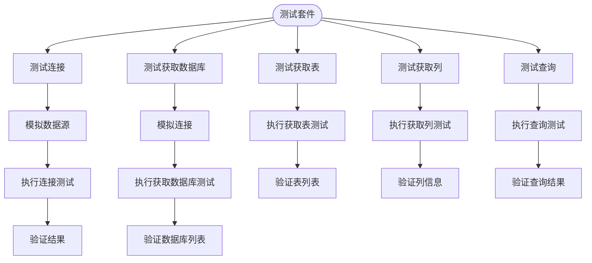

### 集成测试
集成测试需要在真实环境中验证插件的功能，包括连接池管理、事务处理和错误恢复等。

```mermaid
sequenceDiagram
participant Test
participant Plugin
participant Database
Test->>Plugin : 初始化插件
Plugin->>Database : 建立连接
Database-->>Plugin : 返回连接
Plugin-->>Test : 插件初始化完成
Test->>Plugin : 获取数据库列表
Plugin->>Database : 查询数据库
Database-->>Plugin : 返回数据库列表
Plugin-->>Test : 返回数据库列表
Test->>Plugin : 执行查询
Plugin->>Database : 执行SQL
Database-->>Plugin : 返回查询结果
Plugin-->>Test : 返回查询结果
Test->>Plugin : 关闭连接
Plugin->>Database : 关闭连接
Database-->>Plugin : 连接关闭
Plugin-->>Test : 插件关闭完成
```

## 插件打包与部署

### Maven项目结构
数据源插件通常作为Maven项目开发，需要遵循特定的目录结构和依赖配置。

```mermaid
graph TD
ProjectRoot([项目根目录]) --> pom.xml
ProjectRoot --> src
src --> main
main --> java
java --> io.datavines.connector.plugin
io.datavines.connector.plugin --> Connector.java
io.datavines.connector.plugin --> Dialect.java
io.datavines.connector.plugin --> ConnectorFactory.java
main --> resources
resources --> META-INF
META-INF --> plugins
plugins --> connector.factory
```

### 打包流程
插件打包需要生成JAR文件，并包含必要的SPI配置。

```mermaid
flowchart TD
StartBuild([开始构建]) --> Compile["编译Java源码"]
Compile --> Package["打包JAR文件"]
Package --> AddSPI["添加SPI配置"]
AddSPI --> META-INF["创建META-INF目录"]
META-INF --> plugins["创建plugins目录"]
plugins --> factoryFile["创建connector.factory文件"]
factoryFile --> WriteClassName["写入工厂类名"]
WriteClassName --> CompleteBuild["构建完成"]
```

## SPI机制注册

### SPI配置
通过在META-INF/services目录下创建connector.factory文件，注册插件工厂类，实现SPI机制的自动发现。

```mermaid
flowchart TD
SPIConfig([SPI配置]) --> CreateDirectory["创建META-INF/services目录"]
CreateDirectory --> CreateFile["创建connector.factory文件"]
CreateFile --> WriteClassName["写入工厂类全名"]
WriteClassName --> Example["示例: io.datavines.connector.plugin.MysqlConnectorFactory"]
Example --> Complete["配置完成"]
```

**实现来源**  
- [MysqlConnectorFactory.java](file://datavines-connector/datavines-connector-plugins/datavines-connector-mysql/src/main/java/io/datavines/connector/plugin/MysqlConnectorFactory.java)

### 插件加载流程
DataVines启动时通过SPI机制加载所有注册的插件工厂，实现插件的动态发现和注册。

```mermaid
sequenceDiagram
participant DataVines
participant SPI
participant PluginFactory
DataVines->>SPI : ServiceLoader.load(ConnectorFactory.class)
SPI->>PluginFactory : 查找META-INF/services/connector.factory
PluginFactory-->>SPI : 返回工厂类名
SPI-->>DataVines : 返回工厂实例
DataVines->>PluginFactory : 注册插件
PluginFactory-->>DataVines : 插件注册完成
```