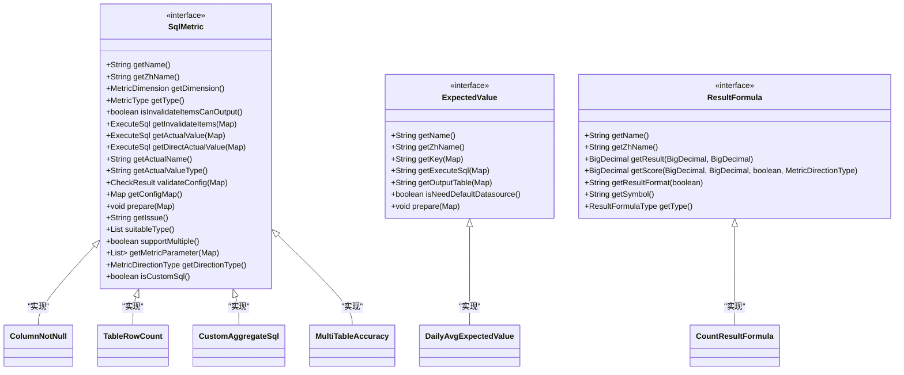
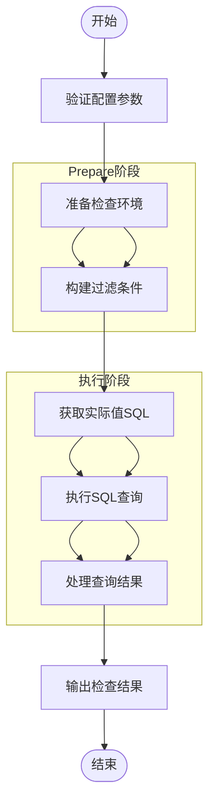
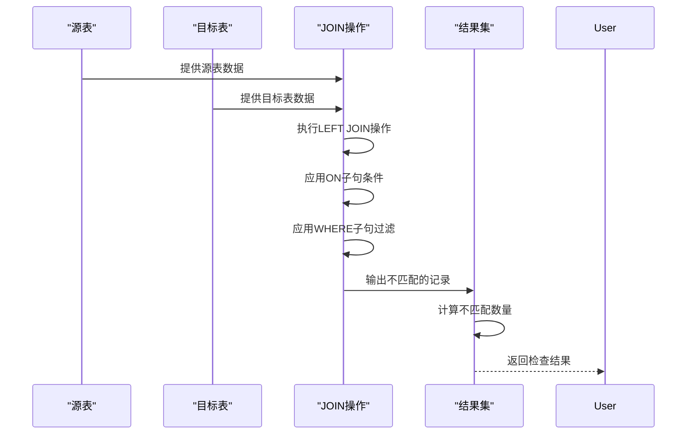
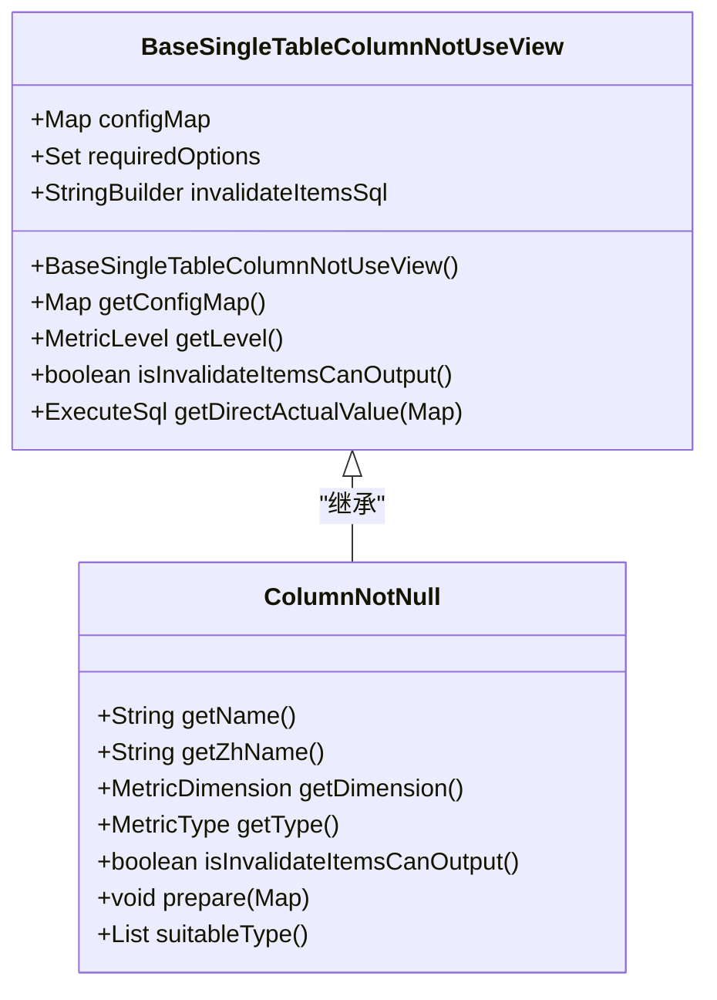
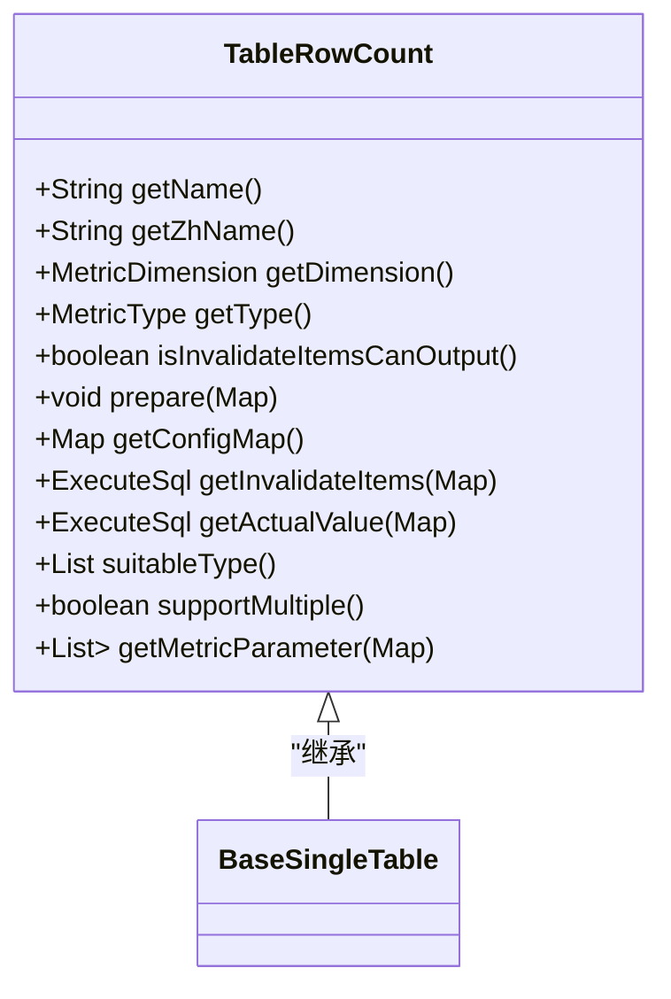
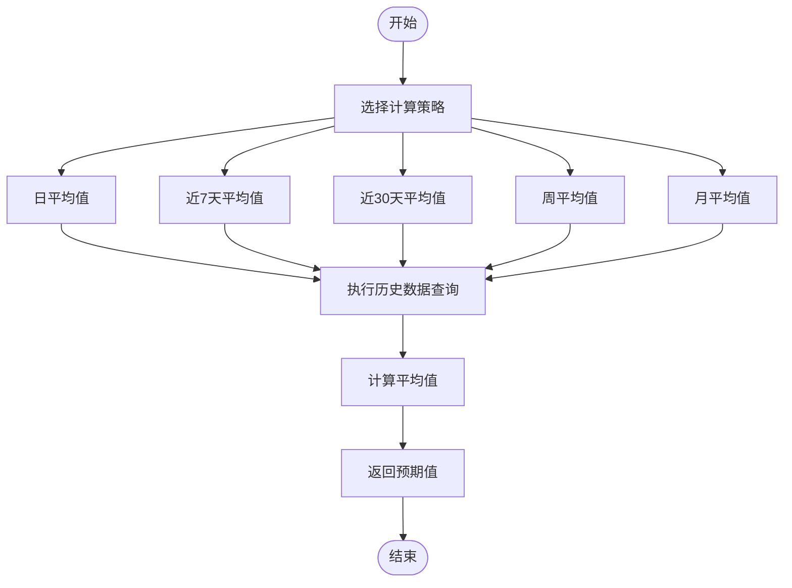

# 检查规则插件开发

<cite>
**本文档中引用的文件**  
- [SqlMetric.java](file://datavines-metric/datavines-metric-api/src/main/java/io/datavines/metric/api/SqlMetric.java)
- [ExpectedValue.java](file://datavines-metric/datavines-metric-api/src/main/java/io/datavines/metric/api/ExpectedValue.java)
- [ResultFormula.java](file://datavines-metric/datavines-metric-api/src/main/java/io/datavines/metric/api/ResultFormula.java)
- [MetricExecutionResult.java](file://datavines-metric/datavines-metric-api/src/main/java/io/datavines/metric/api/MetricExecutionResult.java)
- [ColumnNotNull.java](file://datavines-metric/datavines-metric-plugins/datavines-metric-column-not-null/src/main/java/io/datavines/metric/plugin/ColumnNotNull.java)
- [TableRowCount.java](file://datavines-metric/datavines-metric-plugins/datavines-metric-table-row-count/src/main/java/io/datavines/metric/plugin/TableRowCount.java)
- [CustomAggregateSql.java](file://datavines-metric/datavines-metric-plugins/datavines-metric-custom-aggregate-sql/src/main/java/io/datavines/metric/plugin/CustomAggregateSql.java)
- [MultiTableAccuracy.java](file://datavines-metric/datavines-metric-plugins/datavines-metric-multi-table-accuracy/src/main/java/io/datavines/metric/plugin/MultiTableAccuracy.java)
- [BaseSingleTableColumnNotUseView.java](file://datavines-metric/datavines-metric-plugins/datavines-metric-base/src/main/java/io/datavines/metric/plugin/base/BaseSingleTableColumnNotUseView.java)
</cite>

## 目录
1. [引言](#引言)
2. [核心接口设计](#核心接口设计)
3. [检查规则实现模式](#检查规则实现模式)
4. [代码示例分析](#代码示例分析)
5. [预期值计算策略](#预期值计算策略)
6. [测试与性能优化](#测试与性能优化)
7. [结论](#结论)

## 引言
DataVines是一个数据质量监控平台，支持通过插件化方式扩展数据质量检查规则。本文档旨在为开发者提供详细的检查规则插件开发指南，涵盖从接口设计到具体实现的各个方面。通过本指南，开发者可以了解如何创建自定义的数据质量检查规则，包括单表列检查、跨表准确性检查和自定义聚合SQL检查等不同类型。

## 核心接口设计

### SqlMetric接口设计原理
`SqlMetric`接口是DataVines中所有数据质量检查规则的核心接口，定义了检查规则的基本行为和属性。该接口通过SPI（Service Provider Interface）机制实现插件化扩展，允许开发者通过实现该接口来创建自定义的检查规则。

**图源**  
- [SqlMetric.java](file://datavines-metric/datavines-metric-api/src/main/java/io/datavines/metric/api/SqlMetric.java)
- [ExpectedValue.java](file://datavines-metric/datavines-metric-api/src/main/java/io/datavines/metric/api/ExpectedValue.java)
- [ResultFormula.java](file://datavines-metric/datavines-metric-api/src/main/java/io/datavines/metric/api/ResultFormula.java)

**节源**  
- [SqlMetric.java](file://datavines-metric/datavines-metric-api/src/main/java/io/datavines/metric/api/SqlMetric.java#L29-L111)

### 接口关键方法说明
`SqlMetric`接口定义了多个关键方法，用于实现不同类型的数据质量检查：

- **getActualValue**: 获取实际值的SQL查询，这是所有检查规则的核心，用于计算当前数据的实际质量指标
- **getInvalidateItems**: 获取无效数据项的SQL查询，用于定位不符合质量要求的具体数据记录
- **validateConfig**: 验证配置参数的有效性，确保检查规则所需的配置项完整且正确
- **prepare**: 初始化方法，在执行检查前进行必要的准备工作，如设置过滤条件等
- **getConfigMap**: 定义检查规则所需的配置项，包括参数名称、描述和类型等信息

这些方法共同构成了检查规则的执行流程，从配置验证到实际值计算，再到结果输出的完整生命周期。

## 检查规则实现模式

### 单表列检查模式
单表列检查是最常见的数据质量检查类型，主要针对单个表中的特定列进行质量验证。这种模式通常继承`BaseSingleTableColumnNotUseView`基类，该基类提供了基本的列检查功能框架。

**图源**  
- [BaseSingleTableColumnNotUseView.java](file://datavines-metric/datavines-metric-plugins/datavines-metric-base/src/main/java/io/datavines/metric/plugin/base/BaseSingleTableColumnNotUseView.java)
- [ColumnNotNull.java](file://datavines-metric/datavines-metric-plugins/datavines-metric-column-not-null/src/main/java/io/datavines/metric/plugin/ColumnNotNull.java)

**节源**  
- [BaseSingleTableColumnNotUseView.java](file://datavines-metric/datavines-metric-plugins/datavines-metric-base/src/main/java/io/datavines/metric/plugin/base/BaseSingleTableColumnNotUseView.java#L27-L60)

### 跨表准确性检查模式
跨表准确性检查用于验证两个或多个表之间的数据一致性，通常用于主从表、源目标表等场景。`MultiTableAccuracy`类实现了这种检查模式，通过LEFT JOIN操作来识别源表中存在但目标表中缺失的记录。

**图源**  
- [MultiTableAccuracy.java](file://datavines-metric/datavines-metric-plugins/datavines-metric-multi-table-accuracy/src/main/java/io/datavines/metric/plugin/MultiTableAccuracy.java#L32-L136)

**节源**  
- [MultiTableAccuracy.java](file://datavines-metric/datavines-metric-plugins/datavines-metric-multi-table-accuracy/src/main/java/io/datavines/metric/plugin/MultiTableAccuracy.java#L32-L136)

### 自定义聚合SQL检查模式
自定义聚合SQL检查模式允许用户通过编写自定义的SQL语句来实现复杂的数据质量检查逻辑。`CustomAggregateSql`类实现了这一模式，用户可以直接提供聚合SQL语句，系统会将其包装并执行。

**图源**  
- [CustomAggregateSql.java](file://datavines-metric/datavines-metric-plugins/datavines-metric-custom-aggregate-sql/src/main/java/io/datavines/metric/plugin/CustomAggregateSql.java#L35-L118)

**节源**  
- [CustomAggregateSql.java](file://datavines-metric/datavines-metric-plugins/datavines-metric-custom-aggregate-sql/src/main/java/io/datavines/metric/plugin/CustomAggregateSql.java#L35-L118)

## 代码示例分析

### 非空检查插件实现
非空检查插件`ColumnNotNull`用于验证指定列中是否存在空值。该插件继承自`BaseSingleTableColumnNotUseView`基类，实现了基本的非空检查逻辑。

**图源**  
- [ColumnNotNull.java](file://datavines-metric/datavines-metric-plugins/datavines-metric-column-not-null/src/main/java/io/datavines/metric/plugin/ColumnNotNull.java#L28-L71)
- [BaseSingleTableColumnNotUseView.java](file://datavines-metric/datavines-metric-plugins/datavines-metric-base/src/main/java/io/datavines/metric/plugin/base/BaseSingleTableColumnNotUseView.java#L27-L60)

**节源**  
- [ColumnNotNull.java](file://datavines-metric/datavines-metric-plugins/datavines-metric-column-not-null/src/main/java/io/datavines/metric/plugin/ColumnNotNull.java#L28-L71)

### 行数检查插件实现
行数检查插件`TableRowCount`用于验证表的行数是否符合预期。该插件实现了`getActualValue`方法，生成计算表行数的SQL查询语句。

**图源**  
- [TableRowCount.java](file://datavines-metric/datavines-metric-plugins/datavines-metric-table-row-count/src/main/java/io/datavines/metric/plugin/TableRowCount.java#L32-L126)

**节源**  
- [TableRowCount.java](file://datavines-metric/datavines-metric-plugins/datavines-metric-table-row-count/src/main/java/io/datavines/metric/plugin/TableRowCount.java#L32-L126)

## 预期值计算策略

### 固定值策略
固定值策略是最简单的预期值计算方式，用户直接在配置中指定一个固定的预期值。这种策略适用于那些预期值不会变化的检查场景，如某些业务规则要求的固定阈值。

### 历史平均值策略
历史平均值策略通过计算历史数据的平均值来确定预期值。DataVines提供了多种时间范围的平均值计算插件，包括：
- 日平均值（daily-avg）
- 近7天平均值（last7day-avg）
- 近30天平均值（last30day-avg）
- 周平均值（weekly-avg）
- 月平均值（monthly-avg）

这些策略通过`ExpectedValue`接口实现，可以根据不同的业务需求选择合适的时间窗口。

**图源**  
- [ExpectedValue.java](file://datavines-metric/datavines-metric-api/src/main/java/io/datavines/metric/api/ExpectedValue.java#L24-L64)

**节源**  
- [ExpectedValue.java](file://datavines-metric/datavines-metric-api/src/main/java/io/datavines/metric/api/ExpectedValue.java#L24-L64)

## 测试与性能优化

### 规则准确性测试
为确保检查规则的准确性，建议进行以下测试：

1. **单元测试**：针对每个检查规则编写单元测试，验证其核心逻辑的正确性
2. **集成测试**：在真实数据环境中测试检查规则，确保其能够正确处理各种数据场景
3. **边界测试**：测试边界条件，如空表、空列、极端值等情况
4. **性能测试**：评估检查规则在大数据量下的执行性能

### 性能优化建议
为提高检查规则的执行效率，建议采取以下优化措施：

1. **SQL优化**：确保生成的SQL语句经过优化，避免全表扫描和不必要的计算
2. **索引利用**：在查询条件中使用的列上建立适当的索引
3. **分页处理**：对于大量无效数据的查询，考虑使用分页机制
4. **缓存机制**：对于频繁使用的计算结果，可以考虑使用缓存
5. **并行执行**：对于多个独立的检查规则，可以考虑并行执行以提高整体效率

## 结论
DataVines的检查规则插件开发框架提供了灵活而强大的扩展能力，通过实现`SqlMetric`接口，开发者可以创建各种类型的数据质量检查规则。从简单的单表列检查到复杂的跨表准确性验证，框架都提供了相应的支持。通过合理利用基类和继承机制，可以快速开发出符合业务需求的检查规则。同时，结合不同的预期值计算策略，可以实现动态的、基于历史数据的质量监控。建议开发者在开发过程中注重代码的可维护性和性能优化，确保检查规则在生产环境中的稳定运行。