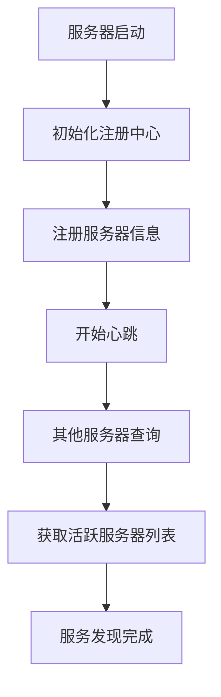
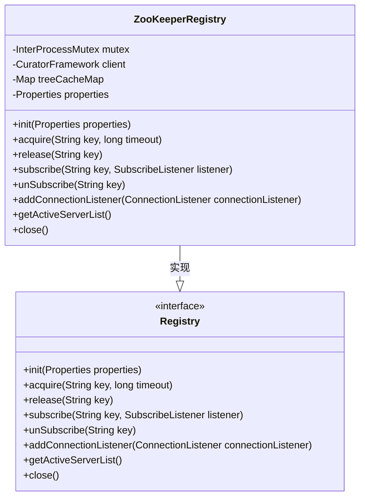
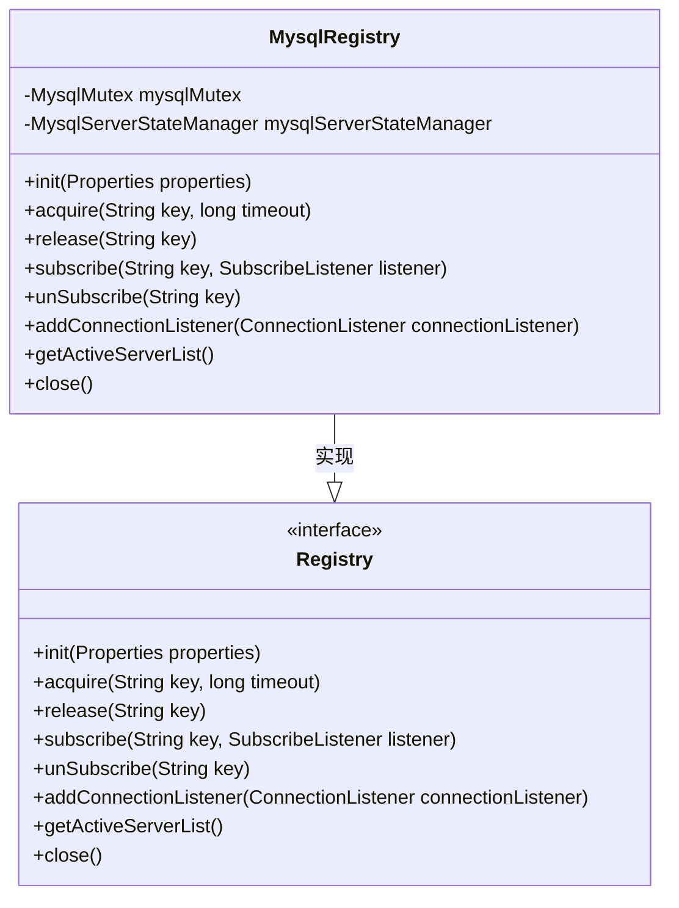
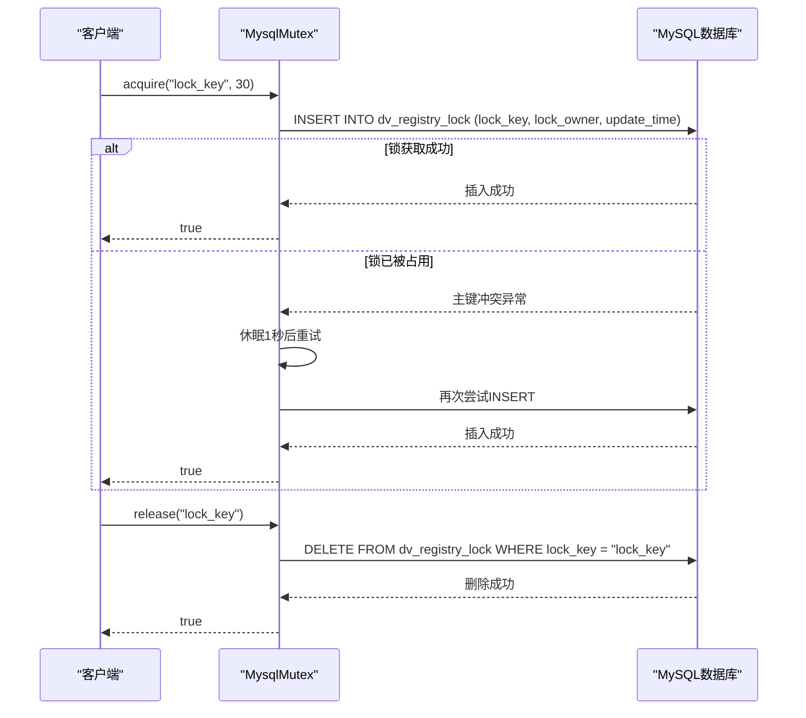
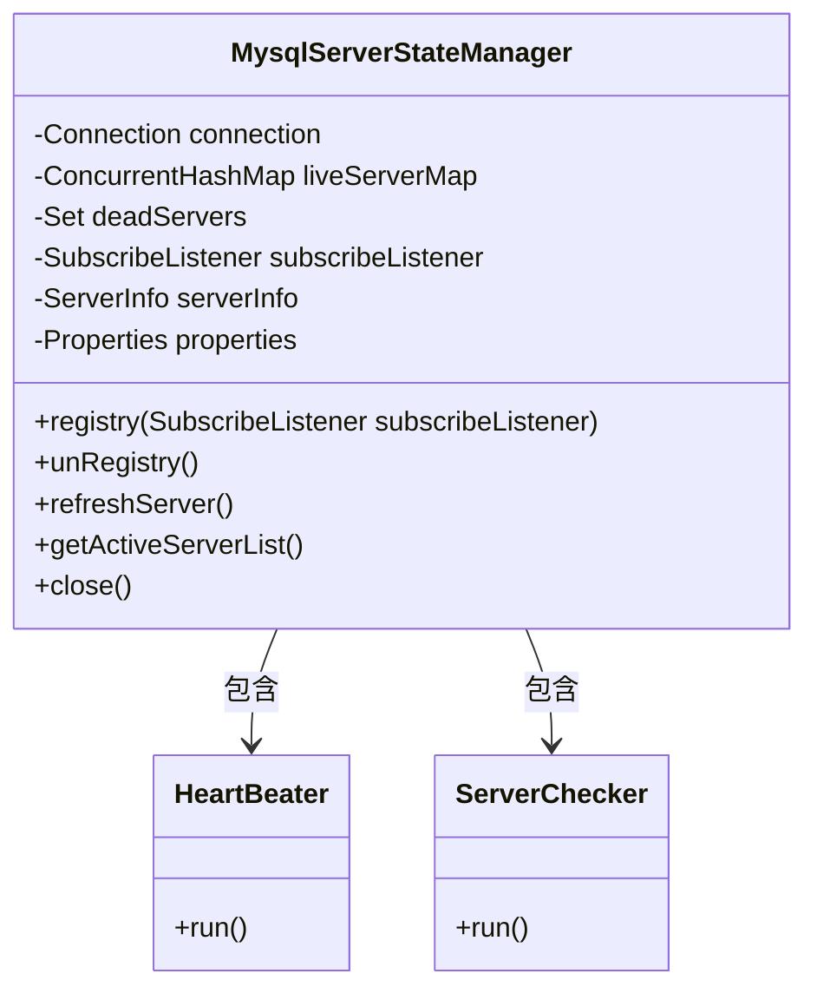

# 注册中心插件开发

<cite>
**本文档中引用的文件**  
- [Registry.java](file://datavines-registry\datavines-registry-api\src\main\java\io\datavines\registry\api\Registry.java)
- [ConnectionListener.java](file://datavines-registry\datavines-registry-api\src\main\java\io\datavines\registry\api\ConnectionListener.java)
- [SubscribeListener.java](file://datavines-registry\datavines-registry-api\src\main\java\io\datavines\registry\api\SubscribeListener.java)
- [Event.java](file://datavines-registry\datavines-registry-api\src\main\java\io\datavines\registry\api\Event.java)
- [ConnectionStatus.java](file://datavines-registry\datavines-registry-api\src\main\java\io\datavines\registry\api\ConnectionStatus.java)
- [ServerInfo.java](file://datavines-registry\datavines-registry-api\src\main\java\io\datavines\registry\api\ServerInfo.java)
- [ZooKeeperRegistry.java](file://datavines-registry\datavines-registry-plugins\datavines-registry-zookeeper\src\main\java\io\datavines\registry\plugin\ZooKeeperRegistry.java)
- [MysqlRegistry.java](file://datavines-registry\datavines-registry-plugins\datavines-registry-mysql\src\main\java\io\datavines\registry\plugin\MysqlRegistry.java)
- [MysqlMutex.java](file://datavines-registry\datavines-registry-plugins\datavines-registry-mysql\src\main\java\io\datavines\registry\plugin\MysqlMutex.java)
- [MysqlServerStateManager.java](file://datavines-registry\datavines-registry-plugins\datavines-registry-mysql\src\main\java\io\datavines\registry\plugin\MysqlServerStateManager.java)
- [CommonPropertyUtils.java](file://datavines-common\src\main\java\io\datavines\common\utils\CommonPropertyUtils.java)
- [ZooKeeperConfig.java](file://datavines-common\src\main\java\io\datavines\common\zookeeper\ZooKeeperConfig.java)
</cite>

## 目录
1. [引言](#引言)
2. [注册中心接口核心功能](#注册中心接口核心功能)
3. [服务注册与发现机制](#服务注册与发现机制)
4. [ZooKeeper注册中心实现](#zookeeper注册中心实现)
5. [MySQL注册中心实现](#mysql注册中心实现)
6. [分布式锁实现](#分布式锁实现)
7. [服务器状态管理](#服务器状态管理)
8. [连接状态监听与事件通知](#连接状态监听与事件通知)
9. [性能优化建议](#性能优化建议)
10. [高可用性设计考虑](#高可用性设计考虑)

## 引言

DataVines注册中心插件开发指南旨在为开发者提供详细的指导，帮助他们为DataVines开发新的注册中心插件。本指南将深入探讨Registry接口的核心功能和实现要求，包括服务注册、发现和监听机制。通过分析ZooKeeper和MySQL注册中心的实现示例，展示如何处理节点管理、会话维护和故障转移。此外，本指南还将涵盖分布式锁的实现和服务器状态管理，指导开发者如何实现连接状态监听和事件通知，并提供性能优化建议和高可用性设计考虑。

**本节不分析具体源文件，因此不提供源引用。**

## 注册中心接口核心功能

DataVines的注册中心插件基于`Registry`接口实现，该接口定义了注册中心的核心功能。`Registry`接口位于`io.datavines.registry.api.Registry`，是所有注册中心插件必须实现的契约。

`Registry`接口的主要功能包括：
- **初始化**：`init(Properties properties)`方法用于初始化注册中心，接收配置属性作为参数。
- **分布式锁**：`acquire(String key, long timeout)`和`release(String key)`方法用于获取和释放分布式锁。
- **订阅与取消订阅**：`subscribe(String key, SubscribeListener listener)`和`unSubscribe(String key)`方法用于订阅和取消订阅特定键的变更事件。
- **连接监听**：`addConnectionListener(ConnectionListener connectionListener)`方法用于添加连接状态监听器。
- **服务器列表获取**：`getActiveServerList()`方法用于获取当前活跃的服务器列表。
- **关闭**：`close()`方法用于关闭注册中心连接。

这些核心功能为DataVines提供了服务发现、配置管理、分布式协调等关键能力。

**本节不分析具体源文件，因此不提供源引用。**

## 服务注册与发现机制

DataVines的服务注册与发现机制通过`Registry`接口的实现来完成。当一个DataVines服务器启动时，它会通过注册中心插件将自己的信息注册到注册中心。其他服务器可以通过查询注册中心来发现可用的服务器。

在ZooKeeper注册中心实现中，服务器信息被存储在ZooKeeper的持久化节点中。服务器启动时，会创建一个包含其主机名和端口信息的节点。其他服务器可以通过读取该节点的子节点来获取活跃服务器列表。

在MySQL注册中心实现中，服务器信息被存储在`dv_server`数据库表中。服务器通过定期更新其心跳时间来表明其活跃状态。其他服务器可以通过查询该表来获取活跃服务器列表。



**本节不分析具体源文件，因此不提供源引用。**

## ZooKeeper注册中心实现

ZooKeeper注册中心实现位于`io.datavines.registry.plugin.ZooKeeperRegistry`类中。该实现利用Apache Curator框架与ZooKeeper进行交互。

`ZooKeeperRegistry`类的主要组件包括：
- **CuratorFramework client**：ZooKeeper客户端，用于与ZooKeeper集群通信。
- **InterProcessMutex mutex**：分布式互斥锁，用于实现分布式锁功能。
- **Map<String, TreeCache> treeCacheMap**：树缓存映射，用于缓存ZooKeeper节点的子节点信息。

`ZooKeeperRegistry`的初始化过程包括：
1. 从配置中获取ZooKeeper服务器列表。
2. 创建ZooKeeper客户端并连接到ZooKeeper集群。
3. 注册当前服务器信息到ZooKeeper。
4. 初始化树缓存用于监听节点变更。



**本节分析的具体源文件：**
- [ZooKeeperRegistry.java](file://datavines-registry\datavines-registry-plugins\datavines-registry-zookeeper\src\main\java\io\datavines\registry\plugin\ZooKeeperRegistry.java)

## MySQL注册中心实现

MySQL注册中心实现位于`io.datavines.registry.plugin.MysqlRegistry`类中。该实现利用JDBC与MySQL数据库进行交互。

`MysqlRegistry`类的主要组件包括：
- **MysqlMutex mysqlMutex**：MySQL分布式锁管理器。
- **MysqlServerStateManager mysqlServerStateManager**：MySQL服务器状态管理器。

`MysqlRegistry`的初始化过程包括：
1. 从配置中获取MySQL连接信息。
2. 建立与MySQL数据库的连接。
3. 初始化`MysqlMutex`和`MysqlServerStateManager`实例。



**本节分析的具体源文件：**
- [MysqlRegistry.java](file://datavines-registry\datavines-registry-plugins\datavines-registry-mysql\src\main\java\io\datavines\registry\plugin\MysqlRegistry.java)

## 分布式锁实现

DataVines的分布式锁实现通过`acquire`和`release`方法提供。不同的注册中心插件有不同的实现方式。

在ZooKeeper注册中心中，分布式锁通过Curator的`InterProcessMutex`实现。`InterProcessMutex`利用ZooKeeper的临时顺序节点来实现公平的分布式锁。

在MySQL注册中心中，分布式锁通过`MysqlMutex`类实现。`MysqlMutex`利用MySQL的行级锁和`dv_registry_lock`表来实现分布式锁。

`MysqlMutex`的主要特性包括：
- **锁获取**：通过`INSERT`语句尝试插入锁记录，如果主键冲突则表示锁已被占用。
- **锁释放**：通过`DELETE`语句删除锁记录。
- **锁续期**：通过后台线程定期更新锁的更新时间来续期。
- **过期清理**：定期清理超过一定时间未更新的锁记录。



**本节分析的具体源文件：**
- [MysqlMutex.java](file://datavines-registry\datavines-registry-plugins\datavines-registry-mysql\src\main\java\io\datavines\registry\plugin\MysqlMutex.java)

## 服务器状态管理

服务器状态管理是注册中心的核心功能之一，用于维护集群中所有服务器的活跃状态。

在ZooKeeper注册中心中，服务器状态通过ZooKeeper的临时节点实现。当服务器连接到ZooKeeper时，创建一个临时节点；当服务器断开连接时，ZooKeeper会自动删除该节点。

在MySQL注册中心中，服务器状态通过`MysqlServerStateManager`类管理。`MysqlServerStateManager`的主要功能包括：
- **心跳机制**：通过`HeartBeater`线程定期更新服务器的心跳时间。
- **服务器检查**：通过`ServerChecker`线程定期检查其他服务器的心跳状态。
- **状态变更通知**：当检测到服务器状态变更时，通过`SubscribeListener`通知监听器。



**本节分析的具体源文件：**
- [MysqlServerStateManager.java](file://datavines-registry\datavines-registry-plugins\datavines-registry-mysql\src\main\java\io\datavines\registry\plugin\MysqlServerStateManager.java)

## 连接状态监听与事件通知

连接状态监听与事件通知机制允许应用程序对注册中心的连接状态变化做出响应。

`ConnectionListener`接口定义了连接状态变更的回调方法。当注册中心的连接状态发生变化时（如连接、重连、断开连接），会调用`onUpdate`方法。

`SubscribeListener`接口定义了数据变更的回调方法。当注册中心中特定键的数据发生变化时，会调用`notify`方法。

在ZooKeeper注册中心中，连接状态监听通过Curator的`ConnectionStateListener`实现。事件通知通过`TreeCache`实现，当监听的节点发生变化时，会触发相应的事件。

在MySQL注册中心中，连接状态监听目前为空实现，因为MySQL的连接状态管理由JDBC驱动处理。事件通知通过轮询`dv_server`表实现。

```mermaid
classDiagram
class ConnectionListener {
<<interface>>
+onUpdate(ConnectionStatus status)
}
class SubscribeListener {
<<interface>>
+notify(Event event)
}
class Event {
-String key
-String value
-Type type
+EventBuilder builder()
}
class ConnectionStatus {
<<enumeration>>
CONNECTED
RECONNECTED
DISCONNECTED
}
class Event$Type {
<<enumeration>>
ADD
UPDATE
REMOVE
}
SubscribeListener --> Event : 接收
Event --> Event$Type : 包含
```

**本节分析的具体源文件：**
- [ConnectionListener.java](file://datavines-registry\datavines-registry-api\src\main\java\io\datavines\registry\api\ConnectionListener.java)
- [SubscribeListener.java](file://datavines-registry\datavines-registry-api\src\main\java\io\datavines\registry\api\SubscribeListener.java)
- [Event.java](file://datavines-registry\datavines-registry-api\src\main\java\io\datavines\registry\api\Event.java)
- [ConnectionStatus.java](file://datavines-registry\datavines-registry-api\src\main\java\io\datavines\registry\api\ConnectionStatus.java)

## 性能优化建议

在开发注册中心插件时，需要考虑以下性能优化建议：

1. **连接池**：对于数据库类型的注册中心，使用连接池来管理数据库连接，避免频繁创建和销毁连接的开销。
2. **缓存**：对于频繁读取的数据，使用本地缓存来减少对注册中心的访问次数。
3. **批量操作**：对于需要批量处理的操作，尽量使用批量API来减少网络往返次数。
4. **异步处理**：对于耗时的操作，使用异步处理来避免阻塞主线程。
5. **连接复用**：保持注册中心连接的长连接，避免频繁的连接和断开操作。

在MySQL注册中心实现中，已经通过`ScheduledExecutorService`实现了心跳和服务器检查的异步处理，这是一个良好的性能优化实践。

**本节不分析具体源文件，因此不提供源引用。**

## 高可用性设计考虑

高可用性是注册中心设计的关键考虑因素。以下是一些高可用性设计建议：

1. **集群部署**：注册中心本身应该以集群模式部署，避免单点故障。
2. **故障转移**：当主节点故障时，能够快速切换到备用节点。
3. **数据一致性**：确保在分布式环境下数据的一致性。
4. **网络分区处理**：在网络分区情况下，能够正确处理脑裂问题。
5. **监控和告警**：提供完善的监控和告警机制，及时发现和处理问题。

在ZooKeeper注册中心中，ZooKeeper本身就是一个高可用的分布式协调服务，天然支持集群部署和故障转移。在MySQL注册中心中，可以通过MySQL的主从复制或集群模式来实现高可用性。

**本节不分析具体源文件，因此不提供源引用。**