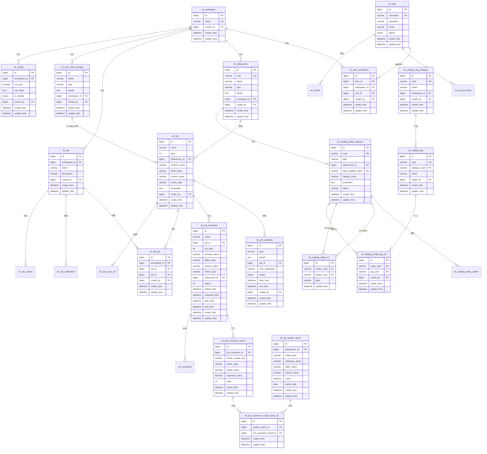

# ER图

<cite>
**本文档引用的文件**
- [datavines-mysql.sql](file://scripts/sql/datavines-mysql.sql)
- [CatalogEntityInstance.java](file://datavines-server/src/main/java/io/datavines/server/repository/entity/catalog/CatalogEntityInstance.java)
- [Job.java](file://datavines-server/src/main/java/io/datavines/server/repository/entity/Job.java)
- [JobExecution.java](file://datavines-server/src/main/java/io/datavines/server/repository/entity/JobExecution.java)
- [DataSource.java](file://datavines-server/src/main/java/io/datavines/server/repository/entity/DataSource.java)
- [Workspace.java](file://datavines-server/src/main/java/io/datavines/server/repository/entity/Workspace.java)
- [UserWorkspace.java](file://datavines-server/src/main/java/io/datavines/server/repository/entity/UserWorkspace.java)
- [User.java](file://datavines-server/src/main/java/io/datavines/server/repository/entity/User.java)
- [CatalogEntityRel.java](file://datavines-server/src/main/java/io/datavines/server/repository/entity/catalog/CatalogEntityRel.java)
- [CatalogEntityTagRel.java](file://datavines-server/src/main/java/io/datavines/server/repository/entity/catalog/CatalogEntityTagRel.java)
- [JobSchedule.java](file://datavines-server/src/main/java/io/datavines/server/repository/entity/JobSchedule.java)
- [JobExecutionResult.java](file://datavines-server/src/main/java/io/datavines/server/repository/entity/JobExecutionResult.java)
- [JobQualityReport.java](file://datavines-server/src/main/java/io/datavines/server/repository/entity/JobQualityReport.java)
- [Sla.java](file://datavines-server/src/main/java/io/datavines/server/repository/entity/Sla.java)
- [SlaJob.java](file://datavines-server/src/main/java/io/datavines/server/repository/entity/SlaJob.java)
- [ErrorDataStorage.java](file://datavines-server/src/main/java/io/datavines/server/repository/entity/ErrorDataStorage.java)
- [Config.java](file://datavines-server/src/main/java/io/datavines/server/repository/entity/Config.java)
- [dv_job](file://scripts/sql/datavines-mysql.sql#L499-L534)
- [dv_job_execution](file://scripts/sql/datavines-mysql.sql#L539-L580)
- [dv_datasource](file://scripts/sql/datavines-mysql.sql#L417-L432)
- [dv_workspace](file://scripts/sql/datavines-mysql.sql#L824-L834)
- [dv_user_workspace](file://scripts/sql/datavines-mysql.sql#L808-L819)
- [dv_user](file://scripts/sql/datavines-mysql.sql#L791-L803)
- [dv_catalog_entity_instance](file://scripts/sql/datavines-mysql.sql#L213-L233)
- [dv_catalog_entity_rel](file://scripts/sql/datavines-mysql.sql#L271-L282)
- [dv_catalog_entity_tag_rel](file://scripts/sql/datavines-mysql.sql#L287-L299)
- [dv_job_schedule](file://scripts/sql/datavines-mysql.sql#L660-L675)
- [dv_job_execution_result](file://scripts/sql/datavines-mysql.sql#L585-L608)
- [dv_job_quality_report](file://scripts/sql/datavines-mysql.sql#L614-L626)
- [dv_sla](file://scripts/sql/datavines-mysql.sql#L708-L718)
- [dv_sla_job](file://scripts/sql/datavines-mysql.sql#L724-L735)
- [dv_error_data_storage](file://scripts/sql/datavines-mysql.sql#L468-L481)
- [dv_config](file://scripts/sql/datavines-mysql.sql#L839-L851)
</cite>

## 目录
1. [简介](#简介)
2. [核心实体与属性](#核心实体与属性)
3. [实体关系图(ER图)](#实体关系图er图)
4. [关键关系设计说明](#关键关系设计说明)
5. [核心业务流程数据流](#核心业务流程数据流)
6. [附录：表结构详情](#附录表结构详情)

## 简介
本文档旨在为DataVines数据库提供一份全面的实体关系图（ER图）文档。DataVines是一个数据质量平台，其数据库设计围绕数据源、数据质量任务、执行记录、用户和工作空间等核心概念展开。本ER图文档将清晰地展示这些核心表之间的关系，标注主要属性、主键、外键约束和基数。同时，文档将解释关键关系的设计决策，并突出显示从数据源配置到任务执行的完整数据流路径。

## 核心实体与属性
DataVines数据库的核心实体包括数据源、任务、执行记录、用户、工作空间等。以下是各核心实体的主要属性和主键。

### 数据源 (dv_datasource)
数据源实体存储了所有连接到外部数据库或数据存储的配置信息。
- **主键**: `id`
- **主要属性**:
  - `uuid`: 数据源的唯一标识符
  - `name`: 数据源名称
  - `type`: 数据源类型（如MySQL, PostgreSQL, Hive等）
  - `param`: 数据源连接参数（JSON格式，包含主机、端口、数据库名、用户名、密码等）
  - `workspace_id`: 所属工作空间ID（外键）
  - `create_by`: 创建者用户ID（外键）

### 任务 (dv_job)
任务实体定义了数据质量检查的规则和配置。
- **主键**: `id`
- **主要属性**:
  - `name`: 任务名称
  - `type`: 任务类型（如数据质量检查、元数据抓取等）
  - `datasource_id`: 关联的数据源ID（外键）
  - `schema_name`, `table_name`, `column_name`: 指定检查的数据库、表和列
  - `metric_type`: 规则类型（如行数检查、空值检查等）
  - `parameter`: 任务的详细参数（JSON格式）
  - `create_by`: 创建者用户ID（外键）

### 任务执行记录 (dv_job_execution)
任务执行记录实体存储了每次任务运行的实例信息和状态。
- **主键**: `id`
- **主要属性**:
  - `name`: 执行实例名称
  - `job_id`: 关联的任务ID（外键）
  - `status`: 执行状态（如成功、失败、运行中）
  - `submit_time`, `start_time`, `end_time`: 提交、开始和结束时间
  - `execute_host`: 执行主机
  - `parameter`: 运行时参数
  - `log_path`: 日志文件路径

### 用户 (dv_user)
用户实体存储了系统用户的账户信息。
- **主键**: `id`
- **主要属性**:
  - `username`: 用户名
  - `password`: 加密后的密码
  - `email`: 邮箱
  - `admin`: 是否为管理员

### 工作空间 (dv_workspace)
工作空间实体是组织和隔离用户、数据源、任务等资源的逻辑单元。
- **主键**: `id`
- **主要属性**:
  - `name`: 工作空间名称
  - `create_by`: 创建者用户ID（外键）

### 用户-工作空间关联 (dv_user_workspace)
该实体是用户和工作空间之间的多对多关系的关联表。
- **主键**: `id`
- **主要属性**:
  - `user_id`: 用户ID（外键）
  - `workspace_id`: 工作空间ID（外键）
  - `role_id`: 用户在该工作空间中的角色ID

### 数据目录实体实例 (dv_catalog_entity_instance)
该实体存储了从数据源中抓取的元数据实例，如数据库、表、列等。
- **主键**: `id`
- **主要属性**:
  - `uuid`: 实体实例的唯一标识符
  - `type`: 实体类型（如DATABASE, TABLE, COLUMN）
  - `datasource_id`: 所属数据源ID（外键）
  - `fully_qualified_name`: 全限定名（如`database.table.column`）
  - `display_name`: 展示名称
  - `properties`: 其他属性（JSON格式）

## 实体关系图(ER图)

**图源**
- [datavines-mysql.sql](file://scripts/sql/datavines-mysql.sql)

## 关键关系设计说明
DataVines的数据库设计采用了多种关系模式来满足其复杂的业务需求。

### 一对多关系 (1:N)
这是最常见的一种关系。例如：
- **工作空间与数据源**: 一个工作空间可以包含多个数据源，但一个数据源只能属于一个工作空间。这通过在`dv_datasource`表中设置`workspace_id`作为外键来实现。
- **任务与执行记录**: 一个任务可以被多次执行，每次执行生成一条执行记录。这通过在`dv_job_execution`表中设置`job_id`作为外键来实现。
- **数据源与元数据实例**: 一个数据源可以包含多个数据库、表、列等元数据实例。这通过在`dv_catalog_entity_instance`表中设置`datasource_id`作为外键来实现。

### 多对多关系 (M:N)
当两个实体之间存在多对多关系时，需要引入一个关联表（也称为连接表或桥接表）来实现。
- **用户与工作空间**: 一个用户可以加入多个工作空间，一个工作空间也可以有多个用户。这种关系通过`dv_user_workspace`关联表实现，该表包含`user_id`和`workspace_id`两个外键。
- **元数据实例与标签**: 一个元数据实例（如一张表）可以被多个标签标记，一个标签也可以应用于多个元数据实例。这种关系通过`dv_catalog_entity_tag_rel`关联表实现，该表包含`entity_uuid`和`tag_uuid`两个外键。
- **SLA与任务**: 一个SLA规则可以管理多个任务，一个任务也可以被多个SLA规则管理。这种关系通过`dv_sla_job`关联表实现。

### 实体间关系 (dv_catalog_entity_rel)
`dv_catalog_entity_rel`表是一个特殊的设计，用于描述元数据实体之间的各种关系，如上下游、父子等。它通过`entity1_uuid`和`entity2_uuid`两个字段指向`dv_catalog_entity_instance`表的`uuid`，并通过`type`字段定义关系类型（如`upstream`, `downstream`）。这种设计非常灵活，能够表示复杂的元数据血缘和依赖关系。

## 核心业务流程数据流
以下是从数据源配置到任务执行的完整数据流路径，在ER图中已用粗线标出：

1.  **数据源配置**: 用户首先在某个`工作空间 (dv_workspace)`中创建一个`数据源 (dv_datasource)`。
2.  **元数据抓取**: 系统会根据数据源配置，自动抓取其元数据，并存储为`元数据实例 (dv_catalog_entity_instance)`。
3.  **任务创建**: 用户基于已有的数据源和元数据实例，创建一个`任务 (dv_job)`。
4.  **任务调度**: 为任务配置`任务调度 (dv_job_schedule)`，使其可以周期性执行。
5.  **任务执行**: 调度器触发任务执行，生成一条`任务执行记录 (dv_job_execution)`。
6.  **结果生成**: 任务执行完成后，会生成`任务执行结果 (dv_job_execution_result)`。
7.  **报告生成**: 系统会将执行结果汇总，生成`数据质量报告 (dv_job_quality_report)`。

## 附录：表结构详情
本节提供核心表的详细结构，包括字段名、数据类型、约束和注释。

### dv_datasource (数据源表)
| 字段名 | 类型 | 约束 | 注释 |
| :--- | :--- | :--- | :--- |
| id | bigint(20) | PRIMARY KEY, AUTO_INCREMENT | 主键 |
| uuid | varchar(64) | NOT NULL, UNIQUE | 数据源UUID |
| name | varchar(255) | NOT NULL, UNIQUE | 数据源名称 |
| type | varchar(255) | NOT NULL | 数据源类型 |
| param | text | NOT NULL | 数据源参数 |
| workspace_id | bigint(20) | NOT NULL | 工作空间ID |
| create_by | bigint(20) | NOT NULL | 创建用户ID |
| create_time | datetime | NOT NULL, DEFAULT CURRENT_TIMESTAMP | 创建时间 |
| update_by | bigint(20) | NOT NULL | 更新用户ID |
| update_time | datetime | NOT NULL, ON UPDATE CURRENT_TIMESTAMP | 更新时间 |

### dv_job (任务表)
| 字段名 | 类型 | 约束 | 注释 |
| :--- | :--- | :--- | :--- |
| id | bigint(20) | PRIMARY KEY, AUTO_INCREMENT | 主键 |
| name | varchar(255) | DEFAULT NULL | 作业名称 |
| type | int(11) | NOT NULL, DEFAULT '0' | 作业类型 |
| datasource_id | bigint(20) | NOT NULL | 数据源ID |
| schema_name | varchar(128) | DEFAULT NULL | 数据库名 |
| table_name | varchar(128) | DEFAULT NULL | 表名 |
| column_name | varchar(128) | DEFAULT NULL | 列名 |
| metric_type | varchar(255) | DEFAULT NULL | 规则类型 |
| parameter | longtext | DEFAULT NULL | 作业参数 |
| create_by | bigint(20) | NOT NULL | 创建用户ID |
| create_time | datetime | NOT NULL, DEFAULT CURRENT_TIMESTAMP | 创建时间 |
| update_by | bigint(20) | NOT NULL | 更新用户ID |
| update_time | datetime | NOT NULL, ON UPDATE CURRENT_TIMESTAMP | 更新时间 |

### dv_job_execution (任务执行记录表)
| 字段名 | 类型 | 约束 | 注释 |
| :--- | :--- | :--- | :--- |
| id | bigint(20) | PRIMARY KEY, AUTO_INCREMENT | 主键 |
| name | varchar(255) | NOT NULL | 作业运行实例名称 |
| job_id | bigint(20) | NOT NULL | 作业ID |
| status | int(11) | DEFAULT NULL | 作业运行状态 |
| submit_time | datetime | DEFAULT NULL | 提交时间 |
| schedule_time | datetime | DEFAULT NULL | 调度时间 |
| start_time | datetime | DEFAULT NULL | 开始时间 |
| end_time | datetime | DEFAULT NULL | 结束时间 |
| create_time | datetime | NOT NULL, DEFAULT CURRENT_TIMESTAMP | 创建时间 |
| update_time | datetime | NOT NULL, ON UPDATE CURRENT_TIMESTAMP | 更新时间 |

**图源**
- [datavines-mysql.sql](file://scripts/sql/datavines-mysql.sql)

**节源**
- [datavines-mysql.sql](file://scripts/sql/datavines-mysql.sql)