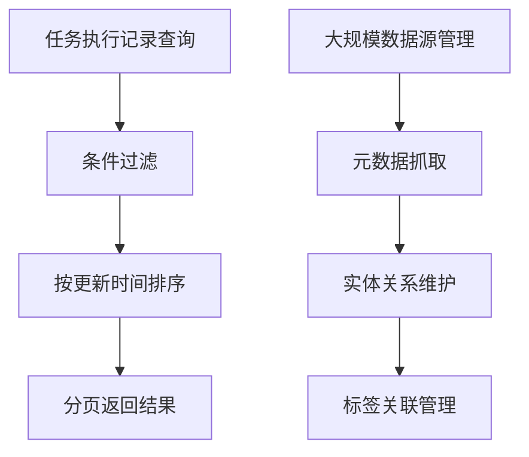
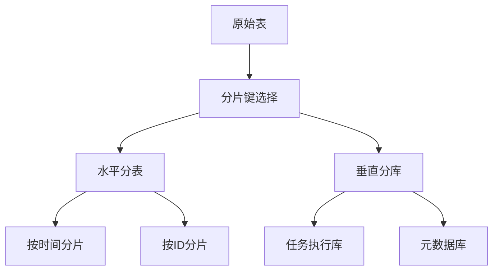
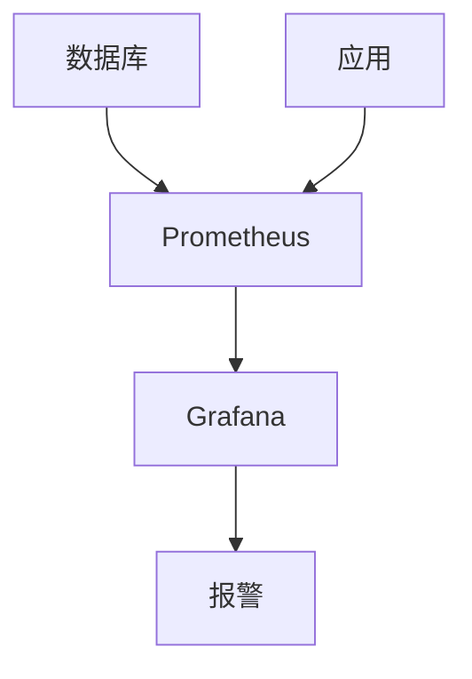

# 性能优化

<cite>
**本文档引用的文件**   
- [JdbcDataSourceManager.java](file://datavines-common/src/main/java/io/datavines/common/datasource/jdbc/JdbcDataSourceManager.java)
- [application.yaml](file://datavines-server/src/main/resources/application.yaml)
- [JobExecutionMapper.xml](file://datavines-server/src/main/resources/mapper/JobExecutionMapper.xml)
- [datavines-mysql.sql](file://scripts/sql/datavines-mysql.sql)
- [JobExecutionMapper.java](file://datavines-server/src/main/java/io/datavines/server/repository/mapper/JobExecutionMapper.java)
- [JdbcDataSourceInfoManager.java](file://datavines-common/src/main/java/io/datavines/common/datasource/jdbc/JdbcDataSourceInfoManager.java)
- [BaseJdbcDataSourceInfo.java](file://datavines-common/src/main/java/io/datavines/common/datasource/jdbc/BaseJdbcDataSourceInfo.java)
- [DefaultDataSourceInfoUtils.java](file://datavines-server/src/main/java/io/datavines/server/utils/DefaultDataSourceInfoUtils.java)
- [TableColumnInfo.java](file://datavines-common/src/main/java/io/datavines/common/datasource/jdbc/entity/TableColumnInfo.java)
- [SqlUtils.java](file://datavines-common/src/main/java/io/datavines/common/datasource/jdbc/utils/SqlUtils.java)
</cite>

## 目录
1. [引言](#引言)
2. [数据库性能瓶颈分析](#数据库性能瓶颈分析)
3. [SQL查询优化建议](#sql查询优化建议)
4. [数据库配置调优](#数据库配置调优)
5. [分库分表策略建议](#分库分表策略建议)
6. [数据库性能监控](#数据库性能监控)
7. [定期维护任务清单](#定期维护任务清单)
8. [结论](#结论)

## 引言

DataVines是一个数据质量监控平台，其核心功能包括数据源管理、任务执行记录查询和大规模数据处理。随着数据量的增长，数据库性能成为影响系统整体效率的关键因素。本文档旨在为数据库管理员提供一套全面的性能优化指南，涵盖SQL查询优化、数据库配置调优、分库分表策略以及定期维护任务等方面。

**本文档引用的文件**
- [JdbcDataSourceManager.java](file://datavines-common/src/main/java/io/datavines/common/datasource/jdbc/JdbcDataSourceManager.java#L1-L144)
- [application.yaml](file://datavines-server/src/main/resources/application.yaml#L1-L96)

## 数据库性能瓶颈分析

DataVines在处理大规模数据源管理和任务执行记录查询时，可能会遇到以下常见的数据库瓶颈：

1. **任务执行记录查询性能下降**：随着任务执行记录的积累，`dv_job_execution`表的数据量会迅速增长，导致查询性能下降。
2. **大规模数据源管理开销大**：当系统管理的数据源数量较多时，元数据抓取和管理的开销会显著增加。
3. **连接池资源竞争**：高并发场景下，数据库连接池可能成为性能瓶颈，导致连接获取延迟增加。

通过分析`JobExecutionMapper.xml`中的SQL语句，可以发现任务执行记录查询涉及多个条件过滤和排序操作，这些操作在大数据量下可能导致性能问题。



**图表来源**
- [JobExecutionMapper.xml](file://datavines-server/src/main/resources/mapper/JobExecutionMapper.xml#L1-L156)

**本节来源**
- [JobExecutionMapper.xml](file://datavines-server/src/main/resources/mapper/JobExecutionMapper.xml#L1-L156)
- [datavines-mysql.sql](file://scripts/sql/datavines-mysql.sql#L166-L177)

## SQL查询优化建议

针对DataVines中的常见查询场景，提出以下SQL查询优化建议：

### 查询重写

对于复杂的查询条件，可以通过查询重写来提高性能。例如，在`getJobExecutionPage`查询中，可以将多个`LIKE`操作合并为一个正则表达式匹配，减少查询解析时间。

```sql
-- 原始查询
SELECT * FROM dv_job_execution 
WHERE LOWER(name) LIKE '%searchVal%' 
  AND LOWER(schema_name) LIKE '%schemaSearch%' 
  AND LOWER(table_name) LIKE '%tableSearch%';

-- 优化后查询
SELECT * FROM dv_job_execution 
WHERE name REGEXP '.*searchVal.*' 
  AND schema_name REGEXP '.*schemaSearch.*' 
  AND table_name REGEXP '.*tableSearch.*';
```

### 连接优化

在涉及多表连接的查询中，应确保连接字段上有适当的索引。例如，在`dv_catalog_entity_rel`表中，`entity1_uuid`和`entity2_uuid`字段上已经建立了唯一索引，这有助于提高连接性能。

### 子查询优化

避免在WHERE子句中使用子查询，因为这可能导致全表扫描。可以将子查询转换为JOIN操作，利用索引提高查询效率。

```sql
-- 避免使用子查询
SELECT * FROM dv_job_execution 
WHERE job_id IN (SELECT job_id FROM dv_job WHERE status = 'active');

-- 推荐使用JOIN
SELECT je.* FROM dv_job_execution je 
JOIN dv_job j ON je.job_id = j.job_id 
WHERE j.status = 'active';
```

**本节来源**
- [JobExecutionMapper.xml](file://datavines-server/src/main/resources/mapper/JobExecutionMapper.xml#L111-L130)
- [datavines-mysql.sql](file://scripts/sql/datavines-mysql.sql#L280-L282)

## 数据库配置调优

### 连接池大小

根据`application.yaml`中的配置，HikariCP连接池的最大池大小设置为50。对于高并发场景，可以根据实际负载调整此值。建议通过压力测试确定最优的连接池大小。

```yaml
spring:
  datasource:
    hikari:
      maximum-pool-size: 50
```

### 查询缓存

启用查询缓存可以显著提高重复查询的性能。对于不经常变化的数据，如元数据信息，可以考虑使用缓存机制。

### 其他调优参数

- **最小空闲连接数**：设置为5，确保有足够的空闲连接供快速响应。
- **连接超时时间**：设置为30秒，防止长时间等待连接。
- **空闲超时时间**：设置为10分钟，及时释放空闲连接。

```yaml
spring:
  datasource:
    hikari:
      minimum-idle: 5
      connection-timeout: 30000
      idle-timeout: 600000
```

**本节来源**
- [application.yaml](file://datavines-server/src/main/resources/application.yaml#L23-L38)
- [JdbcDataSourceManager.java](file://datavines-common/src/main/java/io/datavines/common/datasource/jdbc/JdbcDataSourceManager.java#L59-L60)

## 分库分表策略建议

针对大规模部署场景，建议采用分库分表策略来分散数据存储和查询压力。

### 水平分表

根据时间维度对`dv_job_execution`表进行水平分表，例如按月或按周创建子表。这样可以减少单个表的数据量，提高查询性能。

```sql
-- 按月分表
CREATE TABLE dv_job_execution_2023_01 LIKE dv_job_execution;
CREATE TABLE dv_job_execution_2023_02 LIKE dv_job_execution;
```

### 垂直分库

将不同类型的业务数据存储在不同的数据库中，例如将任务执行记录与元数据信息分开存储，减少单个数据库的负载。

### 分片键选择

选择合适的分片键是分库分表成功的关键。对于任务执行记录，可以选择`job_id`或`create_time`作为分片键，确保数据均匀分布。



**图表来源**
- [datavines-mysql.sql](file://scripts/sql/datavines-mysql.sql#L166-L177)

**本节来源**
- [datavines-mysql.sql](file://scripts/sql/datavines-mysql.sql#L166-L177)
- [JobExecutionMapper.xml](file://datavines-server/src/main/resources/mapper/JobExecutionMapper.xml#L111-L130)

## 数据库性能监控

### 关键指标

监控以下关键性能指标，及时发现和解决性能问题：

- **查询响应时间**：监控SQL查询的平均响应时间和最大响应时间。
- **连接池使用率**：监控连接池的活跃连接数和等待连接数。
- **慢查询日志**：定期分析慢查询日志，找出性能瓶颈。

### 工具建议

使用Prometheus和Grafana搭建监控系统，实时监控数据库性能指标。结合Spring Boot Actuator暴露的端点，收集应用层面的性能数据。



**图表来源**
- [application.yaml](file://datavines-server/src/main/resources/application.yaml#L72-L80)

**本节来源**
- [application.yaml](file://datavines-server/src/main/resources/application.yaml#L72-L80)
- [JobExecutionMapper.xml](file://datavines-server/src/main/resources/mapper/JobExecutionMapper.xml#L111-L130)

## 定期维护任务清单

为数据库管理员提供以下定期维护任务清单：

1. **更新统计信息**：定期更新表的统计信息，帮助查询优化器生成更优的执行计划。
2. **碎片整理**：定期对表进行碎片整理，提高存储效率和查询性能。
3. **索引优化**：定期检查和优化索引，删除无用索引，添加缺失索引。
4. **备份与恢复测试**：定期执行数据库备份，并测试恢复流程，确保数据安全。

```sql
-- 更新统计信息
ANALYZE TABLE dv_job_execution;

-- 碎片整理
OPTIMIZE TABLE dv_job_execution;
```

**本节来源**
- [datavines-mysql.sql](file://scripts/sql/datavines-mysql.sql#L166-L177)
- [JobExecutionMapper.xml](file://datavines-server/src/main/resources/mapper/JobExecutionMapper.xml#L111-L130)

## 结论

通过对DataVines的数据库性能瓶颈进行分析，本文档提供了全面的优化建议，包括SQL查询优化、数据库配置调优、分库分表策略和定期维护任务。实施这些优化措施可以显著提高系统的整体性能和稳定性，为大规模数据处理提供有力支持。