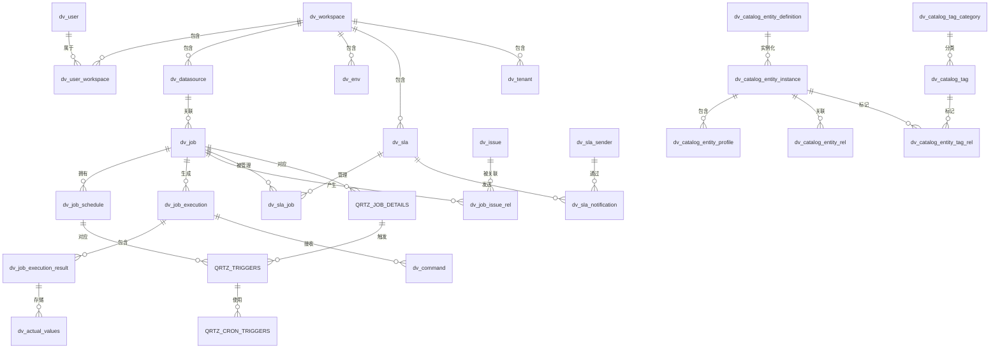
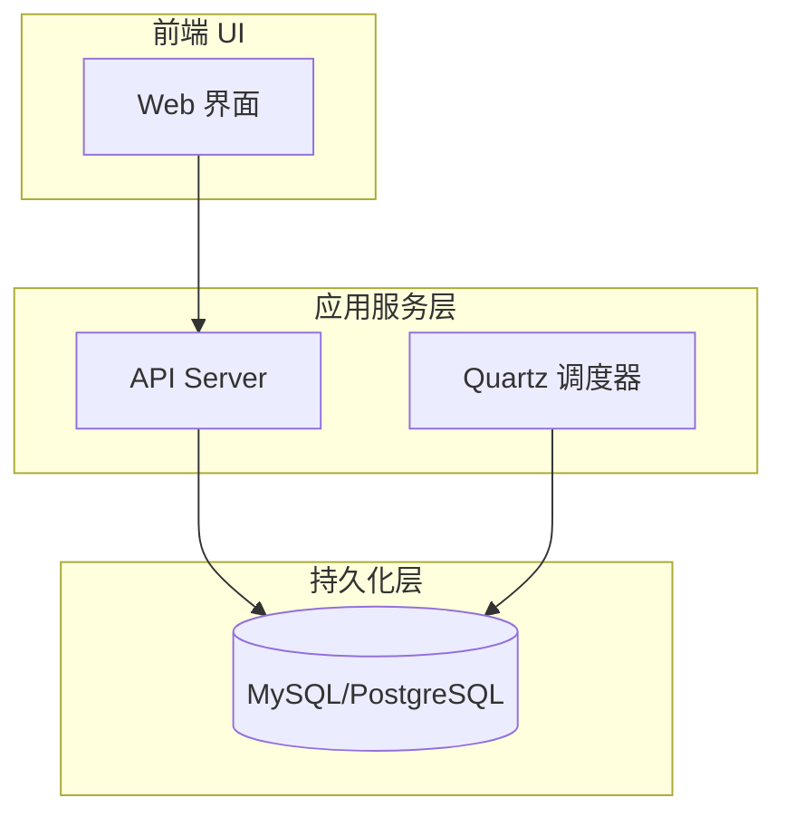
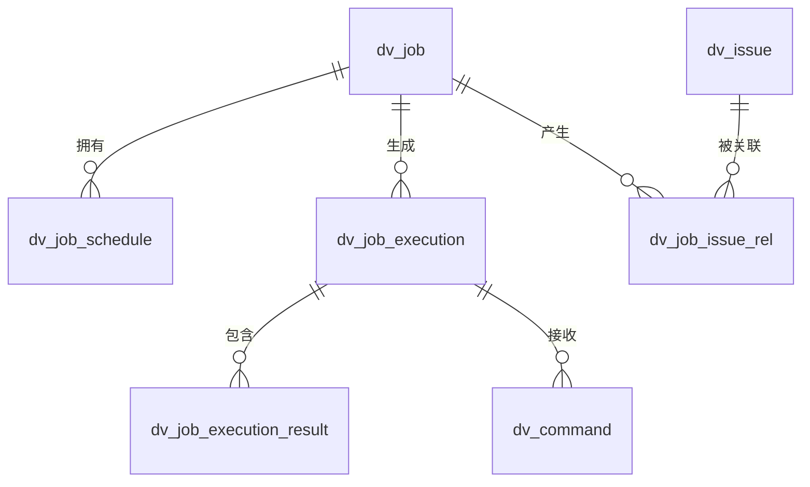
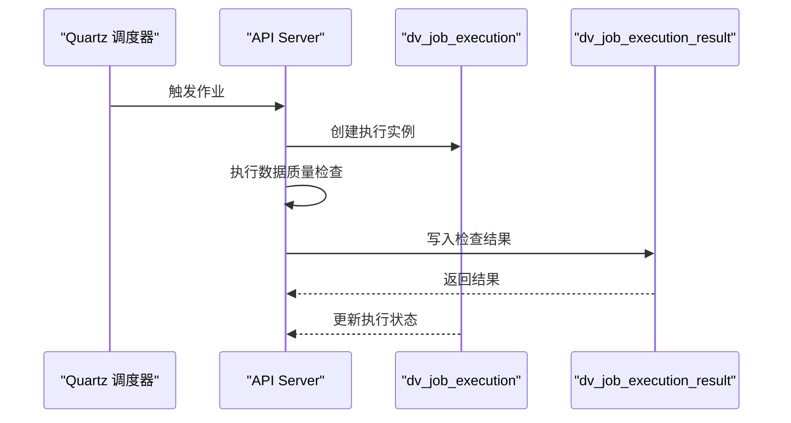
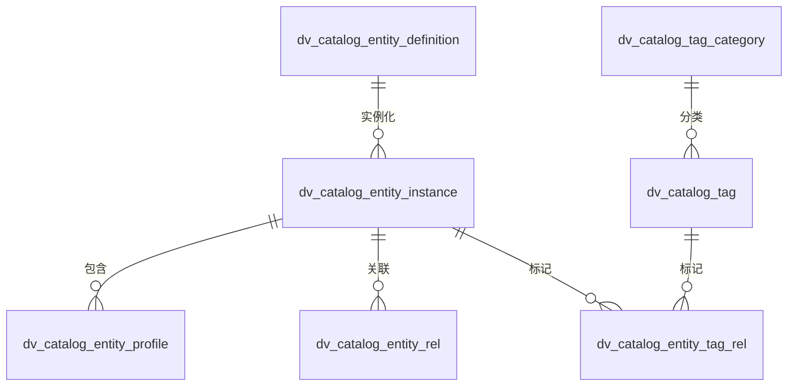
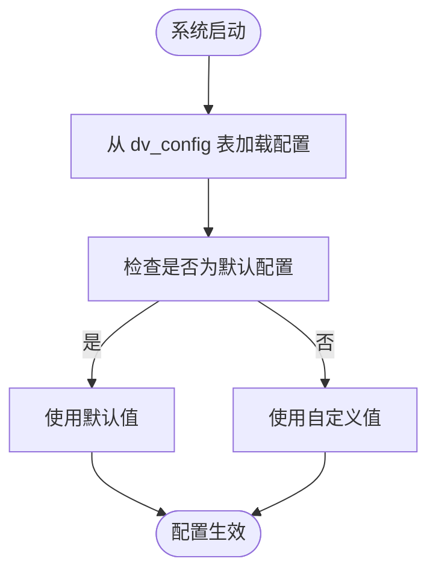
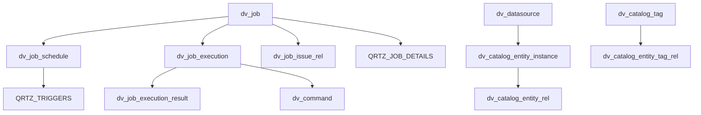

# 数据库设计

<cite>
**本文档引用的文件**   
- [datavines-mysql.sql](file://scripts/sql/datavines-mysql.sql)
- [JobExecution.java](file://datavines-server/src/main/java/io/datavines/server/repository/entity/JobExecution.java)
- [JobExecutionResult.java](file://datavines-server/src/main/java/io/datavines/server/repository/entity/JobExecutionResult.java)
- [CatalogEntityInstance.java](file://datavines-server/src/main/java/io/datavines/server/repository/entity/catalog/CatalogEntityInstance.java)
- [Config.java](file://datavines-server/src/main/java/io/datavines/server/repository/entity/Config.java)
- [ExecutionStatus.java](file://datavines-common/src/main/java/io/datavines/common/enums/ExecutionStatus.java)
- [application.yaml](file://datavines-server/src/main/resources/application.yaml)
</cite>

## 目录
1. [引言](#引言)
2. [项目结构](#项目结构)
3. [核心组件](#核心组件)
4. [架构概述](#架构概述)
5. [详细组件分析](#详细组件分析)
6. [依赖分析](#依赖分析)
7. [性能考虑](#性能考虑)
8. [故障排除指南](#故障排除指南)
9. [结论](#结论)
10. [附录](#附录)（如有必要）

## 引言
DataVines是一个数据质量监控和元数据管理平台，其数据库设计是整个系统的核心。数据库模式支持数据质量规则的定义、执行、结果存储以及元数据的管理。系统使用MySQL或PostgreSQL作为后端数据库，通过MyBatis-Plus进行ORM映射。数据库设计围绕工作空间（Workspace）、数据源（DataSource）、数据质量作业（Job）和执行实例（JobExecution）等核心概念展开。此外，系统还集成了Quartz调度框架来管理作业的定时执行。本设计文档将详细描述DataVines的数据库模式，包括实体关系、表结构、索引策略和性能优化建议。

## 项目结构
DataVines的项目结构清晰地划分了不同的功能模块。核心的数据库表定义位于`scripts/sql/datavines-mysql.sql`文件中，该文件包含了所有表的创建语句。实体类（Entity）位于`datavines-server/src/main/java/io/datavines/server/repository/entity/`目录下，这些类使用MyBatis-Plus注解与数据库表进行映射。配置文件`application.yaml`定义了数据库连接信息和Quartz调度器的配置。这种分层结构使得数据库设计与业务逻辑分离，便于维护和扩展。

**图表来源**
- [datavines-mysql.sql](file://scripts/sql/datavines-mysql.sql)

**章节来源**
- [datavines-mysql.sql](file://scripts/sql/datavines-mysql.sql)

## 核心组件
DataVines的核心组件围绕数据质量监控和元数据管理展开。`dv_job`表是数据质量规则的定义中心，存储了规则的类型、参数和执行引擎等信息。`dv_job_execution`表记录了每次规则执行的实例，是系统运行时状态的核心。`dv_job_execution_result`表存储了规则执行后的具体结果，包括实际值、期望值和比较结果。元数据管理部分以`dv_catalog_entity_instance`表为核心，代表了数据源中的数据库、表、列等实体。`dv_workspace`和`dv_user`表则构成了系统的多租户和权限管理基础。这些组件通过外键和关联表紧密联系，形成了一个完整的数据治理体系。

**章节来源**
- [JobExecution.java](file://datavines-server/src/main/java/io/datavines/server/repository/entity/JobExecution.java)
- [JobExecutionResult.java](file://datavines-server/src/main/java/io/datavines/server/repository/entity/JobExecutionResult.java)
- [CatalogEntityInstance.java](file://datavines-server/src/main/java/io/datavines/server/repository/entity/catalog/CatalogEntityInstance.java)

## 架构概述
DataVines的系统架构采用微服务设计，数据库作为持久化层，为上层应用提供数据支持。应用层通过MyBatis-Plus访问数据库，执行CRUD操作。Quartz调度框架负责作业的定时触发，其调度信息存储在`QRTZ_*`系列表中。数据质量作业的定义和调度信息存储在`dv_job`和`dv_job_schedule`表中，当作业被触发时，系统会创建`dv_job_execution`实例来跟踪执行过程。执行结果被详细记录在`dv_job_execution_result`和`dv_actual_values`表中。元数据管理模块独立运行，通过`dv_catalog_*`系列表存储和管理数据资产的元信息。整个架构通过清晰的模块划分和数据库设计，实现了高内聚、低耦合。

**图表来源**
- [application.yaml](file://datavines-server/src/main/resources/application.yaml)

## 详细组件分析

### 数据质量作业分析
数据质量作业是DataVines的核心功能，其设计围绕`dv_job`、`dv_job_execution`和`dv_job_execution_result`三个主要表展开。

#### 数据质量作业实体关系图

**图表来源**
- [datavines-mysql.sql](file://scripts/sql/datavines-mysql.sql#L497-L656)

#### 数据质量作业执行流程序列图

**图表来源**
- [JobExecution.java](file://datavines-server/src/main/java/io/datavines/server/repository/entity/JobExecution.java)
- [JobExecutionResult.java](file://datavines-server/src/main/java/io/datavines/server/repository/entity/JobExecutionResult.java)

**章节来源**
- [JobExecution.java](file://datavines-server/src/main/java/io/datavines/server/repository/entity/JobExecution.java#L1-L162)
- [JobExecutionResult.java](file://datavines-server/src/main/java/io/datavines/server/repository/entity/JobExecutionResult.java#L1-L95)

### 元数据管理分析
元数据管理模块负责存储和管理数据资产的信息，其核心是`dv_catalog_entity_instance`表。

#### 元数据管理实体关系图

**图表来源**
- [datavines-mysql.sql](file://scripts/sql/datavines-mysql.sql#L191-L353)

**章节来源**
- [CatalogEntityInstance.java](file://datavines-server/src/main/java/io/datavines/server/repository/entity/catalog/CatalogEntityInstance.java#L1-L79)

### 配置管理分析
配置管理模块通过`dv_config`表存储系统和工作空间级别的配置参数。

#### 配置管理流程图

**图表来源**
- [Config.java](file://datavines-server/src/main/java/io/datavines/server/repository/entity/Config.java)

**章节来源**
- [Config.java](file://datavines-server/src/main/java/io/datavines/server/repository/entity/Config.java#L1-L67)

## 依赖分析
DataVines的数据库设计中存在多个关键依赖关系。`dv_job_execution`表依赖于`dv_job`表，通过`job_id`外键关联，确保每次执行都对应一个已定义的作业。`dv_job_execution_result`表依赖于`dv_job_execution`表，通过`job_execution_id`进行关联，形成执行-结果的层级结构。元数据管理模块中，`dv_catalog_entity_instance`表通过`datasource_id`依赖于`dv_datasource`表。Quartz调度框架的`QRTZ_TRIGGERS`表依赖于`QRTZ_JOB_DETAILS`表。这些依赖关系通过外键约束在数据库层面得到保证，确保了数据的完整性和一致性。

**图表来源**
- [datavines-mysql.sql](file://scripts/sql/datavines-mysql.sql)

**章节来源**
- [datavines-mysql.sql](file://scripts/sql/datavines-mysql.sql)

## 性能考虑
为了确保数据库的高性能，DataVines的数据库设计采用了多种优化策略。首先，对频繁查询的字段建立了索引，例如`dv_job_execution`表的`job_id`和`status`字段，`dv_job_execution_result`表的`job_execution_id`字段。其次，使用了复合主键和唯一键来保证数据的唯一性并加速查询，如`dv_catalog_entity_instance`表的`datasource_fqn_status_un`唯一键。对于大文本字段，如`parameter`和`properties`，使用了`text`或`longtext`类型，并建议在应用层进行合理的缓存。此外，`dv_job_execution`和`dv_job_execution_result`表可能会产生大量数据，建议根据`create_time`字段进行分表或归档，以避免单表数据量过大影响查询性能。

## 故障排除指南
当遇到数据库相关问题时，可以参考以下指南进行排查。首先，检查`application.yaml`中的数据库连接配置是否正确，包括URL、用户名和密码。其次，查看`dv_job_execution`表中作业实例的状态（`status`字段），其值由`ExecutionStatus`枚举定义，如`0`表示已提交，`1`表示执行中，`6`表示失败。如果作业失败，可以检查`dv_job_execution`表中的`log_path`字段指向的日志文件。对于调度问题，检查`QRTZ_*`系列表中的记录，确认Quartz调度器是否正常工作。如果出现性能问题，可以使用`EXPLAIN`命令分析慢查询，并检查相关索引是否有效。

**章节来源**
- [ExecutionStatus.java](file://datavines-common/src/main/java/io/datavines/common/enums/ExecutionStatus.java#L1-L158)
- [application.yaml](file://datavines-server/src/main/resources/application.yaml#L1-L96)

## 结论
DataVines的数据库设计是一个功能完整且结构清晰的数据治理体系。它有效地支持了数据质量监控和元数据管理两大核心功能。通过合理使用MyBatis-Plus和Quartz，实现了业务逻辑与持久化的良好分离。数据库模式设计考虑了数据完整性、查询性能和系统扩展性。未来，可以通过引入更细粒度的分区策略、优化历史数据归档机制以及加强监控告警功能，进一步提升系统的稳定性和可维护性。

## 附录

### 主要数据表结构说明

#### dv_job (数据质量作业表)
| 字段名 | 数据类型 | 约束 | 说明 |
| :--- | :--- | :--- | :--- |
| id | bigint(20) | PRIMARY KEY, AUTO_INCREMENT | 作业ID |
| name | varchar(255) | NOT NULL | 作业名称 |
| type | int(11) | NOT NULL | 作业类型 |
| datasource_id | bigint(20) | NOT NULL | 数据源ID |
| metric_type | varchar(255) | | 规则类型 |
| parameter | longtext | | 作业参数 |
| create_time | datetime | NOT NULL, DEFAULT CURRENT_TIMESTAMP | 创建时间 |
| update_time | datetime | NOT NULL, ON UPDATE CURRENT_TIMESTAMP | 更新时间 |

#### dv_job_execution (作业执行实例表)
| 字段名 | 数据类型 | 约束 | 说明 |
| :--- | :--- | :--- | :--- |
| id | bigint(20) | PRIMARY KEY, AUTO_INCREMENT | 执行实例ID |
| job_id | bigint(20) | NOT NULL | 关联的作业ID |
| status | int(11) | | 执行状态 |
| start_time | datetime | | 开始时间 |
| end_time | datetime | | 结束时间 |
| create_time | datetime | NOT NULL, DEFAULT CURRENT_TIMESTAMP | 创建时间 |

#### dv_job_execution_result (作业执行结果表)
| 字段名 | 数据类型 | 约束 | 说明 |
| :--- | :--- | :--- | :--- |
| id | bigint(20) | PRIMARY KEY, AUTO_INCREMENT | 结果ID |
| job_execution_id | bigint(20) | NOT NULL | 关联的执行实例ID |
| actual_value | decimal(20,4) | | 实际值 |
| expected_value | decimal(20,4) | | 期望值 |
| state | int(2) | NOT NULL | 结果状态 (0:成功, 1:失败) |
| create_time | datetime | NOT NULL, DEFAULT CURRENT_TIMESTAMP | 创建时间 |