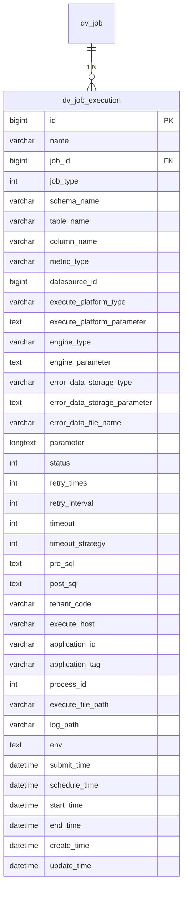
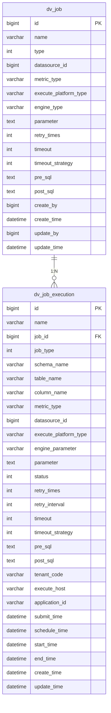

# 任务执行表 (job_execution)

<cite>
**本文档引用的文件**   
- [datavines-mysql.sql](file://scripts/sql/datavines-mysql.sql)
- [JobExecution.java](file://datavines-server/src/main/java/io/datavines/server/repository/entity/JobExecution.java)
- [ExecutionStatus.java](file://datavines-common/src/main/java/io/datavines/common/enums/ExecutionStatus.java)
- [TimeoutStrategy.java](file://datavines-common/src/main/java/io/datavines/common/enums/TimeoutStrategy.java)
- [JobExecutionParameter.java](file://datavines-common/src/main/java/io/datavines/common/entity/JobExecutionParameter.java)
</cite>

## 目录
1. [表结构概览](#表结构概览)
2. [字段详细说明](#字段详细说明)
3. [状态字段说明](#状态字段说明)
4. [执行平台字段说明](#执行平台字段说明)
5. [设计考虑](#设计考虑)
6. [关联关系](#关联关系)
7. [核心作用](#核心作用)

## 表结构概览

`dv_job_execution` 表用于存储数据质量规则作业的运行实例信息。该表记录了每次作业执行的详细信息，包括执行状态、时间戳、配置参数等，是任务调度和监控系统的核心组成部分。

**图表来源**
- [datavines-mysql.sql](file://scripts/sql/datavines-mysql.sql#L537-L580)
- [JobExecution.java](file://datavines-server/src/main/java/io/datavines/server/repository/entity/JobExecution.java)

## 字段详细说明

`dv_job_execution` 表包含以下字段：

| 字段名 | 数据类型 | 允许空值 | 默认值 | 说明 |
| :--- | :--- | :--- | :--- | :--- |
| `id` | bigint(20) | 否 | 自增 | 主键，作业运行实例ID |
| `name` | varchar(255) | 否 | - | 作业运行实例名称 |
| `job_id` | bigint(20) | 否 | '-1' | 外键，关联到dv_job表的ID，表示该执行实例对应的作业定义 |
| `job_type` | int(11) | 否 | '0' | 作业类型 |
| `schema_name` | varchar(128) | 是 | NULL | 数据库名 |
| `table_name` | varchar(128) | 是 | NULL | 表名 |
| `column_name` | varchar(128) | 是 | NULL | 列名 |
| `metric_type` | varchar(255) | 是 | NULL | 规则类型 |
| `datasource_id` | bigint(20) | 否 | '-1' | 数据源ID |
| `execute_platform_type` | varchar(128) | 是 | NULL | 运行平台类型（如：YARN, LOCAL, LIVY） |
| `execute_platform_parameter` | text | 是 | NULL | 运行平台参数 |
| `engine_type` | varchar(128) | 是 | NULL | 运行引擎类型（如：SPARK, FLINK） |
| `engine_parameter` | text | 是 | NULL | 运行引擎参数 |
| `error_data_storage_type` | varchar(128) | 是 | NULL | 错误数据存储类型 |
| `error_data_storage_parameter` | text | 是 | NULL | 错误数据存储参数 |
| `error_data_file_name` | varchar(255) | 是 | NULL | 错误数据存储文件名 |
| `parameter` | longtext | 否 | - | 作业运行参数，包含具体的规则配置 |
| `status` | int(11) | 是 | NULL | 作业运行状态，对应ExecutionStatus枚举 |
| `retry_times` | int(11) | 是 | NULL | 重试次数 |
| `retry_interval` | int(11) | 是 | NULL | 重试间隔（秒） |
| `timeout` | int(11) | 是 | NULL | 超时时间（秒） |
| `timeout_strategy` | int(11) | 是 | NULL | 超时处理策略，对应TimeoutStrategy枚举 |
| `pre_sql` | text | 是 | NULL | 前置脚本 |
| `post_sql` | text | 是 | NULL | 后置脚本 |
| `tenant_code` | varchar(255) | 是 | NULL | 代理用户 |
| `execute_host` | varchar(255) | 是 | NULL | 执行任务的主机 |
| `application_id` | varchar(255) | 是 | NULL | YARN application ID |
| `application_tag` | varchar(255) | 是 | NULL | YARN application tags |
| `process_id` | int(11) | 是 | NULL | 进程ID |
| `execute_file_path` | varchar(255) | 是 | NULL | 执行文件路径 |
| `log_path` | varchar(255) | 是 | NULL | 日志路径 |
| `env` | text | 是 | NULL | 运行环境的配置信息 |
| `submit_time` | datetime | 是 | NULL | 提交时间 |
| `schedule_time` | datetime | 是 | NULL | 调度时间 |
| `start_time` | datetime | 是 | NULL | 开始时间 |
| `end_time` | datetime | 是 | NULL | 结束时间 |
| `create_time` | datetime | 否 | CURRENT_TIMESTAMP | 创建时间 |
| `update_time` | datetime | 否 | CURRENT_TIMESTAMP ON UPDATE CURRENT_TIMESTAMP | 更新时间 |

**字段来源**
- [datavines-mysql.sql](file://scripts/sql/datavines-mysql.sql#L537-L580)
- [JobExecution.java](file://datavines-server/src/main/java/io/datavines/server/repository/entity/JobExecution.java)

## 状态字段说明

`status` 字段表示作业的执行状态，其值对应 `ExecutionStatus` 枚举类。以下是各状态码的含义：

| 状态码 | 状态描述 | 中文描述 | 业务含义 |
| :--- | :--- | :--- | :--- |
| 0 | submitted | 已提交 | 作业已成功提交到调度系统，等待执行 |
| 1 | running | 执行中 | 作业正在执行中 |
| 2 | ready pause | 准备暂停 | 作业准备进入暂停状态 |
| 3 | pause | 暂停 | 作业已暂停 |
| 4 | ready stop | 准备停止 | 作业准备停止 |
| 5 | stop | 停止 | 作业已停止 |
| 6 | failure | 失败 | 作业执行失败 |
| 7 | success | 成功 | 作业执行成功 |
| 8 | need fault tolerance | 需要容错 | 作业需要进行容错处理 |
| 9 | kill | 强制终止 | 作业被强制终止 |
| 10 | waiting thread | 等待线程 | 作业正在等待可用线程 |
| 11 | waiting_summit | 待提交 | 作业等待被提交 |

这些状态用于监控作业的生命周期，从提交、执行、完成到最终状态的全过程。

**状态字段来源**
- [ExecutionStatus.java](file://datavines-common/src/main/java/io/datavines/common/enums/ExecutionStatus.java)

## 执行平台字段说明

`execute_platform_type` 字段表示作业的执行引擎平台，常见的值包括：

- **YARN**: 在YARN集群上执行，适用于大规模分布式计算
- **LOCAL**: 在本地执行，适用于小规模数据或测试场景
- **LIVY**: 通过Livy服务提交Spark作业，提供RESTful接口

`engine_type` 字段表示具体的执行引擎，常见的值包括：

- **SPARK**: 使用Apache Spark作为执行引擎
- **FLINK**: 使用Apache Flink作为执行引擎

这些字段的设计使得系统能够灵活支持多种执行平台和引擎，满足不同场景下的性能和资源需求。

**执行平台字段来源**
- [JobExecution.java](file://datavines-server/src/main/java/io/datavines/server/repository/entity/JobExecution.java)

## 设计考虑

`dv_job_execution` 表的设计考虑了以下几个关键方面：

1. **详细的执行时间戳**：表中包含了 `submit_time`、`schedule_time`、`start_time` 和 `end_time` 四个时间戳字段，用于精确记录作业的生命周期。这些时间戳对于性能分析、调度延迟监控和故障排查至关重要。

2. **外部ID关联**：通过 `application_id` 字段存储执行引擎（如YARN）分配的应用程序ID，可以方便地与外部系统进行关联和查询，实现跨系统的监控和管理。

3. **灵活的参数存储**：使用 `text` 和 `longtext` 类型的字段（如 `parameter`、`engine_parameter`）来存储JSON格式的配置参数，提供了极大的灵活性，可以适应各种复杂的配置需求而无需频繁修改表结构。

4. **枚举类型优化**：将状态和策略等固定值定义为枚举类型（`ExecutionStatus`、`TimeoutStrategy`），并在数据库中存储为整数，既保证了数据的一致性，又提高了查询性能。

5. **审计和追踪**：`create_time` 和 `update_time` 字段提供了完整的审计追踪能力，记录了每条记录的创建和修改时间。

**设计考虑来源**
- [datavines-mysql.sql](file://scripts/sql/datavines-mysql.sql#L537-L580)
- [JobExecution.java](file://datavines-server/src/main/java/io/datavines/server/repository/entity/JobExecution.java)

## 关联关系

`dv_job_execution` 表与 `dv_job` 表存在明确的关联关系：

- **外键关系**：`dv_job_execution.job_id` 字段是外键，引用 `dv_job.id` 字段，形成一对多的关系。一个作业定义（`dv_job`）可以有多个执行实例（`dv_job_execution`）。
- **数据继承**：执行实例继承了作业定义中的大部分配置信息，如数据源、规则类型、执行引擎等，同时可以覆盖某些参数以实现灵活的运行时配置。
- **历史追踪**：通过这种关联，系统可以追踪每个作业的历史执行记录，分析其执行趋势和性能变化。

**关联关系来源**
- [datavines-mysql.sql](file://scripts/sql/datavines-mysql.sql#L498-L534)
- [JobExecution.java](file://datavines-server/src/main/java/io/datavines/server/repository/entity/JobExecution.java)

## 核心作用

`dv_job_execution` 表在数据质量平台中扮演着核心角色，主要作用包括：

1. **任务调度**：作为调度系统的核心数据表，记录了所有待执行、正在执行和已完成的作业实例，是调度器决策的基础。

2. **执行监控**：通过实时更新 `status`、`start_time`、`end_time` 等字段，提供作业执行的实时状态监控，支持告警和通知功能。

3. **性能分析**：利用详细的执行时间戳，可以分析作业的调度延迟、执行时长等性能指标，帮助优化系统配置。

4. **故障排查**：当作业失败时，可以通过该表的记录（包括错误日志路径、执行主机等）快速定位问题原因。

5. **历史审计**：保存所有作业的执行历史，支持按时间、状态、作业类型等维度进行查询和统计，满足审计和合规要求。

6. **结果关联**：作为 `dv_job_execution_result` 表的父表，通过 `id` 字段关联具体的执行结果，形成完整的数据质量评估链条。

**核心作用来源**
- [JobExecution.java](file://datavines-server/src/main/java/io/datavines/server/repository/entity/JobExecution.java)
- [JobExecutionMapper.java](file://datavines-server/src/main/java/io/datavines/server/repository/mapper/JobExecutionMapper.java)