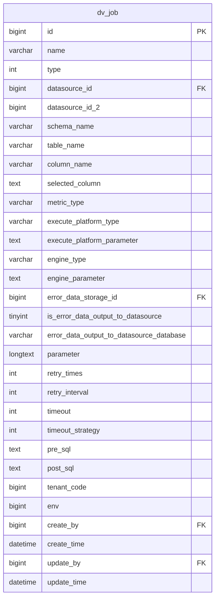
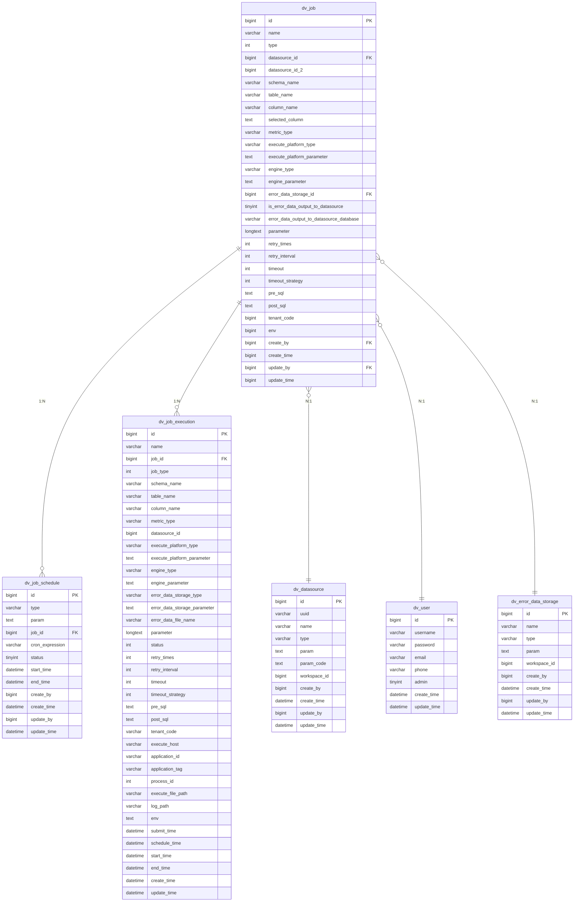

# 任务表 (job)

<cite>
**本文档引用的文件**
- [datavines-mysql.sql](file://scripts/sql/datavines-mysql.sql#L498-L534)
- [Job.java](file://datavines-server/src/main/java/io/datavines/server/repository/entity/Job.java)
- [JobType.java](file://datavines-common/src/main/java/io/datavines/common/enums/JobType.java)
- [TimeoutStrategy.java](file://datavines-common/src/main/java/io/datavines/common/enums/TimeoutStrategy.java)
- [dv_job_schedule](file://scripts/sql/datavines-mysql.sql#L658-L675)
- [dv_job_execution](file://scripts/sql/datavines-mysql.sql#L537-L580)
- [dv_datasource](file://scripts/sql/datavines-mysql.sql#L415-L432)
- [dv_user](file://scripts/sql/datavines-mysql.sql#L789-L800)
</cite>

## 目录
1. [任务表结构](#任务表结构)
2. [字段详细说明](#字段详细说明)
3. [业务含义解释](#业务含义解释)
4. [表设计考虑](#表设计考虑)
5. [与其他表的关系](#与其他表的关系)

## 任务表结构

任务表（job）是数据质量管理系统中的核心表之一，用于存储数据质量检查任务的配置信息。该表定义了数据质量检查的各种参数和配置。

**图表来源**
- [datavines-mysql.sql](file://scripts/sql/datavines-mysql.sql#L498-L534)

**章节来源**
- [datavines-mysql.sql](file://scripts/sql/datavines-mysql.sql#L498-L534)

## 字段详细说明

任务表包含以下字段，每个字段都有特定的数据类型和约束：

| 字段名 | 数据类型 | 是否可为空 | 默认值 | 说明 |
|--------|---------|-----------|--------|------|
| id | bigint(20) | 否 | 无 | 主键，自增 |
| name | varchar(255) | 是 | NULL | 作业名称 |
| type | int(11) | 否 | 0 | 作业类型 |
| datasource_id | bigint(20) | 否 | 无 | 数据源ID |
| datasource_id_2 | bigint(20) | 是 | NULL | 数据源2ID |
| schema_name | varchar(128) | 是 | NULL | 数据库名 |
| table_name | varchar(128) | 是 | NULL | 表名 |
| column_name | varchar(128) | 是 | NULL | 列名 |
| selected_column | text | 是 | NULL | DataProfile选中的列 |
| metric_type | varchar(255) | 是 | NULL | 规则类型 |
| execute_platform_type | varchar(128) | 是 | NULL | 运行平台类型 |
| execute_platform_parameter | text | 是 | NULL | 运行平台参数 |
| engine_type | varchar(128) | 是 | NULL | 运行引擎类型 |
| engine_parameter | text | 是 | NULL | 运行引擎参数 |
| error_data_storage_id | bigint(20) | 是 | NULL | 错误数据存储ID |
| is_error_data_output_to_datasource | tinyint(1) | 是 | 0 | 错误数据是否输出至数据源 |
| error_data_output_to_datasource_database | varchar(255) | 是 | NULL | 错误数据存储数据库 |
| parameter | longtext | 是 | NULL | 作业参数 |
| retry_times | int(11) | 是 | NULL | 重试次数 |
| retry_interval | int(11) | 是 | NULL | 重试间隔 |
| timeout | int(11) | 是 | NULL | 任务超时时间 |
| timeout_strategy | int(11) | 是 | NULL | 超时策略 |
| pre_sql | text | 是 | NULL | 前置脚本 |
| post_sql | text | 是 | NULL | 后置脚本 |
| tenant_code | bigint(20) | 是 | NULL | 代理用户 |
| env | bigint(20) | 是 | NULL | 环境配置 |
| create_by | bigint(20) | 否 | 无 | 创建用户ID |
| create_time | datetime | 否 | CURRENT_TIMESTAMP | 创建时间 |
| update_by | bigint(20) | 否 | 无 | 更新用户ID |
| update_time | datetime | 否 | CURRENT_TIMESTAMP ON UPDATE CURRENT_TIMESTAMP | 更新时间 |

**章节来源**
- [datavines-mysql.sql](file://scripts/sql/datavines-mysql.sql#L498-L534)

## 业务含义解释

### 核心字段业务含义

**id**: 任务的唯一标识符，作为主键使用，确保每个任务都有唯一的标识。

**name**: 任务的名称，用于标识和区分不同的数据质量检查任务。任务名称与数据源ID、数据库名、表名和列名组合形成唯一约束，确保在同一数据源和表上的相同检查任务不会重复创建。

**type**: 任务类型，使用`JobType`枚举类型表示。根据`JobType.java`文件中的定义，任务类型可能包括数据质量检查、元数据抓取等不同类型。

**datasource_id**: 数据源ID，关联到`dv_datasource`表，标识该任务所检查的数据源。这是实现多租户隔离的关键字段之一。

**metric_type**: 规则类型，表示任务的具体检查类型。根据业务需求，可能包括：
- 单表检查：对单个表的数据质量进行检查
- 跨表检查：对多个表之间的数据一致性进行检查
- 数据新鲜度检查：检查数据的更新时间是否符合预期
- 数据完整性检查：检查数据是否存在缺失或异常

**parameter**: 作业参数，以JSON格式存储任务的详细配置。这个字段包含了任务执行所需的所有配置信息，如检查规则的具体参数、阈值设置等。

**status**: 任务状态，虽然在表结构中没有直接名为status的字段，但任务的生命周期管理通过相关联的`dv_job_execution`表中的状态字段实现。任务可能的状态包括：待执行、执行中、成功、失败、已停止等。

### 配置相关字段

**execute_platform_type** 和 **execute_platform_parameter**: 运行平台类型和参数，指定任务在哪个平台执行（如YARN、Kubernetes等）以及相应的平台配置。

**engine_type** 和 **engine_parameter**: 运行引擎类型和参数，指定使用哪个计算引擎（如Spark、Flink等）以及引擎的配置参数。

**pre_sql** 和 **post_sql**: 前置脚本和后置脚本，分别在任务执行前和执行后运行的SQL脚本，用于数据准备和清理工作。

**retry_times** 和 **retry_interval**: 重试次数和重试间隔，定义了任务失败后的重试策略。

**timeout** 和 **timeout_strategy**: 超时时间和超时策略，用于防止任务无限期运行。超时策略可能包括终止任务、告警等。

**章节来源**
- [Job.java](file://datavines-server/src/main/java/io/datavines/server/repository/entity/Job.java)
- [JobType.java](file://datavines-common/src/main/java/io/datavines/common/enums/JobType.java)
- [TimeoutStrategy.java](file://datavines-common/src/main/java/io/datavines/common/enums/TimeoutStrategy.java)

## 表设计考虑

### 状态管理与生命周期

任务表通过与`dv_job_execution`表的关联来管理任务的生命周期。`dv_job_execution`表记录了每次任务执行的实例，包括执行状态、开始时间、结束时间等信息。这种设计将任务定义与任务执行分离，使得：

1. 可以保存任务的历史执行记录
2. 支持任务的重复执行和调度
3. 便于分析任务执行的趋势和性能

任务的状态管理主要通过`dv_job_execution`表中的`status`字段实现，而不是在`dv_job`表中直接存储状态。这种设计考虑了任务可能有多个执行实例，每个实例都有自己的状态。

### 多租户隔离设计

任务表通过`workspace_id`字段实现多租户隔离。虽然在`dv_job`表中没有直接的`workspace_id`字段，但通过`datasource_id`关联到`dv_datasource`表，而`dv_datasource`表包含`workspace_id`字段，从而实现了间接的多租户隔离。

这种设计的优势包括：
- 数据源级别的隔离：不同工作空间的用户只能访问自己工作空间内的数据源
- 任务级别的隔离：用户只能创建和管理自己工作空间内数据源相关的任务
- 权限控制：基于工作空间的权限体系，可以精细控制用户对任务的访问权限

### 性能与扩展性考虑

任务表的设计考虑了性能和扩展性：
- 使用bigint作为主键类型，支持大规模数据量
- 对经常查询的字段（如name, datasource_id, schema_name等）建立了复合唯一索引
- 将大文本字段（如parameter, execute_platform_parameter等）设置为可为空，避免不必要的存储开销
- 使用标准化的数据类型，便于跨数据库平台迁移

**章节来源**
- [datavines-mysql.sql](file://scripts/sql/datavines-mysql.sql#L498-L534)
- [dv_datasource](file://scripts/sql/datavines-mysql.sql#L415-L432)
- [dv_job_execution](file://scripts/sql/datavines-mysql.sql#L537-L580)

## 与其他表的关系

任务表与其他核心表存在以下关系：

**图表来源**
- [datavines-mysql.sql](file://scripts/sql/datavines-mysql.sql#L498-L534)
- [dv_job_schedule](file://scripts/sql/datavines-mysql.sql#L658-L675)
- [dv_job_execution](file://scripts/sql/datavines-mysql.sql#L537-L580)
- [dv_datasource](file://scripts/sql/datavines-mysql.sql#L415-L432)
- [dv_user](file://scripts/sql/datavines-mysql.sql#L789-L800)
- [dv_error_data_storage](file://scripts/sql/datavines-mysql.sql#L465-L481)

### 与`dv_job_schedule`表的关系

`dv_job`表与`dv_job_schedule`表是一对多的关系。一个任务可以有多个调度配置，但每个调度配置只属于一个任务。`dv_job_schedule`表中的`job_id`字段外键引用`dv_job`表的`id`字段。

这种设计支持：
- 任务的多种调度方式（如定时调度、事件触发调度等）
- 调度配置的灵活管理
- 调度历史的记录和分析

### 与`dv_job_execution`表的关系

`dv_job`表与`dv_job_execution`表是一对多的关系。一个任务定义可以产生多个执行实例，每个执行实例记录了任务在特定时间点的执行情况。`dv_job_execution`表中的`job_id`字段外键引用`dv_job`表的`id`字段。

这种设计实现了：
- 任务执行历史的完整记录
- 执行结果的追溯和分析
- 性能监控和优化

### 与`dv_datasource`表的关系

`dv_job`表与`dv_datasource`表是多对一的关系。多个任务可以关联到同一个数据源，但每个任务只能关联到一个主数据源。`dv_job`表中的`datasource_id`字段外键引用`dv_datasource`表的`id`字段。

这种设计确保了：
- 任务与数据源的明确关联
- 数据源配置的集中管理
- 多租户环境下的数据隔离

### 与`dv_user`表的关系

`dv_job`表与`dv_user`表是多对一的关系。多个任务可以由同一个用户创建，但每个任务只能由一个用户创建和更新。`dv_job`表中的`create_by`和`update_by`字段外键引用`dv_user`表的`id`字段。

这种设计支持：
- 用户权限管理
- 操作审计
- 责任追溯

**章节来源**
- [datavines-mysql.sql](file://scripts/sql/datavines-mysql.sql)
- [Job.java](file://datavines-server/src/main/java/io/datavines/server/repository/entity/Job.java)