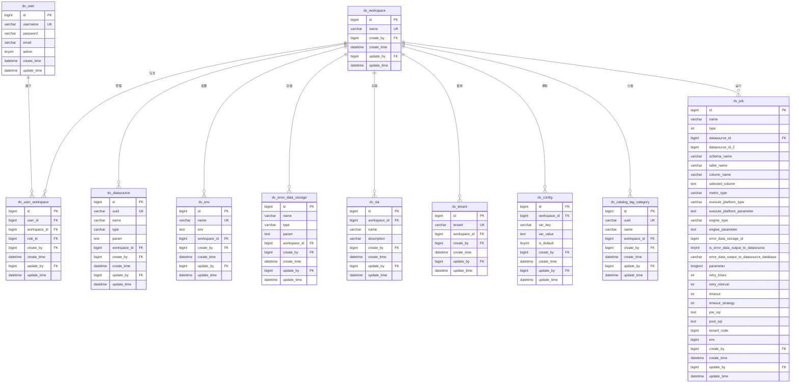

# 工作空间表 (workspace)

<cite>
**本文档引用的文件**   
- [datavines-mysql.sql](file://scripts/sql/datavines-mysql.sql#L822-L834)
- [WorkSpace.java](file://datavines-server/src/main/java/io/datavines/server/repository/entity/WorkSpace.java)
- [UserWorkSpace.java](file://datavines-server/src/main/java/io/datavines/server/repository/entity/UserWorkSpace.java)
- [WorkSpaceService.java](file://datavines-server/src/main/java/io/datavines/server/repository/service/WorkSpaceService.java)
- [WorkSpaceController.java](file://datavines-server/src/main/java/io/datavines/server/api/controller/WorkSpaceController.java)
</cite>

## 目录
1. [工作空间表结构](#工作空间表结构)
2. [字段详细说明](#字段详细说明)
3. [表设计考虑](#表设计考虑)
4. [关联关系](#关联关系)
5. [核心作用](#核心作用)

## 工作空间表结构

工作空间表（dv_workspace）是DataVines系统中的核心元数据表，用于组织和管理用户的工作环境。该表定义了工作空间的基本信息，作为多租户数据隔离和权限控制的基础单元。

```sql
CREATE TABLE `dv_workspace` (
  `id` bigint(20) NOT NULL AUTO_INCREMENT,
  `name` varchar(255) NOT NULL COMMENT '工作空间名称',
  `create_by` bigint(20) NOT NULL COMMENT '创建用户ID',
  `create_time` datetime NOT NULL DEFAULT CURRENT_TIMESTAMP COMMENT '创建时间',
  `update_by` bigint(20) NOT NULL COMMENT '更新用户ID',
  `update_time` datetime NOT NULL DEFAULT CURRENT_TIMESTAMP ON UPDATE CURRENT_TIMESTAMP COMMENT '更新时间',
  PRIMARY KEY (`id`),
  UNIQUE KEY `workspace_un` (`name`) USING BTREE
) ENGINE=InnoDB DEFAULT CHARSET=utf8mb4 COMMENT='工作空间';
```

**表来源**
- [datavines-mysql.sql](file://scripts/sql/datavines-mysql.sql#L822-L834)

## 字段详细说明

工作空间表包含以下字段，每个字段都有特定的业务含义和数据类型：

**id**
- **数据类型**: bigint(20)
- **约束**: 主键，自增
- **业务含义**: 工作空间的唯一标识符，系统自动生成的主键，用于唯一标识每个工作空间实例。

**name**
- **数据类型**: varchar(255)
- **约束**: NOT NULL，唯一索引 (workspace_un)
- **业务含义**: 工作空间的名称，用于标识和区分不同的工作空间。名称必须唯一，不能重复。

**create_by**
- **数据类型**: bigint(20)
- **约束**: NOT NULL
- **业务含义**: 创建该工作空间的用户ID，记录了工作空间的创建者，用于审计和权限追溯。

**create_time**
- **数据类型**: datetime
- **约束**: NOT NULL，默认值为CURRENT_TIMESTAMP
- **业务含义**: 工作空间的创建时间，系统自动记录工作空间创建的时间戳。

**update_by**
- **数据类型**: bigint(20)
- **约束**: NOT NULL
- **业务含义**: 最后更新该工作空间的用户ID，记录了最近一次修改工作空间信息的用户。

**update_time**
- **数据类型**: datetime
- **约束**: NOT NULL，默认值为CURRENT_TIMESTAMP，更新时自动更新为CURRENT_TIMESTAMP
- **业务含义**: 工作空间的最后更新时间，系统自动记录工作空间信息最后一次被修改的时间戳。

**Section sources**
- [datavines-mysql.sql](file://scripts/sql/datavines-mysql.sql#L822-L834)
- [WorkSpace.java](file://datavines-server/src/main/java/io/datavines/server/repository/entity/WorkSpace.java)

## 表设计考虑

工作空间表的设计考虑了多租户数据隔离、权限控制和系统可扩展性等关键因素：

1. **多租户数据隔离**：通过工作空间作为数据隔离的基本单元，不同工作空间之间的数据和配置相互隔离，确保了多租户环境下的数据安全和隐私保护。

2. **权限控制基础**：工作空间是权限控制的基本单元，用户必须先加入某个工作空间才能访问该空间内的资源。通过`dv_user_workspace`关联表实现用户与工作空间的多对多关系，支持灵活的权限管理。

3. **命名唯一性**：工作空间名称设置了唯一索引，确保系统中不存在同名的工作空间，避免了命名冲突。

4. **审计追踪**：通过`create_by`、`update_by`、`create_time`和`update_time`字段，完整记录了工作空间的生命周期信息，便于审计和问题追溯。

5. **扩展性**：表结构设计简洁，只包含核心字段，其他扩展属性可以通过关联表或配置表进行管理，保证了核心表的稳定性和性能。

**Section sources**
- [WorkSpace.java](file://datavines-server/src/main/java/io/datavines/server/repository/entity/WorkSpace.java)
- [WorkSpaceService.java](file://datavines-server/src/main/java/io/datavines/server/repository/service/WorkSpaceService.java)

## 关联关系

工作空间表与其他核心表存在多种关联关系，构成了系统的权限和资源管理框架：



**Diagram sources**
- [datavines-mysql.sql](file://scripts/sql/datavines-mysql.sql#L822-L834)
- [datavines-mysql.sql](file://scripts/sql/datavines-mysql.sql#L806-L819)
- [datavines-mysql.sql](file://scripts/sql/datavines-mysql.sql#L417-L432)
- [datavines-mysql.sql](file://scripts/sql/datavines-mysql.sql#L437-L449)
- [datavines-mysql.sql](file://scripts/sql/datavines-mysql.sql#L468-L481)
- [datavines-mysql.sql](file://scripts/sql/datavines-mysql.sql#L707-L718)
- [datavines-mysql.sql](file://scripts/sql/datavines-mysql.sql#L774-L786)
- [datavines-mysql.sql](file://scripts/sql/datavines-mysql.sql#L837-L851)
- [datavines-mysql.sql](file://scripts/sql/datavines-mysql.sql#L340-L352)
- [datavines-mysql.sql](file://scripts/sql/datavines-mysql.sql#L500-L534)

## 核心作用

工作空间表在DataVines系统中扮演着核心角色，主要体现在以下几个方面：

1. **资源组织单元**：工作空间是系统中资源组织的基本单元，所有数据源、作业、环境配置等资源都归属于特定的工作空间，实现了资源的逻辑分组和管理。

2. **团队协作基础**：通过工作空间，团队成员可以共享数据源、作业配置和质量规则，支持团队协作开发和维护数据质量任务。

3. **权限控制边界**：工作空间定义了权限控制的边界，用户必须先加入工作空间才能访问其中的资源，实现了基于工作空间的访问控制。

4. **多租户支持**：通过工作空间实现了多租户架构，不同组织或团队可以拥有独立的工作空间，确保数据和配置的隔离。

5. **配置管理**：工作空间关联了环境配置、租户配置和系统参数等，是配置管理的核心，支持不同工作空间有不同的运行环境和参数设置。

6. **审计和追踪**：通过记录创建者和更新者信息，工作空间支持完整的操作审计，便于追踪变更历史和责任归属。

7. **扩展性**：工作空间的设计支持系统的水平扩展，可以轻松添加新的工作空间来支持更多的团队或项目。

**Section sources**
- [WorkSpaceController.java](file://datavines-server/src/main/java/io/datavines/server/api/controller/WorkSpaceController.java)
- [WorkSpaceService.java](file://datavines-server/src/main/java/io/datavines/server/repository/service/WorkSpaceService.java)
- [UserWorkSpace.java](file://datavines-server/src/main/java/io/datavines/server/repository/entity/UserWorkSpace.java)