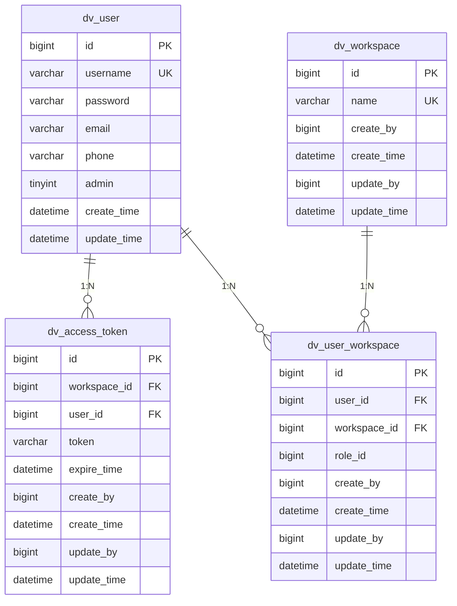

# 用户表 (user)

<cite>
**本文档引用的文件**   
- [datavines-mysql.sql](file://scripts/sql/datavines-mysql.sql)
- [User.java](file://datavines-server/src/main/java/io/datavines/server/repository/entity/User.java)
- [UserServiceImpl.java](file://datavines-server/src/main/java/io/datavines/server/repository/service/impl/UserServiceImpl.java)
- [CommonConstants.java](file://datavines-common/src/main/java/io/datavines/common/CommonConstants.java)
- [CryptionUtils.java](file://datavines-common/src/main/java/io/datavines/common/utils/CryptionUtils.java)
- [dv_access_token](file://scripts/sql/datavines-mysql.sql)
- [dv_workspace](file://scripts/sql/datavines-mysql.sql)
- [dv_user_workspace](file://scripts/sql/datavines-mysql.sql)
</cite>

## 目录
1. [用户表结构](#用户表结构)
2. [字段详细说明](#字段详细说明)
3. [表设计考虑](#表设计考虑)
4. [与其他表的关系](#与其他表的关系)
5. [在用户认证和权限管理中的作用](#在用户认证和权限管理中的作用)

## 用户表结构

用户表 `dv_user` 是系统中用于存储用户基本信息的核心表，其结构定义如下：

```sql
CREATE TABLE `dv_user` (
  `id` bigint(20) NOT NULL AUTO_INCREMENT,
  `username` varchar(255) NOT NULL COMMENT '用户名',
  `password` varchar(255) NOT NULL COMMENT '密码',
  `email` varchar(255) NOT NULL COMMENT '邮箱',
  `phone` varchar(127) DEFAULT NULL COMMENT '手机号码',
  `admin` tinyint(1) NOT NULL DEFAULT '0' COMMENT '是否为管理员',
  `create_time` datetime NOT NULL DEFAULT CURRENT_TIMESTAMP COMMENT '创建时间',
  `update_time` datetime NOT NULL DEFAULT CURRENT_TIMESTAMP ON UPDATE CURRENT_TIMESTAMP COMMENT '更新时间',
  PRIMARY KEY (`id`),
  UNIQUE KEY `user_un` (`username`) USING BTREE
) ENGINE=InnoDB DEFAULT CHARSET=utf8mb4 COMMENT='用户';
```

**表名**: `dv_user`  
**存储引擎**: InnoDB  
**字符集**: utf8mb4  
**注释**: 用户

**表结构来源**
- [datavines-mysql.sql](file://scripts/sql/datavines-mysql.sql#L788-L803)

## 字段详细说明

用户表包含以下字段，每个字段都有特定的数据类型和业务含义：

### id
- **数据类型**: `bigint(20)`
- **约束**: `NOT NULL AUTO_INCREMENT`, `PRIMARY KEY`
- **说明**: 用户的唯一标识符，作为主键使用，自增。

### username
- **数据类型**: `varchar(255)`
- **约束**: `NOT NULL`, `UNIQUE KEY user_un`
- **说明**: 用户名，用于用户登录和系统内唯一标识用户。在系统中必须唯一，通过唯一约束保证。

### password
- **数据类型**: `varchar(255)`
- **约束**: `NOT NULL`
- **说明**: 存储加密后的密码。系统使用 BCrypt 算法对用户密码进行哈希处理，确保即使数据库泄露，原始密码也无法被轻易还原。密码长度要求在6-20个字符之间。

### email
- **数据类型**: `varchar(255)`
- **约束**: `NOT NULL`
- **说明**: 用户的邮箱地址，用于账户验证、密码重置和系统通知。系统通过正则表达式 `^[a-z_0-9.-]{1,64}@([a-z0-9-]{1,200}.){1,5}[a-z]{1,6}$` 验证邮箱格式的有效性。

### phone
- **数据类型**: `varchar(127)`
- **约束**: `DEFAULT NULL`
- **说明**: 用户的手机号码，可选字段，用于多因素认证或紧急联系。

### admin
- **数据类型**: `tinyint(1)`
- **约束**: `NOT NULL DEFAULT '0'`
- **说明**: 标识用户是否为管理员。`0` 表示普通用户，`1` 表示管理员。管理员拥有系统最高权限，可以管理其他用户和系统配置。

### create_time
- **数据类型**: `datetime`
- **约束**: `NOT NULL DEFAULT CURRENT_TIMESTAMP`
- **说明**: 用户账户的创建时间，由数据库自动填充当前时间戳。

### update_time
- **数据类型**: `datetime`
- **约束**: `NOT NULL DEFAULT CURRENT_TIMESTAMP ON UPDATE CURRENT_TIMESTAMP`
- **说明**: 用户信息最后更新时间，每次用户信息被修改时，数据库会自动更新此字段为当前时间戳。

**字段说明来源**
- [User.java](file://datavines-server/src/main/java/io/datavines/server/repository/entity/User.java#L30-L61)
- [UserServiceImpl.java](file://datavines-server/src/main/java/io/datavines/server/repository/service/impl/UserServiceImpl.java#L52-L160)
- [CommonConstants.java](file://datavines-common/src/main/java/io/datavines/common/CommonConstants.java#L171)

## 表设计考虑

用户表的设计充分考虑了安全性、唯一性和数据完整性：

1. **唯一性约束**: 通过 `UNIQUE KEY user_un (username)` 确保用户名的唯一性，防止重复注册。这是用户登录和身份识别的基础。

2. **密码安全**: 密码字段使用 BCrypt 哈希算法进行加密存储。BCrypt 是一种自适应的哈希函数，包含盐值（salt）机制，能有效抵御彩虹表攻击。在 `UserServiceImpl.java` 中，注册和修改密码时都调用了 `BCrypt.hashpw()` 方法进行加密。

3. **数据完整性**: 所有关键字段如 `username`、`password`、`email` 都设置为 `NOT NULL`，确保用户信息的完整性。`admin` 字段有默认值 `0`，确保新用户默认为普通用户。

4. **时间戳管理**: `create_time` 和 `update_time` 字段由数据库自动管理，减少了应用层的复杂性，并确保了时间记录的准确性。

5. **索引优化**: 主键 `id` 自动创建索引，`username` 字段的唯一索引也提供了快速的查找性能，这对于用户登录验证等高频操作至关重要。

**设计考虑来源**
- [datavines-mysql.sql](file://scripts/sql/datavines-mysql.sql#L788-L803)
- [UserServiceImpl.java](file://datavines-server/src/main/java/io/datavines/server/repository/service/impl/UserServiceImpl.java#L87-L88)
- [CryptionUtils.java](file://datavines-common/src/main/java/io/datavines/common/utils/CryptionUtils.java#L25-L84)

## 与其他表的关系

用户表 `dv_user` 与其他多个表存在关联关系，构成了系统的权限和数据管理基础：

### 与 `dv_access_token` 表的关系
- **关系类型**: 一对多
- **外键**: `dv_access_token.user_id` 引用 `dv_user.id`
- **说明**: 每个用户可以拥有多个访问令牌（access token），用于API调用的身份验证。当用户登录成功后，系统会生成一个token并存储在此表中，关联到对应的用户。

### 与 `dv_workspace` 表的关系
- **关系类型**: 多对多
- **中间表**: `dv_user_workspace`
- **说明**: 用户和工作空间是多对多关系。一个用户可以属于多个工作空间，一个工作空间也可以有多个用户。这种关系通过中间表 `dv_user_workspace` 实现，该表包含 `user_id` 和 `workspace_id` 两个外键。

### 与 `dv_user_workspace` 表的关系
- **关系类型**: 一对多
- **外键**: `dv_user_workspace.user_id` 引用 `dv_user.id`
- **说明**: 该表记录了用户与工作空间的关联关系，同时还包含 `role_id` 字段，用于定义用户在特定工作空间中的角色和权限。



**关系图来源**
- [datavines-mysql.sql](file://scripts/sql/datavines-mysql.sql#L451-L463)
- [datavines-mysql.sql](file://scripts/sql/datavines-mysql.sql#L806-L819)
- [datavines-mysql.sql](file://scripts/sql/datavines-mysql.sql#L822-L834)

## 在用户认证和权限管理中的作用

用户表 `dv_user` 是整个系统用户认证和权限管理的基石，其作用体现在以下几个方面：

1. **用户认证 (Authentication)**:
   - **登录验证**: 当用户尝试登录时，系统通过 `getByUsername` 方法根据用户名查询用户信息，然后使用 `BCrypt.checkpw()` 方法验证提供的密码与数据库中存储的哈希密码是否匹配。
   - **密码策略**: 系统强制要求密码长度在6-20个字符之间，通过 `CommonConstants.REG_USER_PASSWORD` 正则表达式进行验证，增强了账户安全性。

2. **权限管理 (Authorization)**:
   - **管理员权限**: `admin` 字段是区分普通用户和管理员的关键。管理员可以执行系统级操作，如用户管理、系统配置等。
   - **工作空间权限**: 通过 `dv_user_workspace` 表，系统实现了基于工作空间的权限隔离。用户的权限不仅取决于其自身属性，还取决于其在特定工作空间中的角色（`role_id`）。

3. **用户生命周期管理**:
   - **注册**: 新用户注册时，系统会检查用户名是否已存在，若不存在则创建新用户记录，并为其创建一个默认工作空间。
   - **密码重置**: 用户可以修改密码，系统会使用新的盐值重新哈希密码，确保旧密码的哈希值失效。
   - **信息更新**: 用户可以更新个人信息，`update_time` 字段会自动记录最后修改时间。

4. **审计与追踪**:
   - 所有与用户相关的操作（创建、更新）都有时间戳记录，便于审计和问题排查。
   - `create_by` 和 `update_by` 字段在相关表中记录了操作者的ID，实现了操作溯源。

综上所述，`dv_user` 表不仅是存储用户基本信息的地方，更是整个系统安全架构的核心组件，支撑着从用户登录到权限控制的完整流程。

**权限管理来源**
- [UserServiceImpl.java](file://datavines-server/src/main/java/io/datavines/server/repository/service/impl/UserServiceImpl.java#L58-L77)
- [UserServiceImpl.java](file://datavines-server/src/main/java/io/datavines/server/repository/service/impl/UserServiceImpl.java#L80-L118)
- [UserServiceImpl.java](file://datavines-server/src/main/java/io/datavines/server/repository/service/impl/UserServiceImpl.java#L133-L149)