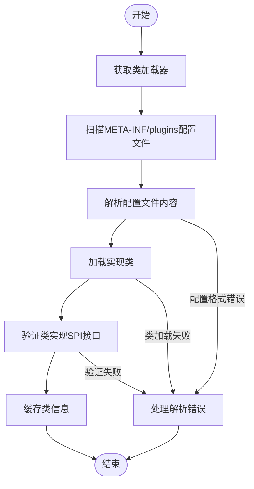
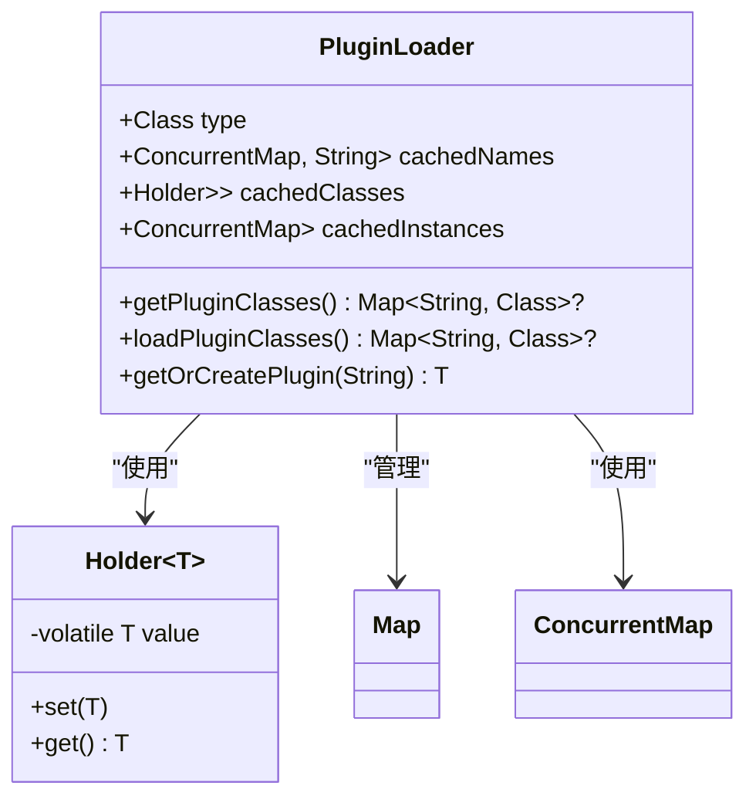
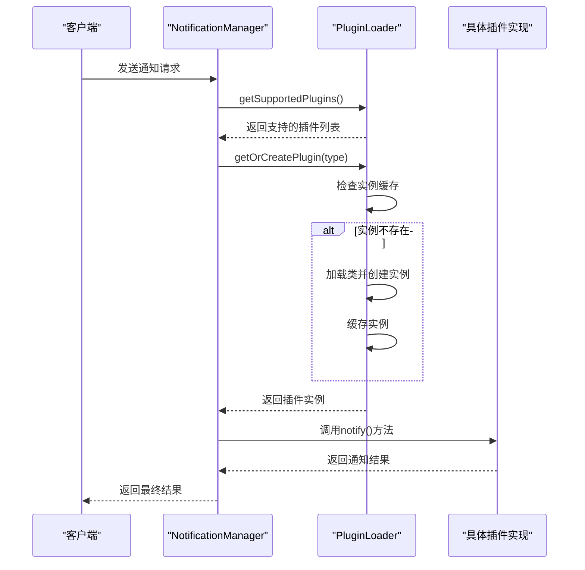
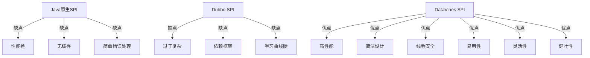

# SPI原理

<cite>
**本文档引用的文件**  
- [SPI.java](file://datavines-spi/src/main/java/io/datavines/spi/SPI.java)
- [PluginLoader.java](file://datavines-spi/src/main/java/io/datavines/spi/PluginLoader.java)
- [Prioritized.java](file://datavines-spi/src/main/java/io/datavines/spi/Prioritized.java)
- [ClassUtils.java](file://datavines-spi/src/main/java/io/datavines/spi/utils/ClassUtils.java)
- [Holder.java](file://datavines-spi/src/main/java/io/datavines/spi/utils/Holder.java)
- [ConnectorFactory.java](file://datavines-connector/connector-api/src/main/java/io/datavines/connector/api/ConnectorFactory.java)
- [SqlMetric.java](file://datavines-metric/metric-api/src/main/java/io/datavines/metric/api/SqlMetric.java)
- [SlasHandlerPlugin.java](file://datavines-notification/notification-api/src/main/java/io/datavines/notification/api/spi/SlasHandlerPlugin.java)
- [NotificationManager.java](file://datavines-notification/notification-core/src/main/java/io/datavines/notification/core/NotificationManager.java)
- [JdbcConnector.java](file://datavines-connector/connector-plugins/connector-jdbc/src/main/java/io/datavines/connector/plugin/JdbcConnector.java)
- [EmailSlasHandlerPlugin.java](file://datavines-notification/notification-plugins/notification-plugin-email/src/main/java/io/datavines/notification/plugin/email/EmailSlasHandlerPlugin.java)
- [AbstractJdbcConnectorFactory.java](file://datavines-connector/connector-plugins/connector-jdbc/src/main/java/io/datavines/connector/plugin/AbstractJdbcConnectorFactory.java)
</cite>

## 目录
1. [SPI机制概述](#spi机制概述)
2. [@SPI注解设计与使用](#spi注解设计与使用)
3. [服务发现与加载机制](#服务发现与加载机制)
4. [接口与实现映射管理](#接口与实现映射管理)
5. [运行时动态扩展实现](#运行时动态扩展实现)
6. [与其他SPI框架对比](#与其他spi框架对比)

## SPI机制概述

DataVines的SPI（Service Provider Interface）机制是一种服务发现和插件化架构，旨在实现核心功能与插件模块的解耦。该机制允许系统在运行时动态发现和加载插件，从而支持灵活的功能扩展。SPI机制的核心设计目标是提供一种标准化的插件管理方式，使得开发者可以轻松地添加新的数据源连接器、质量度量指标、通知渠道等扩展功能，而无需修改核心代码。

该机制通过`@SPI`注解标识可扩展的接口，并利用`PluginLoader`类实现服务发现和实例化。整个SPI体系基于Java的类加载机制和反射技术，通过扫描特定目录下的配置文件来发现可用的插件实现。这种设计不仅提高了系统的可扩展性，还增强了模块间的松耦合性，使得各个功能模块可以独立开发和部署。

**本节来源**  
- [SPI.java](file://datavines-spi/src/main/java/io/datavines/spi/SPI.java#L1-L32)
- [PluginLoader.java](file://datavines-spi/src/main/java/io/datavines/spi/PluginLoader.java#L1-L51)

## @SPI注解设计与使用

`@SPI`注解是DataVines SPI机制的核心标识，用于标记可扩展的接口。该注解定义在`io.datavines.spi.SPI`类中，具有以下特性：

```java
@Documented
@Retention(RetentionPolicy.RUNTIME)
@Target({ElementType.TYPE})
public @interface SPI {
    String value() default "";
}
```

`@SPI`注解使用`RUNTIME`保留策略，确保在运行时可以通过反射访问。它只能应用于类型（类、接口或枚举），用于标识一个接口是可扩展的服务接口。注解的`value()`方法提供了一个可选的字符串参数，可用于指定默认实现的名称。

在实际使用中，任何希望作为SPI接口的接口都必须使用`@SPI`注解进行标记。例如，`ConnectorFactory`接口用于创建数据源连接器，被标记为SPI接口：

```java
@SPI
public interface ConnectorFactory {
    // 接口方法定义
}
```

同样，`SqlMetric`接口用于定义数据质量度量指标，也使用`@SPI`注解：

```java
@SPI
public interface SqlMetric {
    // 接口方法定义
}
```

通过这种方式，系统可以识别哪些接口是可扩展的，并在运行时查找其实现类。`@SPI`注解的设计遵循了Java原生SPI的思想，但提供了更丰富的功能和更好的性能。

**本节来源**  
- [SPI.java](file://datavines-spi/src/main/java/io/datavines/spi/SPI.java#L1-L32)
- [ConnectorFactory.java](file://datavines-connector/connector-api/src/main/java/io/datavines/connector/api/ConnectorFactory.java#L1-L51)
- [SqlMetric.java](file://datavines-metric/metric-api/src/main/java/io/datavines/metric/api/SqlMetric.java#L1-L42)

## 服务发现与加载机制

DataVines的SPI机制通过`PluginLoader`类实现服务发现和加载。该类负责扫描`META-INF/plugins`目录下的配置文件，解析并加载可用的插件实现。服务发现的工作流程如下：

1. **类加载器获取**：`PluginLoader`首先通过`findClassLoader()`方法获取合适的类加载器，优先使用线程上下文类加载器，如果不可用则回退到系统类加载器。

2. **配置文件扫描**：系统扫描`META-INF/plugins`目录下以SPI接口全限定名为文件名的配置文件。例如，对于`SlasHandlerPlugin`接口，会查找`META-INF/plugins/io.datavines.notification.api.spi.SlasHandlerPlugin`文件。

3. **配置文件解析**：每个配置文件包含插件名称与实现类全限定名的映射，格式为`name=fully.qualified.class.name`。`PluginLoader`读取这些配置并解析出可用的插件实现。

4. **类加载与验证**：加载配置文件中指定的实现类，并验证其实现了对应的SPI接口。如果验证失败，将抛出`IllegalStateException`异常。

5. **缓存管理**：为了提高性能，`PluginLoader`使用多个并发映射（ConcurrentMap）来缓存已加载的类、实例和配置信息，避免重复加载和解析。



**图示来源**  
- [PluginLoader.java](file://datavines-spi/src/main/java/io/datavines/spi/PluginLoader.java#L347-L364)
- [PluginLoader.java](file://datavines-spi/src/main/java/io/datavines/spi/PluginLoader.java#L371-L402)

**本节来源**  
- [PluginLoader.java](file://datavines-spi/src/main/java/io/datavines/spi/PluginLoader.java#L51-L487)
- [ClassUtils.java](file://datavines-spi/src/main/java/io/datavines/spi/utils/ClassUtils.java#L1-L51)

## 接口与实现映射管理

DataVines的SPI机制通过`PluginLoader`类管理接口与实现类的映射关系。这种映射管理是SPI机制的核心功能之一，确保了系统能够正确地将接口调用路由到相应的实现类。

映射关系的管理主要通过以下数据结构实现：

1. **cachedClasses**：`ConcurrentMap<String, Class<?>>`类型的缓存，存储插件名称到实现类的映射。这个缓存是线程安全的，允许多个线程同时访问。

2. **cachedNames**：`ConcurrentMap<Class<?>, String>`类型的缓存，存储实现类到插件名称的映射。这实现了双向映射，便于在运行时查询。

3. **cachedInstances**：`ConcurrentMap<String, Holder<Object>>`类型的缓存，存储插件名称到实例的映射。`Holder`类用于确保实例的延迟加载和线程安全。

默认实现的选择策略基于以下规则：

1. **配置文件优先**：如果在配置文件中指定了插件名称，则使用该名称作为默认实现。

2. **类名推断**：如果配置文件中没有指定名称，系统会根据实现类的类名推断默认名称。通常，系统会移除接口名称后缀并转换为小写。

3. **优先级排序**：当需要获取所有支持的插件实例时，系统会根据`Prioritized`接口的优先级进行排序。优先级高的插件会排在前面。



**图示来源**  
- [PluginLoader.java](file://datavines-spi/src/main/java/io/datavines/spi/PluginLoader.java#L63-L70)
- [Holder.java](file://datavines-spi/src/main/java/io/datavines/spi/utils/Holder.java#L1-L34)

**本节来源**  
- [PluginLoader.java](file://datavines-spi/src/main/java/io/datavines/spi/PluginLoader.java#L63-L450)
- [Holder.java](file://datavines-spi/src/main/java/io/datavines/spi/utils/Holder.java#L1-L34)

## 运行时动态扩展实现

DataVines的SPI机制支持运行时动态扩展，这是其核心优势之一。通过`PluginLoader`提供的API，系统可以在运行时动态加载、创建和管理插件实例，实现了核心功能与插件模块的完全解耦。

运行时动态扩展的主要实现方式包括：

1. **延迟实例化**：插件实例采用延迟加载策略，只有在首次请求时才会创建。这通过`Holder`类实现，确保了线程安全和性能优化。

2. **单例模式**：`getOrCreatePlugin()`方法确保每个插件名称对应一个单例实例，避免了重复创建和资源浪费。

3. **动态加载**：`getNewPlugin()`方法允许创建新的插件实例，适用于需要多个实例的场景。

4. **插件替换**：`addOrReplacePlugin()`方法允许在运行时添加或替换插件实现，主要用于测试场景。

在实际应用中，`NotificationManager`类展示了SPI机制的典型使用模式：

```java
public class NotificationManager {
    private final Set<String> supportedPlugins;
    
    public NotificationManager(){
        supportedPlugins = PluginLoader
                .getPluginLoader(SlasHandlerPlugin.class)
                .getSupportedPlugins();
    }
    
    public SlaNotificationResult notify(SlaNotificationMessage message, Map<SlaSenderMessage, Set<SlaConfigMessage>> config){
        for (Map.Entry<SlaSenderMessage, Set<SlaConfigMessage>> entry: config.entrySet()) {
            String type = entry.getKey().getType();
            if (!supportedPlugins.contains(type)) {
                throw new DataVinesException("sender type not support of "+ type);
            }
            SlasHandlerPlugin handlerPlugin = PluginLoader
                    .getPluginLoader(SlasHandlerPlugin.class)
                    .getOrCreatePlugin(type);
            // 使用插件实例
        }
    }
}
```

这种设计使得通知系统可以支持多种通知渠道（如邮件、钉钉、企业微信等），而无需在核心代码中硬编码这些渠道的实现。



**图示来源**  
- [PluginLoader.java](file://datavines-spi/src/main/java/io/datavines/spi/PluginLoader.java#L135-L188)
- [NotificationManager.java](file://datavines-notification/notification-core/src/main/java/io/datavines/notification/core/NotificationManager.java#L39-L71)

**本节来源**  
- [PluginLoader.java](file://datavines-spi/src/main/java/io/datavines/spi/PluginLoader.java#L135-L230)
- [NotificationManager.java](file://datavines-notification/notification-core/src/main/java/io/datavines/notification/core/NotificationManager.java#L1-L71)

## 与其他SPI框架对比

DataVines的SPI机制与Java原生SPI和Dubbo SPI相比，具有以下特点和优势：

### 与Java原生SPI对比

| 特性 | Java原生SPI | DataVines SPI |
|------|------------|---------------|
| **性能** | 每次调用`ServiceLoader.load()`都会重新扫描和加载，性能较差 | 使用缓存机制，避免重复扫描和加载，性能更优 |
| **实例化** | 每次调用`iterator()`都会创建新实例 | 支持单例模式，通过`getOrCreatePlugin()`实现延迟单例 |
| **扩展性** | 仅支持通过`META-INF/services`发现实现 | 支持自定义插件目录`META-INF/plugins`，更灵活 |
| **错误处理** | 异常处理简单，不利于调试 | 提供详细的异常信息和可能原因，便于问题排查 |

### 与Dubbo SPI对比

| 特性 | Dubbo SPI | DataVines SPI |
|------|---------|---------------|
| **复杂性** | 功能丰富但复杂，包含AOP、IOC等高级特性 | 设计简洁，专注于核心的插件发现和加载功能 |
| **依赖** | 依赖Dubbo框架的其他组件 | 独立实现，不依赖外部框架 |
| **配置格式** | 支持复杂的配置语法 | 使用简单的`name=class`格式，易于理解和维护 |
| **学习曲线** | 较陡峭，需要理解Dubbo的SPI设计理念 | 平缓，易于理解和使用 |

### DataVines SPI设计优势

1. **简洁性**：相比Dubbo SPI，DataVines SPI去除了AOP、IOC等复杂特性，专注于提供稳定可靠的插件发现和加载功能。

2. **性能优化**：通过多级缓存机制（类缓存、实例缓存）显著提高了运行时性能，避免了重复的类加载和实例化开销。

3. **线程安全**：使用`ConcurrentMap`和`volatile`等机制确保了多线程环境下的安全性。

4. **易用性**：API设计简洁明了，`getPluginLoader()`、`getOrCreatePlugin()`等方法易于理解和使用。

5. **灵活性**：支持运行时动态添加和替换插件，虽然`addOrReplacePlugin()`方法标记为`@deprecated`，但仍为测试和特殊场景提供了可能性。

6. **健壮性**：提供了详细的错误处理和异常信息，帮助开发者快速定位和解决问题。



**图示来源**  
- [PluginLoader.java](file://datavines-spi/src/main/java/io/datavines/spi/PluginLoader.java#L59-L62)
- [PluginLoader.java](file://datavines-spi/src/main/java/io/datavines/spi/PluginLoader.java#L135-L188)

**本节来源**  
- [PluginLoader.java](file://datavines-spi/src/main/java/io/datavines/spi/PluginLoader.java#L1-L487)
- [SPI.java](file://datavines-spi/src/main/java/io/datavines/spi/SPI.java#L1-L32)
- [Prioritized.java](file://datavines-spi/src/main/java/io/datavines/spi/Prioritized.java#L1-L71)