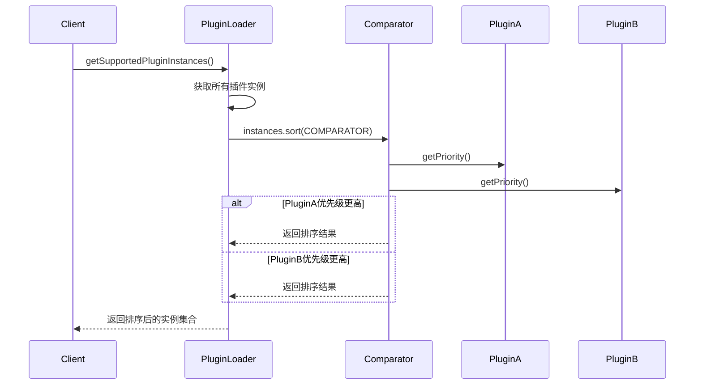

# 插件加载机制

<cite>
**本文档中引用的文件**  
- [PluginLoader.java](file://datavines-spi/src/main/java/io/datavines/spi/PluginLoader.java)
- [Prioritized.java](file://datavines-spi/src/main/java/io/datavines/spi/Prioritized.java)
- [SPI.java](file://datavines-spi/src/main/java/io/datavines/spi/SPI.java)
- [ClassUtils.java](file://datavines-spi/src/main/java/io/datavines/spi/utils/ClassUtils.java)
- [MysqlConnectorFactory.java](file://datavines-connector/ datavines-connector-plugins/ datavines-connector-mysql/src/main/java/io/datavines/connector/plugin/MysqlConnectorFactory.java)
- [ColumnAvg.java](file://datavines-metric/ datavines-metric-plugins/ datavines-metric-column-avg/src/main/java/io/datavines/metric/plugin/ColumnAvg.java)
- [ConnectorFactory.java](file://datavines-connector/ datavines-connector-api/src/main/java/io/datavines/connector/api/ConnectorFactory.java)
- [SqlMetric.java](file://datavines-metric/ datavines-metric-api/src/main/java/io/datavines/metric/api/SqlMetric.java)
</cite>

## 目录
1. [引言](#引言)
2. [插件加载器架构](#插件加载器架构)
3. [类加载过程](#类加载过程)
4. [实例化与反射机制](#实例化与反射机制)
5. [插件缓存机制](#插件缓存机制)
6. [类加载器隔离策略](#类加载器隔离策略)
7. [插件优先级实现](#插件优先级实现)
8. [异常处理与错误恢复](#异常处理与错误恢复)
9. [总结](#总结)

## 引言
DataVines插件加载器（PluginLoader）是系统扩展机制的核心组件，它基于SPI（Service Provider Interface）设计模式实现插件的动态加载与管理。该机制允许系统在运行时发现、加载和实例化插件实现，从而支持功能的灵活扩展。本文将深入剖析PluginLoader的内部工作机制，涵盖类加载、实例化、缓存、隔离、优先级排序及异常处理等关键方面。

## 插件加载器架构

```mermaid
classDiagram
class PluginLoader~T~ {
+static getPluginLoader(Class<T> type) PluginLoader~T~
+getOrCreatePlugin(String name) T
+getLoadedPlugin(String name) T
+getSupportedPlugins() Set~String~
+getSupportedPluginInstances() Set~T~
-loadPluginClasses() Map~String, Class~?
-loadResource(Map~String, Class~?, ClassLoader, URL)
-loadClass(Map~String, Class~?, URL, Class~?, String)
-createPlugin(String name) T
}
class SPI {
+String value()
}
class Prioritized {
+static final Comparator~Object~ COMPARATOR
+int MAX_PRIORITY
+int MIN_PRIORITY
+int NORMAL_PRIORITY
+int getPriority()
+int compareTo(Prioritized that)
}
class PluginLoader <|-- SPI : "注解"
class PluginLoader <|-- Prioritized : "实现"
PluginLoader --> ClassUtils : "使用"
PluginLoader --> Holder : "使用"
PluginLoader --> UnsafeStringWriter : "使用"
```

**图示来源**  
- [PluginLoader.java](file://datavines-spi/src/main/java/io/datavines/spi/PluginLoader.java)
- [SPI.java](file://datavines-spi/src/main/java/io/datavines/spi/SPI.java)
- [Prioritized.java](file://datavines-spi/src/main/java/io/datavines/spi/Prioritized.java)
- [ClassUtils.java](file://datavines-spi/src/main/java/io/datavines/spi/utils/ClassUtils.java)

## 类加载过程

DataVines插件加载器的类加载过程遵循标准的SPI机制，但进行了增强和优化。整个过程始于`getPluginLoader`方法，该方法通过双重检查锁定模式确保每个插件接口类型仅对应一个PluginLoader实例，实现了线程安全的单例管理。

类加载的核心在于从classpath中定位并解析插件描述文件。PluginLoader定义了固定的插件目录`META-INF/plugins/`，并根据插件接口的全限定名（如`io.datavines.connector.api.ConnectorFactory`）构造文件路径。通过`findClassLoader`方法获取合适的类加载器（优先使用线程上下文类加载器），然后调用`getResources`方法查找所有匹配的资源文件。

对于每一个找到的资源文件（URL），系统会创建`BufferedReader`进行逐行读取。在解析过程中，会忽略以`#`开头的注释行和空行。每一行有效的配置采用`name=implementation-class`的格式。例如，在`datavines-connector-mysql`模块中，`META-INF/plugins/io.datavines.connector.api.ConnectorFactory`文件包含`mysql=io.datavines.connector.plugin.MysqlConnectorFactory`这样的配置。

解析出实现类的全限定名后，通过`Class.forName`方法在指定的类加载器上下文中加载该类。加载后的类会经过严格的验证：必须是具体类（非接口、非抽象类），并且必须实现PluginLoader所管理的接口类型。验证通过后，类与名称的映射关系会被缓存到`cachedClasses`中，为后续的实例化做准备。

**本节来源**  
- [PluginLoader.java](file://datavines-spi/src/main/java/io/datavines/spi/PluginLoader.java#L322-L398)
- [ClassUtils.java](file://datavines-spi/src/main/java/io/datavines/spi/utils/ClassUtils.java#L27-L47)

## 实例化与反射机制

插件的实例化过程是延迟的，即只有在首次请求某个插件实例时才会进行创建，这有助于提升系统启动性能。实例化主要通过`getOrCreatePlugin`方法实现，该方法结合了双重检查锁定和`Holder`模式来保证线程安全。

当调用`getOrCreatePlugin("mysql")`时，系统首先检查`cachedInstances`缓存中是否存在名为"mysql"的实例持有者（Holder）。如果不存在，则创建一个新的`Holder<Object>`并放入缓存。随后，通过`holder.get()`尝试获取实例。如果实例为`null`，则进入同步块（使用`pluginLock`锁），再次检查实例是否存在（防止并发创建），然后调用`createPlugin`方法。

`createPlugin`方法是反射调用的核心。它首先从`getPluginClasses()`获取已加载的类映射，找到与名称"mysql"对应的`Class<?>`对象（即`MysqlConnectorFactory.class`）。接着，通过`clazz.newInstance()`（或更现代的`clazz.getDeclaredConstructor().newInstance()`）使用反射创建该类的新实例。为了优化性能，新创建的实例会被放入一个全局的`PLUGIN_INSTANCES`缓存中，确保同一个实现类在JVM中只存在一个实例（单例模式）。最后，实例被设置到`Holder`中并返回。

值得注意的是，`getNewPlugin`方法提供了另一种实例化方式，它每次都会创建一个新的实例，不使用全局缓存，适用于需要多实例的场景。

**本节来源**  
- [PluginLoader.java](file://datavines-spi/src/main/java/io/datavines/spi/PluginLoader.java#L171-L203)
- [PluginLoader.java](file://datavines-spi/src/main/java/io/datavines/spi/PluginLoader.java#L290-L305)

## 插件缓存机制

DataVines插件加载器设计了多层次的缓存机制，以显著提高多次获取同一插件实例的性能。

第一层是**类映射缓存**（`cachedClasses`），这是一个`Holder<Map<String, Class<?>>>`类型的缓存。它存储了插件名称到其实现类的映射。`Holder`包装器允许在并发环境下安全地初始化和设置缓存。这个缓存只在首次调用`getPluginClasses()`时加载一次，之后所有对插件类的查询都直接从内存中获取，避免了重复的文件I/O和类加载操作。

第二层是**实例缓存**（`cachedInstances`），这是一个`ConcurrentMap<String, Holder<Object>>`。它为每个插件名称维护一个`Holder`，而`Holder`内部持有实际的插件实例。这种设计巧妙地将实例的创建（可能耗时）与获取分离。`getOrCreatePlugin`方法的调用者看到的是一个快速的`holder.get()`操作，而真正的实例化过程在同步块内完成，且只执行一次。

第三层是**全局实例缓存**（`PLUGIN_INSTANCES`），这是一个静态的`ConcurrentMap<Class<?>, Object>`。它确保了同一个插件实现类（如`MysqlConnectorFactory`）在整个JVM中只存在一个实例，实现了单例模式，减少了内存占用。

此外，还有一个**名称缓存**（`cachedNames`），用于存储类到其默认名称的映射，加速`getPluginName`方法的调用。

```mermaid
flowchart TD
A[getOrCreatePlugin("mysql")] --> B{cachedInstances<br>有Holder吗?}
B --> |否| C[创建新Holder<br>放入cachedInstances]
B --> |是| D[获取现有Holder]
C --> D
D --> E{Holder有实例吗?}
E --> |否| F[获取pluginLock锁]
F --> G{Holder有实例吗?}
G --> |否| H[createPlugin]
G --> |是| I[返回实例]
H --> J[clazz.newInstance()]
J --> K[放入PLUGIN_INSTANCES]
K --> L[设置到Holder]
L --> I
E --> |是| I
I --> M[返回实例]
style F fill:#f9f,stroke:#333
style H fill:#f9f,stroke:#333
```

**图示来源**  
- [PluginLoader.java](file://datavines-spi/src/main/java/io/datavines/spi/PluginLoader.java#L69-L71)
- [PluginLoader.java](file://datavines-spi/src/main/java/io/datavines/spi/PluginLoader.java#L61-L62)
- [PluginLoader.java](file://datavines-spi/src/main/java/io/datavines/spi/PluginLoader.java#L65-L66)

**本节来源**  
- [PluginLoader.java](file://datavines-spi/src/main/java/io/datavines/spi/PluginLoader.java#L61-L71)

## 类加载器隔离策略

DataVines通过精心设计的类加载器策略来确保不同插件之间的类路径不会相互干扰。其核心在于`findClassLoader`方法。

该方法首先尝试获取当前线程的上下文类加载器（`Thread.currentThread().getContextClassLoader()`）。这是Java EE和框架中常用的做法，可以确保插件加载发生在正确的应用上下文中。如果获取失败（例如在简单的Java SE环境中），则退而使用`PluginLoader`类本身的类加载器（`clazz.getClassLoader()`）。

这种策略的关键优势在于，它允许插件的加载上下文与定义插件接口的`datavines-spi`模块分离。例如，当一个Web应用（拥有自己的WebAppClassLoader）使用DataVines时，插件将通过Web应用的类加载器来加载，从而能够访问Web应用的classpath，而不会与容器的系统类加载器发生冲突。

虽然DataVines目前没有为每个插件使用独立的类加载器（如OSGi那样），但通过依赖于调用上下文的类加载器，它在大多数应用场景下有效地实现了类路径的隔离，避免了常见的`ClassNotFoundException`和`NoClassDefFoundError`问题。

**本节来源**  
- [PluginLoader.java](file://datavines-spi/src/main/java/io/datavines/spi/PluginLoader.java#L120-L122)
- [ClassUtils.java](file://datavines-spi/src/main/java/io/datavines/spi/utils/ClassUtils.java#L27-L47)

## 插件优先级实现

DataVines通过`Prioritized`接口实现了插件的优先级排序机制。任何插件实现类都可以实现`Prioritized`接口，以表明其优先级。

`Prioritized`接口定义了三个常量：`MAX_PRIORITY`（最高优先级）、`MIN_PRIORITY`（最低优先级）和`NORMAL_PRIORITY`（普通优先级，值为0）。它提供了一个默认方法`getPriority()`，返回`NORMAL_PRIORITY`。插件实现类可以重写此方法来返回一个整数值，数值越小表示优先级越高。

该机制的核心是`Prioritized`接口中定义的静态`COMPARATOR`比较器。这个比较器非常智能，它能够处理三种情况：
1.  如果一个对象实现了`Prioritized`而另一个没有，则实现了接口的对象优先级更高。
2.  如果两个对象都实现了`Prioritized`，则根据它们的`getPriority()`返回值进行比较。
3.  如果两个对象都没有实现`Prioritized`，则认为它们优先级相同。

这个比较器在`getSupportedPluginInstances`方法中被使用。该方法会获取所有支持的插件实例，并使用`Prioritized.COMPARATOR`对其进行排序，最终返回一个按优先级排序的`LinkedHashSet`。这使得系统可以根据优先级选择最合适的实现，例如在有多个可用的数据源连接器时，优先选择高优先级的实现。



**图示来源**  
- [Prioritized.java](file://datavines-spi/src/main/java/io/datavines/spi/Prioritized.java#L28-L40)
- [PluginLoader.java](file://datavines-spi/src/main/java/io/datavines/spi/PluginLoader.java#L228-L229)

**本节来源**  
- [Prioritized.java](file://datavines-spi/src/main/java/io/datavines/spi/Prioritized.java)
- [PluginLoader.java](file://datavines-spi/src/main/java/io/datavines/spi/PluginLoader.java#L228)

## 异常处理与错误恢复机制

PluginLoader在插件加载的各个阶段都实现了完善的异常处理和错误恢复机制，以保证系统的健壮性。

在**类加载阶段**，`loadResource`和`loadClass`方法都使用了try-catch块来捕获`Throwable`。当加载某个具体的实现类失败时（例如类不存在或依赖缺失），系统会创建一个`IllegalStateException`，并将其以类名作为键存储在`exceptions`映射中。这不会导致整个插件加载过程的中断，系统会继续尝试加载文件中的其他实现类，实现了“失败隔离”。

在**实例化阶段**，`createPlugin`和`getNewPlugin`方法同样捕获`Throwable`。如果实例化失败，会抛出一个包含详细错误信息的`IllegalStateException`。`findException`方法是错误恢复的关键。当用户请求一个不存在的插件时，该方法不仅会报告“找不到插件”，还会遍历`exceptions`映射，列出所有加载失败的可能原因，极大地便利了问题排查。

此外，`hasPlugin`和`containsPlugin`等方法提供了非破坏性的查询方式，允许调用者在不触发实例化的情况下检查插件是否存在，从而避免了不必要的异常抛出。

**本节来源**  
- [PluginLoader.java](file://datavines-spi/src/main/java/io/datavines/spi/PluginLoader.java#L392-L395)
- [PluginLoader.java](file://datavines-spi/src/main/java/io/datavines/spi/PluginLoader.java#L303-L305)
- [PluginLoader.java](file://datavines-spi/src/main/java/io/datavines/spi/PluginLoader.java#L265-L286)

## 总结
DataVines的插件加载器（PluginLoader）是一个设计精良、功能完备的SPI实现。它通过标准化的`META-INF/plugins`配置、延迟实例化、多层次缓存和线程安全控制，实现了高效且可靠的插件管理。其类加载器策略确保了良好的隔离性，`Prioritized`接口支持灵活的优先级排序，而全面的异常处理机制则保障了系统的稳定性。这一机制是DataVines能够支持多种数据源、计算引擎和通知方式等丰富插件生态的技术基石。