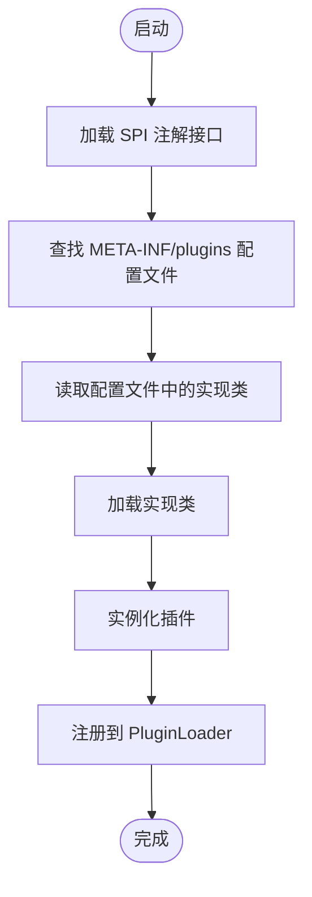
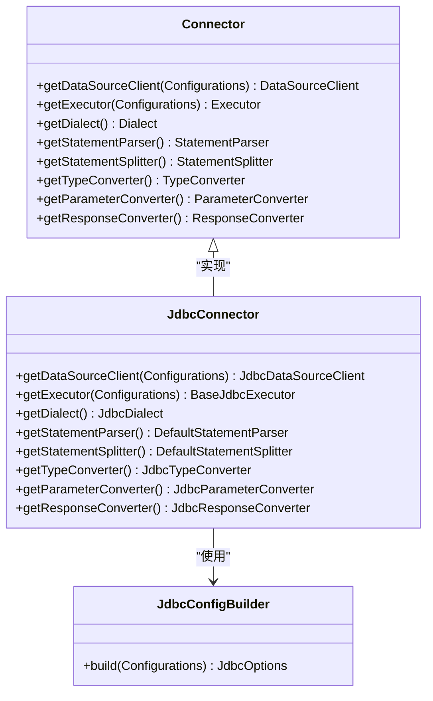
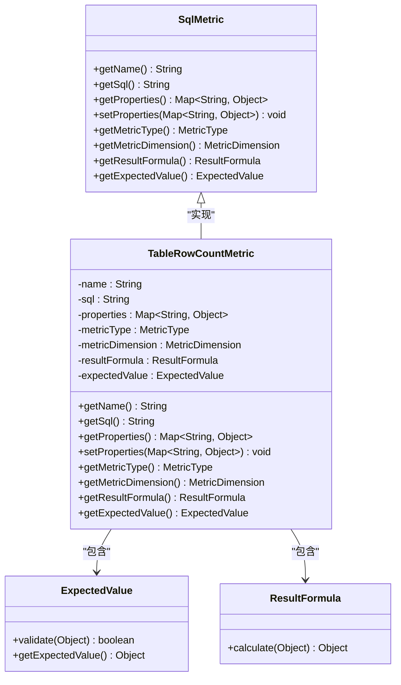
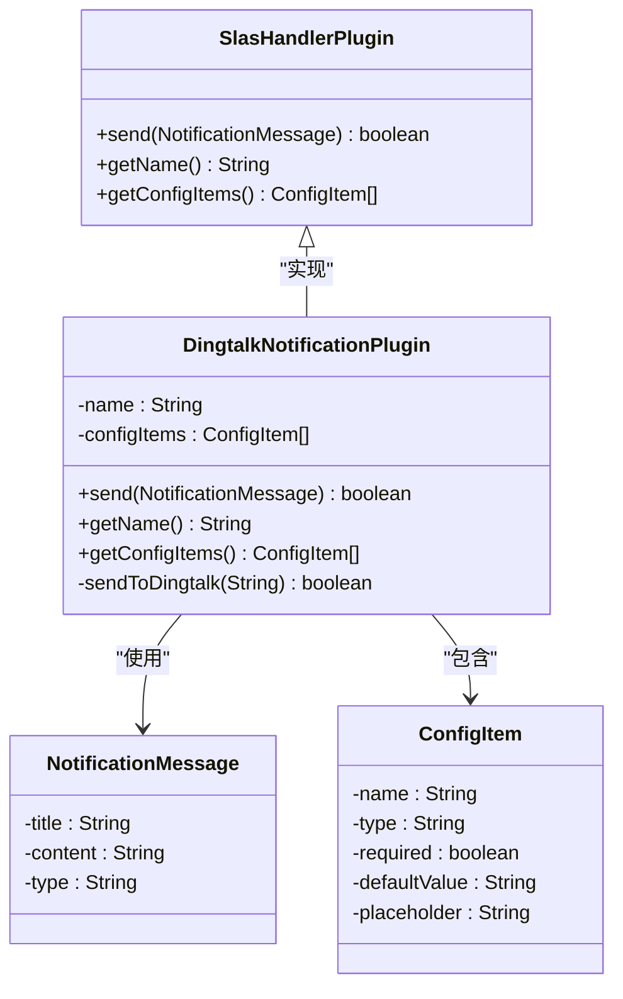
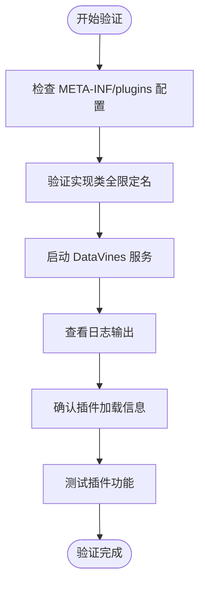

# 插件开发指南

<cite>
**本文档中引用的文件**  
- [SPI.java](file://datavines-spi/src/main/java/io/datavines/spi/SPI.java)
- [PluginLoader.java](file://datavines-spi/src/main/java/io/datavines/spi/PluginLoader.java)
- [Connector.java](file://datavines-connector/datavines-connector-api/src/main/java/io/datavines/connector/api/Connector.java)
- [SqlMetric.java](file://datavines-metric/datavines-metric-api/src/main/java/io/datavines/metric/api/SqlMetric.java)
- [SlasHandlerPlugin.java](file://datavines-notification/datavines-notification-api/src/main/java/io/datavines/notification/api/spi/SlasHandlerPlugin.java)
- [JdbcConnector.java](file://datavines-connector/datavines-connector-jdbc/src/main/java/io/datavines/connector/plugin/JdbcConnector.java)
- [BaseJdbcExecutor.java](file://datavines-connector/datavines-connector-jdbc/src/main/java/io/datavines/connector/plugin/BaseJdbcExecutor.java)
- [TableRowCountMetric.java](file://datavines-metric/datavines-metric-plugins/datavines-metric-table-row-count/src/main/java/io/datavines/metric/plugin/table/TableRowCountMetric.java)
- [DingtalkNotificationPlugin.java](file://datavines-notification/datavines-notification-plugins/datavines-notification-plugin-dingtalk/src/main/java/io/datavines/notification/plugin/dingtalk/DingtalkNotificationPlugin.java)
</cite>

## 目录
1. [简介](#简介)
2. [插件架构概述](#插件架构概述)
3. [数据源插件开发](#数据源插件开发)
4. [指标插件开发](#指标插件开发)
5. [告警通道插件开发](#告警通道插件开发)
6. [插件配置与参数传递](#插件配置与参数传递)
7. [测试实践](#测试实践)
8. [打包与部署](#打包与部署)
9. [验证与调试](#验证与调试)

## 简介
DataVines 是一个数据质量监控平台，支持通过插件机制扩展其功能。本指南详细介绍了如何开发数据源插件、指标插件和告警通道插件。我们将以 JDBC 数据源、表行数指标和钉钉告警通道为例，演示从接口实现到服务注册的完整开发流程。

**Section sources**
- [SPI.java](file://datavines-spi/src/main/java/io/datavines/spi/SPI.java#L1-L32)
- [PluginLoader.java](file://datavines-spi/src/main/java/io/datavines/spi/PluginLoader.java#L1-L487)

## 插件架构概述
DataVines 使用 SPI（Service Provider Interface）机制实现插件化架构。核心组件包括：

1. **SPI 注解**：标记接口为可扩展插件点
2. **PluginLoader**：负责插件的加载、实例化和管理
3. **META-INF/plugins**：存放插件配置文件的目录

插件加载流程如下：


**Diagram sources**
- [SPI.java](file://datavines-spi/src/main/java/io/datavines/spi/SPI.java#L1-L32)
- [PluginLoader.java](file://datavines-spi/src/main/java/io/datavines/spi/PluginLoader.java#L346-L364)

**Section sources**
- [SPI.java](file://datavines-spi/src/main/java/io/datavines/spi/SPI.java#L1-L32)
- [PluginLoader.java](file://datavines-spi/src/main/java/io/datavines/spi/PluginLoader.java#L1-L487)

## 数据源插件开发
数据源插件需要实现 `Connector` 接口，该接口定义了与数据源交互的基本方法。

### 实现 Connector 接口
```java
@SPI("jdbc")
public interface Connector {
    DataSourceClient getDataSourceClient(Configurations configurations);
    Executor getExecutor(Configurations configurations);
    Dialect getDialect();
    StatementParser getStatementParser();
    StatementSplitter getStatementSplitter();
    TypeConverter getTypeConverter();
    ParameterConverter getParameterConverter();
    ResponseConverter getResponseConverter();
}
```

### 创建 JDBC 数据源实现
以 `JdbcConnector` 为例，实现步骤如下：

1. 创建实现类并继承 `JdbcConnector`
2. 实现必要的方法
3. 提供相应的配置构建器



**Diagram sources**
- [Connector.java](file://datavines-connector/datavines-connector-api/src/main/java/io/datavines/connector/api/Connector.java#L1-L20)
- [JdbcConnector.java](file://datavines-connector/datavines-connector-jdbc/src/main/java/io/datavines/connector/plugin/JdbcConnector.java#L1-L50)
- [BaseJdbcExecutor.java](file://datavines-connector/datavines-connector-jdbc/src/main/java/io/datavines/connector/plugin/BaseJdbcExecutor.java#L1-L30)

**Section sources**
- [Connector.java](file://datavines-connector/datavines-connector-api/src/main/java/io/datavines/connector/api/Connector.java#L1-L50)
- [JdbcConnector.java](file://datavines-connector/datavines-connector-jdbc/src/main/java/io/datavines/connector/plugin/JdbcConnector.java#L1-L100)

## 指标插件开发
指标插件需要实现 `SqlMetric` 接口，用于定义数据质量检查的指标。

### 实现 SqlMetric 接口
```java
public interface SqlMetric extends MetricValidator {
    String getName();
    String getSql();
    Map<String, Object> getProperties();
    void setProperties(Map<String, Object> properties);
    MetricType getMetricType();
    MetricDimension getMetricDimension();
    ResultFormula getResultFormula();
    ExpectedValue getExpectedValue();
}
```

### 创建表行数指标实现
以 `TableRowCountMetric` 为例，实现步骤如下：

1. 创建实现类并实现 `SqlMetric` 接口
2. 定义指标名称、SQL 查询语句
3. 配置预期值验证器



**Diagram sources**
- [SqlMetric.java](file://datavines-metric/datavines-metric-api/src/main/java/io/datavines/metric/api/SqlMetric.java#L1-L30)
- [TableRowCountMetric.java](file://datavines-metric/datavines-metric-plugins/datavines-metric-table-row-count/src/main/java/io/datavines/metric/plugin/table/TableRowCountMetric.java#L1-L50)

**Section sources**
- [SqlMetric.java](file://datavines-metric/datavines-metric-api/src/main/java/io/datavines/metric/api/SqlMetric.java#L1-L50)
- [TableRowCountMetric.java](file://datavines-metric/datavines-metric-plugins/datavines-metric-table-row-count/src/main/java/io/datavines/metric/plugin/table/TableRowCountMetric.java#L1-L100)

## 告警通道插件开发
告警通道插件需要实现 `SlasHandlerPlugin` 接口，用于发送质量检查结果通知。

### 实现 SlasHandlerPlugin 接口
```java
public interface SlasHandlerPlugin {
    boolean send(NotificationMessage notificationMessage);
    String getName();
    List<ConfigItem> getConfigItems();
}
```

### 创建钉钉告警通道实现
以 `DingtalkNotificationPlugin` 为例，实现步骤如下：

1. 创建实现类并实现 `SlasHandlerPlugin` 接口
2. 实现消息发送逻辑
3. 定义配置项



**Diagram sources**
- [SlasHandlerPlugin.java](file://datavines-notification/datavines-notification-api/src/main/java/io/datavines/notification/api/spi/SlasHandlerPlugin.java#L1-L15)
- [DingtalkNotificationPlugin.java](file://datavines-notification/datavines-notification-plugins/datavines-notification-plugin-dingtalk/src/main/java/io/datavines/notification/plugin/dingtalk/DingtalkNotificationPlugin.java#L1-L40)

**Section sources**
- [SlasHandlerPlugin.java](file://datavines-notification/datavines-notification-api/src/main/java/io/datavines/notification/api/spi/SlasHandlerPlugin.java#L1-L20)
- [DingtalkNotificationPlugin.java](file://datavines-notification/datavines-notification-plugins/datavines-notification-plugin-dingtalk/src/main/java/io/datavines/notification/plugin/dingtalk/DingtalkNotificationPlugin.java#L1-L80)

## 插件配置与参数传递
插件通过 `META-INF/plugins` 目录下的配置文件进行注册。

### 创建服务配置文件
在 `META-INF/plugins` 目录下创建文件，文件名为接口的全限定名：
```
io.datavines.connector.api.Connector
```

文件内容为实现类的全限定名：
```
jdbc=io.datavines.connector.plugin.JdbcConnector
mysql=io.datavines.connector.plugin.MysqlConnector
postgresql=io.datavines.connector.plugin.PostgresqlConnector
```

### 参数配置传递机制
插件参数通过 `Configurations` 对象传递，开发人员可以在插件中读取这些配置：

```java
public class JdbcConnector implements Connector {
    @Override
    public DataSourceClient getDataSourceClient(Configurations configurations) {
        String host = configurations.getString("host");
        int port = configurations.getInt("port");
        String username = configurations.getString("username");
        String password = configurations.getString("password");
        // 使用配置创建数据源客户端
        return new JdbcDataSourceClient(host, port, username, password);
    }
}
```

**Section sources**
- [PluginLoader.java](file://datavines-spi/src/main/java/io/datavines/spi/PluginLoader.java#L371-L398)
- [JdbcConnector.java](file://datavines-connector/datavines-connector-jdbc/src/main/java/io/datavines/connector/plugin/JdbcConnector.java#L50-L80)

## 测试实践
为确保插件的稳定性和兼容性，建议进行单元测试和集成测试。

### 单元测试
测试插件的基本功能和边界条件：

```java
@Test
public void testJdbcConnectorCreation() {
    Configurations configurations = new Configurations();
    configurations.setString("host", "localhost");
    configurations.setInt("port", 3306);
    configurations.setString("username", "test");
    configurations.setString("password", "test");
    
    JdbcConnector connector = new JdbcConnector();
    DataSourceClient client = connector.getDataSourceClient(configurations);
    
    assertNotNull(client);
    assertTrue(client instanceof JdbcDataSourceClient);
}
```

### 集成测试
测试插件在实际环境中的表现：

```java
@Test
public void testTableRowCountMetricExecution() {
    // 设置测试数据库
    // 执行指标检查
    // 验证结果
    assertTrue(result.getActualValue() > 0);
}
```

**Section sources**
- [JdbcConnector.java](file://datavines-connector/datavines-connector-jdbc/src/main/java/io/datavines/connector/plugin/JdbcConnector.java#L1-L100)
- [TableRowCountMetric.java](file://datavines-metric/datavines-metric-plugins/datavines-metric-table-row-count/src/main/java/io/datavines/metric/plugin/table/TableRowCountMetric.java#L1-L100)

## 打包与部署
插件开发完成后，需要正确打包并部署到 DataVines 环境中。

### Maven 配置
在 `pom.xml` 中配置插件模块：

```xml
<groupId>io.datavines</groupId>
<artifactId>datavines-connector-mysql</artifactId>
<version>1.0.0</version>
<packaging>jar</packaging>

<dependencies>
    <dependency>
        <groupId>io.datavines</groupId>
        <artifactId>datavines-connector-api</artifactId>
        <version>${project.version}</version>
    </dependency>
</dependencies>
```

### 打包步骤
1. 编译代码：`mvn clean compile`
2. 打包：`mvn package`
3. 将生成的 JAR 文件复制到 DataVines 的插件目录

### 部署位置
将插件 JAR 文件放置在以下目录：
```
datavines/lib/plugins/
```

**Section sources**
- [pom.xml](file://datavines-connector/datavines-connector-mysql/pom.xml#L1-L50)

## 验证与调试
部署完成后，需要验证插件是否正确加载和运行。

### 验证插件加载
启动 DataVines 服务，检查日志中是否有插件加载信息：

```
INFO  PluginLoader:123 - Load plugin: jdbc -> io.datavines.connector.plugin.JdbcConnector
INFO  PluginLoader:123 - Load plugin: table_row_count -> io.datavines.metric.plugin.table.TableRowCountMetric
INFO  PluginLoader:123 - Load plugin: dingtalk -> io.datavines.notification.plugin.dingtalk.DingtalkNotificationPlugin
```

### 调试技巧
1. 检查 `META-INF/plugins` 目录下的配置文件是否正确
2. 确认实现类的全限定名是否正确
3. 查看日志中的错误信息
4. 使用调试模式启动服务



**Diagram sources**
- [PluginLoader.java](file://datavines-spi/src/main/java/io/datavines/spi/PluginLoader.java#L171-L188)
- [SPI.java](file://datavines-spi/src/main/java/io/datavines/spi/SPI.java#L1-L32)

**Section sources**
- [PluginLoader.java](file://datavines-spi/src/main/java/io/datavines/spi/PluginLoader.java#L1-L487)
- [SPI.java](file://datavines-spi/src/main/java/io/datavines/spi/SPI.java#L1-L32)