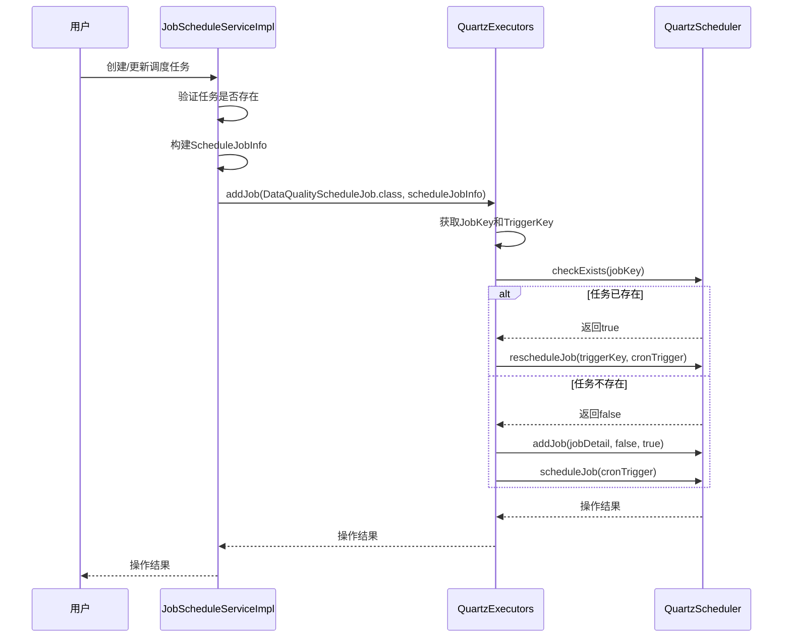
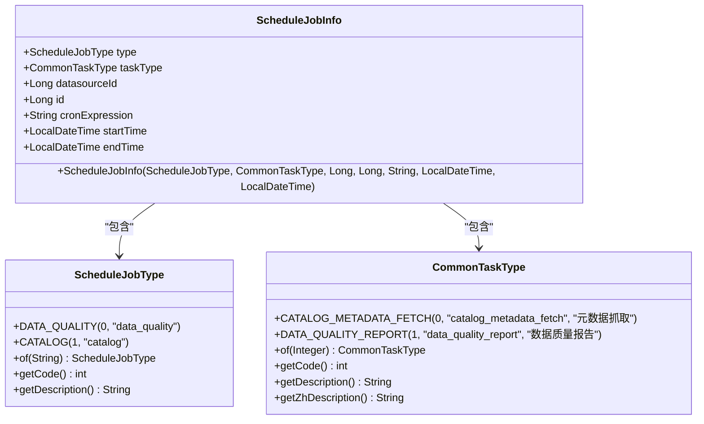
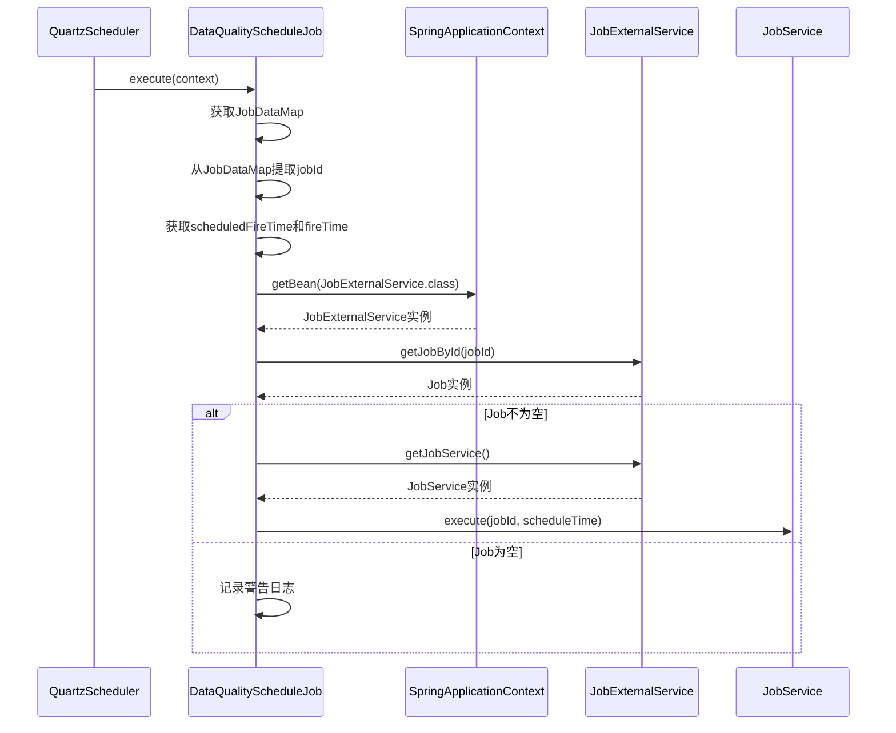
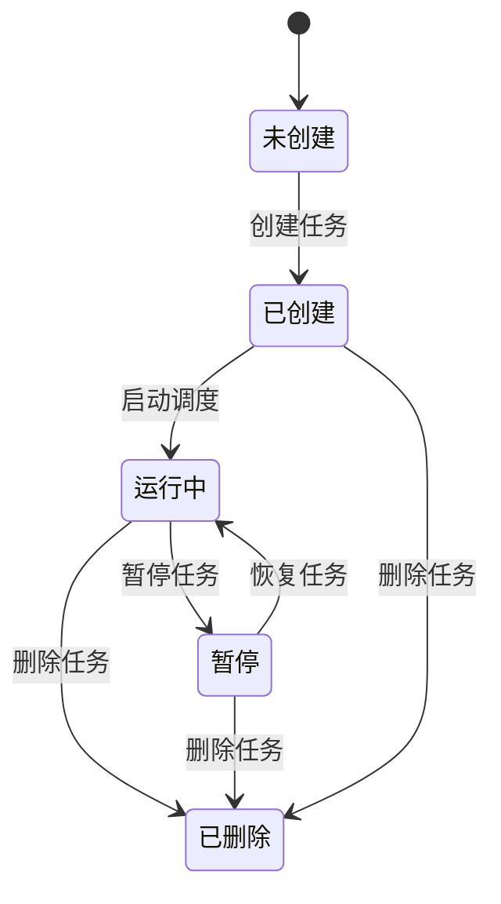
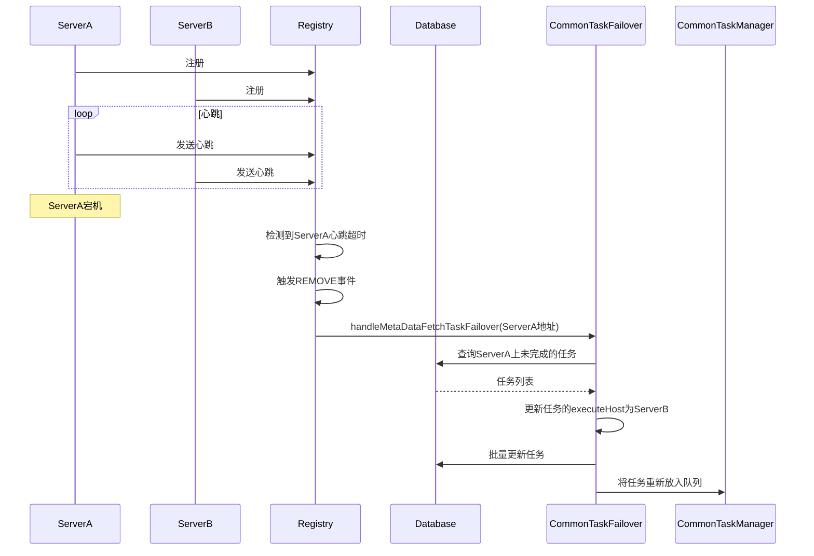
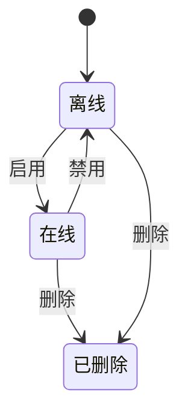
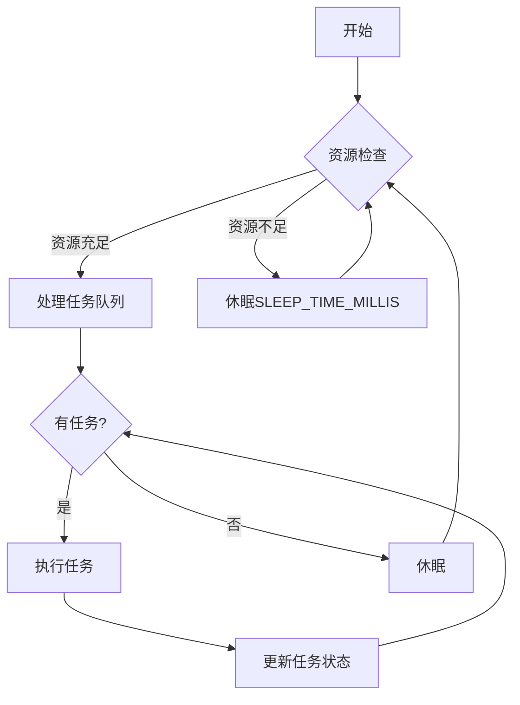

# 任务调度

<cite>
**本文档引用的文件**
- [JobScheduleServiceImpl.java](file://datavines-server\src\main\java\io\datavines\server\repository\service\impl\JobScheduleServiceImpl.java)
- [ScheduleJobInfo.java](file://datavines-server\src\main\java\io\datavines\server\dqc\coordinator\quartz\ScheduleJobInfo.java)
- [QuartzExecutors.java](file://datavines-server\src\main\java\io\datavines\server\dqc\coordinator\quartz\QuartzExecutors.java)
- [DataQualityScheduleJob.java](file://datavines-server\src\main\java\io\datavines\server\dqc\coordinator\quartz\DataQualityScheduleJob.java)
- [CommonTaskFailover.java](file://datavines-server\src\main\java\io\datavines\server\scheduler\CommonTaskFailover.java)
- [Register.java](file://datavines-server\src\main\java\io\datavines\server\registry\Register.java)
- [JobScheduleType.java](file://datavines-server\src\main\java\io\datavines\server\enums\JobScheduleType.java)
- [ScheduleJobType.java](file://datavines-server\src\main\java\io\datavines\server\enums\ScheduleJobType.java)
- [CommonTaskType.java](file://datavines-server\src\main\java\io\datavines\server\enums\CommonTaskType.java)
</cite>

## 目录
1. [引言](#引言)
2. [基于Quartz的任务调度机制](#基于quartz的任务调度机制)
3. [ScheduleJobInfo元数据封装](#schedulejobinfo元数据封装)
4. [DataQualityScheduleJob执行逻辑](#dataqualityschedulejob执行逻辑)
5. [JobScheduler任务生命周期管理](#jobscheduler任务生命周期管理)
6. [高可用设计与故障转移机制](#高可用设计与故障转移机制)
7. [调度任务状态转换](#调度任务状态转换)
8. [配置示例](#配置示例)
9. [调度性能优化与大规模任务管理](#调度性能优化与大规模任务管理)
10. [结论](#结论)

## 引言

DataVines任务调度系统是数据质量监控和元数据管理的核心组件，基于Quartz框架实现。该系统负责调度数据质量检查、元数据抓取等周期性任务，确保数据治理流程的自动化和可靠性。本文档详细描述了DataVines的调度机制，包括任务元数据封装、执行逻辑、生命周期管理、高可用设计以及性能优化策略。

## 基于Quartz的任务调度机制

DataVines采用Quartz作为其任务调度引擎，通过`QuartzExecutors`类封装了Quartz的核心功能。该类作为单例存在，负责与Quartz的`Scheduler`实例交互，管理所有调度任务的增删改查。

调度机制的核心流程如下：
1. **任务创建**：当用户创建一个调度任务时，系统会生成一个`ScheduleJobInfo`对象，该对象包含了任务的所有元数据。
2. **任务添加**：`QuartzExecutors`接收`ScheduleJobInfo`和任务执行类（如`DataQualityScheduleJob.class`），将其注册到Quartz调度器中。
3. **触发器配置**：系统根据`ScheduleJobInfo`中的cron表达式创建`CronTrigger`，并配置任务的开始时间和结束时间。
4. **任务执行**：Quartz调度器在预定时间触发任务，调用`DataQualityScheduleJob`的`execute`方法。

在添加任务时，系统会检查任务是否已存在。如果存在，则更新其触发器；如果不存在，则创建新的任务和触发器。这种设计确保了任务配置的幂等性。



**图示来源**
- [JobScheduleServiceImpl.java](file://datavines-server\src\main\java\io\datavines\server\repository\service\impl\JobScheduleServiceImpl.java#L117-L123)
- [QuartzExecutors.java](file://datavines-server\src\main\java\io\datavines\server\dqc\coordinator\quartz\QuartzExecutors.java#L74-L148)

## ScheduleJobInfo元数据封装

`ScheduleJobInfo`类是调度任务的元数据载体，它封装了任务执行所需的所有信息。该类位于`io.datavines.server.dqc.coordinator.quartz`包中，使用Lombok的`@Data`注解自动生成getter、setter和toString方法。

`ScheduleJobInfo`的主要属性包括：
- **type** (`ScheduleJobType`)：任务类型，如`DATA_QUALITY`（数据质量）或`CATALOG`（元数据）。
- **taskType** (`CommonTaskType`)：通用任务类型，如`DATA_QUALITY_REPORT`（数据质量报告）。
- **datasourceId** (`Long`)：数据源ID，用于标识任务关联的数据源。
- **id** (`Long`)：任务ID，唯一标识一个调度任务。
- **cronExpression** (`String`)：cron表达式，定义任务的执行计划。
- **startTime** (`LocalDateTime`)：任务的开始时间。
- **endTime** (`LocalDateTime`)：任务的结束时间。

这些元数据在任务执行时被序列化并存储在`JobDataMap`中，供`DataQualityScheduleJob`在执行时读取。例如，`jobId`和`datasourceId`被直接放入`JobDataMap`，而整个`ScheduleJobInfo`对象也被序列化后存储，以便在需要时进行反序列化。



**图示来源**
- [ScheduleJobInfo.java](file://datavines-server\src\main\java\io\datavines\server\dqc\coordinator\quartz\ScheduleJobInfo.java#L26-L57)
- [ScheduleJobType.java](file://datavines-server\src\main\java\io\datavines\server\enums\ScheduleJobType.java#L24-L64)
- [CommonTaskType.java](file://datavines-server\src\main\java\io\datavines\server\enums\CommonTaskType.java#L24-L74)

## DataQualityScheduleJob执行逻辑

`DataQualityScheduleJob`是Quartz调度器执行的具体任务类，实现了`org.quartz.Job`接口。当调度器触发任务时，会调用其`execute`方法。

执行逻辑的核心步骤如下：
1. **获取JobDataMap**：从`JobExecutionContext`中获取`JobDataMap`，该映射包含了在任务创建时存储的所有元数据。
2. **提取任务ID**：从`JobDataMap`中读取`JOB_ID`，这是执行具体业务逻辑的关键。
3. **获取执行时间**：从`JobExecutionContext`中获取`scheduledFireTime`（计划触发时间）和`fireTime`（实际触发时间），用于日志记录和业务处理。
4. **获取业务服务**：通过`SpringApplicationContext`获取`JobExternalService`，这是与业务逻辑交互的入口。
5. **执行任务**：调用`JobExternalService`的`execute`方法，传入`jobId`和`scheduleTime`，启动数据质量检查流程。

该类的设计遵循了依赖注入的原则，通过静态方法`SpringApplicationContext.getBean()`获取Spring容器中的Bean，避免了直接依赖Spring框架的`ApplicationContext`。



**图示来源**
- [DataQualityScheduleJob.java](file://datavines-server\src\main\java\io\datavines\server\dqc\coordinator\quartz\DataQualityScheduleJob.java#L54-L73)
- [JobExternalService.java](file://datavines-server\src\main\java\io\datavines\server\repository\service\impl\JobExternalService.java)

## JobScheduler任务生命周期管理

任务的生命周期管理主要由`JobScheduleServiceImpl`和`QuartzExecutors`协同完成，涵盖了创建、启动、暂停和删除等操作。

### 创建与更新
当用户创建或更新一个调度任务时，`JobScheduleServiceImpl`的`createOrUpdate`方法被调用。该方法首先检查任务是否已存在，然后调用`addScheduleJob`方法。在`addScheduleJob`中，根据任务类型（`CYCLE`或`CRONTAB`）构建`ScheduleJobInfo`，并调用`QuartzExecutors.addJob`方法将其注册到Quartz调度器。

### 删除
删除操作通过`QuartzExecutors.deleteJob`方法实现。该方法接收一个`ScheduleJobInfo`对象，根据其`id`和`type`构建`JobKey`，然后调用Quartz调度器的`deleteJob`方法。如果任务不存在，方法返回`true`，体现了操作的幂等性。

### 暂停与恢复
虽然代码中没有直接的“暂停”方法，但可以通过将任务的`status`设置为`false`（在`JobSchedule`实体中）来实现逻辑上的暂停。当`status`为`false`时，`JobScheduleServiceImpl`在创建或更新任务时不会调用`addJob`方法。恢复则通过将`status`重新设置为`true`来实现。



**图示来源**
- [JobScheduleServiceImpl.java](file://datavines-server\src\main\java\io\datavines\server\repository\service\impl\JobScheduleServiceImpl.java#L65-L140)
- [QuartzExecutors.java](file://datavines-server\src\main\java\io\datavines\server\dqc\coordinator\quartz\QuartzExecutors.java#L157-L173)

## 高可用设计与故障转移机制

DataVines通过注册中心（Registry）和故障转移（Failover）机制实现高可用性。系统支持多种注册中心实现，如ZooKeeper和MySQL。

### 故障转移机制
`CommonTaskFailover`类负责处理元数据抓取等通用任务的故障转移。当一个服务器实例宕机时，其他活跃的服务器实例会检测到这一变化，并接管其未完成的任务。

故障转移的触发时机包括：
1. **服务器下线**：当一个服务器从注册中心移除时，`Register`类会收到`REMOVE`事件，触发`handleJobExecutionFailover`和`handleMetaDataFetchTaskFailover`。
2. **服务器启动**：当新的服务器实例启动时，它会查询注册中心，检查是否有需要故障转移的任务。

故障转移的执行流程如下：
1. 查询数据库，找出所有分配给已下线服务器但状态为“运行中”的任务。
2. 更新这些任务的`executeHost`字段，将其指向当前服务器。
3. 将这些任务重新放入任务队列，由当前服务器继续执行。

### 注册中心集成
`Register`类是注册中心的抽象，它监听服务器列表的变化。当服务器列表发生变化时，它会执行故障转移逻辑，确保任务不会因为单点故障而丢失。



**图示来源**
- [CommonTaskFailover.java](file://datavines-server\src\main\java\io\datavines\server\scheduler\CommonTaskFailover.java#L30-L67)
- [Register.java](file://datavines-server\src\main\java\io\datavines\server\registry\Register.java#L93-L169)

## 调度任务状态转换

调度任务的状态主要由`JobSchedule`实体的`status`字段表示，这是一个布尔值，`true`表示启用（在线），`false`表示禁用（离线）。

状态转换图如下：
- **创建**：新创建的任务默认为`true`（启用）。
- **启用/禁用**：用户可以通过界面或API切换任务的`status`。
- **删除**：任务被删除后，其状态不再存在。



**图示来源**
- [JobScheduleType.java](file://datavines-server\src\main\java\io\datavines\server\enums\JobScheduleType.java#L27-L28)

## 配置示例

### Cron表达式配置
在前端UI中，用户可以选择不同的调度周期（如每小时、每天、每周），系统会根据选择生成相应的cron表达式。例如：
- **每小时**：`0 0 * * * ?` (每小时的第0分钟)
- **每天**：`0 0 2 * * ?` (每天凌晨2点)
- **每周**：`0 0 2 ? * MON` (每周一凌晨2点)

### API请求示例
创建一个数据质量调度任务的API请求体示例：
```json
{
  "jobId": 123,
  "type": "crontab",
  "cronExpression": "0 0 2 * * ?",
  "startTime": "2023-01-01T00:00:00",
  "endTime": "2024-01-01T00:00:00",
  "status": true
}
```

**图示来源**
- [index.tsx](file://datavines-ui\src\view\Main\HomeDetail\Jobs\components\Schedule\index.tsx#L356-L366)

## 调度性能优化与大规模任务管理

### 性能优化
1. **线程池管理**：系统使用`ThreadUtils`工具类创建守护线程池，避免线程泄漏。例如，`newDaemonFixedThreadPool`方法创建固定大小的线程池，并为线程命名，便于监控和调试。
2. **锁机制**：`QuartzExecutors`使用`ReentrantReadWriteLock`来保证在添加和删除任务时的线程安全，写操作使用写锁，确保操作的原子性。
3. **Cron表达式验证**：在添加任务前，系统会调用`QuartzExecutors.isValid`方法验证cron表达式的有效性，避免无效表达式导致调度器异常。

### 大规模任务管理
1. **分片处理**：`CommonTaskScheduler`类在运行时会检查系统资源（CPU负载、内存），如果资源不足，则会休眠一段时间，避免因任务过多导致服务器过载。
2. **批量操作**：`QuartzExecutors`提供了`deleteAllJobs`方法，可以一次性删除某个任务组下的所有任务，提高管理效率。
3. **未来执行计划计算**：`QuartzExecutors.listFutureCronRunTimes`方法可以计算cron表达式的未来执行时间，帮助用户预览调度计划。



**图示来源**
- [ThreadUtils.java](file://datavines-common\src\main\java\io\datavines\common\utils\ThreadUtils.java#L97-L136)
- [QuartzExecutors.java](file://datavines-server\src\main\java\io\datavines\server\dqc\coordinator\quartz\QuartzExecutors.java#L239-L263)
- [CommonTaskScheduler.java](file://datavines-server\src\main\java\io\datavines\server\scheduler\CommonTaskScheduler.java#L55-L57)

## 结论

DataVines的任务调度系统是一个功能完备、高可用的解决方案。它基于成熟的Quartz框架，通过`ScheduleJobInfo`封装任务元数据，由`DataQualityScheduleJob`执行具体业务逻辑。`JobScheduler`通过`QuartzExecutors`和`JobScheduleServiceImpl`实现了任务的全生命周期管理。系统的高可用性通过注册中心和`CommonTaskFailover`机制得到保障。此外，通过合理的线程池管理、锁机制和资源检查，系统能够高效地处理大规模任务调度需求。整体设计清晰，扩展性强，为数据质量监控和元数据管理提供了可靠的自动化基础。