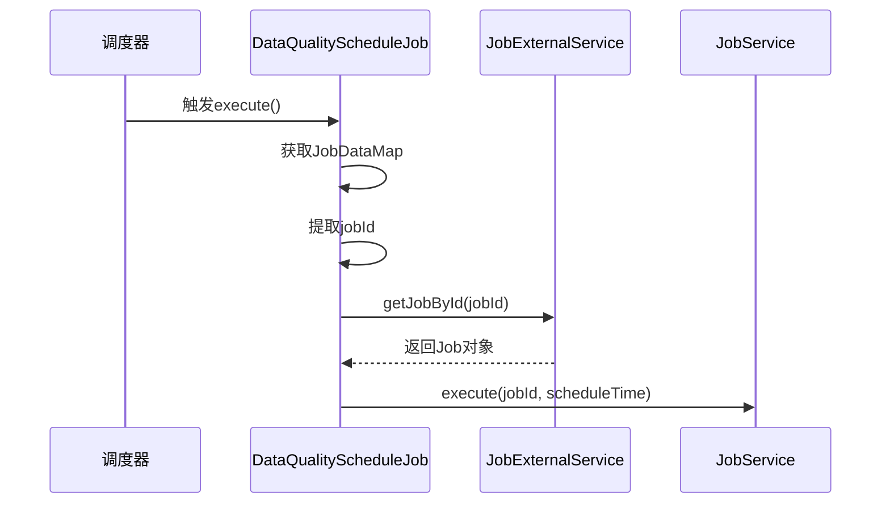
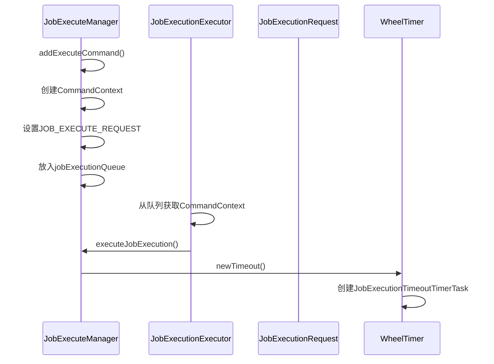
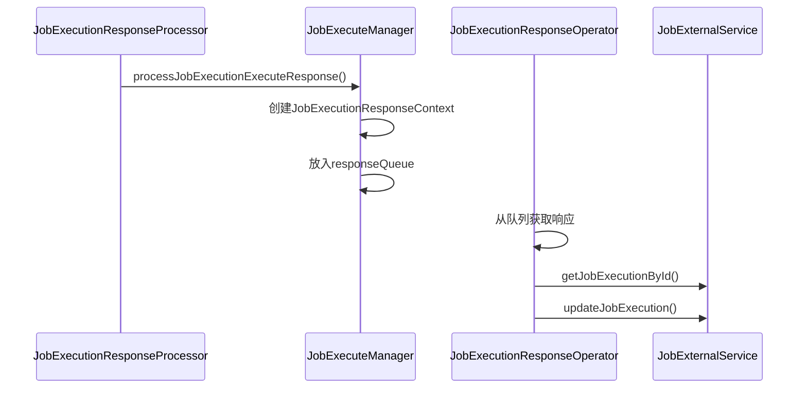
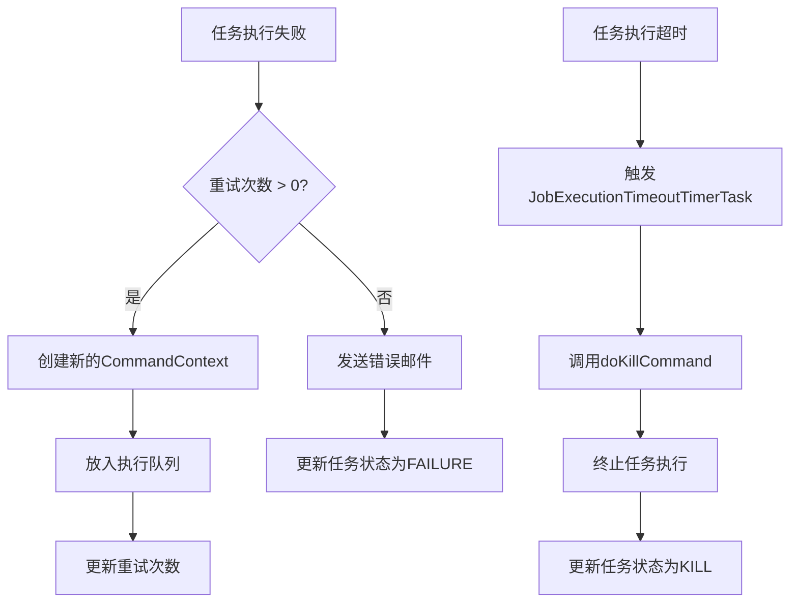
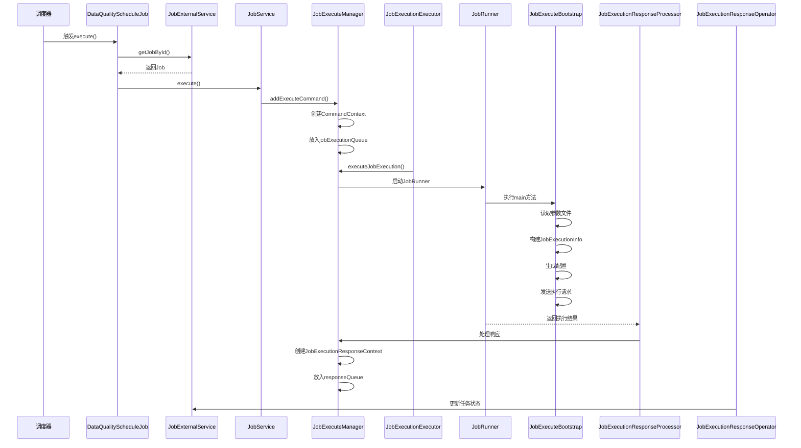

# 执行逻辑

<cite>
**本文档引用的文件**
- [DataQualityScheduleJob.java](file://datavines-server\src\main\java\io\datavines\server\dqc\coordinator\quartz\DataQualityScheduleJob.java)
- [JobExecuteManager.java](file://datavines-server\src\main\java\io\datavines\server\dqc\coordinator\cache\JobExecuteManager.java)
- [JobExecutionResponseProcessor.java](file://datavines-server\src\main\java\io\datavines\server\dqc\coordinator\cache\JobExecutionResponseProcessor.java)
- [JobExecuteBootstrap.java](file://datavines-runner\src\main\java\io\datavines\runner\JobExecuteBootstrap.java)
- [CommandContext.java](file://datavines-server\src\main\java\io\datavines\server\dqc\coordinator\cache\CommandContext.java)
- [JobExecutionResponseContext.java](file://datavines-server\src\main\java\io\datavines\server\dqc\coordinator\cache\JobExecutionResponseContext.java)
- [JobExecuteResponseCommand.java](file://datavines-server\src\main\java\io\datavines\server\dqc\command\JobExecuteResponseCommand.java)
- [TimeoutStrategy.java](file://datavines-common\src\main\java\io\datavines\common\enums\TimeoutStrategy.java)
- [ExecutionStatus.java](file://datavines-common\src\main\java\io\datavines\common\enums\ExecutionStatus.java)
</cite>

## 目录
1. [任务触发与调度](#任务触发与调度)
2. [上下文初始化](#上下文初始化)
3. [任务执行命令生成与发送](#任务执行命令生成与发送)
4. [执行结果处理](#执行结果处理)
5. [异常处理机制](#异常处理机制)
6. [任务执行时序图](#任务执行时序图)

## 任务触发与调度

DataVines任务执行流程始于`DataQualityScheduleJob`类，该类实现了Quartz调度框架的Job接口，负责处理数据质量任务的调度执行。当调度器触发与任务关联的触发器时，会调用`execute`方法。

在`execute`方法中，首先从`JobExecutionContext`中获取任务ID和调度时间，然后通过`JobExternalService`获取具体的任务信息。如果任务存在，则调用`getJobService().execute()`方法启动任务执行流程。该流程是整个任务执行生命周期的起点，负责将调度事件转化为具体的执行请求。

**Diagram sources**
- [DataQualityScheduleJob.java](file://datavines-server\src\main\java\io\datavines\server\dqc\coordinator\quartz\DataQualityScheduleJob.java#L54-L72)

**Section sources**
- [DataQualityScheduleJob.java](file://datavines-server\src\main\java\io\datavines\server\dqc\coordinator\quartz\DataQualityScheduleJob.java#L37-L72)

## 上下文初始化

任务执行的上下文初始化过程主要在`JobExecuteManager`中完成。当任务被调度执行时，`JobExecuteManager`负责构建`JobExecutionRequest`对象，该对象包含了任务执行所需的所有配置和参数。

初始化过程包括：
1. 从数据库获取任务执行信息
2. 解析任务参数，构建`JobExecutionParameter`
3. 加载执行平台和引擎配置
4. 设置错误数据存储和验证结果存储配置
5. 构建完整的执行请求上下文

这个过程确保了任务执行所需的所有环境和配置信息都已准备就绪，为后续的命令生成和发送奠定了基础。

**Section sources**
- [JobExecuteManager.java](file://datavines-server\src\main\java\io\datavines\server\dqc\coordinator\cache\JobExecuteManager.java#L555-L571)

## 任务执行命令生成与发送

任务执行命令的生成和发送由`JobExecuteManager`类中的`JobExecutionExecutor`线程负责。该线程从`jobExecutionQueue`中获取`CommandContext`对象，并根据命令类型执行相应的操作。

当接收到`JOB_EXECUTE_REQUEST`命令时，系统会调用`executeJobExecution`方法来执行任务，并为该任务创建一个超时定时器`JobExecutionTimeoutTimerTask`。这个定时器会在指定时间后触发，如果任务仍未完成，则会执行超时处理逻辑。

命令的发送是通过将`CommandContext`对象放入`jobExecutionQueue`队列来实现的，这是一种典型的生产者-消费者模式，确保了任务执行请求的有序处理。

**Diagram sources**
- [JobExecuteManager.java](file://datavines-server\src\main\java\io\datavines\server\dqc\coordinator\cache\JobExecuteManager.java#L142-L160)
- [CommandContext.java](file://datavines-server\src\main\java\io\datavines\server\dqc\coordinator\cache\CommandContext.java#L24-L30)

**Section sources**
- [JobExecuteManager.java](file://datavines-server\src\main\java\io\datavines\server\dqc\coordinator\cache\JobExecuteManager.java#L142-L160)

## 执行结果处理

执行结果的处理由`JobExecutionResponseProcessor`和`JobExecuteManager`协同完成。`JobExecutionResponseProcessor`是一个单例类，负责接收来自执行器的响应命令，并将其转发给`JobExecuteManager`进行处理。

`JobExecuteManager`内部有一个`JobExecutionResponseOperator`线程，它持续从`responseQueue`中获取`JobExecutionResponseContext`对象，并根据响应类型更新任务状态。对于`JOB_EXECUTE_ACK`响应，系统会更新任务的开始时间、执行主机和日志路径等信息；对于`JOB_EXECUTE_RESPONSE`响应，系统会更新任务的结束时间、状态和应用ID等信息。

这种异步响应处理机制确保了任务执行结果能够被及时处理，同时不会阻塞主执行流程。

**Diagram sources**
- [JobExecutionResponseProcessor.java](file://datavines-server\src\main\java\io\datavines\server\dqc\coordinator\cache\JobExecutionResponseProcessor.java#L39-L41)
- [JobExecuteManager.java](file://datavines-server\src\main\java\io\datavines\server\dqc\coordinator\cache\JobExecuteManager.java#L276-L304)
- [JobExecutionResponseContext.java](file://datavines-server\src\main\java\io\datavines\server\dqc\coordinator\cache\JobExecutionResponseContext.java#L26-L38)

**Section sources**
- [JobExecutionResponseProcessor.java](file://datavines-server\src\main\java\io\datavines\server\dqc\coordinator\cache\JobExecutionResponseProcessor.java#L21-L43)
- [JobExecuteManager.java](file://datavines-server\src\main\java\io\datavines\server\dqc\coordinator\cache\JobExecuteManager.java#L276-L304)

## 异常处理机制

DataVines的异常处理机制包含重试策略、超时处理和错误日志记录三个主要方面。

### 重试策略
当任务执行失败时，系统会根据任务配置的重试次数进行重试。如果`jobExecution.getRetryTimes() > 0`，则会创建一个新的`CommandContext`并重新放入执行队列，同时更新数据库中的重试次数。如果重试次数已用完，则会发送错误邮件并更新任务状态。

### 超时处理
系统使用`WheelTimer`来管理任务超时。每个任务执行请求都会关联一个`JobExecutionTimeoutTimerTask`，当任务执行时间超过预设阈值时，定时器会触发`doKillCommand`方法，该方法会调用`JobRunner.kill()`来终止任务执行，并将任务状态更新为`KILL`。

### 错误日志记录
系统通过`LoggerUtils`和`JobExecutionLogFilter`等组件来记录详细的错误日志。所有关键操作和异常都会被记录到日志文件中，便于后续的故障排查和审计。

**Diagram sources**
- [JobExecuteManager.java](file://datavines-server\src\main\java\io\datavines\server\dqc\coordinator\cache\JobExecuteManager.java#L321-L334)
- [JobExecuteManager.java](file://datavines-server\src\main\java\io\datavines\server\dqc\coordinator\cache\JobExecuteManager.java#L404-L445)
- [ExecutionStatus.java](file://datavines-common\src\main\java\io\datavines\common\enums\ExecutionStatus.java#L78-L141)

**Section sources**
- [JobExecuteManager.java](file://datavines-server\src\main\java\io\datavines\server\dqc\coordinator\cache\JobExecuteManager.java#L321-L334)
- [JobExecuteManager.java](file://datavines-server\src\main\java\io\datavines\server\dqc\coordinator\cache\JobExecuteManager.java#L404-L445)

## 任务执行时序图

以下是DataVines任务执行的完整时序图，展示了从任务调度到结果处理的整个流程：

**Diagram sources**
- [DataQualityScheduleJob.java](file://datavines-server\src\main\java\io\datavines\server\dqc\coordinator\quartz\DataQualityScheduleJob.java#L54-L72)
- [JobExecuteManager.java](file://datavines-server\src\main\java\io\datavines\server\dqc\coordinator\cache\JobExecuteManager.java#L142-L160)
- [JobExecuteBootstrap.java](file://datavines-runner\src\main\java\io\datavines\runner\JobExecuteBootstrap.java#L35-L62)