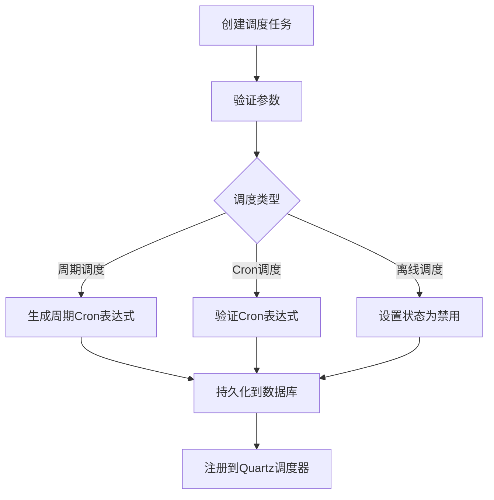
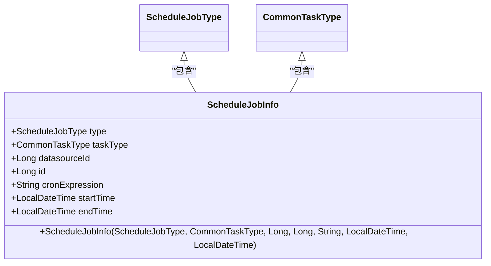
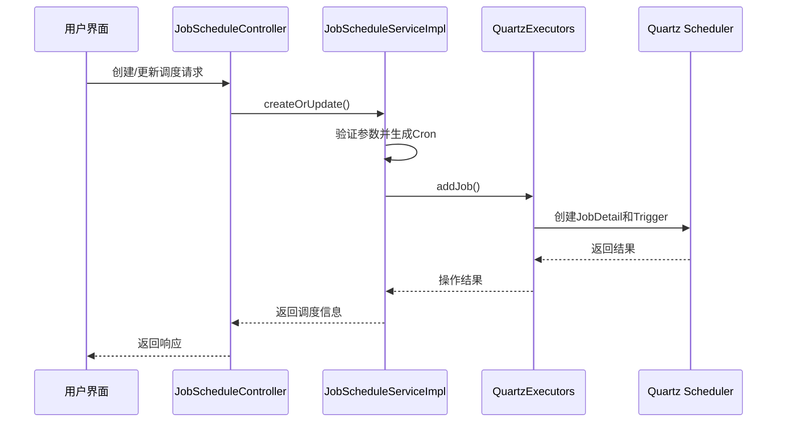
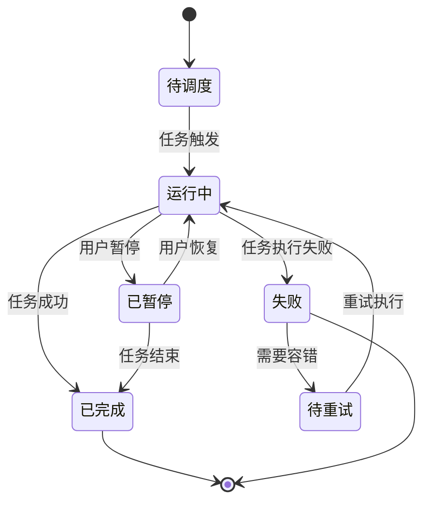
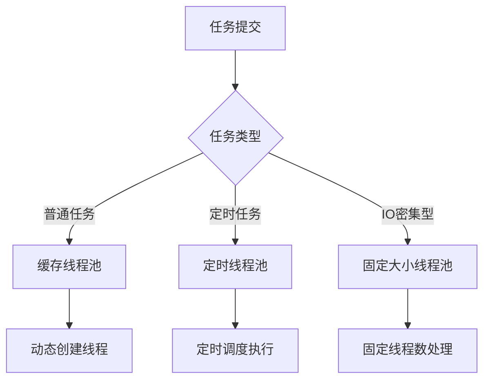

# 调度管理

<cite>
**本文档引用文件**  
- [ScheduleJobInfo.java](file://datavines-server\src\main\java\io\datavines\server\dqc\coordinator\quartz\ScheduleJobInfo.java)
- [QuartzExecutors.java](file://datavines-server\src\main\java\io\datavines\server\dqc\coordinator\quartz\QuartzExecutors.java)
- [JobScheduleServiceImpl.java](file://datavines-server\src\main\java\io\datavines\server\repository\service\impl\JobScheduleServiceImpl.java)
- [DataQualityScheduleJob.java](file://datavines-server\src\main\java\io\datavines\server\dqc\coordinator\quartz\DataQualityScheduleJob.java)
- [JobSchedule.java](file://datavines-server\src\main\java\io\datavines\server\repository\entity\JobSchedule.java)
- [JobScheduleController.java](file://datavines-server\src\main\java\io\datavines\server\api\controller\JobScheduleController.java)
- [JobScheduleType.java](file://datavines-server\src\main\java\io\datavines\server\enums\JobScheduleType.java)
- [ExecutionStatus.java](file://datavines-common\src\main\java\io\datavines\common\enums\ExecutionStatus.java)
- [ThreadUtils.java](file://datavines-common\src\main\java\io\datavines\common\utils\ThreadUtils.java)
</cite>

## 目录
1. [调度元数据管理](#调度元数据管理)
2. [ScheduleJobInfo类解析](#schedulejobinfo类解析)
3. [JobScheduler与Quartz集成](#jobscheduler与quartz集成)
4. [调度任务状态机模型](#调度任务状态机模型)
5. [调度任务配置示例](#调度任务配置示例)
6. [API调用方式](#api调用方式)
7. [线程池与并发控制](#线程池与并发控制)

## 调度元数据管理

DataVines调度系统通过JobSchedule实体类管理调度任务的元数据信息。该实体类存储了调度任务的核心配置，包括任务ID、调度类型、参数配置、Cron表达式、状态以及时间范围等信息。调度元数据通过数据库表`dv_job_schedule`进行持久化存储，确保调度配置的可靠性和可追溯性。

**调度元数据属性说明：**
- **jobId**: 关联的作业ID，标识被调度的具体任务
- **type**: 调度类型，支持周期调度(CYCLE)、Cron调度(CRONTAB)和离线调度(OFFLINE)
- **param**: 调度参数，以JSON格式存储具体的调度配置
- **cronExpression**: Cron表达式，定义任务的执行时间规则
- **status**: 调度状态，true表示启用，false表示禁用
- **startTime/endTime**: 调度任务的有效时间范围

**调度元数据生命周期：**
调度任务的元数据遵循创建、更新、删除的完整生命周期。当用户创建或更新调度配置时，系统首先验证参数的合法性，然后生成相应的Cron表达式并持久化到数据库。在调度任务执行过程中，元数据信息被加载到内存中供调度器使用。



**调度元数据管理**
- [JobSchedule.java](file://datavines-server\src\main\java\io\datavines\server\repository\entity\JobSchedule.java#L35-L74)
- [JobScheduleType.java](file://datavines-server\src\main\java\io\datavines\server\enums\JobScheduleType.java#L28-L30)

## ScheduleJobInfo类解析

ScheduleJobInfo类是调度任务配置信息的核心封装类，负责将调度任务的各种属性整合为一个统一的数据结构，供调度器使用。该类作为Quartz调度框架与业务逻辑之间的桥梁，确保调度信息的正确传递。



**类属性说明：**
- **type**: 调度任务类型，目前支持数据质量调度(DATA_QUALITY)
- **taskType**: 通用任务类型，用于区分不同类型的业务任务
- **datasourceId**: 数据源ID，标识任务关联的数据源
- **id**: 任务ID，唯一标识一个调度任务
- **cronExpression**: Cron表达式，定义任务的执行计划
- **startTime/endTime**: 任务调度的有效时间窗口

**构造函数与初始化：**
ScheduleJobInfo类提供了完整的构造函数，确保所有必要属性在实例化时被正确初始化。该类使用Lombok的@Data注解，自动生成getter、setter、equals、hashCode和toString方法，简化了代码维护。

**调度信息转换：**
在任务创建或更新时，系统会将JobSchedule实体转换为ScheduleJobInfo对象，这个过程包括：
1. 从JobSchedule中提取基础信息
2. 根据调度类型生成或验证Cron表达式
3. 设置任务关联的数据源信息
4. 确定任务的有效时间范围

**ScheduleJobInfo类解析**
- [ScheduleJobInfo.java](file://datavines-server\src\main\java\io\datavines\server\dqc\coordinator\quartz\ScheduleJobInfo.java#L27-L57)

## JobScheduler与Quartz集成

DataVines通过QuartzExecutors类实现与Quartz调度框架的集成，提供了任务的创建、启动、暂停、恢复和删除等核心操作。Quartz作为成熟的开源调度框架，为DataVines提供了可靠的定时任务执行能力。



**任务创建流程：**
1. **JobDetail创建**：根据任务类型创建JobDetail对象，包含任务执行类和相关数据
2. **Trigger创建**：基于Cron表达式创建CronTrigger，定义任务的执行计划
3. **调度注册**：将JobDetail和Trigger注册到Quartz调度器中

**核心操作方法：**
- **addJob()**: 添加或更新调度任务，如果任务已存在则更新其触发器
- **deleteJob()**: 删除指定的调度任务
- **deleteAllJobs()**: 删除指定作业组中的所有任务

**调度器特性：**
- 使用ReadWriteLock保证并发安全
- 支持Cron表达式验证
- 提供未来执行时间列表查询功能
- 处理时区转换，确保时间准确性

**JobScheduler与Quartz集成**
- [QuartzExecutors.java](file://datavines-server\src\main\java\io\datavines\server\dqc\coordinator\quartz\QuartzExecutors.java#L74-L263)
- [JobScheduleServiceImpl.java](file://datavines-server\src\main\java\io\datavines\server\repository\service\impl\JobScheduleServiceImpl.java#L117-L128)

## 调度任务状态机模型

DataVines调度系统实现了完整的任务状态机模型，管理调度任务从创建到完成的整个生命周期。状态机模型确保了任务状态转换的正确性和一致性。



**核心状态定义：**
- **待调度(SUBMITTED_SUCCESS)**: 任务已提交，等待执行
- **运行中(RUNNING_EXECUTION)**: 任务正在执行
- **准备暂停(READY_PAUSE)**: 任务收到暂停请求，等待当前操作完成
- **已暂停(PAUSE)**: 任务已暂停，可恢复执行
- **准备停止(READY_STOP)**: 任务收到停止请求，等待清理资源
- **已停止(STOP)**: 任务已停止，不可恢复
- **失败(FAILURE)**: 任务执行失败
- **成功(SUCCESS)**: 任务执行成功

**状态转换规则：**
1. 任务只能从"待调度"状态进入"运行中"状态
2. "运行中"状态可转换为"已暂停"、"失败"或"成功"状态
3. "已暂停"状态可恢复为"运行中"状态
4. 一旦进入"已停止"状态，任务不可恢复

**状态管理方法：**
- **typeIsSuccess()**: 判断状态是否为成功
- **typeIsFailure()**: 判断状态是否为失败
- **typeIsFinished()**: 判断状态是否为结束状态
- **typeIsRunning()**: 判断状态是否为运行中
- **canPause()**: 判断任务是否可以暂停

**调度任务状态机模型**
- [ExecutionStatus.java](file://datavines-common\src\main\java\io\datavines\common\enums\ExecutionStatus.java#L45-L56)

## 调度任务配置示例

### JSON配置示例

**周期调度配置：**
```json
{
  "jobId": 123,
  "type": "cycle",
  "param": {
    "cycle": "daily",
    "hour": 2,
    "minute": 30
  },
  "startTime": "2024-01-01T00:00:00",
  "endTime": "2024-12-31T23:59:59",
  "status": true
}
```

**Cron调度配置：**
```json
{
  "jobId": 123,
  "type": "cron",
  "param": {
    "crontab": "0 30 2 * * ?"
  },
  "startTime": "2024-01-01T00:00:00",
  "endTime": "2024-12-31T23:59:59",
  "status": true
}
```

**离线调度配置：**
```json
{
  "jobId": 123,
  "type": "offline",
  "status": false
}
```

### 配置参数说明

| 参数 | 说明 | 示例值 |
|------|------|--------|
| jobId | 任务ID | 123 |
| type | 调度类型 | cycle/cron/offline |
| param | 调度参数 | {"cycle": "daily", "hour": 2} |
| cronExpression | Cron表达式 | 0 30 2 * * ? |
| startTime | 开始时间 | 2024-01-01T00:00:00 |
| endTime | 结束时间 | 2024-12-31T23:59:59 |
| status | 调度状态 | true/false |

**调度任务配置示例**
- [JobSchedule.java](file://datavines-server\src\main\java\io\datavines\server\repository\entity\JobSchedule.java#L35-L74)

## API调用方式

DataVines提供了RESTful API接口，支持调度任务的创建、查询和管理操作。

### 创建或更新调度任务

**请求方式：** POST  
**请求路径：** /api/v1/job/schedule/createOrUpdate  
**请求头：** Content-Type: application/json  
**请求体：**
```json
{
  "jobId": 123,
  "type": "cycle",
  "param": {
    "cycle": "daily",
    "hour": 2,
    "minute": 30
  },
  "startTime": "2024-01-01T00:00:00",
  "endTime": "2024-12-31T23:59:59"
}
```

**响应示例：**
```json
{
  "code": 0,
  "message": "success",
  "data": {
    "id": 456,
    "jobId": 123,
    "type": "cycle",
    "cronExpression": "0 30 2 * * ?",
    "status": true,
    "createTime": "2024-01-01T10:00:00"
  }
}
```

### 查询调度任务

**请求方式：** GET  
**请求路径：** /api/v1/job/schedule/{jobId}  
**响应示例：**
```json
{
  "code": 0,
  "message": "success",
  "data": {
    "id": 456,
    "jobId": 123,
    "type": "cycle",
    "param": "{\"cycle\":\"daily\",\"hour\":2,\"minute\":30}",
    "cronExpression": "0 30 2 * * ?",
    "status": true,
    "startTime": "2024-01-01T00:00:00",
    "endTime": "2024-12-31T23:59:59"
  }
}
```

### 获取Cron表达式

**请求方式：** POST  
**请求路径：** /api/v1/job/schedule/cron  
**请求体：**
```json
{
  "cycle": "daily",
  "hour": 2,
  "minute": 30
}
```

**API调用方式**
- [JobScheduleController.java](file://datavines-server\src\main\java\io\datavines\server\api\controller\JobScheduleController.java#L48-L68)

## 线程池与并发控制

DataVines通过ThreadUtils工具类和Quartz调度框架的线程池配置，实现了高效的并发控制策略。

### 线程池配置

**核心线程池工具方法：**
- **newDaemonCachedThreadPool()**: 创建守护线程缓存池
- **newThreadScheduledExecutor()**: 创建定时任务执行器
- **newFixedThreadPool()**: 创建固定大小线程池



### 并发控制策略

**读写锁机制：**
QuartzExecutors使用ReentrantReadWriteLock确保调度操作的线程安全：
- 写操作（添加、删除任务）获取写锁
- 读操作（查询任务状态）获取读锁
- 多个读操作可并发执行
- 写操作独占锁，阻止其他读写操作

**并发限制：**
系统通过以下方式控制并发：
1. **资源检查**：在任务调度前检查CPU和内存资源
2. **执行阈值**：设置不同类型引擎的最大执行数
3. **重试退避**：失败任务采用指数退避策略重试

**线程池配置示例：**
```java
public static ScheduledExecutorService newThreadScheduledExecutor(
    String threadName, int corePoolSize, boolean isDaemon) {
    ThreadFactory threadFactory = new ThreadFactoryBuilder()
        .setDaemon(isDaemon)
        .setNameFormat(threadName)
        .build();
    ScheduledThreadPoolExecutor executor = 
        new ScheduledThreadPoolExecutor(corePoolSize, threadFactory);
    executor.setRemoveOnCancelPolicy(true);
    return executor;
}
```

**线程池与并发控制**
- [ThreadUtils.java](file://datavines-common\src\main\java\io\datavines\common\utils\ThreadUtils.java#L145-L155)
- [QuartzExecutors.java](file://datavines-server\src\main\java\io\datavines\server\dqc\coordinator\quartz\QuartzExecutors.java#L62)