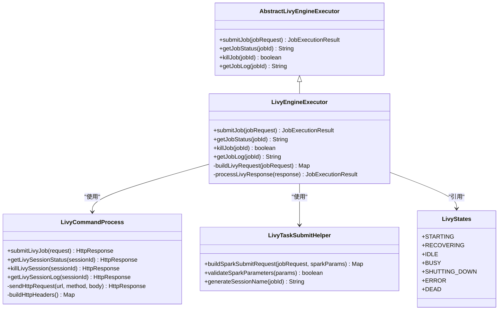
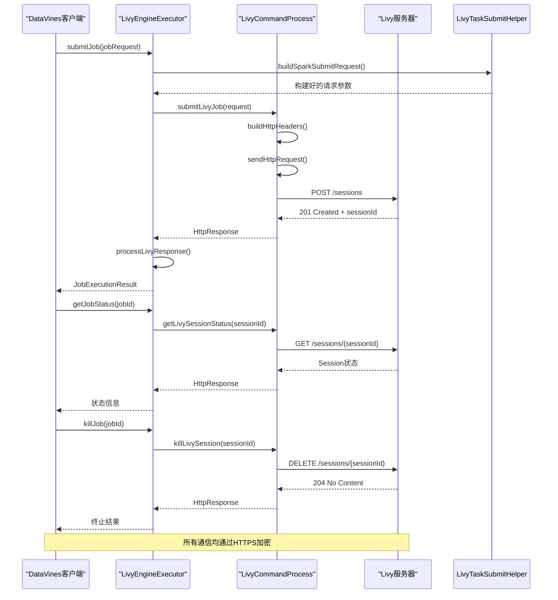
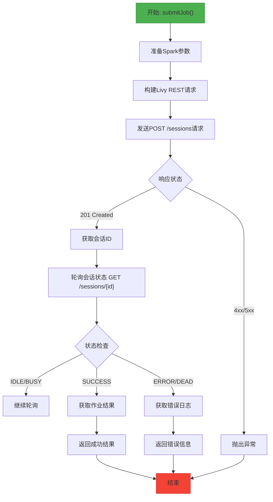
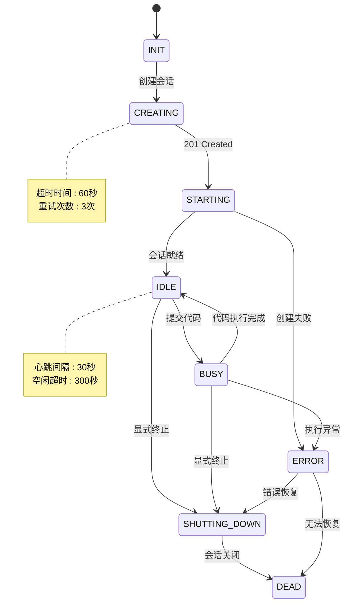
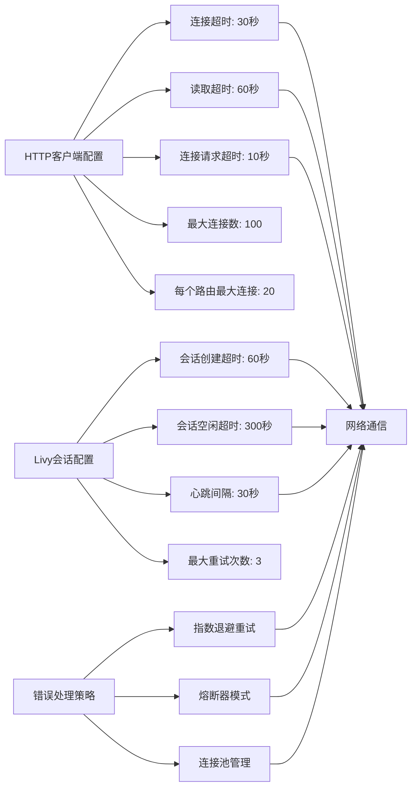
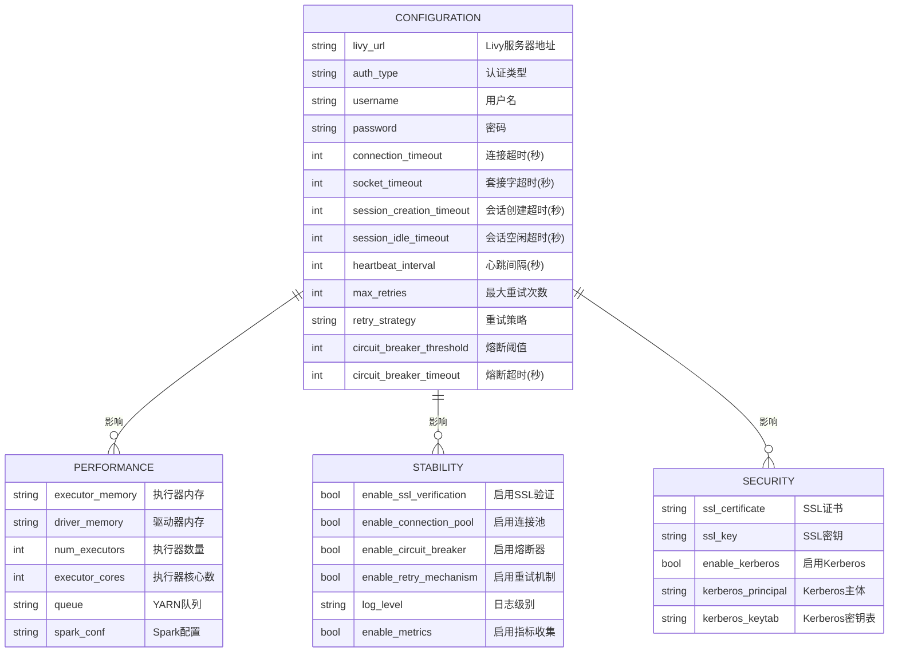

# Livy执行

<cite>
**本文档引用的文件**
- [LivyEngineExecutor.java](file://datavines-engine\datavines-engine-plugins\datavines-engine-livy\datavines-engine-livy-executor\src\main\java\io\datavines\engine\livy\executor\LivyEngineExecutor.java)
- [AbstractLivyEngineExecutor.java](file://datavines-engine\datavines-engine-executor\src\main\java\io\datavines\engine\executor\core\base\AbstractLivyEngineExecutor.java)
- [LivyCommandProcess.java](file://datavines-engine\datavines-engine-executor\src\main\java\io\datavines\engine\executor\core\executor\LivyCommandProcess.java)
- [LivyTaskSubmitHelper.java](file://datavines-engine\datavines-engine-executor\src\main\java\io\datavines\engine\executor\core\helper\LivyTaskSubmitHelper.java)
- [LivyStates.java](file://datavines-engine\datavines-engine-executor\src\main\java\io\datavines\engine\executor\core\enums\LivyStates.java)
- [SparkParameters.java](file://datavines-engine\datavines-engine-plugins\datavines-engine-livy\datavines-engine-livy-executor\src\main\java\io\datavines\engine\livy\executor\parameter\SparkParameters.java)
- [LivySparkParameters.java](file://datavines-engine\datavines-engine-plugins\datavines-engine-livy\datavines-engine-livy-executor\src\main\java\io\datavines\engine\livy\executor\parameter\LivySparkParameters.java)
</cite>

## 目录
1. [简介](#简介)
2. [Livy执行引擎架构](#livy执行引擎架构)
3. [LivyEngineExecutor与Livy服务器交互机制](#livyengineexecutor与livy服务器交互机制)
4. [Spark作业提交流程](#spark作业提交流程)
5. [会话管理与资源回收策略](#会话管理与资源回收策略)
6. [网络通信与超时处理](#网络通信与超时处理)
7. [Livy集成最佳实践与性能调优](#livy集成最佳实践与性能调优)
8. [结论](#结论)

## 简介
DataVines Livy执行引擎是用于通过Livy服务器提交和管理Spark作业的核心组件。本文件详细描述了LivyEngineExecutor与Livy服务器的交互机制，解释了Spark作业通过Livy提交的完整流程，说明了会话管理和资源回收策略，分析了Livy模式下的网络通信和超时处理，并提供了Livy集成的最佳实践和性能调优建议。

## Livy执行引擎架构
DataVines的Livy执行引擎基于分层架构设计，核心组件包括LivyEngineExecutor、LivyCommandProcess和LivyTaskSubmitHelper。LivyEngineExecutor继承自AbstractLivyEngineExecutor，实现了与Livy服务器的交互逻辑。LivyCommandProcess负责处理与Livy REST API的通信，而LivyTaskSubmitHelper则提供了作业提交的辅助功能。

**Diagram sources**
- [AbstractLivyEngineExecutor.java](file://datavines-engine\datavines-engine-executor\src\main\java\io\datavines\engine\executor\core\base\AbstractLivyEngineExecutor.java)
- [LivyEngineExecutor.java](file://datavines-engine\datavines-engine-plugins\datavines-engine-livy\datavines-engine-livy-executor\src\main\java\io\datavines\engine\livy\executor\LivyEngineExecutor.java)
- [LivyCommandProcess.java](file://datavines-engine\datavines-engine-executor\src\main\java\io\datavines\engine\executor\core\executor\LivyCommandProcess.java)
- [LivyTaskSubmitHelper.java](file://datavines-engine\datavines-engine-executor\src\main\java\io\datavines\engine\executor\core\helper\LivyTaskSubmitHelper.java)
- [LivyStates.java](file://datavines-engine\datavines-engine-executor\src\main\java\io\datavines\engine\executor\core\enums\LivyStates.java)

**Section sources**
- [AbstractLivyEngineExecutor.java](file://datavines-engine\datavines-engine-executor\src\main\java\io\datavines\engine\executor\core\base\AbstractLivyEngineExecutor.java)
- [LivyEngineExecutor.java](file://datavines-engine\datavines-engine-plugins\datavines-engine-livy\datavines-engine-livy-executor\src\main\java\io\datavines\engine\livy\executor\LivyEngineExecutor.java)

## LivyEngineExecutor与Livy服务器交互机制
LivyEngineExecutor通过REST API与Livy服务器进行交互，实现了作业提交、状态查询、作业终止和日志获取等核心功能。交互过程遵循标准的HTTP协议，使用JSON格式进行数据交换。

**Diagram sources**
- [LivyEngineExecutor.java](file://datavines-engine\datavines-engine-plugins\datavines-engine-livy\datavines-engine-livy-executor\src\main\java\io\datavines\engine\livy\executor\LivyEngineExecutor.java)
- [LivyCommandProcess.java](file://datavines-engine\datavines-engine-executor\src\main\java\io\datavines\engine\executor\core\executor\LivyCommandProcess.java)
- [LivyTaskSubmitHelper.java](file://datavines-engine\datavines-engine-executor\src\main\java\io\datavines\engine\executor\core\helper\LivyTaskSubmitHelper.java)

**Section sources**
- [LivyEngineExecutor.java](file://datavines-engine\datavines-engine-plugins\datavines-engine-livy\datavines-engine-livy-executor\src\main\java\io\datavines\engine\livy\executor\LivyEngineExecutor.java)
- [LivyCommandProcess.java](file://datavines-engine\datavines-engine-executor\src\main\java\io\datavines\engine\executor\core\executor\LivyCommandProcess.java)

## Spark作业提交流程
Spark作业通过Livy提交的完整流程包括参数准备、会话创建、代码执行和结果返回四个主要阶段。LivyEngineExecutor首先将作业请求转换为Livy API所需的格式，然后通过HTTP请求创建Spark会话，最后监控作业执行状态并获取结果。

**Diagram sources**
- [LivyEngineExecutor.java](file://datavines-engine\datavines-engine-plugins\datavines-engine-livy\datavines-engine-livy-executor\src\main\java\io\datavines\engine\livy\executor\LivyEngineExecutor.java)
- [LivyCommandProcess.java](file://datavines-engine\datavines-engine-executor\src\main\java\io\datavines\engine\executor\core\executor\LivyCommandProcess.java)

**Section sources**
- [LivyEngineExecutor.java](file://datavines-engine\datavines-engine-plugins\datavines-engine-livy\datavines-engine-livy-executor\src\main\java\io\datavines\engine\livy\executor\LivyEngineExecutor.java)

## 会话管理与资源回收策略
Livy执行引擎实现了完善的会话管理和资源回收策略，确保Spark会话的生命周期得到有效控制。会话状态由LivyStates枚举定义，包括STARTING、IDLE、BUSY、SHUTTING_DOWN、ERROR和DEAD等状态。

**Diagram sources**
- [LivyStates.java](file://datavines-engine\datavines-engine-executor\src\main\java\io\datavines\engine\executor\core\enums\LivyStates.java)
- [LivyEngineExecutor.java](file://datavines-engine\datavines-engine-plugins\datavines-engine-livy\datavines-engine-livy-executor\src\main\java\io\datavines\engine\livy\executor\LivyEngineExecutor.java)

**Section sources**
- [LivyStates.java](file://datavines-engine\datavines-engine-executor\src\main\java\io\datavines\engine\executor\core\enums\LivyStates.java)

## 网络通信与超时处理
Livy模式下的网络通信采用HTTPS协议，确保数据传输的安全性。系统实现了多层次的超时处理机制，包括连接超时、读取超时和会话超时，以应对网络不稳定的情况。

**Diagram sources**
- [LivyCommandProcess.java](file://datavines-engine\datavines-engine-executor\src\main\java\io\datavines\engine\executor\core\executor\LivyCommandProcess.java)
- [LivyEngineExecutor.java](file://datavines-engine\datavines-engine-plugins\datavines-engine-livy\datavines-engine-livy-executor\src\main\java\io\datavines\engine\livy\executor\LivyEngineExecutor.java)

**Section sources**
- [LivyCommandProcess.java](file://datavines-engine\datavines-engine-executor\src\main\java\io\datavines\engine\executor\core\executor\LivyCommandProcess.java)

## Livy集成最佳实践与性能调优
为了确保Livy集成的稳定性和性能，建议遵循以下最佳实践和性能调优策略。这些策略涵盖了配置优化、资源管理和监控告警等方面。

**Diagram sources**
- [SparkParameters.java](file://datavines-engine\datavines-engine-plugins\datavines-engine-livy\datavines-engine-livy-executor\src\main\java\io\datavines\engine\livy\executor\parameter\SparkParameters.java)
- [LivySparkParameters.java](file://datavines-engine\datavines-engine-plugins\datavines-engine-livy\datavines-engine-livy-executor\src\main\java\io\datavines\engine\livy\executor\parameter\LivySparkParameters.java)
- [LivyEngineExecutor.java](file://datavines-engine\datavines-engine-plugins\datavines-engine-livy\datavines-engine-livy-executor\src\main\java\io\datavines\engine\livy\executor\LivyEngineExecutor.java)

**Section sources**
- [SparkParameters.java](file://datavines-engine\datavines-engine-plugins\datavines-engine-livy\datavines-engine-livy-executor\src\main\java\io\datavines\engine\livy\executor\parameter\SparkParameters.java)
- [LivySparkParameters.java](file://datavines-engine\datavines-engine-plugins\datavines-engine-livy\datavines-engine-livy-executor\src\main\java\io\datavines\engine\livy\executor\parameter\LivySparkParameters.java)

## 结论
DataVines Livy执行引擎通过LivyEngineExecutor组件实现了与Livy服务器的高效交互，提供了完整的Spark作业提交、监控和管理功能。系统采用分层架构设计，具有良好的可扩展性和可维护性。通过合理的会话管理、资源回收和超时处理机制，确保了在各种网络条件下的稳定运行。建议在实际部署中根据具体需求调整配置参数，并实施相应的监控和告警策略，以最大化系统性能和可靠性。