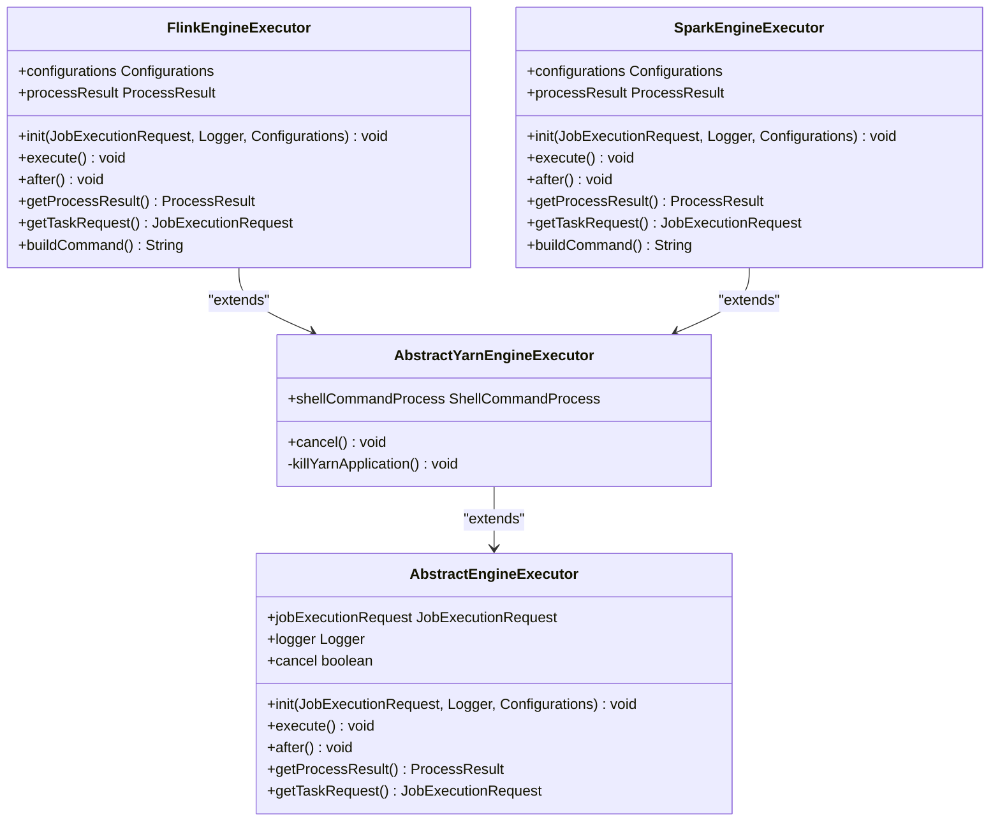
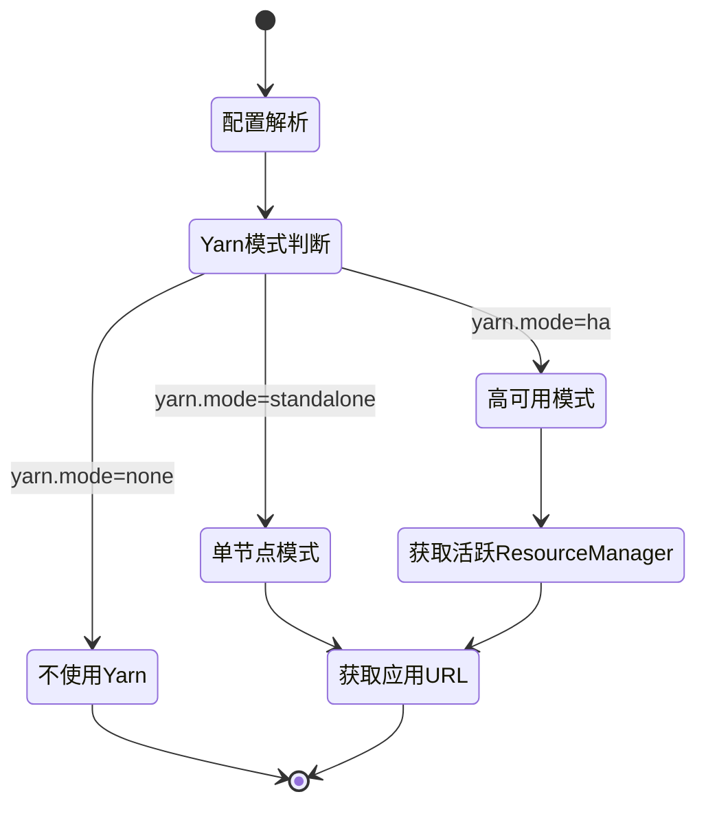
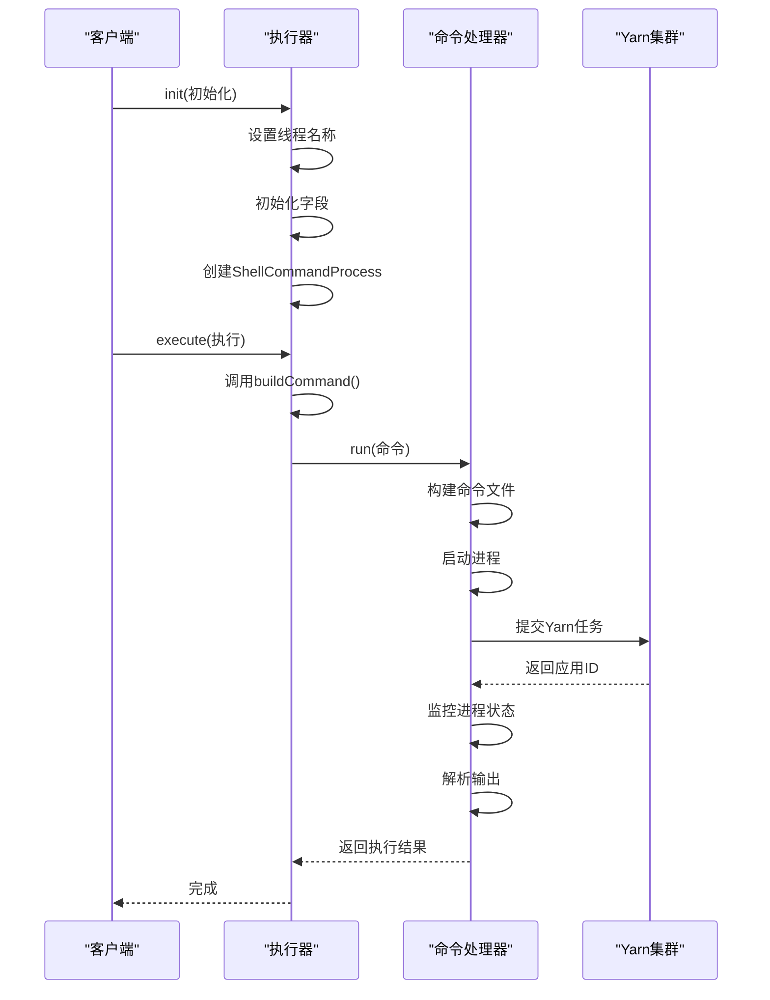
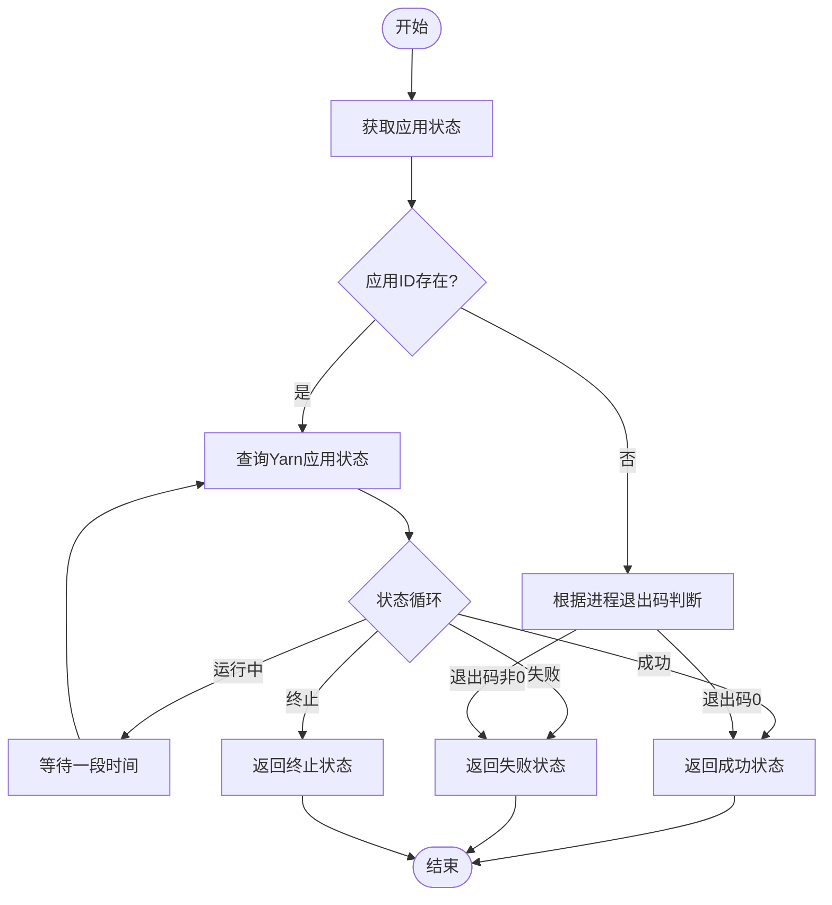
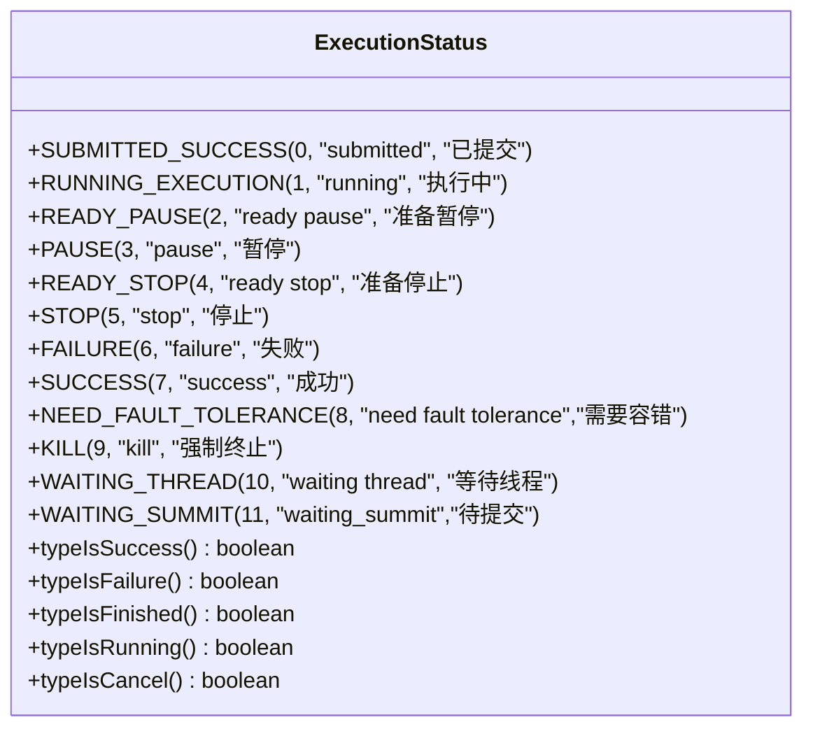
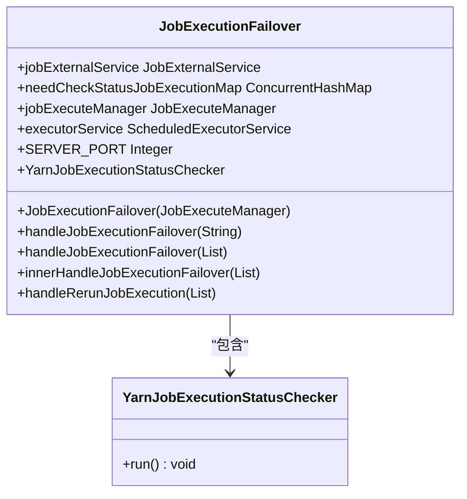
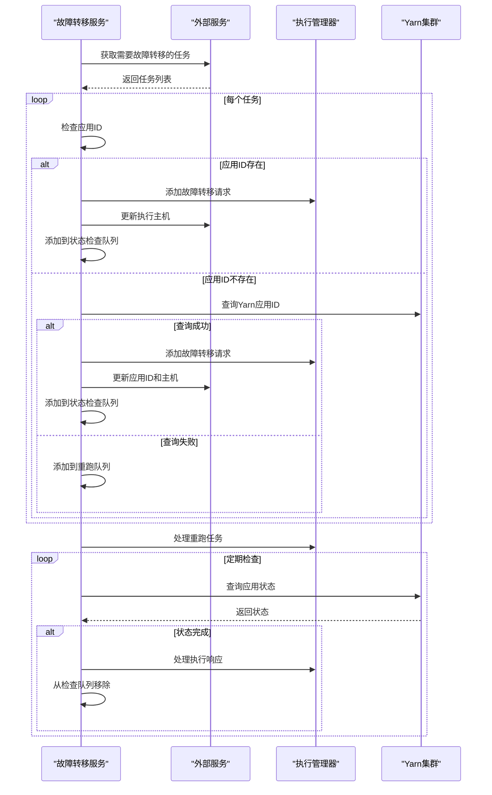

# Yarn执行

<cite>
**本文档引用的文件**   
- [AbstractYarnEngineExecutor.java](file://datavines-engine/datavines-engine-executor/src/main/java/io/datavines/engine/executor/core/base/AbstractYarnEngineExecutor.java)
- [YarnUtils.java](file://datavines-common/src/main/java/io/datavines/common/utils/YarnUtils.java)
- [ExecutionStatus.java](file://datavines-common/src/main/java/io/datavines/common/enums/ExecutionStatus.java)
- [BaseCommandProcess.java](file://datavines-engine/datavines-engine-executor/src/main/java/io/datavines/engine/executor/core/executor/BaseCommandProcess.java)
- [FlinkEngineExecutor.java](file://datavines-engine/datavines-engine-plugins/datavines-engine-flink/datavines-engine-flink-executor/src/main/java/io/datavines/engine/flink/executor/FlinkEngineExecutor.java)
- [SparkEngineExecutor.java](file://datavines-engine/datavines-engine-plugins/datavines-engine-spark/datavines-engine-spark-executor/src/main/java/io/datavines/engine/spark/executor/SparkEngineExecutor.java)
- [JobExecutionFailover.java](file://datavines-server/src/main/java/io/datavines/server/dqc/coordinator/failover/JobExecutionFailover.java)
- [CommonConstants.java](file://datavines-common/src/main/java/io/datavines/common/CommonConstants.java)
</cite>

## 目录
1. [Yarn执行引擎概述](#yarn执行引擎概述)
2. [AbstractYarnEngineExecutor抽象设计](#abstractyarnengineexecutor抽象设计)
3. [Yarn资源调度工作原理](#yarn资源调度工作原理)
4. [任务提交到Yarn集群的流程](#任务提交到yarn集群的流程)
5. [状态监控机制](#状态监控机制)
6. [容错和重试策略](#容错和重试策略)
7. [Yarn配置优化建议](#yarn配置优化建议)
8. [常见问题解决方案](#常见问题解决方案)

## Yarn执行引擎概述

DataVines Yarn执行引擎是DataVines平台的核心组件之一，负责在Yarn集群上执行数据质量检查任务。该引擎通过抽象设计实现了对不同计算框架（如Flink、Spark）的统一调度和管理。Yarn执行引擎的主要功能包括任务提交、资源调度、状态监控、容错处理等。

Yarn执行引擎的设计遵循了分层架构原则，通过抽象基类和具体实现类的分离，实现了代码的可扩展性和可维护性。引擎的核心是`AbstractYarnEngineExecutor`抽象类，它定义了Yarn执行器的基本行为和接口。具体的执行器实现（如`FlinkEngineExecutor`和`SparkEngineExecutor`）继承自该抽象类，并根据具体计算框架的特点实现相应的功能。

**本文档引用的文件**   
- [AbstractYarnEngineExecutor.java](file://datavines-engine/datavines-engine-executor/src/main/java/io/datavines/engine/executor/core/base/AbstractYarnEngineExecutor.java)
- [FlinkEngineExecutor.java](file://datavines-engine/datavines-engine-plugins/datavines-engine-flink/datavines-engine-flink-executor/src/main/java/io/datavines/engine/flink/executor/FlinkEngineExecutor.java)
- [SparkEngineExecutor.java](file://datavines-engine/datavines-engine-plugins/datavines-engine-spark/datavines-engine-spark-executor/src/main/java/io/datavines/engine/spark/executor/SparkEngineExecutor.java)

## AbstractYarnEngineExecutor抽象设计

`AbstractYarnEngineExecutor`是DataVines Yarn执行引擎的核心抽象类，定义了所有Yarn执行器的公共行为和接口。该类继承自`AbstractEngineExecutor`，并提供了Yarn特定的功能实现。



**图表来源**
- [AbstractYarnEngineExecutor.java](file://datavines-engine/datavines-engine-executor/src/main/java/io/datavines/engine/executor/core/base/AbstractYarnEngineExecutor.java#L25-L59)
- [FlinkEngineExecutor.java](file://datavines-engine/datavines-engine-plugins/datavines-engine-flink/datavines-engine-flink-executor/src/main/java/io/datavines/engine/flink/executor/FlinkEngineExecutor.java#L38-L87)
- [SparkEngineExecutor.java](file://datavines-engine/datavines-engine-plugins/datavines-engine-spark/datavines-engine-spark-executor/src/main/java/io/datavines/engine/spark/executor/SparkEngineExecutor.java#L41-L87)

### 核心字段和方法

`AbstractYarnEngineExecutor`类定义了以下核心字段和方法：

- `shellCommandProcess`: `ShellCommandProcess`类型的字段，用于执行shell命令和管理进程
- `cancel()`: 重写父类的取消方法，除了调用父类的取消逻辑外，还增加了Yarn应用的终止功能
- `killYarnApplication()`: 私有方法，用于终止Yarn上的应用程序

`cancel()`方法的实现体现了Yarn执行器的特殊性。当任务被取消时，不仅要取消本地进程，还要通过Yarn命令终止远程的Yarn应用。这种方法确保了资源的及时释放，避免了资源泄漏。

### 继承关系和多态性

`AbstractYarnEngineExecutor`通过继承`AbstractEngineExecutor`类，实现了代码的复用和扩展。`AbstractEngineExecutor`定义了执行器的基本接口，而`AbstractYarnEngineExecutor`在此基础上增加了Yarn特定的功能。

具体的执行器实现（如`FlinkEngineExecutor`和`SparkEngineExecutor`）通过继承`AbstractYarnEngineExecutor`，获得了Yarn执行的基本能力。同时，它们可以根据具体计算框架的特点，实现特定的功能。这种设计模式体现了面向对象编程的多态性原则，使得系统具有良好的扩展性。

**本文档引用的文件**   
- [AbstractYarnEngineExecutor.java](file://datavines-engine/datavines-engine-executor/src/main/java/io/datavines/engine/executor/core/base/AbstractYarnEngineExecutor.java)
- [FlinkEngineExecutor.java](file://datavines-engine/datavines-engine-plugins/datavines-engine-flink/datavines-engine-flink-executor/src/main/java/io/datavines/engine/flink/executor/FlinkEngineExecutor.java)
- [SparkEngineExecutor.java](file://datavines-engine/datavines-engine-plugins/datavines-engine-spark/datavines-engine-spark-executor/src/main/java/io/datavines/engine/spark/executor/SparkEngineExecutor.java)

## Yarn资源调度工作原理

DataVines Yarn执行引擎的资源调度工作原理基于Yarn的资源管理机制。引擎通过YarnUtils工具类与Yarn集群进行交互，实现了资源的申请、监控和释放。

### Yarn模式配置

YarnUtils类定义了三种Yarn模式：

- `none`: 不使用Yarn资源管理
- `ha`: Yarn高可用模式
- `standalone`: Yarn独立模式



**图表来源**
- [YarnUtils.java](file://datavines-common/src/main/java/io/datavines/common/utils/YarnUtils.java#L33-L76)

### 资源调度流程

Yarn资源调度的主要流程如下：

1. **配置解析**: 从配置中读取Yarn相关参数，包括模式、ResourceManager地址、端口等
2. **模式判断**: 根据配置确定Yarn模式（none、standalone或ha）
3. **ResourceManager定位**: 在高可用模式下，通过HTTP请求确定活跃的ResourceManager
4. **应用URL构建**: 根据ResourceManager地址构建Yarn应用的状态查询URL
5. **资源申请**: 通过构建的命令提交任务到Yarn集群

在高可用模式下，系统会通过访问ResourceManager的集群信息接口来确定哪个节点处于ACTIVE状态。这个过程通过`getActiveResourceManagerName`方法实现，它会尝试访问配置中列出的所有ResourceManager节点，直到找到处于ACTIVE状态的节点。

### 应用状态查询

YarnUtils提供了`getApplicationUrl`方法来构建应用状态查询URL。该方法根据Yarn模式的不同，采用不同的URL构建策略：

- 在standalone模式下，直接使用配置的地址
- 在ha模式下，通过`getAppAddress`方法动态确定活跃ResourceManager的地址
- 在none模式下，不启用Yarn功能

这种设计确保了系统在不同Yarn部署模式下的兼容性，使得DataVines可以在各种Yarn环境中正常运行。

**本文档引用的文件**   
- [YarnUtils.java](file://datavines-common/src/main/java/io/datavines/common/utils/YarnUtils.java)
- [CommonConstants.java](file://datavines-common/src/main/java/io/datavines/common/CommonConstants.java)

## 任务提交到Yarn集群的流程

DataVines任务提交到Yarn集群的流程是一个复杂的过程，涉及多个组件的协同工作。整个流程从任务初始化开始，到最终的命令执行结束。

### 任务提交序列图



**图表来源**
- [SparkEngineExecutor.java](file://datavines-engine/datavines-engine-plugins/datavines-engine-spark/datavines-engine-spark-executor/src/main/java/io/datavines/engine/spark/executor/SparkEngineExecutor.java#L64-L72)
- [BaseCommandProcess.java](file://datavines-engine/datavines-engine-executor/src/main/java/io/datavines/engine/executor/core/executor/BaseCommandProcess.java#L81-L127)

### 详细流程分析

任务提交流程可以分为以下几个阶段：

#### 1. 初始化阶段

在`init`方法中，执行器完成以下初始化工作：
- 设置线程名称，便于日志追踪
- 初始化必要的字段，如`jobExecutionRequest`、`logger`等
- 创建`ShellCommandProcess`实例，用于后续的命令执行

#### 2. 命令构建阶段

`buildCommand`方法负责构建实际提交到Yarn的命令。以`SparkEngineExecutor`为例，该方法会：
- 解析任务参数
- 设置主JAR包路径
- 构建插件目录路径
- 添加必要的JAR包依赖
- 设置主类和参数
- 添加Yarn标签用于后续的状态查询

#### 3. 命令执行阶段

`BaseCommandProcess`类的`run`方法负责执行构建好的命令：
- 创建命令文件
- 构建`ProcessBuilder`并设置工作目录
- 配置进程的用户权限（通过sudo）
- 启动进程并监控其状态
- 收集和处理进程输出

#### 4. 状态确定阶段

任务执行完成后，需要确定最终状态：
- 如果不是Yarn任务，直接根据进程退出码判断
- 如果是Yarn任务，通过`isSuccessOfYarnState`方法查询Yarn应用的最终状态

这种分阶段的设计使得任务提交流程清晰明了，每个阶段都有明确的职责，便于维护和扩展。

**本文档引用的文件**   
- [SparkEngineExecutor.java](file://datavines-engine/datavines-engine-plugins/datavines-engine-spark/datavines-engine-spark-executor/src/main/java/io/datavines/engine/spark/executor/SparkEngineExecutor.java)
- [BaseCommandProcess.java](file://datavines-engine/datavines-engine-executor/src/main/java/io/datavines/engine/executor/core/executor/BaseCommandProcess.java)

## 状态监控机制

DataVines Yarn执行引擎的状态监控机制是确保任务可靠执行的关键。系统通过多种方式监控任务状态，包括本地进程监控和Yarn应用状态查询。

### 状态监控流程



**图表来源**
- [BaseCommandProcess.java](file://datavines-engine/datavines-engine-executor/src/main/java/io/datavines/engine/executor/core/executor/BaseCommandProcess.java#L109-L113)
- [YarnUtils.java](file://datavines-common/src/main/java/io/datavines/common/utils/YarnUtils.java#L242-L266)

### 执行状态枚举

系统定义了详细的执行状态枚举`ExecutionStatus`，用于表示任务的各种状态：



**图表来源**
- [ExecutionStatus.java](file://datavines-common/src/main/java/io/datavines/common/enums/ExecutionStatus.java#L45-L56)

### 状态转换逻辑

状态监控的核心逻辑在`isSuccessOfYarnState`方法中实现：

1. **循环查询**: 在`Stopper.isRunning()`条件下循环查询应用状态
2. **状态判断**: 根据Yarn返回的最终状态确定任务状态
3. **结果映射**: 将Yarn状态映射到`ExecutionStatus`枚举
4. **异常处理**: 处理网络异常和其他可能的错误

系统通过`Thread.sleep(CommonConstants.SLEEP_TIME_MILLIS)`实现轮询间隔，避免过于频繁的查询对Yarn ResourceManager造成压力。

### 辅助监控功能

除了核心的状态查询功能，系统还提供了以下辅助监控功能：

- **日志处理**: 通过`parseProcessOutput`方法实时收集和处理进程输出
- **缓冲刷新**: 当日志缓冲区达到一定大小或时间间隔时，自动刷新到日志系统
- **进程ID获取**: 通过反射获取本地进程ID，便于进程管理

这些功能共同构成了一个完整的状态监控体系，确保了任务执行状态的准确性和可靠性。

**本文档引用的文件**   
- [YarnUtils.java](file://datavines-common/src/main/java/io/datavines/common/utils/YarnUtils.java)
- [ExecutionStatus.java](file://datavines-common/src/main/java/io/datavines/common/enums/ExecutionStatus.java)
- [BaseCommandProcess.java](file://datavines-engine/datavines-engine-executor/src/main/java/io/datavines/engine/executor/core/executor/BaseCommandProcess.java)

## 容错和重试策略

DataVines Yarn执行引擎的容错和重试策略是确保系统高可用性的关键。系统通过`JobExecutionFailover`类实现了完善的故障转移机制。

### 容错机制架构



**图表来源**
- [JobExecutionFailover.java](file://datavines-server/src/main/java/io/datavines/server/dqc/coordinator/failover/JobExecutionFailover.java#L43-L151)

### 故障转移流程



**图表来源**
- [JobExecutionFailover.java](file://datavines-server/src/main/java/io/datavines/server/dqc/coordinator/failover/JobExecutionFailover.java#L63-L143)

### 详细容错策略

#### 1. 故障检测

系统通过`handleJobExecutionFailover`方法检测需要故障转移的任务。该方法可以接收单个主机或主机列表作为参数，查询在这些主机上需要故障转移的任务。

#### 2. 状态恢复

对于每个需要故障转移的任务，系统尝试恢复其执行状态：
- 如果任务已经有应用ID，直接将其添加到状态检查队列
- 如果没有应用ID，尝试通过`getYarnAppId`方法从Yarn集群查询
- 如果查询成功，更新任务的执行信息并添加到检查队列
- 如果查询失败，将任务添加到重跑队列

#### 3. 状态监控

系统通过`YarnJobExecutionStatusChecker`定时任务定期检查处于监控状态的任务：
- 查询Yarn应用的当前状态
- 如果状态为成功、失败或终止，向执行管理器发送响应命令
- 从检查队列中移除已完成的任务

#### 4. 重试机制

对于无法恢复状态的任务，系统通过`handleRerunJobExecution`方法将其重新提交执行。这种机制确保了即使在节点故障的情况下，任务也能最终完成。

### 定时任务配置

容错机制通过`ScheduledExecutorService`实现定时任务：

```java
executorService.scheduleAtFixedRate(new YarnJobExecutionStatusChecker(),0,4, TimeUnit.SECONDS);
```

该配置表示：
- 初始延迟：0秒
- 执行间隔：4秒
- 时间单位：秒

这种配置确保了状态检查的及时性，同时避免了过于频繁的查询对系统造成压力。

**本文档引用的文件**   
- [JobExecutionFailover.java](file://datavines-server/src/main/java/io/datavines/server/dqc/coordinator/failover/JobExecutionFailover.java)
- [YarnUtils.java](file://datavines-common/src/main/java/io/datavines/common/utils/YarnUtils.java)

## Yarn配置优化建议

为了确保DataVines Yarn执行引擎的高效运行，以下是针对Yarn配置的优化建议：

### 核心配置参数

| 配置项 | 默认值 | 说明 |
|-------|-------|------|
| yarn.mode | none | Yarn模式，可选值：none、standalone、ha |
| yarn.resource.manager.ha.ids | 无 | Yarn ResourceManager高可用ID列表 |
| yarn.application.status.address | 无 | Yarn应用状态查询地址 |
| yarn.resource.manager.http.address.port | 8088 | Yarn ResourceManager HTTP端口 |

### 高可用模式配置

在生产环境中，建议使用Yarn高可用模式（ha），以提高系统的可靠性。配置示例如下：

```properties
yarn.mode=ha
yarn.resource.manager.ha.ids=rm1,rm2
yarn.application.status.address=http://rm-host:%d/ws/v1/cluster/apps/%s
yarn.resource.manager.http.address.port=8088
```

### 性能优化建议

1. **合理设置轮询间隔**: 调整`CommonConstants.SLEEP_TIME_MILLIS`的值，平衡状态查询的及时性和系统负载
2. **优化日志缓冲**: 根据实际需求调整`CoreConfig.LOG_CACHE_ROW_NUM`和`CoreConfig.LOG_FLUSH_INTERVAL`
3. **资源预留**: 为DataVines执行器预留足够的Yarn资源，避免资源竞争
4. **网络优化**: 确保DataVines服务器与Yarn集群之间的网络连接稳定

### 安全配置

1. **用户权限**: 确保执行器使用的用户具有足够的权限提交和管理Yarn应用
2. **认证配置**: 根据Yarn集群的安全配置，设置相应的认证机制
3. **日志安全**: 敏感信息过滤，避免在日志中暴露敏感数据

### 监控和告警

1. **集成监控系统**: 将Yarn应用状态与现有的监控系统集成
2. **设置告警规则**: 对长时间运行或失败的任务设置告警
3. **定期审计**: 定期审计Yarn应用的执行情况，发现潜在问题

这些建议可以帮助用户优化Yarn配置，提高DataVines系统的性能和可靠性。

**本文档引用的文件**   
- [YarnUtils.java](file://datavines-common/src/main/java/io/datavines/common/utils/YarnUtils.java)
- [CommonConstants.java](file://datavines-common/src/main/java/io/datavines/common/CommonConstants.java)

## 常见问题解决方案

在使用DataVines Yarn执行引擎时，可能会遇到各种问题。以下是常见问题及其解决方案：

### 1. 任务提交失败

**问题现象**: 任务提交时出现连接超时或拒绝连接错误

**可能原因**:
- Yarn ResourceManager地址配置错误
- 网络连接问题
- 用户权限不足

**解决方案**:
1. 检查`yarn.application.status.address`配置是否正确
2. 确认网络连接是否正常
3. 验证执行用户是否有足够的权限
4. 检查Yarn集群是否正常运行

### 2. 无法获取应用状态

**问题现象**: 任务提交成功，但无法获取Yarn应用状态

**可能原因**:
- Yarn高可用配置不正确
- ResourceManager状态查询接口不可用
- 应用标签不匹配

**解决方案**:
1. 检查`yarn.resource.manager.ha.ids`配置
2. 验证ResourceManager的REST API是否可访问
3. 确认任务提交时使用的标签与查询时一致
4. 检查Yarn集群的日志，查找具体错误信息

### 3. 任务状态不更新

**问题现象**: 任务长时间处于"运行中"状态，但实际已结束

**可能原因**:
- 状态查询轮询间隔过长
- Yarn应用状态更新延迟
- 网络问题导致状态查询失败

**解决方案**:
1. 调整`CommonConstants.SLEEP_TIME_MILLIS`值，缩短轮询间隔
2. 检查Yarn集群的性能，确保状态更新及时
3. 验证网络连接的稳定性
4. 增加状态查询的重试机制

### 4. 资源不足

**问题现象**: 任务提交失败，提示资源不足

**可能原因**:
- Yarn集群资源紧张
- 任务资源配置过高
- 资源队列配额限制

**解决方案**:
1. 检查Yarn集群的资源使用情况
2. 优化任务的资源配置（内存、CPU等）
3. 调整资源队列的配额
4. 考虑在资源空闲时段提交任务

### 5. 故障转移失败

**问题现象**: 节点故障后，任务未能自动转移到其他节点

**可能原因**:
- 故障检测机制未正常工作
- 状态恢复失败
- 重试机制配置不当

**解决方案**:
1. 检查`JobExecutionFailover`服务是否正常运行
2. 验证Yarn应用ID的查询逻辑
3. 确认重试队列的处理机制
4. 检查相关日志，定位具体问题

通过以上解决方案，可以有效应对使用DataVines Yarn执行引擎时遇到的常见问题，确保系统的稳定运行。

**本文档引用的文件**   
- [YarnUtils.java](file://datavines-common/src/main/java/io/datavines/common/utils/YarnUtils.java)
- [JobExecutionFailover.java](file://datavines-server/src/main/java/io/datavines/server/dqc/coordinator/failover/JobExecutionFailover.java)