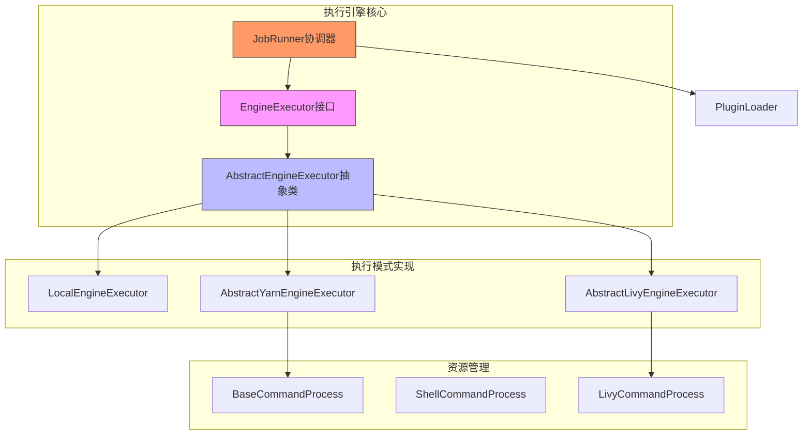
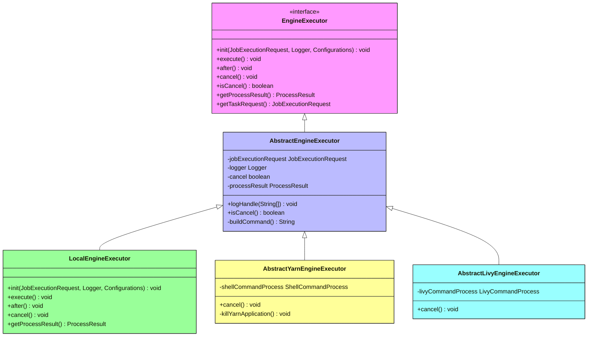
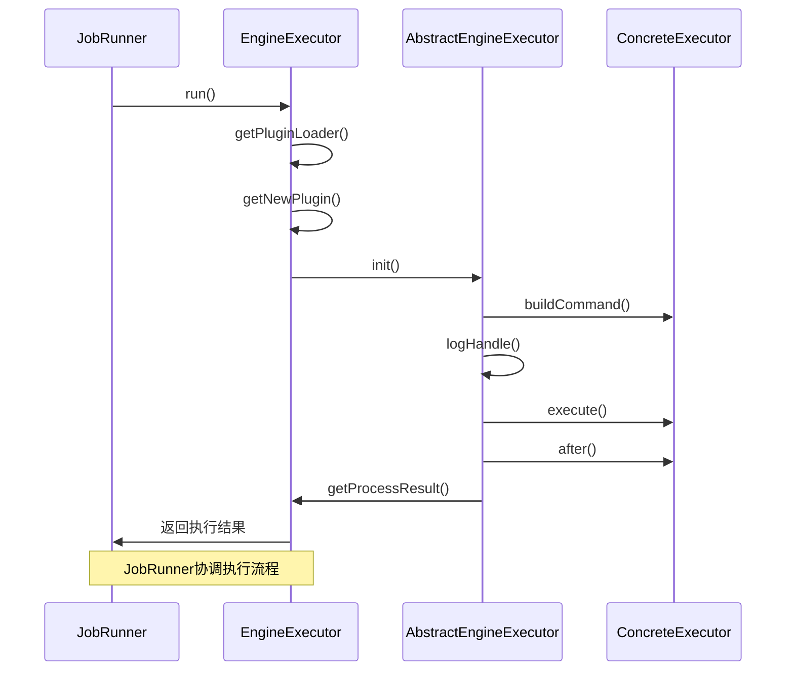
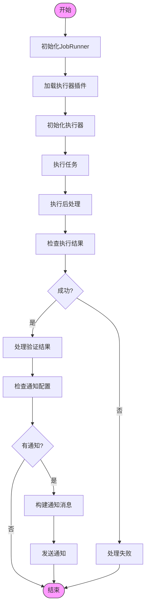
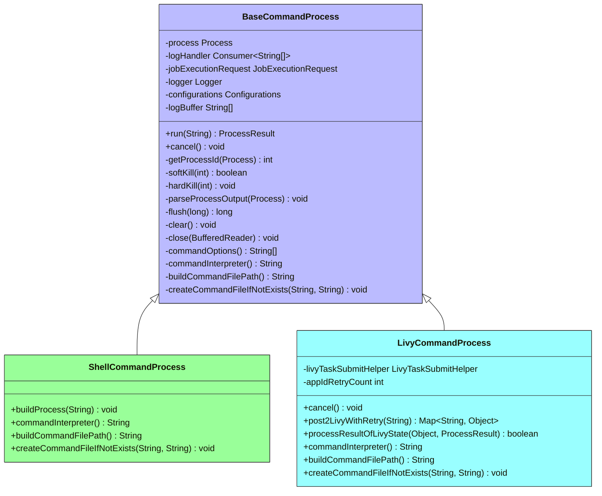
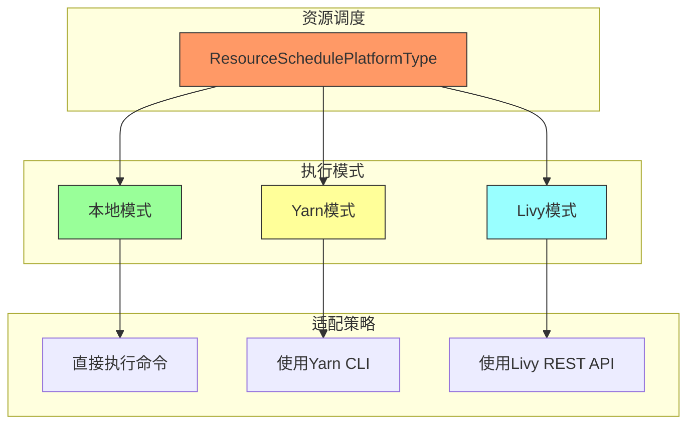
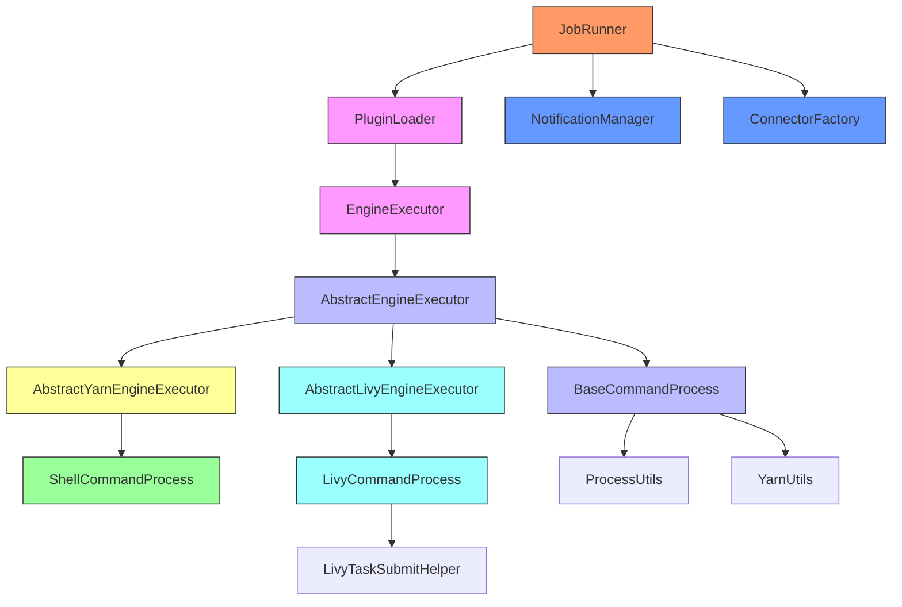

# 执行引擎

<cite>
**本文档引用的文件**   
- [EngineExecutor.java](file://datavines-engine/datavines-engine-api/src/main/java/io/datavines/engine/api/engine/EngineExecutor.java)
- [AbstractEngineExecutor.java](file://datavines-engine/datavines-engine-executor/src/main/java/io/datavines/engine/executor/core/base/AbstractEngineExecutor.java)
- [AbstractYarnEngineExecutor.java](file://datavines-engine/datavines-engine-executor/src/main/java/io/datavines/engine/executor/core/base/AbstractYarnEngineExecutor.java)
- [AbstractLivyEngineExecutor.java](file://datavines-engine/datavines-engine-executor/src/main/java/io/datavines/engine/executor/core/base/AbstractLivyEngineExecutor.java)
- [BaseCommandProcess.java](file://datavines-engine/datavines-engine-executor/src/main/java/io/datavines/engine/executor/core/executor/BaseCommandProcess.java)
- [LivyCommandProcess.java](file://datavines-engine/datavines-engine-executor/src/main/java/io/datavines/engine/executor/core/executor/LivyCommandProcess.java)
- [JobRunner.java](file://datavines-runner/src/main/java/io/datavines/runner/JobRunner.java)
- [ResourceSchedulePlatformType.java](file://datavines-engine/datavines-engine-executor/src/main/java/io/datavines/engine/executor/core/enums/ResourceSchedulePlatformType.java)
- [RuntimeEnvironment.java](file://datavines-engine/datavines-engine-api/src/main/java/io/datavines/engine/api/env/RuntimeEnvironment.java)
- [EngineConstants.java](file://datavines-engine/datavines-engine-api/src/main/java/io/datavines/engine/api/EngineConstants.java)
</cite>

## 目录
1. [简介](#简介)
2. [核心组件](#核心组件)
3. [架构概述](#架构概述)
4. [详细组件分析](#详细组件分析)
5. [依赖分析](#依赖分析)
6. [性能考虑](#性能考虑)
7. [故障排除指南](#故障排除指南)
8. [结论](#结论)

## 简介
DataVines执行引擎是数据质量验证系统的核心组件，负责协调和执行各种数据质量检查任务。该引擎设计为可扩展和可插拔的架构，支持多种执行模式，包括本地、Yarn和Livy。执行引擎通过定义清晰的接口和抽象基类，实现了任务执行的核心机制，同时提供了资源管理和隔离功能。

## 核心组件

执行引擎的核心组件包括`EngineExecutor`接口、`AbstractEngineExecutor`抽象类、`JobRunner`协调器以及各种具体的执行器实现。这些组件共同协作，实现了任务的初始化、执行、监控和清理。`EngineExecutor`接口定义了执行器的基本契约，而`AbstractEngineExecutor`通过模板方法模式提供了通用的执行逻辑。`JobRunner`作为协调者，负责创建和管理执行器实例，并处理执行结果。

**核心组件**
- [EngineExecutor.java](file://datavines-engine/datavines-engine-api/src/main/java/io/datavines/engine/api/engine/EngineExecutor.java#L27-L42)
- [AbstractEngineExecutor.java](file://datavines-engine/datavines-engine-executor/src/main/java/io/datavines/engine/executor/core/base/AbstractEngineExecutor.java#L27-L56)
- [JobRunner.java](file://datavines-runner/src/main/java/io/datavines/runner/JobRunner.java#L50-L187)

## 架构概述

**图表来源**
- [EngineExecutor.java](file://datavines-engine/datavines-engine-api/src/main/java/io/datavines/engine/api/engine/EngineExecutor.java)
- [AbstractEngineExecutor.java](file://datavines-engine/datavines-engine-executor/src/main/java/io/datavines/engine/executor/core/base/AbstractEngineExecutor.java)
- [JobRunner.java](file://datavines-runner/src/main/java/io/datavines/runner/JobRunner.java)

## 详细组件分析

### EngineExecutor接口设计

`EngineExecutor`接口是执行引擎的核心契约，定义了所有执行器必须实现的基本方法。该接口采用SPI（Service Provider Interface）机制，允许系统动态加载不同类型的执行器实现。接口设计遵循了典型的生命周期模式，包括初始化、执行、后处理和取消操作。

**图表来源**
- [EngineExecutor.java](file://datavines-engine/datavines-engine-api/src/main/java/io/datavines/engine/api/engine/EngineExecutor.java#L27-L42)
- [AbstractEngineExecutor.java](file://datavines-engine/datavines-engine-executor/src/main/java/io/datavines/engine/executor/core/base/AbstractEngineExecutor.java#L27-L56)

**核心组件**
- [EngineExecutor.java](file://datavines-engine/datavines-engine-api/src/main/java/io/datavines/engine/api/engine/EngineExecutor.java#L27-L42)

### AbstractEngineExecutor模板模式

`AbstractEngineExecutor`类实现了模板方法设计模式，为所有具体的执行器提供了通用的基础功能。该抽象类实现了`EngineExecutor`接口，并定义了一个抽象方法`buildCommand()`，要求子类提供具体的命令构建逻辑。这种设计模式确保了执行流程的一致性，同时允许子类在特定步骤进行定制。

**图表来源**
- [AbstractEngineExecutor.java](file://datavines-engine/datavines-engine-executor/src/main/java/io/datavines/engine/executor/core/base/AbstractEngineExecutor.java#L27-L56)
- [JobRunner.java](file://datavines-runner/src/main/java/io/datavines/runner/JobRunner.java#L63-L152)

**核心组件**
- [AbstractEngineExecutor.java](file://datavines-engine/datavines-engine-executor/src/main/java/io/datavines/engine/executor/core/base/AbstractEngineExecutor.java#L27-L56)

### JobRunner执行协调

`JobRunner`类负责协调整个任务执行过程，是连接调度系统和执行引擎的桥梁。它使用插件加载器动态创建适当的执行器实例，并按照预定义的顺序调用其生命周期方法。执行完成后，`JobRunner`还负责处理结果验证和通知发送。

**图表来源**
- [JobRunner.java](file://datavines-runner/src/main/java/io/datavines/runner/JobRunner.java#L63-L152)

**核心组件**
- [JobRunner.java](file://datavines-runner/src/main/java/io/datavines/runner/JobRunner.java#L50-L187)

### 资源管理与隔离

执行引擎通过`BaseCommandProcess`和其子类实现了资源管理和隔离机制。这些类负责创建和管理操作系统进程，处理输入输出流，并提供进程取消功能。对于不同的执行平台，引擎提供了相应的适配器来处理特定的资源管理需求。

**图表来源**
- [BaseCommandProcess.java](file://datavines-engine/datavines-engine-executor/src/main/java/io/datavines/engine/executor/core/executor/BaseCommandProcess.java#L41-L364)
- [LivyCommandProcess.java](file://datavines-engine/datavines-engine-executor/src/main/java/io/datavines/engine/executor/core/executor/LivyCommandProcess.java#L38-L142)

**核心组件**
- [BaseCommandProcess.java](file://datavines-engine/datavines-engine-executor/src/main/java/io/datavines/engine/executor/core/executor/BaseCommandProcess.java#L41-L364)

### 执行模式适配策略

执行引擎支持多种执行模式，每种模式都有相应的适配策略。本地模式直接在当前JVM中执行任务，Yarn模式通过Yarn资源管理器调度任务，而Livy模式则通过Livy服务提交Spark作业。这些模式通过继承`AbstractEngineExecutor`并实现特定的抽象方法来适配不同的执行环境。

**图表来源**
- [ResourceSchedulePlatformType.java](file://datavines-engine/datavines-engine-executor/src/main/java/io/datavines/engine/executor/core/enums/ResourceSchedulePlatformType.java#L19-L60)
- [AbstractYarnEngineExecutor.java](file://datavines-engine/datavines-engine-executor/src/main/java/io/datavines/engine/executor/core/base/AbstractYarnEngineExecutor.java#L25-L59)
- [AbstractLivyEngineExecutor.java](file://datavines-engine/datavines-engine-executor/src/main/java/io/datavines/engine/executor/core/base/AbstractLivyEngineExecutor.java#L23-L36)

**核心组件**
- [ResourceSchedulePlatformType.java](file://datavines-engine/datavines-engine-executor/src/main/java/io/datavines/engine/executor/core/enums/ResourceSchedulePlatformType.java#L19-L60)

## 依赖分析

**图表来源**
- [JobRunner.java](file://datavines-runner/src/main/java/io/datavines/runner/JobRunner.java#L50-L187)
- [EngineExecutor.java](file://datavines-engine/datavines-engine-api/src/main/java/io/datavines/engine/api/engine/EngineExecutor.java#L27-L42)
- [AbstractEngineExecutor.java](file://datavines-engine/datavines-engine-executor/src/main/java/io/datavines/engine/executor/core/base/AbstractEngineExecutor.java#L27-L56)

**核心组件**
- [JobRunner.java](file://datavines-runner/src/main/java/io/datavines/runner/JobRunner.java#L50-L187)

## 性能考虑

执行引擎在设计时考虑了多个性能因素。首先，通过使用缓冲机制来减少日志I/O操作的频率，`BaseCommandProcess`类中的`logBuffer`和`flush`方法实现了批量日志处理。其次，执行器的生命周期管理避免了资源泄漏，确保进程在完成或取消时被正确清理。此外，使用线程池处理进程输出流的读取，避免了阻塞主线程。

对于大规模任务执行，建议使用Yarn或Livy模式，这些模式可以利用集群资源进行分布式处理。本地模式适用于小规模任务或开发测试环境。监控指标应包括任务执行时间、资源使用率、失败率和通知发送成功率。

**核心组件**
- [BaseCommandProcess.java](file://datavines-engine/datavines-engine-executor/src/main/java/io/datavines/engine/executor/core/executor/BaseCommandProcess.java#L68-L310)

## 故障排除指南

当执行引擎出现问题时，可以从以下几个方面进行排查：首先检查日志文件，特别是任务执行日志和系统日志；其次验证配置文件的正确性，确保所有必需的参数都已正确设置；然后检查网络连接，特别是使用Livy模式时需要确保与Livy服务器的通信正常。

常见的问题包括权限不足、资源不足、配置错误和网络问题。对于权限问题，确保执行用户有足够的权限访问所需资源；对于资源问题，检查集群资源是否充足；对于配置问题，仔细核对配置文件中的参数；对于网络问题，使用网络诊断工具检查连接状态。

**核心组件**
- [JobRunner.java](file://datavines-runner/src/main/java/io/datavines/runner/JobRunner.java#L149-L151)
- [BaseCommandProcess.java](file://datavines-engine/datavines-engine-executor/src/main/java/io/datavines/engine/executor/core/executor/BaseCommandProcess.java#L120-L124)

## 结论

DataVines执行引擎通过精心设计的接口和抽象类，实现了灵活可扩展的任务执行框架。`EngineExecutor`接口定义了执行器的基本契约，`AbstractEngineExecutor`通过模板方法模式提供了通用的执行逻辑，而`JobRunner`则负责协调整个执行过程。引擎支持多种执行模式，包括本地、Yarn和Livy，能够适应不同的部署环境和性能需求。

资源管理和隔离机制确保了任务执行的安全性和稳定性，而插件化架构使得系统易于扩展和维护。通过合理的性能优化和监控，执行引擎能够高效地处理大规模数据质量验证任务。未来可以考虑增加更多执行模式支持，如Kubernetes，并进一步优化资源调度算法。