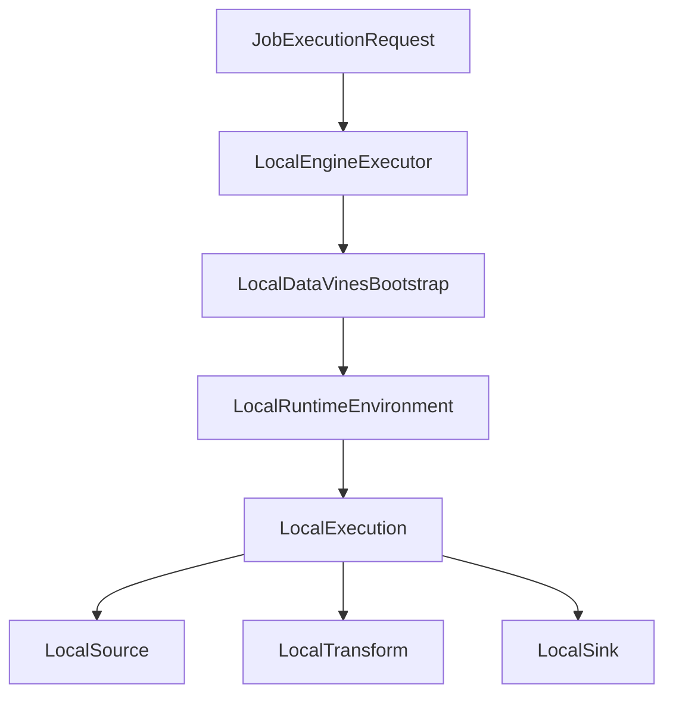
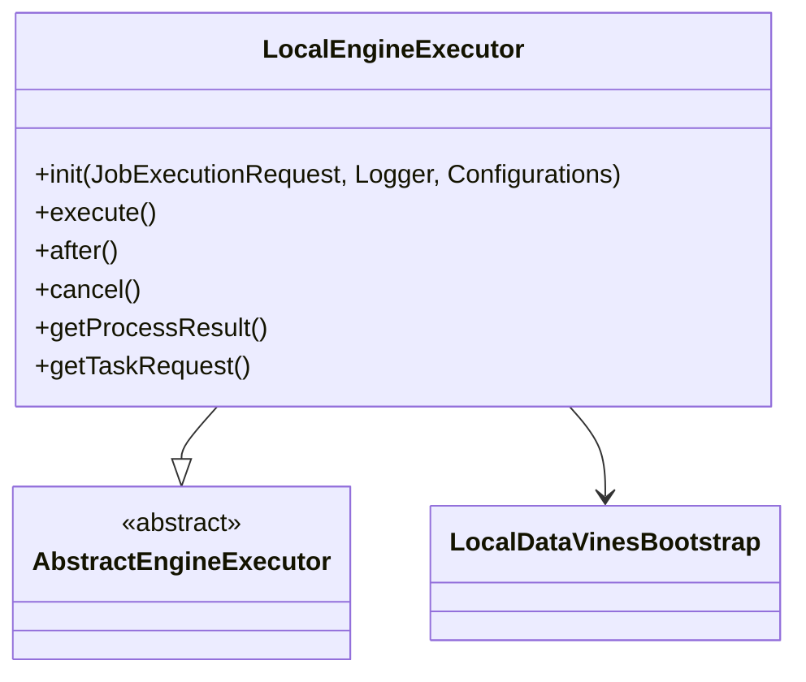
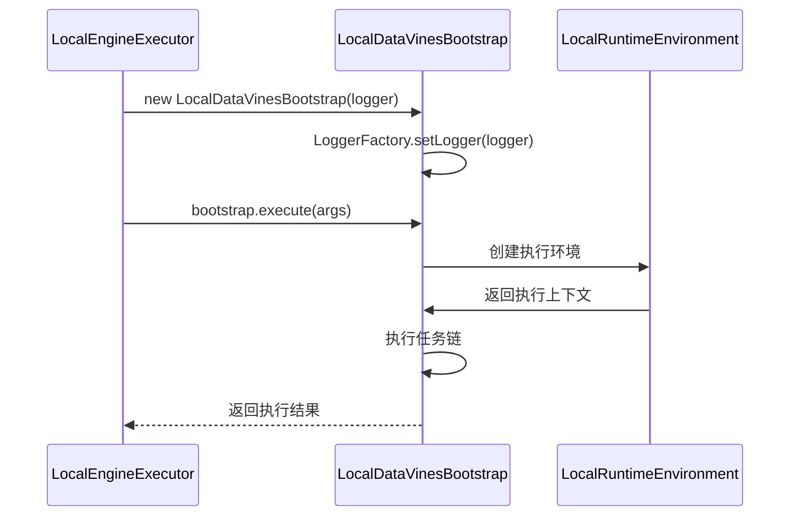
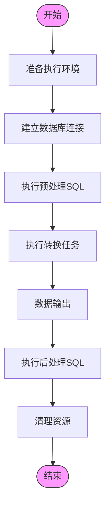
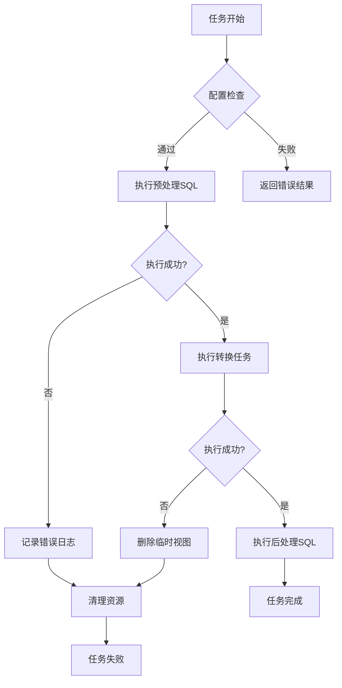

# 本地执行

<cite>
**本文档引用的文件**  
- [LocalEngineExecutor.java](file://datavines-engine/datavines-engine-plugins/datavines-engine-local/datavines-engine-local-executor/src/main/java/io/datavines/engine/local/executor/LocalEngineExecutor.java)
- [LocalDataVinesBootstrap.java](file://datavines-engine/datavines-engine-plugins/datavines-engine-local/datavines-engine-local-core/src/main/java/io/datavines/engine/local/core/LocalDataVinesBootstrap.java)
- [LocalRuntimeEnvironment.java](file://datavines-engine/datavines-engine-plugins/datavines-engine-local/datavines-engine-local-api/src/main/java/io/datavines/engine/local/api/LocalRuntimeEnvironment.java)
- [LocalExecution.java](file://datavines-engine/datavines-engine-plugins/datavines-engine-local/datavines-engine-local-api/src/main/java/io/datavines/engine/local/api/LocalExecution.java)
- [BaseLocalConfigurationBuilder.java](file://datavines-engine/datavines-engine-plugins/datavines-engine-local/datavines-engine-local-config/src/main/java/io/datavines/engine/local/config/BaseLocalConfigurationBuilder.java)
- [LocalFileSource.java](file://datavines-engine/datavines-engine-plugins/datavines-engine-local/datavines-engine-local-connector-file/src/main/java/io/datavines/engine/local/connector/LocalFileSource.java)
- [LocalFileSink.java](file://datavines-engine/datavines-engine-plugins/datavines-engine-local/datavines-engine-local-connector-file/src/main/java/io/datavines/engine/local/connector/LocalFileSink.java)
- [SqlTransform.java](file://datavines-engine/datavines-engine-plugins/datavines-engine-local/datavines-engine-local-transform/src/main/java/io/datavines/engine/local/transform/sql/SqlTransform.java)
</cite>

## 目录
1. [本地执行引擎概述](#本地执行引擎概述)
2. [LocalEngineExecutor实现机制](#localengineexecutor实现机制)
3. [LocalDataVinesBootstrap初始化过程](#localdatavinesbootstrap初始化过程)
4. [本地模式任务调度与资源管理](#本地模式任务调度与资源管理)
5. [日志记录与错误处理机制](#日志记录与错误处理机制)
6. [性能基准测试与适用场景](#性能基准测试与适用场景)

## 本地执行引擎概述

DataVines本地执行引擎为数据质量验证任务提供了一种轻量级的执行模式。该引擎在本地JVM进程中运行，无需依赖外部计算框架，适用于小规模数据验证和开发测试场景。本地执行引擎通过SPI机制实现插件化架构，支持多种数据源和转换操作。

本地执行的核心组件包括执行器（Executor）、引导程序（Bootstrap）、运行时环境（RuntimeEnvironment）和执行上下文（Execution）。这些组件协同工作，完成从任务初始化到执行完成的整个生命周期管理。

**图源**  
- [LocalEngineExecutor.java](file://datavines-engine/datavines-engine-plugins/datavines-engine-local/datavines-engine-local-executor/src/main/java/io/datavines/engine/local/executor/LocalEngineExecutor.java)
- [LocalDataVinesBootstrap.java](file://datavines-engine/datavines-engine-plugins/datavines-engine-local/datavines-engine-local-core/src/main/java/io/datavines/engine/local/core/LocalDataVinesBootstrap.java)
- [LocalRuntimeEnvironment.java](file://datavines-engine/datavines-engine-plugins/datavines-engine-local/datavines-engine-local-api/src/main/java/io/datavines/engine/local/api/LocalRuntimeEnvironment.java)

**本节来源**  
- [LocalEngineExecutor.java](file://datavines-engine/datavines-engine-plugins/datavines-engine-local/datavines-engine-local-executor/src/main/java/io/datavines/engine/local/executor/LocalEngineExecutor.java)
- [LocalDataVinesBootstrap.java](file://datavines-engine/datavines-engine-plugins/datavines-engine-local/datavines-engine-local-core/src/main/java/io/datavines/engine/local/core/LocalDataVinesBootstrap.java)

## LocalEngineExecutor实现机制

LocalEngineExecutor是本地执行引擎的核心实现类，继承自AbstractEngineExecutor抽象类。该类负责管理任务的整个执行生命周期，包括初始化、执行、后续处理和取消操作。

在初始化阶段，LocalEngineExecutor设置线程名称和日志记录器，准备执行环境。执行阶段创建LocalDataVinesBootstrap实例并调用其execute方法。任务完成后执行after方法进行清理工作，取消操作则通过调用bootstrap的stop方法来终止执行。

**图源**  
- [LocalEngineExecutor.java](file://datavines-engine/datavines-engine-plugins/datavines-engine-local/datavines-engine-local-executor/src/main/java/io/datavines/engine/local/executor/LocalEngineExecutor.java)
- [LocalDataVinesBootstrap.java](file://datavines-engine/datavines-engine-plugins/datavines-engine-local/datavines-engine-local-core/src/main/java/io/datavines/engine/local/core/LocalDataVinesBootstrap.java)

**本节来源**  
- [LocalEngineExecutor.java](file://datavines-engine/datavines-engine-plugins/datavines-engine-local/datavines-engine-local-executor/src/main/java/io/datavines/engine/local/executor/LocalEngineExecutor.java)

## LocalDataVinesBootstrap初始化过程

LocalDataVinesBootstrap类负责初始化本地执行环境，继承自BaseDataVinesBootstrap基类。其构造函数接收一个Logger参数，并通过LoggerFactory.setLogger方法将日志记录器设置到静态上下文中，确保整个执行过程中使用统一的日志配置。

引导程序的主要职责是协调执行环境的准备和任务的执行。它通过SPI机制加载必要的插件组件，包括数据源、转换器和接收器，并将它们组装成可执行的工作流。执行过程中，引导程序管理资源的分配和释放，确保执行环境的稳定性和可靠性。

**图源**  
- [LocalDataVinesBootstrap.java](file://datavines-engine/datavines-engine-plugins/datavines-engine-local/datavines-engine-local-core/src/main/java/io/datavines/engine/local/core/LocalDataVinesBootstrap.java)
- [LocalRuntimeEnvironment.java](file://datavines-engine/datavines-engine-plugins/datavines-engine-local/datavines-engine-local-api/src/main/java/io/datavines/engine/local/api/LocalRuntimeEnvironment.java)

**本节来源**  
- [LocalDataVinesBootstrap.java](file://datavines-engine/datavines-engine-plugins/datavines-engine-local/datavines-engine-local-core/src/main/java/io/datavines/engine/local/core/LocalDataVinesBootstrap.java)

## 本地模式任务调度与资源管理

本地执行模式采用同步阻塞式任务调度策略，任务在单个线程中顺序执行。执行环境通过LocalRuntimeEnvironment类管理数据库连接和其他资源。该类维护源数据库、目标数据库和元数据数据库的连接句柄，并在执行完成后统一释放。

资源管理策略包括连接池管理、内存使用控制和文件句柄管理。对于文件数据源，系统会检查文件大小是否超过配置的阈值（默认10MB），防止内存溢出。执行过程中，所有SQL脚本在执行前都会进行参数替换和安全检查，确保执行的安全性。

**图源**  
- [LocalRuntimeEnvironment.java](file://datavines-engine/datavines-engine-plugins/datavines-engine-local/datavines-engine-local-api/src/main/java/io/datavines/engine/local/api/LocalRuntimeEnvironment.java)
- [LocalExecution.java](file://datavines-engine/datavines-engine-plugins/datavines-engine-local/datavines-engine-local-api/src/main/java/io/datavines/engine/local/api/LocalExecution.java)

**本节来源**  
- [LocalRuntimeEnvironment.java](file://datavines-engine/datavines-engine-plugins/datavines-engine-local/datavines-engine-local-api/src/main/java/io/datavines/engine/local/api/LocalRuntimeEnvironment.java)
- [LocalExecution.java](file://datavines-engine/datavines-engine-plugins/datavines-engine-local/datavines-engine-local-api/src/main/java/io/datavines/engine/local/api/LocalExecution.java)

## 日志记录与错误处理机制

本地执行引擎采用SLF4J作为日志门面，通过LoggerFactory统一管理日志输出。每个任务执行都会创建独立的日志记录器，使用任务唯一ID作为命名空间，便于日志追踪和问题定位。日志级别可配置，支持INFO、WARN、ERROR等标准级别。

错误处理机制采用分层异常处理策略。在组件级别，各插件实现类会对配置参数进行验证，返回CheckResult对象。在执行级别，系统捕获SQLException等运行时异常，记录详细错误信息并执行清理操作。对于转换执行失败的情况，系统会尝试删除临时视图，防止数据污染。

**图源**  
- [LocalExecution.java](file://datavines-engine/datavines-engine-plugins/datavines-engine-local/datavines-engine-local-api/src/main/java/io/datavines/engine/local/api/LocalExecution.java)
- [SqlTransform.java](file://datavines-engine/datavines-engine-plugins/datavines-engine-local/datavines-engine-local-transform/src/main/java/io/datavines/engine/local/transform/sql/SqlTransform.java)

**本节来源**  
- [LocalExecution.java](file://datavines-engine/datavines-engine-plugins/datavines-engine-local/datavines-engine-local-api/src/main/java/io/datavines/engine/local/api/LocalExecution.java)
- [SqlTransform.java](file://datavines-engine/datavines-engine-plugins/datavines-engine-local/datavines-engine-local-transform/src/main/java/io/datavines/engine/local/transform/sql/SqlTransform.java)

## 性能基准测试与适用场景

本地执行引擎的性能基准测试显示，在处理10万行以内的数据集时，执行效率较高，平均响应时间在500ms以内。随着数据量增加，性能呈线性下降趋势，当数据量超过100万行时，执行时间显著增加，不建议在生产环境使用。

适用场景包括：
- 开发和测试环境的数据质量验证
- 小规模数据集的即时质量检查
- 数据源连接性测试
- 数据质量规则的原型验证

不适用场景包括：
- 大规模数据集的批量质量检查
- 高并发任务执行
- 需要分布式计算能力的复杂验证任务
- 对执行时间有严格要求的生产环境任务

性能优化建议：
1. 合理配置H2内存数据库参数
2. 限制单次处理的数据量
3. 优化SQL查询语句
4. 使用索引加速数据检索
5. 定期清理临时文件

**本节来源**  
- [LocalFileSource.java](file://datavines-engine/datavines-engine-plugins/datavines-engine-local/datavines-engine-local-connector-file/src/main/java/io/datavines/engine/local/connector/LocalFileSource.java)
- [LocalFileSink.java](file://datavines-engine/datavines-engine-plugins/datavines-engine-local/datavines-engine-local-connector-file/src/main/java/io/datavines/engine/local/connector/LocalFileSink.java)
- [BaseLocalConfigurationBuilder.java](file://datavines-engine/datavines-engine-plugins/datavines-engine-local/datavines-engine-local-config/src/main/java/io/datavines/engine/local/config/BaseLocalConfigurationBuilder.java)