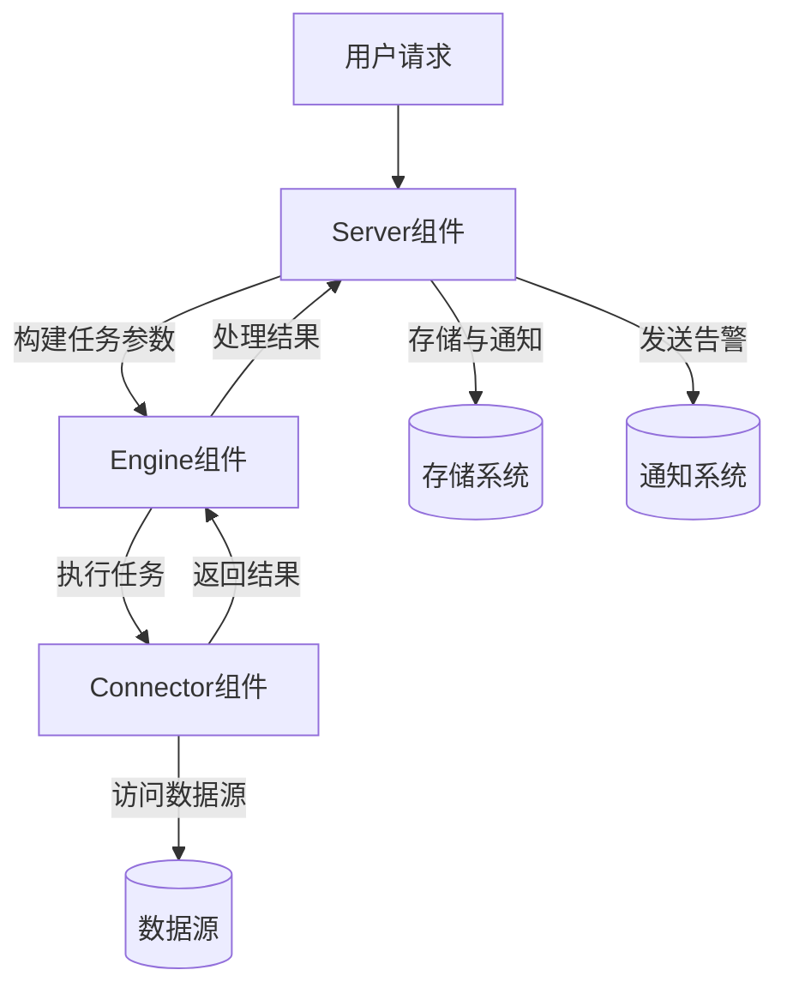
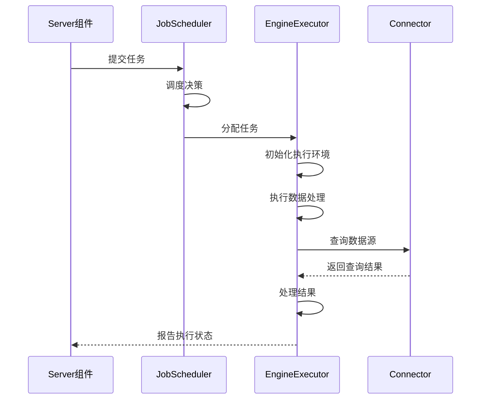
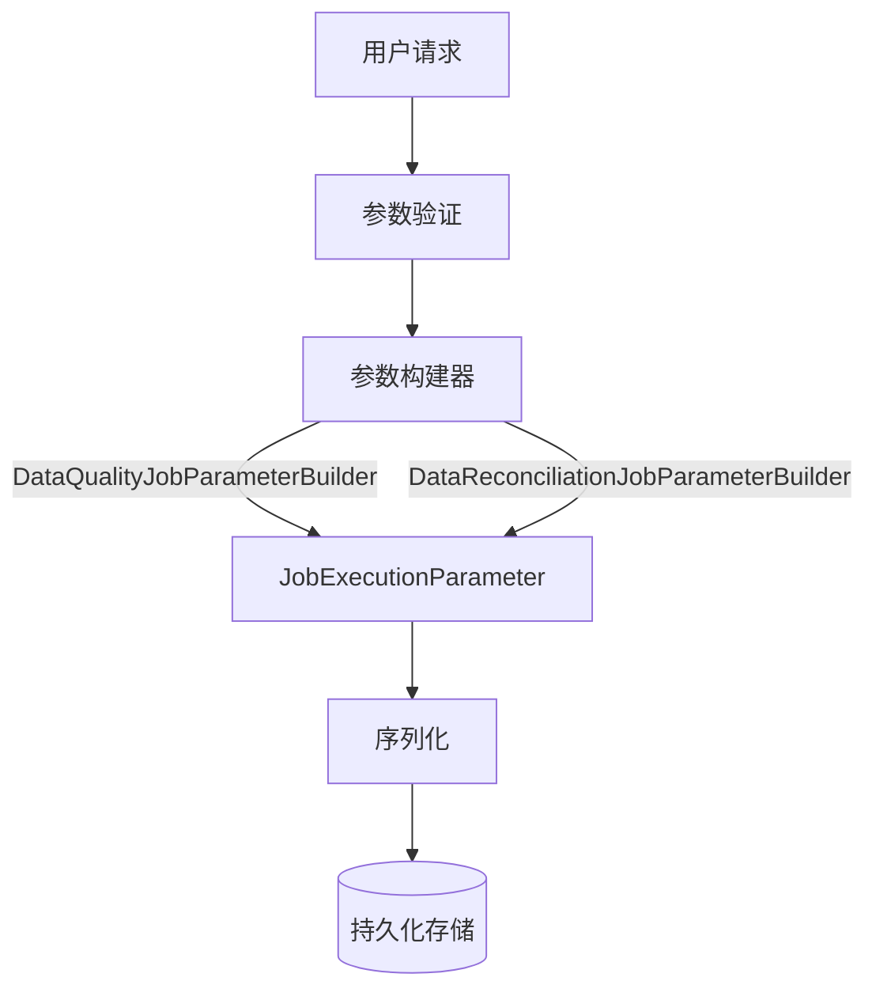
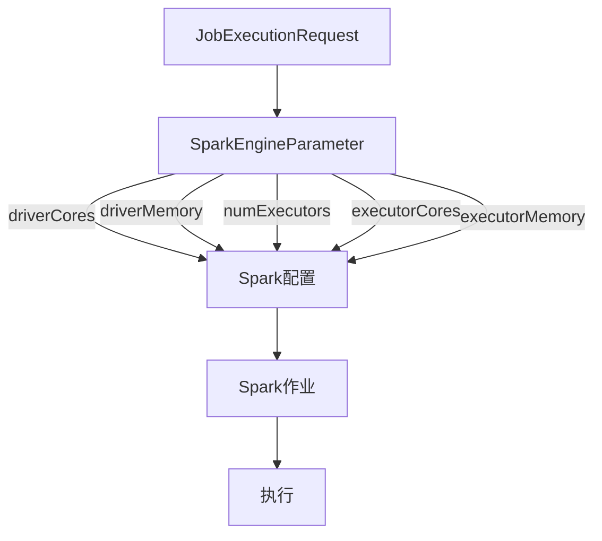
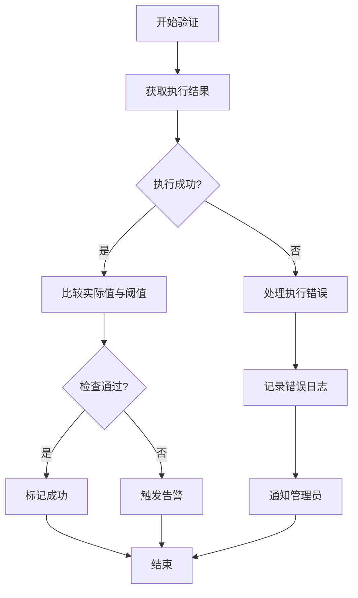

# 数据流设计

<cite>
**本文档引用的文件**   
- [JobExecutionParameter.java](file://datavines-common/src/main/java/io/datavines/common/entity/JobExecutionParameter.java)
- [JobExecutionRequest.java](file://datavines-common/src/main/java/io/datavines/common/entity/JobExecutionRequest.java)
- [SparkEngineParameter.java](file://datavines-common/src/main/java/io/datavines/common/entity/SparkEngineParameter.java)
- [ConnectorParameter.java](file://datavines-common/src/main/java/io/datavines/common/entity/ConnectorParameter.java)
- [JobExecuteBootstrap.java](file://datavines-runner/src/main/java/io/datavines/runner/JobExecuteBootstrap.java)
- [JobRunner.java](file://datavines-runner/src/main/java/io/datavines/runner/JobRunner.java)
- [EngineExecutor.java](file://datavines-engine/datavines-engine-api/src/main/java/io/datavines/engine/api/engine/EngineExecutor.java)
- [Connector.java](file://datavines-connector/datavines-connector-api/src/main/java/io/datavines/connector/api/Connector.java)
- [Executor.java](file://datavines-connector/datavines-connector-api/src/main/java/io/datavines/connector/api/Executor.java)
- [BaseJobParameter.java](file://datavines-common/src/main/java/io/datavines/common/entity/job/BaseJobParameter.java)
- [ConnectionInfo.java](file://datavines-common/src/main/java/io/datavines/common/entity/ConnectionInfo.java)
- [DataVinesServer.java](file://datavines-server/src/main/java/io/datavines/server/DataVinesServer.java)
- [BaseJobConfigurationBuilder.java](file://datavines-engine/datavines-engine-config/src/main/java/io/datavines/engine/config/BaseJobConfigurationBuilder.java)
- [JSONUtils.java](file://datavines-common/src/main/java/io/datavines/common/utils/JSONUtils.java)
- [ExecutionStatus.java](file://datavines-common/src/main/java/io/datavines/common/enums/ExecutionStatus.java)
- [MetricValidator.java](file://datavines-metric/datavines-metric-api/src/main/java/io/datavines/metric/api/MetricValidator.java)
</cite>

## 目录
1. [引言](#引言)
2. [数据流概述](#数据流概述)
3. [任务参数构建](#任务参数构建)
4. [调度与执行](#调度与执行)
5. [JobExecutionParameter构建过程](#jobexecutionparameter构建过程)
6. [执行器任务参数转换](#执行器任务参数转换)
7. [结果验证与错误处理](#结果验证与错误处理)
8. [性能瓶颈分析与优化建议](#性能瓶颈分析与优化建议)

## 引言
DataVines是一个数据质量监控系统，其核心功能是通过定义数据质量检查规则来验证数据的准确性、完整性和一致性。本设计文档详细描述了从用户请求到结果返回的完整数据流，包括任务参数构建、调度、执行和结果验证的全过程。系统采用模块化架构，包含Server、Engine和Connector三个主要组件，通过清晰的职责划分实现了灵活可扩展的数据质量检查能力。

**本文档引用的文件**   
- [DataVinesServer.java](file://datavines-server/src/main/java/io/datavines/server/DataVinesServer.java)

## 数据流概述
DataVines的数据流从用户提交质量检查请求开始，经过Server组件的参数构建和调度，传递到Engine组件执行具体的数据处理任务，最后通过Connector组件与数据源交互获取结果。整个流程体现了清晰的分层架构和组件间协作。

**图源**  
- [DataVinesServer.java](file://datavines-server/src/main/java/io/datavines/server/DataVinesServer.java)
- [JobRunner.java](file://datavines-runner/src/main/java/io/datavines/runner/JobRunner.java)
- [EngineExecutor.java](file://datavines-engine/datavines-engine-api/src/main/java/io/datavines/engine/api/engine/EngineExecutor.java)

## 任务参数构建
任务参数构建是数据流的第一步，由Server组件负责。当用户提交数据质量检查请求时，系统需要构建完整的任务执行参数，这些参数将指导后续的执行过程。

任务参数主要包括：
- **连接信息**：数据源的连接参数，包括URL、用户名、密码等
- **执行平台参数**：指定任务在哪个执行平台上运行
- **引擎参数**：特定于执行引擎的配置，如Spark引擎的driver内存、executor数量等
- **检查规则参数**：具体的质量检查规则和阈值

参数构建过程确保了所有必要的信息都被正确收集和格式化，为后续的调度和执行奠定了基础。

**本文档引用的文件**   
- [JobExecutionParameter.java](file://datavines-common/src/main/java/io/datavines/common/entity/JobExecutionParameter.java)
- [JobExecutionRequest.java](file://datavines-common/src/main/java/io/datavines/common/entity/JobExecutionRequest.java)
- [ConnectionInfo.java](file://datavines-common/src/main/java/io/datavines/common/entity/ConnectionInfo.java)

## 调度与执行
调度与执行是DataVines数据流的核心环节，负责将构建好的任务参数转化为实际的数据处理操作。

### 调度机制
Server组件中的JobScheduler负责任务调度。它从任务队列中获取待执行的任务，根据任务的优先级、资源需求和执行时间等条件进行调度决策。调度器还负责处理任务的依赖关系，确保前置任务完成后才执行后续任务。

### 执行流程
执行流程由Engine组件完成，主要步骤包括：
1. **初始化**：根据任务参数初始化执行环境
2. **执行**：运行具体的数据处理逻辑
3. **后处理**：清理资源，收集执行结果
4. **状态更新**：向Server报告任务执行状态

执行过程中，系统会监控任务的执行状态和性能指标，及时发现和处理异常情况。

**图源**  
- [DataVinesServer.java](file://datavines-server/src/main/java/io/datavines/server/DataVinesServer.java)
- [JobScheduler.java](file://datavines-server/src/main/java/io/datavines/server/dqc/coordinator/runner/JobScheduler.java)
- [EngineExecutor.java](file://datavines-engine/datavines-engine-api/src/main/java/io/datavines/engine/api/engine/EngineExecutor.java)

## JobExecutionParameter构建过程
JobExecutionParameter是任务执行的核心参数对象，其构建过程涉及多个组件的协作。

### 参数结构
JobExecutionParameter包含以下主要字段：
- **connectorParameter**：源数据源连接参数
- **connectorParameter2**：目标数据源连接参数（用于数据对比场景）
- **metricParameterList**：质量检查指标参数列表

### 构建流程
构建流程从用户请求开始，经过一系列转换和验证：

构建过程中，系统会验证参数的完整性和正确性，确保所有必需的字段都已提供且符合预期格式。对于复杂参数，如连接信息，系统会进行解析和标准化处理。

**本文档引用的文件**   
- [JobExecutionParameter.java](file://datavines-common/src/main/java/io/datavines/common/entity/JobExecutionParameter.java)
- [BaseJobParameter.java](file://datavines-common/src/main/java/io/datavines/common/entity/job/BaseJobParameter.java)
- [ConnectionInfo.java](file://datavines-common/src/main/java/io/datavines/common/entity/ConnectionInfo.java)

## 执行器任务参数转换
执行器负责将通用的任务参数转换为具体的数据源操作，这是连接抽象任务定义和实际数据处理的关键环节。

### 转换机制
转换过程主要通过以下步骤完成：
1. **参数解析**：从JobExecutionRequest中提取必要的执行参数
2. **环境配置**：根据引擎类型配置执行环境
3. **操作生成**：将质量检查规则转换为具体的SQL查询或数据处理操作
4. **执行计划**：生成最优的执行计划

### 具体实现
以Spark引擎为例，参数转换过程如下：

转换过程中，系统会考虑性能优化因素，如合理设置executor数量和内存大小，以最大化执行效率。

**本文档引用的文件**   
- [SparkEngineParameter.java](file://datavines-common/src/main/java/io/datavines/common/entity/SparkEngineParameter.java)
- [EngineExecutor.java](file://datavines-engine/datavines-engine-api/src/main/java/io/datavines/engine/api/engine/EngineExecutor.java)
- [BaseJobConfigurationBuilder.java](file://datavines-engine/datavines-engine-config/src/main/java/io/datavines/engine/config/BaseJobConfigurationBuilder.java)

## 结果验证与错误处理
结果验证与错误处理是确保数据质量检查可靠性的关键环节。

### 结果验证流程
结果验证主要通过以下步骤完成：
1. **结果获取**：从执行引擎获取原始结果数据
2. **阈值比较**：将实际值与预期值进行比较
3. **状态判断**：根据比较结果和操作符判断检查是否通过
4. **告警触发**：如果检查失败，触发相应的告警机制

### 错误处理机制
系统实现了多层次的错误处理机制：
- **参数验证错误**：在任务提交阶段验证参数完整性
- **执行错误**：捕获执行过程中的异常并进行适当处理
- **连接错误**：处理与数据源连接失败的情况
- **超时处理**：对长时间运行的任务进行超时控制

**本文档引用的文件**   
- [MetricValidator.java](file://datavines-metric/datavines-metric-api/src/main/java/io/datavines/metric/api/MetricValidator.java)
- [ExecutionStatus.java](file://datavines-common/src/main/java/io/datavines/common/enums/ExecutionStatus.java)
- [JobRunner.java](file://datavines-runner/src/main/java/io/datavines/runner/JobRunner.java)

## 性能瓶颈分析与优化建议
通过对系统架构和执行流程的分析，可以识别出潜在的性能瓶颈并提出相应的优化建议。

### 潜在性能瓶颈
1. **序列化开销**：任务参数在组件间传递时需要进行序列化和反序列化，可能成为性能瓶颈
2. **连接池管理**：频繁创建和销毁数据库连接会影响性能
3. **大规模数据处理**：处理大规模数据集时，内存使用和执行时间可能超出预期
4. **并发控制**：高并发场景下，任务调度和资源分配可能成为瓶颈

### 优化建议
1. **缓存机制**：对频繁访问的数据和配置进行缓存，减少重复计算和数据库查询
2. **连接池优化**：使用高效的连接池管理策略，复用数据库连接
3. **批量处理**：对相似任务进行批量处理，减少系统开销
4. **异步处理**：将非关键操作异步化，提高系统响应速度
5. **资源预估**：根据任务特征预估资源需求，避免资源浪费或不足

通过实施这些优化措施，可以显著提升系统的整体性能和响应能力，更好地支持大规模数据质量检查需求。

**本文档引用的文件**   
- [JSONUtils.java](file://datavines-common/src/main/java/io/datavines/common/utils/JSONUtils.java)
- [BaseJobConfigurationBuilder.java](file://datavines-engine/datavines-engine-config/src/main/java/io/datavines/engine/config/BaseJobConfigurationBuilder.java)
- [JobRunner.java](file://datavines-runner/src/main/java/io/datavines/runner/JobRunner.java)