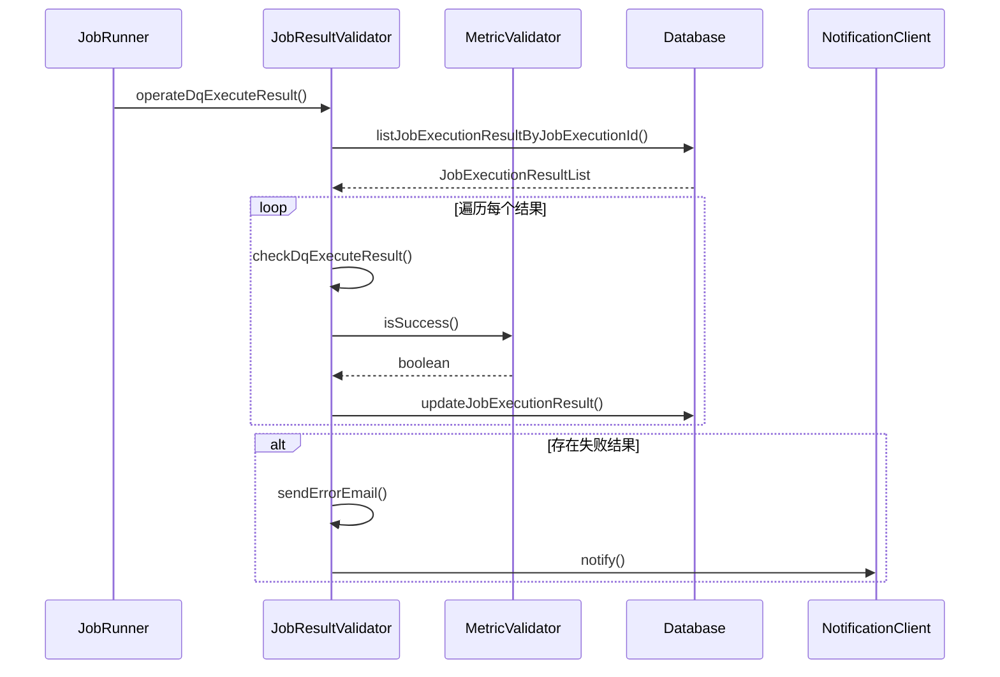
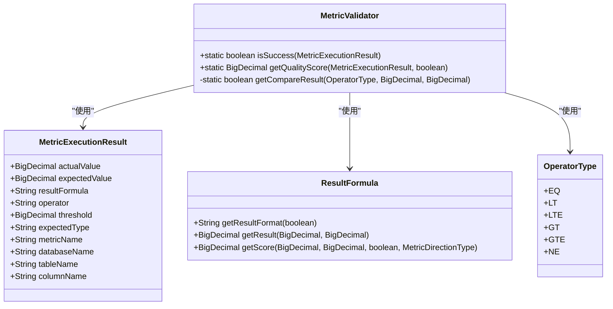
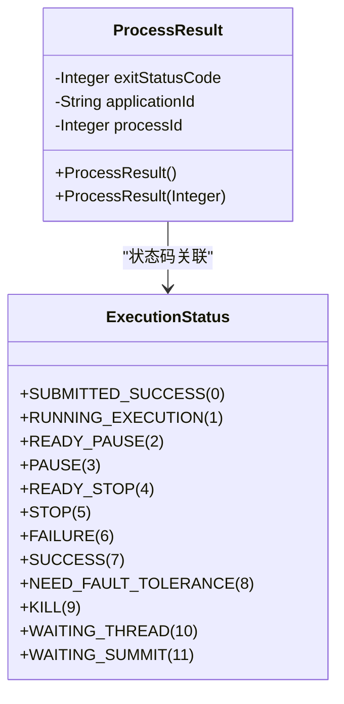
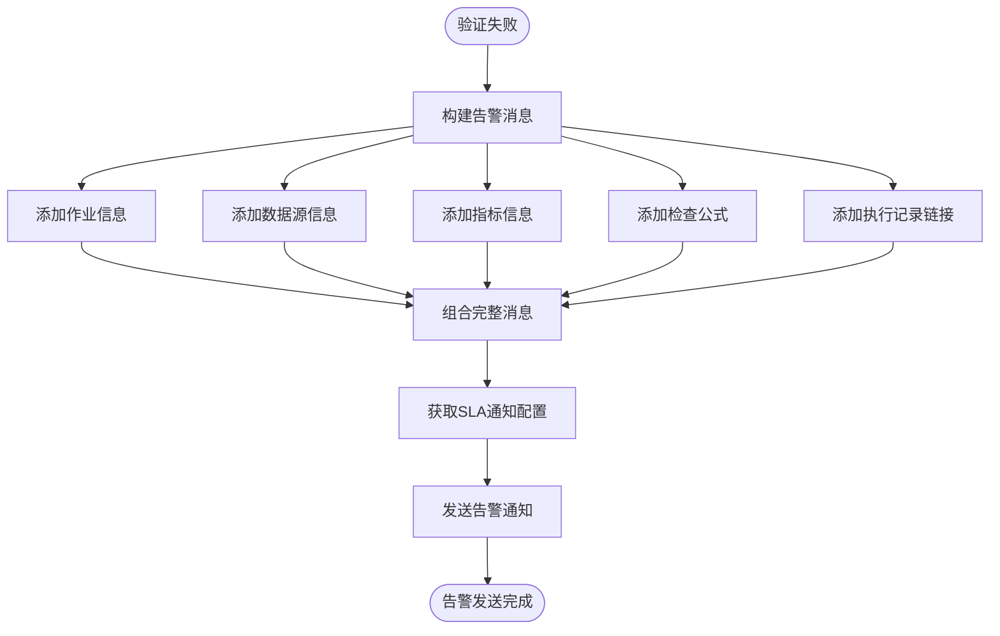
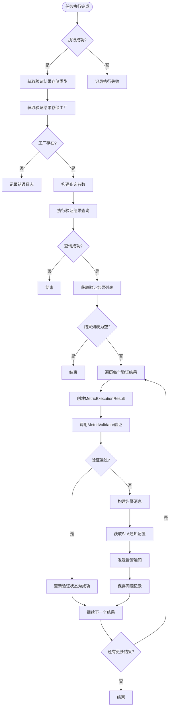

# 结果验证

<cite>
**本文档引用的文件**  
- [JobResultValidator.java](file://datavines-server/src/main/java/io/datavines/server/dqc/coordinator/validator/JobResultValidator.java)
- [MetricValidator.java](file://datavines-metric/datavines-metric-api/src/main/java/io/datavines/metric/api/MetricValidator.java)
- [ProcessResult.java](file://datavines-common/src/main/java/io/datavines/common/entity/ProcessResult.java)
- [JobRunner.java](file://datavines-runner/src/main/java/io/datavines/runner/JobRunner.java)
- [MetricExecutionResult.java](file://datavines-metric/datavines-metric-api/src/main/java/io/datavines/metric/api/MetricExecutionResult.java)
</cite>

## 目录
1. [引言](#引言)
2. [结果验证机制概述](#结果验证机制概述)
3. [JobResultValidator协调机制](#jobresultvalidator协调机制)
4. [MetricValidator接口设计与实现](#metricvalidator接口设计与实现)
5. [ProcessResult执行结果封装](#processresult执行结果封装)
6. [验证失败处理与告警机制](#验证失败处理与告警机制)
7. [结果验证流程图](#结果验证流程图)
8. [典型错误案例](#典型错误案例)
9. [性能优化与大规模处理策略](#性能优化与大规模处理策略)
10. [结论](#结论)

## 引言
DataVines结果验证机制是数据质量保障的核心组件，负责对任务执行结果进行校验、评估和告警。该机制通过JobResultValidator协调各个验证器，利用MetricValidator接口对具体指标进行验证，并通过ProcessResult封装执行结果和错误信息。本文档将详细阐述这一验证体系的工作原理、设计实现和最佳实践。

## 结果验证机制概述
DataVines的结果验证机制是一个分层架构，从任务执行到结果校验再到告警通知，形成了完整的数据质量保障闭环。该机制主要由三个核心组件构成：JobResultValidator负责整体协调，MetricValidator负责具体指标验证，ProcessResult负责执行结果封装。

验证流程始于任务执行完成后，系统会收集所有指标的执行结果，然后通过JobResultValidator进行统一验证。每个指标的验证由对应的MetricValidator实现，根据预设的阈值和操作符判断结果是否达标。验证结果会被封装在ProcessResult中，并根据验证状态触发相应的告警机制。

该机制支持多种验证策略和告警方式，能够灵活应对不同的数据质量要求。通过插件化设计，系统可以轻松扩展新的验证规则和告警渠道，满足不断变化的业务需求。

**Section sources**
- [JobResultValidator.java](file://datavines-server/src/main/java/io/datavines/server/dqc/coordinator/validator/JobResultValidator.java#L1-L228)
- [MetricValidator.java](file://datavines-metric/datavines-metric-api/src/main/java/io/datavines/metric/api/MetricValidator.java#L1-L82)
- [ProcessResult.java](file://datavines-common/src/main/java/io/datavines/common/entity/ProcessResult.java#L1-L43)

## JobResultValidator协调机制
JobResultValidator是结果验证的核心协调器，负责管理整个验证流程。它通过`operateDqExecuteResult`方法接收任务执行请求，然后遍历所有指标的执行结果，逐一进行验证。

该协调器的主要职责包括：获取所有指标的执行结果、调用MetricValidator进行验证、更新验证状态、在验证失败时触发告警。其工作流程如下：首先从数据库获取指定任务执行ID的所有结果记录，然后对每条记录创建MetricExecutionResult对象，调用checkDqExecuteResult方法进行验证。

在验证过程中，JobResultValidator会处理特殊情况，如当期望值为空且不是固定值类型时，会将期望值设置为实际值。验证完成后，如果存在失败的指标，会调用sendErrorEmail方法发送告警通知。

**Diagram sources**
- [JobResultValidator.java](file://datavines-server/src/main/java/io/datavines/server/dqc/coordinator/validator/JobResultValidator.java#L73-L124)

**Section sources**
- [JobResultValidator.java](file://datavines-server/src/main/java/io/datavines/server/dqc/coordinator/validator/JobResultValidator.java#L73-L124)

## MetricValidator接口设计与实现
MetricValidator是一个静态工具类，提供了指标验证的核心功能。其主要方法是`isSuccess`，用于判断数据质量任务的结果是否失败。该方法接收MetricExecutionResult对象作为参数，返回布尔值表示验证是否通过。

验证逻辑主要基于三个要素：实际值、期望值和阈值。通过ResultFormula计算实际值与期望值的关系，然后与阈值进行比较。比较操作由`getCompareResult`方法实现，支持等于、小于、小于等于、大于、大于等于和不等于六种操作符。

MetricValidator还提供了`getQualityScore`方法，用于计算数据质量评分。该评分基于实际值、期望值、验证结果和指标方向类型计算得出，为数据质量评估提供了量化依据。

**Diagram sources**
- [MetricValidator.java](file://datavines-metric/datavines-metric-api/src/main/java/io/datavines/metric/api/MetricValidator.java#L27-L82)
- [MetricExecutionResult.java](file://datavines-metric/datavines-metric-api/src/main/java/io/datavines/metric/api/MetricExecutionResult.java#L1-L113)

**Section sources**
- [MetricValidator.java](file://datavines-metric/datavines-metric-api/src/main/java/io/datavines/metric/api/MetricValidator.java#L27-L82)

## ProcessResult执行结果封装
ProcessResult类用于封装任务执行的结果信息，是任务执行状态的核心表示。该类包含三个主要属性：exitStatusCode表示退出状态码，applicationId表示应用ID，processId表示进程ID。

ProcessResult提供了两个构造函数：无参构造函数将退出状态码初始化为失败，进程ID为-1，应用ID为"-1"；带参构造函数允许指定退出状态码，同时将进程ID和应用ID初始化为默认值。

该类的设计体现了简洁性和实用性原则，通过有限的属性完整描述了任务执行的基本状态。退出状态码与ExecutionStatus枚举关联，可以方便地判断任务是成功、失败还是其他状态。

**Diagram sources**
- [ProcessResult.java](file://datavines-common/src/main/java/io/datavines/common/entity/ProcessResult.java#L1-L43)
- [ExecutionStatus.java](file://datavines-common/src/main/java/io/datavines/common/enums/ExecutionStatus.java#L39-L157)

**Section sources**
- [ProcessResult.java](file://datavines-common/src/main/java/io/datavines/common/entity/ProcessResult.java#L1-L43)

## 验证失败处理与告警机制
当验证失败时，系统会触发告警机制，通知相关人员处理数据质量问题。告警处理主要由JobResultValidator的sendErrorEmail方法实现，该方法构建告警消息并通过NotificationClient发送。

告警消息包含丰富的上下文信息：作业名称、数据源信息、检查规则、检查目标、期望值类型、检查公式和任务执行记录链接。这些信息帮助接收者快速定位问题并采取相应措施。

告警配置通过SlaNotificationService获取，支持多种通知方式，如邮件、钉钉、企业微信等。系统会根据作业的SLA配置，将告警消息发送给相应的接收者。

**Diagram sources**
- [JobResultValidator.java](file://datavines-server/src/main/java/io/datavines/server/dqc/coordinator/validator/JobResultValidator.java#L126-L227)

**Section sources**
- [JobResultValidator.java](file://datavines-server/src/main/java/io/datavines/server/dqc/coordinator/validator/JobResultValidator.java#L126-L227)

## 结果验证流程图
以下流程图展示了DataVines结果验证的完整流程，从任务执行完成到结果验证再到告警通知的全过程。

**Diagram sources**
- [JobRunner.java](file://datavines-runner/src/main/java/io/datavines/runner/JobRunner.java#L63-L152)
- [JobResultValidator.java](file://datavines-server/src/main/java/io/datavines/server/dqc/coordinator/validator/JobResultValidator.java#L73-L124)

## 典型错误案例
在实际使用中，可能会遇到多种验证相关的错误情况。以下是几个典型的错误案例及其处理方法：

1. **通知参数为空**：当作业配置中没有设置通知参数时，系统会记录警告日志并跳过告警发送。这通常是因为作业配置不完整导致的，需要检查作业的SLA配置。

2. **验证结果存储类型不支持**：如果配置的验证结果存储类型没有对应的连接器工厂，系统会记录错误日志并终止验证流程。这可能是由于插件未正确安装或配置错误引起的。

3. **解析通知参数错误**：当通知参数格式不正确无法解析时，系统会记录错误日志并跳过告警发送。这通常是因为JSON格式错误或字段缺失导致的。

4. **发送邮件错误**：在发送告警邮件时可能发生各种网络或配置错误，系统会捕获异常并记录错误日志。需要检查邮件服务器配置和网络连接。

这些错误案例反映了系统在异常处理方面的健壮性设计，通过详细的日志记录和优雅的错误处理，确保了系统的稳定运行。

**Section sources**
- [JobRunner.java](file://datavines-runner/src/main/java/io/datavines/runner/JobRunner.java#L109-L121)
- [JobResultValidator.java](file://datavines-server/src/main/java/io/datavines/server/dqc/coordinator/validator/JobResultValidator.java#L176-L178)

## 性能优化与大规模处理策略
为应对大规模数据验证的性能挑战，DataVines采用了多种优化策略。首先，通过批量处理验证结果，减少了数据库交互次数，提高了处理效率。其次，利用插件加载器的缓存机制，避免了重复创建验证器实例的开销。

在大规模处理方面，系统支持并行验证多个指标的结果，充分利用多核CPU的计算能力。同时，通过合理的数据库索引设计和查询优化，确保了验证结果查询的高效性。

对于超大规模的数据验证场景，建议采用分片处理策略，将大任务拆分为多个小任务并行执行。此外，可以调整验证结果的存储策略，使用高性能的存储系统如Redis来缓存验证结果，进一步提升处理速度。

系统还提供了可配置的验证超时机制，防止个别指标验证耗时过长影响整体处理效率。通过监控和分析验证性能指标，可以持续优化验证流程，确保系统在高负载下的稳定运行。

**Section sources**
- [JobRunner.java](file://datavines-runner/src/main/java/io/datavines/runner/JobRunner.java#L106-L144)
- [JobResultValidator.java](file://datavines-server/src/main/java/io/datavines/server/dqc/coordinator/validator/JobResultValidator.java#L82-L97)

## 结论
DataVines的结果验证机制通过精心设计的组件协作，实现了高效、可靠的数据质量保障。JobResultValidator作为协调中心，有效地管理了整个验证流程；MetricValidator提供了灵活的验证能力，支持多种验证规则和评分计算；ProcessResult则简洁地封装了执行结果，为状态管理提供了基础。

该机制的插件化设计使其具有良好的扩展性，可以轻松支持新的验证规则和告警渠道。通过完善的错误处理和性能优化策略，系统能够在各种生产环境中稳定运行。未来可以进一步优化并行处理能力，支持更复杂的验证场景，为数据质量管理提供更强有力的支持。