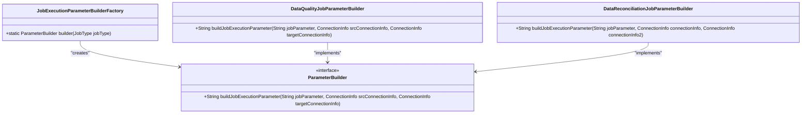
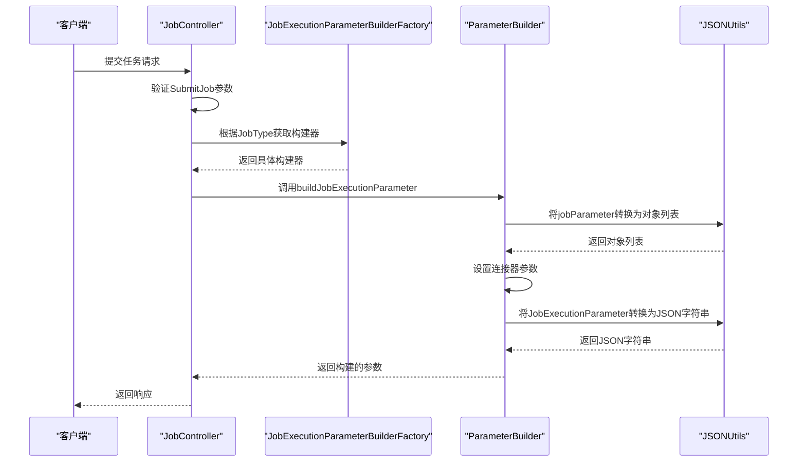

# 请求处理

<cite>
**本文档引用的文件**
- [JobController.java](file://datavines-server/src/main/java/io/datavines/server/api/controller/JobController.java)
- [SubmitJob.java](file://datavines-common/src/main/java/io/datavines/common/entity/job/SubmitJob.java)
- [JobExecutionParameterBuilderFactory.java](file://datavines-server/src/main/java/io/datavines/server/dqc/coordinator/builder/JobExecutionParameterBuilderFactory.java)
- [DataQualityJobParameterBuilder.java](file://datavines-server/src/main/java/io/datavines/server/dqc/coordinator/builder/DataQualityJobParameterBuilder.java)
- [DataReconciliationJobParameterBuilder.java](file://datavines-server/src/main/java/io/datavines/server/dqc/coordinator/builder/DataReconciliationJobParameterBuilder.java)
- [BaseJobParameter.java](file://datavines-common/src/main/java/io/datavines/common/entity/job/BaseJobParameter.java)
- [ConnectorParameter.java](file://datavines-common/src/main/java/io/datavines/common/entity/ConnectorParameter.java)
- [JobExecutionParameter.java](file://datavines-common/src/main/java/io/datavines/common/entity/JobExecutionParameter.java)
</cite>

## 目录
1. [简介](#简介)
2. [请求处理流程概述](#请求处理流程概述)
3. [核心组件分析](#核心组件分析)
4. [参数构建器机制](#参数构建器机制)
5. [请求参数校验与异常处理](#请求参数校验与异常处理)
6. [时序图分析](#时序图分析)
7. [安全性考虑](#安全性考虑)
8. [结论](#结论)

## 简介
DataVines是一个数据质量监控系统，其请求处理机制负责接收用户提交的任务请求，验证参数，并根据任务类型构建相应的执行参数。本文档详细描述了从API接口到任务参数构建的全过程，重点分析了`JobController`如何接收和验证请求参数，`SubmitJob`实体类的结构和字段含义，以及`JobExecutionParameterBuilderFactory`如何根据不同的任务类型选择合适的参数构建器。

## 请求处理流程概述
DataVines的请求处理流程始于API接口的调用，用户通过HTTP请求提交任务参数。系统首先在控制器层接收请求，然后进行参数验证，接着根据任务类型选择相应的参数构建器，最终生成任务执行所需的完整参数。这一流程确保了任务参数的正确性和完整性，为后续的任务执行提供了可靠的基础。

## 核心组件分析

### JobController分析
`JobController`是DataVines系统中负责处理任务相关请求的核心控制器。它通过Spring MVC框架暴露RESTful API接口，接收来自客户端的任务创建、更新和删除请求。控制器使用`@Validated`注解启用参数验证，并通过`@Valid`注解确保请求体中的参数符合预定义的约束条件。

**组件源码**
- [JobController.java](file://datavines-server/src/main/java/io/datavines/server/api/controller/JobController.java#L40-L62)

### SubmitJob实体类分析
`SubmitJob`实体类定义了用户提交任务时所需的基本参数结构。该类包含了任务名称、执行平台类型、执行平台参数、引擎类型和引擎参数等关键字段。通过使用`@NotNull`和`@NotBlank`等JSR-303验证注解，确保了关键参数的非空性。

```java
@Data
@NotNull(message = "SubmitJob cannot be null")
public class SubmitJob {
    @NotBlank(message = "task name cannot be empty")
    private String name;
    
    private String executePlatformType = "client";
    private Map<String,Object> executePlatformParameter;
    private String engineType = "local";
    private Map<String,Object> engineParameter;
    // 其他字段...
}
```

**组件源码**
- [SubmitJob.java](file://datavines-common/src/main/java/io/datavines/common/entity/job/SubmitJob.java#L31-L42)

## 参数构建器机制

### JobExecutionParameterBuilderFactory分析
`JobExecutionParameterBuilderFactory`是参数构建器的工厂类，负责根据任务类型创建相应的参数构建器实例。该工厂使用简单的策略模式，通过`switch`语句根据`JobType`枚举值返回不同的`ParameterBuilder`实现。



**图示源码**
- [JobExecutionParameterBuilderFactory.java](file://datavines-server/src/main/java/io/datavines/server/dqc/coordinator/builder/JobExecutionParameterBuilderFactory.java#L21-L35)
- [ParameterBuilder.java](file://datavines-server/src/main/java/io/datavines/server/dqc/coordinator/builder/ParameterBuilder.java#L23-L26)

### 数据质量任务参数构建器
`DataQualityJobParameterBuilder`负责构建数据质量类型任务的执行参数。它将JSON格式的参数字符串转换为`BaseJobParameter`对象列表，设置连接器参数，并最终生成`JobExecutionParameter`对象。

**组件源码**
- [DataQualityJobParameterBuilder.java](file://datavines-server/src/main/java/io/datavines/server/dqc/coordinator/builder/DataQualityJobParameterBuilder.java#L30-L58)

### 数据核对任务参数构建器
`DataReconciliationJobParameterBuilder`专门处理数据核对类型任务的参数构建。与数据质量任务不同，数据核对任务需要处理两个数据源的连接信息，并将两个数据源的参数合并到最终的执行参数中。

**组件源码**
- [DataReconciliationJobParameterBuilder.java](file://datavines-server/src/main/java/io/datavines/server/dqc/coordinator/builder/DataReconciliationJobParameterBuilder.java#L28-L64)

## 请求参数校验与异常处理

### 参数校验机制
DataVines使用Spring框架的Bean Validation功能进行参数校验。在`SubmitJob`类中，通过`@NotBlank`注解确保任务名称不为空，通过`@NotNull`注解确保对象不为null。这些验证规则在控制器接收请求时自动执行，如果验证失败，将抛出`MethodArgumentNotValidException`异常。

### 异常处理机制
系统通过全局异常处理器捕获和处理各种异常情况。对于参数验证失败的情况，返回400 Bad Request响应；对于服务器内部错误，返回500 Internal Server Error响应。这种分层的异常处理机制确保了系统的健壮性和用户体验。

**组件源码**
- [BaseJobParameter.java](file://datavines-common/src/main/java/io/datavines/common/entity/job/BaseJobParameter.java#L24-L42)
- [ConnectorParameter.java](file://datavines-common/src/main/java/io/datavines/common/entity/ConnectorParameter.java#L23-L30)

## 时序图分析
以下时序图展示了用户请求从API接口到任务参数构建的完整流程：



**图示源码**
- [JobExecutionParameterBuilderFactory.java](file://datavines-server/src/main/java/io/datavines/server/dqc/coordinator/builder/JobExecutionParameterBuilderFactory.java#L21-L35)
- [DataQualityJobParameterBuilder.java](file://datavines-server/src/main/java/io/datavines/server/dqc/coordinator/builder/DataQualityJobParameterBuilder.java#L30-L58)

## 安全性考虑

### 参数过滤
系统在处理用户输入时，对敏感信息如数据库密码等进行了适当的过滤和加密处理。通过`PasswordFilterUtils`等工具类，确保敏感信息不会在日志或响应中明文显示。

### 权限验证
虽然本分析主要关注请求处理流程，但系统整体架构中包含了权限验证机制。通过`@RefreshToken`注解和相关的AOP切面，确保只有经过身份验证的用户才能提交任务请求。

## 结论
DataVines的请求处理机制设计合理，通过清晰的分层架构和策略模式实现了灵活的任务参数构建。系统充分利用了Spring框架的特性，如依赖注入、AOP和Bean Validation，提高了代码的可维护性和可扩展性。参数构建器工厂模式使得系统能够轻松支持新的任务类型，而无需修改现有代码，体现了良好的开闭原则。