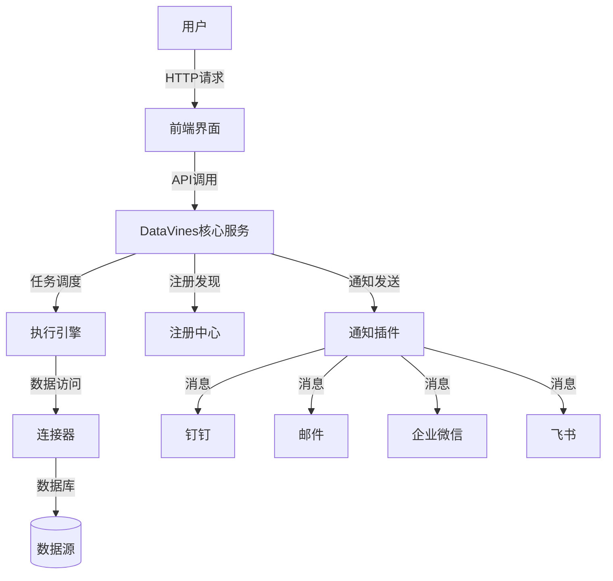
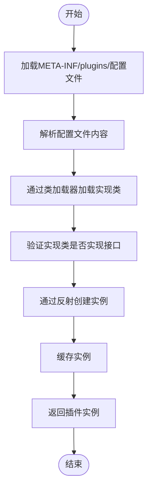
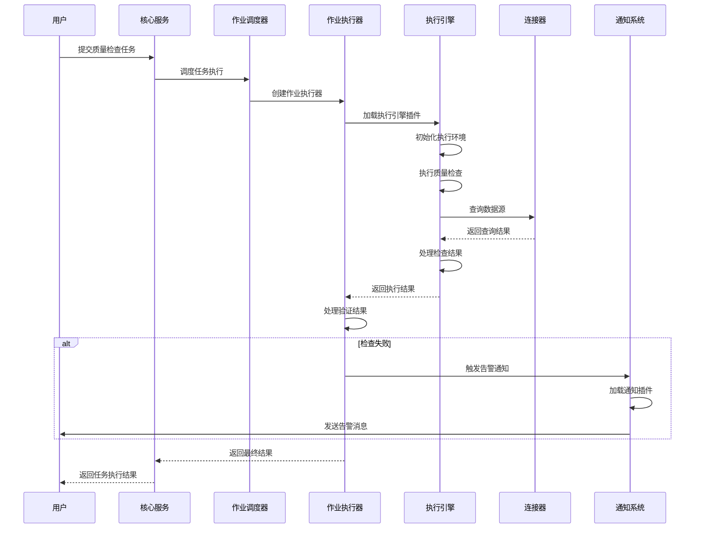
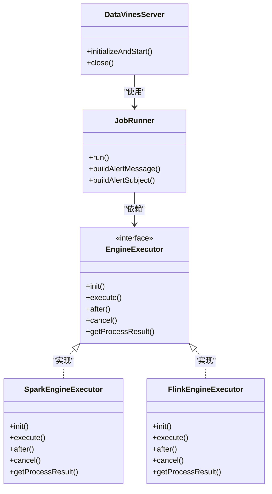
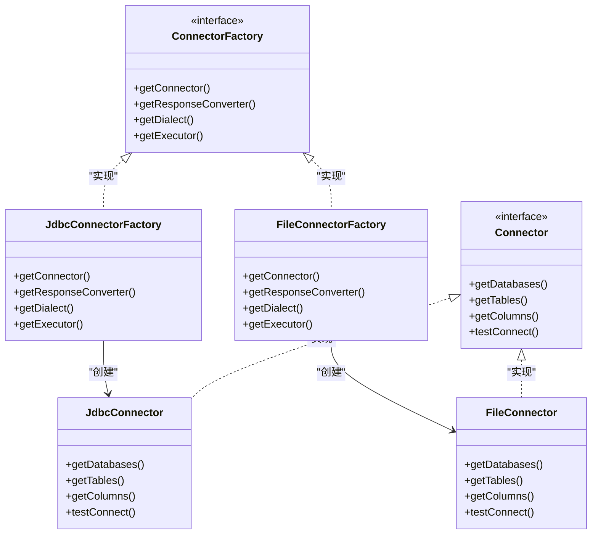
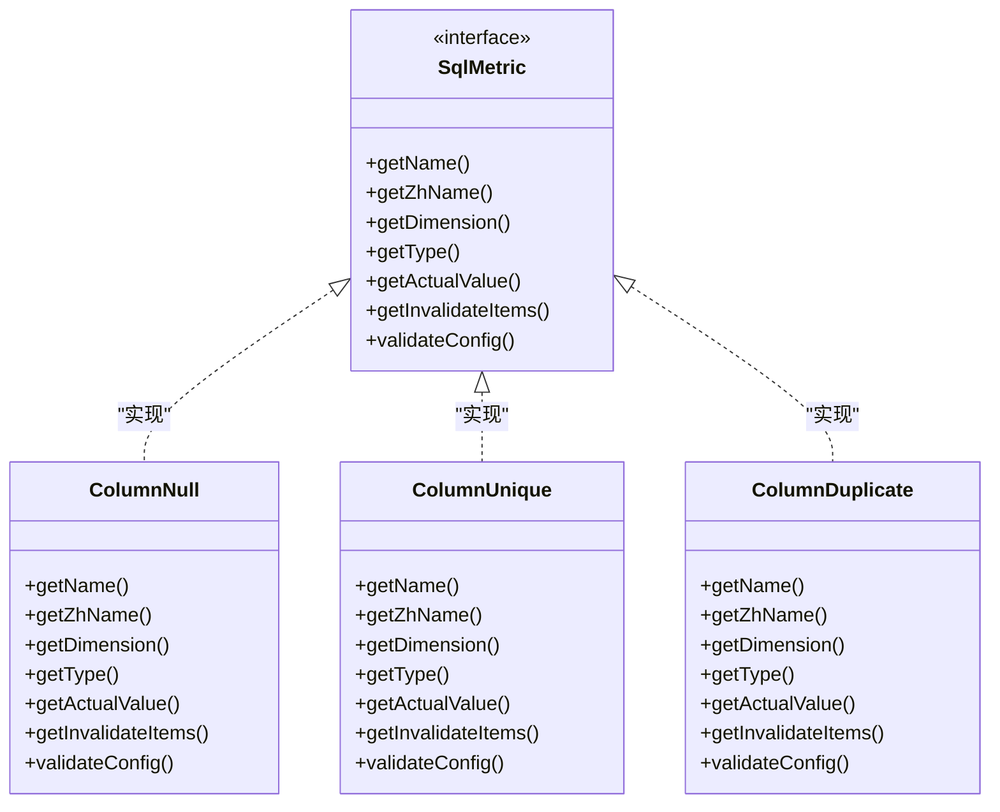

# 架构设计

<cite>
**本文档中引用的文件**  
- [DataVinesServer.java](file://datavines-server/src/main/java/io/datavines/server/DataVinesServer.java)
- [SPI.java](file://datavines-spi/src/main/java/io/datavines/spi/SPI.java)
- [PluginLoader.java](file://datavines-spi/src/main/java/io/datavines/spi/PluginLoader.java)
- [EngineExecutor.java](file://datavines-engine/datavines-engine-api/src/main/java/io/datavines/engine/api/engine/EngineExecutor.java)
- [Connector.java](file://datavines-connector/datavines-connector-api/src/main/java/io/datavines/connector/api/Connector.java)
- [ConnectorFactory.java](file://datavines-connector/datavines-connector-api/src/main/java/io/datavines/connector/api/ConnectorFactory.java)
- [SqlMetric.java](file://datavines-metric/datavines-metric-api/src/main/java/io/datavines/metric/api/SqlMetric.java)
- [SlasHandlerPlugin.java](file://datavines-notification/datavines-notification-api/src/main/java/io/datavines/notification/api/spi/SlasHandlerPlugin.java)
- [Registry.java](file://datavines-registry/datavines-registry-api/src/main/java/io/datavines/registry/api/Registry.java)
- [JobRunner.java](file://datavines-runner/src/main/java/io/datavines/runner/JobRunner.java)
- [JdbcConnector.java](file://datavines-connector/datavines-connector-plugins/datavines-connector-jdbc/src/main/java/io/datavines/connector/plugin/JdbcConnector.java)
- [ColumnNull.java](file://datavines-metric/datavines-metric-plugins/datavines-metric-column-null/src/main/java/io/datavines/metric/plugin/ColumnNull.java)
- [EmailSlasHandlerPlugin.java](file://datavines-notification/datavines-notification-plugins/datavines-notification-plugin-email/src/main/java/io/datavines/notification/plugin/email/EmailSlasHandlerPlugin.java)
</cite>

## 目录
1. [简介](#简介)
2. [系统上下文图](#系统上下文图)
3. [微内核架构概述](#微内核架构概述)
4. [核心组件分析](#核心组件分析)
5. [SPI插件机制](#spi插件机制)
6. [任务调度流程](#任务调度流程)
7. [组件交互模式](#组件交互模式)
8. [技术决策与权衡](#技术决策与权衡)
9. [可扩展性、可靠性与性能设计](#可扩展性可靠性与性能设计)
10. [结论](#结论)

## 简介

DataVines是一个数据质量监控平台，采用微内核架构设计，通过SPI（Service Provider Interface）机制实现高度可扩展的插件化系统。该架构将核心服务与具体实现解耦，支持多种执行引擎、连接器和通知方式的动态扩展。系统主要由核心服务（Server）、执行引擎（Engine）、连接器（Connector）和插件系统（SPI）组成，各组件通过明确定义的接口进行交互，实现了高内聚低耦合的设计原则。

**Section sources**
- [DataVinesServer.java](file://datavines-server/src/main/java/io/datavines/server/DataVinesServer.java#L1-L160)

## 系统上下文图

**Diagram sources**
- [DataVinesServer.java](file://datavines-server/src/main/java/io/datavines/server/DataVinesServer.java#L1-L160)
- [SlasHandlerPlugin.java](file://datavines-notification/datavines-notification-api/src/main/java/io/datavines/notification/api/spi/SlasHandlerPlugin.java#L1-L43)

## 微内核架构概述

DataVines采用微内核架构模式，将系统分为核心内核和可扩展插件两大部分。核心内核负责基础服务、任务调度和生命周期管理，而具体功能如数据源连接、执行引擎、质量指标和通知方式等通过插件形式实现。这种架构具有以下特点：

- **高可扩展性**：通过SPI机制动态加载插件，无需修改核心代码即可支持新的数据源或执行引擎
- **松耦合**：核心服务与插件之间通过接口通信，降低组件间的依赖关系
- **易维护性**：插件可以独立开发、测试和部署，便于团队协作
- **灵活性**：用户可以根据需求选择和配置不同的插件组合

核心内核主要由Server模块构成，负责接收用户请求、调度任务执行、管理插件生命周期等。插件系统则分布在Connector、Engine、Metric和Notification等模块中，每个模块都定义了标准接口，具体实现以插件形式存在。

**Section sources**
- [DataVinesServer.java](file://datavines-server/src/main/java/io/datavines/server/DataVinesServer.java#L1-L160)
- [SPI.java](file://datavines-spi/src/main/java/io/datavines/spi/SPI.java#L1-L32)

## 核心组件分析

### 核心服务（Server）

核心服务是DataVines的控制中心，基于Spring Boot框架构建，负责系统的初始化、任务调度和生命周期管理。在`DataVinesServer`类中，通过`@PostConstruct`注解的方法`initializeAndStart()`完成系统初始化，包括：

- 初始化公共属性配置
- 启动作业执行管理器（JobExecuteManager）
- 初始化注册中心（Registry）
- 启动注册服务（Register）
- 启动作业调度器（JobScheduler）

核心服务通过依赖注入获取Spring应用上下文、环境配置和注册中心持有者等组件，体现了依赖注入设计模式的应用。

### 执行引擎（Engine）

执行引擎负责具体任务的执行，定义了`EngineExecutor`接口作为所有执行引擎的抽象基类。该接口包含`init()`、`execute()`、`after()`等方法，规范了执行引擎的生命周期。不同的执行引擎（如Spark、Flink、Local等）通过实现此接口来提供具体的执行逻辑。

执行引擎的创建和管理通过SPI机制实现，系统根据任务配置中的引擎类型动态加载相应的执行器实例。

### 连接器（Connector）

连接器负责与各种数据源进行交互，提供统一的数据访问接口。`Connector`接口定义了获取数据库、表、列等元数据的方法，以及测试连接的功能。通过`ConnectorFactory`工厂接口，系统可以创建特定类型的连接器实例。

连接器插件支持多种数据库类型，包括MySQL、Oracle、PostgreSQL、ClickHouse等，每个数据库类型都有对应的连接器实现。

### 插件系统（SPI）

SPI（Service Provider Interface）是DataVines插件化架构的核心机制。通过`@SPI`注解标记接口，系统可以动态发现和加载实现类。`PluginLoader`类是SPI机制的具体实现，负责插件的加载、缓存和实例化。

**Section sources**
- [DataVinesServer.java](file://datavines-server/src/main/java/io/datavines/server/DataVinesServer.java#L1-L160)
- [EngineExecutor.java](file://datavines-engine/datavines-engine-api/src/main/java/io/datavines/engine/api/engine/EngineExecutor.java#L1-L43)
- [Connector.java](file://datavines-connector/datavines-connector-api/src/main/java/io/datavines/connector/api/Connector.java#L1-L73)
- [ConnectorFactory.java](file://datavines-connector/datavines-connector-api/src/main/java/io/datavines/connector/api/ConnectorFactory.java#L1-L52)

## SPI插件机制

### 类加载与服务发现

DataVines的SPI机制基于Java的ServiceLoader模式进行扩展和优化。`PluginLoader`类是插件加载的核心，其工作原理如下：

1. **插件发现**：系统在`META-INF/plugins/`目录下查找以接口全限定名为文件名的配置文件
2. **类加载**：读取配置文件中的实现类全限定名，通过类加载器加载类
3. **实例化**：通过反射创建实现类的实例
4. **缓存管理**：使用ConcurrentHashMap缓存已加载的插件类和实例，提高性能

**Diagram sources**
- [PluginLoader.java](file://datavines-spi/src/main/java/io/datavines/spi/PluginLoader.java#L1-L487)

### 实例化过程

插件的实例化过程由`PluginLoader`的`getOrCreatePlugin()`和`getNewPlugin()`方法控制：

- `getOrCreatePlugin()`：获取单例实例，多次调用返回同一个实例
- `getNewPlugin()`：获取新实例，每次调用都创建新的实例

这种设计既支持有状态插件（需要新实例），也支持无状态插件（可共享实例），提供了灵活的实例化策略。

### 插件生命周期

插件的生命周期由核心服务统一管理：
1. **加载阶段**：系统启动时扫描并加载所有插件
2. **初始化阶段**：根据需要创建插件实例并进行初始化
3. **运行阶段**：插件处理具体业务逻辑
4. **销毁阶段**：系统关闭时释放插件资源

**Section sources**
- [PluginLoader.java](file://datavines-spi/src/main/java/io/datavines/spi/PluginLoader.java#L1-L487)
- [SPI.java](file://datavines-spi/src/main/java/io/datavines/spi/SPI.java#L1-L32)

## 任务调度流程

从用户请求到结果返回的完整生命周期如下：

**Diagram sources**
- [JobRunner.java](file://datavines-runner/src/main/java/io/datavines/runner/JobRunner.java#L1-L188)
- [DataVinesServer.java](file://datavines-server/src/main/java/io/datavines/server/DataVinesServer.java#L1-L160)

### 详细流程说明

1. **请求接收**：用户通过前端界面或API提交质量检查任务
2. **任务调度**：核心服务将任务交给作业调度器进行调度
3. **执行器创建**：作业执行器（JobRunner）被创建，负责具体任务的执行
4. **引擎加载**：根据任务配置的引擎类型，通过SPI机制加载相应的执行引擎
5. **执行初始化**：执行引擎初始化执行环境，准备执行所需资源
6. **任务执行**：执行引擎执行质量检查逻辑，包括SQL生成、执行和结果处理
7. **结果验证**：检查执行结果是否符合预期，判断任务成功或失败
8. **通知处理**：如果检查失败，触发告警通知流程，通过通知插件发送消息
9. **结果返回**：将最终执行结果返回给用户

**Section sources**
- [JobRunner.java](file://datavines-runner/src/main/java/io/datavines/runner/JobRunner.java#L1-L188)

## 组件交互模式

### 核心服务与执行引擎

核心服务与执行引擎之间通过`EngineExecutor`接口进行交互。核心服务不关心具体执行引擎的实现细节，只需调用标准接口方法即可完成任务执行。

**Diagram sources**
- [DataVinesServer.java](file://datavines-server/src/main/java/io/datavines/server/DataVinesServer.java#L1-L160)
- [JobRunner.java](file://datavines-runner/src/main/java/io/datavines/runner/JobRunner.java#L1-L188)
- [EngineExecutor.java](file://datavines-engine/datavines-engine-api/src/main/java/io/datavines/engine/api/engine/EngineExecutor.java#L1-L43)

### 连接器与数据源

连接器组件采用工厂模式和策略模式的组合。`ConnectorFactory`作为工厂接口，负责创建具体的连接器实例；`Connector`作为策略接口，定义了统一的数据访问方法。

**Diagram sources**
- [ConnectorFactory.java](file://datavines-connector/datavines-connector-api/src/main/java/io/datavines/connector/api/ConnectorFactory.java#L1-L52)
- [Connector.java](file://datavines-connector/datavines-connector-api/src/main/java/io/datavines/connector/api/Connector.java#L1-L73)
- [JdbcConnector.java](file://datavines-connector/datavines-connector-plugins/datavines-connector-jdbc/src/main/java/io/datavines/connector/plugin/JdbcConnector.java#L1-L284)

### 质量指标与验证

质量指标系统通过`SqlMetric`接口定义了标准化的质量检查规则。每个具体的检查规则（如空值检查、唯一性检查等）都实现此接口。

**Diagram sources**
- [SqlMetric.java](file://datavines-metric/datavines-metric-api/src/main/java/io/datavines/metric/api/SqlMetric.java#L1-L112)
- [ColumnNull.java](file://datavines-metric/datavines-metric-plugins/datavines-metric-column-null/src/main/java/io/datavines/metric/plugin/ColumnNull.java#L1-L78)

## 技术决策与权衡

### 微内核架构选择

选择微内核架构的主要原因是满足数据质量平台对可扩展性的高要求。这种架构带来了以下优势：

- **灵活性**：可以轻松添加新的数据源支持，无需修改核心代码
- **可维护性**：插件可以独立开发和测试，降低了系统复杂性
- **可部署性**：可以根据需要选择性部署特定插件，减少部署包大小

然而，这种架构也带来了一些挑战：
- **性能开销**：插件加载和反射调用会带来一定的性能开销
- **调试复杂性**：插件在运行时动态加载，增加了调试难度
- **版本兼容性**：需要确保核心服务与插件之间的API兼容性

### SPI机制设计

SPI机制的设计考虑了以下因素：

- **性能优化**：通过缓存已加载的插件类和实例，避免重复加载
- **线程安全**：使用ConcurrentHashMap等线程安全的数据结构，确保多线程环境下的安全性
- **错误处理**：提供详细的错误信息，便于排查插件加载问题
- **扩展性**：支持插件的动态添加和替换，便于测试和开发

### 注册中心集成

系统支持多种注册中心实现（如ZooKeeper、MySQL），通过`Registry`接口抽象了注册中心的具体实现。这种设计允许用户根据基础设施选择合适的注册中心，提高了系统的适应性。

**Section sources**
- [DataVinesServer.java](file://datavines-server/src/main/java/io/datavines/server/DataVinesServer.java#L1-L160)
- [Registry.java](file://datavines-registry/datavines-registry-api/src/main/java/io/datavines/registry/api/Registry.java#L1-L44)
- [PluginLoader.java](file://datavines-spi/src/main/java/io/datavines/spi/PluginLoader.java#L1-L487)

## 可扩展性、可靠性与性能设计

### 可扩展性设计

DataVines的可扩展性主要体现在以下几个方面：

1. **横向扩展**：通过注册中心支持多节点部署，实现负载均衡
2. **功能扩展**：通过SPI机制支持新的执行引擎、连接器、质量指标和通知方式
3. **配置扩展**：通过灵活的配置系统支持不同的部署环境和需求

### 可靠性设计

系统的可靠性通过以下机制保障：

- **故障转移**：作业执行失败时，支持故障转移和重试机制
- **资源管理**：合理管理数据库连接等资源，避免资源泄漏
- **异常处理**：完善的异常处理机制，确保系统在异常情况下能够优雅降级
- **日志记录**：详细的日志记录，便于问题排查和审计

### 性能考虑

在性能方面，系统进行了以下优化：

- **连接池**：使用HikariCP等高性能连接池管理数据库连接
- **缓存机制**：对频繁访问的数据（如插件信息、元数据等）进行缓存
- **异步处理**：将通知发送等耗时操作异步化，提高响应速度
- **批量处理**：支持批量任务执行，提高处理效率

这些设计考虑确保了DataVines在大规模数据质量监控场景下的高性能和高可用性。

**Section sources**
- [DataVinesServer.java](file://datavines-server/src/main/java/io/datavines/server/DataVinesServer.java#L1-L160)
- [PluginLoader.java](file://datavines-spi/src/main/java/io/datavines/spi/PluginLoader.java#L1-L487)
- [JdbcDataSourceManager.java](file://datavines-common/src/main/java/io/datavines/common/datasource/jdbc/JdbcDataSourceManager.java)

## 结论

DataVines通过微内核架构和SPI插件机制，构建了一个高度可扩展、灵活且可靠的数据质量监控平台。核心服务与插件之间的清晰边界设计，使得系统既能满足当前需求，又具备良好的未来扩展能力。任务调度流程的设计确保了从用户请求到结果返回的完整生命周期管理，而组件间的交互模式则体现了高内聚低耦合的设计原则。

该架构的成功实施为数据质量监控领域提供了一个优秀的参考案例，其设计理念和实现技术对于类似系统的开发具有重要的借鉴意义。