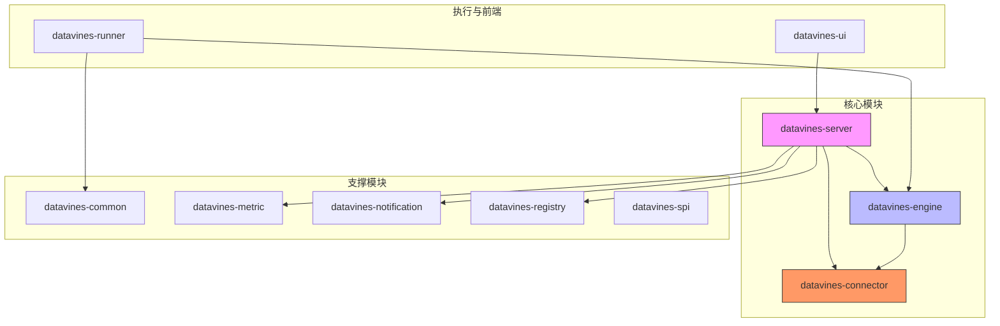
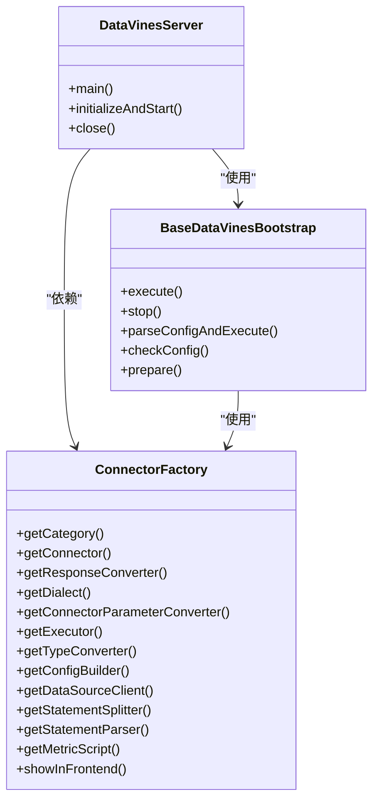
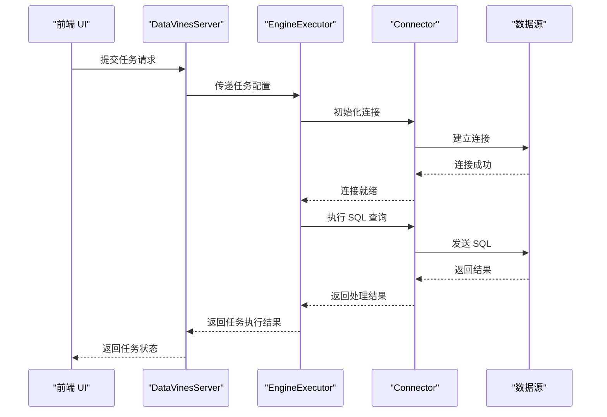
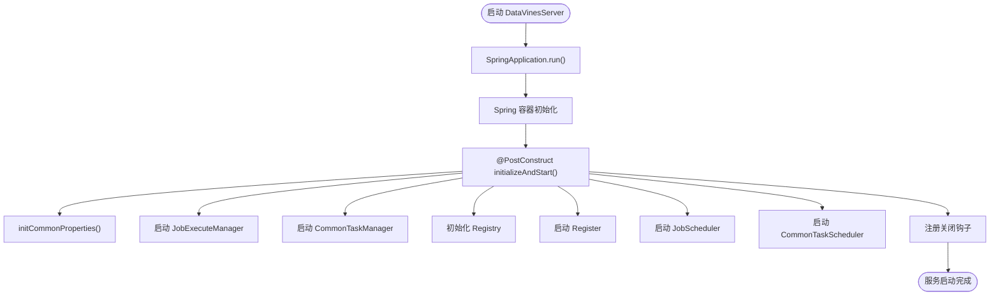

# 核心架构

<cite>
**本文档引用的文件**  
- [DataVinesServer.java](file://datavines-server/src/main/java/io/datavines/server/DataVinesServer.java)
- [BaseDataVinesBootstrap.java](file://datavines-engine/datavines-engine-core/src/main/java/io/datavines/engine/core/BaseDataVinesBootstrap.java)
- [JobExecuteBootstrap.java](file://datavines-runner/src/main/java/io/datavines/runner/JobExecuteBootstrap.java)
- [RefreshTokenAop.java](file://datavines-core/src/main/java/io/datavines/core/aop/RefreshTokenAop.java)
- [DataVinesSwaggerConfig.java](file://datavines-server/src/main/java/io/datavines/server/api/config/DataVinesSwaggerConfig.java)
- [application.yaml](file://datavines-server/src/main/resources/application.yaml)
</cite>

## 目录
1. [简介](#简介)
2. [项目结构](#项目结构)
3. [核心组件职责划分](#核心组件职责划分)
4. [微内核架构设计](#微内核架构设计)
5. [组件交互模式](#组件交互模式)
6. [Spring Boot服务治理应用](#spring-boot服务治理应用)
7. [系统启动流程](#系统启动流程)
8. [可扩展性与模块化解耦](#可扩展性与模块化解耦)
9. [性能优化建议](#性能优化建议)
10. [常见架构问题解决方案](#常见架构问题解决方案)

## 简介

DataVines 是一个基于微内核架构设计的大数据质量监控系统，采用模块化、可插拔的设计理念，实现了 Server、Engine、Connector 三大核心组件的职责分离与高效协作。本架构文档详细阐述了系统的整体设计思想、核心组件的职责划分、组件间的交互模式、Spring Boot 在服务治理中的具体应用、系统启动流程、可扩展性设计以及性能优化策略。

## 项目结构

DataVines 项目采用 Maven 多模块管理，各模块职责清晰，结构分明。主要模块包括：

- **datavines-common**: 提供通用工具类、配置管理、数据源管理等基础能力
- **datavines-server**: 核心服务模块，基于 Spring Boot 实现 REST API、任务调度、注册中心等功能
- **datavines-engine**: 执行引擎模块，定义了引擎的执行流程和核心组件接口
- **datavines-connector**: 连接器模块，支持多种数据源的连接与操作
- **datavines-metric**: 指标模块，定义了数据质量度量的标准和插件
- **datavines-notification**: 通知模块，支持多种通知方式
- **datavines-registry**: 注册中心模块，支持 ZooKeeper 和 MySQL 两种注册方式
- **datavines-runner**: 任务执行引导模块，负责启动具体的执行任务
- **datavines-spi**: 服务提供者接口模块，支持 SPI 机制实现插件化
- **datavines-ui**: 前端用户界面模块



**图源**  
- [pom.xml](file://pom.xml)

## 核心组件职责划分

DataVines 的三大核心组件——Server、Engine 和 Connector——各自承担着明确的职责，共同构成了系统的微内核架构。

### Server 组件

Server 组件是系统的控制中心，主要职责包括：

- **API 服务**：提供 RESTful API 接口，供前端 UI 或其他客户端调用。
- **任务调度**：负责数据质量任务的调度与管理，包括任务的创建、启动、停止和状态监控。
- **服务注册与发现**：通过注册中心（ZooKeeper 或 MySQL）实现服务的注册与发现，支持集群部署。
- **配置管理**：管理系统的全局配置和任务配置。
- **通知管理**：集成通知模块，支持任务执行结果的通知。

**组件源**  
- [DataVinesServer.java](file://datavines-server/src/main/java/io/datavines/server/DataVinesServer.java)
- [application.yaml](file://datavines-server/src/main/resources/application.yaml)

### Engine 组件

Engine 组件是系统的执行引擎，负责具体的数据质量检查任务的执行。其主要职责包括：

- **执行流程管理**：封装了任务执行的完整流程，包括配置解析、组件准备、任务执行和结果返回。
- **插件化支持**：通过 SPI 机制支持多种执行模式（如 Spark、Flink）的插件化扩展。
- **资源配置**：管理执行任务所需的资源，如计算资源、存储资源等。

**组件源**  
- [BaseDataVinesBootstrap.java](file://datavines-engine/datavines-engine-core/src/main/java/io/datavines/engine/core/BaseDataVinesBootstrap.java)

### Connector 组件

Connector 组件是系统的数据连接层，负责与各种数据源进行交互。其主要职责包括：

- **数据源连接**：支持多种数据源（如 MySQL、Oracle、Hive、Spark 等）的连接与认证。
- **SQL 执行**：提供统一的接口执行 SQL 查询和更新操作。
- **元数据获取**：获取数据源的元数据信息，如表结构、列信息等。
- **方言支持**：针对不同数据库提供特定的 SQL 方言支持。

**组件源**  
- [ConnectorFactory.java](file://datavines-connector/ datavines-connector-api/src/main/java/io/datavines/connector/api/ConnectorFactory.java)

## 微内核架构设计

DataVines 采用微内核架构设计，将系统的核心功能（微内核）与可扩展的插件模块分离。微内核负责提供最基本的服务和框架，而具体的业务功能则通过插件的形式动态加载和扩展。

### 微内核组成

- **核心服务**：包括任务调度、配置管理、注册中心等基础服务。
- **执行框架**：定义了任务执行的流程和接口，确保不同执行引擎的兼容性。
- **连接框架**：定义了数据连接的接口和规范，支持多种数据源的接入。

### 插件化机制

通过 `datavines-spi` 模块提供的 SPI（Service Provider Interface）机制，系统实现了高度的可扩展性。开发者可以通过实现特定的接口并配置 `META-INF/services` 文件，将新的功能模块作为插件集成到系统中。



**图源**  
- [DataVinesServer.java](file://datavines-server/src/main/java/io/datavines/server/DataVinesServer.java)
- [BaseDataVinesBootstrap.java](file://datavines-engine/datavines-engine-core/src/main/java/io/datavines/engine/core/BaseDataVinesBootstrap.java)
- [ConnectorFactory.java](file://datavines-connector/ datavines-connector-api/src/main/java/io/datavines/connector/api/ConnectorFactory.java)

## 组件交互模式

三大核心组件通过定义良好的接口和协议进行交互，确保了系统的松耦合和高内聚。

### Server 与 Engine 的交互

Server 组件通过调用 Engine 组件提供的 API 来启动和管理数据质量检查任务。具体流程如下：

1. Server 接收到任务提交请求。
2. Server 将任务配置序列化并传递给 Engine。
3. Engine 解析配置，准备执行环境，并启动任务执行。
4. Engine 将执行结果返回给 Server。
5. Server 更新任务状态并触发通知。

### Engine 与 Connector 的交互

Engine 组件在执行任务时，通过 Connector 组件提供的接口与数据源进行交互。具体流程如下：

1. Engine 根据任务配置选择合适的 Connector。
2. Engine 调用 Connector 的接口执行 SQL 查询或获取元数据。
3. Connector 返回查询结果或元数据给 Engine。
4. Engine 对结果进行处理和分析。



**图源**  
- [DataVinesServer.java](file://datavines-server/src/main/java/io/datavines/server/DataVinesServer.java)
- [JobExecuteBootstrap.java](file://datavines-runner/src/main/java/io/datavines/runner/JobExecuteBootstrap.java)
- [BaseDataVinesBootstrap.java](file://datavines-engine/datavines-engine-core/src/main/java/io/datavines/engine/core/BaseDataVinesBootstrap.java)

## Spring Boot服务治理应用

DataVines Server 模块基于 Spring Boot 构建，充分利用了 Spring Boot 的依赖注入、AOP 切面和 REST API 暴露机制，实现了高效的服务治理。

### 依赖注入

通过 Spring 的 `@Autowired` 注解，Server 组件中的各个服务（如 `SpringApplicationContext`、`Environment`、`RegistryHolder`）被自动注入，简化了对象的创建和管理。

```java
@Autowired
private SpringApplicationContext springApplicationContext;

@Autowired
private Environment environment;

@Autowired
private RegistryHolder registryHolder;
```

**组件源**  
- [DataVinesServer.java](file://datavines-server/src/main/java/io/datavines/server/DataVinesServer.java)

### AOP 切面

系统使用 AOP 切面实现了一些横切关注点，如自动刷新 Token。`RefreshTokenAop` 类通过 `@Aspect` 注解定义了一个切面，拦截所有带有 `@RefreshToken` 注解的类，并在方法执行后自动刷新 Token。

```java
@Aspect
@Component
public class RefreshTokenAop {
    @Pointcut("@within(RefreshToken)")
    public void pointCut() {}

    @Around(value = "pointCut()")
    public Object doAroundReturningAdvice(ProceedingJoinPoint point) throws Throwable {
        // 执行前逻辑
        Object result = point.proceed();
        // 执行后逻辑：刷新 Token
        return ResponseEntity.ok(new ResultMap(tokenManager).successAndRefreshToken(request).payload(result));
    }
}
```

**组件源**  
- [RefreshTokenAop.java](file://datavines-core/src/main/java/io/datavines/core/aop/RefreshTokenAop.java)

### REST API 暴露

通过 Spring Boot 的 `@RestController` 和 `@RequestMapping` 注解，系统将内部服务暴露为 RESTful API。同时，集成了 Swagger 2，自动生成 API 文档，方便开发者和用户使用。

```java
@Configuration
@EnableSwagger2
public class DataVinesSwaggerConfig implements WebMvcConfigurer {
    @Bean
    public Docket createRestApi() {
        return new Docket(DocumentationType.SWAGGER_2)
                .apiInfo(apiInfo())
                .select()
                .apis(RequestHandlerSelectors.basePackage("io.datavines.server.api.controller"))
                .paths(PathSelectors.any())
                .build();
    }
}
```

**组件源**  
- [DataVinesSwaggerConfig.java](file://datavines-server/src/main/java/io/datavines/server/api/config/DataVinesSwaggerConfig.java)

## 系统启动流程

DataVines 的系统启动流程从 `DataVinesServer` 主类开始，逐步初始化各个组件，最终进入服务监听状态。

### 启动步骤

1. **主类启动**：`DataVinesServer` 的 `main` 方法被调用，设置主线程名称并启动 Spring Boot 应用。
2. **Spring 初始化**：Spring 容器启动，加载配置文件，创建和注入各个 Bean。
3. **后置初始化**：`@PostConstruct` 注解的方法 `initializeAndStart` 被调用，执行系统初始化。
4. **配置初始化**：调用 `initCommonProperties` 方法，从 Spring 容器中获取数据源配置，并设置到 `CommonPropertyUtils` 中。
5. **组件启动**：
   - 创建并启动 `JobExecuteManager`，负责任务执行的管理。
   - 创建并启动 `CommonTaskManager`，负责通用任务的管理。
   - 初始化注册中心 `Registry`，并启动注册服务。
   - 启动 `JobScheduler`，负责数据质量任务的调度。
   - 启动 `CommonTaskScheduler`，负责通用任务的调度。
6. **关闭钩子**：注册 JVM 关闭钩子，确保在应用关闭时能够优雅地释放资源。



**组件源**  
- [DataVinesServer.java](file://datavines-server/src/main/java/io/datavines/server/DataVinesServer.java)

## 可扩展性与模块化解耦

DataVines 的架构设计充分考虑了可扩展性和模块化解耦，主要体现在以下几个方面：

### 插件化设计

通过 SPI 机制，系统支持多种插件的动态加载，包括：

- **执行引擎插件**：支持 Spark、Flink、Livy 等多种执行引擎。
- **连接器插件**：支持 MySQL、Oracle、Hive、Spark 等多种数据源。
- **指标插件**：支持多种数据质量度量指标。
- **通知插件**：支持钉钉、邮件、飞书等多种通知方式。

### 模块化分层

系统采用清晰的分层架构，各模块职责单一，依赖关系明确：

- **表现层**：`datavines-ui` 提供用户界面。
- **服务层**：`datavines-server` 提供核心服务。
- **执行层**：`datavines-engine` 负责任务执行。
- **连接层**：`datavines-connector` 负责数据连接。
- **基础层**：`datavines-common` 和 `datavines-spi` 提供通用能力和扩展机制。

这种设计使得系统易于维护和扩展，新功能的添加不会影响现有模块的稳定性。

## 性能优化建议

为了确保 DataVines 系统在高并发和大数据量场景下的性能，提出以下优化建议：

1. **连接池优化**：使用 HikariCP 等高性能连接池，合理配置连接池大小，避免连接泄漏。
2. **缓存机制**：对频繁访问的元数据和配置信息进行缓存，减少数据库查询次数。
3. **异步处理**：对于耗时较长的任务（如大数据量的 SQL 查询），采用异步处理模式，避免阻塞主线程。
4. **批量处理**：在数据写入和读取时，尽量采用批量操作，减少网络往返次数。
5. **资源隔离**：为不同的任务类型分配独立的计算资源，避免资源争抢。

## 常见架构问题解决方案

### 服务注册与发现失败

**问题**：在集群部署时，服务注册与发现可能出现失败，导致服务不可用。

**解决方案**：
- 确保注册中心（ZooKeeper 或 MySQL）的高可用性。
- 配置合理的重试机制和超时时间。
- 在代码中添加服务注册状态的健康检查。

### 任务执行超时

**问题**：数据质量检查任务可能因数据量过大或网络延迟而超时。

**解决方案**：
- 配置合理的任务超时时间。
- 实现任务的断点续传和分片处理。
- 提供任务执行进度的实时监控。

### 数据源连接不稳定

**问题**：与外部数据源的连接可能因网络波动或数据库负载过高而不稳定。

**解决方案**：
- 使用连接池管理数据库连接，提高连接复用率。
- 实现连接的自动重连机制。
- 对连接状态进行定期健康检查。