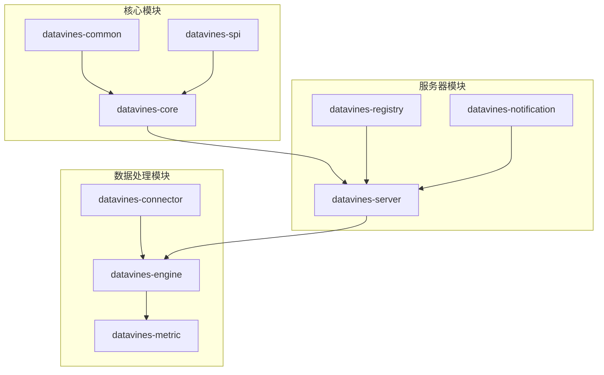
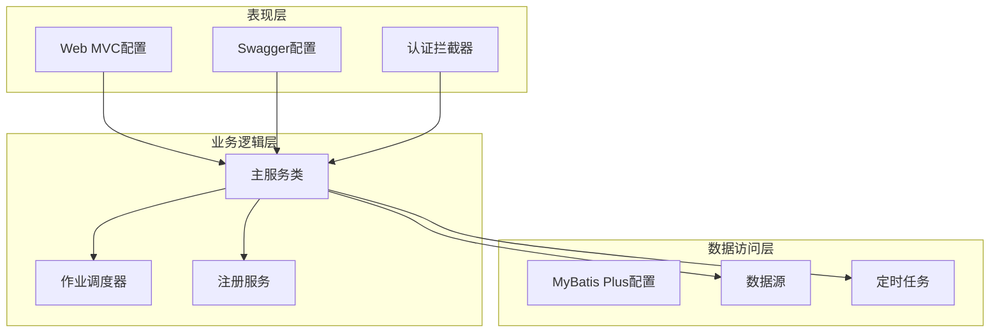
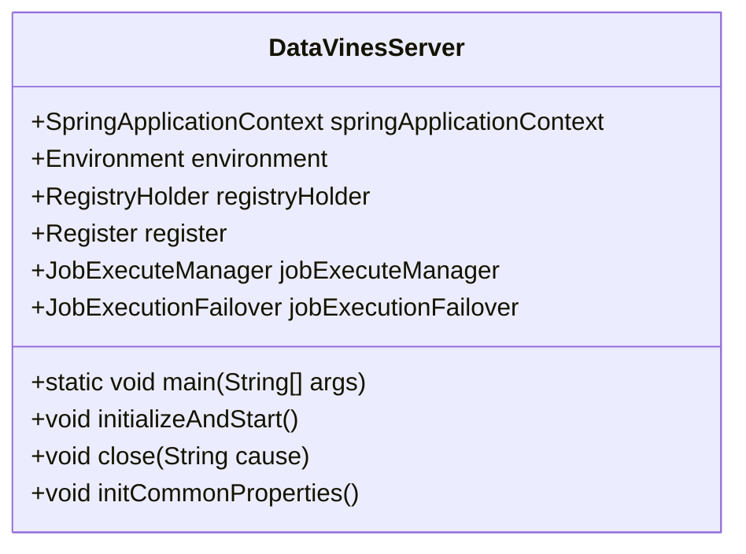
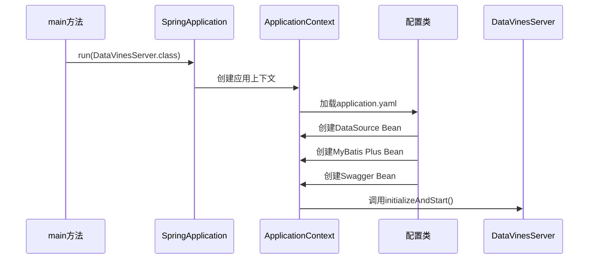
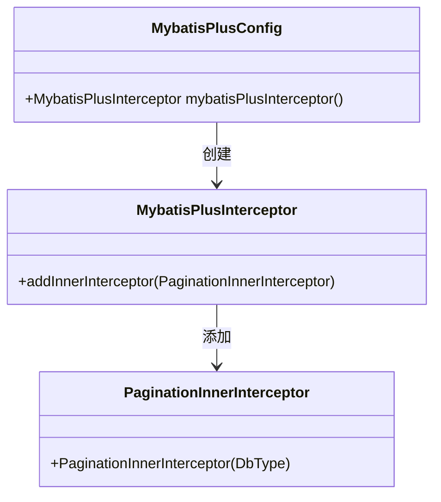
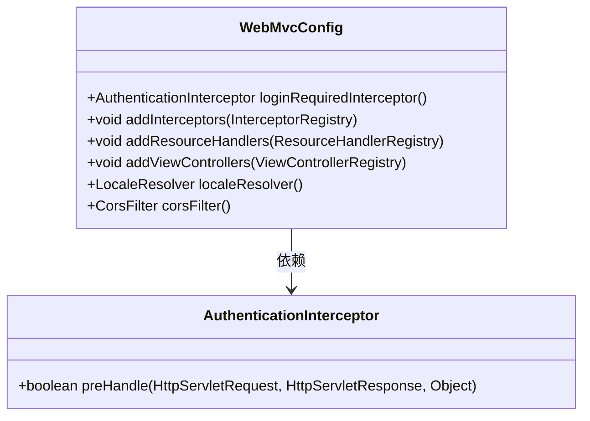
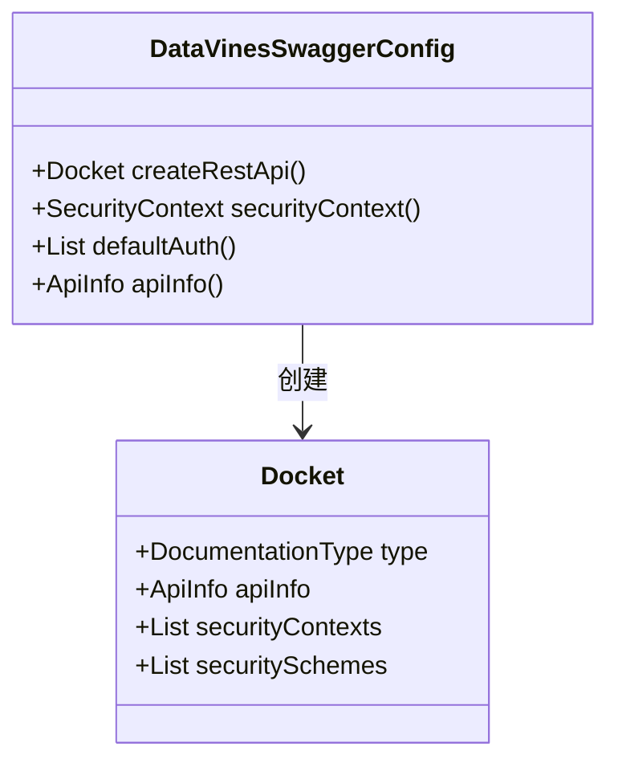
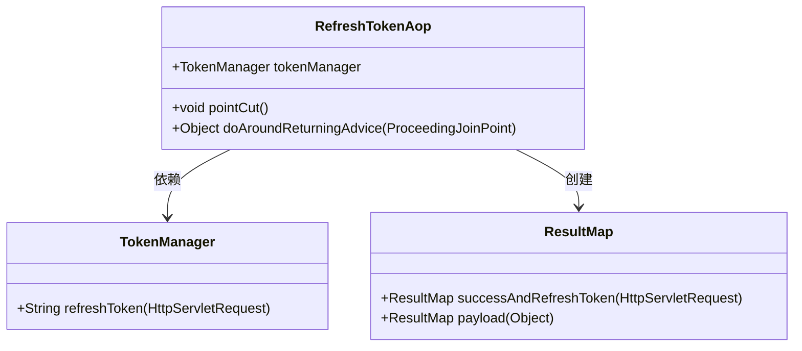
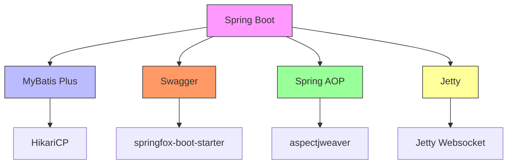

# Spring上下文初始化

<cite>
**本文档引用的文件**
- [DataVinesServer.java](file://datavines-server/src/main/java/io/datavines/server/DataVinesServer.java)
- [application.yaml](file://datavines-server/src/main/resources/application.yaml)
- [MybatisPlusConfig.java](file://datavines-server/src/main/java/io/datavines/server/api/config/MybatisPlusConfig.java)
- [DataVinesSwaggerConfig.java](file://datavines-server/src/main/java/io/datavines/server/api/config/DataVinesSwaggerConfig.java)
- [WebMvcConfig.java](file://datavines-server/src/main/java/io/datavines/server/api/config/WebMvcConfig.java)
- [JacksonConfig.java](file://datavines-server/src/main/java/io/datavines/server/config/JacksonConfig.java)
- [RefreshTokenAop.java](file://datavines-core/src/main/java/io/datavines/core/aop/RefreshTokenAop.java)
- [SpringApplicationContext.java](file://datavines-server/src/main/java/io/datavines/server/utils/SpringApplicationContext.java)
- [pom.xml](file://pom.xml)
</cite>

## 目录
1. [简介](#简介)
2. [项目结构](#项目结构)
3. [核心组件](#核心组件)
4. [架构概述](#架构概述)
5. [详细组件分析](#详细组件分析)
6. [依赖分析](#依赖分析)
7. [性能考虑](#性能考虑)
8. [故障排除指南](#故障排除指南)
9. [结论](#结论)

## 简介
本文档详细解析DataVines的Spring Application Context初始化过程。从DataVinesServer主类的main方法开始，分析Spring Boot自动配置机制如何加载application.yaml中的配置项。重点描述MyBatis Plus配置、Web MVC配置和Swagger配置的注入过程，以及Bean的依赖注入顺序。说明AOP切面（如RefreshTokenAop）的注册时机和代理创建过程。通过源码分析配置类之间的依赖关系，解释类型转换器、消息转换器和异常处理器的初始化流程。提供Spring容器启动时的Bean加载时序图，帮助开发者理解核心组件的初始化顺序。

## 项目结构
DataVines项目的结构遵循典型的Spring Boot应用布局，主要模块包括服务器端、核心功能、连接器、度量、通知、注册中心等。`datavines-server`模块是应用的入口点，包含Spring Boot主类和主要配置文件。

**图示来源**
- [DataVinesServer.java](file://datavines-server/src/main/java/io/datavines/server/DataVinesServer.java)
- [pom.xml](file://pom.xml)

**本节来源**
- [DataVinesServer.java](file://datavines-server/src/main/java/io/datavines/server/DataVinesServer.java)
- [pom.xml](file://pom.xml)

## 核心组件
DataVines的核心组件包括Spring Boot主类、配置类、AOP切面和工具类。这些组件共同构成了应用的基础架构。

**本节来源**
- [DataVinesServer.java](file://datavines-server/src/main/java/io/datavines/server/DataVinesServer.java)
- [MybatisPlusConfig.java](file://datavines-server/src/main/java/io/datavines/server/api/config/MybatisPlusConfig.java)
- [DataVinesSwaggerConfig.java](file://datavines-server/src/main/java/io/datavines/server/api/config/DataVinesSwaggerConfig.java)
- [WebMvcConfig.java](file://datavines-server/src/main/java/io/datavines/server/api/config/WebMvcConfig.java)

## 架构概述
DataVines采用分层架构设计，主要包括表现层、业务逻辑层和数据访问层。Spring Boot作为基础框架，提供了自动配置、依赖注入和AOP支持。

**图示来源**
- [DataVinesServer.java](file://datavines-server/src/main/java/io/datavines/server/DataVinesServer.java)
- [MybatisPlusConfig.java](file://datavines-server/src/main/java/io/datavines/server/api/config/MybatisPlusConfig.java)
- [DataVinesSwaggerConfig.java](file://datavines-server/src/main/java/io/datavines/server/api/config/DataVinesSwaggerConfig.java)
- [WebMvcConfig.java](file://datavines-server/src/main/java/io/datavines/server/api/config/WebMvcConfig.java)

## 详细组件分析
### DataVinesServer主类分析
DataVinesServer是Spring Boot应用的入口点，通过`@SpringBootApplication`注解启用自动配置。

**图示来源**
- [DataVinesServer.java](file://datavines-server/src/main/java/io/datavines/server/DataVinesServer.java)

#### 配置加载流程
Spring Boot启动时，首先加载application.yaml中的配置项，然后通过自动配置机制创建相应的Bean。

**图示来源**
- [DataVinesServer.java](file://datavines-server/src/main/java/io/datavines/server/DataVinesServer.java)
- [application.yaml](file://datavines-server/src/main/resources/application.yaml)

#### MyBatis Plus配置分析
MyBatis Plus配置类负责设置分页插件和其他MyBatis相关配置。

**图示来源**
- [MybatisPlusConfig.java](file://datavines-server/src/main/java/io/datavines/server/api/config/MybatisPlusConfig.java)

#### Web MVC配置分析
Web MVC配置类负责设置拦截器、资源处理器和跨域配置。

**图示来源**
- [WebMvcConfig.java](file://datavines-server/src/main/java/io/datavines/server/api/config/WebMvcConfig.java)

#### Swagger配置分析
Swagger配置类负责设置API文档的生成和安全配置。

**图示来源**
- [DataVinesSwaggerConfig.java](file://datavines-server/src/main/java/io/datavines/server/api/config/DataVinesSwaggerConfig.java)

#### AOP切面分析
RefreshTokenAop切面负责在方法执行后自动刷新token。

**图示来源**
- [RefreshTokenAop.java](file://datavines-core/src/main/java/io/datavines/core/aop/RefreshTokenAop.java)

**本节来源**
- [DataVinesServer.java](file://datavines-server/src/main/java/io/datavines/server/DataVinesServer.java)
- [MybatisPlusConfig.java](file://datavines-server/src/main/java/io/datavines/server/api/config/MybatisPlusConfig.java)
- [DataVinesSwaggerConfig.java](file://datavines-server/src/main/java/io/datavines/server/api/config/DataVinesSwaggerConfig.java)
- [WebMvcConfig.java](file://datavines-server/src/main/java/io/datavines/server/api/config/WebMvcConfig.java)
- [RefreshTokenAop.java](file://datavines-core/src/main/java/io/datavines/core/aop/RefreshTokenAop.java)

## 依赖分析
DataVines的依赖关系主要通过Maven管理，核心依赖包括Spring Boot、MyBatis Plus、Swagger等。

**图示来源**
- [pom.xml](file://pom.xml)

**本节来源**
- [pom.xml](file://pom.xml)

## 性能考虑
在Spring Application Context初始化过程中，需要注意以下性能考虑：

1. **Bean懒加载**：对于不常用的Bean，可以使用`@Lazy`注解延迟加载
2. **配置优化**：合理设置数据库连接池参数，如最大连接数、最小空闲连接等
3. **AOP代理**：避免在高频调用的方法上使用AOP，减少代理开销
4. **缓存机制**：利用Spring的缓存机制，减少重复计算

## 故障排除指南
### 常见问题及解决方案
1. **配置加载失败**：检查application.yaml文件格式是否正确
2. **Bean创建失败**：检查依赖注入的Bean是否已正确配置
3. **AOP不生效**：确保切面类被Spring容器管理
4. **Swagger无法访问**：检查WebMvcConfig中资源处理器的配置

**本节来源**
- [DataVinesServer.java](file://datavines-server/src/main/java/io/datavines/server/DataVinesServer.java)
- [application.yaml](file://datavines-server/src/main/resources/application.yaml)

## 结论
DataVines的Spring Application Context初始化过程遵循Spring Boot的标准流程，通过自动配置机制加载application.yaml中的配置项。MyBatis Plus、Web MVC和Swagger等配置通过@Configuration注解的配置类进行注入，Bean的依赖注入顺序由Spring容器自动管理。AOP切面在应用启动时注册，并在方法执行时创建代理。通过合理的配置和优化，可以确保应用的高性能和稳定性。