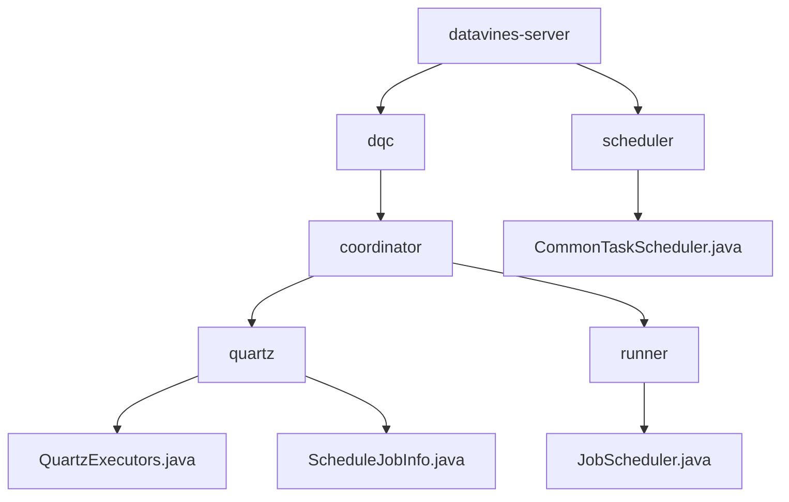
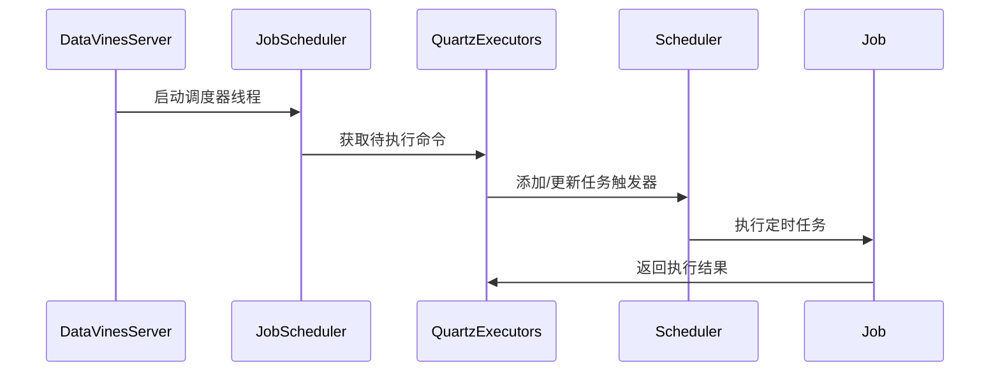
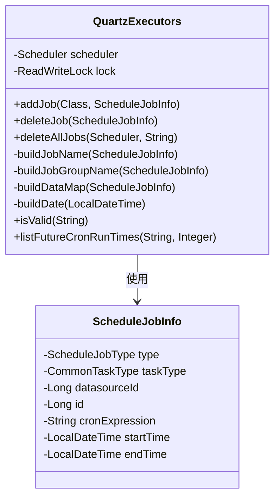
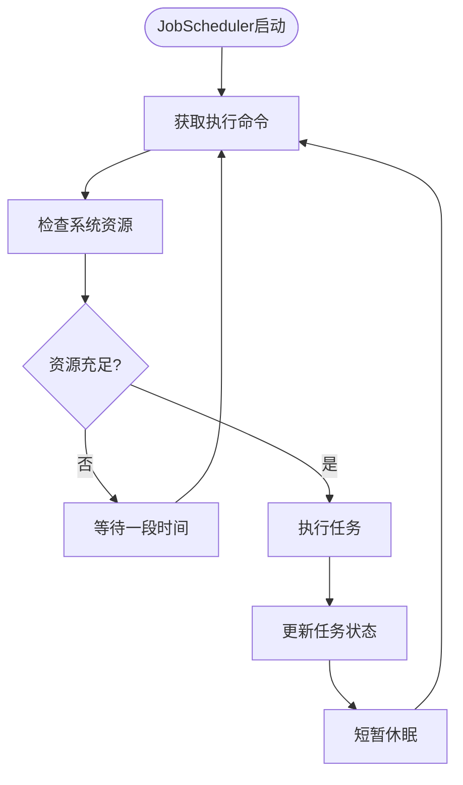
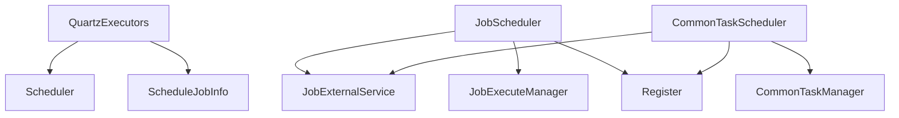

# 定时任务调度器初始化

<cite>
**本文档中引用的文件**   
- [QuartzExecutors.java](file://datavines-server/src/main/java/io/datavines/server/dqc/coordinator/quartz/QuartzExecutors.java)
- [JobScheduler.java](file://datavines-server/src/main/java/io/datavines/server/dqc/coordinator/runner/JobScheduler.java)
- [CommonTaskScheduler.java](file://datavines-server/src/main/java/io/datavines/server/scheduler/CommonTaskScheduler.java)
- [ScheduleJobInfo.java](file://datavines-server/src/main/java/io/datavines/server/dqc/coordinator/quartz/ScheduleJobInfo.java)
- [DataVinesServer.java](file://datavines-server/src/main/java/io/datavines/server/DataVinesServer.java)
</cite>

## 目录
1. [项目结构](#项目结构)
2. [核心组件](#核心组件)
3. [架构概述](#架构概述)
4. [详细组件分析](#详细组件分析)
5. [依赖分析](#依赖分析)

## 项目结构

**图表来源**
- [QuartzExecutors.java](file://datavines-server/src/main/java/io/datavines/server/dqc/coordinator/quartz/QuartzExecutors.java)
- [JobScheduler.java](file://datavines-server/src/main/java/io/datavines/server/dqc/coordinator/runner/JobScheduler.java)
- [CommonTaskScheduler.java](file://datavines-server/src/main/java/io/datavines/server/scheduler/CommonTaskScheduler.java)

## 核心组件

DataVines中的定时任务调度器基于Quartz框架实现，主要由QuartzExecutors、JobScheduler和ScheduleJobInfo等核心组件构成。QuartzExecutors负责创建和管理Quartz调度器实例，处理任务的增删改查操作。JobScheduler作为独立线程运行，负责从命令队列中获取待执行的任务并进行调度。ScheduleJobInfo数据结构定义了定时任务的元信息，包括Cron表达式、任务类型和执行参数等。

**章节来源**
- [QuartzExecutors.java](file://datavines-server/src/main/java/io/datavines/server/dqc/coordinator/quartz/QuartzExecutors.java#L1-L264)
- [JobScheduler.java](file://datavines-server/src/main/java/io/datavines/server/dqc/coordinator/runner/JobScheduler.java#L1-L155)
- [ScheduleJobInfo.java](file://datavines-server/src/main/java/io/datavines/server/dqc/coordinator/quartz/ScheduleJobInfo.java#L1-L58)

## 架构概述

**图表来源**
- [DataVinesServer.java](file://datavines-server/src/main/java/io/datavines/server/DataVinesServer.java#L91-L110)
- [JobScheduler.java](file://datavines-server/src/main/java/io/datavines/server/dqc/coordinator/runner/JobScheduler.java#L58-L134)
- [QuartzExecutors.java](file://datavines-server/src/main/java/io/datavines/server/dqc/coordinator/quartz/QuartzExecutors.java#L74-L148)

## 详细组件分析

### QuartzExecutors分析

QuartzExecutors是Quartz调度器的执行器，负责创建调度器实例并管理任务的生命周期。它通过Spring注入Scheduler实例，并使用读写锁保证线程安全。

**图表来源**
- [QuartzExecutors.java](file://datavines-server/src/main/java/io/datavines/server/dqc/coordinator/quartz/QuartzExecutors.java#L57-L264)
- [ScheduleJobInfo.java](file://datavines-server/src/main/java/io/datavines/server/dqc/coordinator/quartz/ScheduleJobInfo.java#L26-L58)

### JobScheduler分析

JobScheduler是任务调度的核心线程，负责从命令队列中获取待执行的任务并进行调度。它实现了资源检查机制，确保系统资源充足时才执行任务。

**图表来源**
- [JobScheduler.java](file://datavines-server/src/main/java/io/datavines/server/dqc/coordinator/runner/JobScheduler.java#L39-L134)

## 依赖分析

**图表来源**
- [pom.xml](file://pom.xml#L502-L507)
- [QuartzExecutors.java](file://datavines-server/src/main/java/io/datavines/server/dqc/coordinator/quartz/QuartzExecutors.java#L59-L60)
- [JobScheduler.java](file://datavines-server/src/main/java/io/datavines/server/dqc/coordinator/runner/JobScheduler.java#L45-L49)
- [CommonTaskScheduler.java](file://datavines-server/src/main/java/io/datavines/server/scheduler/CommonTaskScheduler.java#L35-L39)

**章节来源**
- [pom.xml](file://pom.xml#L502-L538)
- [QuartzExecutors.java](file://datavines-server/src/main/java/io/datavines/server/dqc/coordinator/quartz/QuartzExecutors.java)
- [JobScheduler.java](file://datavines-server/src/main/java/io/datavines/server/dqc/coordinator/runner/JobScheduler.java)
- [CommonTaskScheduler.java](file://datavines-server/src/main/java/io/datavines/server/scheduler/CommonTaskScheduler.java)