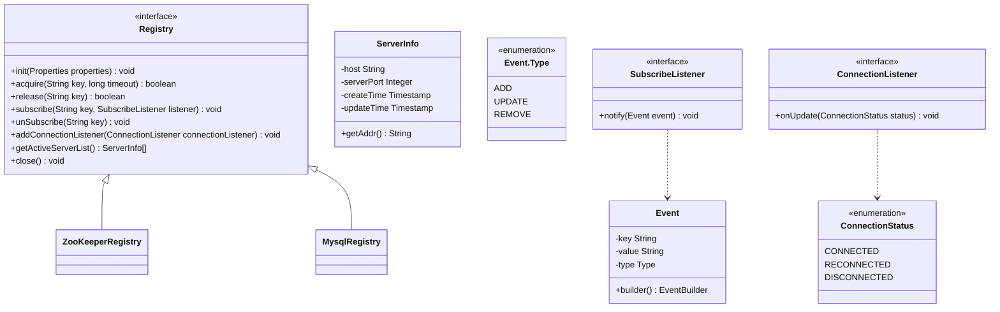
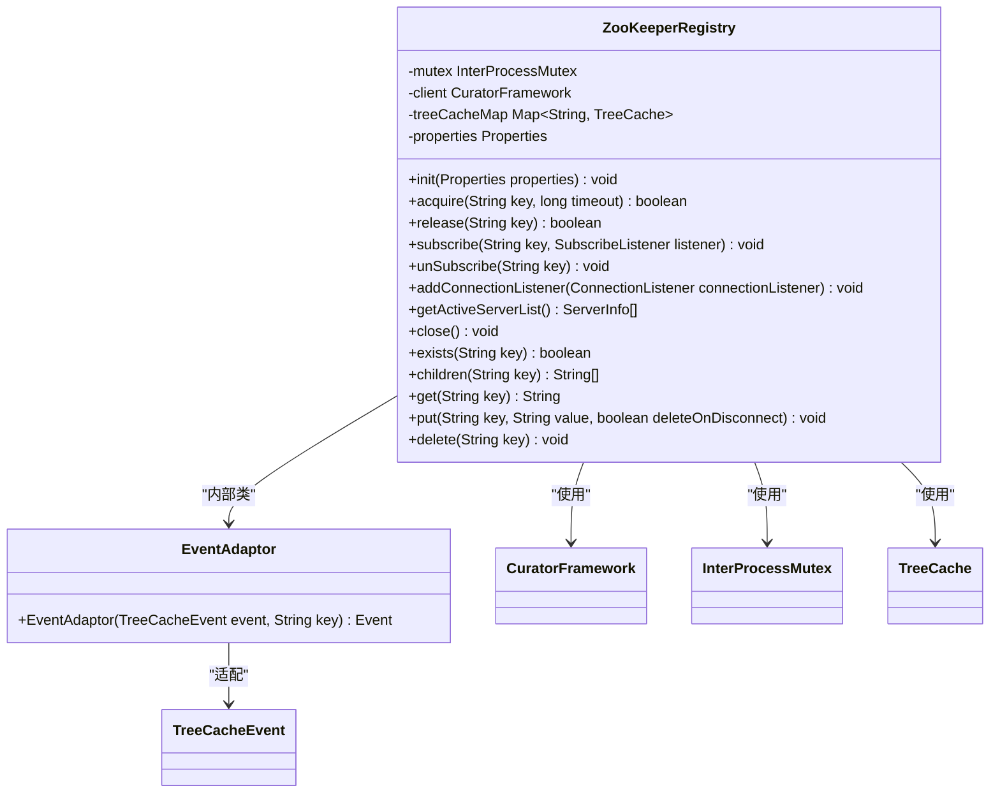
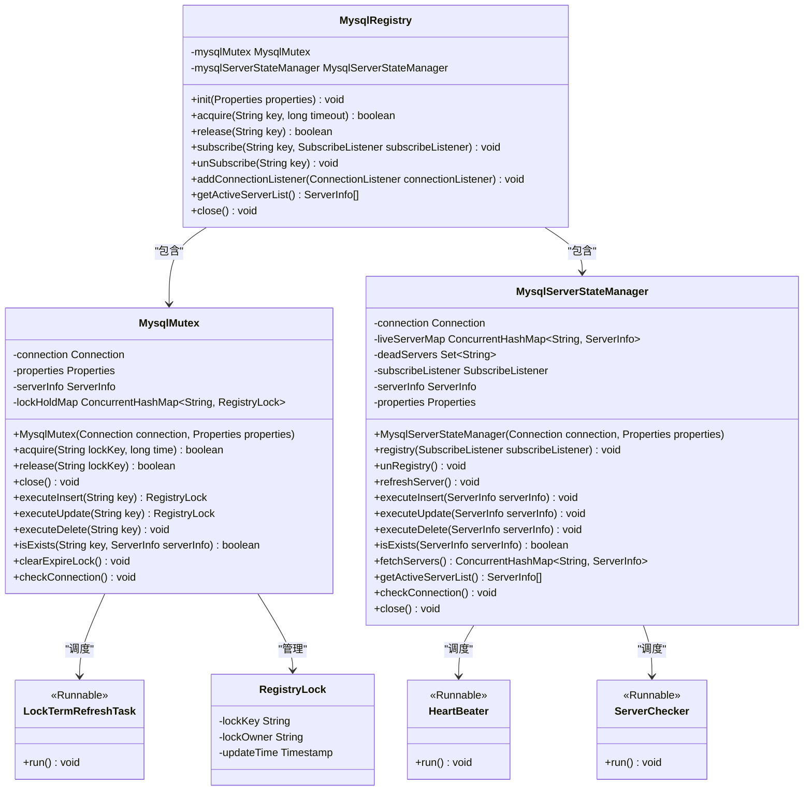
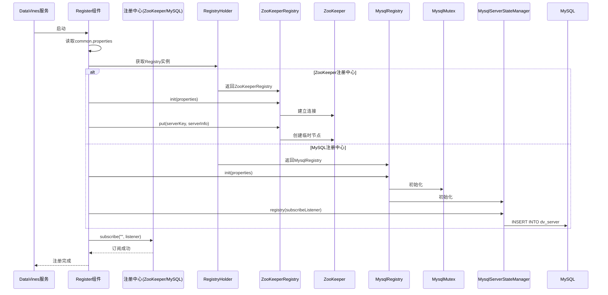
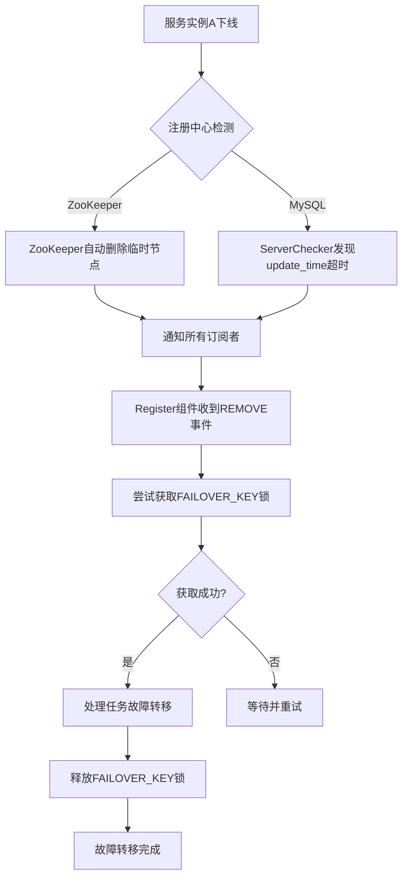
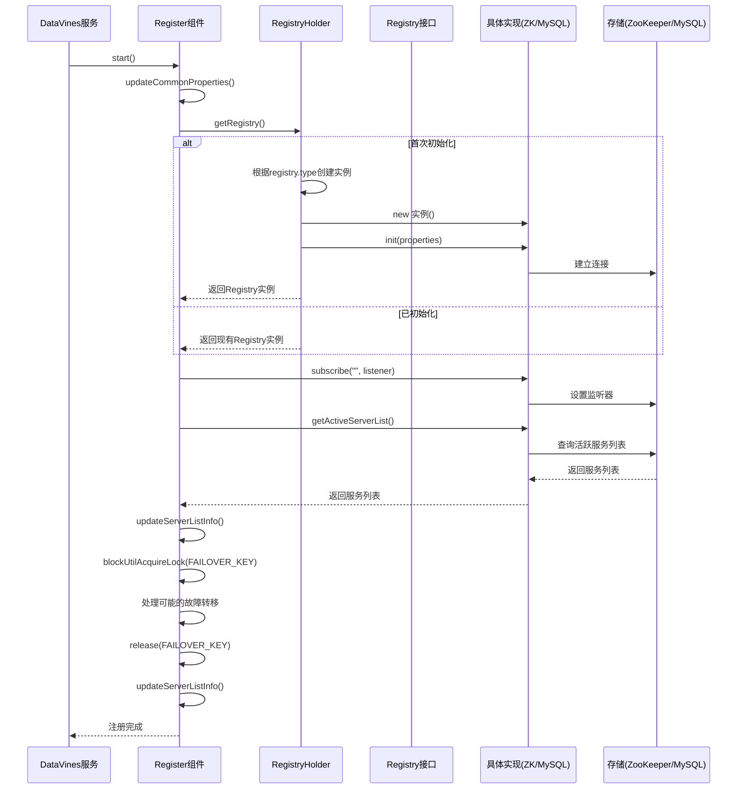

# 服务注册与发现

<cite>
**本文档引用的文件**  
- [Registry.java](file://datavines-registry/datavines-registry-api/src/main/java/io/datavines/registry/api/Registry.java)
- [ServerInfo.java](file://datavines-registry/datavines-registry-api/src/main/java/io/datavines/registry/api/ServerInfo.java)
- [ZooKeeperRegistry.java](file://datavines-registry/datavines-registry-plugins/datavines-registry-zookeeper/src/main/java/io/datavines/registry/plugin/ZooKeeperRegistry.java)
- [MysqlRegistry.java](file://datavines-registry/datavines-registry-plugins/datavines-registry-mysql/src/main/java/io/datavines/registry/plugin/MysqlRegistry.java)
- [MysqlServerStateManager.java](file://datavines-registry/datavines-registry-plugins/datavines-registry-mysql/src/main/java/io/datavines/registry/plugin/MysqlServerStateManager.java)
- [MysqlMutex.java](file://datavines-registry/datavines-registry-plugins/datavines-registry-mysql/src/main/java/io/datavines/registry/plugin/MysqlMutex.java)
- [Register.java](file://datavines-server/src/main/java/io/datavines/server/registry/Register.java)
- [common.properties](file://datavines-common/src/main/resources/common.properties)
</cite>

## 目录
1. [引言](#引言)
2. [注册中心接口设计](#注册中心接口设计)
3. [ZooKeeper与MySQL注册中心实现差异](#zookeeper与mysql注册中心实现差异)
4. [服务注册流程](#服务注册流程)
5. [心跳检测与故障转移机制](#心跳检测与故障转移机制)
6. [服务注销与资源清理](#服务注销与资源清理)
7. [服务注册时序图](#服务注册时序图)
8. [总结](#总结)

## 引言
DataVines作为一个分布式数据质量平台，其高可用架构依赖于可靠的服务注册与发现机制。本文档深入分析DataVines的服务注册与发现机制，重点解析Registry接口的设计原理，对比ZooKeeper和MySQL两种注册中心实现的差异，详细描述服务启动时的注册过程、心跳检测机制、故障转移策略以及服务注销流程。

## 注册中心接口设计
DataVines通过`Registry`接口抽象了服务注册与发现的核心功能，实现了注册中心的可插拔设计。该接口定义了服务注册、发现、锁管理、事件订阅等关键操作。

**图示来源**
- [Registry.java](file://datavines-registry/datavines-registry-api/src/main/java/io/datavines/registry/api/Registry.java)
- [ServerInfo.java](file://datavines-registry/datavines-registry-api/src/main/java/io/datavines/registry/api/ServerInfo.java)
- [Event.java](file://datavines-registry/datavines-registry-api/src/main/java/io/datavines/registry/api/Event.java)
- [SubscribeListener.java](file://datavines-registry/datavines-registry-api/src/main/java/io/datavines/registry/api/SubscribeListener.java)
- [ConnectionListener.java](file://datavines-registry/datavines-registry-api/src/main/java/io/datavines/registry/api/ConnectionListener.java)
- [ConnectionStatus.java](file://datavines-registry/datavines-registry-api/src/main/java/io/datavines/registry/api/ConnectionStatus.java)

**本节来源**
- [Registry.java](file://datavines-registry/datavines-registry-api/src/main/java/io/datavines/registry/api/Registry.java#L26-L43)
- [ServerInfo.java](file://datavines-registry/datavines-registry-api/src/main/java/io/datavines/registry/api/ServerInfo.java#L30-L48)

## ZooKeeper与MySQL注册中心实现差异
DataVines提供了ZooKeeper和MySQL两种注册中心实现，分别适用于不同的部署场景和可靠性要求。

### ZooKeeper注册中心实现
`ZooKeeperRegistry`基于Apache Curator客户端实现，利用ZooKeeper的临时节点（EPHEMERAL）特性来管理服务实例的生命周期。当服务实例启动时，它会在ZooKeeper中创建一个临时节点，节点的路径和数据包含了服务的IP地址和端口信息。ZooKeeper的强一致性保证了服务列表的准确性，而临时节点的特性确保了当服务实例异常关闭时，其注册信息会自动从ZooKeeper中移除。

**图示来源**
- [ZooKeeperRegistry.java](file://datavines-registry/datavines-registry-plugins/datavines-registry-zookeeper/src/main/java/io/datavines/registry/plugin/ZooKeeperRegistry.java)

**本节来源**
- [ZooKeeperRegistry.java](file://datavines-registry/datavines-registry-plugins/datavines-registry-zookeeper/src/main/java/io/datavines/registry/plugin/ZooKeeperRegistry.java#L43-L241)

### MySQL注册中心实现
`MysqlRegistry`基于关系型数据库MySQL实现，通过在数据库中维护`dv_server`表来存储服务实例信息。与ZooKeeper不同，MySQL注册中心需要显式的心跳机制来维护服务的活跃状态。`MysqlServerStateManager`类负责管理服务的心跳和状态检查，通过定时任务更新服务的`update_time`字段，并根据该字段判断服务是否存活。

**图示来源**
- [MysqlRegistry.java](file://datavines-registry/datavines-registry-plugins/datavines-registry-mysql/src/main/java/io/datavines/registry/plugin/MysqlRegistry.java)
- [MysqlServerStateManager.java](file://datavines-registry/datavines-registry-plugins/datavines-registry-mysql/src/main/java/io/datavines/registry/plugin/MysqlServerStateManager.java)
- [MysqlMutex.java](file://datavines-registry/datavines-registry-plugins/datavines-registry-mysql/src/main/java/io/datavines/registry/plugin/MysqlMutex.java)

**本节来源**
- [MysqlRegistry.java](file://datavines-registry/datavines-registry-plugins/datavines-registry-mysql/src/main/java/io/datavines/registry/plugin/MysqlRegistry.java#L29-L107)
- [MysqlServerStateManager.java](file://datavines-registry/datavines-registry-plugins/datavines-registry-mysql/src/main/java/io/datavines/registry/plugin/MysqlServerStateManager.java#L33-L257)
- [MysqlMutex.java](file://datavines-registry/datavines-registry-plugins/datavines-registry-mysql/src/main/java/io/datavines/registry/plugin/MysqlMutex.java#L36-L218)

## 服务注册流程
当DataVines服务启动时，`Register`组件负责向注册中心注册自身实例。整个流程如下：

1.  **配置初始化**：服务启动时，从`common.properties`文件中读取注册中心类型（`registry.type`），决定使用ZooKeeper还是MySQL作为注册中心。
2.  **注册中心初始化**：`Register`组件通过`RegistryHolder`获取对应的`Registry`实例，并调用其`init()`方法进行初始化。对于ZooKeeper，这会建立与ZooKeeper集群的连接；对于MySQL，这会建立数据库连接。
3.  **元数据注册**：`Register`组件获取本机的IP地址和端口号，构建`ServerInfo`对象，并通过注册中心的`put()`方法（ZooKeeper）或`registry()`方法（MySQL）将服务实例信息写入注册中心。
4.  **事件订阅**：`Register`组件订阅服务列表变更事件，以便在其他服务实例上线或下线时能够及时收到通知。

**图示来源**
- [Register.java](file://datavines-server/src/main/java/io/datavines/server/registry/Register.java)
- [ZooKeeperRegistry.java](file://datavines-registry/datavines-registry-plugins/datavines-registry-zookeeper/src/main/java/io/datavines/registry/plugin/ZooKeeperRegistry.java)
- [MysqlRegistry.java](file://datavines-registry/datavines-registry-plugins/datavines-registry-mysql/src/main/java/io/datavines/registry/plugin/MysqlRegistry.java)
- [MysqlServerStateManager.java](file://datavines-registry/datavines-registry-plugins/datavines-registry-mysql/src/main/java/io/datavines/registry/plugin/MysqlServerStateManager.java)
- [common.properties](file://datavines-common/src/main/resources/common.properties)

**本节来源**
- [Register.java](file://datavines-server/src/main/java/io/datavines/server/registry/Register.java#L70-L135)
- [ZooKeeperRegistry.java](file://datavines-registry/datavines-registry-plugins/datavines-registry-zookeeper/src/main/java/io/datavines/registry/plugin/ZooKeeperRegistry.java#L56-L74)
- [MysqlRegistry.java](file://datavines-registry/datavines-registry-plugins/datavines-registry-mysql/src/main/java/io/datavines/registry/plugin/MysqlRegistry.java#L36-L50)
- [MysqlServerStateManager.java](file://datavines-registry/datavines-registry-plugins/datavines-registry-mysql/src/main/java/io/datavines/registry/plugin/MysqlServerStateManager.java#L47-L67)

## 心跳检测与故障转移机制
心跳检测是确保服务列表准确性的关键机制，DataVines针对两种注册中心实现了不同的心跳策略。

### ZooKeeper心跳机制
ZooKeeper本身通过会话（Session）机制实现了心跳。当`ZooKeeperRegistry`创建一个临时节点后，Curator客户端会自动与ZooKeeper服务器保持心跳。只要客户端进程正常运行，会话就不会过期，临时节点就会一直存在。一旦客户端进程崩溃或网络中断，会话超时，ZooKeeper会自动删除该临时节点，从而实现服务的自动注销。

### MySQL心跳机制
由于MySQL是无状态的数据库，`MysqlRegistry`必须实现显式的心跳机制。`MysqlServerStateManager`在初始化时会启动两个定时任务：
-   **HeartBeater**：每2秒执行一次，更新`dv_server`表中本服务实例的`update_time`字段。
-   **ServerChecker**：每10秒执行一次，查询`dv_server`表中所有服务实例，根据`update_time`与当前时间的差值（超过20秒）判断服务是否存活。如果发现有服务实例超时，则将其从`liveServerMap`中移除，并通过`SubscribeListener`通知其他服务实例。

### 故障转移策略
当`Register`组件检测到有服务实例下线（通过`SubscribeListener`收到`REMOVE`事件）时，会触发故障转移流程：
1.  尝试获取`FAILOVER_KEY`锁，确保同一时间只有一个服务实例处理故障转移。
2.  调用`JobExecutionFailover`和`CommonTaskFailover`处理器，重新分配下线服务实例上正在运行的任务。
3.  释放`FAILOVER_KEY`锁。

**图示来源**
- [MysqlServerStateManager.java](file://datavines-registry/datavines-registry-plugins/datavines-registry-mysql/src/main/java/io/datavines/registry/plugin/MysqlServerStateManager.java)
- [Register.java](file://datavines-server/src/main/java/io/datavines/server/registry/Register.java)

**本节来源**
- [MysqlServerStateManager.java](file://datavines-registry/datavines-registry-plugins/datavines-registry-mysql/src/main/java/io/datavines/registry/plugin/MysqlServerStateManager.java#L212-L244)
- [Register.java](file://datavines-server/src/main/java/io/datavines/server/registry/Register.java#L88-L108)

## 服务注销与资源清理
服务的正常注销和异常关闭时的资源清理是保证系统稳定的重要环节。

### 正常注销流程
当服务正常关闭时，`Register`组件的`close()`方法会被调用，进而调用`Registry`的`close()`方法。
-   **ZooKeeper**：`ZooKeeperRegistry`的`close()`方法会关闭`CuratorFramework`客户端和所有`TreeCache`，ZooKeeper会自动删除该客户端创建的所有临时节点。
-   **MySQL**：`MysqlRegistry`的`close()`方法会依次调用`MysqlMutex`和`MysqlServerStateManager`的`close()`方法。`MysqlServerStateManager`会执行`unRegistry()`，从`dv_server`表中删除本服务实例的记录。

### 异常关闭处理
-   **ZooKeeper**：由于使用了临时节点，服务异常关闭后，ZooKeeper会在会话超时后自动清理其注册信息，无需额外处理。
-   **MySQL**：服务异常关闭时，无法执行`unRegistry()`。此时依赖`ServerChecker`定时任务来发现超时的服务实例，并将其从`dv_server`表中清理。

**本节来源**
- [ZooKeeperRegistry.java](file://datavines-registry/datavines-registry-plugins/datavines-registry-zookeeper/src/main/java/io/datavines/registry/plugin/ZooKeeperRegistry.java#L208-L211)
- [MysqlRegistry.java](file://datavines-registry/datavines-registry-plugins/datavines-registry-mysql/src/main/java/io/datavines/registry/plugin/MysqlRegistry.java#L102-L105)
- [MysqlServerStateManager.java](file://datavines-registry/datavines-registry-plugins/datavines-registry-mysql/src/main/java/io/datavines/registry/plugin/MysqlServerStateManager.java#L69-L71)

## 服务注册时序图
以下时序图详细展示了DataVines服务启动时，客户端与注册中心的完整交互过程。

**图示来源**
- [Register.java](file://datavines-server/src/main/java/io/datavines/server/registry/Register.java)
- [RegistryHolder.java](file://datavines-server/src/main/java/io/datavines/server/registry/RegistryHolder.java)
- [ZooKeeperRegistry.java](file://datavines-registry/datavines-registry-plugins/datavines-registry-zookeeper/src/main/java/io/datavines/registry/plugin/ZooKeeperRegistry.java)
- [MysqlRegistry.java](file://datavines-registry/datavines-registry-plugins/datavines-registry-mysql/src/main/java/io/datavines/registry/plugin/MysqlRegistry.java)

**本节来源**
- [Register.java](file://datavines-server/src/main/java/io/datavines/server/registry/Register.java#L88-L135)
- [RegistryHolder.java](file://datavines-server/src/main/java/io/datavines/server/registry/RegistryHolder.java#L29-L48)

## 总结
DataVines通过精心设计的`Registry`接口和SPI机制，实现了灵活的服务注册与发现功能。ZooKeeper实现利用了其分布式协调能力，提供了强一致性和自动故障检测，适用于对高可用性要求极高的场景。MySQL实现则降低了部署复杂度，通过定时心跳和状态检查来维护服务列表，适用于资源受限或已有MySQL基础设施的环境。两种实现都通过`Register`组件与核心业务逻辑解耦，确保了服务治理机制的稳定性和可维护性。