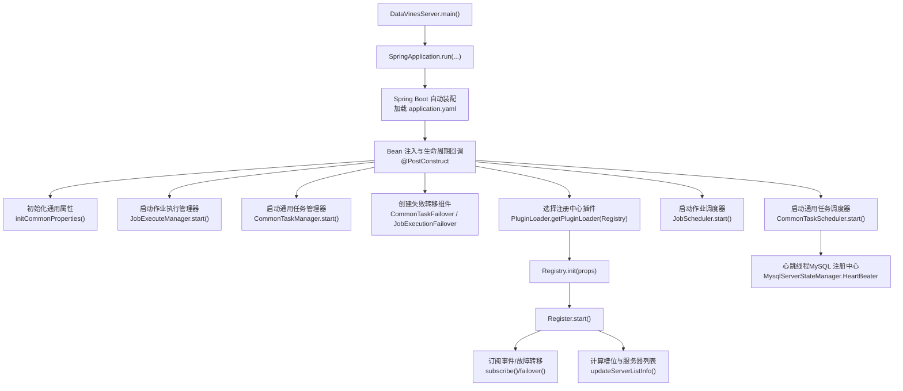
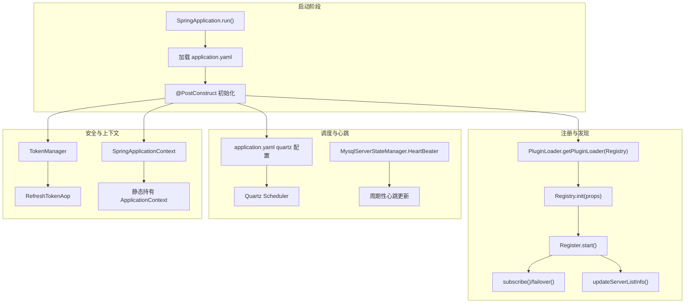
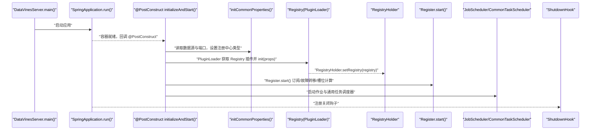
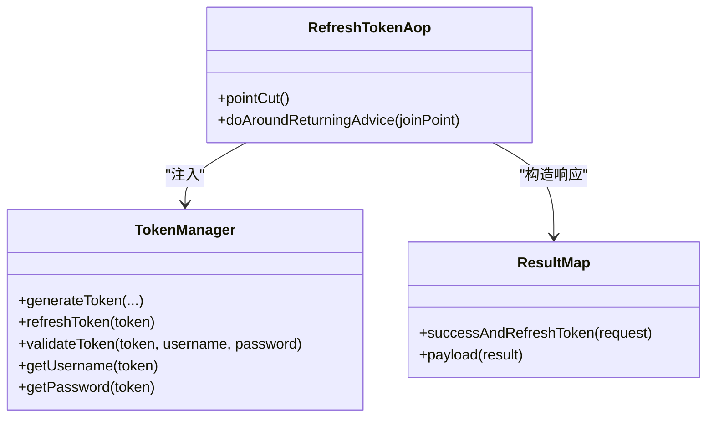
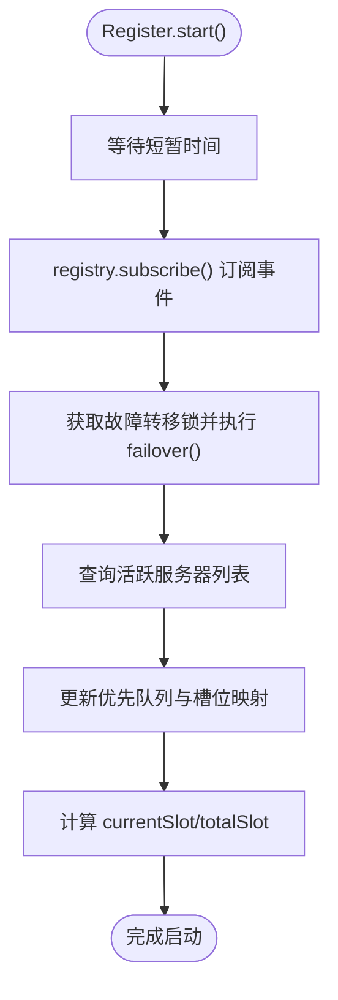
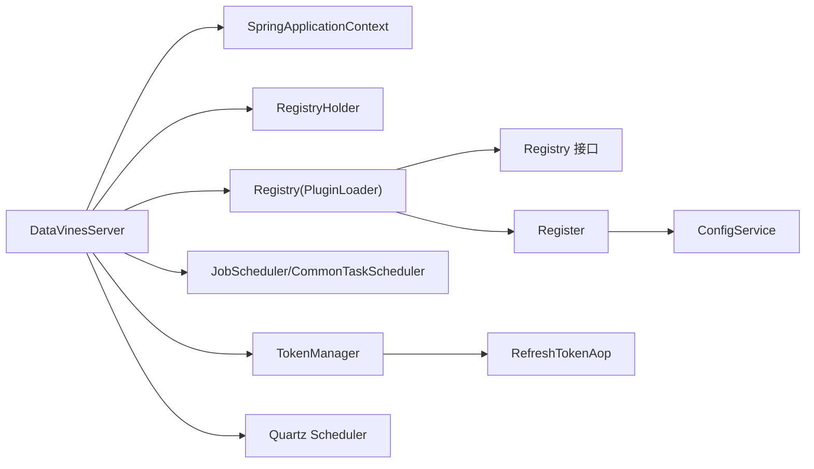
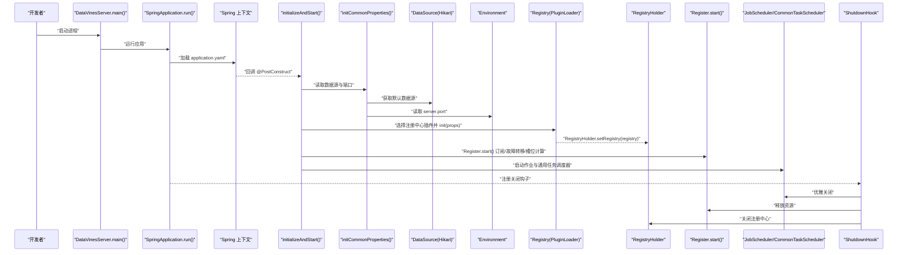

# 系统启动流程

<cite>
**本文引用的文件列表**
- [DataVinesServer.java](file://datavines-server/src/main/java/io/datavines/server/DataVinesServer.java)
- [application.yaml](file://datavines-server/src/main/resources/application.yaml)
- [TokenManager.java](file://datavines-core/src/main/java/io/datavines/core/utils/TokenManager.java)
- [RefreshTokenAop.java](file://datavines-core/src/main/java/io/datavines/core/aop/RefreshTokenAop.java)
- [Register.java](file://datavines-server/src/main/java/io/datavines/server/registry/Register.java)
- [Registry.java](file://datavines-registry/registry-api/src/main/java/io/datavines/registry/api/Registry.java)
- [RegistryHolder.java](file://datavines-server/src/main/java/io/datavines/server/registry/RegistryHolder.java)
- [CommonTaskScheduler.java](file://datavines-server/src/main/java/io/datavines/server/scheduler/CommonTaskScheduler.java)
- [SpringApplicationContext.java](file://datavines-server/src/main/java/io/datavines/server/utils/SpringApplicationContext.java)
- [CommonPropertyUtils.java](file://datavines-common/src/main/java/io/datavines/common/utils/CommonPropertyUtils.java)
- [common.properties](file://datavines-common/src/main/resources/common.properties)
- [MysqlServerStateManager.java](file://datavines-registry/registry-plugins/datavines-registry-mysql/src/main/java/io/datavines/registry/plugin/MysqlServerStateManager.java)
</cite>

## 目录
1. [引言](#引言)
2. [项目结构](#项目结构)
3. [核心组件](#核心组件)
4. [架构总览](#架构总览)
5. [详细组件分析](#详细组件分析)
6. [依赖关系分析](#依赖关系分析)
7. [性能考量](#性能考量)
8. [故障排查指南](#故障排查指南)
9. [结论](#结论)
10. [附录：启动时序图](#附录启动时序图)

## 引言
本文件围绕 DataVines 的系统启动流程进行深入解析，自 DataVinesServer 主类的 main 方法出发，逐步阐述 Spring 应用上下文初始化过程（配置文件加载、Bean 注入、AOP 代理创建）、服务注册与发现机制（Registry 接口及 ZooKeeper/MySQL 注册中心自动注册）、定时任务调度器（Quartz）初始化与心跳检测线程启动，以及 TokenManager 初始化与安全配置加载顺序。同时提供启动时序图，标注关键步骤的时间节点与依赖关系，帮助开发者快速定位启动过程中的关键检查点。

## 项目结构
DataVines 采用多模块分层组织，Server 启动入口位于 datavines-server 模块，核心业务与工具分布在 datavines-core、datavines-common、datavines-registry 等模块。启动流程的关键路径如下：
- 入口类：DataVinesServer
- 配置文件：application.yaml
- 安全与 AOP：TokenManager、RefreshTokenAop
- 注册与发现：Registry 接口、Register 实现、RegistryHolder
- 调度与心跳：CommonTaskScheduler、Quartz（由 application.yaml 配置）、MysqlServerStateManager 心跳线程
- 属性与上下文：CommonPropertyUtils、SpringApplicationContext

图表来源
- [DataVinesServer.java](file://datavines-server/src/main/java/io/datavines/server/DataVinesServer.java#L69-L110)
- [application.yaml](file://datavines-server/src/main/resources/application.yaml#L17-L63)
- [Register.java](file://datavines-server/src/main/java/io/datavines/server/registry/Register.java#L88-L135)
- [MysqlServerStateManager.java](file://datavines-registry/registry-plugins/datavines-registry-mysql/src/main/java/io/datavines/registry/plugin/MysqlServerStateManager.java#L50-L54)

章节来源
- [DataVinesServer.java](file://datavines-server/src/main/java/io/datavines/server/DataVinesServer.java#L69-L110)
- [application.yaml](file://datavines-server/src/main/resources/application.yaml#L17-L63)

## 核心组件
- DataVinesServer：Spring Boot 启动入口，负责应用上下文初始化、通用属性初始化、服务组件启动与优雅关闭。
- Registry 接口与实现：抽象注册中心能力，支持 ZooKeeper 或 MySQL 等后端；Register 封装注册、订阅、槽位分配与故障转移。
- Quartz：基于 JDBC 的集群化调度配置，由 application.yaml 驱动。
- TokenManager 与 RefreshTokenAop：提供 JWT 签发与刷新，配合 AOP 对加注解的控制器返回结果统一刷新令牌。
- SpringApplicationContext：静态持有 ApplicationContext，便于非 Spring 管理对象获取 Bean。
- CommonPropertyUtils：全局属性读取与覆盖，用于注册中心类型、端口等关键参数。

章节来源
- [DataVinesServer.java](file://datavines-server/src/main/java/io/datavines/server/DataVinesServer.java#L69-L110)
- [Registry.java](file://datavines-registry/registry-api/src/main/java/io/datavines/registry/api/Registry.java#L25-L43)
- [Register.java](file://datavines-server/src/main/java/io/datavines/server/registry/Register.java#L70-L135)
- [application.yaml](file://datavines-server/src/main/resources/application.yaml#L39-L63)
- [TokenManager.java](file://datavines-core/src/main/java/io/datavines/core/utils/TokenManager.java#L38-L110)
- [RefreshTokenAop.java](file://datavines-core/src/main/java/io/datavines/core/aop/RefreshTokenAop.java#L35-L59)
- [SpringApplicationContext.java](file://datavines-server/src/main/java/io/datavines/server/utils/SpringApplicationContext.java#L25-L45)
- [CommonPropertyUtils.java](file://datavines-common/src/main/java/io/datavines/common/utils/CommonPropertyUtils.java#L109-L130)

## 架构总览
DataVines 启动阶段的核心交互如下：
- Spring Boot 启动后加载 application.yaml，完成数据源、Quartz、端口等基础配置。
- DataVinesServer 在 @PostConstruct 中完成通用属性初始化、组件启动与注册中心初始化。
- 注册中心根据配置选择 ZooKeeper 或 MySQL 插件，建立连接并启动心跳线程。
- Register 订阅事件，触发故障转移，并维护当前服务器在活跃列表中的槽位信息。
- Quartz 由 Spring Boot 自动装配，使用 JDBC 存储任务元数据，支持集群模式。
- TokenManager 作为 Spring 组件被 AOP 切面注入，用于生成与刷新令牌。

图表来源
- [DataVinesServer.java](file://datavines-server/src/main/java/io/datavines/server/DataVinesServer.java#L69-L110)
- [application.yaml](file://datavines-server/src/main/resources/application.yaml#L39-L63)
- [Register.java](file://datavines-server/src/main/java/io/datavines/server/registry/Register.java#L88-L135)
- [MysqlServerStateManager.java](file://datavines-registry/registry-plugins/datavines-registry-mysql/src/main/java/io/datavines/registry/plugin/MysqlServerStateManager.java#L50-L54)
- [TokenManager.java](file://datavines-core/src/main/java/io/datavines/core/utils/TokenManager.java#L38-L110)
- [RefreshTokenAop.java](file://datavines-core/src/main/java/io/datavines/core/aop/RefreshTokenAop.java#L35-L59)
- [SpringApplicationContext.java](file://datavines-server/src/main/java/io/datavines/server/utils/SpringApplicationContext.java#L25-L45)

## 详细组件分析

### DataVinesServer 启动流程与关键步骤
- main 方法：设置线程名并调用 SpringApplication.run，进入 Spring Boot 启动序列。
- @PostConstruct initializeAndStart：
  - 初始化通用属性：从 Spring 上下文获取默认数据源，填充 CommonPropertyUtils，修正注册中心类型为 MySQL 或 PostgreSQL。
  - 启动 JobExecuteManager 与 JobExecutionResponseProcessor。
  - 启动 CommonTaskManager 与 CommonTaskFailover。
  - 通过 PluginLoader 获取 Registry 插件并初始化，随后创建 Register 并启动。
  - 启动 JobScheduler 与 CommonTaskScheduler。
  - 注册 JVM 关闭钩子，优雅关闭时依次释放资源。

图表来源
- [DataVinesServer.java](file://datavines-server/src/main/java/io/datavines/server/DataVinesServer.java#L69-L110)
- [DataVinesServer.java](file://datavines-server/src/main/java/io/datavines/server/DataVinesServer.java#L141-L158)
- [Register.java](file://datavines-server/src/main/java/io/datavines/server/registry/Register.java#L88-L135)

章节来源
- [DataVinesServer.java](file://datavines-server/src/main/java/io/datavines/server/DataVinesServer.java#L69-L110)
- [DataVinesServer.java](file://datavines-server/src/main/java/io/datavines/server/DataVinesServer.java#L141-L158)

### 配置文件加载与 Bean 注入
- application.yaml：
  - 数据源与 HikariCP 连接池参数。
  - Quartz 使用 JDBC 存储、集群模式、线程池大小、表前缀、检查间隔等。
  - server.port 指定服务端口。
  - logging 指向 server-logback.xml。
  - 提供 MySQL profile 下的 quartz 驱动委托类配置。
- Bean 注入：
  - DataVinesServer 持有 SpringApplicationContext、Environment、RegistryHolder。
  - SpringApplicationContext 提供静态 getBean 方法，供非 Spring 管理组件获取 Bean。
  - TokenManager 作为 Spring 组件，@Value 注入 jwt 配置。

章节来源
- [application.yaml](file://datavines-server/src/main/resources/application.yaml#L17-L96)
- [SpringApplicationContext.java](file://datavines-server/src/main/java/io/datavines/server/utils/SpringApplicationContext.java#L25-L45)
- [TokenManager.java](file://datavines-core/src/main/java/io/datavines/core/utils/TokenManager.java#L38-L50)

### AOP 代理创建与 TokenManager 初始化
- TokenManager：
  - 作为 Spring 组件，使用 @Value 从配置中读取 jwt.secret、timeout、algorithm。
  - 提供签发、刷新、校验与过期判断等方法。
- RefreshTokenAop：
  - 基于 @Aspect 的环绕通知，拦截加注解的控制器方法，在返回前统一刷新令牌并封装响应。
  - 通过 @Resource 注入 TokenManager。
- AOP 代理创建：
  - Spring Boot Starter AOP 已引入，结合 @EnableAspectJAutoProxy，确保切面生效。
  - TokenManager 与 RefreshTokenAop 均为 Spring Bean，由容器负责实例化与代理包装。

图表来源
- [TokenManager.java](file://datavines-core/src/main/java/io/datavines/core/utils/TokenManager.java#L38-L110)
- [RefreshTokenAop.java](file://datavines-core/src/main/java/io/datavines/core/aop/RefreshTokenAop.java#L35-L59)

章节来源
- [TokenManager.java](file://datavines-core/src/main/java/io/datavines/core/utils/TokenManager.java#L38-L110)
- [RefreshTokenAop.java](file://datavines-core/src/main/java/io/datavines/core/aop/RefreshTokenAop.java#L35-L59)

### 服务注册与发现机制
- Registry 接口：
  - 定义 init、acquire、release、subscribe、unSubscribe、getActiveServerList、close 等能力。
- Register：
  - 通过 PluginLoader 获取具体 Registry 实现，初始化后订阅事件。
  - 启动时尝试获取故障转移锁，执行作业与通用任务的故障转移逻辑。
  - 维护活跃服务器列表，计算当前服务器在队列中的槽位，用于任务分片。
- RegistryHolder：
  - 保存已初始化的 Registry 实例，供其他组件使用。
- 注册中心类型选择：
  - 默认值来自 common.properties；若未显式指定，DataVinesServer 会依据数据源 URL 自动推断为 mysql 或 postgresql。

图表来源
- [Register.java](file://datavines-server/src/main/java/io/datavines/server/registry/Register.java#L88-L135)
- [Registry.java](file://datavines-registry/registry-api/src/main/java/io/datavines/registry/api/Registry.java#L25-L43)
- [RegistryHolder.java](file://datavines-server/src/main/java/io/datavines/server/registry/RegistryHolder.java#L24-L36)
- [common.properties](file://datavines-common/src/main/resources/common.properties#L18-L25)
- [DataVinesServer.java](file://datavines-server/src/main/java/io/datavines/server/DataVinesServer.java#L151-L156)

章节来源
- [Register.java](file://datavines-server/src/main/java/io/datavines/server/registry/Register.java#L70-L135)
- [Registry.java](file://datavines-registry/registry-api/src/main/java/io/datavines/registry/api/Registry.java#L25-L43)
- [RegistryHolder.java](file://datavines-server/src/main/java/io/datavines/server/registry/RegistryHolder.java#L24-L36)
- [common.properties](file://datavines-common/src/main/resources/common.properties#L18-L25)
- [DataVinesServer.java](file://datavines-server/src/main/java/io/datavines/server/DataVinesServer.java#L151-L156)

### 定时任务调度器（Quartz）初始化
- application.yaml 中配置了 Quartz 使用 JDBC 存储、集群模式、线程池大小、表前缀、检查间隔等。
- Spring Boot 自动装配 Quartz Scheduler，使用本地数据源存储任务元数据。
- 业务侧通过 QuartzExecutors 等服务添加/更新任务触发器，实现按 Cron 表达式调度。

章节来源
- [application.yaml](file://datavines-server/src/main/resources/application.yaml#L39-L63)

### 心跳检测线程启动
- 在 MySQL 注册中心实现中，MysqlServerStateManager 启动两个 ScheduledExecutorService：
  - HeartBeater：每 2 秒更新一次心跳记录。
  - ServerChecker：每 10 秒扫描一次活跃服务器列表，检测离线节点并触发故障转移。
- 心跳与离线检测保证了注册中心的可用性与一致性。

章节来源
- [MysqlServerStateManager.java](file://datavines-registry/registry-plugins/datavines-registry-mysql/src/main/java/io/datavines/registry/plugin/MysqlServerStateManager.java#L50-L54)
- [MysqlServerStateManager.java](file://datavines-registry/registry-plugins/datavines-registry-mysql/src/main/java/io/datavines/registry/plugin/MysqlServerStateManager.java#L212-L244)

### 调试日志与断点建议
- 关键日志位置：
  - DataVinesServer.initializeAndStart() 开始与结束日志。
  - Register.updateServerListInfo() 输出活跃服务器列表与槽位信息。
  - MysqlServerStateManager.HeartBeater/ServerChecker 日志输出心跳与离线检测结果。
- 断点建议：
  - DataVinesServer.main() 入口处。
  - DataVinesServer.initializeAndStart() 内部各组件初始化处。
  - Register.start() 订阅事件处理分支。
  - MysqlServerStateManager.registry() 初始化与心跳循环。

章节来源
- [DataVinesServer.java](file://datavines-server/src/main/java/io/datavines/server/DataVinesServer.java#L74-L110)
- [Register.java](file://datavines-server/src/main/java/io/datavines/server/registry/Register.java#L163-L192)
- [MysqlServerStateManager.java](file://datavines-registry/registry-plugins/datavines-registry-mysql/src/main/java/io/datavines/registry/plugin/MysqlServerStateManager.java#L212-L244)

## 依赖关系分析
- 组件耦合与内聚：
  - DataVinesServer 与 Spring 上下文强耦合，但通过 SpringApplicationContext 降低直接依赖。
  - Register 依赖 Registry 接口与 ConfigService，通过 SPI 插件化实现注册中心可替换。
  - TokenManager 与 RefreshTokenAop 通过 Spring 注入，形成横切关注点。
- 外部依赖：
  - Quartz 由 application.yaml 驱动，使用 JDBC 存储。
  - 注册中心可选 ZooKeeper 或 MySQL，通过 PluginLoader 动态加载。
- 循环依赖风险：
  - 当前结构未见明显循环依赖；Register 与 ConfigService 通过 Spring 解耦。

图表来源
- [DataVinesServer.java](file://datavines-server/src/main/java/io/datavines/server/DataVinesServer.java#L69-L110)
- [Register.java](file://datavines-server/src/main/java/io/datavines/server/registry/Register.java#L70-L135)
- [Registry.java](file://datavines-registry/registry-api/src/main/java/io/datavines/registry/api/Registry.java#L25-L43)
- [TokenManager.java](file://datavines-core/src/main/java/io/datavines/core/utils/TokenManager.java#L38-L110)
- [RefreshTokenAop.java](file://datavines-core/src/main/java/io/datavines/core/aop/RefreshTokenAop.java#L35-L59)

章节来源
- [DataVinesServer.java](file://datavines-server/src/main/java/io/datavines/server/DataVinesServer.java#L69-L110)
- [Register.java](file://datavines-server/src/main/java/io/datavines/server/registry/Register.java#L70-L135)
- [Registry.java](file://datavines-registry/registry-api/src/main/java/io/datavines/registry/api/Registry.java#L25-L43)
- [TokenManager.java](file://datavines-core/src/main/java/io/datavines/core/utils/TokenManager.java#L38-L110)
- [RefreshTokenAop.java](file://datavines-core/src/main/java/io/datavines/core/aop/RefreshTokenAop.java#L35-L59)

## 性能考量
- 线程池与并发：
  - Quartz 线程池大小与守护线程设置需结合业务负载调整。
  - Register 与 CommonTaskScheduler 使用固定退避策略与睡眠间隔，避免过度轮询。
- 资源释放：
  - 优雅关闭时依次释放 JobExecuteManager、Register、Failover 与数据源，防止资源泄漏。
- 注册中心性能：
  - MySQL 注册中心的心跳与检查间隔可按集群规模与网络延迟调优。

[本节为通用指导，无需列出章节来源]

## 故障排查指南
- 启动失败排查：
  - 检查 application.yaml 中数据库连接、Quartz 配置是否正确。
  - 确认 common.properties 中 registry.type 与注册中心地址配置。
- 注册中心问题：
  - 查看 MysqlServerStateManager 心跳与离线检测日志，确认心跳更新与活跃列表是否正常。
  - 若使用 ZooKeeper，确认 ZK 地址与权限配置。
- 调度异常：
  - 检查 Quartz 表前缀与驱动委托类配置，确保 schema 初始化策略符合预期。
- 安全相关：
  - 确认 TokenManager 的 jwt.secret、timeout、algorithm 配置是否一致。
  - 检查 RefreshTokenAop 是否生效，控制器返回体是否包含刷新后的令牌。

章节来源
- [application.yaml](file://datavines-server/src/main/resources/application.yaml#L17-L96)
- [common.properties](file://datavines-common/src/main/resources/common.properties#L18-L25)
- [MysqlServerStateManager.java](file://datavines-registry/registry-plugins/datavines-registry-mysql/src/main/java/io/datavines/registry/plugin/MysqlServerStateManager.java#L212-L244)
- [TokenManager.java](file://datavines-core/src/main/java/io/datavines/core/utils/TokenManager.java#L38-L110)
- [RefreshTokenAop.java](file://datavines-core/src/main/java/io/datavines/core/aop/RefreshTokenAop.java#L35-L59)

## 结论
DataVines 的启动流程以 Spring Boot 为基础，通过 @PostConstruct 完成通用属性初始化与核心组件启动，注册中心采用 SPI 插件化设计，支持 ZooKeeper 与 MySQL。Quartz 基于 JDBC 的集群化配置保障任务可靠性，心跳线程确保注册中心健康状态。TokenManager 与 RefreshTokenAop 提供统一的安全响应封装。整体流程清晰、职责分离明确，便于扩展与维护。

[本节为总结性内容，无需列出章节来源]

## 附录：启动时序图
以下时序图标注了关键步骤的时间节点与依赖关系，帮助开发者理解启动过程中的关键检查点。

图表来源
- [DataVinesServer.java](file://datavines-server/src/main/java/io/datavines/server/DataVinesServer.java#L69-L110)
- [DataVinesServer.java](file://datavines-server/src/main/java/io/datavines/server/DataVinesServer.java#L141-L158)
- [application.yaml](file://datavines-server/src/main/resources/application.yaml#L17-L96)
- [Register.java](file://datavines-server/src/main/java/io/datavines/server/registry/Register.java#L88-L135)