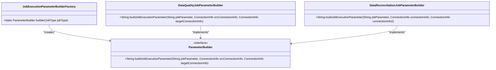
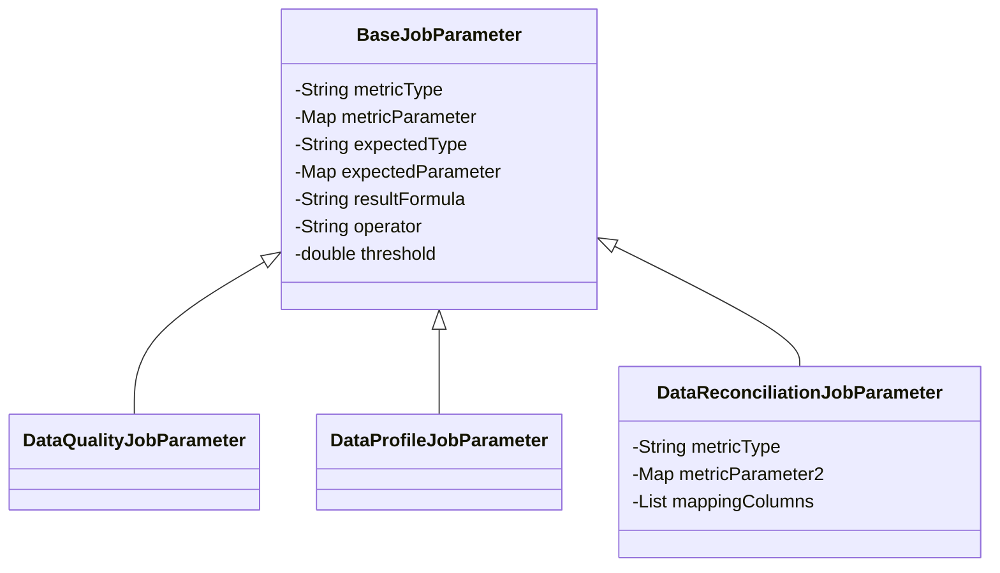
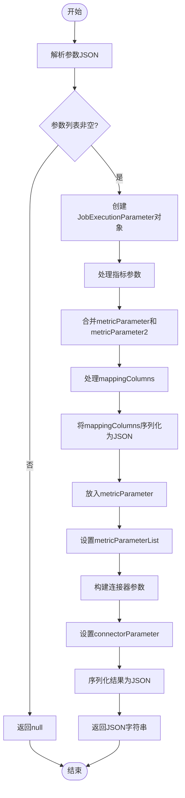

# 任务参数构建

<cite>
**本文档引用的文件**
- [DataQualityJobParameterBuilder.java](file://datavines-server/src/main/java/io/datavines/server/dqc/coordinator/builder/DataQualityJobParameterBuilder.java)
- [JobExecutionParameterBuilderFactory.java](file://datavines-server/src/main/java/io/datavines/server/dqc/coordinator/builder/JobExecutionParameterBuilderFactory.java)
- [ParameterBuilder.java](file://datavines-server/src/main/java/io/datavines/server/dqc/coordinator/builder/ParameterBuilder.java)
- [DataReconciliationJobParameter.java](file://datavines-common/src/main/java/io/datavines/common/entity/job/DataReconciliationJobParameter.java)
- [DataReconciliationJobParameterBuilder.java](file://datavines-server/src/main/java/io/datavines/server/dqc/coordinator/builder/DataReconciliationJobParameterBuilder.java)
- [DataQualityJobParameter.java](file://datavines-common/src/main/java/io/datavines/common/entity/job/DataQualityJobParameter.java)
- [DataProfileJobParameter.java](file://datavines-common/src/main/java/io/datavines/common/entity/job/DataProfileJobParameter.java)
- [BaseJobParameter.java](file://datavines-common/src/main/java/io/datavines/common/entity/job/BaseJobParameter.java)
- [JobExecutionParameter.java](file://datavines-common/src/main/java/io/datavines/common/entity/JobExecutionParameter.java)
- [JobType.java](file://datavines-common/src/main/java/io/datavines/common/enums/JobType.java)
- [Configurations.java](file://datavines-common/src/main/java/io/datavines/common/config/Configurations.java)
- [ConfigChecker.java](file://datavines-common/src/main/java/io/datavines/common/config/ConfigChecker.java)
- [JobParameterUtils.java](file://datavines-server/src/main/java/io/datavines/server/utils/JobParameterUtils.java)
</cite>

## 目录
1. [任务参数构建机制概述](#任务参数构建机制概述)
2. [JobExecutionParameterBuilderFactory工厂模式分析](#jobexecutionparameterbuilderfactory工厂模式分析)
3. [BaseJobParameter基类设计解析](#basejobparameter基类设计解析)
4. [DataQualityJobParameter与DataReconciliationJobParameter结构差异](#dataqualityjobparameter与datareconciliationjobparameter结构差异)
5. [参数对象组装过程详解](#参数对象组装过程详解)
6. [Configurations配置容器作用](#configurations配置容器作用)
7. [参数验证流程与默认值填充机制](#参数验证流程与默认值填充机制)

## 任务参数构建机制概述

DataVines中的任务参数构建机制采用工厂模式和建造者模式相结合的设计，通过`JobExecutionParameterBuilderFactory`根据不同的`JobType`创建相应的参数构建器。该机制的核心目标是根据不同类型的任务（数据质量检查、数据概览检查、数据比对检查）构建出符合要求的执行参数对象。参数构建过程涉及数据源配置、检查规则配置、预期值配置等核心字段的填充，最终生成可用于任务执行的`JobExecutionParameter`对象。

**本节来源**
- [JobExecutionParameterBuilderFactory.java](file://datavines-server/src/main/java/io/datavines/server/dqc/coordinator/builder/JobExecutionParameterBuilderFactory.java)
- [ParameterBuilder.java](file://datavines-server/src/main/java/io/datavines/server/dqc/coordinator/builder/ParameterBuilder.java)

## JobExecutionParameterBuilderFactory工厂模式分析

`JobExecutionParameterBuilderFactory`是任务参数构建器的工厂类，采用静态工厂方法模式根据`JobType`枚举值返回相应的`ParameterBuilder`实现。该工厂类通过switch语句判断任务类型，为不同类型的任务返回不同的构建器实例：

- `DATA_QUALITY`和`DATA_PROFILE`类型返回`DataQualityJobParameterBuilder`实例
- `DATA_RECONCILIATION`类型返回`DataReconciliationJobParameterBuilder`实例
- 默认情况下返回`DataQualityJobParameterBuilder`实例

这种设计实现了构建器的解耦，使得新增任务类型时只需添加相应的构建器实现，而无需修改工厂类的核心逻辑，符合开闭原则。

**图表来源**
- [JobExecutionParameterBuilderFactory.java](file://datavines-server/src/main/java/io/datavines/server/dqc/coordinator/builder/JobExecutionParameterBuilderFactory.java)
- [ParameterBuilder.java](file://datavines-server/src/main/java/io/datavines/server/dqc/coordinator/builder/ParameterBuilder.java)

**本节来源**
- [JobExecutionParameterBuilderFactory.java](file://datavines-server/src/main/java/io/datavines/server/dqc/coordinator/builder/JobExecutionParameterBuilderFactory.java)
- [ParameterBuilder.java](file://datavines-server/src/main/java/io/datavines/server/dqc/coordinator/builder/ParameterBuilder.java)

## BaseJobParameter基类设计解析

`BaseJobParameter`作为所有任务参数的基类，采用继承方式为具体任务参数类提供统一的基础属性。该基类的设计意图是提取不同类型任务参数的共性字段，实现代码复用和结构统一。基类中定义了以下核心字段：

- `metricType`: 指标类型，标识具体的检查指标
- `metricParameter`: 指标参数，包含检查规则的具体配置
- `expectedType`: 预期值类型，默认为"table_total_rows"
- `expectedParameter`: 预期值参数，定义预期值的计算方式
- `resultFormula`: 结果计算公式，默认为"percentage"
- `operator`: 比较操作符，默认为"gt"（大于）
- `threshold`: 阈值，默认为0

通过继承`BaseJobParameter`，具体任务参数类可以复用这些基础字段，同时根据自身需求扩展特定的属性，实现了良好的扩展性和维护性。

**图表来源**
- [BaseJobParameter.java](file://datavines-common/src/main/java/io/datavines/common/entity/job/BaseJobParameter.java)
- [DataQualityJobParameter.java](file://datavines-common/src/main/java/io/datavines/common/entity/job/DataQualityJobParameter.java)
- [DataProfileJobParameter.java](file://datavines-common/src/main/java/io/datavines/common/entity/job/DataProfileJobParameter.java)
- [DataReconciliationJobParameter.java](file://datavines-common/src/main/java/io/datavines/common/entity/job/DataReconciliationJobParameter.java)

**本节来源**
- [BaseJobParameter.java](file://datavines-common/src/main/java/io/datavines/common/entity/job/BaseJobParameter.java)

## DataQualityJobParameter与DataReconciliationJobParameter结构差异

`DataQualityJobParameter`和`DataReconciliationJobParameter`虽然都继承自`BaseJobParameter`，但它们在结构和用途上有显著差异：

`DataQualityJobParameter`是一个简单的继承类，没有添加任何额外字段，主要用途是作为数据质量检查任务的参数容器，直接使用基类中定义的所有字段来配置检查规则。

相比之下，`DataReconciliationJobParameter`针对数据比对场景进行了专门扩展，添加了以下特有字段：
- `metricType`: 覆盖基类字段，默认设置为"multi_table_accuracy"
- `metricParameter2`: 额外的指标参数映射，用于存储比对任务特有的配置
- `mappingColumns`: 列映射列表，定义源表和目标表之间的列对应关系

这种设计差异反映了两种任务类型的不同需求：数据质量检查主要关注单表或单数据源的指标计算，而数据比对需要处理两个数据源之间的映射关系和比对逻辑。

**本节来源**
- [DataQualityJobParameter.java](file://datavines-common/src/main/java/io/datavines/common/entity/job/DataQualityJobParameter.java)
- [DataReconciliationJobParameter.java](file://datavines-common/src/main/java/io/datavines/common/entity/job/DataReconciliationJobParameter.java)

## 参数对象组装过程详解

任务参数对象的组装过程由具体的`ParameterBuilder`实现类完成，主要步骤包括：

1. **参数解析**：使用`JSONUtils.toList()`将JSON格式的参数字符串解析为相应的参数对象列表
2. **连接信息处理**：从`ConnectionInfo`对象中提取数据源配置，构建`ConnectorParameter`
3. **参数合并**：对于数据比对任务，将`metricParameter`和`metricParameter2`进行合并
4. **特殊字段处理**：将`mappingColumns`列表转换为JSON字符串并放入指标参数中
5. **结果构建**：创建`JobExecutionParameter`对象，设置指标参数列表和连接器参数
6. **序列化输出**：将构建完成的参数对象转换为JSON字符串返回

以`DataReconciliationJobParameterBuilder`为例，其组装过程特别处理了`mappingColumns`字段，将其序列化后放入`metricParameter`中，确保列映射信息能够正确传递到执行层。

**图表来源**
- [DataReconciliationJobParameterBuilder.java](file://datavines-server/src/main/java/io/datavines/server/dqc/coordinator/builder/DataReconciliationJobParameterBuilder.java)
- [DataQualityJobParameterBuilder.java](file://datavines-server/src/main/java/io/datavines/server/dqc/coordinator/builder/DataQualityJobParameterBuilder.java)

**本节来源**
- [DataReconciliationJobParameterBuilder.java](file://datavines-server/src/main/java/io/datavines/server/dqc/coordinator/builder/DataReconciliationJobParameterBuilder.java)
- [DataQualityJobParameterBuilder.java](file://datavines-server/src/main/java/io/datavines/server/dqc/coordinator/builder/DataQualityJobParameterBuilder.java)

## Configurations配置容器作用

`Configurations`类作为配置容器，提供了统一的配置管理接口。该类封装了`Properties`对象，提供了一系列便捷的方法来获取配置值：

- `getString(String key)`: 根据键获取字符串值
- `getString(String key, String defaultValue)`: 根据键获取字符串值，如果不存在则返回默认值

`Configurations`的作用主要体现在：
1. **配置抽象**：将底层的`Properties`实现细节封装起来，提供更友好的API
2. **类型安全**：通过方法重载提供默认值支持，避免空指针异常
3. **扩展性**：为未来添加其他类型的配置获取方法（如getInt、getBoolean等）提供了基础

该配置容器在参数构建过程中被广泛使用，用于获取各种配置项，确保参数构建的灵活性和可配置性。

**本节来源**
- [Configurations.java](file://datavines-common/src/main/java/io/datavines/common/config/Configurations.java)

## 参数验证流程与默认值填充机制

DataVines的参数验证流程和默认值填充机制确保了任务参数的完整性和有效性。验证流程主要通过`ConfigChecker`类实现，其核心方法`checkConfig`接受配置映射和必需选项集合，检查所有必需选项是否存在：

- 如果存在缺失的必需选项，返回验证失败结果，并提供详细的错误信息
- 如果所有必需选项都存在，返回验证成功结果

默认值填充机制主要体现在以下几个方面：
1. **基类字段默认值**：`BaseJobParameter`中的`expectedType`、`resultFormula`、`operator`和`threshold`都设置了默认值
2. **工厂类默认行为**：`JobExecutionParameterBuilderFactory`为未知任务类型提供默认的构建器
3. **配置获取默认值**：`Configurations.getString(key, defaultValue)`方法支持指定默认值

此外，`JobParameterUtils`工具类提供了`regenerateJobParameterList`方法，用于重新生成和规范化参数列表，进一步确保参数的正确性。这种多层次的验证和默认值机制有效防止了因参数缺失或错误导致的任务执行失败。

**本节来源**
- [ConfigChecker.java](file://datavines-common/src/main/java/io/datavines/common/config/ConfigChecker.java)
- [BaseJobParameter.java](file://datavines-common/src/main/java/io/datavines/common/entity/job/BaseJobParameter.java)
- [JobExecutionParameterBuilderFactory.java](file://datavines-server/src/main/java/io/datavines/server/dqc/coordinator/builder/JobExecutionParameterBuilderFactory.java)
- [JobParameterUtils.java](file://datavines-server/src/main/java/io/datavines/server/utils/JobParameterUtils.java)