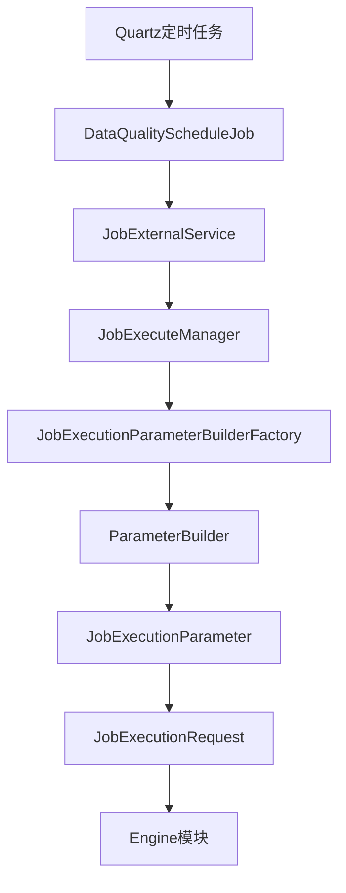
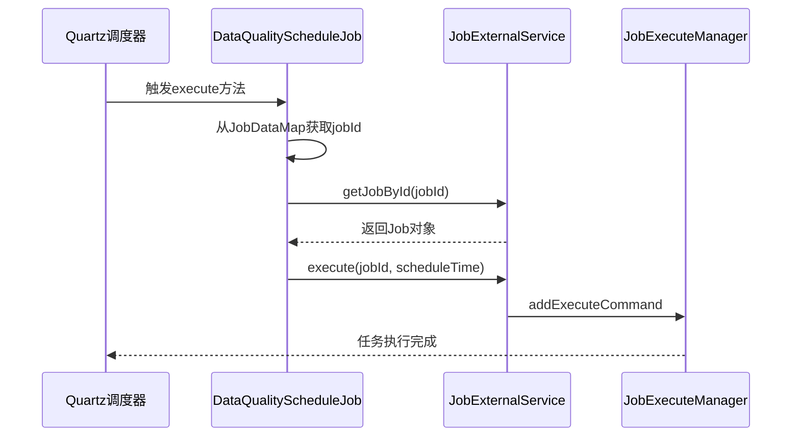
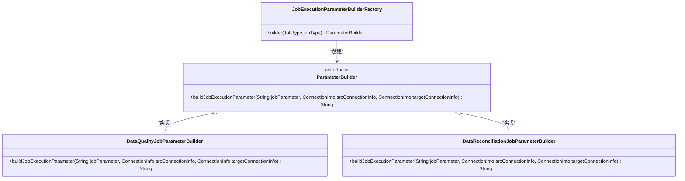
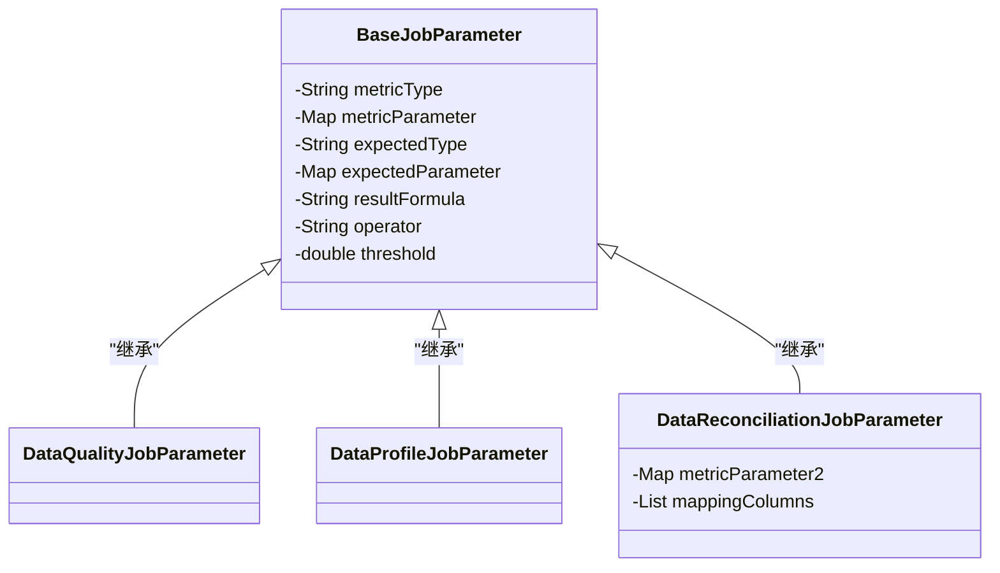
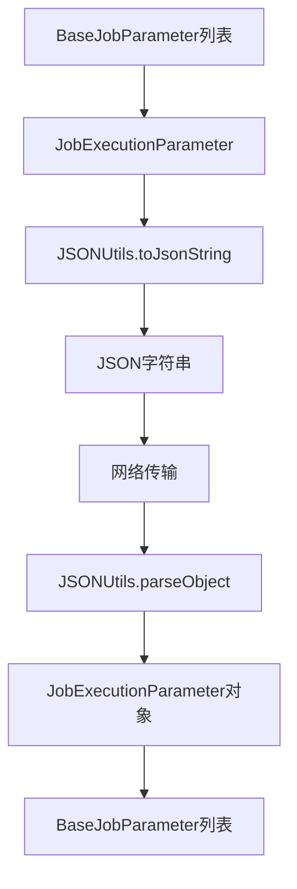
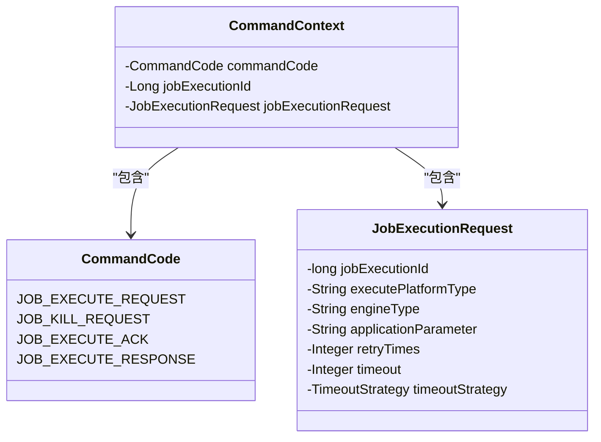
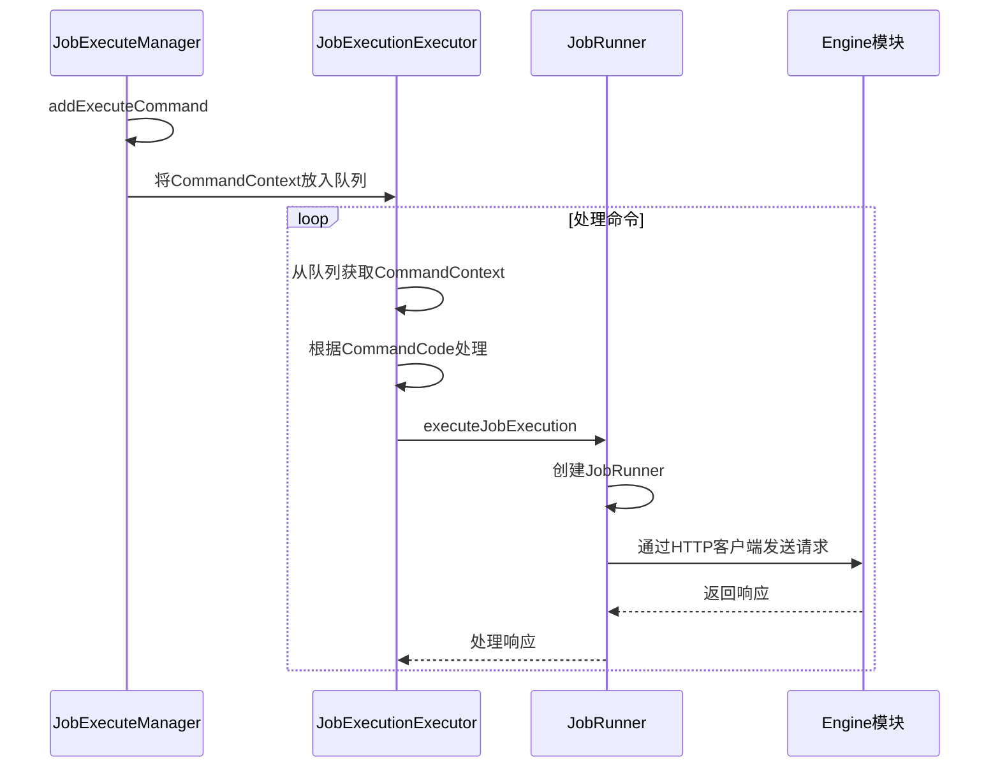
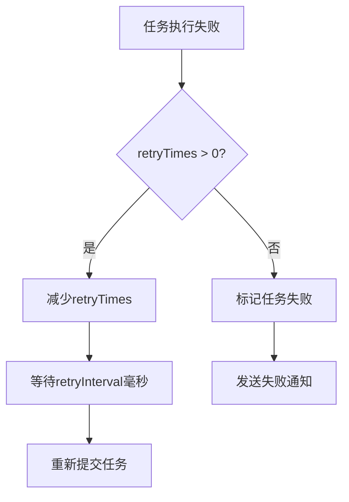

# 任务调度机制

<cite>
**本文档引用的文件**
- [DataQualityScheduleJob.java](file://datavines-server/src/main/java/io/datavines/server/dqc/coordinator/quartz/DataQualityScheduleJob.java)
- [JobExecutionParameterBuilderFactory.java](file://datavines-server/src/main/java/io/datavines/server/dqc/coordinator/builder/JobExecutionParameterBuilderFactory.java)
- [DataQualityJobParameterBuilder.java](file://datavines-server/src/main/java/io/datavines/server/dqc/coordinator/builder/DataQualityJobParameterBuilder.java)
- [DataReconciliationJobParameterBuilder.java](file://datavines-server/src/main/java/io/datavines/server/dqc/coordinator/builder/DataReconciliationJobParameterBuilder.java)
- [BaseJobParameter.java](file://datavines-common/src/main/java/io/datavines/common/entity/job/BaseJobParameter.java)
- [JobExecutionParameter.java](file://datavines-common/src/main/java/io/datavines/common/entity/JobExecutionParameter.java)
- [JobExecutionRequest.java](file://datavines-common/src/main/java/io/datavines/common/entity/JobExecutionRequest.java)
- [JobExecuteManager.java](file://datavines-server/src/main/java/io/datavines/server/dqc/coordinator/cache/JobExecuteManager.java)
- [JobParameterUtils.java](file://datavines-server/src/main/java/io/datavines/server/utils/JobParameterUtils.java)
- [CommandContext.java](file://datavines-server/src/main/java/io/datavines/server/dqc/coordinator/cache/CommandContext.java)
</cite>

## 目录
1. [任务调度流程概述](#任务调度流程概述)
2. [Quartz定时任务触发](#quartz定时任务触发)
3. [任务参数构建机制](#任务参数构建机制)
4. [任务参数序列化与反序列化](#任务参数序列化与反序列化)
5. [任务执行请求的创建与发送](#任务执行请求的创建与发送)
6. [任务参数差异分析](#任务参数差异分析)
7. [控制参数传递机制](#控制参数传递机制)

## 任务调度流程概述

DataVines的任务调度流程从Quartz定时任务触发开始，经过任务参数构建、序列化、执行请求创建等环节，最终将任务发送到Engine模块执行。整个流程涉及多个核心组件的协同工作，包括调度器、参数构建器、执行管理器等。



**图表来源**
- [DataQualityScheduleJob.java](file://datavines-server/src/main/java/io/datavines/server/dqc/coordinator/quartz/DataQualityScheduleJob.java)
- [JobExecuteManager.java](file://datavines-server/src/main/java/io/datavines/server/dqc/coordinator/cache/JobExecuteManager.java)
- [JobExecutionParameterBuilderFactory.java](file://datavines-server/src/main/java/io/datavines/server/dqc/coordinator/builder/JobExecutionParameterBuilderFactory.java)

## Quartz定时任务触发

DataVines使用Quartz作为任务调度框架，当定时任务触发时，`DataQualityScheduleJob`类的`execute`方法会被调用。该方法从JobDataMap中获取jobId，然后通过`JobExternalService`获取具体的Job信息并执行。



**图表来源**
- [DataQualityScheduleJob.java](file://datavines-server/src/main/java/io/datavines/server/dqc/coordinator/quartz/DataQualityScheduleJob.java)
- [JobExecuteManager.java](file://datavines-server/src/main/java/io/datavines/server/dqc/coordinator/cache/JobExecuteManager.java)

**本节来源**
- [DataQualityScheduleJob.java](file://datavines-server/src/main/java/io/datavines/server/dqc/coordinator/quartz/DataQualityScheduleJob.java#L54-L72)

## 任务参数构建机制

任务参数的构建由`JobExecutionParameterBuilderFactory`工厂类负责，该工厂根据不同的任务类型创建相应的参数构建器。对于数据质量检查任务，使用`DataQualityJobParameterBuilder`；对于数据对账任务，使用`DataReconciliationJobParameterBuilder`。



**图表来源**
- [JobExecutionParameterBuilderFactory.java](file://datavines-server/src/main/java/io/datavines/server/dqc/coordinator/builder/JobExecutionParameterBuilderFactory.java)
- [DataQualityJobParameterBuilder.java](file://datavines-server/src/main/java/io/datavines/server/dqc/coordinator/builder/DataQualityJobParameterBuilder.java)
- [DataReconciliationJobParameterBuilder.java](file://datavines-server/src/main/java/io/datavines/server/dqc/coordinator/builder/DataReconciliationJobParameterBuilder.java)

**本节来源**
- [JobExecutionParameterBuilderFactory.java](file://datavines-server/src/main/java/io/datavines/server/dqc/coordinator/builder/JobExecutionParameterBuilderFactory.java#L21-L34)

## 任务参数序列化与反序列化

任务参数的序列化与反序列化是DataVines任务调度的核心环节。系统使用JSON格式进行数据封装，通过`JSONUtils`工具类实现对象与JSON字符串之间的转换。

### BaseJobParameter继承体系

`BaseJobParameter`是所有任务参数的基类，定义了通用的参数字段。具体的任务类型通过继承`BaseJobParameter`来扩展特定的参数。



**图表来源**
- [BaseJobParameter.java](file://datavines-common/src/main/java/io/datavines/common/entity/job/BaseJobParameter.java)
- [DataReconciliationJobParameter.java](file://datavines-common/src/main/java/io/datavines/common/entity/job/DataReconciliationJobParameter.java)

**本节来源**
- [BaseJobParameter.java](file://datavines-common/src/main/java/io/datavines/common/entity/job/BaseJobParameter.java#L26-L41)

### JSON格式数据封装

任务参数在传输过程中被序列化为JSON字符串。`JobExecutionParameter`类包含连接器参数和指标参数列表，这些对象通过`JSONUtils.toJsonString`方法转换为JSON格式。



**图表来源**
- [JobExecutionParameter.java](file://datavines-common/src/main/java/io/datavines/common/entity/JobExecutionParameter.java)
- [DataQualityJobParameterBuilder.java](file://datavines-server/src/main/java/io/datavines/server/dqc/coordinator/builder/DataQualityJobParameterBuilder.java)

## 任务执行请求的创建与发送

任务执行请求的创建和发送由`JobExecuteManager`负责。该管理器接收执行命令，创建`JobExecutionRequest`对象，并通过HTTP客户端将其发送到Engine模块。

### Command命令创建

当任务需要执行时，系统会创建一个`CommandContext`对象，其中包含命令码、任务执行ID和任务执行请求。



**图表来源**
- [CommandContext.java](file://datavines-server/src/main/java/io/datavines/server/dqc/coordinator/cache/CommandContext.java)
- [JobExecutionRequest.java](file://datavines-common/src/main/java/io/datavines/common/entity/JobExecutionRequest.java)

**本节来源**
- [JobExecuteManager.java](file://datavines-server/src/main/java/io/datavines/server/dqc/coordinator/cache/JobExecuteManager.java#L542-L553)

### 执行请求发送流程

`JobExecuteManager`中的`JobExecutionExecutor`线程负责处理执行命令队列中的命令，将任务执行请求发送到Engine模块。



**图表来源**
- [JobExecuteManager.java](file://datavines-server/src/main/java/io/datavines/server/dqc/coordinator/cache/JobExecuteManager.java)
- [JobRunner.java](file://datavines-server/src/main/java/io/datavines/server/dqc/executor/runner/JobRunner.java)

## 任务参数差异分析

不同类型的检查任务在参数结构上存在显著差异，主要体现在`metricParameter`字段的内容上。

### 单表质量检查任务参数

单表质量检查任务的参数主要关注单个表的指标计算，如行数、空值率等。

```json
{
  "metricType": "table_row_count",
  "metricParameter": {
    "database": "test_db",
    "table": "user_info",
    "column": "*"
  },
  "expectedType": "fix",
  "expectedParameter": {
    "value": "1000"
  },
  "resultFormula": "percentage",
  "operator": "gt",
  "threshold": 0.95
}
```

### 跨表准确性检查任务参数

跨表准确性检查任务需要比较两个表的数据，因此参数中包含两个数据源的连接信息和字段映射关系。

```json
{
  "metricType": "multi_table_accuracy",
  "metricParameter": {
    "database": "source_db",
    "table": "user_info",
    "column": "id"
  },
  "metricParameter2": {
    "database": "target_db",
    "table": "user_info_copy",
    "column": "id"
  },
  "mappingColumns": [
    {
      "sourceColumn": "id",
      "targetColumn": "id"
    },
    {
      "sourceColumn": "name",
      "targetColumn": "name"
    }
  ],
  "expectedType": "table_total_rows",
  "resultFormula": "diff_percentage",
  "operator": "lt",
  "threshold": 0.01
}
```

**本节来源**
- [DataQualityJobParameterBuilder.java](file://datavines-server/src/main/java/io/datavines/server/dqc/coordinator/builder/DataQualityJobParameterBuilder.java#L33-L56)
- [DataReconciliationJobParameterBuilder.java](file://datavines-server/src/main/java/io/datavines/server/dqc/coordinator/builder/DataReconciliationJobParameterBuilder.java#L31-L57)

## 控制参数传递机制

任务调度过程中，优先级、超时策略等控制参数通过`JobExecutionRequest`对象进行传递。

### 优先级与重试机制

系统通过`retryTimes`和`retryInterval`参数控制任务的重试行为。当任务执行失败时，如果剩余重试次数大于0，系统会自动重新提交任务。



### 超时策略

超时策略由`timeout`和`timeoutStrategy`参数控制。系统使用`HashedWheelTimer`来监控任务执行时间，当任务执行时间超过`timeout`时，根据`timeoutStrategy`采取相应措施。

```java
wheelTimer.newTimeout(
    new JobExecutionTimeoutTimerTask(
        jobExecutionId, jobExecutionRequest.getRetryTimes()),
    jobExecutionRequest.getTimeout()+2, TimeUnit.SECONDS);
```

**本节来源**
- [JobExecutionRequest.java](file://datavines-common/src/main/java/io/datavines/common/entity/JobExecutionRequest.java#L60-L66)
- [JobExecuteManager.java](file://datavines-server/src/main/java/io/datavines/server/dqc/coordinator/cache/JobExecuteManager.java#L404-L425)