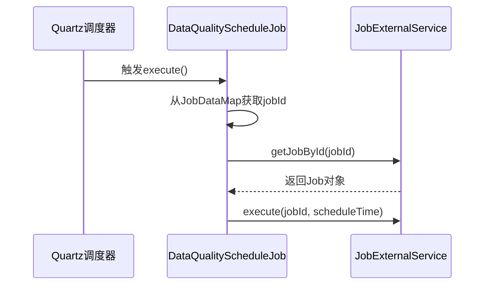
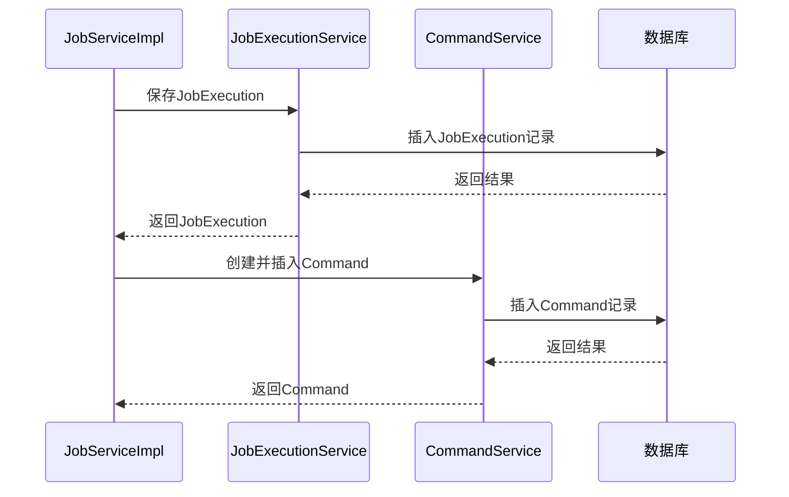
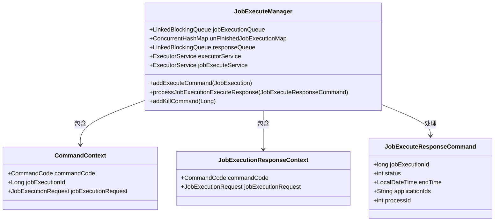
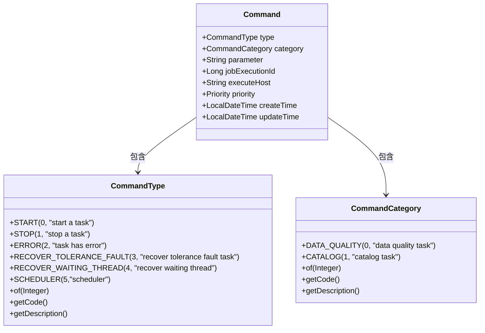
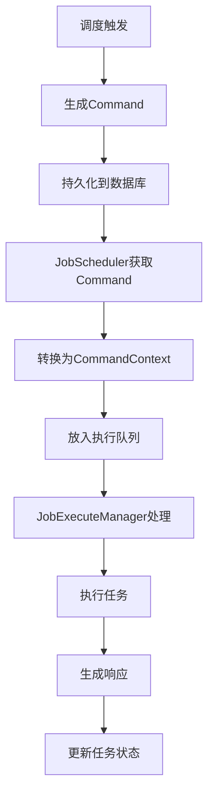
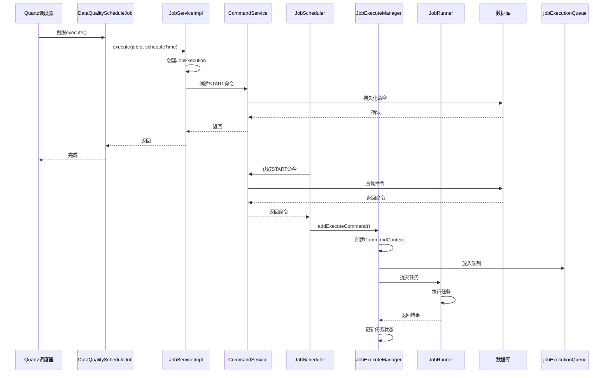

# 命令分发机制

<cite>
**本文档引用的文件**   
- [DataQualityScheduleJob.java](file://datavines-server\src\main\java\io\datavines\server\dqc\coordinator\quartz\DataQualityScheduleJob.java)
- [JobServiceImpl.java](file://datavines-server\src\main\java\io\datavines\server\repository\service\impl\JobServiceImpl.java)
- [CommandServiceImpl.java](file://datavines-server\src\main\java\io\datavines\server\repository\service\impl\CommandServiceImpl.java)
- [JobScheduler.java](file://datavines-server\src\main\java\io\datavines\server\dqc\coordinator\runner\JobScheduler.java)
- [JobExecuteManager.java](file://datavines-server\src\main\java\io\datavines\server\dqc\coordinator\cache\JobExecuteManager.java)
- [CommandContext.java](file://datavines-server\src\main\java\io\datavines\server\dqc\coordinator\cache\CommandContext.java)
- [CommandCategory.java](file://datavines-server\src\main\java\io\datavines\server\enums\CommandCategory.java)
- [CommandType.java](file://datavines-server\src\main\java\io\datavines\server\enums\CommandType.java)
- [JobExecuteResponseCommand.java](file://datavines-server\src\main\java\io\datavines\server\dqc\command\JobExecuteResponseCommand.java)
- [Command.java](file://datavines-server\src\main\java\io\datavines\server\repository\entity\Command.java)
</cite>

## 目录
1. [命令分发流程概述](#命令分发流程概述)
2. [Quartz调度器触发](#quartz调度器触发)
3. [命令生成与持久化](#命令生成与持久化)
4. [任务执行上下文管理](#任务执行上下文管理)
5. [命令分类机制](#命令分类机制)
6. [执行环境信息封装](#执行环境信息封装)
7. [完整流程时序图](#完整流程时序图)

## 命令分发流程概述

DataVines的命令分发机制是一个完整的任务调度与执行流程，从Quartz调度器触发定时任务开始，经过命令生成、持久化、执行管理到最终结果反馈的完整闭环。该机制确保了数据质量检查任务能够按照预定的时间计划准确执行，并提供了完善的错误处理和重试机制。

整个流程的核心组件包括Quartz调度器、命令服务、任务执行管理器和命令上下文等。这些组件协同工作，实现了从调度触发到任务执行的无缝衔接，为数据质量监控提供了可靠的技术保障。

## Quartz调度器触发

DataVines使用Quartz作为其核心调度引擎，负责触发数据质量检查任务的执行。当调度时间到达时，Quartz会触发`DataQualityScheduleJob`类的执行，这是整个命令分发流程的起点。

`DataQualityScheduleJob`实现了Quartz的Job接口，其execute方法会在调度时间到达时被调用。该方法从JobDataMap中获取任务ID，然后通过SpringApplicationContext获取JobExternalService实例，最终调用execute方法启动任务执行流程。

**时序图来源**
- [DataQualityScheduleJob.java](file://datavines-server\src\main\java\io\datavines\server\dqc\coordinator\quartz\DataQualityScheduleJob.java#L54-L73)

**本节来源**
- [DataQualityScheduleJob.java](file://datavines-server\src\main\java\io\datavines\server\dqc\coordinator\quartz\DataQualityScheduleJob.java#L17-L75)

## 命令生成与持久化

当`DataQualityScheduleJob`触发任务执行后，系统会生成一个`JobExecution`对象并将其保存到数据库中。随后，系统会创建一个`Command`对象，该对象包含了任务执行所需的所有信息，并通过`CommandService`将其持久化到数据库。

在`JobServiceImpl`类中，`execute`方法负责处理任务执行请求。该方法首先创建`JobExecution`对象并保存，然后创建`Command`对象，设置其类型为`CommandType.START`，并将其插入到命令表中。这个命令对象将成为任务执行的指令载体。

**时序图来源**
- [JobServiceImpl.java](file://datavines-server\src\main\java\io\datavines\server\repository\service\impl\JobServiceImpl.java#L534-L551)
- [CommandServiceImpl.java](file://datavines-server\src\main\java\io\datavines\server\repository\service\impl\CommandServiceImpl.java#L35-L39)

**本节来源**
- [JobServiceImpl.java](file://datavines-server\src\main\java\io\datavines\server\repository\service\impl\JobServiceImpl.java#L534-L572)
- [CommandServiceImpl.java](file://datavines-server\src\main\java\io\datavines\server\repository\service\impl\CommandServiceImpl.java#L1-L78)

## 任务执行上下文管理

`JobExecuteManager`是任务执行上下文管理的核心组件，负责管理任务执行的整个生命周期。它维护了一个`LinkedBlockingQueue<CommandContext>`队列，用于存放待处理的命令上下文，以及一个`ConcurrentHashMap<Long, JobExecutionRequest>`映射，用于跟踪未完成的任务执行。

当任务需要执行时，`JobExecuteManager`会创建一个`CommandContext`对象，设置其命令码为`JOB_EXECUTE_REQUEST`，并将其放入执行队列。后台的`JobExecutionExecutor`线程会不断从队列中取出命令上下文，并根据命令码执行相应的操作。

对于任务执行的响应，`JobExecuteManager`提供了`processJobExecutionExecuteResponse`方法，该方法接收`JobExecuteResponseCommand`对象，将其转换为`JobExecutionResponseContext`，并放入响应队列。后台的`JobExecutionResponseOperator`线程会处理这些响应，更新任务状态并进行相应的后续处理。

**类图来源**
- [JobExecuteManager.java](file://datavines-server\src\main\java\io\datavines\server\dqc\coordinator\cache\JobExecuteManager.java#L73-L617)
- [CommandContext.java](file://datavines-server\src\main\java\io\datavines\server\dqc\coordinator\cache\CommandContext.java#L1-L31)
- [JobExecutionResponseContext.java](file://datavines-server\src\main\java\io\datavines\server\dqc\coordinator\cache\JobExecutionResponseContext.java#L1-L40)
- [JobExecuteResponseCommand.java](file://datavines-server\src\main\java\io\datavines\server\dqc\command\JobExecuteResponseCommand.java#L1-L46)

**本节来源**
- [JobExecuteManager.java](file://datavines-server\src\main\java\io\datavines\server\dqc\coordinator\cache\JobExecuteManager.java#L73-L617)

## 命令分类机制

DataVines通过`CommandCategory`和`CommandType`两个枚举类来实现命令的分类管理。`CommandCategory`用于区分不同类型的命令大类，目前包括数据质量任务和目录任务两类。`CommandType`则定义了具体的命令类型，如启动、停止、错误等。

`CommandCategory`枚举包含`DATA_QUALITY`和`CATALOG`两个值，分别对应代码0和1，用于区分数据质量检查任务和元数据目录任务。每个类别都有相应的描述信息，便于理解和调试。

`CommandType`枚举则定义了更细粒度的命令类型，包括`START`（启动）、`STOP`（停止）、`ERROR`（错误）等。这些类型在命令执行过程中起到关键作用，决定了系统对命令的处理方式。

**类图来源**
- [CommandCategory.java](file://datavines-server\src\main\java\io\datavines\server\enums\CommandCategory.java#L1-L66)
- [CommandType.java](file://datavines-server\src\main\java\io\datavines\server\enums\CommandType.java#L1-L74)
- [Command.java](file://datavines-server\src\main\java\io\datavines\server\repository\entity\Command.java#L1-L65)

**本节来源**
- [CommandCategory.java](file://datavines-server\src\main\java\io\datavines\server\enums\CommandCategory.java#L1-L66)
- [CommandType.java](file://datavines-server\src\main\java\io\datavines\server\enums\CommandType.java#L1-L74)

## 执行环境信息封装

`CommandContext`类是执行环境信息封装的核心，它将任务执行所需的所有上下文信息封装在一个对象中。该类包含三个主要属性：`commandCode`表示命令类型，`jobExecutionId`表示任务执行ID，`jobExecutionRequest`包含完整的任务执行请求信息。

`CommandContext`在命令分发流程中扮演着重要角色，它作为命令的载体在各个组件之间传递。当`JobScheduler`从数据库获取到启动命令后，会将其转换为`CommandContext`对象，并通过`JobExecuteManager`的`addExecuteCommand`方法将其放入执行队列。

`JobExecutionRequest`对象包含了任务执行的详细信息，包括执行平台类型、引擎类型、超时设置、重试次数等。这些信息在任务执行过程中被用来配置和控制任务的运行。

**流程图来源**
- [JobScheduler.java](file://datavines-server\src\main\java\io\datavines\server\dqc\coordinator\runner\JobScheduler.java#L1-L155)
- [JobExecuteManager.java](file://datavines-server\src\main\java\io\datavines\server\dqc\coordinator\cache\JobExecuteManager.java#L73-L617)

**本节来源**
- [CommandContext.java](file://datavines-server\src\main\java\io\datavines\server\dqc\coordinator\cache\CommandContext.java#L1-L31)
- [JobScheduler.java](file://datavines-server\src\main\java\io\datavines\server\dqc\coordinator\runner\JobScheduler.java#L1-L155)

## 完整流程时序图

以下是DataVines命令分发流程的完整时序图，展示了从Quartz调度器触发到任务执行完成的全过程。

**时序图来源**
- [DataQualityScheduleJob.java](file://datavines-server\src\main\java\io\datavines\server\dqc\coordinator\quartz\DataQualityScheduleJob.java#L54-L73)
- [JobServiceImpl.java](file://datavines-server\src\main\java\io\datavines\server\repository\service\impl\JobServiceImpl.java#L534-L572)
- [CommandServiceImpl.java](file://datavines-server\src\main\java\io\datavines\server\repository\service\impl\CommandServiceImpl.java#L1-L78)
- [JobScheduler.java](file://datavines-server\src\main\java\io\datavines\server\dqc\coordinator\runner\JobScheduler.java#L1-L155)
- [JobExecuteManager.java](file://datavines-server\src\main\java\io\datavines\server\dqc\coordinator\cache\JobExecuteManager.java#L73-L617)

**本节来源**
- [DataQualityScheduleJob.java](file://datavines-server\src\main\java\io\datavines\server\dqc\coordinator\quartz\DataQualityScheduleJob.java#L17-L75)
- [JobServiceImpl.java](file://datavines-server\src\main\java\io\datavines\server\repository\service\impl\JobServiceImpl.java#L534-L572)
- [CommandServiceImpl.java](file://datavines-server\src\main\java\io\datavines\server\repository\service\impl\CommandServiceImpl.java#L1-L78)
- [JobScheduler.java](file://datavines-server\src\main\java\io\datavines\server\dqc\coordinator\runner\JobScheduler.java#L1-L155)
- [JobExecuteManager.java](file://datavines-server\src\main\java\io\datavines\server\dqc\coordinator\cache\JobExecuteManager.java#L73-L617)