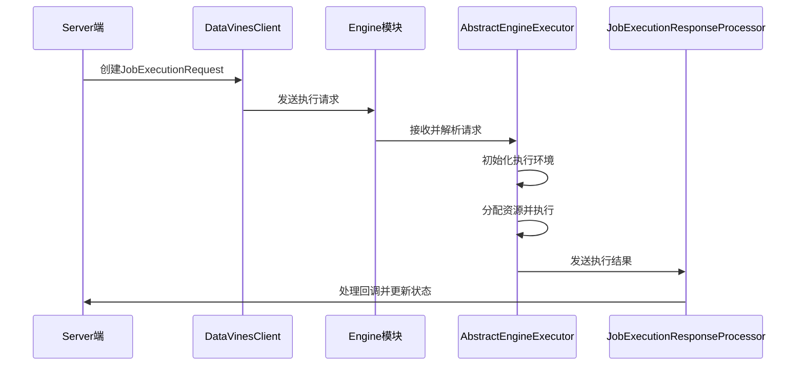
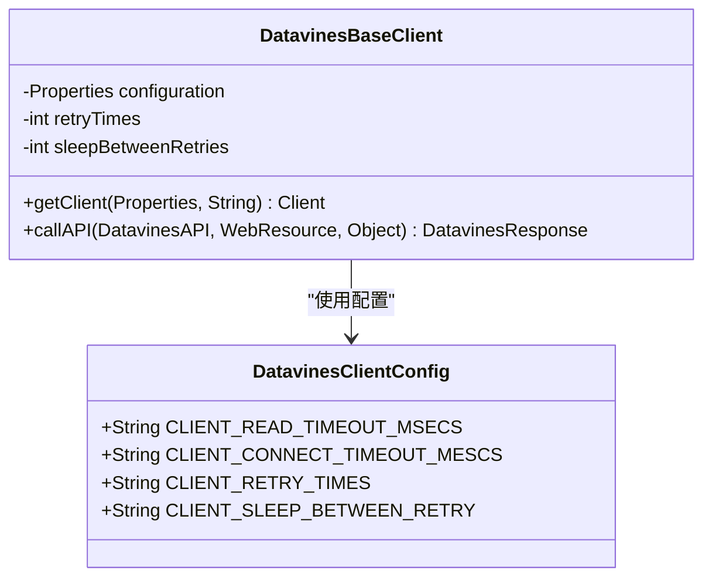
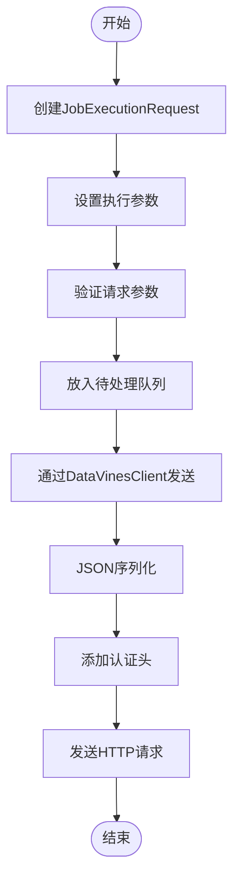
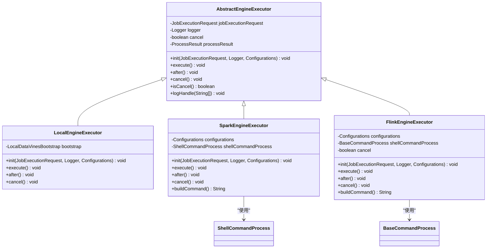
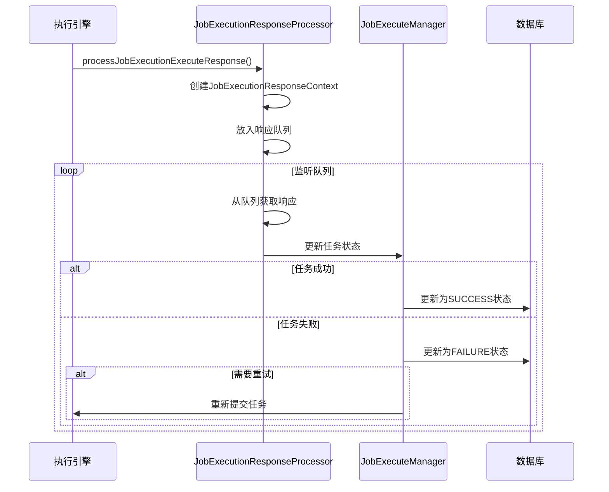
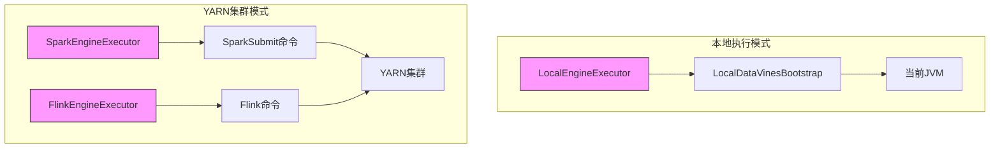
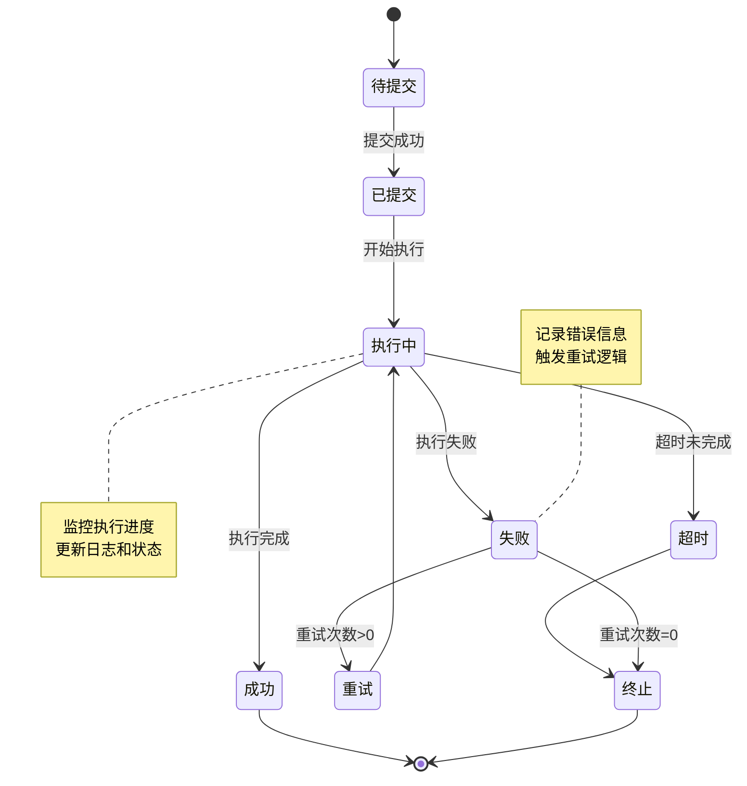

# 执行触发流程

<cite>
**本文档引用的文件**  
- [DatavinesBaseClient.java](file://datavines-client/datavines-http-client/datavines-http-client-core/src/main/java/io/datavines/http/client/base/DatavinesBaseClient.java)
- [DataVinesClient.java](file://datavines-client/datavines-http-client/datavines-http-client-core/src/main/java/io/datavines/http/client/DataVinesClient.java)
- [DatavinesClientConfig.java](file://datavines-client/datavines-http-client/datavines-http-client-core/src/main/java/io/datavines/http/client/base/DatavinesClientConfig.java)
- [JobExecuteManager.java](file://datavines-server/src/main/java/io/datavines/server/dqc/coordinator/cache/JobExecuteManager.java)
- [JobExecutionResponseProcessor.java](file://datavines-server/src/main/java/io/datavines/server/dqc/coordinator/cache/JobExecutionResponseProcessor.java)
- [AbstractEngineExecutor.java](file://datavines-engine/datavines-engine-executor/src/main/java/io/datavines/engine/executor/core/base/AbstractEngineExecutor.java)
- [AbstractYarnEngineExecutor.java](file://datavines-engine/datavines-engine-executor/src/main/java/io/datavines/engine/executor/core/base/AbstractYarnEngineExecutor.java)
- [LocalEngineExecutor.java](file://datavines-engine/datavines-engine-plugins/datavines-engine-local/datavines-engine-local-executor/src/main/java/io/datavines/engine/local/executor/LocalEngineExecutor.java)
- [SparkEngineExecutor.java](file://datavines-engine/datavines-engine-plugins/datavines-engine-spark/datavines-engine-spark-executor/src/main/java/io/datavines/engine/spark/executor/SparkEngineExecutor.java)
- [FlinkEngineExecutor.java](file://datavines-engine/datavines-engine-plugins/datavines-engine-flink/datavines-engine-flink-executor/src/main/java/io/datavines/engine/flink/executor/FlinkEngineExecutor.java)
- [JobExecutionRequest.java](file://datavines-common/src/main/java/io/datavines/common/entity/JobExecutionRequest.java)
- [ExecutionStatus.java](file://datavines-common/src/main/java/io/datavines/common/enums/ExecutionStatus.java)
- [YarnUtils.java](file://datavines-common/src/main/java/io/datavines/common/utils/YarnUtils.java)
</cite>

## 目录
1. [执行触发概述](#执行触发概述)
2. [HTTP客户端配置与超时设置](#http客户端配置与超时设置)
3. [执行请求的发送流程](#执行请求的发送流程)
4. [执行请求的接收与解析](#执行请求的接收与解析)
5. [执行结果的回调处理](#执行结果的回调处理)
6. [本地与YARN集群模式的触发差异](#本地与yarn集群模式的触发差异)
7. [执行状态更新机制](#执行状态更新机制)

## 执行触发概述

DataVines系统的任务执行触发流程是一个完整的端到端过程，从Server端通过DataVinesClient向Engine模块发送执行请求开始，到执行结果的回调处理和状态更新结束。该流程涉及多个核心组件的协同工作，包括HTTP客户端、执行管理器、执行器和结果处理器。

整个流程的核心是`JobExecutionRequest`对象，它封装了任务执行所需的所有参数和配置信息。当任务需要执行时，Server端会创建一个`JobExecutionRequest`对象，并通过HTTP客户端将其发送到相应的执行引擎。执行引擎接收到请求后，会解析请求参数，初始化执行环境，并分配必要的资源来执行任务。

**图示来源**
- [JobExecutionRequest.java](file://datavines-common/src/main/java/io/datavines/common/entity/JobExecutionRequest.java)
- [DataVinesClient.java](file://datavines-client/datavines-http-client/datavines-http-client-core/src/main/java/io/datavines/http/client/DataVinesClient.java)
- [AbstractEngineExecutor.java](file://datavines-engine/datavines-engine-executor/src/main/java/io/datavines/engine/executor/core/base/AbstractEngineExecutor.java)
- [JobExecutionResponseProcessor.java](file://datavines-server/src/main/java/io/datavines/server/dqc/coordinator/cache/JobExecutionResponseProcessor.java)

**本节来源**
- [JobExecutionRequest.java](file://datavines-common/src/main/java/io/datavines/common/entity/JobExecutionRequest.java)
- [JobExecuteManager.java](file://datavines-server/src/main/java/io/datavines/server/dqc/coordinator/cache/JobExecuteManager.java)

## HTTP客户端配置与超时设置

DataVines系统中的HTTP客户端配置和超时设置是确保任务执行请求可靠传输的关键因素。系统通过`DatavinesClientConfig`类定义了客户端的核心配置参数，这些参数在`DatavinesBaseClient`中被读取和应用。

HTTP客户端的主要配置参数包括：
- **读取超时**：`datavines.client.readTimeoutMSecs`，默认值为6000毫秒
- **连接超时**：`datavines.client.connectTimeoutMSecs`，默认值为6000毫秒
- **重试次数**：`datavines.client.retryTimes`，默认值为1次
- **重试间隔**：`datavines.client.sleep.betweenRetry`，默认值为1000毫秒

这些配置参数在`DatavinesBaseClient`的`getClient`方法中被应用，确保了HTTP客户端在各种网络条件下都能稳定工作。读取超时和连接超时的设置可以防止客户端在不可用的服务上无限期等待，而重试机制则提高了请求的可靠性。

**图示来源**
- [DatavinesClientConfig.java](file://datavines-client/datavines-http-client/datavines-http-client-core/src/main/java/io/datavines/http/client/base/DatavinesClientConfig.java)
- [DatavinesBaseClient.java](file://datavines-client/datavines-http-client/datavines-http-client-core/src/main/java/io/datavines/http/client/base/DatavinesBaseClient.java)

**本节来源**
- [DatavinesClientConfig.java](file://datavines-client/datavines-http-client/datavines-http-client-core/src/main/java/io/datavines/http/client/base/DatavinesClientConfig.java)
- [DatavinesBaseClient.java](file://datavines-client/datavines-http-client/datavines-http-client-core/src/main/java/io/datavines/http/client/base/DatavinesBaseClient.java)

## 执行请求的发送流程

执行请求的发送流程始于Server端的`JobExecuteManager`，该组件负责管理所有待执行的任务。当一个任务需要执行时，`JobExecuteManager`会创建一个`JobExecutionRequest`对象，并将其放入待处理队列中。

`JobExecutionRequest`对象的创建过程包括将任务参数转换为执行参数，设置执行平台类型、引擎类型和相关配置。这个请求对象包含了任务执行所需的所有信息，包括执行平台参数、引擎参数、错误数据存储配置等。

一旦`JobExecutionRequest`被创建并放入队列，`DataVinesClient`就会从队列中获取请求，并通过HTTP协议将其发送到目标执行引擎。发送过程中，客户端会自动处理JSON序列化、认证头设置和响应解析等细节。

**图示来源**
- [JobExecuteManager.java](file://datavines-server/src/main/java/io/datavines/server/dqc/coordinator/cache/JobExecuteManager.java)
- [JobExecutionRequest.java](file://datavines-common/src/main/java/io/datavines/common/entity/JobExecutionRequest.java)
- [DataVinesClient.java](file://datavines-client/datavines-http-client/datavines-http-client-core/src/main/java/io/datavines/http/client/DataVinesClient.java)

**本节来源**
- [JobExecuteManager.java](file://datavines-server/src/main/java/io/datavines/server/dqc/coordinator/cache/JobExecuteManager.java)
- [JobExecutionRequest.java](file://datavines-common/src/main/java/io/datavines/common/entity/JobExecutionRequest.java)

## 执行请求的接收与解析

执行请求的接收与解析由`AbstractEngineExecutor`类及其子类负责。`AbstractEngineExecutor`是一个抽象基类，定义了执行器的基本行为和接口，所有具体的执行器都继承自这个类。

当执行引擎接收到`JobExecutionRequest`时，`init`方法会被调用，用于初始化执行环境。这个方法会设置日志记录器、保存请求对象，并根据请求中的参数配置执行环境。`execute`方法则负责实际的任务执行，它会根据请求中的应用参数构建执行命令并运行。

在初始化过程中，执行器会解析`JobExecutionRequest`中的各种参数，包括引擎参数、应用参数和执行平台参数。这些参数被用来配置具体的执行环境，如Spark或Flink的配置。执行器还会根据租户代码和任务唯一ID来设置执行上下文，确保任务在正确的环境中运行。

**图示来源**
- [AbstractEngineExecutor.java](file://datavines-engine/datavines-engine-executor/src/main/java/io/datavines/engine/executor/core/base/AbstractEngineExecutor.java)
- [LocalEngineExecutor.java](file://datavines-engine/datavines-engine-plugins/datavines-engine-local/datavines-engine-local-executor/src/main/java/io/datavines/engine/local/executor/LocalEngineExecutor.java)
- [SparkEngineExecutor.java](file://datavines-engine/datavines-engine-plugins/datavines-engine-spark/datavines-engine-spark-executor/src/main/java/io/datavines/engine/spark/executor/SparkEngineExecutor.java)
- [FlinkEngineExecutor.java](file://datavines-engine/datavines-engine-plugins/datavines-engine-flink/datavines-engine-flink-executor/src/main/java/io/datavines/engine/flink/executor/FlinkEngineExecutor.java)

**本节来源**
- [AbstractEngineExecutor.java](file://datavines-engine/datavines-engine-executor/src/main/java/io/datavines/engine/executor/core/base/AbstractEngineExecutor.java)
- [LocalEngineExecutor.java](file://datavines-engine/datavines-engine-plugins/datavines-engine-local/datavines-engine-local-executor/src/main/java/io/datavines/engine/local/executor/LocalEngineExecutor.java)
- [SparkEngineExecutor.java](file://datavines-engine/datavines-engine-plugins/datavines-engine-spark/datavines-engine-spark-executor/src/main/java/io/datavines/engine/spark/executor/SparkEngineExecutor.java)

## 执行结果的回调处理

执行结果的回调处理由`JobExecutionResponseProcessor`组件负责。这是一个单例类，通过`getInstance`方法获取实例，确保在整个系统中只有一个处理器实例。

当执行引擎完成任务执行后，会通过`processJobExecutionExecuteResponse`方法将执行结果发送给处理器。处理器接收到结果后，会创建一个`JobExecutionResponseContext`对象，并将其放入响应队列中。一个后台线程会持续监听这个队列，处理每一个响应。

在处理响应时，处理器会根据响应中的状态码更新任务的执行状态。如果任务成功完成，状态会被更新为`SUCCESS`；如果任务失败，状态会被更新为`FAILURE`。处理器还会处理重试逻辑，根据任务的重试次数配置决定是否需要重新执行任务。

**图示来源**
- [JobExecutionResponseProcessor.java](file://datavines-server/src/main/java/io/datavines/server/dqc/coordinator/cache/JobExecutionResponseProcessor.java)
- [JobExecutionResponseContext.java](file://datavines-server/src/main/java/io/datavines/server/dqc/coordinator/cache/JobExecutionResponseContext.java)
- [JobExecuteManager.java](file://datavines-server/src/main/java/io/datavines/server/dqc/coordinator/cache/JobExecuteManager.java)

**本节来源**
- [JobExecutionResponseProcessor.java](file://datavines-server/src/main/java/io/datavines/server/dqc/coordinator/cache/JobExecutionResponseProcessor.java)
- [JobExecutionResponseContext.java](file://datavines-server/src/main/java/io/datavines/server/dqc/coordinator/cache/JobExecutionResponseContext.java)

## 本地与YARN集群模式的触发差异

本地执行模式和YARN集群模式在任务触发过程中存在显著差异，这些差异主要体现在资源管理、执行环境和命令构建等方面。

在本地执行模式下，`LocalEngineExecutor`直接在当前JVM中执行任务。它通过创建`LocalDataVinesBootstrap`实例并调用其`execute`方法来运行任务。这种方式简单直接，适用于开发和测试环境，但无法利用集群资源。

而在YARN集群模式下，`SparkEngineExecutor`和`FlinkEngineExecutor`会构建复杂的命令行来提交任务到YARN集群。这些命令包括`spark-submit`或`flink`命令，以及各种配置参数。执行器还会设置YARN标签，以便于任务的跟踪和管理。

两种模式的主要差异体现在：
1. **资源管理**：本地模式使用本地资源，而YARN模式利用集群资源
2. **执行环境**：本地模式在当前JVM中执行，YARN模式在集群节点上执行
3. **命令构建**：YARN模式需要构建复杂的提交命令，本地模式则直接调用方法
4. **容错机制**：YARN模式具有更好的容错能力，可以自动重启失败的任务

**图示来源**
- [LocalEngineExecutor.java](file://datavines-engine/datavines-engine-plugins/datavines-engine-local/datavines-engine-local-executor/src/main/java/io/datavines/engine/local/executor/LocalEngineExecutor.java)
- [SparkEngineExecutor.java](file://datavines-engine/datavines-engine-plugins/datavines-engine-spark/datavines-engine-spark-executor/src/main/java/io/datavines/engine/spark/executor/SparkEngineExecutor.java)
- [FlinkEngineExecutor.java](file://datavines-engine/datavines-engine-plugins/datavines-engine-flink/datavines-engine-flink-executor/src/main/java/io/datavines/engine/flink/executor/FlinkEngineExecutor.java)

**本节来源**
- [LocalEngineExecutor.java](file://datavines-engine/datavines-engine-plugins/datavines-engine-local/datavines-engine-local-executor/src/main/java/io/datavines/engine/local/executor/LocalEngineExecutor.java)
- [SparkEngineExecutor.java](file://datavines-engine/datavines-engine-plugins/datavines-engine-spark/datavines-engine-spark-executor/src/main/java/io/datavines/engine/spark/executor/SparkEngineExecutor.java)
- [FlinkEngineExecutor.java](file://datavines-engine/datavines-engine-plugins/datavines-engine-flink/datavines-engine-flink-executor/src/main/java/io/datavines/engine/flink/executor/FlinkEngineExecutor.java)

## 执行状态更新机制

执行状态更新机制是DataVines系统中确保任务状态准确反映实际执行情况的核心。该机制通过`JobExecuteManager`中的`JobExecutionResponseOperator`线程实现，该线程持续监听响应队列，处理每一个执行结果。

当接收到执行结果时，系统会根据结果中的状态码更新任务状态。状态更新遵循`ExecutionStatus`枚举定义的状态转换规则，包括`SUBMITTED_SUCCESS`、`RUNNING_EXECUTION`、`SUCCESS`、`FAILURE`等状态。

对于成功完成的任务，系统会更新结束时间、应用ID和执行主机等信息，并从待处理队列中移除该任务。对于失败的任务，系统会根据配置的重试次数决定是否重新提交任务。如果重试次数用尽，任务状态将被设置为`FAILURE`。

系统还实现了超时处理机制，通过`JobExecutionTimeoutTimerTask`定时器任务监控长时间未完成的任务。如果任务执行时间超过预设的超时时间，系统会自动将其状态更新为`KILL`。

**图示来源**
- [ExecutionStatus.java](file://datavines-common/src/main/java/io/datavines/common/enums/ExecutionStatus.java)
- [JobExecuteManager.java](file://datavines-server/src/main/java/io/datavines/server/dqc/coordinator/cache/JobExecuteManager.java)
- [JobExecutionTimeoutTimerTask.java](file://datavines-server/src/main/java/io/datavines/server/dqc/coordinator/cache/JobExecuteManager.java)

**本节来源**
- [ExecutionStatus.java](file://datavines-common/src/main/java/io/datavines/common/enums/ExecutionStatus.java)
- [JobExecuteManager.java](file://datavines-server/src/main/java/io/datavines/server/dqc/coordinator/cache/JobExecuteManager.java)