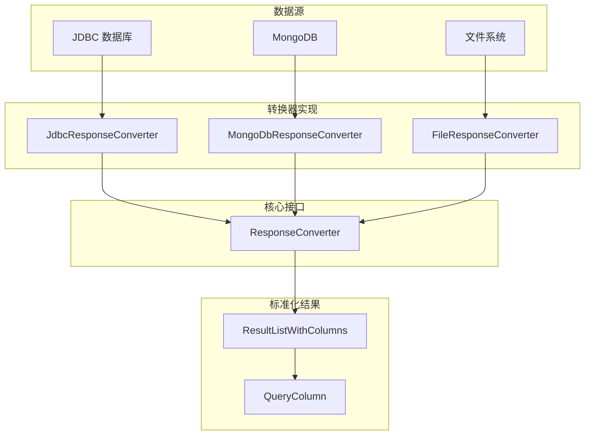
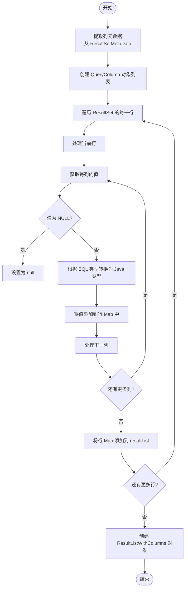
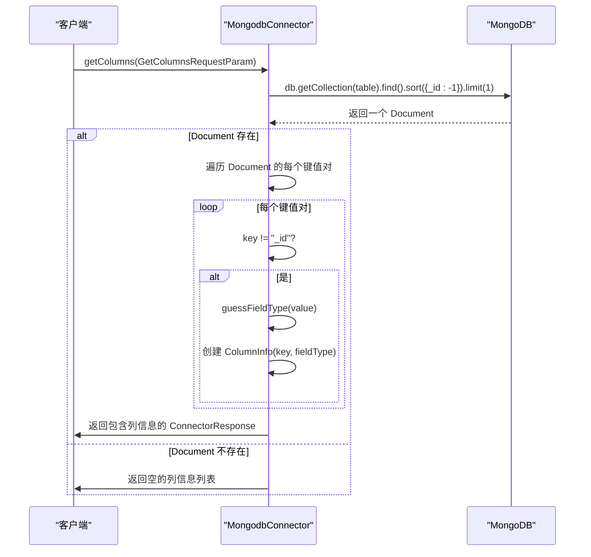
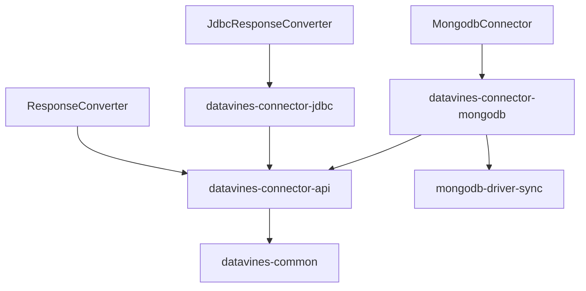

# 响应结果转换

<cite>
**本文档引用的文件**  
- [ResponseConverter.java](file://datavines-connector/datavines-connector-api/src/main/java/io/datavines/connector/api/ResponseConverter.java)
- [JdbcResponseConverter.java](file://datavines-connector/datavines-connector-plugins/datavines-connector-jdbc/src/main/java/io/datavines/connector/plugin/JdbcResponseConverter.java)
- [ResultListWithColumns.java](file://datavines-connector/datavines-connector-api/src/main/java/io/datavines/connector/api/entity/ResultListWithColumns.java)
- [ListWithQueryColumn.java](file://datavines-common/src/main/java/io/datavines/common/entity/ListWithQueryColumn.java)
- [QueryColumn.java](file://datavines-common/src/main/java/io/datavines/common/entity/QueryColumn.java)
- [MongodbConnector.java](file://datavines-connector/datavines-connector-plugins/datavines-connector-mongodb/src/main/java/io/datavines/connector/plugin/MongodbConnector.java)
</cite>

## 目录
1. [引言](#引言)
2. [核心组件](#核心组件)
3. [架构概述](#架构概述)
4. [详细组件分析](#详细组件分析)
5. [依赖分析](#依赖分析)
6. [性能考虑](#性能考虑)
7. [故障排除指南](#故障排除指南)
8. [结论](#结论)

## 引言
DataVines 是一个用于数据质量监控和治理的开源平台，其核心功能之一是统一处理来自不同数据源的查询响应。为了实现跨数据源的一致性，DataVines 设计了响应结果转换机制，通过 `ResponseConverter` 接口将各种原始查询结果标准化为统一的数据结构 `ResultListWithColumns`。该机制支持多种数据源类型，包括 JDBC 兼容数据库、MongoDB 等 NoSQL 数据库以及文件系统等。本文档深入解析这一转换机制，重点阐述其设计原理、实现细节及扩展能力。

## 核心组件
响应结果转换机制的核心在于 `ResponseConverter` 接口及其具体实现类。该接口定义了将原始查询结果转换为标准格式的方法契约，而具体的转换逻辑则由针对不同数据源的实现类完成。主要涉及的类包括 `ResponseConverter` 接口、`JdbcResponseConverter` 实现类、`ResultListWithColumns` 结果容器以及 `QueryColumn` 列元数据模型。

**核心组件**
- [ResponseConverter.java](file://datavines-connector/datavines-connector-api/src/main/java/io/datavines/connector/api/ResponseConverter.java#L1-L20)
- [JdbcResponseConverter.java](file://datavines-connector/datavines-connector-plugins/datavines-connector-jdbc/src/main/java/io/datavines/connector/plugin/JdbcResponseConverter.java#L1-L22)
- [ResultListWithColumns.java](file://datavines-connector/datavines-connector-api/src/main/java/io/datavines/connector/api/entity/ResultListWithColumns.java#L1-L42)
- [ListWithQueryColumn.java](file://datavines-common/src/main/java/io/datavines/common/entity/ListWithQueryColumn.java#L1-L38)
- [QueryColumn.java](file://datavines-common/src/main/java/io/datavines/common/entity/QueryColumn.java#L1-L47)

## 架构概述
响应结果转换机制采用接口驱动的设计模式，通过定义统一的 `ResponseConverter` 接口，允许为不同的数据源提供定制化的转换器实现。当执行查询操作时，系统根据数据源类型选择相应的转换器，将原始结果（如 JDBC 的 `ResultSet` 或 MongoDB 的 `Document`）转换为标准的 `ResultListWithColumns` 对象。此对象不仅包含数据行列表，还封装了列的元数据信息，如名称、类型和注释，从而实现了结果的标准化和可移植性。

**图示来源**
- [ResponseConverter.java](file://datavines-connector/datavines-connector-api/src/main/java/io/datavines/connector/api/ResponseConverter.java#L1-L20)
- [JdbcResponseConverter.java](file://datavines-connector/datavines-connector-plugins/datavines-connector-jdbc/src/main/java/io/datavines/connector/plugin/JdbcResponseConverter.java#L1-L22)
- [ResultListWithColumns.java](file://datavines-connector/datavines-connector-api/src/main/java/io/datavines/connector/api/entity/ResultListWithColumns.java#L1-L42)
- [QueryColumn.java](file://datavines-common/src/main/java/io/datavines/common/entity/QueryColumn.java#L1-L47)

## 详细组件分析
### ResponseConverter 接口分析
`ResponseConverter` 接口是整个转换机制的基石，它定义了所有转换器必须遵循的契约。尽管当前接口定义为空，但其设计意图是作为所有具体转换器的抽象基类，确保系统可以通过多态性调用不同数据源的转换逻辑。这种设计提高了系统的可扩展性，使得新增数据源支持变得简单而安全。

**组件分析**
- [ResponseConverter.java](file://datavines-connector/datavines-connector-api/src/main/java/io/datavines/connector/api/ResponseConverter.java#L1-L20)

### JdbcResponseConverter 实现分析
`JdbcResponseConverter` 是针对 JDBC 数据源的具体转换器实现。它负责将 `java.sql.ResultSet` 对象转换为 `ResultListWithColumns`。转换过程包括两个主要步骤：首先，从 `ResultSetMetaData` 中提取列的名称、类型等元数据，构建 `QueryColumn` 对象列表；其次，遍历 `ResultSet` 的每一行，将每列的值转换为适当的 Java 对象（如 String、Integer、Boolean 等），并存入 `Map<String, Object>` 中，最终形成一个包含所有数据行的列表。此过程还处理了 NULL 值和特殊字符的转义，确保数据的完整性和一致性。

**图示来源**
- [JdbcResponseConverter.java](file://datavines-connector/datavines-connector-plugins/datavines-connector-jdbc/src/main/java/io/datavines/connector/plugin/JdbcResponseConverter.java#L1-L22)
- [ResultListWithColumns.java](file://datavines-connector/datavines-connector-api/src/main/java/io/datavines/connector/api/entity/ResultListWithColumns.java#L1-L42)
- [QueryColumn.java](file://datavines-common/src/main/java/io/datavines/common/entity/QueryColumn.java#L1-L47)

### MongoDB 数据源特殊规则分析
对于 MongoDB 这类 NoSQL 数据源，由于其模式灵活，没有固定的表结构，因此无法像关系型数据库那样直接获取列元数据。`MongodbConnector` 类中的 `getColumns` 方法采用了启发式的方法来推断列的元数据。它通过查询集合中的一个文档（通常是最近插入的），遍历其所有键值对，根据值的 Java 类型（如 String、Integer、Boolean 等）来猜测其数据类型，并生成相应的 `ColumnInfo`。这种方法虽然不能保证 100% 的准确性（例如，无法区分 INT 和 BIGINT），但在大多数场景下足以提供有用的信息。对于 `_id` 字段，通常会特别处理，不将其作为普通列返回。

**图示来源**
- [MongodbConnector.java](file://datavines-connector/datavines-connector-plugins/datavines-connector-mongodb/src/main/java/io/datavines/connector/plugin/MongodbConnector.java#L130-L166)
- [QueryColumn.java](file://datavines-common/src/main/java/io/datavines/common/entity/QueryColumn.java#L1-L47)

## 依赖分析
响应结果转换机制的实现依赖于多个模块和外部库。核心依赖包括 `datavines-connector-api` 模块提供的接口定义，`datavines-common` 模块提供的通用实体和工具类，以及针对特定数据源的插件模块（如 `datavines-connector-jdbc` 和 `datavines-connector-mongodb`）。对于 MongoDB 支持，还需要引入 `mongodb-driver-sync` 作为外部依赖。这种模块化的设计使得各组件之间的耦合度较低，便于独立开发和测试。

**图示来源**
- [pom.xml](file://datavines-connector/datavines-connector-plugins/datavines-connector-mongodb/pom.xml#L27-L57)
- [ResponseConverter.java](file://datavines-connector/datavines-connector-api/src/main/java/io/datavines/connector/api/ResponseConverter.java#L1-L20)
- [JdbcResponseConverter.java](file://datavines-connector/datavines-connector-plugins/datavines-connector-jdbc/src/main/java/io/datavines/connector/plugin/JdbcResponseConverter.java#L1-L22)
- [MongodbConnector.java](file://datavines-connector/datavines-connector-plugins/datavines-connector-mongodb/src/main/java/io/datavines/connector/plugin/MongodbConnector.java#L47-L222)

## 性能考虑
在处理大数据量结果集时，响应结果转换机制需要考虑内存消耗和处理效率。理想情况下，应采用流式处理（streaming）的方式，避免一次性将所有数据加载到内存中。然而，根据现有代码分析，当前的实现似乎是将整个结果集完全加载后才进行转换，这在处理超大规模数据时可能会导致内存溢出（OOM）。未来的优化方向可以是引入分页机制或支持流式 API，允许客户端逐批获取和处理数据。此外，对于频繁的类型转换和字符串操作，应进行性能剖析，以识别和消除潜在的性能瓶颈。

## 故障排除指南
在使用响应结果转换功能时，可能遇到的常见问题包括：数据类型映射错误、NULL 值处理异常、特殊字符乱码以及大数据量查询超时。排查这些问题时，应首先检查数据源连接配置是否正确，然后验证查询语句的语法。对于类型映射问题，需要确认 `JdbcResponseConverter` 中的类型映射逻辑是否与目标数据库兼容。如果遇到性能问题，应检查系统资源使用情况，并考虑优化查询或启用分页。日志文件是诊断问题的关键，应仔细审查 `datavines-server` 和相关 connector 的日志输出。

**故障排除**
- [MongodbConnector.java](file://datavines-connector/datavines-connector-plugins/datavines-connector-mongodb/src/main/java/io/datavines/connector/plugin/MongodbConnector.java#L82-L83)
- [JdbcResponseConverter.java](file://datavines-connector/datavines-connector-plugins/datavines-connector-jdbc/src/main/java/io/datavines/connector/plugin/JdbcResponseConverter.java)

## 结论
DataVines 的响应结果转换机制通过 `ResponseConverter` 接口和 `ResultListWithColumns` 数据结构，成功实现了对多源异构数据查询结果的标准化。该设计具有良好的扩展性和清晰的职责划分。`JdbcResponseConverter` 提供了对关系型数据库的成熟支持，而 `MongodbConnector` 则展示了如何为 NoSQL 数据源设计适配方案。尽管在流式处理大结果集方面仍有改进空间，但整体架构为数据质量监控平台的稳定运行奠定了坚实的基础。未来的工作可以集中在性能优化和增强对更多数据源的支持上。