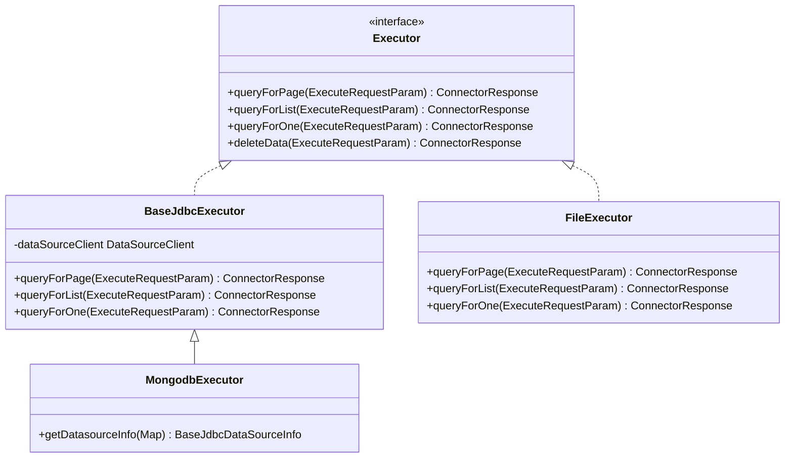
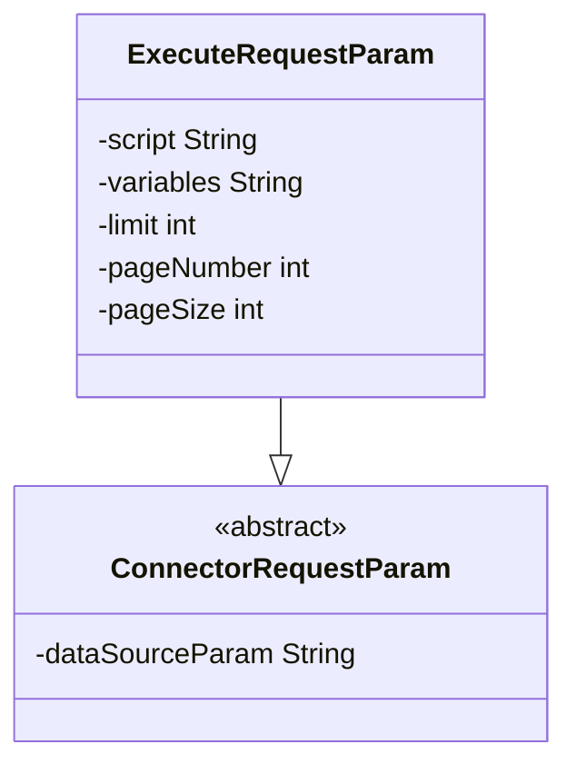
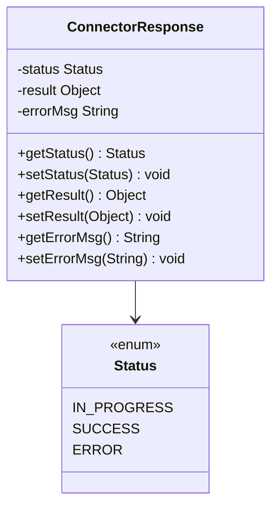
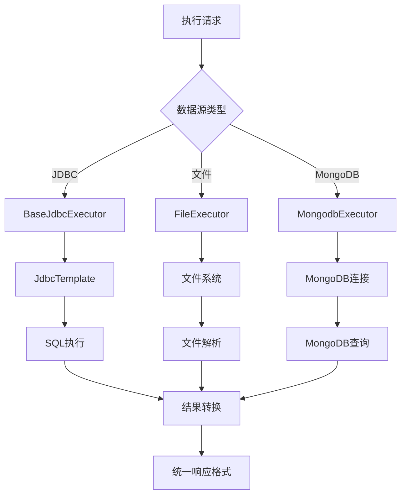
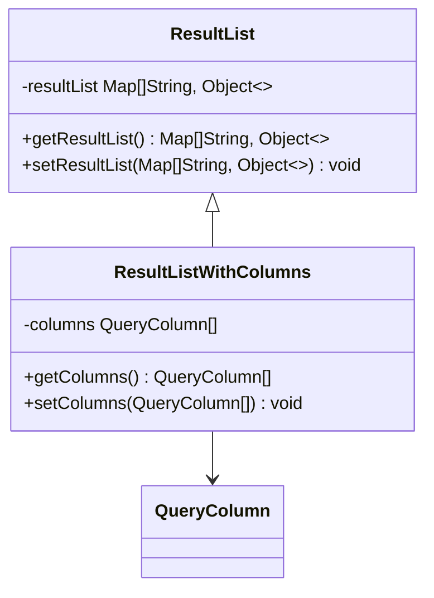
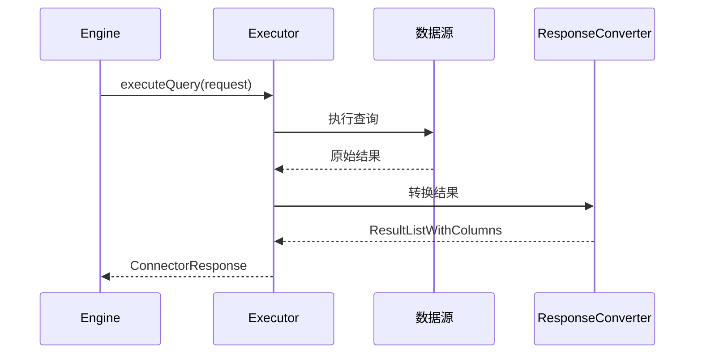
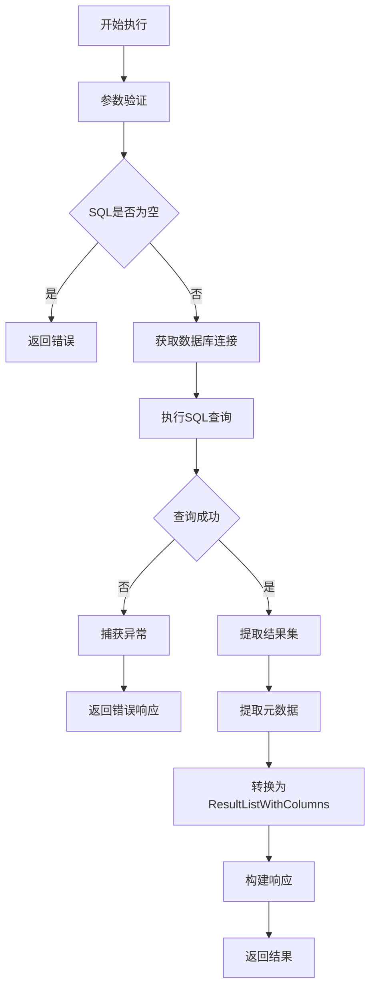
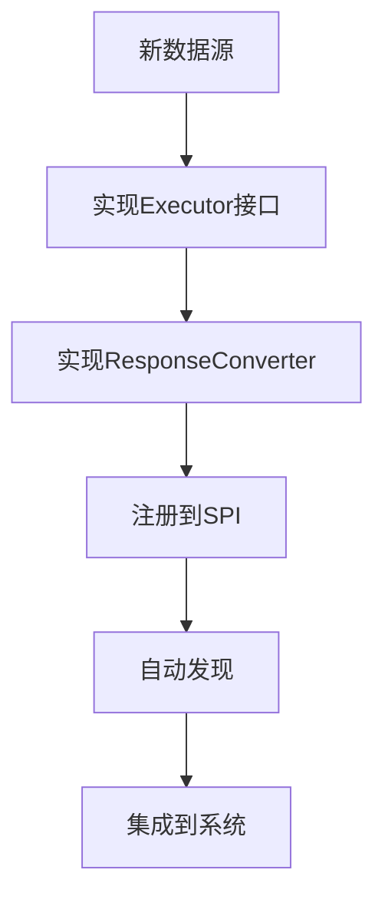

# 数据通信协议

<cite>
**本文档中引用的文件**  
- [Executor.java](file://datavines-connector/datavines-connector-api/src/main/java/io/datavines/connector/api/Executor.java)
- [ResponseConverter.java](file://datavines-connector/datavines-connector-api/src/main/java/io/datavines/connector/api/ResponseConverter.java)
- [ResultListWithColumns.java](file://datavines-connector/datavines-connector-api/src/main/java/io/datavines/connector/api/entity/ResultListWithColumns.java)
- [ResultList.java](file://datavines-connector/datavines-connector-api/src/main/java/io/datavines/connector/api/entity/ResultList.java)
- [ExecuteRequestParam.java](file://datavines-common/src/main/java/io/datavines/common/param/ExecuteRequestParam.java)
- [ConnectorResponse.java](file://datavines-common/src/main/java/io/datavines/common/param/ConnectorResponse.java)
- [BaseJdbcExecutor.java](file://datavines-connector/datavines-connector-plugins/datavines-connector-jdbc/src/main/java/io/datavines/connector/plugin/BaseJdbcExecutor.java)
- [JdbcResponseConverter.java](file://datavines-connector/datavines-connector-plugins/datavines-connector-jdbc/src/main/java/io/datavines/connector/plugin/JdbcResponseConverter.java)
- [FileExecutor.java](file://datavines-connector/datavines-connector-plugins/datavines-connector-file/src/main/java/io/datavines/connector/plugin/FileExecutor.java)
- [MongodbExecutor.java](file://datavines-connector/datavines-connector-plugins/datavines-connector-mongodb/src/main/java/io/datavines/connector/plugin/MongodbExecutor.java)
- [QueryColumn.java](file://datavines-connector/datavines-connector-api/src/main/java/io/datavines/connector/api/entity/QueryColumn.java)
- [ListWithQueryColumn.java](file://datavines-common/src/main/java/io/datavines/common/entity/ListWithQueryColumn.java)
</cite>

## 目录
1. [引言](#引言)
2. [核心接口设计](#核心接口设计)
3. [请求与响应结构](#请求与响应结构)
4. [数据源响应转换策略](#数据源响应转换策略)
5. [结果统一格式转换机制](#结果统一格式转换机制)
6. [SQL执行与元数据提取](#sql执行与元数据提取)
7. [协议通用性与扩展性分析](#协议通用性与扩展性分析)
8. [结论](#结论)

## 引言
DataVines作为一个数据质量监控平台，其核心组件Engine与Connector之间的数据通信协议是系统架构的关键部分。该协议定义了数据查询、执行和结果返回的标准方式，支持多种数据源类型（JDBC、文件、NoSQL等）。本文档深入剖析这一通信协议的设计原理与实现机制，重点分析Executor接口、Request/Response对象结构、响应结果转换策略以及协议的通用性和扩展性。

## 核心接口设计

DataVines通过`Executor`接口定义了Engine与Connector之间的核心交互契约。该接口位于`io.datavines.connector.api.Executor`，采用策略模式为不同数据源提供统一的执行入口。

**图示来源**  
- [Executor.java](file://datavines-connector/datavines-connector-api/src/main/java/io/datavines/connector/api/Executor.java)
- [BaseJdbcExecutor.java](file://datavines-connector/datavines-connector-plugins/datavines-connector-jdbc/src/main/java/io/datavines/connector/plugin/BaseJdbcExecutor.java)
- [FileExecutor.java](file://datavines-connector/datavines-connector-plugins/datavines-connector-file/src/main/java/io/datavines/connector/plugin/FileExecutor.java)
- [MongodbExecutor.java](file://datavines-connector/datavines-connector-plugins/datavines-connector-mongodb/src/main/java/io/datavines/connector/plugin/MongodbExecutor.java)

**本节来源**  
- [Executor.java](file://datavines-connector/datavines-connector-api/src/main/java/io/datavines/connector/api/Executor.java#L24-L46)
- [BaseJdbcExecutor.java](file://datavines-connector/datavines-connector-plugins/datavines-connector-jdbc/src/main/java/io/datavines/connector/plugin/BaseJdbcExecutor.java#L34-L116)

## 请求与响应结构

### 请求对象设计
`ExecuteRequestParam`类定义了查询请求的数据结构，继承自`ConnectorRequestParam`，包含执行脚本、变量、分页参数等核心字段。

**图示来源**  
- [ExecuteRequestParam.java](file://datavines-common/src/main/java/io/datavines/common/param/ExecuteRequestParam.java)

**本节来源**  
- [ExecuteRequestParam.java](file://datavines-common/src/main/java/io/datavines/common/param/ExecuteRequestParam.java#L24-L35)

### 响应对象设计
`ConnectorResponse`采用构建者模式（Builder Pattern）设计，封装了执行状态、结果数据和错误信息三个核心部分，确保了响应的一致性和可扩展性。

**图示来源**  
- [ConnectorResponse.java](file://datavines-common/src/main/java/io/datavines/common/param/ConnectorResponse.java)

**本节来源**  
- [ConnectorResponse.java](file://datavines-common/src/main/java/io/datavines/common/param/ConnectorResponse.java#L22-L90)

## 数据源响应转换策略

DataVines针对不同类型数据源（JDBC、文件、NoSQL）设计了差异化的响应处理策略，但通过统一的接口保持了协议的一致性。

### JDBC数据源处理
对于JDBC数据源，`BaseJdbcExecutor`作为抽象基类，封装了JDBC连接管理和SQL执行的通用逻辑。它通过`DataSourceClient`获取`JdbcTemplate`，并利用`SqlUtils`工具类执行查询。

### 文件数据源处理
`FileExecutor`专门处理文件类型数据源，支持CSV等格式的文件读取。它通过解析文件路径和分隔符，将文件内容转换为结构化数据。

### MongoDB数据源处理
`MongodbExecutor`继承自`BaseJdbcExecutor`，复用JDBC连接管理机制，但通过`MongodbDataSourceInfo`适配MongoDB特有的连接参数。

**图示来源**  
- [BaseJdbcExecutor.java](file://datavines-connector/datavines-connector-plugins/datavines-connector-jdbc/src/main/java/io/datavines/connector/plugin/BaseJdbcExecutor.java)
- [FileExecutor.java](file://datavines-connector/datavines-connector-plugins/datavines-connector-file/src/main/java/io/datavines/connector/plugin/FileExecutor.java)
- [MongodbExecutor.java](file://datavines-connector/datavines-connector-plugins/datavines-connector-mongodb/src/main/java/io/datavines/connector/plugin/MongodbExecutor.java)

**本节来源**  
- [BaseJdbcExecutor.java](file://datavines-connector/datavines-connector-plugins/datavines-connector-jdbc/src/main/java/io/datavines/connector/plugin/BaseJdbcExecutor.java#L47-L115)
- [FileExecutor.java](file://datavines-connector/datavines-connector-plugins/datavines-connector-file/src/main/java/io/datavines/connector/plugin/FileExecutor.java#L41-L162)
- [MongodbExecutor.java](file://datavines-connector/datavines-connector-plugins/datavines-connector-mongodb/src/main/java/io/datavines/connector/plugin/MongodbExecutor.java#L24-L34)

## 结果统一格式转换机制

### 核心数据结构
DataVines通过`ResultListWithColumns`类实现查询结果的标准化表示，继承自`ResultList`，增加了列元数据信息。

**图示来源**  
- [ResultList.java](file://datavines-connector/datavines-connector-api/src/main/java/io/datavines/connector/api/entity/ResultList.java)
- [ResultListWithColumns.java](file://datavines-connector/datavines-connector-api/src/main/java/io/datavines/connector/api/entity/ResultListWithColumns.java)
- [QueryColumn.java](file://datavines-connector/datavines-connector-api/src/main/java/io/datavines/connector/api/entity/QueryColumn.java)

**本节来源**  
- [ResultList.java](file://datavines-connector/datavines-connector-api/src/main/java/io/datavines/connector/api/entity/ResultList.java#L24-L41)
- [ResultListWithColumns.java](file://datavines-connector/datavines-connector-api/src/main/java/io/datavines/connector/api/entity/ResultListWithColumns.java#L22-L42)
- [QueryColumn.java](file://datavines-connector/datavines-connector-api/src/main/java/io/datavines/connector/api/entity/QueryColumn.java#L19-L58)

### 转换流程
`ResponseConverter`接口定义了原始查询结果到`ResultListWithColumns`的转换契约。不同数据源实现各自的转换器，如`JdbcResponseConverter`负责将JDBC ResultSet转换为标准格式。

**图示来源**  
- [ResponseConverter.java](file://datavines-connector/datavines-connector-api/src/main/java/io/datavines/connector/api/ResponseConverter.java)
- [JdbcResponseConverter.java](file://datavines-connector/datavines-connector-plugins/datavines-connector-jdbc/src/main/java/io/datavines/connector/plugin/JdbcResponseConverter.java)

**本节来源**  
- [ResponseConverter.java](file://datavines-connector/datavines-connector-api/src/main/java/io/datavines/connector/api/ResponseConverter.java#L19-L20)
- [JdbcResponseConverter.java](file://datavines-connector/datavines-connector-plugins/datavines-connector-jdbc/src/main/java/io/datavines/connector/plugin/JdbcResponseConverter.java#L21-L22)

## SQL执行与元数据提取

### 执行过程
SQL执行过程遵循严格的错误处理和资源管理规范。`BaseJdbcExecutor`在执行前验证参数，通过`JdbcTemplate`执行SQL，并处理可能的`SQLException`。

### 元数据提取
查询结果的元数据（列名、类型等）通过`QueryColumn`对象封装。对于JDBC数据源，这些信息从ResultSetMetaData提取；对于文件数据源，则从文件头行解析。

**本节来源**  
- [BaseJdbcExecutor.java](file://datavines-connector/datavines-connector-plugins/datavines-connector-jdbc/src/main/java/io/datavines/connector/plugin/BaseJdbcExecutor.java#L47-L115)
- [FileExecutor.java](file://datavines-connector/datavines-connector-plugins/datavines-connector-file/src/main/java/io/datavines/connector/plugin/FileExecutor.java#L117-L160)

## 协议通用性与扩展性分析

### 通用性设计
DataVines的数据通信协议通过以下设计确保通用性：
1. **接口抽象**：`Executor`接口定义了统一的执行契约
2. **参数泛化**：`ExecuteRequestParam`通过`dataSourceParam`支持任意数据源配置
3. **响应标准化**：`ConnectorResponse`封装了所有可能的执行结果

### 扩展性机制
协议的扩展性体现在：
1. **插件化架构**：通过SPI机制加载不同数据源的Connector
2. **继承复用**：`BaseJdbcExecutor`为所有JDBC兼容数据源提供基础实现
3. **策略模式**：`ResponseConverter`允许不同数据源自定义转换逻辑

**本节来源**  
- [Executor.java](file://datavines-connector/datavines-connector-api/src/main/java/io/datavines/connector/api/Executor.java)
- [BaseJdbcExecutor.java](file://datavines-connector/datavines-connector-plugins/datavines-connector-jdbc/src/main/java/io/datavines/connector/plugin/BaseJdbcExecutor.java)
- [ResponseConverter.java](file://datavines-connector/datavines-connector-api/src/main/java/io/datavines/connector/api/ResponseConverter.java)

## 结论
DataVines的数据通信协议通过精心设计的接口抽象、标准化的数据结构和灵活的扩展机制，实现了Engine与Connector之间的高效、可靠通信。该协议不仅支持多种数据源类型，还通过统一的响应格式和错误处理机制，为上层应用提供了简洁一致的API。其插件化架构和继承复用设计，使得新数据源的集成变得简单高效，体现了良好的软件工程实践。