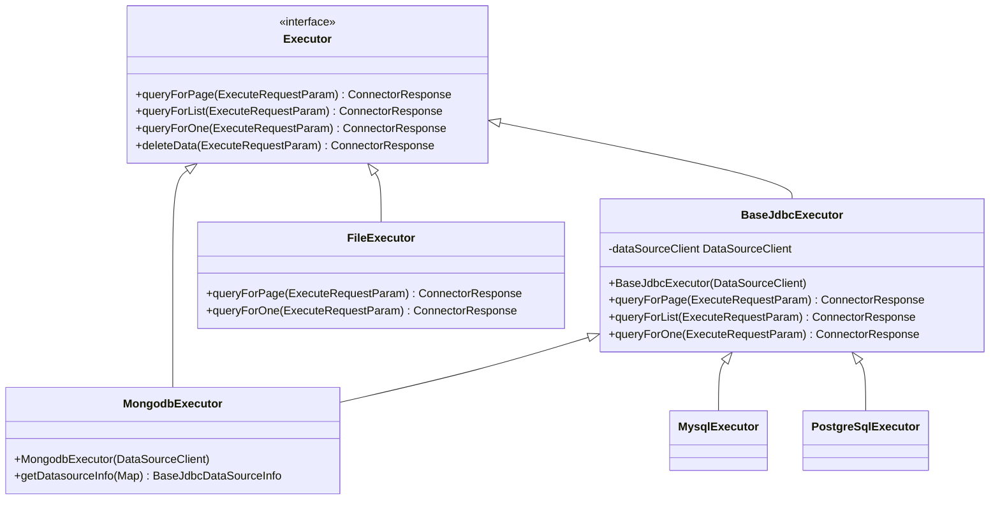
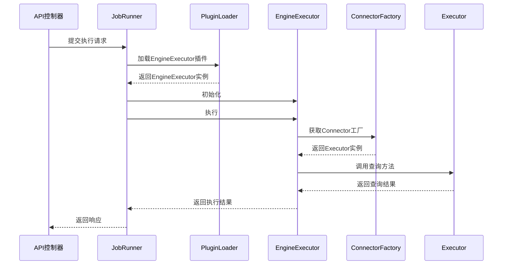
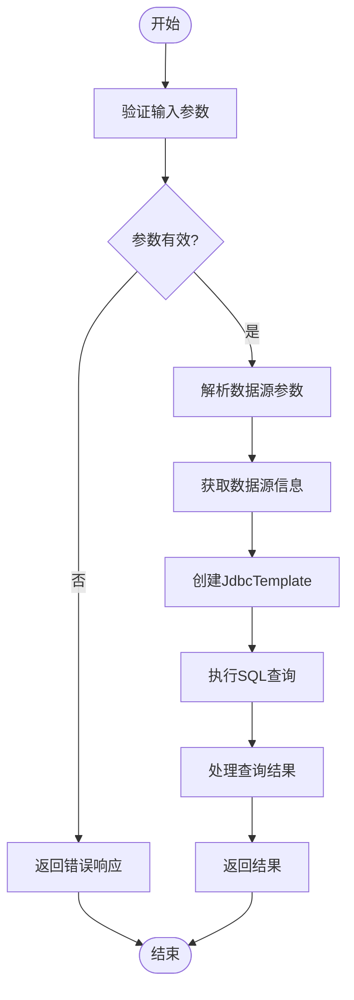
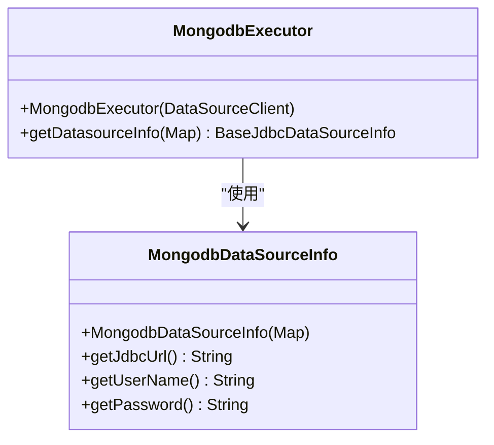
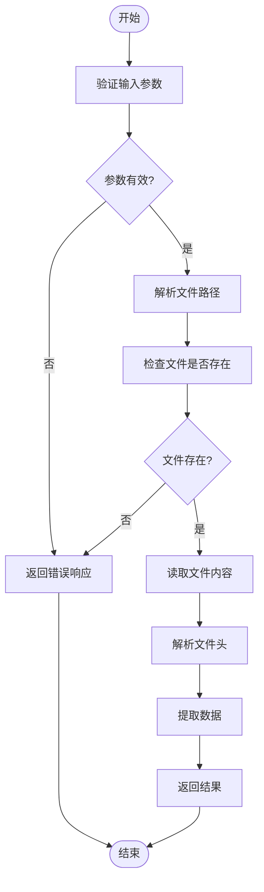
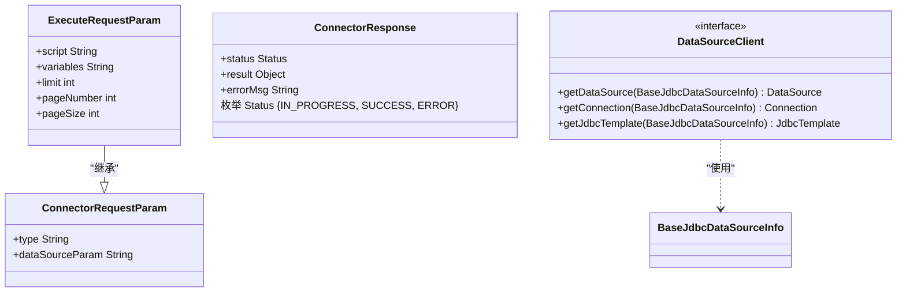
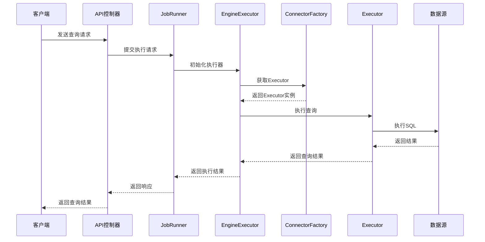

# 请求处理机制

<cite>
**本文档引用的文件**   
- [Executor.java](file://datavines-connector\datavines-connector-api\src\main\java\io\datavines\connector\api\Executor.java)
- [BaseJdbcExecutor.java](file://datavines-connector\datavines-connector-plugins\datavines-connector-jdbc\src\main\java\io\datavines\connector\plugin\BaseJdbcExecutor.java)
- [MongodbExecutor.java](file://datavines-connector\datavines-connector-plugins\datavines-connector-mongodb\src\main\java\io\datavines\connector\plugin\MongodbExecutor.java)
- [ExecuteRequestParam.java](file://datavines-common\src\main\java\io\datavines\common\param\ExecuteRequestParam.java)
- [ConnectorResponse.java](file://datavines-common\src\main\java\io\datavines\common\param\ConnectorResponse.java)
- [ConnectorRequestParam.java](file://datavines-common\src\main\java\io\datavines\common\param\ConnectorRequestParam.java)
- [DataSourceClient.java](file://datavines-connector\datavines-connector-api\src\main\java\io\datavines\connector\api\DataSourceClient.java)
- [FileExecutor.java](file://datavines-connector\datavines-connector-plugins\datavines-connector-file\src\main\java\io\datavines\connector\plugin\FileExecutor.java)
- [MysqlExecutor.java](file://datavines-connector\datavines-connector-plugins\datavines-connector-mysql\src\main\java\io\datavines\connector\plugin\MysqlExecutor.java)
- [PostgreSqlExecutor.java](file://datavines-connector\datavines-connector-plugins\datavines-connector-postgresql\src\main\java\io\datavines\connector\plugin\PostgreSqlExecutor.java)
- [JobExecutionRequest.java](file://datavines-common\src\main\java\io\datavines\common\entity\JobExecutionRequest.java)
</cite>

## 目录
1. [引言](#引言)
2. [核心组件](#核心组件)
3. [Executor接口设计原理](#executor接口设计原理)
4. [EngineExecutor请求封装与转发](#engineexecutor请求封装与转发)
5. [JDBC数据源请求处理](#jdbc数据源请求处理)
6. [MongoDB数据源请求处理](#mongodb数据源请求处理)
7. [文件数据源请求处理](#文件数据源请求处理)
8. [请求参数解析与执行计划](#请求参数解析与执行计划)
9. [调用链分析](#调用链分析)
10. [结论](#结论)

## 引言
DataVines是一个数据质量监控平台，其核心功能之一是处理各种数据源的查询请求。本文档详细阐述了DataVines中数据查询请求的处理流程，重点分析了Executor接口的设计原理及其executeQuery方法的参数定义，包括SQL语句、连接配置和执行上下文的传递机制。同时，描述了EngineExecutor如何封装执行请求并转发给底层Connector，以及不同类型数据源（如JDBC、MongoDB）对请求的差异化处理策略。通过JdbcExecutor和MongodbExecutor的具体实现，说明请求参数的解析、SQL语句的预处理和执行计划的生成过程，并提供实际代码示例展示请求从API层到数据源的完整调用链。

## 核心组件
DataVines的数据查询请求处理涉及多个核心组件，主要包括Executor接口、各种数据源的Executor实现（如JdbcExecutor、MongodbExecutor）、DataSourceClient以及相关的参数和响应类。这些组件协同工作，实现了从API请求到数据源执行的完整流程。

**本文档引用的文件**   
- [Executor.java](file://datavines-connector\datavines-connector-api\src\main\java\io\datavines\connector\api\Executor.java)
- [BaseJdbcExecutor.java](file://datavines-connector\datavines-connector-plugins\datavines-connector-jdbc\src\main\java\io\datavines\connector\plugin\BaseJdbcExecutor.java)
- [MongodbExecutor.java](file://datavines-connector\datavines-connector-plugins\datavines-connector-mongodb\src\main\java\io\datavines\connector\plugin\MongodbExecutor.java)

## Executor接口设计原理
Executor接口是DataVines中数据查询请求处理的核心接口，定义了查询操作的基本方法。该接口采用默认方法（default method）的方式提供了查询操作的默认实现，允许具体的Executor实现类根据需要重写这些方法。

**图表来源**
- [Executor.java](file://datavines-connector\datavines-connector-api\src\main\java\io\datavines\connector\api\Executor.java)
- [BaseJdbcExecutor.java](file://datavines-connector\datavines-connector-plugins\datavines-connector-jdbc\src\main\java\io\datavines\connector\plugin\BaseJdbcExecutor.java)
- [MongodbExecutor.java](file://datavines-connector\datavines-connector-plugins\datavines-connector-mongodb\src\main\java\io\datavines\connector\plugin\MongodbExecutor.java)
- [FileExecutor.java](file://datavines-connector\datavines-connector-plugins\datavines-connector-file\src\main\java\io\datavines\connector\plugin\FileExecutor.java)
- [MysqlExecutor.java](file://datavines-connector\datavines-connector-plugins\datavines-connector-mysql\src\main\java\io\datavines\connector\plugin\MysqlExecutor.java)
- [PostgreSqlExecutor.java](file://datavines-connector\datavines-connector-plugins\datavines-connector-postgresql\src\main\java\io\datavines\connector\plugin\PostgreSqlExecutor.java)

**本节来源**
- [Executor.java](file://datavines-connector\datavines-connector-api\src\main\java\io\datavines\connector\api\Executor.java)

## EngineExecutor请求封装与转发
EngineExecutor是DataVines中负责执行任务的核心接口，它定义了任务执行的生命周期方法，包括初始化、执行、后续处理、取消和状态检查。EngineExecutor通过PluginLoader机制动态加载具体的执行器实现，并将请求封装后转发给底层的Connector进行处理。

**图表来源**
- [JobRunner.java](file://datavines-runner\src\main\java\io\datavines\runner\JobRunner.java)
- [EngineExecutor.java](file://datavines-engine\datavines-engine-api\src\main\java\io\datavines\engine\api\engine\EngineExecutor.java)
- [ConnectorFactory.java](file://datavines-connector\datavines-connector-api\src\main\java\io\datavines\connector\api\ConnectorFactory.java)

**本节来源**
- [EngineExecutor.java](file://datavines-engine\datavines-engine-api\src\main\java\io\datavines\engine\api\engine\EngineExecutor.java)
- [JobRunner.java](file://datavines-runner\src\main\java\io\datavines\runner\JobRunner.java)

## JDBC数据源请求处理
对于JDBC数据源，DataVines通过BaseJdbcExecutor类提供了基础的查询处理功能。该类实现了Executor接口，并提供了对分页查询、单条查询和列表查询的支持。具体的数据库类型（如MySQL、PostgreSQL）通过继承BaseJdbcExecutor并重写getDatasourceInfo方法来实现特定的数据源信息解析。

**图表来源**
- [BaseJdbcExecutor.java](file://datavines-connector\datavines-connector-plugins\datavines-connector-jdbc\src\main\java\io\datavines\connector\plugin\BaseJdbcExecutor.java)
- [MysqlExecutor.java](file://datavines-connector\datavines-connector-plugins\datavines-connector-mysql\src\main\java\io\datavines\connector\plugin\MysqlExecutor.java)
- [PostgreSqlExecutor.java](file://datavines-connector\datavines-connector-plugins\datavines-connector-postgresql\src\main\java\io\datavines\connector\plugin\PostgreSqlExecutor.java)

**本节来源**
- [BaseJdbcExecutor.java](file://datavines-connector\datavines-connector-plugins\datavines-connector-jdbc\src\main\java\io\datavines\connector\plugin\BaseJdbcExecutor.java)

## MongoDB数据源请求处理
对于MongoDB数据源，DataVines通过MongodbExecutor类实现了查询处理。MongodbExecutor继承自BaseJdbcExecutor，利用JDBC连接MongoDB的方式进行数据查询。它通过重写getDatasourceInfo方法来解析MongoDB特有的连接参数，并使用标准的JDBC接口执行查询操作。

**图表来源**
- [MongodbExecutor.java](file://datavines-connector\datavines-connector-plugins\datavines-connector-mongodb\src\main\java\io\datavines\connector\plugin\MongodbExecutor.java)
- [MongodbDataSourceInfo.java](file://datavines-common\src\main\java\io\datavines\common\datasource\jdbc\entity\MongodbDataSourceInfo.java)

**本节来源**
- [MongodbExecutor.java](file://datavines-connector\datavines-connector-plugins\datavines-connector-mongodb\src\main\java\io\datavines\connector\plugin\MongodbExecutor.java)

## 文件数据源请求处理
对于文件数据源，DataVines通过FileExecutor类实现了基于文件系统的查询处理。FileExecutor直接实现了Executor接口，支持对CSV等格式文件的分页查询和单条查询。它通过解析文件路径和列分隔符等参数，读取文件内容并返回结构化的查询结果。

**图表来源**
- [FileExecutor.java](file://datavines-connector\datavines-connector-plugins\datavines-connector-file\src\main\java\io\datavines\connector\plugin\FileExecutor.java)

**本节来源**
- [FileExecutor.java](file://datavines-connector\datavines-connector-plugins\datavines-connector-file\src\main\java\io\datavines\connector\plugin\FileExecutor.java)

## 请求参数解析与执行计划
DataVines中的请求参数解析和执行计划生成主要通过ExecuteRequestParam类和相关的Executor实现来完成。ExecuteRequestParam封装了查询请求的所有必要信息，包括SQL脚本、变量、分页参数等。Executor实现类根据这些参数生成相应的执行计划，并通过DataSourceClient获取数据源连接来执行查询。

**图表来源**
- [ExecuteRequestParam.java](file://datavines-common\src\main\java\io\datavines\common\param\ExecuteRequestParam.java)
- [ConnectorRequestParam.java](file://datavines-common\src\main\java\io\datavines\common\param\ConnectorRequestParam.java)
- [ConnectorResponse.java](file://datavines-common\src\main\java\io\datavines\common\param\ConnectorResponse.java)
- [DataSourceClient.java](file://datavines-connector\datavines-connector-api\src\main\java\io\datavines\connector\api\DataSourceClient.java)

**本节来源**
- [ExecuteRequestParam.java](file://datavines-common\src\main\java\io\datavines\common\param\ExecuteRequestParam.java)
- [ConnectorResponse.java](file://datavines-common\src\main\java\io\datavines\common\param\ConnectorResponse.java)
- [DataSourceClient.java](file://datavines-connector\datavines-connector-api\src\main\java\io\datavines\connector\api\DataSourceClient.java)

## 调用链分析
DataVines的数据查询请求从API层到数据源的完整调用链如下：API控制器接收请求后，通过JobRunner启动任务执行，JobRunner使用PluginLoader加载相应的EngineExecutor实现，EngineExecutor初始化后执行任务，通过ConnectorFactory获取对应的Executor实例，Executor实例根据请求参数执行具体的查询操作，并将结果返回给上层调用者。

**图表来源**
- [JobExecutionController.java](file://datavines-server\src\main\java\io\datavines\server\api\controller\JobExecutionController.java)
- [JobRunner.java](file://datavines-runner\src\main\java\io\datavines\runner\JobRunner.java)
- [EngineExecutor.java](file://datavines-engine\datavines-engine-api\src\main\java\io\datavines\engine\api\engine\EngineExecutor.java)
- [ConnectorFactory.java](file://datavines-connector\datavines-connector-api\src\main\java\io\datavines\connector\api\ConnectorFactory.java)
- [Executor.java](file://datavines-connector\datavines-connector-api\src\main\java\io\datavines\connector\api\Executor.java)

**本节来源**
- [JobRunner.java](file://datavines-runner\src\main\java\io\datavines\runner\JobRunner.java)
- [JobExecutionRequest.java](file://datavines-common\src\main\java\io\datavines\common\entity\JobExecutionRequest.java)

## 结论
DataVines通过精心设计的Executor接口和灵活的插件机制，实现了对多种数据源的统一查询处理。Executor接口提供了标准化的查询方法，而具体的Executor实现类则负责处理特定数据源的细节。EngineExecutor作为任务执行的核心，通过封装和转发请求，实现了请求处理的解耦和灵活性。通过对JDBC、MongoDB和文件数据源的差异化处理策略，DataVines能够高效地处理各种类型的数据查询请求，为数据质量监控提供了坚实的基础。