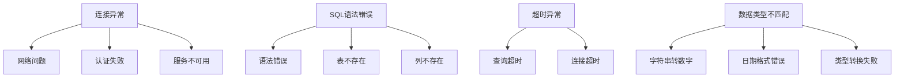
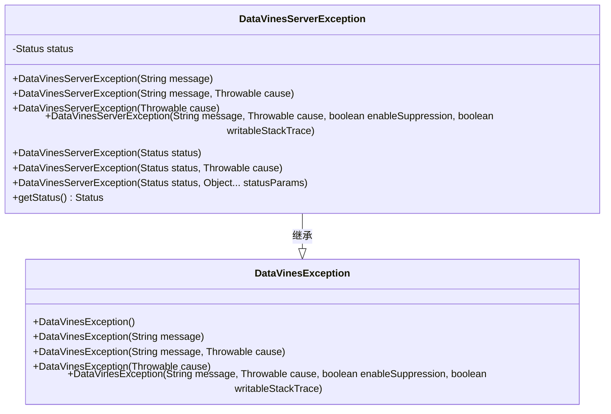
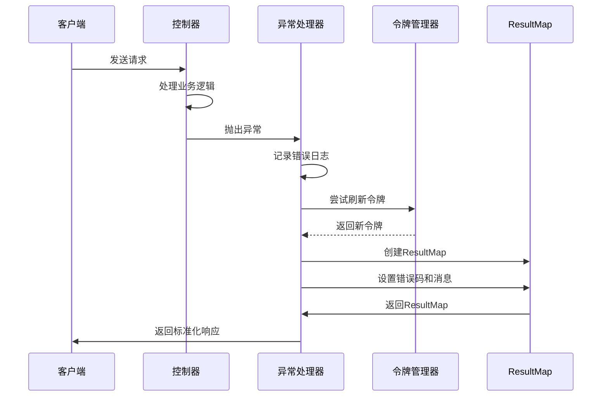
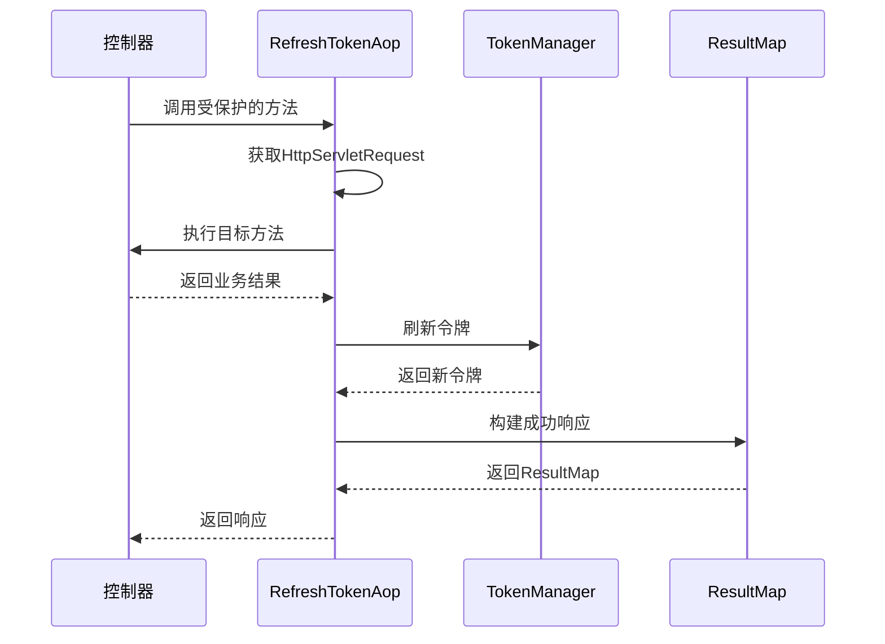
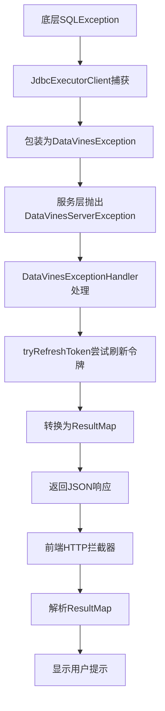
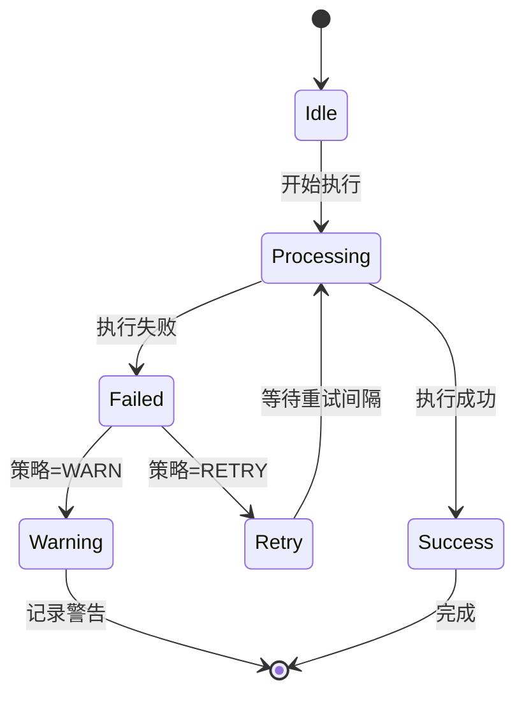
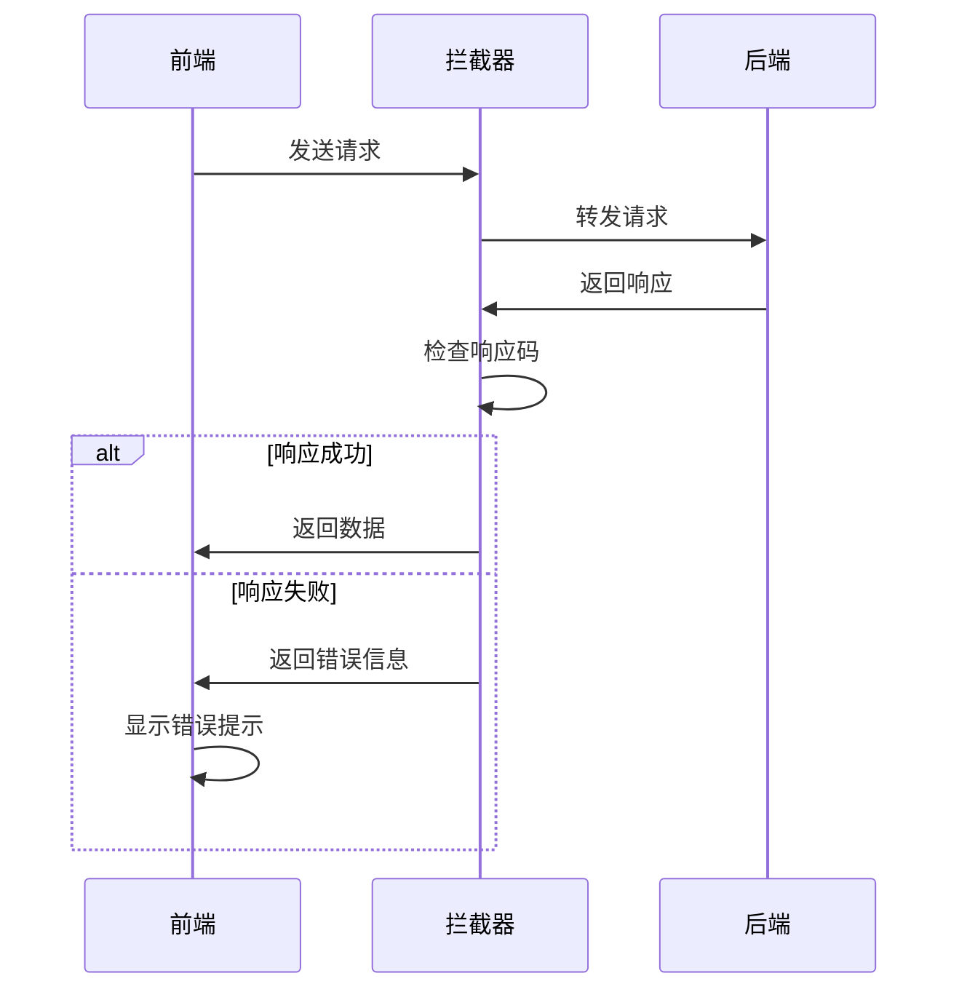

# 错误处理策略

<cite>
**本文档引用的文件**  
- [DataVinesException.java](file://datavines-common/src/main/java/io/datavines/common/exception/DataVinesException.java)
- [DataVinesServerException.java](file://datavines-core/src/main/java/io/datavines/core/exception/DataVinesServerException.java)
- [Status.java](file://datavines-core/src/main/java/io/datavines/core/enums/Status.java)
- [DataVinesExceptionHandler.java](file://datavines-server/src/main/java/io/datavines/server/api/inteceptor/DataVinesExceptionHandler.java)
- [ResultMap.java](file://datavines-core/src/main/java/io/datavines/core/entity/ResultMap.java)
- [TokenManager.java](file://datavines-core/src/main/java/io/datavines/core/utils/TokenManager.java)
- [RefreshTokenAop.java](file://datavines-core/src/main/java/io/datavines/core/aop/RefreshTokenAop.java)
- [RefreshToken.java](file://datavines-core/src/main/java/io/datavines/core/aop/RefreshToken.java)
- [ConnectorResponse.java](file://datavines-common/src/main/java/io/datavines/common/param/ConnectorResponse.java)
- [TimeoutStrategy.java](file://datavines-common/src/main/java/io/datavines/common/enums/TimeoutStrategy.java)
- [response.interceptor.ts](file://datavines-ui/Editor/http/response.interceptor.ts)
</cite>

## 更新摘要
**变更内容**  
- 新增了DataVinesExceptionHandler中的令牌刷新功能增强
- 改进了错误消息处理机制，增加了tryRefreshToken方法
- 新增了RefreshTokenAop切面用于自动令牌刷新
- 完善了令牌自动刷新机制，支持多种请求场景

## 目录
1. [引言](#引言)
2. [异常分类与处理策略](#异常分类与处理策略)
3. [异常体系设计](#异常体系设计)
4. [错误信息标准化输出](#错误信息标准化输出)
5. [令牌自动刷新机制](#令牌自动刷新机制)
6. [错误传播链分析](#错误传播链分析)
7. [重试机制与故障隔离](#重试机制与故障隔离)
8. [前端错误处理](#前端错误处理)
9. [总结](#总结)

## 引言
DataVines作为一个数据质量监控平台，其错误处理机制是确保系统稳定性和用户体验的关键组成部分。本文档系统性地介绍DataVines的错误处理机制，重点分析在数据通信过程中各类异常的分类与处理策略，包括连接异常、SQL语法错误、超时异常和数据类型不匹配等。我们将深入探讨DataVinesException体系的设计原则，以及如何通过异常包装提供清晰的错误上下文信息。

**本文档引用的文件**  
- [DataVinesException.java](file://datavines-common/src/main/java/io/datavines/common/exception/DataVinesException.java)
- [DataVinesServerException.java](file://datavines-core/src/main/java/io/datavines/core/exception/DataVinesServerException.java)

## 异常分类与处理策略
DataVines在数据通信过程中可能遇到多种异常情况，系统对这些异常进行了分类并制定了相应的处理策略。

### 连接异常
当系统尝试连接数据源时，可能由于网络问题、认证失败或服务不可用等原因导致连接异常。这类异常通常由底层JDBC驱动抛出，DataVines通过JdbcDataSourceManager等组件进行捕获和处理。

### SQL语法错误
在执行SQL查询时，如果SQL语句存在语法错误或引用了不存在的表或列，数据库会返回相应的错误信息。DataVines通过JdbcExecutorClient等组件执行SQL，并对执行结果进行分析，将SQL语法错误转换为系统可识别的异常类型。

### 超时异常
长时间运行的查询可能导致超时异常。DataVines通过配置超时策略来处理此类问题，允许用户选择重试或警告等不同的处理方式。

### 数据类型不匹配
当尝试将数据从一种类型转换为另一种类型时，如果转换不兼容，可能会发生数据类型不匹配异常。例如，在将字符串转换为数字时，如果字符串包含非数字字符，就会抛出此类异常。



**图源**  
- [JdbcDataSourceManager.java](file://datavines-common/src/main/java/io/datavines/common/datasource/jdbc/JdbcDataSourceManager.java)
- [JdbcExecutorClient.java](file://datavines-common/src/main/java/io/datavines/common/datasource/jdbc/JdbcExecutorClient.java)

**本节引用的文件**  
- [JdbcDataSourceManager.java](file://datavines-common/src/main/java/io/datavines/common/datasource/jdbc/JdbcDataSourceManager.java)
- [JdbcExecutorClient.java](file://datavines-common/src/main/java/io/datavines/common/datasource/jdbc/JdbcExecutorClient.java)

## 异常体系设计
DataVines的异常体系设计遵循了良好的面向对象原则，通过继承和封装提供了清晰的异常分类和处理机制。

### DataVinesException基础类
`DataVinesException`是所有自定义异常的基类，继承自`RuntimeException`。它提供了多个构造函数，支持无参数、仅消息、消息和原因、仅原因以及完整的参数列表等不同的异常创建方式。

```java
public class DataVinesException extends RuntimeException {
    public DataVinesException() {
        super();
    }

    public DataVinesException(String message) {
        super(message);
    }

    public DataVinesException(String message, Throwable cause) {
        super(message, cause);
    }

    public DataVinesException(Throwable cause) {
        super(cause);
    }

    protected DataVinesException(String message, Throwable cause,
                                boolean enableSuppression,
                                boolean writableStackTrace) {
        super(message, cause, enableSuppression, writableStackTrace);
    }
}
```

### DataVinesServerException扩展类
`DataVinesServerException`继承自`DataVinesException`，并引入了`Status`枚举类型来表示具体的错误状态。这种设计使得异常不仅包含错误消息，还包含了结构化的错误代码和状态信息。



**图源**  
- [DataVinesException.java](file://datavines-common/src/main/java/io/datavines/common/exception/DataVinesException.java)
- [DataVinesServerException.java](file://datavines-core/src/main/java/io/datavines/core/exception/DataVinesServerException.java)

### Status枚举状态码
`Status`枚举类定义了系统中所有可能的错误状态，每个状态包含唯一的错误代码、英文消息和中文消息。这种设计支持国际化，并且通过`getMsg()`方法根据当前语言环境返回相应的消息。

```java
public enum Status {
    SUCCESS(200, "success", "成功"),
    FAIL(400, "Bad Request", "错误的请求"),
    REQUEST_ERROR(10010001, "Request Error", "请求错误"),
    INVALID_TOKEN(10010002, "Invalid Token ：{0}", "无效的Token ：{0}"),
    // ... 其他状态
}
```

**本节引用的文件**  
- [DataVinesException.java](file://datavines-common/src/main/java/io/datavines/common/exception/DataVinesException.java)
- [DataVinesServerException.java](file://datavines-core/src/main/java/io/datavines/core/exception/DataVinesServerException.java)
- [Status.java](file://datavines-core/src/main/java/io/datavines/core/enums/Status.java)

## 错误信息标准化输出
DataVines通过`ResultMap`类实现了错误信息的标准化输出，确保前后端之间的通信具有一致的格式。

### ResultMap结构
`ResultMap`继承自`HashMap<String, Object>`，并添加了`code`字段来表示响应状态码。它提供了`success()`、`fail()`等方法来快速构建成功或失败的响应。

```java
public class ResultMap extends HashMap<String, Object> {
    @Getter
    private int code;
    private TokenManager tokenManager;

    public ResultMap success() {
        this.code = 200;
        this.put("code", this.code);
        this.put("msg", "Success");
        this.put("data", EMPTY);
        return this;
    }

    public ResultMap fail() {
        this.code = 400;
        this.put("code", code);
        this.put("data", EMPTY);
        return this;
    }

    public ResultMap fail(int code) {
        this.code = code;
        this.put("code", code);
        this.put("data", EMPTY);
        return this;
    }

    public ResultMap message(String message) {
        this.put("msg", message);
        return this;
    }

    public ResultMap payload(Object object) {
        this.put("data", null == object ? EMPTY : object);
        return this;
    }
}
```

### 统一异常处理
`DataVinesExceptionHandler`作为全局异常处理器，通过`@RestControllerAdvice`注解拦截所有控制器抛出的异常，并将其转换为标准化的`ResultMap`响应。

**更新** DataVinesExceptionHandler现在集成了令牌自动刷新功能，通过tryRefreshToken方法在异常处理过程中自动刷新用户令牌。

```java
@RestControllerAdvice
public class DataVinesExceptionHandler {
    @Resource
    private TokenManager tokenManager;

    @ExceptionHandler(DataVinesServerException.class)
    public ResponseEntity<ResultMap> dataVinesServerExceptionHandler(DataVinesServerException e, HttpServletRequest request) {
        log.error("DataVinesServerException:", e);
        ResultMap resultMap = new ResultMap(tokenManager);
        Status status = e.getStatus();
        if (Status.INVALID_TOKEN.equals(status)){
            return ResponseEntity.ok(new ResultMap().fail(Status.PLEASE_LOGIN.getCode()).message(Status.PLEASE_LOGIN.getMsg()));
        }

        if (Status.TOKEN_IS_NULL_ERROR.equals(status)){
            return ResponseEntity.ok(new ResultMap().fail(Status.PLEASE_LOGIN.getCode()).message(Status.PLEASE_LOGIN.getMsg()));
        }

        if (!Objects.isNull(status)) {
            resultMap.fail(status.getCode());
        } else {
            resultMap.fail();
        }
        tryRefreshToken(request, resultMap);
        resultMap.message(e.getMessage());
        return ResponseEntity.ok(resultMap);
    }

    @ExceptionHandler(Exception.class)
    public ResponseEntity<ResultMap> commonExceptionHandler(Exception e, HttpServletRequest request) {
        log.error("Exception:", e);
        ResultMap resultMap = new ResultMap(tokenManager);
        resultMap.fail();
        tryRefreshToken(request, resultMap);
        resultMap.message(e.getMessage());
        return ResponseEntity.ok(resultMap);
    }

    private void tryRefreshToken(HttpServletRequest request, ResultMap resultMap) {
        try {
            String token = request.getHeader(DataVinesConstants.TOKEN_HEADER_STRING);
            if (StringUtils.isEmpty(token)) {
                token = (String) request.getAttribute(DataVinesConstants.TOKEN_HEADER_STRING);
                if (StringUtils.isEmpty(token)) {
                    token = request.getParameter(DataVinesConstants.TOKEN_HEADER_STRING);
                }
            }
            if (StringUtils.isNotEmpty(token) && tokenManager != null) {
                resultMap.put("token", tokenManager.refreshToken(token));
            }
        } catch (Exception ex) {
            log.debug("Token refresh skipped: {}", ex.getMessage());
        }
    }
}
```



**图源**  
- [ResultMap.java](file://datavines-core/src/main/java/io/datavines/core/entity/ResultMap.java)
- [DataVinesExceptionHandler.java](file://datavines-server/src/main/java/io/datavines/server/api/inteceptor/DataVinesExceptionHandler.java)

**本节引用的文件**  
- [ResultMap.java](file://datavines-core/src/main/java/io/datavines/core/entity/ResultMap.java)
- [DataVinesExceptionHandler.java](file://datavines-server/src/main/java/io/datavines/server/api/inteceptor/DataVinesExceptionHandler.java)

## 令牌自动刷新机制

**新增** DataVines引入了完整的令牌自动刷新机制，通过多种组件协同工作来确保用户会话的连续性和安全性。

### TokenManager令牌管理
`TokenManager`负责JWT令牌的生成、验证和刷新操作。它提供了多种令牌操作方法，包括生成新令牌、刷新现有令牌和验证令牌有效性。

```java
public class TokenManager {
    // 生成新令牌
    public String generateToken(String username, String password) {
        Map<String, Object> claims = new HashMap<>();
        claims.put(DataVinesConstants.TOKEN_USER_NAME, username);
        claims.put(DataVinesConstants.TOKEN_USER_PASSWORD, password);
        claims.put(DataVinesConstants.TOKEN_CREATE_TIME, System.currentTimeMillis());
        return generate(claims);
    }

    // 刷新令牌
    public String refreshToken(String token) {
        Claims claims = getClaims(token);
        claims.put(DataVinesConstants.TOKEN_CREATE_TIME, System.currentTimeMillis());
        return generate(claims);
    }

    // 验证令牌
    public boolean validateToken(String token, String username, String password) {
        String tokenUsername = getUsername(token);
        String tokenPassword = getPassword(token);
        return (username.equals(tokenUsername) && password.equals(tokenPassword) && !(isExpired(token)));
    }
}
```

### RefreshTokenAop切面
`RefreshTokenAop`是一个Spring AOP切面，通过`@RefreshToken`注解标记的控制器会在每次请求后自动刷新令牌。

```java
@Aspect
@Component
@Order(Integer.MAX_VALUE)
public class RefreshTokenAop {
    
    @Pointcut("@within(RefreshToken)")
    public void pointCut() {
    }

    @Around(value = "pointCut()")
    public Object doAroundReturningAdvice(ProceedingJoinPoint point) throws Throwable{
        Object[] args = point.getArgs();
        HttpServletRequest request = ((ServletRequestAttributes) RequestContextHolder.getRequestAttributes()).getRequest();
        Object result = point.proceed(args);
        return ResponseEntity.ok(new ResultMap(tokenManager).successAndRefreshToken(request).payload(result));
    }
}
```

### RefreshToken注解
`RefreshToken`是一个简单的元注解，用于标记需要自动令牌刷新的控制器类。

```java
@Target({ElementType.TYPE})
@Retention(RetentionPolicy.RUNTIME)
public @interface RefreshToken {
}
```

### 自动刷新流程
令牌自动刷新通过以下流程实现：



**图源**  
- [RefreshTokenAop.java](file://datavines-core/src/main/java/io/datavines/core/aop/RefreshTokenAop.java)
- [TokenManager.java](file://datavines-core/src/main/java/io/datavines/core/utils/TokenManager.java)
- [RefreshToken.java](file://datavines-core/src/main/java/io/datavines/core/aop/RefreshToken.java)

**本节引用的文件**  
- [TokenManager.java](file://datavines-core/src/main/java/io/datavines/core/utils/TokenManager.java)
- [RefreshTokenAop.java](file://datavines-core/src/main/java/io/datavines/core/aop/RefreshTokenAop.java)
- [RefreshToken.java](file://datavines-core/src/main/java/io/datavines/core/aop/RefreshToken.java)

## 错误传播链分析
DataVines的错误传播链从底层数据源异常开始，经过多层处理，最终到达前端用户界面。

### 底层异常捕获
在数据源连接和SQL执行过程中，底层JDBC驱动可能会抛出各种SQLException。这些异常首先被`JdbcDataSourceClient`和`JdbcExecutorClient`等组件捕获。

### 中间层包装
捕获到底层异常后，DataVines会将其包装为更具体的`DataVinesException`子类，添加上下文信息，如数据源名称、SQL语句等。

### 服务层处理
在服务层，`DataVinesServerException`被用来表示业务逻辑中的错误。这些异常包含了`Status`枚举，提供了结构化的错误信息。

### 控制器层转换
**更新** 控制器层的`DataVinesExceptionHandler`现在集成了令牌自动刷新功能。在处理异常时，它会调用`tryRefreshToken`方法尝试刷新用户令牌，确保用户会话的连续性。

```java
private void tryRefreshToken(HttpServletRequest request, ResultMap resultMap) {
    try {
        String token = request.getHeader(DataVinesConstants.TOKEN_HEADER_STRING);
        if (StringUtils.isEmpty(token)) {
            token = (String) request.getAttribute(DataVinesConstants.TOKEN_HEADER_STRING);
            if (StringUtils.isEmpty(token)) {
                token = request.getParameter(DataVinesConstants.TOKEN_HEADER_STRING);
            }
        }
        if (StringUtils.isNotEmpty(token) && tokenManager != null) {
            resultMap.put("token", tokenManager.refreshToken(token));
        }
    } catch (Exception ex) {
        log.debug("Token refresh skipped: {}", ex.getMessage());
    }
}
```

### 前端接收与显示
前端通过HTTP拦截器接收响应，根据`ResultMap`中的`code`字段判断请求是否成功，并显示相应的用户提示。



**图源**  
- [JdbcExecutorClient.java](file://datavines-common/src/main/java/io/datavines/common/datasource/jdbc/JdbcExecutorClient.java)
- [DataVinesServerException.java](file://datavines-core/src/main/java/io/datavines/core/exception/DataVinesServerException.java)
- [DataVinesExceptionHandler.java](file://datavines-server/src/main/java/io/datavines/server/api/inteceptor/DataVinesExceptionHandler.java)
- [ResultMap.java](file://datavines-core/src/main/java/io/datavines/core/entity/ResultMap.java)

**本节引用的文件**  
- [JdbcExecutorClient.java](file://datavines-common/src/main/java/io/datavines/common/datasource/jdbc/JdbcExecutorClient.java)
- [DataVinesServerException.java](file://datavines-core/src/main/java/io/datavines/core/exception/DataVinesServerException.java)
- [DataVinesExceptionHandler.java](file://datavines-server/src/main/java/io/datavines/server/api/inteceptor/DataVinesExceptionHandler.java)
- [ResultMap.java](file://datavines-core/src/main/java/io/datavines/core/entity/ResultMap.java)

## 重试机制与故障隔离
DataVines通过`TimeoutStrategy`枚举实现了灵活的重试机制和故障隔离策略。

### TimeoutStrategy枚举
`TimeoutStrategy`定义了两种处理策略：`RETRY`（重试）和`WARN`（警告）。用户可以在任务配置中选择合适的策略。

```java
public enum TimeoutStrategy{
    RETRY(0, "retry"),
    WARN(1, "warn");

    TimeoutStrategy(int code, String description){
        this.code = code;
        this.description = description;
    }

    final int code;
    final String description;

    public int getCode() {
        return code;
    }

    public String getDescription() {
        return description;
    }
}
```

### 重试间隔配置
在前端界面中，用户可以配置重试间隔时间，系统会根据这个配置在发生错误时进行重试。



**图源**  
- [TimeoutStrategy.java](file://datavines-common/src/main/java/io/datavines/common/enums/TimeoutStrategy.java)
- [index.tsx](file://datavines-ui/Editor/components/MetricModal/OtherConfig/index.tsx)

**本节引用的文件**  
- [TimeoutStrategy.java](file://datavines-common/src/main/java/io/datavines/common/enums/TimeoutStrategy.java)
- [index.tsx](file://datavines-ui/Editor/components/MetricModal/OtherConfig/index.tsx)

## 前端错误处理
前端通过HTTP拦截器对响应进行统一处理，确保用户能够获得清晰的错误提示。

### 响应拦截器
`responseOnSuccess`函数检查响应数据，如果`code`为200则认为请求成功，否则返回拒绝的Promise。

```typescript
export const responseOnSuccess = (response: IResponseInterface) => {
    const { data } = response;
    if (data) {
        if (data instanceof Blob) {
            return {
                success: true,
                data,
            };
        }
        if (data.code === 200) {
            return data;
        }
    }
    return Promise.reject({
        msg: data?.msg,
        code: data?.code,
    });
};
```

### 错误拦截器
`responseOnError`函数处理请求错误，记录错误日志并返回拒绝的Promise。

```typescript
export const responseOnError = (error: any):any => {
    console.log(error);
    // eslint-disable-next-line no-underscore-dangle
    if (error?.__CANCEL__) {
        return;
    }
    return Promise.reject({
        msg: error?.msg || 'interface error',
        code: null,
    });
};
```



**图源**  
- [response.interceptor.ts](file://datavines-ui/Editor/http/response.interceptor.ts)

**本节引用的文件**  
- [response.interceptor.ts](file://datavines-ui/Editor/http/response.interceptor.ts)

## 总结
DataVines的错误处理机制通过分层设计和标准化输出，实现了从底层数据源异常到前端用户提示的完整错误传播链。系统通过`DataVinesException`体系提供了清晰的异常分类，利用`Status`枚举实现了错误码的结构化管理，并通过`ResultMap`确保了前后端通信的一致性。

**更新** 最新的版本增强了异常处理机制，新增了DataVinesExceptionHandler中的令牌刷新功能。该功能通过tryRefreshToken方法在异常处理过程中自动刷新用户令牌，确保用户会话的连续性。同时，系统还引入了RefreshTokenAop切面和RefreshToken注解，实现了自动令牌刷新机制，支持多种请求场景。

全局异常处理器`DataVinesExceptionHandler`统一处理所有异常，而`TimeoutStrategy`则提供了灵活的重试机制。前端通过HTTP拦截器对响应进行统一处理，确保用户能够获得清晰的错误提示。这种设计不仅提高了系统的稳定性和可维护性，也极大地改善了用户体验。