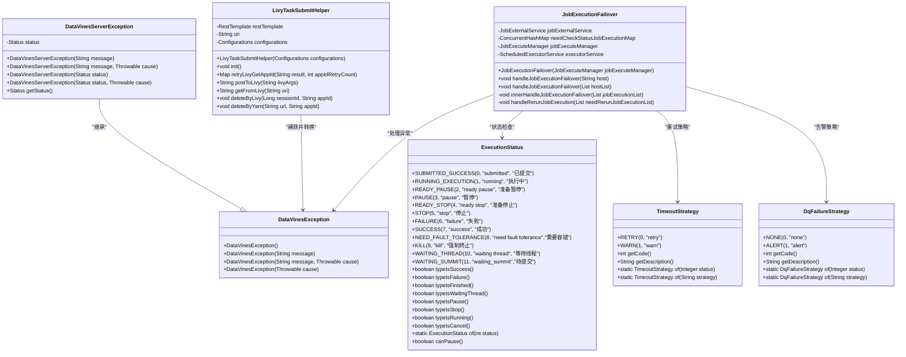
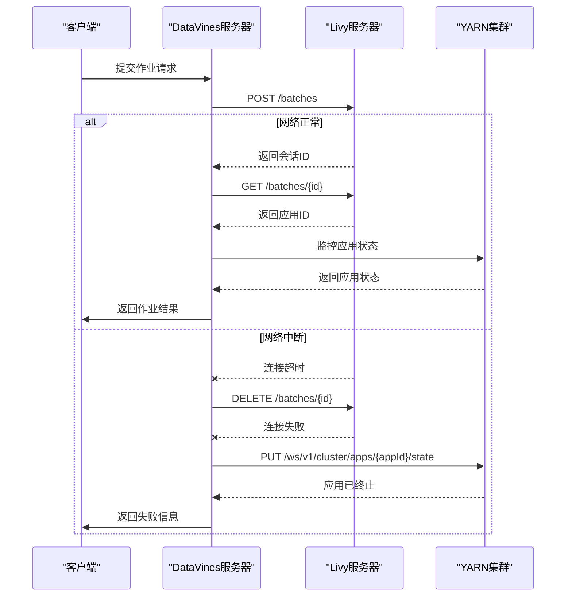

# 异常传播与处理

<cite>
**本文档引用的文件**   
- [LivyTaskSubmitHelper.java](file://datavines-engine\datavines-engine-executor\src\main\java\io\datavines\engine\executor\core\helper\LivyTaskSubmitHelper.java)
- [JobExecutionFailover.java](file://datavines-server\src\main\java\io\datavines\server\dqc\coordinator\failover\JobExecutionFailover.java)
- [DataVinesException.java](file://datavines-common\src\main\java\io\datavines\common\exception\DataVinesException.java)
- [DataVinesServerException.java](file://datavines-core\src\main\java\io\datavines\core\exception\DataVinesServerException.java)
- [ExecutionStatus.java](file://datavines-common\src\main\java\io\datavines\common\enums\ExecutionStatus.java)
- [TimeoutStrategy.java](file://datavines-common\src\main\java\io\datavines\common\enums\TimeoutStrategy.java)
- [DqFailureStrategy.java](file://datavines-server\src\main\java\io\datavines\server\enums\DqFailureStrategy.java)
</cite>

## 目录
1. [引言](#引言)
2. [异常处理架构](#异常处理架构)
3. [LivyTaskSubmitHelper异常捕获机制](#livytasksubmithelper异常捕获机制)
4. [JobExecutionFailover故障转移策略](#jobexecutionfailover故障转移策略)
5. [异常信息分级处理](#异常信息分级处理)
6. [具体异常场景分析](#具体异常场景分析)
7. [结论](#结论)

## 引言
DataVines作为一个分布式数据质量监控系统，其异常处理机制是确保系统稳定性和可靠性的关键。本系统通过统一的异常处理框架，实现了对分布式环境中各种异常的捕获、转换、处理和恢复。核心组件包括LivyTaskSubmitHelper用于捕获外部计算框架异常，JobExecutionFailover实现故障转移和重试策略，以及基于不同异常类型的分级处理机制。

## 异常处理架构

**图源**
- [LivyTaskSubmitHelper.java](file://datavines-engine\datavines-engine-executor\src\main\java\io\datavines\engine\executor\core\helper\LivyTaskSubmitHelper.java)
- [JobExecutionFailover.java](file://datavines-server\src\main\java\io\datavines\server\dqc\coordinator\failover\JobExecutionFailover.java)
- [DataVinesException.java](file://datavines-common\src\main\java\io\datavines\common\exception\DataVinesException.java)
- [DataVinesServerException.java](file://datavines-core\src\main\java\io\datavines\core\exception\DataVinesServerException.java)
- [ExecutionStatus.java](file://datavines-common\src\main\java\io\datavines\common\enums\ExecutionStatus.java)
- [TimeoutStrategy.java](file://datavines-common\src\main\java\io\datavines\common\enums\TimeoutStrategy.java)
- [DqFailureStrategy.java](file://datavines-server\src\main\java\io\datavines\server\enums\DqFailureStrategy.java)

## LivyTaskSubmitHelper异常捕获机制

LivyTaskSubmitHelper组件负责与Livy服务器交互，提交和管理Spark作业。该组件通过Spring的RestTemplate和KerberosRestTemplate实现HTTP通信，并对各种异常情况进行捕获和处理。

在postToLivy方法中，组件首先检查Kerberos认证配置，然后根据配置选择适当的RestTemplate进行HTTP POST请求。当请求失败时，会捕获HttpClientErrorException和通用Exception异常，并记录详细的错误信息，包括响应状态、响应头和响应体。

对于GET请求，getFromLivy方法同样处理Kerberos认证，并在发生异常时返回null值。deleteByLivy方法在删除会话时，如果遇到ResourceAccessException（通常表示网络连接问题），会记录错误日志；如果遇到RestClientException，则会尝试通过YARN接口删除应用，实现故障转移。

该组件通过标准化的异常处理流程，将外部计算框架的异常转换为系统内部可识别的错误状态，为上层组件提供一致的异常处理接口。

**本节来源**
- [LivyTaskSubmitHelper.java](file://datavines-engine\datavines-engine-executor\src\main\java\io\datavines\engine\executor\core\helper\LivyTaskSubmitHelper.java)

## JobExecutionFailover故障转移策略

JobExecutionFailover组件实现了分布式环境下的故障转移和重试机制。该组件通过ScheduledExecutorService定期检查需要状态检查的作业执行情况，实现自动化的故障恢复。

组件初始化时创建一个固定大小为2的线程池，并安排YarnJobExecutionStatusChecker任务每4秒执行一次。当检测到作业执行失败时，根据作业的执行状态进行不同的处理：

1. 对于已有Application ID的作业，将其添加到故障转移请求队列中，并更新执行主机信息
2. 对于没有Application ID但有Application ID标签的作业，尝试从YARN获取Application ID，如果成功则进行与第一种情况相同的处理
3. 对于无法获取Application ID的作业，将其添加到需要重新运行的作业列表中

在YarnJobExecutionStatusChecker的run方法中，组件会检查每个待检查作业的YARN应用状态。当应用状态为FAILURE、KILL或SUCCESS时，会发送相应的执行响应命令，更新作业状态，并从待检查队列中移除该作业。

这种分层的故障转移策略确保了系统在节点故障或网络中断等情况下能够自动恢复，提高了系统的可用性和可靠性。

**本节来源**
- [JobExecutionFailover.java](file://datavines-server\src\main\java\io\datavines\server\dqc\coordinator\failover\JobExecutionFailover.java)

## 异常信息分级处理

DataVines系统实现了多层次的异常信息处理机制，根据异常的性质和严重程度采取不同的处理策略。

### 临时性错误的自动恢复
对于网络中断、资源暂时不足等临时性错误，系统采用自动重试机制。LivyTaskSubmitHelper中的retryLivyGetAppId方法实现了对Application ID获取的重试逻辑，通过设置重试次数和睡眠时间，避免了因短暂网络波动导致的作业失败。

### 永久性错误的人工干预
对于代码错误、配置错误等永久性错误，系统会记录详细的错误信息，并通过通知系统（如钉钉、邮件等）通知相关人员进行人工干预。DqFailureStrategy枚举定义了两种处理策略：NONE（仅记录）和ALERT（告警并阻塞），允许用户根据业务需求选择适当的处理方式。

### 异常分类与状态管理
系统通过ExecutionStatus枚举定义了多种作业执行状态，包括SUBMITTED_SUCCESS、RUNNING_EXECUTION、FAILURE、SUCCESS等。这些状态不仅反映了作业的当前状况，还指导了后续的处理流程。例如，FAILURE状态会触发故障转移机制，而SUCCESS状态则会结束作业执行。

TimeoutStrategy枚举定义了任务超时后的处理策略：RETRY（重试）和WARN（警告）。这种灵活的策略配置允许用户根据任务的重要性和特性选择合适的错误处理方式。

**本节来源**
- [ExecutionStatus.java](file://datavines-common\src\main\java\io\datavines\common\enums\ExecutionStatus.java)
- [TimeoutStrategy.java](file://datavines-common\src\main\java\io\datavines\common\enums\TimeoutStrategy.java)
- [DqFailureStrategy.java](file://datavines-server\src\main\java\io\datavines\server\enums\DqFailureStrategy.java)

## 具体异常场景分析

### 网络中断场景
当Livy服务器网络中断时，LivyTaskSubmitHelper的postToLivy方法会捕获ResourceAccessException异常。系统首先尝试通过Livy接口删除会话，如果失败则转而使用YARN接口删除应用，实现跨平台的故障转移。同时，JobExecutionFailover组件会检测到作业状态异常，并启动故障转移流程。

### 资源不足场景
当YARN集群资源不足时，作业可能无法获取足够的资源而处于等待状态。系统通过ExecutionStatus的WAITING_THREAD状态来标识这种情况。JobExecutionFailover组件会定期检查作业状态，一旦资源可用，作业将自动恢复执行。如果等待时间超过预设阈值，系统会根据TimeoutStrategy配置决定是否重试或告警。

### 代码错误场景
当提交的Spark作业包含代码错误时，Livy服务器会返回相应的错误信息。LivyTaskSubmitHelper捕获这些错误并记录详细的错误日志。作业状态会被设置为FAILURE，触发DqFailureStrategy定义的告警策略。系统会保存错误日志和堆栈信息，便于开发人员进行问题排查。

**图源**
- [LivyTaskSubmitHelper.java](file://datavines-engine\datavines-engine-executor\src\main\java\io\datavines\engine\executor\core\helper\LivyTaskSubmitHelper.java)
- [JobExecutionFailover.java](file://datavines-server\src\main\java\io\datavines\server\dqc\coordinator\failover\JobExecutionFailover.java)

## 结论
DataVines系统的异常处理机制通过LivyTaskSubmitHelper和JobExecutionFailover两个核心组件，实现了对分布式环境中各种异常的全面捕获和处理。系统采用分层的异常处理策略，对临时性错误实现自动恢复，对永久性错误提供人工干预流程。通过标准化的DataVinesException异常体系，将外部计算框架的异常统一转换为内部可识别的错误状态，确保了系统的稳定性和可靠性。这种健壮的异常处理机制是DataVines能够在复杂分布式环境中稳定运行的关键保障。